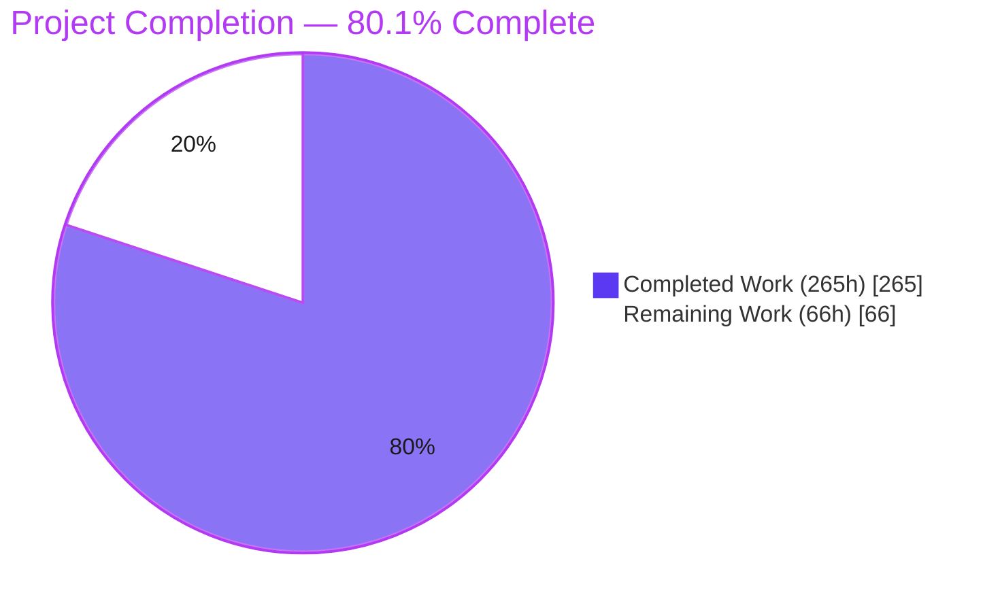
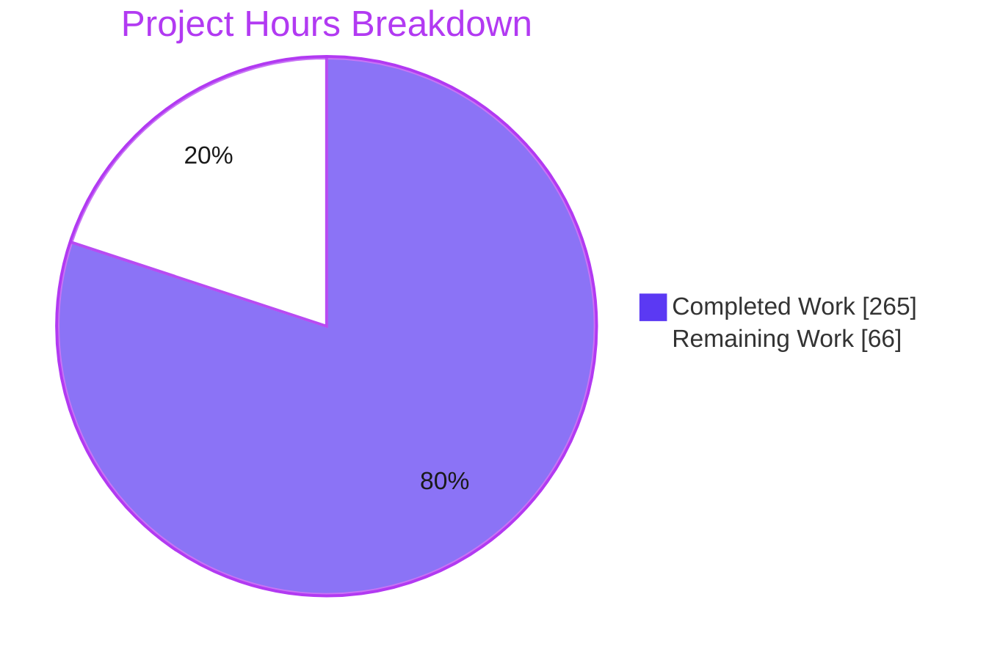
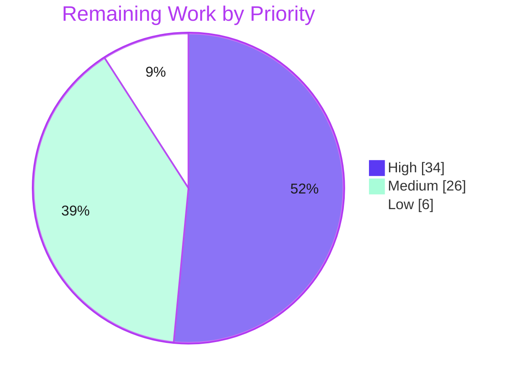
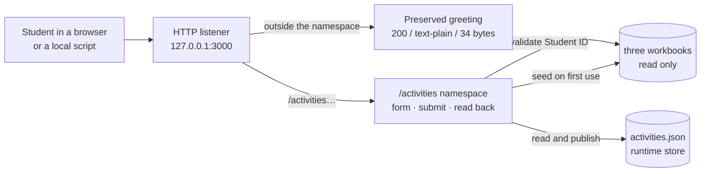

# 1. Executive Summary

## 1.1 Project Overview

Students can now record their own extracurricular activities, each one carrying the Student ID that identifies whose it is. The project gained its first request-handling surface — a browser form and a JSON endpoint on the existing listener — plus a durable activity store and a dependency-free reader that validates every submitted Student ID against the identity workbook before a write. Its users are students on the local host, and scripts reading activities back. Outside the new namespace the existing response and the loopback-only bind are unchanged, and the three workbooks stay read-only.

## 1.2 Completion Status



| Metric | Value |
| --- | --- |
| **Total Hours** | **331** |
| Completed Hours (AI + Manual) | 265 (265 AI + 0 Manual) |
| Remaining Hours | 66 |
| **Percent Complete** | **80.1%** |

265 ÷ (265 + 66) = **80.1%**. Scope is the 24 deliverables specified for this feature — all complete — plus 10 path-to-production activities. Completed = `#5B39F3`, Remaining = `#FFFFFF`.

## 1.3 Key Accomplishments

- ✅ A student submits an activity from a server-rendered form; a script posts the same as JSON.
- ✅ Every record links to a Student ID validated against `student_details.xlsx` before any write.
- ✅ Activities persist across restarts; no reader ever sees a partial document.
- ✅ A repeat is never duplicated — same student and label, any casing or Unicode form.
- ✅ The store is seeded from the workbook's activity column, so the two never disagree.
- ✅ All three workbooks stay byte-identical; their key sets and 10×21 join still hold.
- ✅ The pre-existing 34-byte greeting still answers everything outside `/activities`, byte for byte.
- ✅ 506 automated tests pass on the pinned Node 24.21.0 runtime, with zero dependencies.

## 1.4 Critical Unresolved Issues

Both requirements asked for are delivered and verified; no defect is outstanding in the feature. **10 of the 34 tracked work items remain open**, all path-to-production or accepted by design, grouped so the counts sum to 10.

| Issue | Impact | Owner | ETA |
| --- | --- | --- | --- |
| Identity is self-asserted — the service confirms a Student ID exists, never that the submitter owns it, and there is no authentication, session or forgery protection anywhere (1 item) | Blocks any deployment reachable beyond the local host, and any use with real student records. Safe today only because the bind is loopback-only and all data is synthetic | Security owner | Before first non-local deployment |
| No deployment path: no process supervision or graceful shutdown, no pipeline re-running the suite, and no release verification on a target host (3 items) | The service starts and stops by hand and a regression can land unobserved | Platform / DevOps | Sprint 1 |
| At-rest store permissions are proven on Windows only; the POSIX descriptor-mode and owner-mismatch paths have never executed (1 item) | Unknown file-permission behaviour if deployed to Linux or macOS | Backend owner | Before a POSIX deployment |
| No production observability and no automated store housekeeping: the startup line is the only signal, and the 5,000-record / 2 MiB capacity refusal has no alert ahead of it (2 items) | A full store or a fault is noticed only when a submission fails | Operations | Sprint 1–2 |
| The delivered contract extends the specification in eight places that need ratifying, and the README's short route summary omits `HEAD` (1 item) — detailed in Section 5.2 | Documentation and specification drift; no functional impact | Product / tech lead | Sprint 1 |
| Host and port are hard literals, and the submit control is 39px tall against the 44px touch-target guideline (2 items) | One instance per host; marginal mobile ergonomics | Backend / frontend | Backlog |

## 1.5 Access Issues

**No access issues identified.** `npm ci` completes against the public default registry with no authentication entry, and no credential, token or private package is needed to build, run or test. Two conditions are recorded for awareness.

| System/Resource | Type of Access | Issue Description | Resolution Status | Owner |
| --- | --- | --- | --- | --- |
| TCP port 3000 on the test host | Exclusive local bind | The port is a non-configurable literal, so the process-lifecycle test group needs it exclusively and fails fast by design when another process holds it | Not a blocker — probe, take a turn, release; closing it is the host/port task in Section 2.2 | Developer running the suite |
| `DB_HOST` environment variable | Supplied to the environment | Provided but unconsumed — this project has no database, cache or message broker, and none is needed | No action required | — |

## 1.6 Recommended Next Steps

1. **[High]** Decide the deployment posture: keep the local configuration, or add identity verification and forgery protection first (16h).
2. **[High]** Wire the pipeline — install, static gate, suite, coverage-row gate (8h).
3. **[High]** Add supervision, graceful shutdown and store provisioning, then verify the release on the target host (14h).
4. **[Medium]** Run the suite on a POSIX host to exercise the store's permission paths (6h).
5. **[Medium]** Ratify the eight contract extensions in Section 5.2 and document `HEAD` in the README summary (5h).

# 2. Project Hours Breakdown

## 2.1 Completed Work Detail

| Component | Hours | Description |
| --- | --- | --- |
| Activity store — persistence and Student ID integrity (`activity-store.js`, 3,176 lines) | 44 | Document load and validation on every read, first-use seeding from the workbook, label normalisation and canonicalisation, composite-key deduplication, single-process write mutex with a failure-tolerant tail, staged-file-and-rename publish with bounded retry, capacity ceilings, protected-destination refusal, at-rest permission restriction |
| Workbook reader (`xlsx-read.js`, 2,390 lines) | 34 | Zero-dependency OOXML reading: ZIP local-header scan, raw inflate, inline-string and numeric cell extraction, column-selective parsing, bounded reads, and ten named fail-closed refusals for packages outside the supported subset |
| HTTP intake contract (`activities.js`, 2,198 lines) | 32 | Segment-safe `/activities` namespace, three routes plus `HEAD`, method and media-type handling with route-correct `Allow`, guarded 8,192-byte body read, ordered field validation, the 15-code response envelope, and response-mode negotiation |
| Listener integration and composition seam (`server.js`, 14 → 425 lines) | 10 | Asynchronous handler, delegation inside a rejection boundary, sanitised single-line fault log, listener error handling with a non-zero exit, main-module guard, and the exported `{ server, hostname, port }` seam |
| Submission form and result pages | 8 | Inline server-rendered markup with no static asset or client script: labelled controls, escaped interpolation, outcome-as-text, visible focus indicator, and a responsive single-column layout |
| Runtime pin, manifest, lockfile and ignore policy | 3 | `package.json` with the engines pin, `start`/`test` scripts, zero dependencies and no `"type"` field; generated root-only lockfile; `.nvmrc`; six-pattern `.gitignore` |
| Operator and contract documentation (`README.md`, 1 → 831 lines) | 12 | Prerequisites, the install/start/test sequence, worked `curl` examples, the authoritative response matrix, the data model, configuration, capacity limits with a pruning runbook, and testing guidance |
| Store and reader test suite (`test/store.test.js`, 218 cases) | 30 | Initial states, seeding, normalisation, deduplication, the loader refusal table, write mechanics under concurrency, reader refusals against malformed fixtures, and the workbook invariants |
| Endpoint contract test suite (`test/activities.test.js`, 234 cases) | 26 | Every row of the response matrix in both request modes, validation precedence, the body-cap boundary, idempotency and provenance, escaping, and the rejection boundary through the composed server |
| Process lifecycle test suite (`test/lifecycle.test.js`, 54 cases) | 14 | Real spawned process: readiness line, byte-level preserved response, namespace-boundary lookalikes, bind-failure disposition, and continued service after an induced store fault |
| Runtime acceptance, regression-gold and coverage evidence | 12 | Live exercise of every route and failure code, the gold digest checks on preserved paths, browser verification of the form and its failure pages, and the coverage plus JUnit evidence run |
| Cross-cutting hardening | 40 | Security, performance, accessibility and observability work across the feature: fail-closed reader refusals, at-rest store protection, Unicode-safe deduplication, `HEAD` conformance, bounded publish retry with read coordination, sanitised diagnostics, and the focus/layout corrections |
| **Total** | **265** | |

## 2.2 Remaining Work Detail

| Category | Hours | Priority |
| --- | --- | --- |
| Identity verification and request-forgery protection before any off-host exposure or real data | 16 | High |
| Deployment, process supervision, graceful shutdown and store-directory provisioning | 10 | High |
| Pipeline wiring: install, static gate, suite and the coverage-row gate, with port serialisation | 8 | High |
| POSIX host verification of the store's descriptor-mode and owner-mismatch paths | 6 | Medium |
| Production observability: health endpoint, request-logging and metrics decision | 6 | Medium |
| Specification and README reconciliation of the delivered contract (Section 5.2) | 5 | Medium |
| Store operations: pruning automation and alerting on the capacity warning | 5 | Medium |
| Release verification on the target host against the documented acceptance sequence | 4 | Medium |
| Externalise host and port | 3 | Low |
| Accessibility polish: 44px touch target and client-side validation interaction | 3 | Low |
| **Total** | **66** | |

## 2.3 Estimation Basis

Hours are assigned per deliverable and summed, not derived from a percentage. Completed hours follow the delivered artifact: a complex module of 2,000–3,400 lines with its own failure vocabulary is costed at 32–44 hours, a test suite at roughly 30–40% of the module it covers, documentation and packaging at their authored size, and the cross-cutting hardening as one line because it spans every module rather than sitting in one. Remaining hours use the same framework: configuration and wiring at 3–8 hours, an integration or verification pass at 4–10, and an authentication design at 16. Confidence is **high** for the completed column, which is measured against code that exists and tests that run; **high** for the configuration and verification items remaining; and **medium** for identity verification, whose cost depends on the mechanism chosen. Completed 265 + remaining 66 = 331 total hours, the figure used in Sections 1.2 and 7.

# 3. Test Results

The whole suite was executed for this report with the project's own documented command, `npm test` (`node --test --test-concurrency=1`, no positional argument), on Node v24.21.0: **506 tests, 65 suites, 506 passed, 0 failed, 0 cancelled, 0 skipped, 0 todo**, exit 0, 11.2 seconds, the runner exiting on its own. A second run added `--experimental-test-coverage` and the JUnit reporter; the report carries 506 test cases with zero failures, and `server.js` appears as a row in the per-file coverage table rather than the empty table a mis-scoped include pattern produces.

| Area / Category | Framework | Tests | Passed | Failed | Coverage | What This Proves |
| --- | --- | --- | --- | --- | --- | --- |
| Endpoint contract — routes, methods, media types, validation, envelopes | `node:test` (in-process, ephemeral port) | 234 | 234 | 0 | 98.01% lines (`activities.js`) | Every documented response — 200, 201, and each of the 15 failure codes — is what the service actually returns, in both JSON and form modes |
| Store persistence and Student ID integrity | `node:test` | 218 | 218 | 0 | 96.50% lines (`activity-store.js`) | An activity survives a restart, links only to a real student, and is never duplicated or lost under concurrent submissions |
| Workbook reader and reference data | `node:test` | included above | — | 0 | 92.85% lines (`xlsx-read.js`) | The identity key set is read correctly with no dependency, and a package outside the supported subset is refused by name rather than silently misread |
| Process lifecycle and preserved behaviour | `node:test` (real spawned process) | 54 | 54 | 0 | 88.02% lines (`server.js`) | The service starts with one readiness line, keeps the pre-feature response byte-identical outside the namespace, reports a failed bind, and keeps serving after a store fault |
| Workbook invariants | `node:test` | included above | — | 0 | — | The three workbooks stay byte-identical and their key sets and 10×21 join still hold after submissions; the runtime store stays untracked |
| **Whole suite** | `node:test` / `node:assert` | **506** | **506** | **0** | **95.41% lines, 88.54% branches, 96.59% functions** | The delivered feature behaves as documented on the pinned runtime, with no third-party test dependency |

**Not Covered**

- **The POSIX legs of the store's at-rest protection.** The descriptor mode-change and the owner-mismatch refusal are gated off on a Windows host, so they have never executed. A human should run the suite on Linux or macOS before deploying there and confirm the published store is owner-only.
- **The listener error body and the `listen` block in `server.js`.** These run only in a spawned process, so they contribute nothing to in-process coverage — that is why `server.js` sits at 88.02% lines and 62.50% branches. Their behaviour is asserted through a real child process instead, but a coverage gate demanding 100% on this file would be unachievable by design.
- **Defensive branches that no fixture can reach.** A handful in each module: log-sanitiser fallbacks for a non-string request target or an unrecognised method token, reader translations of filesystem errnos that need privileged or hostile filesystem state, the staging-close cleanup, the read-drain timeout, and the third staging-open attempt. Each fails closed to an outcome that *is* covered, so the risk is confined to their diagnostic wording.
- **Prose.** Comments and `README.md` are not executable. Their claims were checked against the code and the running service by hand; nothing asserts them automatically, so an edit to either can drift.
- **Everything else delivered is covered.** All three routes, the full failure vocabulary, seeding and provenance, deduplication, the body-size boundary, escaping, the write mutex under concurrency and the workbook invariants each have executable cases that were observed passing.

# 4. Runtime Validation & UI Verification

Every line below was observed against the real service started with `npm start` and driven over HTTP and in a real browser, not inferred from code.

- ✅ **Start-up** — `node server.js` prints exactly one line, `Server running at http://127.0.0.1:3000/`, with stderr silent for the whole session; the bind stays loopback-only.
- ✅ **Preserved greeting** — `GET /` returns 200, `text/plain` with no charset, 34 bytes, sha256 `6bdf54b2…3bbb10`; `/nonsense`, `/activities-old`, `/activitieslist` and `/index.html` return the identical status, length and digest.
- ✅ **Submission form** — `GET /activities` returns `text/html; charset=utf-8`; the page renders one `<h1>`, two labelled inputs and a submit button, issues exactly one network request, logs nothing to the console, and does not scroll horizontally at a 375×812 viewport.
- ✅ **Create an activity** — a native form submission of `S004` / `Chess Club` returns 201 and reports "Recorded Chess Club for S004."; the JSON route returns 201 with `Location: /activities/S001` and a record carrying `source: "submission"` and a server-set timestamp.
- ✅ **Repeat submission** — the identical pair returns 200 with "already submitted … so nothing was added", the original timestamp preserved; a casing variant behaves the same, and read-back still shows a single record.
- ✅ **Read back** — `GET /activities/S004` returns JSON holding the workbook-seeded activity (`source: "workbook"`, no timestamp) alongside the submission, and exactly those two records.
- ✅ **Failure vocabulary** — observed with the two-field envelope: 404 unknown student, 400 malformed or missing Student ID, 400 invalid activity, 400 unparseable or non-object JSON, 415 for an unaccepted or absent `Content-Type`, 405 with `Allow: GET, HEAD, POST` on the collection and `Allow: GET, HEAD` on an item, 404 for an unresolved namespace path.
- ✅ **Body-size guard** — 8,192 bytes is read then rejected on content, 8,193 bytes returns 413, and a 5 MB body returns 413 with the service answering the next request normally.
- ✅ **Failure pages and escaping** — each actionable form failure re-displays the submitted values with the field at fault carrying `aria-invalid="true"` and `aria-describedby` pointing at the message; an `` label is stored and re-rendered as escaped text with no element created, no dialog and no request for its payload. Tab order runs Student ID → Activity → Add activity with a visible 2px focus ring.
- ✅ **Store at rest** — the published document holds the ten seeded records plus submissions with correct provenance, no staging file is left behind, the file carries a single owner-only permission entry, and the workbooks remain byte-identical with key sets 10/10/10 and a 10×21 join.

**Not exercised at runtime:** the service has never been run on a POSIX host, so its file-permission behaviour there is unobserved; it has never been started under a process supervisor or exposed beyond loopback; and no external integration exists to exercise — the feature reads local spreadsheet files and writes one local JSON document, with no database, cache, queue or third-party service anywhere in the project.

# 5. Compliance & Quality Review

## 5.1 Compliance Matrix

Verified status as it stands now, one row per deliverable group.

| # | Deliverable | Benchmark | Status | Progress | Evidence |
| --- | --- | --- | --- | --- | --- |
| 1 | Students can add activities (R1) | Functional completeness | ✅ Pass | 100% | Form and JSON intake both return 201 and persist; 234 endpoint cases |
| 2 | Every record links to a Student ID (R2) | Referential integrity | ✅ Pass | 100% | Format and key-set checks refuse `s1` with 400 and `S999` with 404 before any write |
| 3 | Durable, consistent persistence | Data integrity | ✅ Pass | 100% | Staged-write-and-rename, single-writer mutex, no staging leftovers, restart round-trip covered |
| 4 | Store seeded from the workbook column | Single source of truth | ✅ Pass | 100% | Ten seeded records with `source: "workbook"` and no fabricated timestamp |
| 5 | Workbooks never written | Non-destructive change | ✅ Pass | 100% | `git status --porcelain -- '*.xlsx'` empty after full exercise; key sets 10/10/10, join 10×21 |
| 6 | Pre-existing behaviour preserved | Regression safety | ✅ Pass | 100% | 34-byte gold digest matches on `/`, three namespace lookalikes and `/index.html` |
| 7 | Error vocabulary and status discipline | API contract | ✅ Pass | 100% | 15 codes in a uniform two-field envelope; route-correct `Allow`; documented matrix matches observed behaviour |
| 8 | Input safety: body cap, escaping, prototype safety | Security | ✅ Pass | 100% | 413 at 8,193 bytes and at 5 MB with the process surviving; markup payloads rendered escaped |
| 9 | Zero third-party dependencies, CommonJS, runtime pinned | Supply-chain and packaging | ✅ Pass | 100% | Empty dependency sets, no `"type"` field, engines `>=24.21.0 <25.0.0`, `npm ci` downloads nothing |
| 10 | Test suite and documented commands (rule areas 4 and 5) | Verifiability | ✅ Pass | 100% | 506/506 on the documented invocation; README carries the working command sequence |
| 11 | Minimal change discipline (rule area 6) | Scope control | ✅ Pass | 100% | 12-file patch, 16 tracked files, one added directory, no framework, host and port still literals |
| 12 | Accessibility and UI semantics | Usability | ⚠ Partial | 90% | Labels, `lang`, escaping, focus ring and error linkage all verified; the 39px submit control is under the 44px touch-target guideline |
| 13 | Authentication and request-forgery protection | Production security | ❌ Not delivered (by design) | 0% | None exists; identity is self-asserted and the loopback bind plus synthetic data are the only controls |
| 14 | Deployment, supervision and automated re-verification | Path to production | ❌ Not delivered | 0% | No supervisor, no graceful shutdown, no pipeline; the startup line is the only runtime signal |

## 5.2 AAP & Rule Divergences and Gaps

Eight departures from the plan were established. Each ships working code; each is recorded because the agreed specification said something else and a reader is entitled to know. None is a defect in the delivered behaviour, and the single user-specified rule — the six-area coverage mandate — is satisfied in full.

| # | What the AAP/Rule Required | What Was Delivered Instead | Why It Diverged | Impact | Remediation |
| --- | --- | --- | --- | --- | --- |
| 1 | `405` for "any method other than `GET`" on a read route, with `Allow: GET` / `GET, POST` | `HEAD` is answered on both read routes; `Allow` reads `GET, HEAD` and `GET, HEAD, POST` (`activities.js:186`, `:194-195`). Absolute-form request targets keep the preserved fall-through | RFC 9110 makes `GET` and `HEAD` mandatory for a general-purpose server and the plan never names `HEAD`; the service already answered `HEAD /` with 200, leaving the namespace the sole inconsistency | Additive. Two expected `Allow` values in the plan's acceptance table are now stale | Ratify the two `Allow` values and add `HEAD` to the README's short route summary |
| 2 | The reader declares five refusal codes, and `readSheetRows(filePath, partName)` | Ten named refusal codes, and an optional third `columnLetters` parameter (`xlsx-read.js:2364`) | Fail-closed refusals were needed for malformed XML, invalid encoding, resource ceilings, unsupported cell types and caller faults; column selection limits how much personal data is parsed at all | None outward: the four exports and their arities are unchanged, and every reader fault still reaches a client as one fixed message | Update the specification's code table to ten |
| 3 | Normalisation is exactly trim, collapse whitespace, reject control characters, bound 1–60, preserve casing | An invisible-character strip plus Unicode NFC runs first (`activity-store.js:678`, `:971`), and a tab is collapsed as whitespace rather than refused | The plan names case-insensitive deduplication as *the* defence for a free-text column, and the enumerated rules alone leave that defence defeatable; the tab change aligns the code to the plan's own stated ordering | Behaviour is a superset. A store file predating this rule that holds such a label answers `500 store_unreadable` until corrected | Ratify the canonical form; the README carries the delete-to-reseed runbook |
| 4 | The rejection boundary answers `{"error":"internal_error"}`, logging the error object and `req.url` | The two-field `{ error, message }` envelope (`server.js:242`) and one fixed-shape sanitised log line (`server.js:404`) | The plan's own authoritative matrix admits exactly one error shape and governs over its illustrative bodies; the sketched log would emit stack frames, absolute paths and a cause chain carrying the store path | Clients see one envelope everywhere. Operators do not get a stack from this line; the fault name and code are there | None required; correct the two illustrative bodies in the specification |
| 5 | Four store refusal codes, with `store_write_failed` triggered by a failed write or rename | Capacity ceilings of 5,000 records / 2 MiB with a distinct `store_at_capacity` outcome (`activity-store.js:456`, `:462`, `:785`), plus a load-time refusal when the configured store path names a protected file (`:155`) | The plan declared no ceilings and no disposition for a store path aimed at a workbook or `LICENSE`; refusing at load guarantees nothing is staged over a workbook | A full store refuses submissions rather than growing unbounded; a misconfigured path stops start-up instead of failing per request | Ratify both, and add the capacity alert listed in Section 2.2 |
| 6 | Exactly sixteen CSS declarations and no icon asset | Twenty-three declarations — all sixteen preserved at their exact values and the palette still the specified six colours — plus a zero-byte icon link (`activities.js:605-612`, `:693`) | Without the seven additions the form overflows its container at narrow widths, the controls do not carry the specified typeface, and keyboard focus is invisible; the icon link removes a second request without adding a file | Positive and measured: no horizontal scroll at 375px, a 2px focus ring, and one request per page view | Update the style inventory to twenty-three declarations |
| 7 | Exactly one environment read, and reads deliberately outside the write mutex | A second read of `SystemRoot` to locate the platform ACL tool absolutely (`activity-store.js:2448-2451`), and reads held off for the duration of the publishing rename (`:2802`) | Node exposes no ACL API and a bare tool name is hijackable from `PATH`; Windows refuses a rename while a reader holds the destination, so the atomicity guarantee could not otherwise hold | No new configuration knob; read latency measured at 0.565 ms median, inside the plan's own baseline | Ratify, or move the tool lookup behind a platform module later |
| 8 | The README reproduces the plan's command block verbatim | Step 1's version-manager pair is conditional behind a `node --version` check (`README.md:46-51`, `:72-73`) and the frozen-install claim is narrowed to what it checks (`:75`) | The block as written fails at its first command on a host with no version manager, and rule area 5 makes "running the code" a deliverable that must actually work | The documented sequence succeeds as written; it is no longer a character-for-character copy | Fold the conditional form back into the specification |

**1 — HTTP method conformance.** A general-purpose HTTP server must answer `HEAD` wherever it answers `GET`, and this one already does so on the greeting path; leaving the new namespace as the exception would make the service inconsistent with itself. `HEAD` on both read routes returns the same headers as `GET` with a zero-length body, confirmed at runtime, and the two `Allow` values name it. Absolute-form targets are a narrower decision: the namespace is matched literally, the bind is loopback-only with no intermediary, and such a target receives exactly what it received before the feature existed. Decide whether a proxy is ever likely; if so, routing absolute-form becomes a deliberate, tested change.

**2 — Reader contract.** The reader's own governing principle is that silently mishandling an unsupported package is worse than refusing it, and holding the vocabulary at five codes would force several genuinely different faults — malformed XML, invalid encoding, an oversized package or part, an unsupported cell type, a caller passing the wrong type — to share one code, which makes them untestable case by case. Ten named codes exist and each is asserted individually. Nothing leaks outward: the store maps every reader fault to one internal code and the service answers `500 reference_data_unavailable` with a fixed sentence. The optional `columnLetters` parameter leaves `Function.length` at 2, so no existing caller changes.

**3 — Label canonicalisation.** Deduplication is the only defence this feature has against a free-text column filling with near-duplicates, and the enumerated rules alone leave it defeatable: `Robotics`, a zero-width-spaced `Robotics` and a BOM-prefixed variant would each count as a distinct activity, as would the composed and decomposed spellings of `Café Club`. Stripping invisible formatting characters and applying NFC ahead of the specified steps closes that, and the ordering matters — stripping after collapsing leaves a doubled space the loader then refuses. The honest cost, documented in code and README, is that emoji ZWJ sequences are flattened and a Persian or Hindi ZWNJ is dropped. If such labels are ever needed, deduplication needs a different strategy.

**4 — Failure envelope and fault log.** One error shape is worth more than two, and the shape the authoritative matrix mandates is `{ error, message }` with a fixed sentence per code — a bare `error` key on the rejection boundary would leave clients special-casing the one failure they can least anticipate. The body is a frozen constant whose sentence is a literal, never derived from the thrown value. The log line follows the same reasoning: the sketched form would print stack frames with absolute source paths and follow a cause chain carrying the configured store path and record values. What it emits instead is an event code, the method, a bounded pathname, and the fault's name and code.

**5 — Store ceilings and protected paths.** A JSON document rewritten whole on every change cannot grow without bound, and the plan set no limit, so one was chosen: 5,000 records or 2 MiB, whichever is met first, answered with a distinct `store_at_capacity` code rather than folded into the generic write failure — a full store and an unwritable directory are different operator problems. A warning latches at 4,500 records, and the README carries a pruning runbook. Separately, a store path naming one of the workbooks or `LICENSE` is refused at load with a message naming the variable, so the process exits rather than staging data over a read-only artifact.

**6 — Stylesheet and page head.** The sixteen declarations the plan fixed are all present at exactly their specified values, and the palette is still the specified six colours — nothing was swapped. The seven additions are enabling: `box-sizing`, so a full-width input stops overflowing its container at 375px and 412px; `font: inherit`, so the controls carry the specified typeface; an input colour and button border for contrast; a `label` display for the specified gap; and a focus outline pair, without which a keyboard user has no visible indicator. The icon link is markup with a zero-byte payload: it adds no file and removes a second request, both confirmed in the browser.

**7 — Platform adaptations.** Both are Windows-specific and both fail closed. Node exposes no API for Windows ACLs, so the in-box tool has to be located; naming it bare would let `PATH` or the working directory decide which executable runs, so it is resolved absolutely through the platform's own directory variable. This adds no tunable knob — a wrong value makes writes refuse rather than weaken. The publish window is narrower still: a read waits only for the rename syscall, because Windows will not rename over a file a reader holds, and without that wait the atomic-replacement guarantee could not be delivered at all. Measured read latency stays inside the plan's baseline.

**8 — Documentation and evidence commands.** The specification's sequence opens with a version-manager invocation, and this project ships on a host that installs the pinned runtime directly and deliberately has no version manager — so a reader following it verbatim meets `command not found` at the first step with no way to tell whether that matters. The README checks `node --version` first, keeps the version-manager path as an explicit conditional, and states plainly that its absence is not a failure of this project. The frozen-install sentence is narrowed to what the command actually verifies. Two rows of the plan's acceptance table can also no longer be observed as written; they are listed in the ratification task.

# 6. Risk Assessment

Forward-looking risks only — what could still go wrong in production.

| Risk | Category | Severity | Probability | Mitigation | Status |
| --- | --- | --- | --- | --- | --- |
| Identity is self-asserted: the service confirms a Student ID exists but never that the submitter owns it, so any local process can submit or read on any student's behalf | Security | High | High if exposed beyond loopback | Two load-bearing conditions hold today — the loopback-only bind and wholly synthetic data. Identity verification is a prerequisite before either changes | Accepted and documented |
| The native form carries no request-forgery protection, so another page in a local browser could post on a user's behalf | Security | Medium | Low | Held by the same two conditions; forgery protection belongs with an authenticated design rather than a header check | Accepted and documented |
| Read cost is linear in store size by design — the document is parsed and fully validated on every request — with a hard refusal at 5,000 records or 2 MiB | Technical | Medium | Medium | Measured at ~85–93 requests/sec and ~559 ms median at 50 concurrent readers against a 4,900-record store; a warning latches at 4,500 records and the README carries a pruning runbook | Open, mitigation documented |
| The write mutex is single-process: a process outside the service holding the store file open continuously makes submissions fail once three bounded rename attempts are spent | Operational | Medium | Low | The previous document stays intact and a retry is safe; cross-process locking is required before any second writer | Accepted |
| Host and port are hard literals and there is no graceful-shutdown handler, so one instance runs per host and the process must be stopped by signal | Operational | Medium | High on any managed deployment | Externalise both and run under a supervisor with a restart policy | Open |
| Nothing re-runs the 506-case suite automatically, and the running service emits no signal beyond its startup line — no health endpoint, request log or metric | Operational | Medium | Medium | Wire the documented invocation plus the coverage-row gate into a pipeline, and decide the observability surface before production | Open |
| The store's at-rest permission restriction is proven on Windows only; the POSIX descriptor-mode and owner-mismatch paths have never run | Security | Medium | Medium on a POSIX deployment | Run the suite on Linux or macOS and confirm the published store is owner-only before deploying there | Open |
| Reference data is read straight from the workbooks, so one replaced or regenerated outside the reader's supported subset makes every submission fail until corrected | Integration | Medium | Low | The reader refuses fail-closed by name and caches no partial key set; treat the three workbooks as read-only release artifacts and re-run the suite after any change | Accepted |

# 7. Visual Project Status

**Overall progress — 80.1% complete.** Completed = Dark Blue `#5B39F3`; Remaining = White `#FFFFFF`; headings and accents Violet-Black `#B23AF2`; highlight Mint `#A8FDD9`.



**Remaining 66 hours by priority.**



**Remaining hours per category**

| Category | Hours | Share of remaining |
| --- | --- | --- |
| Identity verification and forgery protection | 16 | 24.2% |
| Deployment, supervision and shutdown | 10 | 15.2% |
| Pipeline wiring | 8 | 12.1% |
| POSIX host verification | 6 | 9.1% |
| Production observability | 6 | 9.1% |
| Specification and README reconciliation | 5 | 7.6% |
| Store operations and capacity alerting | 5 | 7.6% |
| Release verification on the target host | 4 | 6.1% |
| Externalise host and port | 3 | 4.5% |
| Accessibility polish | 3 | 4.5% |
| **Total** | **66** | **100%** |

**Delivered surface at a glance**



# 8. Summary & Recommendations

Both things that were asked for are done. A student can add an extracurricular activity — from a form in a browser or by posting JSON — and every stored record carries a Student ID that was checked against the identity workbook before the write happened. Getting there meant building the project's first request-handling surface, its first persistence, and its first reader for the spreadsheet data: four modules totalling roughly 8,200 lines, a 506-case test suite, and 831 lines of operator documentation, all with zero third-party dependencies on a pinned Node 24.21.0 runtime. The work landed as 13 commits across exactly the 12 files it was scoped to touch, and the repository still has 16 tracked files and one directory beyond the flat root.

What was verified matters as much as what was built. The whole suite passes — 506 of 506, no skips — and every route, every one of the fifteen failure codes, the body-size boundary, idempotency, provenance, HTML escaping and the store's at-rest state were exercised against a live service and confirmed by hand for this report. The form was driven in a real browser, including each of its failure pages and a markup-injection payload that renders as inert text. Just as importantly, nothing that already worked was disturbed: the pre-feature greeting still answers every path and method outside `/activities` with the same 34 bytes and the same digest, the three workbooks are byte-identical after any amount of use, their key sets and 10×21 join still hold, and the runtime store stays out of version control.

**The project is 80.1% complete against its scope** — 265 hours delivered of 331 — and the shape of the remaining 66 hours is worth being precise about. None of it is unfinished feature work; all 24 feature deliverables are done. It is the path to production: deciding the deployment posture, wiring a pipeline, supervising the process, verifying the file-permission behaviour on a POSIX host, choosing an observability surface, automating store housekeeping, and ratifying the eight places where the delivered contract sensibly extends the specification.

The critical path runs through one decision, not a list of tasks. **If the service stays where it was designed to live — one local instance, synthetic data, reachable only from the host — it is releasable now**, and the honest next steps are the pipeline, supervision and a release verification on the target host, about 22 hours. **If it is to be reachable from anywhere else, or to hold real student records, then identity verification and request-forgery protection are prerequisites, not improvements.** Nothing in the current design authenticates anyone; the loopback bind and the synthetic data are the only controls, and both are documented as load-bearing. That decision should be made before any other remaining work is scheduled, because it changes what the rest of it looks like.

Success after this point is measurable with what already exists: the suite green on every change in a pipeline rather than on a developer's machine, the gold digest checks and workbook invariants re-confirmed on the deployed build, the store's capacity warning wired to an alert so the 5,000-record refusal is never met in service, and — if the service ever leaves the local host — no submission accepted without an authenticated principal behind the Student ID. Production readiness today is **conditional: ready for the supported local configuration, not ready for a networked or real-data deployment.**

# 9. Development Guide

Every command below was executed on a clean checkout of this branch and behaved as shown. Commands are given for PowerShell on Windows; the same commands work unchanged in a POSIX shell except where noted.

## 9.1 System Prerequisites

| Requirement | Value | How to check |
| --- | --- | --- |
| Node.js | 24.21.0 or any later 24.x (`engines: ">=24.21.0 <25.0.0"`) | `node --version` → `v24.21.0` |
| npm | Bundled with that runtime | `npm --version` → `11.19.0` |
| Third-party packages | **None.** Zero dependencies and zero dev dependencies | `npm ci` downloads nothing and creates no `node_modules` |
| Build toolchain | **None.** No compiler, bundler or transpiler | `node --check <file>` is the whole static gate |
| Database / cache / broker | **None required.** A `DB_HOST` variable may be present in the environment; nothing reads it | — |
| Free TCP port | `127.0.0.1:3000`, exclusively | See the pre-flight probe in 9.4 |
| Disk | A writable directory for the activity store (a few KB) | See 9.3 |

A version manager is optional. `.nvmrc` pins `24.21.0` for hosts that have one; if `node --version` already prints `v24.21.0`, there is nothing to select and `nvm: command not found` is not a failure of this project.

## 9.2 Install

```bash
# from the repository root
npm ci
```

Expected output: `up to date in <n>ms`, exit code 0. This is a frozen install and a manifest-to-lockfile presence check; with zero dependencies it downloads nothing. Use `npm install` only if you are regenerating the lockfile.

Static gate — there is no build step, so this is what stands in for compilation:

```bash
node --check server.js
node --check activities.js
node --check activity-store.js
node --check xlsx-read.js
node --check test/activities.test.js
node --check test/store.test.js
node --check test/lifecycle.test.js
```

Each exits 0 silently. To confirm the manifests parse:

```bash
node -e "JSON.parse(require('node:fs').readFileSync('package.json','utf8')); JSON.parse(require('node:fs').readFileSync('package-lock.json','utf8')); console.log('manifests OK')"
```

## 9.3 Environment Configuration

One variable, and it is optional.

| Variable | Default | Notes |
| --- | --- | --- |
| `ACTIVITY_STORE` | `activities.json` beside `server.js` (git-ignored) | Absolute path to the activity store. Its **directory must already exist and be writable**, or a submission that needs to persist a new record answers `500 store_write_failed`. The staging file is the resolved path plus `.tmp`, so both live in the same directory. Resolved once at start-up — changing it mid-process has no effect. A path naming one of the workbooks or `LICENSE` is refused at start-up |

Point it outside the working tree so submissions never land in the checkout:

```powershell
# PowerShell: environment variables do not persist between commands — set them inline
New-Item -ItemType Directory -Force -Path C:\ProgramData\student-simple\store | Out-Null
$env:ACTIVITY_STORE='C:\ProgramData\student-simple\store\activities.json'; npm start
```

```bash
# POSIX equivalent
mkdir -p /var/lib/student-simple/store
ACTIVITY_STORE=/var/lib/student-simple/store/activities.json npm start
```

## 9.4 Start the Service

Probe the port first — the bind is a fixed literal, so a held port is a start-up failure rather than a fallback:

```bash
node -e "const n=require('node:net'),s=n.createServer();s.once('error',e=>{console.error('port 3000 unavailable ('+e.code+')');process.exit(1)});s.once('listening',()=>s.close(()=>process.exit(0)));s.listen(3000,'127.0.0.1')"
```

Exit 0 means the port is free. Then:

```bash
npm start           # equivalently: node server.js
```

Expected output — exactly one line, and nothing on stderr:

```text
Server running at http://127.0.0.1:3000/
```

The bind is loopback-only and enforced: the host's routable addresses refuse connections on port 3000. Use `http://127.0.0.1:3000` or `http://localhost:3000`.

There is no graceful-shutdown handler. Stop the service by the process that owns the port:

```powershell
Stop-Process -Id (Get-NetTCPConnection -LocalPort 3000 -State Listen).OwningProcess -Force
```

```bash
# POSIX
kill "$(lsof -ti :3000)"
```

## 9.5 Run the Tests

```bash
npm test            # = node --test --test-concurrency=1
```

Expected tail: `tests 506 / suites 65 / pass 506 / fail 0 / cancelled 0 / skipped 0 / todo 0`, exit 0, the runner exiting on its own in about 11 seconds.

Two things about this command are not interchangeable:

- **Pass no positional argument.** `node --test test/` treats the directory as a module, exits 1 and runs nothing; a quoted glob is not portable to `cmd.exe`. Node's own discovery finds the three files.
- **Keep `--test-concurrency=1`.** The process-lifecycle file binds the literal port 3000, so two test files running at once collide.

A reported `tests 0` means discovery went wrong, not that the suite is green.

Individual files, when you want a narrower signal (the first two need no port):

```bash
node --test --test-concurrency=1 test/store.test.js         # 218 tests
node --test --test-concurrency=1 test/activities.test.js    # 234 tests
node --test --test-concurrency=1 test/lifecycle.test.js     # 54 tests, needs port 3000
```

Coverage and a machine-readable report — write them to a directory outside the checkout, because a stray report filename is not covered by the ignore policy:

```powershell
New-Item -ItemType Directory -Force -Path C:\ProgramData\student-simple\evidence | Out-Null
node --test --test-concurrency=1 --experimental-test-coverage `
     --test-reporter=spec  --test-reporter-destination=stdout `
     --test-reporter=junit --test-reporter-destination=C:\ProgramData\student-simple\evidence\results.xml
```

Observed: 95.41% lines, 88.54% branches, 96.59% functions, and 506 test cases in the JUnit file. When gating on coverage, assert that **`server.js` appears as a row** in the per-file table — an include pattern that matches no in-process file prints an empty table and still reports success.

## 9.6 Example Usage

```bash
A=http://127.0.0.1:3000/activities

# Submit as the browser form does
curl -i -X POST "$A" -H 'Content-Type: application/x-www-form-urlencoded' \
  --data-urlencode 'studentId=S001' --data-urlencode 'activity=Chess Club'
# → 201, Location: /activities/S001, an HTML confirmation page

# Submit as a script does
curl -i -X POST "$A" -H 'Content-Type: application/json' \
  -d '{"studentId":"S001","activity":"Chess Club"}'
# → 200 {"created":false,...} the second time: same student, same label, nothing added

# Read one student's activities
curl -s "$A/S001"
# → {"studentId":"S001","activities":[{...,"source":"workbook"},{...,"source":"submission","submittedAt":"..."}]}

# The form itself
curl -s -D- -o /dev/null "$A"        # → 200, text/html; charset=utf-8

# Unchanged pre-existing behaviour
curl -s http://127.0.0.1:3000/ | wc -c   # → 34
```

Valid Student IDs are `S001` through `S010`. Failure responses carry `{"error":"<code>","message":"<sentence>"}`:

| Request | Response |
| --- | --- |
| Unknown student, e.g. `S999` | `404 student_not_found` |
| Malformed ID, e.g. `s1` or a number | `400 student_id_malformed` |
| Missing `studentId` | `400 student_id_required` |
| Missing, empty or over-60-character activity | `400 activity_invalid` |
| Unparseable JSON / JSON that is not an object | `400 malformed_json` / `400 body_not_an_object` |
| Body over 8,192 bytes | `413 payload_too_large` |
| `Content-Type` absent or not one of the two accepted types | `415 unsupported_media_type` |
| Wrong method | `405 method_not_allowed` with `Allow: GET, HEAD, POST` (collection) or `Allow: GET, HEAD` (item) |
| Unresolved path inside the namespace | `404 not_found` |

There is **no authentication** — no login, session, cookie or token. The Student ID is taken from the request and checked only for existence.

## 9.7 Verification and Troubleshooting

Quick health check after any change:

```bash
npm ci && npm test                      # 506/506
curl -s http://127.0.0.1:3000/ | wc -c  # 34 — the preserved greeting
git status --porcelain -- '*.xlsx'      # empty — the workbooks are read-only
```

| Symptom | Cause | Resolution |
| --- | --- | --- |
| `port 3000 unavailable (EADDRINUSE)`, or the lifecycle group fails its pre-flight | Another process holds the fixed port | Release it and retry; do not kill an unrelated process. The port is not configurable today |
| `tests 0` reported and exit 0 | A positional argument or glob was passed to the runner | Use `npm test` with no argument |
| Every submission answers `500 store_write_failed` | The `ACTIVITY_STORE` directory does not exist, is not writable, or another process holds the file open | Create the directory and grant write access; check for a process holding the store |
| A submission answers `500 store_at_capacity` | The store reached 5,000 records or 2 MiB | Prune the store as described in the README; a warning is logged from 4,500 records |
| Every read and write answers `500 store_unreadable` | The store file was hand-edited, or was written by an earlier build in a non-canonical form. It is never overwritten in this state | Inspect it — it is plain JSON — then correct the offending record, or delete the file and let it re-seed from the workbook |
| Every submission answers `500 reference_data_unavailable` | A workbook is missing, or was replaced with a package outside the reader's supported subset | Restore the workbook from version control; it is read-only by design |
| The process exits at start-up naming `ACTIVITY_STORE` | The configured path names a workbook or `LICENSE` | Point the variable at a path of its own |
| `nvm: command not found` on step 1 | No version manager on the host | Not a failure — confirm `node --version` is `v24.21.0` and continue with `npm ci` |
| A JSON or commit-message file behaves oddly after editing in PowerShell | `Set-Content -Encoding UTF8` and `Out-File -Encoding utf8` prepend a byte-order mark | Write with `[IO.File]::WriteAllText($path, $text, (New-Object System.Text.UTF8Encoding($false)))` |

# 10. Appendices

## A. Command Reference

| Purpose | Command | Expected result |
| --- | --- | --- |
| Check the runtime | `node --version` | `v24.21.0` |
| Frozen install | `npm ci` | `up to date`, exit 0, no `node_modules` |
| Static gate (per file) | `node --check <file>` | exit 0, no output |
| Start the service | `npm start` | one line: `Server running at http://127.0.0.1:3000/` |
| Port pre-flight | `node -e "const n=require('node:net'),s=n.createServer();s.once('error',e=>process.exit(1));s.once('listening',()=>s.close(()=>process.exit(0)));s.listen(3000,'127.0.0.1')"` | exit 0 when free |
| Whole suite | `npm test` | 506 pass, 0 fail, exit 0 |
| One suite | `node --test --test-concurrency=1 test/store.test.js` | 218 pass |
| Coverage + JUnit | `node --test --test-concurrency=1 --experimental-test-coverage --test-reporter=spec --test-reporter-destination=stdout --test-reporter=junit --test-reporter-destination=<dir>/results.xml` | 95.41% lines; `server.js` present as a row |
| Stop the service (Windows) | `Stop-Process -Id (Get-NetTCPConnection -LocalPort 3000 -State Listen).OwningProcess -Force` | port released |
| Workbook integrity | `git status --porcelain -- '*.xlsx'` | empty |
| Store not tracked | `git ls-files --error-unmatch activities.json` | non-zero exit |

## B. Port Reference

| Port | Bound to | Used by | Notes |
| --- | --- | --- | --- |
| 3000 | `127.0.0.1` only | The service, and the process-lifecycle test group | A fixed literal with no override. Loopback-only and enforced — routable host addresses refuse connections. Needed exclusively; probe before binding |
| ephemeral (0) | `127.0.0.1` | The endpoint test suite | Each case binds its own port, so it never contends |

## C. Key File Locations

| Path | Role |
| --- | --- |
| `server.js` | HTTP listener, delegation inside the rejection boundary, preserved greeting, error listener, composition seam |
| `activities.js` | The `/activities` contract: routing, methods, media types, body guard, validation, response envelope, form and result pages |
| `activity-store.js` | Activity persistence and Student ID integrity: load, seed, normalise, deduplicate, publish atomically |
| `xlsx-read.js` | Dependency-free workbook reader |
| `student_details.xlsx` | Identity workbook — the authority for the Student ID key set (read only) |
| `student_other_info.xlsx` | Source of the seeded activity labels (read only) |
| `student_academics.xlsx` | Read only by the cross-workbook join assertion |
| `activities.json` | The activity store — created at runtime, git-ignored, never committed |
| `activities.json.tmp` | Staging file for the atomic publish — transient, git-ignored |
| `test/store.test.js` · `test/activities.test.js` · `test/lifecycle.test.js` | Store and reader · endpoint contract · process lifecycle |
| `package.json` · `package-lock.json` · `.nvmrc` · `.gitignore` | Runtime pin, scripts, frozen install, ignore policy |
| `README.md` | Prerequisites, commands, endpoint contract, data model, configuration, capacity, testing |

## D. Technology Versions

| Component | Version | Notes |
| --- | --- | --- |
| Node.js | 24.21.0 (Active LTS line) | Pinned in `.nvmrc`; supported range `>=24.21.0 <25.0.0` |
| npm | 11.19.0 | Bundled with the runtime |
| Module system | CommonJS | `package.json` deliberately has **no** `"type"` field |
| Runtime modules used | `node:http`, `node:fs`, `node:fs/promises`, `node:path`, `node:zlib`, `node:url` | Built-ins only |
| Test framework | `node:test` with `node:assert` | Built in; no test dependency |
| Dependencies | none | `dependencies: {}`, `devDependencies: {}` |
| Lockfile | `lockfileVersion: 3`, root entry only | Generated, committed |

## E. Environment Variable Reference

| Variable | Required | Default | Effect |
| --- | --- | --- | --- |
| `ACTIVITY_STORE` | No | `activities.json` beside `server.js` | Absolute path to the activity store. Directory must exist and be writable. Staging sibling is this path plus `.tmp`. Resolved once at start-up. A path naming a workbook or `LICENSE` is refused at start-up |
| `DB_HOST` | No | — | Present in some environments but **unused** — this project has no database, cache or broker |

## F. Developer Tools Guide

- **Static analysis** — `node --check` per file is the only gate; no linter or formatter is configured, by design.
- **Inspecting the store** — it is UTF-8 JSON, so `type`/`cat` or `jq` read it directly. The workbooks are binary OOXML packages and are not diff-reviewable, which is why they are never written and their invariants are asserted by tests instead.
- **Diagnosing a `500`** — the client sees one code; the server's single sanitised stderr line distinguishes the underlying fault. Stack traces, absolute paths, query strings and submitted values are deliberately excluded from it.
- **Evidence artifacts** — write coverage and JUnit output outside the checkout. `.gitignore` covers `activities.json`, `activities.json.tmp`, `node_modules/`, `coverage/`, `*.log` and `.env*`; an arbitrary report filename is not pattern-ignored, so keep it out of the tree.
- **Never commit** — the activity store or its staging file, coverage output, logs, or any non-synthetic record. All fixture data is synthetic: every email is on `example.edu` and phone numbers are a contiguous synthetic run.

## G. Glossary

| Term | Meaning |
| --- | --- |
| **Student ID** | The identifier linking an activity to a student — literally `S` plus three digits (`S001`…`S010`). Validated against the identity workbook before any write |
| **Activity store** | `activities.json` — the runtime document holding every activity record. Untracked, rewritten whole on each change |
| **Seeding** | Populating the store, on first use only, from the workbook's existing activity column, so the two sources never disagree |
| **Provenance (`source`)** | `"workbook"` for a seeded record (no timestamp — none exists) or `"submission"` for one a student sent (server-set timestamp) |
| **Composite key** | `(Student ID, canonical activity label)` compared case-insensitively — what makes a repeat submission idempotent |
| **Canonical label** | A label with invisible formatting characters removed and Unicode NFC applied, then trimmed, whitespace-collapsed and length-bounded |
| **Atomic publish** | Writing a staged sibling file and renaming it over the store, so a reader sees the whole previous document or the whole new one |
| **Namespace boundary** | The rule deciding what belongs to the feature: exactly `/activities` or a path beneath it. Everything else keeps the pre-existing greeting |
| **Preserved greeting** | The original 34-byte `text/plain` response, still returned for every method and path outside the namespace |
| **Fail-closed refusal** | Refusing by name rather than guessing — used by the reader for an unsupported package and by the store for a suspect destination |
