# Technical Specification

# 1. Introduction

## 1.1 Executive Summary

#### Project Overview

`Student_Simple_06Sept26` is a minimal Node.js repository that pairs a single-file HTTP service with three static Microsoft Excel workbooks describing a small student-records data domain. The repository is strictly flat — `git ls-files` reports exactly six tracked files and `find` reports zero subdirectories outside `.git`.

The entire executable surface of the system is `server.js`: 14 lines (11 non-blank) that require Node's built-in `http` module, bind an HTTP listener to `127.0.0.1:3000`, and answer every inbound request with a fixed `text/plain` greeting. Alongside it, `student_details.xlsx`, `student_academics.xlsx`, and `student_other_info.xlsx` hold ten student records each, keyed identically on `Student ID` (`S001`–`S010`).

The two asset groups are **not connected**. No code in the repository references any workbook: a repository-wide search for `student_` across JavaScript sources returns zero matches, and the only `require(...)` statement anywhere is `require('http')` at `server.js` line 1. The service therefore does not read, serve, validate, or transform the student data that sits beside it.

| Attribute | Observed Value | Evidence |
| --- | --- | --- |
| Repository name | `Student_Simple_06Sept26` | `README.md` (sole line), remote slug `ajitblitzy/Student_Simple_06Sept26` |
| Tracked files | 6 (1 code, 3 data, 2 governance) | `git ls-files` |
| Executable code | 14 lines, 1 file | `server.js` |
| Declared dependencies | None — no manifest exists | `package.json` absent |
| Runtime interface | HTTP listener on `127.0.0.1:3000` | `server.js` L3–L4, L12 |
| Data records | 10 students × 3 workbooks | Ranges `A1:J11`, `A1:G11`, `A1:F11` |
| License | Apache License 2.0 | `LICENSE` (201 lines) |
| Commit history | 2 commits, 35 seconds apart | `git log` |

#### Core Business Problem Being Addressed

The repository's artifacts **frame** a problem rather than solve one, and the distinction is material to every downstream section of this specification.

The three workbooks articulate a recognizable institutional need: a college or university must consolidate student identity, academic performance, and ancillary administrative status into one coherent view. Today that information is fragmented across three separate spreadsheet files — a pattern that makes cross-cutting questions (for example, "which students with pending fees also have attendance below 85 percent?") a manual, error-prone exercise requiring an analyst to open and reconcile multiple workbooks by hand. The workbooks' shared `Student ID` key demonstrates that the three views are structurally joinable, which is precisely the integration that no software in the repository yet performs.

`server.js` supplies the second half of the framing: a working HTTP entry point onto which such a consolidated view could be exposed. In its present form, however, it is an unmodified "Hello World" server. Its request handler accepts a `req` argument but never inspects it, so the service cannot distinguish one caller from another. Empirical probing confirms this is a true catch-all: `GET /`, `GET /students/S001`, `POST /anything`, and `DELETE /x` all return HTTP `200` with the identical `text/plain` body.

The accurate summary is therefore: **the repository establishes a data schema and a service entry point for a student-information capability, but implements none of the business logic that would connect them.** No requirements document, roadmap, or backlog is present to state intent — a search for `TODO`, `FIXME`, and `roadmap` markers across all sources returns zero results — so the problem statement above is inferred from the artifacts themselves and should be validated with the project owner before it is treated as a commitment.

#### Key Stakeholders and Users

No authentication, authorization, session, or role construct exists anywhere in the code (`auth`, `token`, `jwt`, `session`, and `cookie` all return zero occurrences), so the system defines no user identities or permission tiers. The stakeholder groups below are derived from the artifacts' evident purpose and from repository provenance, not from any access-control implementation.

| Stakeholder Group | Relationship to the System | Basis in Repository |
| --- | --- | --- |
| Repository author / maintainer | Sole committer; created both commits | `git log` — one author, 2 commits |
| Developers extending the service | Primary present-day audience; `server.js` is the scaffold they would build on | 14-line unmodified entry point with no exports |
| Institutional data owners (registrar, academic office) | Own the real-world equivalent of the workbook schemas | Column sets across the three workbooks |
| Local operator running the service | Only party who can reach the endpoint, as the loopback bind excludes all remote callers | `hostname = '127.0.0.1'` (`server.js` L3) |

The loopback constraint is a hard, verified boundary rather than a configuration preference: a request to the host's routable address on port 3000 is refused, while the same request to `127.0.0.1:3000` succeeds. Any notion of an end-user population beyond a local operator is currently unreachable by design.

#### Expected Business Impact and Value Proposition

The repository delivers no production capability in its current state, and this specification does not claim otherwise. Its value is preparatory, and it falls into three concrete categories.

**Established value.** The workbooks constitute a validated, ready-to-use data model. All three key sets are identical with zero orphaned records in any direction, giving a clean 1:1:1 relational star around a single student entity that yields a 22-column joined record. Referential sense also holds semantically — `Year × 2 = Current Semester` for all ten records. A team can adopt this schema directly without a modeling exercise. Separately, the Apache License 2.0 grant in `LICENSE` removes licensing ambiguity for reuse, redistribution, and commercial derivation.

**Reduced startup cost.** `server.js` passes `node --check` and boots cleanly, logging `Server running at http://127.0.0.1:3000/`. Because it depends only on Node's standard library and declares no third-party packages, it requires no dependency installation and carries no supply-chain exposure. A developer can run the service immediately.

**Unrealized value — the gap that defines the work ahead.** Every capability that would convert these assets into a usable system is absent, and the absences were individually verified rather than assumed:

- **No data access.** Nothing reads the workbooks; the records are inert.
- **No request differentiation.** `req.url` and `req.method` are never referenced, so routing does not exist.
- **No resilience.** `try`, `catch`, `throw`, and an `'error'` listener are all absent. A port-3000 collision (`EADDRINUSE`) would crash the process outright, with no graceful shutdown path (`SIGTERM` and `SIGINT` are unhandled).
- **No configuration.** `process.env` never appears; host and port are immutable literals, so relocating the service requires editing code.
- **No engineering safety net.** There is no test suite, no linter configuration, no CI/CD workflow, no containerization, and no observability beyond a single `console.log` line at startup.

One inconsistency warrants early attention because it signals unclear ownership: the repository is named `Student_Simple_06Sept26`, but the served response reads `Hello, World Welcome to Sharebot!` — a third, otherwise-unexplained product name. Combined with an Apache License appendix whose copyright placeholder (`Copyright [yyyy] [name of copyright owner]`, `LICENSE` L189) was never filled in, and a two-commit history created 35 seconds apart via GitHub's web-upload flow, the evidence indicates a repository assembled as a starting point rather than one grown through iterative development. Stakeholders should read this specification as the baseline documentation of that starting point — the repository contains no prior documentation of substance, as `README.md` is a single 25-character heading.


## 1.2 System Overview

### 1.2.1 Project Context

#### Business Context and Positioning

The repository sits in the higher-education student-information domain. Its positioning is inferred from the schemas of its three workbooks, which together decompose a single student entity into three conventional administrative concerns:

| Data Concern | Workbook | Fields Captured |
| --- | --- | --- |
| Identity and demographics | `student_details.xlsx` | Name, Gender, Date of Birth, Age, Department, Year, Email, Phone, City |
| Academic performance | `student_academics.xlsx` | Current Semester, Previous Sem GPA, Current GPA, Overall GPA, Attendance %, Result Status |
| Ancillary administration | `student_other_info.xlsx` | Hostel Status, Extracurricular Activity, Library Books Issued, Fee Status, Scholarship Holder |

This decomposition mirrors how a registrar's office, an academic office, and hostel/library/finance functions each own a slice of the same student record. The dataset is unambiguously **synthetic sample data rather than production data**, which fixes the repository's position as an illustrative or instructional asset rather than an operational one. Three independent indicators establish this: every one of the ten email addresses uses the reserved documentation domain `example.edu`; all ten phone numbers are ten digits sharing the prefix `9822` and run consecutively from `9822011001` to `9822011010`; and identifiers are sequential `S001`–`S010` with gender split exactly five male and five female.

The repository makes no market claim of any kind. There is no product description, competitive framing, pricing, or target-customer statement anywhere in it — `README.md` contains a single 25-character heading and no other prose. Any positioning beyond the domain inference above would be unsupported by evidence.

#### Current System Limitations

Because this repository does not replace or upgrade a predecessor system, "current limitations" are properly read as the limitations of the repository as it stands. Each item below was individually verified.

| Limitation | Observed Evidence | Consequence |
| --- | --- | --- |
| Data is unreachable by software | Zero `student_` references in any `.js`; only `require` is `require('http')` | The ten records cannot be queried, served, or reported on |
| Service cannot differentiate requests | `req.url` and `req.method` never referenced | No routing, no resources, no query handling |
| Single fixed response | `res.end` sends one literal string (`server.js` L9) | Service conveys no information about student data |
| No error handling | `try`, `catch`, `throw`, `on('error'` all absent | `EADDRINUSE` on port 3000 crashes the process |
| No externalized configuration | `process.env` never appears | Host/port changes require editing source |
| No test or quality gate | No test directory, no lint or CI configuration | Behavior changes carry no automated verification |
| Manual multi-workbook reconciliation | Three separate files, no join implementation | Cross-cutting questions remain a hand exercise |

Two further limitations concern the data itself. First, GPA values are stored as raw IEEE-754 doubles — S001's current GPA is literally `8.199999999999999` and its overall GPA `8.699999999999999` in the sheet XML — so any consumer must round or format them before display. Second, `Result Status` is `Pass` for all ten records, meaning the dataset contains no failure-path examples with which to exercise remedial, probation, or re-examination logic.

#### Integration with the Existing Enterprise Landscape

**There is no integration with any enterprise system, and none is possible without new code.** This is one of the most consequential findings for scoping, and it rests on three verified constraints.

The service is bound to `127.0.0.1` (`server.js` L3). This is not a soft default but an enforced boundary: a request issued to the host's routable network address on port 3000 is refused, while the identical request to `127.0.0.1:3000` succeeds. No system on any other host — in the same cluster, the same LAN, or the wider network — can reach the listener.

The service makes no outbound calls. It imports only Node's `http` module and never constructs a client request, so it consumes no upstream API, message broker, identity provider, or datastore. Searches for `database`, `sql`, `mongo`, `redis`, and `cache` all return zero occurrences.

There is no deployment or packaging descriptor. `Dockerfile`, `docker-compose.yml`, `Procfile`, and any CI workflow directory are all absent, so the repository declares no target platform, no service registration, and no network topology into which it would be placed.

The workbooks are likewise unintegrated. They are inert files on disk with no formulas, no macro (`vbaProject`) parts, and no `externalLink` parts — meaning they neither compute nor reference any external data source. In a real institution these files would be exports from a student-information system; here they are standalone snapshots with no documented lineage.

### 1.2.2 High-Level Description

#### Primary System Capabilities

The system's implemented capability set is deliberately narrow and is stated here exactly as observed, without extrapolation.

| Capability | Implemented? | Observed Behavior |
| --- | --- | --- |
| Accept inbound HTTP on a local port | Yes | Listener bound to `127.0.0.1:3000` |
| Return a fixed plaintext response | Yes | `200`, `text/plain`, 34-byte body |
| Log service readiness | Yes | One line: `Server running at http://127.0.0.1:3000/` |
| Store a joinable student dataset | Yes (as static files) | 3 workbooks, 10 records each, keyed `S001`–`S010` |
| Serve, query, or transform that dataset | No | No code path reaches any workbook |

The response contract was verified empirically. A `GET /` returns status `200 OK` with `Content-Type: text/plain` and `Content-Length: 34`. The same status, content type, and body are returned for arbitrary paths (`/students/S001`) and for `POST` and `DELETE` verbs, confirming the handler is both path-agnostic and method-agnostic. Headers beyond `Content-Type` — `Date`, `Connection: keep-alive`, and `Keep-Alive: timeout=5` — originate from Node's `http` module defaults, not from application code.

#### Major System Components

The repository comprises three component groups. Only the first executes.

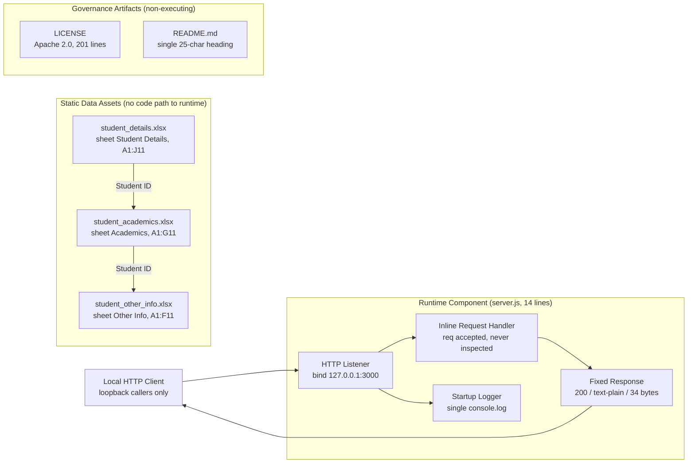
```mermaid
flowchart LR
    Client["Local HTTP Client<br/>loopback callers only"]

    subgraph Runtime["Runtime Component (server.js, 14 lines)"]
        Listener["HTTP Listener<br/>bind 127.0.0.1:3000"]
        Handler["Inline Request Handler<br/>req accepted, never inspected"]
        Logger["Startup Logger<br/>single console.log"]
        Response["Fixed Response<br/>200 / text-plain / 34 bytes"]
        Listener --> Handler
        Listener --> Logger
        Handler --> Response
    end

    subgraph DataAssets["Static Data Assets (no code path to runtime)"]
        Details["student_details.xlsx<br/>sheet Student Details, A1:J11"]
        Acad["student_academics.xlsx<br/>sheet Academics, A1:G11"]
        Other["student_other_info.xlsx<br/>sheet Other Info, A1:F11"]
        Details -->|Student ID| Acad
        Acad -->|Student ID| Other
    end

    subgraph Governance["Governance Artifacts (non-executing)"]
        Lic["LICENSE<br/>Apache 2.0, 201 lines"]
        Readme["README.md<br/>single 25-char heading"]
    end

    Client --> Listener
    Response --> Client
```

The dashed conceptual boundary between the runtime and the data assets is real: the `Student ID` edges inside the data group represent the join relationship that the *schemas* support, not any join that code performs. No arrow crosses from `DataAssets` into `Runtime`, because no such path exists in the repository.

| Component | Artifact | Role |
| --- | --- | --- |
| HTTP service | `server.js` | Sole executing unit; listener, handler, startup log |
| Student identity data | `student_details.xlsx` | 10 records, 10 columns, single sheet |
| Student academic data | `student_academics.xlsx` | 10 records, 7 columns, single sheet |
| Student ancillary data | `student_other_info.xlsx` | 10 records, 6 columns, single sheet |
| License grant | `LICENSE` | Apache 2.0 terms |
| Repository label | `README.md` | Name only; no documentation |

#### Core Technical Approach

The technical approach is defined as much by what it omits as by what it adopts.

**Zero-dependency standard-library implementation.** The service is built directly on Node's built-in `http` module with no web framework and no third-party package. Because no `package.json` or lockfile exists, the project declares no dependencies at all, which eliminates installation steps and supply-chain exposure while forgoing the routing, middleware, and error handling a framework would supply.

**CommonJS, single-file, side-effect startup.** `server.js` uses CommonJS (`require`) and starts listening as a module-load side effect. It exports nothing — `module.exports` and `export` are both absent — so the server cannot be imported, composed, or unit-tested as a module; it can only be run as a process.

**Synchronous, stateless request handling.** The handler is a single inline arrow function with no `async`, `await`, or `Promise` usage anywhere. It holds no state between requests, consults no store, and performs no I/O, so every response is served from a literal.

**Hard-coded configuration.** Host and port are module-scoped constants (`server.js` L3–L4) with no environment-variable fallback, making the deployment target immutable without a code change.

**Single-process execution.** Neither `cluster` nor `worker` appears, so the service runs on one process and one thread with no multi-core utilization.

**Plaintext transport.** Only `http` is used; `https` and `tls` are absent, so there is no encryption in transit — acceptable only because the loopback bind confines traffic to the local host.

A compact illustration of the whole request contract:

```javascript
res.statusCode = 200;
res.setHeader('Content-Type', 'text/plain');
res.end('Hello, World Welcome to Sharebot!\n');
```

### 1.2.3 Success Criteria

#### Status of Codified Objectives

**The repository codifies no success criteria.** A search across all JavaScript, Markdown, JSON, and YAML sources for `timeout`, `threshold`, `limit`, `rateLimit`, `slo`, `sla`, `coverage`, `budget`, `latency`, `p95`, `p99`, `metric`, `prometheus`, `healthz`, `/health`, `readiness`, and `liveness` returns **zero matches**. There are no service-level objectives, no performance budgets, no test-coverage gates, no rate limits, no health or readiness endpoints, and no metrics instrumentation.

This statement is deliberate. Any numeric target presented here — a latency percentile, an uptime figure, an adoption goal — would be invention rather than documentation. The criteria below are limited to properties that were actually verified in the repository, plus the factors that evidence shows will govern whether the assets become useful.

#### Measurable Objectives (Verified Baseline)

These are the objectives the system demonstrably satisfies today, each confirmed by direct execution or inspection.

| Objective | Verification Method | Observed Result |
| --- | --- | --- |
| Source is syntactically valid | `node --check server.js` | Passes |
| Process starts and binds | Run and read stdout | Logs `Server running at http://127.0.0.1:3000/` |
| Response contract is stable | HTTP probes across paths/verbs | `200`, `text/plain`, 34 bytes, invariant |
| Loopback confinement holds | Probe routable IP on port 3000 | Connection refused |
| Dataset join integrity | Compare key sets across workbooks | Identical `S001`–`S010`; zero orphans |
| Dataset internal consistency | Check `Year` against `Current Semester` | `Year × 2 = Current Semester`, all 10 |
| Data assets are inert | Inspect OOXML parts | No formulas, macros, or external links |
| Zero dependency footprint | Manifest inspection | No `package.json`; only built-in `http` |

#### Critical Success Factors

Derived from the specific gaps the investigation confirmed, these are the factors that determine whether the repository progresses from scaffold to system:

1. **Bridging the code-to-data gap.** The single largest determinant of value. Until a code path reads the workbooks, the dataset contributes nothing at runtime.
2. **Establishing a request contract.** Introducing inspection of `req.url` and `req.method` is prerequisite to any meaningful endpoint.
3. **Resolving naming and ownership ambiguity.** The repository name, the `README.md` heading, and the served `Sharebot` greeting disagree, and the `LICENSE` copyright placeholder at L189 is unfilled. Clear ownership is needed before external distribution.
4. **Externalizing configuration.** Replacing the hard-coded host and port with environment-driven values is required for any environment other than a developer's machine.
5. **Introducing failure handling.** With no `'error'` listener, a port conflict terminates the process; resilience must precede any unattended operation.
6. **Adding a verification harness.** With no tests and no CI, every future change is unguarded. Note also that the dataset's uniform `Pass` status provides no negative-path fixtures.

#### Key Performance Indicators

No KPIs are defined or instrumented in the repository. The only runtime signal the system emits is a single `console.log` line at startup; there is no request logging, no counter, no timer, and no metrics endpoint. Consequently the service cannot report request volume, error rate, latency, or availability, and no KPI can be computed from it without adding instrumentation.

For completeness, the quantitative facts that *are* measurable from the repository as it stands are inventory measures rather than performance indicators: 6 tracked files, 14 lines of executable code (11 non-blank), 1 network listener, 1 fixed response of 34 bytes, 3 data workbooks, 10 student records, 23 total data columns (22 distinct after the shared key), 0 declared dependencies, 0 tests, and 2 commits. These form a legitimate baseline against which future growth can be compared, and they should not be mistaken for service-performance targets.


## 1.3 Scope

This section defines scope **as built**. Every in-scope item corresponds to something verified present in the repository; every out-of-scope item corresponds to something verified absent. Because the repository contains no requirements document, roadmap, or backlog — searches for `TODO`, `FIXME`, and `roadmap` markers return zero results — nothing below should be read as a statement of intent on the project owner's behalf.

### 1.3.1 In-Scope

#### Core Features and Functionalities

**Must-have capabilities (implemented).** The delivered feature set consists of three capabilities in the runtime plus one static data asset group:

| # | Capability | Implementing Artifact |
| --- | --- | --- |
| 1 | Bind and accept HTTP requests on a local TCP port | `server.js` L12 (`server.listen`) |
| 2 | Return an invariant `200` / `text/plain` response | `server.js` L7–L9 |
| 3 | Emit a startup readiness line to stdout | `server.js` L13 (`console.log`) |
| 4 | Retain a joinable three-part student dataset on disk | The three `.xlsx` workbooks |

Capability 2 is invariant in the strict sense: the handler receives `req` but never reads it, and probes across multiple paths and verbs (`GET /`, `GET /students/S001`, `POST /anything`, `DELETE /x`) all returned the same status, content type, and 34-byte body.

**Primary user workflows.** Two workflows are supported, and they do not intersect:

*Workflow A — run and verify the service.* An operator starts the process directly with `node server.js` (there is no `npm start`, because no `package.json` defines scripts), observes the line `Server running at http://127.0.0.1:3000/`, and issues a request from the same host to receive the fixed greeting. Termination is by interrupting the process; no graceful-shutdown handler exists.

*Workflow B — inspect the student data manually.* A user opens one or more workbooks in a spreadsheet application and reads or cross-references records by `Student ID`. Any joining across the three files is performed by the user, since no code performs it.

**Essential integrations.** None. This is a positive finding, not an omission: the service imports only Node's `http` module, initiates no outbound request, and connects to no datastore, broker, identity provider, or external API. The repository's integration surface is empty by construction.

**Key technical requirements.** The requirements implied by the code are minimal and were confirmed by executing it:

| Requirement | Detail | Source |
| --- | --- | --- |
| Node.js runtime with `http` module | Verified running under Node v22.23.2 | `server.js` L1 |
| TCP port 3000 available on loopback | Fixed; no fallback or retry logic | `server.js` L4 |
| Client access from the same host | Remote access is refused | `server.js` L3 |
| Spreadsheet reader (for Workflow B) | OOXML `.xlsx`, single sheet each | Workbook parts |
| No package installation | No manifest or lockfile exists | `package.json` absent |

#### Implementation Boundaries

**System boundaries.** The system is bounded on four axes, each verified:

- *Process* — one single-threaded Node process. Neither `cluster` nor `worker` appears, so there is no multi-process or multi-core execution.
- *Host* — the loopback bind is enforced, not advisory. A request to the host's routable address on port 3000 is refused while `127.0.0.1:3000` succeeds, so the boundary is the local machine.
- *Port* — exactly one listener on one hard-coded port; no second interface, no TLS port, no admin port.
- *State* — none. The handler performs no I/O and consults no store, so nothing persists between requests and no data written by a client can be retained.

**User groups covered.** The system implements no notion of identity: `auth`, `token`, `jwt`, `session`, and `cookie` all return zero occurrences. Consequently there is exactly one effective user class — **any process on the local host** — and it is unauthenticated and undifferentiated. Roles, tenants, permission tiers, and per-user views are all outside the built system. In practice this restricts use to a developer or operator working on the machine where the process runs.

**Geographic and market coverage.** No internationalization or localization exists: there are no locale, translation, or message-catalog files anywhere in the repository, and the single response body is English-only ASCII. The sample data is regionally specific — all six cities present (Pune, Mumbai, Nagpur, Nashik, Aurangabad, Kolhapur) are in the Indian state of Maharashtra, all phone numbers follow a ten-digit Indian mobile pattern prefixed `9822`, and commit timestamps carry the `+0530` India Standard Time offset. Coverage is therefore best described as a single Indian state in the illustrative dataset, served by a non-localized, single-language service. No multi-region, multi-currency, or multi-language capability is present.

**Data domains included.** Three domains are in scope as static assets, spanning 23 columns (22 distinct after the shared key) across 10 records:

| Domain | Fields | Storage Notes |
| --- | --- | --- |
| Identity and demographics | 10 columns incl. Name, Gender, DOB, Department, Year, Email, Phone, City | `Date of Birth` and `Phone` stored as text; `Age` and `Year` as numbers |
| Academic performance | 7 columns incl. semester, three GPA measures, attendance, result | Numeric; raw IEEE-754 (e.g. `8.199999999999999`) |
| Ancillary administration | 6 columns incl. hostel, activity, library, fee, scholarship | Status fields as text; counts as numbers |

All three workbooks are single-sheet, contain no formulas, no macro parts, and no external links, and define zero custom number formats — so no display rounding or locale formatting is applied and all presentation concerns fall to a future consumer. `Date of Birth` uses locale-neutral ISO `YYYY-MM-DD` text, which avoids regional date ambiguity but requires string parsing rather than date-typed reads.

### 1.3.2 Out-of-Scope

#### Explicitly Excluded Features and Capabilities

Each exclusion below was confirmed by targeted inspection; all named identifiers return zero occurrences across the repository's JavaScript.

| Excluded Capability | Verification |
| --- | --- |
| Request routing / URL and method dispatch | `req.url`, `req.method` never referenced |
| Reading, querying, or serving the student data | Zero `student_` references in code; only `require('http')` |
| CRUD operations on student records | No write path, no parser, no store |
| JSON or any structured response format | `JSON` absent; only `text/plain` |
| Error responses (4xx / 5xx) | `res.writeHead` and 4xx/5xx assignments absent |
| Exception and failure handling | `try`, `catch`, `throw`, `on('error'` all absent |
| Graceful shutdown / connection draining | `SIGTERM`, `SIGINT` unhandled |
| Authentication and authorization | `auth`, `token`, `jwt`, `session`, `cookie` absent |
| Transport encryption | `https`, `tls` absent — plaintext only |
| CORS policy and security headers | `cors`, `helmet` absent |
| Persistence, caching, database access | `database`, `sql`, `mongo`, `redis`, `cache` absent |
| Runtime configuration via environment | `process.env` absent; literals only |
| Concurrency scaling across cores | `cluster`, `worker` absent |
| User interface of any kind | No HTML, CSS, template, or static-asset directory |
| Input validation and sanitization | No request data is read, so none is validated |
| Automated tests and quality gates | No test directory, no test/lint configuration |
| Build, packaging, containerization | No manifest, `Dockerfile`, `docker-compose.yml`, or `Procfile` |
| CI/CD automation | No `.github` or `.circleci` directory |
| Observability beyond startup logging | No request logging, metrics, or health endpoint |

#### Future Phase Considerations

**No future phases are defined in the repository.** There is no roadmap file, no issue reference, no feature flag, and no commented-out code; the `TODO`/`FIXME`/`roadmap` marker count is zero. The items below are therefore presented as the *logical consequences of the gaps observed*, offered to inform planning discussions — they are explicitly **not** a committed plan and carry no schedule, priority, or owner from any repository source.

The most consequential unaddressed question is the code-to-data gap: connecting `server.js` to the workbooks would require choosing a spreadsheet-reading approach (introducing the project's first dependency, or a conversion step to a code-friendly format), and that decision has not been made anywhere in the repository. Related open questions that the artifacts raise but do not answer include whether the fixed greeting should become a real endpoint contract, whether host and port should become configurable, whether the service should ever be reachable off-host, and how the three-way naming discrepancy (`Student_Simple_06Sept26` versus the `Sharebot` greeting) and the unfilled `LICENSE` copyright placeholder should be resolved before distribution.

#### Integration Points Not Covered

No integration of any kind is in scope. The following are all outside the built system, and the loopback bind means several are not merely unimplemented but currently unreachable:

- **Upstream student-information systems.** The workbooks have no documented lineage, no source-system reference, and no refresh mechanism; they are standalone snapshots.
- **Databases and data warehouses.** No driver, connection string, schema migration, or ORM exists.
- **Identity providers.** No SSO, LDAP, OAuth, or directory integration.
- **Messaging and eventing.** No broker client, queue, webhook, or event publication.
- **Notification channels.** Despite the dataset carrying `Email` and `Phone` columns, no email or SMS capability exists.
- **Reporting and BI tooling.** No export endpoint, no scheduled job, no analytics connector.
- **Cloud platforms and orchestration.** No provider SDK, no infrastructure-as-code, no Kubernetes or service-mesh descriptor.
- **Monitoring and alerting.** No agent, exporter, tracing library, or log shipper.
- **Any network peer whatsoever.** The service makes no outbound calls and accepts none from off-host.

#### Unsupported Use Cases

The following use cases must not be attempted with the system as built, each for a specific verified reason:

| Unsupported Use Case | Blocking Reason |
| --- | --- |
| Serving student information to callers | No code path reaches the workbooks |
| Remote or networked access | Loopback bind refuses off-host connections |
| Multi-user or role-differentiated access | No identity, session, or permission construct |
| Handling real student PII | No auth, no encryption in transit, no access control |
| Unattended or production operation | No error handling, health check, or restart semantics |
| Reporting, analytics, or dashboards | No query, aggregation, or export capability |
| Failure-path academic workflows | All 10 records are `Pass`; no negative fixtures exist |
| Reuse of the server as a module | Nothing is exported; process-only execution |
| Scale or load testing as a system | Single fixed literal response exercises no real logic |
| Regulated-data processing | No audit trail, retention policy, or consent handling |

A specific caution on the PII use case: the workbook *schemas* are PII-bearing (Name, Date of Birth, Email, Phone, City), while the current *contents* are synthetic — evidenced by the reserved `example.edu` email domain and sequential `9822011001`–`9822011010` phone numbers. The repository as it stands therefore exposes no real personal data, but populating these same files with genuine records would immediately place them under data-protection obligations that the system implements nothing to satisfy.


## 1.4 References

#### Files Examined

- `server.js` - Read in full (14 lines). Established the entire executable surface of the system: the `require('http')` sole import (L1), the hard-coded loopback hostname `127.0.0.1` (L3) and port `3000` (L4), the inline request handler that accepts but never inspects `req` (L6), the unconditional `statusCode = 200` (L7), the `Content-Type: text/plain` header (L8), the fixed 34-byte response body (L9), the listener started as a module-load side effect (L12), and the single startup `console.log` (L13). Also established the absence of exports, routing, error handling, shutdown handling, and environment configuration.
- `README.md` - Read in full (25 characters). Established the repository name `Student_Simple_06Sept26` and the complete absence of prior documentation, setup instructions, usage guidance, and architectural notes.
- `LICENSE` - Inspected (201 lines). Established the Apache License, Version 2.0 (January 2004) grant, and the unfilled copyright placeholder `Copyright [yyyy] [name of copyright owner]` at L189 within the appendix beginning at L178.
- `student_details.xlsx` - Structure and contents extracted. Established the single worksheet `Student Details`, populated range `A1:J11`, the ten identity/demographic columns, ten records keyed `S001`–`S010`, the value domains for Department, Year, Gender, City, and Age, the synthetic `example.edu` email domain, the sequential `9822011001`–`9822011010` phone numbers, and the text storage of `Date of Birth` and `Phone`.
- `student_academics.xlsx` - Structure and contents extracted. Established the single worksheet `Academics`, populated range `A1:G11`, the seven academic-performance columns, the attendance range 82–98 and overall-GPA range 7.5–9.4, the uniform `Pass` result status across all ten records, and the raw IEEE-754 GPA storage (for example `8.199999999999999`).
- `student_other_info.xlsx` - Structure and contents extracted. Established the single worksheet `Other Info`, populated range `A1:F11`, the six ancillary-administration columns, the Hostel/Day Scholar and Paid/Pending distributions, the eight distinct extracurricular activities, and the 0–5 library-books range.

#### Folders Examined

- `/` (repository root) - The only folder in the repository. Contains all six tracked files. Established that the repository is strictly flat, with zero subdirectories outside `.git`.

#### Verified Absences

The following were probed individually and confirmed absent; each underpins a scope or limitation claim in this section.

- Dependency and build manifests - `package.json`, `package-lock.json`, `yarn.lock`, `pnpm-lock.yaml`, `npm-shrinkwrap.json`, `Makefile`, `tsconfig.json`
- Deployment descriptors - `Dockerfile`, `docker-compose.yml`, `Procfile`
- Configuration - `.env`, `.env.example`, `.npmrc`, `.nvmrc`, `config/`
- Quality tooling - `jest.config.js`, `.eslintrc`, `.eslintrc.json`, `.prettierrc`, `test/`, `tests/`, `__tests__/`
- CI/CD - `.github/`, `.circleci/`
- Source and output directories - `src/`, `lib/`, `dist/`, `build/`, `node_modules/`, `public/`, `scripts/`, `docs/`
- Project governance documents - `CONTRIBUTING.md`, `CHANGELOG.md`
- Version control policy - `.gitignore`
- Path-exclusion policy - no `.blitzyignore` file exists anywhere in the repository

#### Commands and Verification Methods

- `git ls-files`, `git log`, `git branch -a`, `git tag`, `git rev-list --all --count` - Established the six-file inventory and the two-commit history (`fc1db66` "Initial commit" adding `LICENSE` and `README.md`; `778b97d` "Add files via upload" adding `server.js` and all three workbooks), both by a single author 35 seconds apart, with no tags and the remote slug `ajitblitzy/Student_Simple_06Sept26`.
- `node --check server.js` - Confirmed the source is syntactically valid.
- Process execution and stdout capture - Confirmed the startup line `Server running at http://127.0.0.1:3000/`.
- HTTP probes across paths and verbs (`GET /`, `GET /students/S001`, `POST /anything`, `DELETE /x`) - Established the invariant `200` / `text/plain` / 34-byte response contract and confirmed the handler is both path-agnostic and method-agnostic.
- HTTP probe to the host's routable address on port 3000 - Confirmed connections are refused off-loopback, establishing the single-host system boundary.
- Repository-wide capability keyword sweep (35 identifiers including `req.url`, `req.method`, `try`, `catch`, `on('error'`, `process.env`, `JSON`, `auth`, `jwt`, `session`, `cors`, `database`, `https`, `cluster`, `module.exports`) - All returned zero occurrences, establishing the exclusion table in § 1.3.2.
- KPI and observability keyword sweep (17 identifiers including `slo`, `sla`, `coverage`, `latency`, `p95`, `metric`, `prometheus`, `/health`, `readiness`, `liveness`) - Returned zero total matches, establishing that no success criteria or KPIs are codified.
- `TODO`/`FIXME`/`roadmap` marker sweep - Returned zero matches, establishing that no in-repository roadmap or backlog exists.
- OOXML part inspection of all three workbooks (`xl/workbook.xml`, `xl/worksheets/sheet1.xml`, `xl/styles.xml`) - Established worksheet names and dimensions, the absence of `<f>` formula elements, `vbaProject` macro parts, and `externalLink` parts, the use of inline strings, and zero custom number formats.
- Programmatic key-set comparison across the three workbooks - Established identical `S001`–`S010` key sets with zero orphaned records and the semantic consistency `Year × 2 = Current Semester` for all ten records.

#### External Sources

No external or web sources were required for this section. All claims are grounded in direct inspection and execution of the repository's own contents.


# 2. Product Requirements

## 2.1 Feature Catalog

This section decomposes the repository into discrete, individually testable features. Before the catalog itself, one framing statement is essential to reading it correctly.

**The repository contains no requirements artifact of any kind.** There is no requirements document, backlog, roadmap, issue reference, feature flag, acceptance test, or even a `TODO`/`FIXME` marker anywhere in the six tracked files. `README.md` is 25 bytes containing only the heading `# Student_Simple_06Sept26`, and no `docs/` directory exists. Every feature and requirement below is therefore **reverse-engineered from observed artifact behavior** — it specifies the system *as built*, verified by direct inspection and execution, rather than recording any stated intent. Each entry should be validated with the project owner before it is treated as a product commitment.

A second framing point governs the catalog's shape. The repository holds two asset groups that are **not connected by any code path**: a runtime service (`server.js`) and three static data workbooks. A sweep of `server.js` for `student_`, `fs`, `readFile`, and `xlsx` returns zero occurrences, so the data features below are delivered as *static assets consumable by a human or by future code*, not as capabilities the service exposes. Features are catalogued on that basis; no data-serving feature is listed, because none exists.

### 2.1.1 Feature Inventory and Classification

Eight features were identified. Each maps to at least one of the six tracked files, and none was inferred from intent.

| ID | Feature Name | Category |
| --- | --- | --- |
| F-001 | Local HTTP Service Bootstrap and Port Binding | Runtime Service |
| F-002 | Invariant Plaintext Response Handling | Runtime Service — Request Handling |
| F-003 | Startup Readiness Logging | Observability and Operations |
| F-004 | Student Identity and Demographics Data Asset | Data Asset |
| F-005 | Student Academic Performance Data Asset | Data Asset |
| F-006 | Student Ancillary Administration Data Asset | Data Asset |
| F-007 | Cross-Workbook Student Identity Key Integrity | Data Model Integrity |
| F-008 | Open-Source Licensing and Repository Identification | Governance |

| ID | Priority | Status | Implementing Artifact |
| --- | --- | --- | --- |
| F-001 | Critical | Completed | `server.js` L1, L3, L4, L6, L12 |
| F-002 | Critical | Completed | `server.js` L6–L10 |
| F-003 | Medium | Completed | `server.js` L12–L13 |
| F-004 | High | Completed | `student_details.xlsx` |
| F-005 | High | Completed | `student_academics.xlsx` |
| F-006 | Medium | Completed | `student_other_info.xlsx` |
| F-007 | High | Completed | All three workbooks (verified join) |
| F-008 | Medium | In Development | `LICENSE`, `README.md` |

**Basis for the priority ratings.** Priority reflects each feature's criticality to the system as delivered, not a business ranking from any repository source (none exists). F-001 and F-002 are Critical because they are jointly the entire executable surface — without the bind there is no service, and without the response handler the listener produces no output. F-004, F-005, and F-007 are High because the identity record, its academic performance history, and the key integrity that binds them constitute the reusable data model, which Section 1 identifies as the repository's principal established value. F-006 is Medium because its columns are ancillary administrative extras rather than the core entity. F-003 is Medium: it is the sole operational signal the process emits, but the service functions without it. F-008 is Medium as a distribution prerequisite.

**Basis for the status ratings.** Seven features are Completed in the strict sense that their observable behavior or content was verified in full and no part of them is stubbed. F-008 is the sole exception, marked In Development because its two artifacts are demonstrably unfinished: the Apache License body is present verbatim, but the appendix retains the unfilled template placeholder `Copyright [yyyy] [name of copyright owner]` at L189, and no `NOTICE`, `AUTHORS`, `COPYRIGHT`, or SPDX identifier exists anywhere to assert ownership. "Completed" here denotes internal completeness of the feature as scoped, and carries no implication that the feature is production-appropriate — F-002 in particular is a complete implementation of scaffold behavior.

### 2.1.2 F-001 — Local HTTP Service Bootstrap and Port Binding

| Metadata Field | Value |
| --- | --- |
| Unique ID | F-001 |
| Feature Name | Local HTTP Service Bootstrap and Port Binding |
| Feature Category | Runtime Service |
| Priority Level | Critical |
| Status | Completed |

**Overview.** The feature instantiates an HTTP server from Node's built-in `http` module and binds it to the loopback interface `127.0.0.1` on TCP port 3000. Binding occurs as a side effect of module load: `server.listen(port, hostname, callback)` at `server.js` L12 executes immediately when the file is run, so the process has no idle or pre-start state. Host and port are module-scoped constants at L3 and L4 with no environment-variable or command-line override — `process.env` does not appear anywhere in the file.

**Business value.** This feature is what makes the repository executable rather than inert. It supplies a working service entry point that a developer can run with a single command and no installation step, which Section 1 identifies as the repository's "reduced startup cost" value category. Because it depends only on the Node standard library and no `package.json` exists, there is no dependency resolution to perform and no third-party supply-chain exposure to assess.

**User benefits.** The only party who can benefit is a user on the machine where the process runs — the loopback bind is an enforced boundary, not a default. Verified empirically: a request to the host's routable address (`10.76.0.146:3000`) fails to connect, while the identical request to `127.0.0.1:3000` succeeds. For that local user the benefit is immediacy: `node server.js` yields a listening service in one step.

**Technical context.** The implementation is CommonJS (`require('http')` at L1) and single-process. Neither `cluster` nor `worker` appears, so execution is confined to one thread on one core. The module exports nothing — both `module.exports` and `exports` return zero occurrences — so the server cannot be imported, composed, or started programmatically by a test harness; it exists only as a process. There is no `'error'` listener on the server object, which fixes the failure behavior described in § 2.4.1: a port collision emits an unhandled `'error'` event and terminates the process with exit code 1.

| Dependency Type | Detail |
| --- | --- |
| Prerequisite Features | None — F-001 is the root of the runtime dependency chain |
| System Dependencies | A Node.js runtime providing the built-in `http` module (verified under Node v22.23.2); TCP port 3000 free on the loopback interface |
| External Dependencies | None. No manifest, lockfile, or `node_modules/` exists, so zero third-party packages are required |
| Integration Requirements | None. The feature makes no outbound call, opens no client socket, and registers with no service registry or discovery mechanism |

### 2.1.3 F-002 — Invariant Plaintext Response Handling

| Metadata Field | Value |
| --- | --- |
| Unique ID | F-002 |
| Feature Name | Invariant Plaintext Response Handling |
| Feature Category | Runtime Service — Request Handling |
| Priority Level | Critical |
| Status | Completed |

**Overview.** A single inline arrow function registered at `server.js` L6 handles every accepted request with three statements: it sets `res.statusCode = 200` (L7), sets the `Content-Type` header to `text/plain` (L8), and ends the response with the fixed 34-byte body `Hello, World Welcome to Sharebot!\n` (L9). The response is invariant in the strict sense. The handler declares a `req` parameter but never dereferences it — a search for any `req.` access returns zero occurrences — so path, method, query string, and request body cannot influence the outcome.

Invariance was confirmed across seven probe variants, all returning identical `200` / `text/plain` / `Content-Length: 34`: `GET /`, `GET /students/S001`, `POST /anything`, `DELETE /x`, a `PUT` request, a `POST` to `/students` carrying the JSON payload `{"studentId":"S001"}`, and `GET /students?dept=Computer%20Science&gpa_min=8.5`. The handler is therefore method-agnostic, path-agnostic, **and** payload- and query-agnostic: submitted data is accepted by the transport and discarded without being read.

**Business value.** The feature's value is as a verified extension point rather than as delivered function. It proves the request/response cycle works end to end, giving a developer a known-good baseline from which to introduce real routing. It delivers no student-information capability: the response conveys nothing about the ten records stored beside it.

**User benefits.** A local user receives a deterministic, immediate confirmation that the service is reachable and responsive. Determinism is the whole of the benefit — because no input is examined, the response cannot be wrong, and it also cannot be useful.

**Technical context.** Handling is fully synchronous and stateless: `async`, `await`, and `Promise` are all absent, the handler performs no I/O, and nothing persists between requests. Only three response attributes are set by application code; the `Date`, `Connection: keep-alive`, and `Keep-Alive: timeout=5` headers observed on the wire are emitted by Node's `http` module defaults, not by `server.js`. Because `res.writeHead` is never used and no 4xx or 5xx status is ever assigned, the service has no error-response vocabulary — it cannot signal "not found", "bad request", or "server error" to any caller. `JSON` does not appear in the file, so `text/plain` is the only representation available.

| Dependency Type | Detail |
| --- | --- |
| Prerequisite Features | F-001 — the handler is only invoked for connections accepted by the bound listener |
| System Dependencies | Node's `http` module request/response objects (`res.statusCode`, `res.setHeader`, `res.end`) |
| External Dependencies | None — no framework, middleware, template engine, or serializer |
| Integration Requirements | None. Notably, the feature has **no dependency on F-004, F-005, F-006, or F-007**: no code path connects the handler to any workbook |

### 2.1.4 F-003 — Startup Readiness Logging

| Metadata Field | Value |
| --- | --- |
| Unique ID | F-003 |
| Feature Name | Startup Readiness Logging |
| Feature Category | Observability and Operations |
| Priority Level | Medium |
| Status | Completed |

**Overview.** A single `console.log` at `server.js` L13 emits one line to stdout — `Server running at http://127.0.0.1:3000/` — constructed by a template literal interpolating the same `hostname` and `port` constants used for the bind. The statement sits **inside** the `server.listen` callback (L12), which is the detail that makes it a genuine readiness signal rather than a launch message: it cannot execute until the socket is successfully bound. This was confirmed by the port-collision test, where a second instance produced **no** stdout line at all and exited with an error.

**Business value.** The line is the only operational signal the system produces, and it is the sole mechanism by which an operator or a supervising script can confirm the service reached a serving state. Its value is diagnostic confirmation at negligible cost.

**User benefits.** An operator gets unambiguous confirmation of readiness plus the exact URL to call, eliminating guesswork about the effective host and port. Because the message is derived from the same constants used to bind, it cannot drift from the actual listening address.

**Technical context.** Observability begins and ends here. Verified by execution: after serving two requests, stdout still contained exactly one line. There is no request logging, no counter, no timer, no metrics endpoint, and no health or readiness route — `timeout`, `limit`, and `health` all return zero occurrences in `server.js`. Consequently request volume, latency, and error rate are unobservable from the running process, and there is no shutdown or error log to complement the startup line.

| Dependency Type | Detail |
| --- | --- |
| Prerequisite Features | F-001 — the log statement is the `listen` callback body and executes only on successful bind |
| System Dependencies | A process stdout stream; Node's `console` global |
| External Dependencies | None — no logging library, log shipper, or agent |
| Integration Requirements | None. Output is unstructured plaintext, not JSON, so it is not machine-parseable by a log aggregator without a custom pattern |

### 2.1.5 F-004 — Student Identity and Demographics Data Asset

| Metadata Field | Value |
| --- | --- |
| Unique ID | F-004 |
| Feature Name | Student Identity and Demographics Data Asset |
| Feature Category | Data Asset |
| Priority Level | High |
| Status | Completed |

**Overview.** `student_details.xlsx` supplies the identity and demographic view of the student entity: a single worksheet named `Student Details` with populated range `A1:J11` — one header row plus ten records — across ten columns: `Student ID`, `Name`, `Gender`, `Date of Birth`, `Age`, `Department`, `Year`, `Email`, `Phone`, and `City`. Records are keyed `S001` through `S010`.

**Business value.** This is the anchor of the data model that Section 1 identifies as the repository's established, ready-to-use value: a validated schema a team can adopt without a modeling exercise. It defines the master student record to which the academic and ancillary views attach.

**User benefits.** A user opening the workbook gets a complete, internally consistent demographic roster. Because `Date of Birth` is stored as locale-neutral ISO `YYYY-MM-DD` text — verified to match `^\d{4}-\d{2}-\d{2}$` for all ten records — the dates carry no regional day/month ambiguity.

**Technical context.** The workbook is inert and self-contained: zero `<f>` formula elements, no `vbaProject` macro part, no `externalLink` part, and no `sharedStrings` part (all text is stored as 90 inline-string cells). Column storage types are mixed and consequential for any future reader: columns A–D, F, and H–J are text, while `Age` (E) and `Year` (G) are numeric. `Phone` is stored as **text**, which preserves the digits exactly but means a consumer must not assume a numeric read.

Provenance evidence establishes the data as synthetic rather than production: all three workbooks declare `dc:creator` = `openpyxl` and `Application` = `Microsoft Excel Compatible / Openpyxl 3.1.5`, so they were generated programmatically by a Python library. This corroborates the content-level indicators — every email uses the reserved documentation domain `example.edu`, all ten phone numbers are consecutive from `9822011001` to `9822011010`, and gender splits exactly five and five.

| Dependency Type | Detail |
| --- | --- |
| Prerequisite Features | None as a static asset. It is, however, the key-issuing side of F-007 |
| System Dependencies | An OOXML `.xlsx` reader — a spreadsheet application for manual use, or a parsing library for programmatic use. **No such library is present in the repository** |
| External Dependencies | None at rest. The workbook references no external data source and has no refresh mechanism or documented upstream lineage |
| Integration Requirements | Joins to F-005 and F-006 on `Student ID`. That join is a schema affordance only; no software in the repository performs it |

### 2.1.6 F-005 — Student Academic Performance Data Asset

| Metadata Field | Value |
| --- | --- |
| Unique ID | F-005 |
| Feature Name | Student Academic Performance Data Asset |
| Feature Category | Data Asset |
| Priority Level | High |
| Status | Completed |

**Overview.** `student_academics.xlsx` supplies the academic-performance view: a single worksheet named `Academics` with populated range `A1:G11` across seven columns — `Student ID`, `Current Semester`, `Previous Sem GPA`, `Current GPA`, `Overall GPA`, `Attendance %`, and `Result Status`. Ten records are keyed `S001`–`S010`, matching F-004 exactly.

**Business value.** The workbook contributes the measurable dimension of the model — the GPA trajectory, attendance, and outcome fields on which any academic reporting, ranking, or intervention logic would operate. Combined with the F-006 fee and hostel fields, it makes the cross-cutting question Section 1 cites ("which students with pending fees also have attendance below 85 percent?") answerable in principle from these files.

**User benefits.** The three-GPA structure (previous semester, current, overall) lets a user see direction of travel, not just a point-in-time score, and attendance sits alongside it in the same row for immediate correlation.

**Technical context.** Storage is numeric for columns B–F and text for `Student ID` (A) and `Result Status` (G), with 27 inline-string cells in total. The workbook defines **zero custom number formats**, so values are presented exactly as stored — and they are stored as raw IEEE-754 doubles. S001's `Current GPA` is literally `8.199999999999999` and its `Overall GPA` `8.699999999999999`. Any consumer must therefore round or format before display; the file applies no presentation layer of its own.

Two content properties constrain how the asset can be used. First, `Result Status` is `Pass` for all ten records, so the dataset contains no failure-path fixtures with which to exercise remedial, probation, or re-examination logic. Second, a verified data-quality inconsistency: `Current GPA` differs from `Overall GPA` for exactly one record (S001, 8.2 versus 8.7) and is identical for the other nine, so the derived-value semantics of `Overall GPA` are not consistent across the dataset and cannot be relied upon as a computed aggregate.

| Dependency Type | Detail |
| --- | --- |
| Prerequisite Features | F-004 for referential meaning — an academic row is only interpretable against the identity record it keys to |
| System Dependencies | An OOXML `.xlsx` reader; plus rounding or decimal formatting on the consumer side for any GPA display |
| External Dependencies | None. No formulas, macros, or external links; values are static, not computed |
| Integration Requirements | Joins to F-004 and F-006 on `Student ID`; participates in the F-007 semantic rule `Year × 2 = Current Semester` |

### 2.1.7 F-006 — Student Ancillary Administration Data Asset

| Metadata Field | Value |
| --- | --- |
| Unique ID | F-006 |
| Feature Name | Student Ancillary Administration Data Asset |
| Feature Category | Data Asset |
| Priority Level | Medium |
| Status | Completed |

**Overview.** `student_other_info.xlsx` supplies the ancillary administrative view: a single worksheet named `Other Info` with populated range `A1:F11` across six columns — `Student ID`, `Hostel Status`, `Extracurricular Activity`, `Library Books Issued`, `Fee Status`, and `Scholarship Holder`. Ten records keyed `S001`–`S010`.

**Business value.** This workbook represents the functions that sit outside the registrar and academic offices — hostel, library, finance, and student life — and its presence is what makes the repository's data model a *consolidated* view rather than a purely academic one. The `Fee Status` and `Scholarship Holder` fields carry the financial dimension.

**User benefits.** Administrative status that would realistically live in three or four separate systems is available in one row per student, so a user can see at a glance that a student is a hostel resident with pending fees and no scholarship.

**Technical context.** Storage is text for columns A–C, E, and F, and numeric for `Library Books Issued` (D), with 56 inline-string cells. Like its siblings, the workbook contains no formulas, macro part, external link, or custom number format. Every categorical field uses a small closed vocabulary, verified exhaustively: `Hostel Status` is `Hostel` or `Day Scholar`; `Fee Status` is `Paid` (7 records) or `Pending` (3); `Scholarship Holder` is `Yes` or `No`; `Extracurricular Activity` takes 8 distinct values across the 10 records (Coding Club, Cricket Team, Dance Club, Debate Society, Football Team, Music Club, Photography Club, Robotics Club). `Library Books Issued` ranges 0–5. These vocabularies are conventions of the data, not constraints enforced by the file — no data-validation part exists to reject an out-of-vocabulary value.

| Dependency Type | Detail |
| --- | --- |
| Prerequisite Features | F-004 for referential meaning |
| System Dependencies | An OOXML `.xlsx` reader |
| External Dependencies | None. No integration with any hostel, library, or fee-collection system exists or is referenced |
| Integration Requirements | Joins to F-004 and F-005 on `Student ID`. Despite carrying fee and scholarship status, the asset feeds no billing, notification, or reporting capability — none exists in the repository |

### 2.1.8 F-007 — Cross-Workbook Student Identity Key Integrity

| Metadata Field | Value |
| --- | --- |
| Unique ID | F-007 |
| Feature Name | Cross-Workbook Student Identity Key Integrity |
| Feature Category | Data Model Integrity |
| Priority Level | High |
| Status | Completed |

**Overview.** F-007 is the property that makes F-004, F-005, and F-006 a single coherent data model instead of three unrelated files: a shared `Student ID` key with verified referential integrity. Programmatic comparison of the three key sets confirms they are **identical** (`S001`–`S010`), that orphaned records number **zero in every direction**, and that no workbook contains a duplicate key. The relationship is therefore a strict 1:1:1 star centred on a single student entity.

Integrity extends beyond the key to a semantic rule that holds across files: `Year` in `student_details.xlsx` multiplied by two equals `Current Semester` in `student_academics.xlsx` for all ten records (S001 year 2 / semester 4; S002 year 3 / semester 6; S003 year 1 / semester 2, and so on). Joining all three workbooks yields a record of **21 distinct columns** — 23 column instances less the two duplicate occurrences of the shared key — comprising one key and twenty attributes.

**Business value.** This is the single most reusable property in the repository. A team can adopt the three-part schema directly and trust that a join will not silently drop or duplicate rows, which eliminates both a data-modeling exercise and a data-cleansing exercise. It is also what elevates the repository from "three spreadsheets" to "a validated relational sample".

**User benefits.** A user cross-referencing by `Student ID` will find a match in every file, every time; there are no missing counterparts to reconcile and no ambiguous duplicates to resolve.

**Technical context.** F-007 is an *emergent property of the data*, not an enforced constraint — a distinction that matters for maintenance. No workbook declares a primary key, a foreign key, or an OOXML data-validation part, and no code validates the relationship. The integrity currently observed is a consequence of how the files were generated (programmatically, via openpyxl 3.1.5) and would not survive an uncoordinated manual edit: adding a row to one workbook alone would create an orphan that nothing in the repository would detect.

| Dependency Type | Detail |
| --- | --- |
| Prerequisite Features | F-004, F-005, and F-006 — the property is defined over all three and is meaningless without any one of them |
| System Dependencies | None at rest. Verifying or exploiting the property requires an external reader or join tool, of which the repository provides none |
| External Dependencies | None |
| Integration Requirements | The `Student ID` column is the sole integration contract between the three data features. It is honored by convention only, with no enforcement mechanism |

### 2.1.9 F-008 — Open-Source Licensing and Repository Identification

| Metadata Field | Value |
| --- | --- |
| Unique ID | F-008 |
| Feature Name | Open-Source Licensing and Repository Identification |
| Feature Category | Governance |
| Priority Level | Medium |
| Status | In Development |

**Overview.** Two non-executing artifacts constitute the repository's governance surface. `LICENSE` carries the verbatim Apache License, Version 2.0 (January 2004) across 201 lines, with the standard clause structure intact — § 7 Disclaimer of Warranty at L143, § 8 Limitation of Liability at L153, § 9 Accepting Warranty or Additional Liability at L165, and the appendix beginning at L178. `README.md` provides repository identification through a single 25-byte level-one heading, `# Student_Simple_06Sept26`, with no trailing newline and no further content.

**Business value.** The Apache 2.0 grant removes licensing ambiguity for reuse, redistribution, modification, and commercial derivation, which is a precondition for the repository's assets being adopted elsewhere. This is the feature that converts the data model and the scaffold from unusable-by-default code into legally reusable material.

**User benefits.** A prospective adopter can determine the licensing terms immediately and completely from the repository itself, without contacting the author.

**Technical context.** Neither artifact executes or affects runtime behavior. The feature is marked In Development because it is verifiably incomplete in two respects. First, ownership is unasserted: the appendix at L189 still reads `Copyright [yyyy] [name of copyright owner]`, and there is no `NOTICE`, `AUTHORS`, or `COPYRIGHT` file, no SPDX identifier in any tracked text file, and no copyright line in `server.js` or `README.md`. (Leaving the Apache appendix template unfilled is not itself a license violation — the accurate finding is that the repository nowhere states who owns the work or in what year.) Second, `README.md` supplies no usage, setup, API, or architecture documentation, so the repository's own documentation surface is limited to its name.

A related identification defect spans this feature and F-002: the repository, its remote slug (`ajitblitzy/Student_Simple_06Sept26`), and the `README.md` heading all agree on the name `Student_Simple_06Sept26`, while the response body served at L9 announces `Sharebot` — a third, otherwise unexplained product name. Ownership and naming should be reconciled before distribution.

| Dependency Type | Detail |
| --- | --- |
| Prerequisite Features | None |
| System Dependencies | None. Both artifacts are static text and are never read by the runtime |
| External Dependencies | The Apache License 2.0 text as published at `http://www.apache.org/licenses/` (referenced at L3 and L195), incorporated by copy rather than by reference |
| Integration Requirements | None technically. Redistribution obligations under Apache 2.0 § 4 attach to any downstream consumer of the repository's other seven features |


## 2.2 Functional Requirements

This section states the 29 functional requirements derived from the eight catalogued features. Each requirement is expressed so that it can be verified by a repeatable action against the repository, and every acceptance criterion given below was executed or inspected during the preparation of this document.

### 2.2.1 Requirement Conventions and Verification Methods

**Identifier scheme.** Requirements use the form `F-XXX-RQ-YYY`, where `F-XXX` is the parent feature from § 2.1 and `YYY` is a zero-padded sequence within that feature. Identifiers are stable and are reused verbatim in the traceability matrix of § 2.5.

**Requirement counts by feature.**

| Feature | Requirement IDs | Count |
| --- | --- | --- |
| F-001 | F-001-RQ-001 … RQ-004 | 4 |
| F-002 | F-002-RQ-001 … RQ-004 | 4 |
| F-003 | F-003-RQ-001 … RQ-003 | 3 |
| F-004 | F-004-RQ-001 … RQ-004 | 4 |
| F-005 | F-005-RQ-001 … RQ-004 | 4 |
| F-006 | F-006-RQ-001 … RQ-003 | 3 |
| F-007 | F-007-RQ-001 … RQ-004 | 4 |
| F-008 | F-008-RQ-001 … RQ-003 | 3 |

**Verification methods available.** Four methods suffice for all 29 requirements, because the repository has no test harness of its own:

| Method | Applied To | Description |
| --- | --- | --- |
| Source inspection | F-001, F-002, F-003, F-008 | Reading the named file at the cited line numbers |
| Process execution | F-001, F-003 | Running `node server.js` and observing stdout, exit code, and stderr |
| HTTP probe | F-001, F-002 | Issuing requests against `127.0.0.1:3000` and the host's routable address, and reading status, headers, and body bytes |
| OOXML inspection | F-004, F-005, F-006, F-007 | Parsing `xl/workbook.xml`, `xl/worksheets/sheet1.xml`, `xl/styles.xml`, and `docProps/*` from each workbook, and comparing key sets programmatically |

**A note on performance criteria.** The repository codifies no performance target: sweeps for `slo`, `sla`, `latency`, `p95`, `p99`, `timeout`, `limit`, `threshold`, and `budget` return zero matches across all tracked files. Every "performance criteria" entry below therefore reports either an **observed baseline measurement** or the absence of any target. No figure in this section should be read as a commitment.

**A note on requirement satisfaction.** Twenty-eight of the twenty-nine requirements are satisfied by the repository as built. The single exception is `F-008-RQ-003`, which is stated because Apache 2.0 distribution practice makes it applicable, and is recorded as **not satisfied**.

### 2.2.2 F-001 — Local HTTP Service Bootstrap and Port Binding

| Requirement ID | Description | Priority | Complexity |
| --- | --- | --- | --- |
| F-001-RQ-001 | Instantiate an HTTP server using only the Node.js built-in `http` module, with no third-party package and no installation step | Must-Have | Low |
| F-001-RQ-002 | Bind the listener to loopback host `127.0.0.1` on TCP port 3000, using module-scoped constants as the bind arguments | Must-Have | Low |
| F-001-RQ-003 | Confine reachability to the local host, refusing connections addressed to any other interface | Must-Have | Low |
| F-001-RQ-004 | Start listening as a module-load side effect, exposing no importable API and accepting no external configuration | Should-Have | Low |

| Requirement ID | Acceptance Criteria |
| --- | --- |
| F-001-RQ-001 | `server.js` L1 is `require('http')` and L6 calls `http.createServer`; it is the only `require` in the file. No `package.json`, lockfile, or `node_modules/` exists. `node --check server.js` passes and `node server.js` starts with no prior install. |
| F-001-RQ-002 | L3 defines `hostname = '127.0.0.1'`, L4 defines `port = 3000`, and L12 passes both to `server.listen(port, hostname, …)`. A `GET http://127.0.0.1:3000/` returns HTTP 200. |
| F-001-RQ-003 | A request to the host's routable address on port 3000 fails to establish a connection (verified against `10.76.0.146:3000`: curl exit code 7, status `000`), while the identical request to `127.0.0.1:3000` succeeds. |
| F-001-RQ-004 | `module.exports` and `exports` return zero occurrences; `server.listen` at L12 is at module top level, not inside an exported function; `process.env` returns zero occurrences; the full 14-line source contains no `process.argv` or option parsing. |

| Aspect | Specification |
| --- | --- |
| Input parameters | None at any layer. No CLI arguments, no environment variables, and no configuration file are read. The only inputs are the two literals at L3 and L4, fixed at author time. |
| Output/Response | A bound TCP listener on `127.0.0.1:3000`, plus the readiness line delivered by F-003. On bind failure, an unhandled `'error'` event, a stack trace on stderr naming `EADDRINUSE`, and process exit code 1. |
| Performance criteria | No target is codified. Observed: the process binds and logs readiness within the first second of launch; a single-threaded listener served 100 requests at 10-way parallelism with 100 of 100 returning HTTP 200 and zero failures. |
| Data requirements | None. The feature reads no file and opens no datastore connection. |

| Rule Category | Rule |
| --- | --- |
| Business rules | Exactly one listener on exactly one port; no secondary, administrative, or TLS port exists. The service is unavailable to any caller not executing on the host, which is a hard boundary rather than a policy toggle. |
| Data validation | Not applicable — the feature accepts no input to validate. The port literal `3000` and host literal `127.0.0.1` are not range-checked or validated at runtime, so an invalid edit would surface only as a bind failure at launch. |
| Security requirements | The loopback bind is the sole access control present and is effective as network isolation: nothing off-host can reach the port. No authentication, authorization, or transport encryption exists — `auth`, `token`, `jwt`, `session`, `cookie`, `https`, and `tls` all return zero occurrences — so any local process may connect without credentials. |
| Compliance requirements | None are codified in the repository. The loopback confinement incidentally limits exposure, but no data-protection, audit, or retention control is implemented. |

### 2.2.3 F-002 — Invariant Plaintext Response Handling

| Requirement ID | Description | Priority | Complexity |
| --- | --- | --- | --- |
| F-002-RQ-001 | Respond with HTTP status 200 to every accepted request, unconditionally | Must-Have | Low |
| F-002-RQ-002 | Set the response `Content-Type` header to `text/plain` | Must-Have | Low |
| F-002-RQ-003 | Return the fixed 34-byte newline-terminated body `Hello, World Welcome to Sharebot!` | Must-Have | Low |
| F-002-RQ-004 | Handle every request identically and statelessly, without inspecting method, path, query string, headers, or body | Should-Have | Low |

| Requirement ID | Acceptance Criteria |
| --- | --- |
| F-002-RQ-001 | L7 assigns `res.statusCode = 200` with no surrounding conditional. All seven probe variants returned `200`. No 4xx or 5xx status is assigned anywhere and `res.writeHead` returns zero occurrences, so no other status is reachable. |
| F-002-RQ-002 | L8 calls `res.setHeader('Content-Type', 'text/plain')`. Every probe response carried `Content-Type: text/plain`. `JSON` returns zero occurrences, confirming no alternative representation exists. |
| F-002-RQ-003 | L9 calls `res.end('Hello, World Welcome to Sharebot!\n')`. Every probe returned `Content-Length: 34`, and piping the body to a byte count yields 34. |
| F-002-RQ-004 | No `req.` dereference appears in the file. Identical `200` / `text/plain` / 34-byte responses were observed for `GET /`, `GET /students/S001`, `POST /anything`, `DELETE /x`, `PUT`, a `POST` to `/students` with body `{"studentId":"S001"}`, and `GET /students?dept=Computer%20Science&gpa_min=8.5`. `async`, `await`, and `Promise` return zero occurrences. |

| Aspect | Specification |
| --- | --- |
| Input parameters | The handler signature at L6 declares `(req, res)`. `req` is accepted by the runtime but never read, so the *effective* input set is empty: request line, headers, query parameters, and body are all discarded without parsing. |
| Output/Response | Status `200`; one application-set header, `Content-Type: text/plain`; body of 34 bytes ending in a newline. The `Date`, `Connection: keep-alive`, and `Keep-Alive: timeout=5` headers observed on the wire are Node `http` defaults, not products of `server.js`. |
| Performance criteria | No target is codified. Observed on loopback: `time_total` between 0.000171 s and 0.000233 s across five samples, with `time_connect` around 0.00006 s. These figures reflect a literal-string response with no I/O and are not representative of any future data-serving path. |
| Data requirements | None. The response body is a string literal in source; the handler performs no read of the workbooks or of any other file. |

| Rule Category | Rule |
| --- | --- |
| Business rules | One response for all callers, with no resource model, no content negotiation, and no error vocabulary. A caller cannot be told that a path is unknown or that a request is malformed, because every request is answered successfully. |
| Data validation | None, and none is required: because no request data is read, there is nothing to validate or sanitize. Correspondingly, the service is immune to input-driven parsing defects and equally incapable of acting on input. |
| Security requirements | No authentication or authorization gate precedes the handler. No security headers are set — `cors` and `helmet` return zero occurrences, so no CORS policy, CSP, or related header is emitted. The response leaks no data, since it contains no dynamic content; the naming inconsistency it does disclose (`Sharebot`) is an identification defect rather than a data-exposure risk. |
| Compliance requirements | None codified. Because the handler reads no request body and writes no log line, it also creates no personal-data processing record and no audit trail. |

### 2.2.4 F-003 — Startup Readiness Logging

| Requirement ID | Description | Priority | Complexity |
| --- | --- | --- | --- |
| F-003-RQ-001 | Emit exactly one readiness line to stdout, and only after the socket is successfully bound | Must-Have | Low |
| F-003-RQ-002 | Construct the readiness line from the same host and port values used for the bind, so the advertised URL cannot drift from the listening address | Should-Have | Low |
| F-003-RQ-003 | Produce no further output during steady-state operation | Could-Have | Low |

| Requirement ID | Acceptance Criteria |
| --- | --- |
| F-003-RQ-001 | Running the process yields stdout containing exactly `Server running at http://127.0.0.1:3000/` and an empty stderr. The `console.log` at L13 is the body of the `server.listen` callback opened at L12, so it is unreachable unless the bind succeeds — confirmed by the port-collision case, in which stdout was empty. |
| F-003-RQ-002 | L13 is a template literal interpolating `${hostname}` and `${port}` — the identical constants declared at L3 and L4 and passed to `listen` at L12. The logged URL was confirmed reachable. |
| F-003-RQ-003 | After the process served two requests, stdout still contained exactly one line. No `console` call exists inside the request handler (L6–L10). |

| Aspect | Specification |
| --- | --- |
| Input parameters | The `hostname` (L3) and `port` (L4) constants, read at log time from the same module scope used for binding. |
| Output/Response | One unstructured plaintext line on stdout: `Server running at http://127.0.0.1:3000/`. There is no severity level, no timestamp, and no structured field, so the line is not machine-parseable without a bespoke pattern. |
| Performance criteria | No target is codified. Observed: the line appears at bind completion, within the first second of launch. The cost is a single synchronous write with no measurable steady-state overhead, since nothing is logged per request. |
| Data requirements | None. No log file, log directory, or rotation policy exists; output goes only to the inherited stdout stream and is lost unless the invoker redirects it. |

| Rule Category | Rule |
| --- | --- |
| Business rules | Readiness is signalled exactly once per process lifetime. There is no corresponding shutdown, error, or health message: on `SIGTERM` the process terminates with exit status 143 and logs nothing, and on bind failure it emits a raw Node stack trace to stderr rather than an operator-oriented message. |
| Data validation | Not applicable. The interpolated values are the same literals used for the bind and are not independently validated. |
| Security requirements | The line discloses only the host and port, both already known to any local caller, and contains no credential, token, or personal data. Because no request is ever logged, no request-borne personal data can leak into logs. |
| Compliance requirements | None codified. The absence of request logging means the system produces no access log and therefore cannot satisfy any audit-trail obligation. |

### 2.2.5 F-004 — Student Identity and Demographics Data Asset

| Requirement ID | Description | Priority | Complexity |
| --- | --- | --- | --- |
| F-004-RQ-001 | Provide a single worksheet named `Student Details` with populated range `A1:J11` and the ten specified column headers in order | Must-Have | Low |
| F-004-RQ-002 | Provide exactly ten student records keyed `S001` through `S010` | Must-Have | Low |
| F-004-RQ-003 | Store `Date of Birth` and `Phone` as text with `Date of Birth` in ISO `YYYY-MM-DD` form, and `Age` and `Year` as numbers | Should-Have | Medium |
| F-004-RQ-004 | Populate all contact fields with non-identifying synthetic values | Must-Have | Low |

| Requirement ID | Acceptance Criteria |
| --- | --- |
| F-004-RQ-001 | `xl/workbook.xml` declares one visible sheet named `Student Details`; `xl/worksheets/sheet1.xml` carries `<dimension ref="A1:J11"/>`; row 1 reads `Student ID`, `Name`, `Gender`, `Date of Birth`, `Age`, `Department`, `Year`, `Email`, `Phone`, `City` across A1:J1. |
| F-004-RQ-002 | Rows 2–11 are populated (11 rows total including the header); column A holds `S001`–`S010`, sequential and free of duplicates. |
| F-004-RQ-003 | Columns A–D, F, and H–J carry `t="inlineStr"`; columns E and G carry no `t` attribute and are numeric. All ten `Date of Birth` values match `^\d{4}-\d{2}-\d{2}$`. All ten `Phone` values are 10-character strings. |
| F-004-RQ-004 | All ten `Email` values resolve to the single reserved documentation domain `example.edu`; the ten `Phone` values are consecutive from `9822011001` to `9822011010`. `docProps/core.xml` gives `dc:creator` = `openpyxl` and `docProps/app.xml` gives `Application` = `Microsoft Excel Compatible / Openpyxl 3.1.5`, corroborating programmatic generation. |

| Aspect | Specification |
| --- | --- |
| Input parameters | Not applicable — the asset is a static file, not a callable interface. Its "inputs" were fixed at generation time by openpyxl 3.1.5. |
| Output/Response | Ten identity records over ten columns, readable by any OOXML-compatible tool. Value domains are closed and were enumerated exhaustively: `Gender` ∈ {Female, Male} at a 5/5 split; `Department` ∈ {Civil, Computer Science, Electronics, Mechanical}; `Year` ∈ {1, 2, 3, 4}; `Age` ∈ {19, 20, 21, 22}; `City` ∈ {Aurangabad, Kolhapur, Mumbai, Nagpur, Nashik, Pune}. |
| Performance criteria | No target is codified. The file is 6,018 bytes with 90 inline-string cells, so a full read is trivially cheap. No index, no partition, and no pagination affordance exists; a consumer must read the whole sheet. |
| Data requirements | An OOXML `.xlsx` reader is mandatory and is **not supplied by the repository** — no parsing library is declared or vendored, so programmatic access requires introducing the project's first dependency or converting the file to a code-friendly format. |

| Rule Category | Rule |
| --- | --- |
| Business rules | `Student ID` is the natural key of the student entity and the join key for F-005 and F-006. The `Age` and `Date of Birth` columns are stored independently rather than one being derived from the other, so a consumer must treat `Age` as an as-of-generation snapshot that will drift from the birth date over time. |
| Data validation | No validation is enforced by the file: it contains no OOXML data-validation part, no formula, and no declared key constraint. The regularities above (ISO dates, closed vocabularies, 10-digit phone numbers) are properties of the current contents that any edit could break silently. `Phone` being text means digits are preserved exactly but arithmetic reads will fail. |
| Security requirements | The workbook is inert and carries no executable risk: zero `<f>` formula elements, no `vbaProject` macro part, and no `externalLink` part, so opening it triggers no code execution and no outbound fetch. There is no file-level encryption, password, or access control — protection depends entirely on filesystem permissions. |
| Compliance requirements | The schema is PII-bearing by design (`Name`, `Date of Birth`, `Email`, `Phone`, `City`), while the current contents are synthetic, so no real personal data is presently at risk. Replacing these values with genuine records would immediately create data-protection obligations that no repository artifact addresses — there is no consent field, retention marker, classification label, or audit mechanism anywhere in the file. |

### 2.2.6 F-005 — Student Academic Performance Data Asset

| Requirement ID | Description | Priority | Complexity |
| --- | --- | --- | --- |
| F-005-RQ-001 | Provide a single worksheet named `Academics` with populated range `A1:G11` and the seven specified column headers in order | Must-Have | Low |
| F-005-RQ-002 | Provide ten academic records with numeric performance measures for every student key | Must-Have | Low |
| F-005-RQ-003 | Record a categorical `Result Status` for every student | Should-Have | Low |
| F-005-RQ-004 | Store all numeric measures unformatted, applying no display rounding at the file level | Should-Have | Medium |

| Requirement ID | Acceptance Criteria |
| --- | --- |
| F-005-RQ-001 | `xl/workbook.xml` declares one visible sheet named `Academics`; `sheet1.xml` carries `<dimension ref="A1:G11"/>`; row 1 reads `Student ID`, `Current Semester`, `Previous Sem GPA`, `Current GPA`, `Overall GPA`, `Attendance %`, `Result Status`. |
| F-005-RQ-002 | Ten records present, keyed `S001`–`S010`. Columns B–F are numeric with no missing cells. Observed ranges: `Attendance %` 82–98; `Overall GPA` 7.5–9.4; `Current Semester` ∈ {2, 4, 6, 8}. |
| F-005-RQ-003 | Column G is `t="inlineStr"` and populated for all ten records. The value set is the single member `{Pass}`. |
| F-005-RQ-004 | `xl/styles.xml` declares zero custom `<numFmt>` entries. Stored values are raw IEEE-754 doubles — S001's `Current GPA` is `8.199999999999999` and its `Overall GPA` is `8.699999999999999`. |

| Aspect | Specification |
| --- | --- |
| Input parameters | Not applicable — static file. |
| Output/Response | Ten performance records over seven columns: one key, five numeric measures, and one categorical outcome. Twenty-seven inline-string cells cover the header row plus the key and status columns. |
| Performance criteria | No target is codified. The file is 5,546 bytes; a full read is trivially cheap. As with F-004, no index or pagination affordance exists. |
| Data requirements | An OOXML reader, plus **rounding or decimal formatting on the consumer side** for any GPA that will be displayed, since the file applies none. Reading GPA values as fixed-precision decimals rather than floats is advisable for any comparison or aggregation. |

| Rule Category | Rule |
| --- | --- |
| Business rules | Three GPA measures express a trajectory (previous semester, current, overall) alongside attendance and outcome for the same period. `Current Semester` is not independent of F-004: the verified relationship `Year × 2 = Current Semester` ties it to the identity record (see F-007-RQ-004). |
| Data validation | No constraint is enforced by the file — no data-validation part, no formula, no range check. Two content limitations must be treated as constraints on use rather than as validated rules. First, `Result Status` is uniformly `Pass`, so the dataset supplies **no negative-path fixtures** for remedial, probation, or re-examination logic. Second, a verified inconsistency: `Current GPA` differs from `Overall GPA` for exactly one record (S001) and is identical for the other nine, so `Overall GPA` cannot be relied on as a consistently computed aggregate. |
| Security requirements | Inert: zero formulas, no macro part, no external link, so no code executes and no data is fetched on open. Academic performance is sensitive information in a real deployment; the file provides no encryption, redaction, or access-control facility of any kind. |
| Compliance requirements | The columns constitute an education record whose real-world equivalent would attract student-records handling obligations. Current contents are synthetic (programmatically generated, uniform `Pass`), so no obligation attaches today. No classification, retention, or access-logging mechanism exists to support one later. |

### 2.2.7 F-006 — Student Ancillary Administration Data Asset

| Requirement ID | Description | Priority | Complexity |
| --- | --- | --- | --- |
| F-006-RQ-001 | Provide a single worksheet named `Other Info` with populated range `A1:F11` and the six specified column headers in order | Must-Have | Low |
| F-006-RQ-002 | Record hostel, extracurricular, fee, and scholarship status for every student using closed categorical vocabularies | Must-Have | Low |
| F-006-RQ-003 | Record library books issued as a numeric count for every student | Should-Have | Low |

| Requirement ID | Acceptance Criteria |
| --- | --- |
| F-006-RQ-001 | `xl/workbook.xml` declares one visible sheet named `Other Info`; `sheet1.xml` carries `<dimension ref="A1:F11"/>`; row 1 reads `Student ID`, `Hostel Status`, `Extracurricular Activity`, `Library Books Issued`, `Fee Status`, `Scholarship Holder`. |
| F-006-RQ-002 | Columns B, C, E, and F are `t="inlineStr"` and populated for all ten records. Exhaustive value sets: `Hostel Status` = {Hostel, Day Scholar}; `Fee Status` = {Paid, Pending} distributed 7 Paid / 3 Pending; `Scholarship Holder` = {Yes, No}; `Extracurricular Activity` = 8 distinct values across 10 records (Coding Club, Cricket Team, Dance Club, Debate Society, Football Team, Music Club, Photography Club, Robotics Club). |
| F-006-RQ-003 | Column D is numeric and populated for all ten records, with observed range 0–5. |

| Aspect | Specification |
| --- | --- |
| Input parameters | Not applicable — static file. |
| Output/Response | Ten ancillary-administration records over six columns: one key, four categorical fields, and one count. Fifty-six inline-string cells. |
| Performance criteria | No target is codified. The file is 5,551 bytes; full-read cost is negligible. |
| Data requirements | An OOXML reader. The four categorical columns are free text at the storage level, so a consumer that treats them as enumerations must implement its own mapping and handle unexpected values. |

| Rule Category | Rule |
| --- | --- |
| Business rules | Each student carries exactly one hostel status, one primary extracurricular activity, one fee status, and one scholarship flag — the schema admits no multiplicity, so a student with two activities cannot be represented. `Fee Status` and `Scholarship Holder` are independent flags: the data includes a `Pending` fee holder who is not a scholarship holder, so neither field constrains the other. |
| Data validation | The closed vocabularies are conventions of the current contents, **not enforced constraints** — no OOXML data-validation part exists, so a misspelled `Paid` or a negative book count would be accepted silently. `Library Books Issued` has no declared upper bound; 5 is the observed maximum, not a limit. |
| Security requirements | Inert: zero formulas, no macro part, no external link. `Fee Status` and `Scholarship Holder` are financially sensitive in a real deployment and are stored in clear text with no field-level protection. |
| Compliance requirements | Financial-status fields would attract handling obligations in a real deployment; current contents are synthetic. No repository artifact provides classification, masking, or access logging for them. |

### 2.2.8 F-007 — Cross-Workbook Student Identity Key Integrity

| Requirement ID | Description | Priority | Complexity |
| --- | --- | --- | --- |
| F-007-RQ-001 | Ensure `Student ID` uniquely identifies a record within each of the three workbooks | Must-Have | Low |
| F-007-RQ-002 | Ensure the three workbooks share an identical key set with no orphaned records in any direction | Must-Have | Medium |
| F-007-RQ-003 | Support a lossless three-way join producing one consolidated record per student | Should-Have | Medium |
| F-007-RQ-004 | Maintain semantic consistency between the identity and academic views for cross-file derived values | Should-Have | Medium |

| Requirement ID | Acceptance Criteria |
| --- | --- |
| F-007-RQ-001 | For each workbook, the count of distinct `Student ID` values equals the record count (10 = 10 in all three), so no duplicate key exists anywhere. |
| F-007-RQ-002 | The three key sets are identical (`S001`–`S010`). Set differences computed in all three directions — details→academics, academics→other, other→details — are each empty, establishing a strict 1:1:1 cardinality. |
| F-007-RQ-003 | Joining on `Student ID` yields exactly 10 rows (no row multiplication and no dropped row) and 21 distinct columns, being 23 column instances (10 + 7 + 6) less the two duplicate occurrences of the shared key — one key plus twenty attributes. |
| F-007-RQ-004 | For all ten records, `Year` from `student_details.xlsx` multiplied by two equals `Current Semester` from `student_academics.xlsx` (S001: 2 → 4; S002: 3 → 6; S003: 1 → 2; and so on for the remaining seven). |

| Aspect | Specification |
| --- | --- |
| Input parameters | Not applicable. F-007 is a property of the three data files, not an executable interface; the `Student ID` column in each workbook is its only surface. |
| Output/Response | A consolidated 21-column, 10-row logical record set, available only once an external tool performs the join. The repository ships no join implementation. |
| Performance criteria | No target is codified. The join is over 10 rows across three files totalling 17,115 bytes, so cost is negligible at this scale. Key ordering is already sequential in every workbook, which makes a merge join straightforward. |
| Data requirements | All three workbooks must be present and mutually consistent. There is no schema registry, key catalogue, or manifest recording the relationship, so the join contract exists only as an observed regularity and in this document. |
| Verification note | This requirement set is the one most likely to regress silently, because satisfaction depends on the coordinated state of three independently editable files with no mechanism watching them. |

| Rule Category | Rule |
| --- | --- |
| Business rules | One student equals exactly one row in each of the three views — there is no optionality: the model cannot represent a student without an academic record or without an ancillary record. `Student ID` is the sole integration contract between the three data features. |
| Data validation | Integrity is **emergent, not enforced**. No workbook declares a primary or foreign key, none contains a data-validation part, and no code validates the relationship. It is a consequence of programmatic generation (openpyxl 3.1.5) rather than of any constraint, and an uncoordinated manual edit — adding a row to one workbook alone — would create an orphan that nothing in the repository would detect. |
| Security requirements | `Student ID` is a synthetic surrogate key (`S001`–`S010`) carrying no personal information in itself, so the key set can be shared or logged without disclosing identity. Joining the three files, however, materially increases sensitivity: the consolidated 21-column record aggregates demographic, academic, and financial attributes about one individual, so a join output warrants stricter handling than any single input file. |
| Compliance requirements | None codified. The absence of any recorded lineage for the three workbooks means a consolidated record could not be traced to a source system or a lawful basis if the synthetic data were replaced with real records. |

### 2.2.9 F-008 — Open-Source Licensing and Repository Identification

| Requirement ID | Description | Priority | Complexity |
| --- | --- | --- | --- |
| F-008-RQ-001 | Include the complete, unmodified Apache License 2.0 text so that reuse terms are unambiguous | Must-Have | Low |
| F-008-RQ-002 | Identify the repository by name in `README.md` | Should-Have | Low |
| F-008-RQ-003 | Assert copyright ownership and year for the work | Must-Have | Low |

| Requirement ID | Acceptance Criteria |
| --- | --- |
| F-008-RQ-001 | `LICENSE` is 201 lines beginning `Apache License` / `Version 2.0, January 2004` / `http://www.apache.org/licenses/` at L1–L3, with the clause structure intact — § 7 Disclaimer of Warranty at L143, § 8 Limitation of Liability at L153, § 9 Accepting Warranty at L165 — and the appendix at L178. **Satisfied.** |
| F-008-RQ-002 | `README.md` is 25 bytes containing the single heading `# Student_Simple_06Sept26`, matching the remote slug `ajitblitzy/Student_Simple_06Sept26`. **Satisfied** for identification, though the file supplies no other documentation. |
| F-008-RQ-003 | **Not satisfied.** L189 retains the unfilled template placeholder `Copyright [yyyy] [name of copyright owner]`; no `NOTICE`, `NOTICE.txt`, `AUTHORS`, or `COPYRIGHT` file exists; no SPDX identifier appears in any tracked text file; and no copyright line appears in `server.js` or `README.md`. |

| Aspect | Specification |
| --- | --- |
| Input parameters | Not applicable — both artifacts are static text, never read by the runtime. |
| Output/Response | Human-readable licensing terms and a repository name. Neither artifact is machine-consumable as delivered: without an SPDX identifier or a `package.json` `license` field, automated license scanners must fall back on full-text matching. |
| Performance criteria | Not applicable. `LICENSE` is 11,357 bytes and `README.md` is 25 bytes; neither is loaded at runtime. |
| Data requirements | None. |

| Rule Category | Rule |
| --- | --- |
| Business rules | Apache 2.0 governs all six tracked files, including the three data workbooks — the repository draws no distinction between code and data licensing, and no separate data-use terms are stated. |
| Data validation | Not applicable. Note that the unfilled placeholder at L189 is a *documentation* defect, not a validation failure: the appendix is a template for applying the license and leaving it unfilled is not itself a license violation. The accurate finding is that the repository nowhere states who owns the work or in what year. |
| Security requirements | Neither artifact contains a credential, key, or endpoint. No `SECURITY.md` exists, so the repository declares no vulnerability-reporting channel. |
| Compliance requirements | Apache 2.0 § 4 redistribution obligations attach to any downstream consumer. Two gaps complicate compliant redistribution: ownership is unasserted (see F-008-RQ-003), and no `NOTICE` file exists for downstream parties to propagate. A third-party name (`Sharebot`) appears in the served response body at `server.js` L9 without any corresponding attribution or trademark statement, which should be reconciled before distribution. |


## 2.3 Feature Relationships

Only relationships directly evidenced in the repository are documented here. The dominant structural fact is that the eight features form **three disconnected clusters**, and that the absence of an edge between two of them is the repository's defining characteristic.

### 2.3.1 Feature Dependency Map

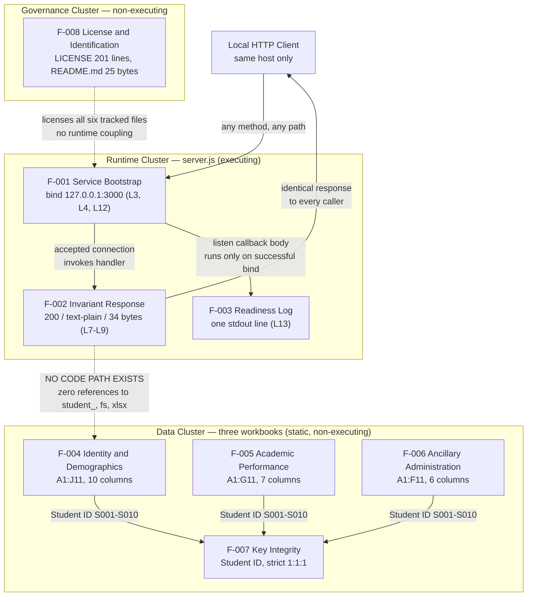
```mermaid
flowchart TB
    Caller["Local HTTP Client<br/>same host only"]

    subgraph RuntimeCluster["Runtime Cluster — server.js (executing)"]
        F001["F-001 Service Bootstrap<br/>bind 127.0.0.1:3000 (L3, L4, L12)"]
        F002["F-002 Invariant Response<br/>200 / text-plain / 34 bytes (L7-L9)"]
        F003["F-003 Readiness Log<br/>one stdout line (L13)"]
        F001 -->|"accepted connection<br/>invokes handler"| F002
        F001 -->|"listen callback body<br/>runs only on successful bind"| F003
    end

    subgraph DataCluster["Data Cluster — three workbooks (static, non-executing)"]
        F004["F-004 Identity and Demographics<br/>A1:J11, 10 columns"]
        F005["F-005 Academic Performance<br/>A1:G11, 7 columns"]
        F006["F-006 Ancillary Administration<br/>A1:F11, 6 columns"]
        F007["F-007 Key Integrity<br/>Student ID, strict 1:1:1"]
        F004 -->|"Student ID S001-S010"| F007
        F005 -->|"Student ID S001-S010"| F007
        F006 -->|"Student ID S001-S010"| F007
    end

    subgraph GovernanceCluster["Governance Cluster — non-executing"]
        F008["F-008 License and Identification<br/>LICENSE 201 lines, README.md 25 bytes"]
    end

    Caller -->|"any method, any path"| F001
    F002 -->|"identical response<br/>to every caller"| Caller
    F002 -. "NO CODE PATH EXISTS<br/>zero references to student_, fs, xlsx" .-> F004
    F008 -. "licenses all six tracked files<br/>no runtime coupling" .-> F001
```

**Reading the map.** Solid arrows are relationships realized in code or data. Dashed arrows are annotations, not dependencies: the `F-002 ⇢ F-004` edge marks the join that does *not* exist, and the `F-008 ⇢ F-001` edge marks a legal rather than technical relationship.

| Relationship | Type | Evidence |
| --- | --- | --- |
| F-001 → F-002 | Runtime invocation | The handler at `server.js` L6 is the callback argument to `http.createServer`; it executes only for connections the L12 listener accepts |
| F-001 → F-003 | Lifecycle callback | The `console.log` at L13 is the body of the `server.listen` callback opened at L12; verified unreachable when the bind fails |
| F-004 → F-007 | Data-level key participation | `Student ID` column A, keys `S001`–`S010` |
| F-005 → F-007 | Data-level key participation | `Student ID` column A, key set identical to F-004 |
| F-006 → F-007 | Data-level key participation | `Student ID` column A, key set identical to F-004 |
| F-005 ↔ F-004 | Cross-file semantic rule | `Year × 2 = Current Semester` for all 10 records (F-007-RQ-004) |
| F-008 → all features | Licensing scope | Apache 2.0 applies to all six tracked files; no runtime reference exists in either direction |

**Dependency depth.** The runtime chain is one level deep: F-001 is the only root, and F-002 and F-003 are its direct, mutually independent dependants. F-002 and F-003 have no relationship to each other — the handler contains no `console` call, and the log statement never touches the response. The data chain is likewise one level: F-007 is a property defined over F-004, F-005, and F-006, and those three have no dependency on one another other than through the shared key.

### 2.3.2 Integration Points

The system exposes exactly two integration points, and both are boundaries rather than couplings.

| Integration Point | Features | Contract |
| --- | --- | --- |
| Loopback TCP socket `127.0.0.1:3000` | F-001, F-002 | HTTP/1.1 over plaintext. Request contract is empty — any method, path, query, and body are accepted and ignored. Response contract is fixed: `200`, `Content-Type: text/plain`, 34-byte body |
| OOXML `.xlsx` files on the filesystem | F-004, F-005, F-006, F-007 | Consumer-driven read of a single worksheet per file, with `Student ID` as the documented join key. Access is by file path only; there is no API, query interface, or export endpoint |

**Internal integration.** Within the runtime cluster, integration is by direct function reference in a single 14-line module — there is no message passing, event bus, dependency-injection container, or module boundary to cross. Within the data cluster, integration is by *convention* on the `Student ID` column: the join is an affordance of the schemas, honored by whatever external tool a user chooses, and enforced by nothing in the repository.

**External integration.** None exists. `server.js` imports only `http` and never constructs a client request, so the system consumes no upstream API, identity provider, message broker, or datastore. The workbooks contain no `externalLink` part and no formula, so they neither reference nor compute from any external source. No credential, connection string, endpoint URL, or webhook target appears in any tracked file.

**The unrealized integration point.** Connecting F-002 to the data cluster is the one integration the artifacts anticipate but do not implement, and it is unresolved in a specific, documented way: the repository declares no `.xlsx` parsing capability. There is no `package.json` in which to declare one, no vendored library, and no converted data format. Any consumer of F-004 through F-007 must therefore supply its own reader, which is why § 2.2 lists an OOXML reader as a data requirement for each data feature rather than as an available component.

### 2.3.3 Shared Components

"Shared" here means an artifact or construct that more than one feature demonstrably relies on. Four qualify.

| Shared Component | Consumed By | Nature |
| --- | --- | --- |
| `hostname` (L3) and `port` (L4) constants | F-001, F-003 | Module-scoped literals used both as `listen` arguments and as the interpolated values in the readiness line, which is why the advertised URL cannot drift from the bound address |
| The `server` object (L6) | F-001, F-002, F-003 | Created by `http.createServer`, bound by `listen`, and the owner of both the handler and the readiness callback |
| Node's built-in `http` module (L1) | F-001, F-002 | The single import in the repository; supplies `createServer`, the listener, and the `res` interface used at L7–L9 |
| The `Student ID` column | F-004, F-005, F-006, F-007 | The only attribute common to all three workbooks and the sole basis of the data model's cardinality |

A fifth, weaker form of sharing is worth recording because it governs how the data assets behave as a group: all three workbooks share an identical OOXML packaging profile — the same nine parts, inline strings rather than a `sharedStrings` table, zero custom number formats, and the same `openpyxl 3.1.5` generator. Consequently a reader written for one workbook will work unchanged against the other two, and any presentation concern (GPA rounding in particular) applies uniformly across all three.

**No shared application code exists.** There is no utility module, helper, configuration loader, constants file, validation layer, or type definition shared between features — the repository contains exactly one source file with no exports, so code sharing is structurally impossible in its current form.

### 2.3.4 Common Services

The repository provides **no common service layer**. This is stated as a verified finding rather than an omission in the documentation.

| Candidate Common Service | Present? | Evidence |
| --- | --- | --- |
| Configuration service | No | `process.env` absent; host and port are inline literals; no `config/`, `.env`, or `.env.example` |
| Logging service | No | One `console.log` call at L13; no logging library, no structured format, no log destination |
| Error-handling service | No | `try`, `catch`, `throw`, and an `'error'` listener are all absent; a bind failure crashes the process |
| Data-access service | No | No `fs` usage, no parser, no repository or DAO layer; nothing reads the workbooks |
| Validation service | No | No request data is read, and no workbook contains a data-validation part |
| Authentication or session service | No | `auth`, `token`, `jwt`, `session`, `cookie` all absent |
| Health or metrics service | No | No health route, counter, timer, or metrics endpoint; `health`, `timeout`, `limit` absent |
| Caching or persistence service | No | `cache`, `database`, `sql`, `mongo`, `redis` all absent; the handler is stateless |

The only services the features rely on are **external to the repository**: the Node.js runtime and its `http` module (verified under Node v22.23.2) for F-001 through F-003, the operating system's TCP stack and stdout stream, and a user-supplied OOXML reader for F-004 through F-007.

### 2.3.5 Verified Absent Relationships

Four relationships that a reader might reasonably assume exist were checked individually and do not.

| Assumed Relationship | Status | Verification |
| --- | --- | --- |
| Runtime serves the student data | **Absent** | `server.js` contains zero occurrences of `student_`, `fs`, `readFile`, and `xlsx`; the only `require` is `http` |
| Response varies with the request | **Absent** | No `req.` dereference exists; seven probe variants across methods, paths, a query string, and a JSON body returned byte-identical responses |
| Data features validate each other | **Absent** | No workbook declares a key constraint or data-validation part; F-007 integrity is emergent and would break silently on an uncoordinated edit |
| Governance artifacts affect runtime | **Absent** | Neither `LICENSE` nor `README.md` is read by any code path; F-008 relates to the other features only through licensing scope |

The first two absences jointly determine the system's product position: the repository holds a validated data model and a working service entry point that are, at present, strangers to each other.


## 2.4 Implementation Considerations

Each feature is examined across five dimensions: technical constraints, performance requirements, scalability considerations, security implications, and maintenance requirements. Every entry describes a condition verified in the repository. Where a dimension is genuinely not applicable to a static artifact, that is stated rather than filled.

### 2.4.1 F-001 — Local HTTP Service Bootstrap and Port Binding

| Consideration | Detail |
| --- | --- |
| Technical constraints | Host and port are immutable literals at `server.js` L3–L4 with no environment or CLI override, so relocating the service requires a source edit. Exactly one listener on one port exists; there is no secondary, administrative, or TLS port. Execution is single-process and single-threaded — `cluster` and `worker` are absent. The module exports nothing, so the server cannot be started programmatically or instantiated by a harness. No `package.json` means no `engines` field, so the minimum supported Node version is undeclared; the only verified runtime is Node v22.23.2. |
| Performance requirements | None are codified — no timeout, limit, or threshold value appears in any tracked file. Observed baseline: bind and readiness within the first second of launch, and 100 of 100 requests answered with HTTP 200 at 10-way parallelism. The `Keep-Alive: timeout=5` seen on responses is a Node `http` default, not an application setting. Because the process is single-threaded, any future CPU-bound or blocking work inside the handler would stall every concurrent caller. |
| Scalability considerations | Scaling is bounded in three verified ways. A second instance cannot run on the same host: launching one while the port is held produces `EADDRINUSE`, an unhandled `'error'` event, and exit code 1. The loopback bind prevents placement behind any load balancer or reverse proxy on another host. The absence of `cluster` leaves multi-core capacity unused. There is also no health or readiness endpoint, so an orchestrator has no probe target and would have to scrape stdout. |
| Security implications | The loopback bind is the only access control and is effective as isolation — off-host connections are refused. Within the host, however, there is no control at all: any local process may connect unauthenticated, since no authentication, authorization, or session construct exists. Transport is plaintext (`https` and `tls` absent). No rate limit, connection cap, or request-size limit is configured, so local resource exhaustion is unmitigated. The process runs with the privileges of whoever launches it; there is no privilege-drop logic. |
| Maintenance requirements | The 14-line source is trivially comprehensible and has no dependency graph to maintain — a real advantage. Against that, no test, lint configuration, or CI workflow exists, so every change is unguarded; and because nothing is exported, adding unit tests would require refactoring the module to separate creation from listening. The unhandled-error path means an operator must read a raw Node stack trace to diagnose the most likely failure. |

### 2.4.2 F-002 — Invariant Plaintext Response Handling

| Consideration | Detail |
| --- | --- |
| Technical constraints | The handler cannot differentiate callers: no `req.` dereference exists, so routing must be introduced before any endpoint can be added. `text/plain` is the only representation (`JSON` absent), and because `res.writeHead` is never used and no 4xx or 5xx status is assigned, the service has no error vocabulary at all. Handling is strictly synchronous — `async`, `await`, and `Promise` are absent — so introducing any file or network read would require converting the handler to asynchronous form and adding the failure handling that currently does not exist anywhere in the file. |
| Performance requirements | None codified. Observed loopback `time_total` of 0.000171–0.000233 s across five samples reflects returning a string literal with no I/O. This figure is **not** predictive of a data-serving implementation: reading three OOXML workbooks per request would dominate it, and no caching or memoization layer exists to amortize such reads. |
| Scalability considerations | The handler is stateless and holds nothing between requests, which is the property that would make horizontal scaling straightforward — but the F-001 constraints (fixed port, loopback bind) prevent it from being exercised. Response size is a constant 34 bytes, so bandwidth is negligible and independent of load. |
| Security implications | The current attack surface is near-zero precisely because no input is read: there is no injection, deserialization, or parsing surface. No security headers are emitted (`cors` and `helmet` absent), so no CORS policy or content-security policy is in force. The only disclosure is the `Sharebot` name in the body, an identification defect rather than a data leak. The consideration for planning is asymmetric: connecting this handler to the data cluster would introduce the entire input-validation, authorization, and output-encoding surface in a single step, and none of those controls exists today. |
| Maintenance requirements | Three statements, no branching — the lowest-maintenance code in the repository. The risk is that the 34-byte body is the system's de facto public contract and no test asserts it, so an accidental edit to L9 would change observable behavior with nothing to catch it. |

### 2.4.3 F-003 — Startup Readiness Logging

| Consideration | Detail |
| --- | --- |
| Technical constraints | Output is a single unstructured plaintext line to stdout with no severity level, timestamp, or structured field, and no file destination — it is lost unless the invoker redirects the stream. Coverage is readiness only: there is no shutdown log (on `SIGTERM` the process exits with status 143 silently) and no error log, so a bind failure surfaces only as a raw Node stack trace on stderr. |
| Performance requirements | None codified. Cost is one synchronous write per process lifetime. Because nothing is logged per request, steady-state overhead is zero — and so is steady-state visibility: after two served requests stdout still contained exactly one line, so request volume, latency, and error rate cannot be derived from the process at all. |
| Scalability considerations | The line carries no process, instance, or host identifier, so output from multiple instances would be indistinguishable once aggregated. The unstructured format is not directly parseable by a log aggregator without a bespoke pattern, and stdout scraping is the only available readiness-detection mechanism. |
| Security implications | The line discloses only the host and port, both already known to any local caller, and contains no credential, token, or personal data. Because no request is ever logged, no request-borne personal data can reach the logs — which also means the system produces no access log and can support no audit trail. |
| Maintenance requirements | One line, and a genuinely maintainable one: because it interpolates the same `hostname` and `port` constants used for the bind, the advertised URL will automatically track any future change to those values without a second edit. The maintenance burden lies in what is missing — incident diagnosis depends entirely on stderr stack traces. |

### 2.4.4 F-004 to F-006 — Considerations Common to the Three Data Assets

The three workbooks share an identical packaging profile — the same nine OOXML parts, a single worksheet each, inline strings instead of a `sharedStrings` table, zero custom number formats, and the same `openpyxl 3.1.5` generator — so the following considerations apply uniformly to F-004, F-005, and F-006. Feature-specific considerations follow in § 2.4.5 to § 2.4.7.

| Consideration | Detail |
| --- | --- |
| Technical constraints | The files are binary OOXML archives, so they are not diffable in Git: a content change appears in review as an opaque blob, and a data edit cannot be inspected in a pull request. No `.xlsx` reader is supplied anywhere in the repository, so programmatic access requires introducing the project's first dependency or converting the data to a code-friendly format — a decision the repository has not made. There is no schema definition file, no data dictionary, and no OOXML data-validation part, so every structural expectation documented in § 2.2 is a property of the current contents rather than an enforced constraint. |
| Performance requirements | None codified. The three files total 17,115 bytes (6,018 + 5,546 + 5,551) across 30 records, so a full read is trivially cheap. No index, partition, or pagination affordance exists — a consumer must read an entire sheet to reach any row, which is inconsequential at 10 records and would not remain so at scale. |
| Scalability considerations | Ten records per workbook is a demonstration volume, not a representative one, so nothing about read cost, memory use, or join performance observed here extrapolates. The single-sheet layout offers no natural partitioning, and there is no incremental-update or append mechanism: any change means rewriting the whole file. |
| Security implications | All three workbooks are inert and therefore carry no executable risk — zero `<f>` formula elements, no `vbaProject` macro part, and no `externalLink` part, so opening one triggers no code execution and no outbound fetch. There is no workbook password, sheet protection, or file-level encryption; confidentiality rests entirely on filesystem permissions. Contents are synthetic, evidenced at the provenance level (`dc:creator` = `openpyxl`) as well as in the values. |
| Maintenance requirements | The greatest maintenance hazard is coordination: the three files are independently editable and nothing validates them against each other, so a hand edit to one can silently break the F-007 integrity that gives the model its value. Data lineage compounds this — no source system, refresh procedure, or regeneration script is recorded anywhere, so there is no documented way to reproduce or update the dataset. Version history is minimal: all four data-and-code files arrived in a single commit (`778b97d`). |

### 2.4.5 F-004 — Additional Considerations

| Consideration | Detail |
| --- | --- |
| Technical constraints | Storage typing is mixed and must be respected by any reader: `Phone` is text, so a numeric read would corrupt or reject it, and `Date of Birth` is ISO text rather than an Excel date serial, so it requires string parsing rather than a date-typed read. |
| Performance requirements | None codified; 6,018 bytes and 90 inline-string cells — the largest of the three files and still negligible. |
| Scalability considerations | `Age` and `Date of Birth` are stored independently rather than one being derived, so `Age` is an as-of-generation snapshot that will drift from the birth date as time passes — a correctness decay that grows with the dataset's age, not its size. Geographic coverage is narrow: all six cities are in one Indian state, so the data exercises no internationalization path. |
| Security implications | This is the most sensitive of the three schemas, carrying `Name`, `Date of Birth`, `Email`, `Phone`, and `City` — five direct or quasi-identifiers in one row. The synthetic contents are what keep that exposure theoretical; substituting real records would create immediate data-protection obligations with no control anywhere in the repository to satisfy them. |
| Maintenance requirements | The synthetic-data property is itself an asset to preserve: the reserved `example.edu` domain and the sequential phone block make it self-evident that no real person is described, and any future population of these files should keep that distinction explicit. |

### 2.4.6 F-005 — Additional Considerations

| Consideration | Detail |
| --- | --- |
| Technical constraints | Because `xl/styles.xml` defines zero custom number formats, values are presented exactly as stored — as raw IEEE-754 doubles such as `8.199999999999999`. Every consumer must therefore implement its own rounding or decimal formatting; the file delegates all presentation concerns outward. |
| Performance requirements | None codified; 5,546 bytes, 27 inline-string cells. |
| Scalability considerations | Reading GPA values as floats invites accumulated representation error in any future aggregation or ranking over a larger dataset; fixed-precision decimal handling is the safer basis. `Current Semester` is confined to {2, 4, 6, 8}, so the data exercises no odd-semester or partial-term case. |
| Security implications | Academic performance is sensitive in a real deployment, and the file offers no field-level protection, redaction, or masking facility. |
| Maintenance requirements | Two content properties constrain testing and must be tracked. `Result Status` is `Pass` for all ten records, so the dataset provides **no negative-path fixture** for remedial, probation, or re-examination logic. And `Current GPA` equals `Overall GPA` for nine of ten records but differs for S001 (8.2 versus 8.7), so `Overall GPA` is not a consistently derived aggregate — any logic that assumes a fixed relationship between the two will behave inconsistently across this dataset. |

### 2.4.7 F-006 — Additional Considerations

| Consideration | Detail |
| --- | --- |
| Technical constraints | Each of the four categorical columns holds a single value per student, so the schema cannot represent a student with two extracurricular activities or a partially paid fee state. The vocabularies are free text at the storage level, so a consumer treating them as enumerations must supply its own mapping and an unexpected-value path. |
| Performance requirements | None codified; 5,551 bytes, 56 inline-string cells. |
| Scalability considerations | `Extracurricular Activity` already carries 8 distinct values across only 10 records, so the field's cardinality grows nearly in step with the population — as a free-text column with no reference list, it will fragment into near-duplicate labels as data is added. `Library Books Issued` has no declared upper bound; 5 is the observed maximum, not a limit. |
| Security implications | `Fee Status` and `Scholarship Holder` are financially sensitive, stored in clear text with no masking or access control. |
| Maintenance requirements | The closed vocabularies are conventions of the current contents, not enforced constraints — a misspelled `Paid` or a negative book count would be accepted silently, and nothing in the repository would report it. |

### 2.4.8 F-007 — Cross-Workbook Student Identity Key Integrity

| Consideration | Detail |
| --- | --- |
| Technical constraints | The integrity is emergent rather than enforced: no workbook declares a primary or foreign key, no data-validation part exists, and no code checks the relationship. Verification requires external tooling, because the repository ships no join implementation and no key catalogue or schema registry recording the contract — the join exists only as an observed regularity and as documentation. |
| Performance requirements | None codified. The join spans 10 rows across three files totalling 17,115 bytes, so cost is negligible. Keys are already stored in sequential order in every workbook, which makes an efficient merge join straightforward. |
| Scalability considerations | The key format is a concrete ceiling: `S001`–`S010` is a fixed three-digit zero-padded scheme, so it accommodates at most 999 students before the key width must change — and a width change would break lexical ordering against existing keys. There is also no compound or tenant dimension in the key, so the model cannot represent the same student across multiple institutions, campuses, or intake years. |
| Security implications | `Student ID` is a synthetic surrogate carrying no personal information, so the key set can be shared or logged without disclosing identity. The join output is a different matter: a consolidated 21-column record aggregates demographic, academic, and financial attributes about one individual and is therefore materially more sensitive than any single input file — a re-identification consideration that applies to any future export. |
| Maintenance requirements | This is the repository's highest-risk regression surface. Satisfaction of all four F-007 requirements depends on the coordinated state of three independently editable binary files, and nothing observes them: there is no test, no CI workflow, no validation script, and no pre-commit hook. Because the files are not diffable, a break would also be invisible in code review. |

### 2.4.9 F-008 — Open-Source Licensing and Repository Identification

| Consideration | Detail |
| --- | --- |
| Technical constraints | The Apache 2.0 text is incorporated by copy rather than by reference, so it must be kept in step with nothing — an advantage. But it is not machine-consumable: with no SPDX identifier in any tracked file and no `package.json` `license` field, automated license scanners must fall back on full-text matching. |
| Performance requirements | Not applicable. Neither artifact is read at runtime; `LICENSE` is 11,357 bytes and `README.md` is 25 bytes on disk only. |
| Scalability considerations | Not applicable in a runtime sense. The organizational consideration is that no mechanism — no header template, lint rule, or CI check — ensures that files added in future carry consistent licensing or attribution. |
| Security implications | Neither artifact contains a credential, key, or endpoint. No `SECURITY.md` exists, so the repository declares no vulnerability-reporting channel; and with no `CONTRIBUTING.md`, it states no contribution or review expectations either. |
| Maintenance requirements | Two defects should be resolved before any distribution. The appendix placeholder `Copyright [yyyy] [name of copyright owner]` at L189 is unfilled and no `NOTICE`, `AUTHORS`, or `COPYRIGHT` file exists, so ownership is unasserted. Separately, the naming triangle should be reconciled: the repository, its remote slug, and the `README.md` heading all read `Student_Simple_06Sept26`, while the served response body announces `Sharebot`. The absence of a `CHANGELOG.md` also means there is no artifact in which requirement or feature changes are recorded (see § 2.5.3). |

### 2.4.10 Assumptions and Constraints

**Assumptions.** Each is labelled by the strength of its basis, so a reader can see where inference begins.

| Assumption | Basis | Confidence |
| --- | --- | --- |
| The dataset is synthetic and describes no real person | `dc:creator` = `openpyxl` and `Application` = `Openpyxl 3.1.5` in all three workbooks; reserved `example.edu` email domain; consecutive phone block `9822011001`–`9822011010`; exact 5/5 gender split | High — multiple independent indicators |
| The three workbooks are intended to be joined on `Student ID` | Identical key sets with zero orphans and a cross-file semantic rule that holds for all ten records, with no code performing the join | High for the schema affordance; the *intent* is inferred, as no document states it |
| The repository is a starting point rather than an operational system | Unmodified "Hello World" handler; two commits 35 seconds apart; no tests, CI, or configuration; `README.md` of 25 bytes | High |
| `Sharebot` in the response body is unmodified scaffold text rather than intended branding | The name appears nowhere else in the repository and conflicts with the repository name in three places | Moderate — requires owner confirmation |
| Node.js is the intended runtime, with an unknown minimum version | `require('http')` and CommonJS syntax; no `package.json`, so no `engines` constraint is declared; verified working on v22.23.2 only | High for the runtime, none for the version floor |
| The feature and requirement set above reflects intent | Derived entirely from observed behavior; no requirements document, backlog, roadmap, or `TODO` marker exists to corroborate it | Low — this specification documents the system as built and must be owner-validated |

**Constraints.** All of the following were verified directly and bound any work on the features above.

| Constraint | Verified Detail |
| --- | --- |
| Single-host reachability | Loopback bind at L3; off-host requests to `10.76.0.146:3000` refused |
| Fixed single port | Port 3000 at L4; a second instance fails with `EADDRINUSE` and exit code 1 |
| Single process, single thread | `cluster` and `worker` absent |
| No configuration surface | `process.env` absent; no `.env`, `config/`, or CLI parsing |
| No dependency management | No `package.json`, lockfile, or `node_modules/`; only built-in `http` is available |
| No quality gate | No test directory, lint configuration, or CI workflow; nothing verifies any requirement automatically |
| No failure handling | `try`, `catch`, `throw`, and an `'error'` listener absent; `SIGTERM` unhandled (exit status 143, no drain) |
| No code path to the data | Zero references to `student_`, `fs`, `readFile`, or `xlsx` in `server.js` |
| Opaque data versioning | Workbooks are binary OOXML; changes are not reviewable as diffs |
| Demonstration-scale dataset | 10 records per workbook; `Result Status` uniformly `Pass`, so no negative-path fixture exists |


## 2.5 Traceability and Requirement Versioning

### 2.5.1 Requirement Traceability Matrix

Every requirement traces forward to the artifact that implements it and to the method by which it was verified. Because the repository contains no test suite, the verification column names the manual or programmatic check performed during the preparation of this specification rather than an automated test case.

**Runtime features (F-001 to F-003).**

| Requirement ID | Implementing Artifact | Evidence Location | Verification Method |
| --- | --- | --- | --- |
| F-001-RQ-001 | `server.js` | L1, L6; absence of `package.json` | Source inspection; `node --check` |
| F-001-RQ-002 | `server.js` | L3, L4, L12 | Source inspection; HTTP probe |
| F-001-RQ-003 | `server.js` | L3 | HTTP probe to routable address |
| F-001-RQ-004 | `server.js` | L12; absence of `module.exports`, `process.env` | Source inspection |
| F-002-RQ-001 | `server.js` | L7 | HTTP probe, 7 variants |
| F-002-RQ-002 | `server.js` | L8 | HTTP probe, header read |
| F-002-RQ-003 | `server.js` | L9 | HTTP probe, body byte count |
| F-002-RQ-004 | `server.js` | L6; absence of any `req.` access | Source inspection; multi-verb, query, and payload probes |
| F-003-RQ-001 | `server.js` | L12–L13 | Process execution, stdout capture; port-collision case |
| F-003-RQ-002 | `server.js` | L3, L4, L13 | Source inspection; URL reachability |
| F-003-RQ-003 | `server.js` | L6–L10 (no `console` call) | Process execution; stdout line count after traffic |

**Data features (F-004 to F-007).**

| Requirement ID | Implementing Artifact | Evidence Location | Verification Method |
| --- | --- | --- | --- |
| F-004-RQ-001 | `student_details.xlsx` | `xl/workbook.xml`; `sheet1.xml` dimension `A1:J11`; row 1 | OOXML inspection |
| F-004-RQ-002 | `student_details.xlsx` | Column A, rows 2–11 | OOXML inspection; uniqueness check |
| F-004-RQ-003 | `student_details.xlsx` | Cell `t` attributes, columns A–J | OOXML inspection; ISO pattern match |
| F-004-RQ-004 | `student_details.xlsx` | Columns H, I; `docProps/core.xml`, `docProps/app.xml` | OOXML inspection; value-domain enumeration |
| F-005-RQ-001 | `student_academics.xlsx` | `xl/workbook.xml`; dimension `A1:G11`; row 1 | OOXML inspection |
| F-005-RQ-002 | `student_academics.xlsx` | Columns B–F, rows 2–11 | OOXML inspection; min/max computation |
| F-005-RQ-003 | `student_academics.xlsx` | Column G, rows 2–11 | OOXML inspection; distinct-value set |
| F-005-RQ-004 | `student_academics.xlsx` | `xl/styles.xml`; raw values in columns C–E | OOXML inspection |
| F-006-RQ-001 | `student_other_info.xlsx` | `xl/workbook.xml`; dimension `A1:F11`; row 1 | OOXML inspection |
| F-006-RQ-002 | `student_other_info.xlsx` | Columns B, C, E, F | OOXML inspection; distinct-value sets |
| F-006-RQ-003 | `student_other_info.xlsx` | Column D | OOXML inspection; min/max computation |
| F-007-RQ-001 | All three workbooks | Column A of each | Programmatic uniqueness check per file |
| F-007-RQ-002 | All three workbooks | Column A of each | Programmatic set comparison, all three directions |
| F-007-RQ-003 | All three workbooks | Header rows of all three | Column-instance arithmetic; join row count |
| F-007-RQ-004 | `student_details.xlsx`, `student_academics.xlsx` | `Year` (col G) and `Current Semester` (col B) | Programmatic cross-file comparison, all 10 records |

**Governance feature (F-008).**

| Requirement ID | Implementing Artifact | Evidence Location | Verification Method |
| --- | --- | --- | --- |
| F-008-RQ-001 | `LICENSE` | L1–L3, L143, L153, L165, L178 | Source inspection; clause spot-check |
| F-008-RQ-002 | `README.md` | Sole line (25 bytes) | Source inspection; comparison to remote slug |
| F-008-RQ-003 | `LICENSE` | L189 placeholder; absence of `NOTICE`, `AUTHORS`, `COPYRIGHT`, SPDX | Source inspection; targeted absence checks — **not satisfied** |

### 2.5.2 Reverse Traceability and Coverage

Reverse traceability confirms that every tracked file is accounted for by at least one requirement, and that no requirement depends on an artifact that does not exist.

| Tracked Artifact | Features Covered | Requirements Covered |
| --- | --- | --- |
| `server.js` | F-001, F-002, F-003 | 11 |
| `student_details.xlsx` | F-004, F-007 | 4 + shared |
| `student_academics.xlsx` | F-005, F-007 | 4 + shared |
| `student_other_info.xlsx` | F-006, F-007 | 3 + shared |
| `LICENSE` | F-008 | 2 |
| `README.md` | F-008 | 1 |

All four F-007 requirements are cross-artifact and are therefore counted as "shared" against the three workbooks rather than allocated to any one of them. Coverage is complete in both directions: 6 of 6 tracked files map to a feature, and all 29 requirements map to an artifact present in the repository.

| Coverage Dimension | Result |
| --- | --- |
| Features documented | 8 |
| Requirements documented | 29 |
| Requirements satisfied by the repository as built | 28 |
| Requirements not satisfied | 1 (`F-008-RQ-003`) |
| Requirements covered by an automated test | **0** — no test suite, harness, or CI workflow exists |
| Tracked files with no requirement coverage | 0 |

The zero in the automated-coverage row is the most consequential figure in this section: all 29 requirements are currently verifiable only by manual inspection or ad-hoc probing, so no requirement is protected against regression by any mechanism inside the repository.

### 2.5.3 Requirement Versioning and Baseline

**Baseline.** This requirement set is baselined against the repository's current and only state: commit `778b97d` ("Add files via upload"), which added `server.js` and all three workbooks, preceded 35 seconds earlier by `fc1db66` ("Initial commit"), which added `LICENSE` and `README.md`. Both commits are by a single author, and the repository carries no tags and no release. All requirements above are therefore at their initial version, established at first documentation.

**Version-tracking mechanisms available.**

| Mechanism | Present? | Consequence for requirement versioning |
| --- | --- | --- |
| Git commit history | Yes (2 commits) | The only change record; sufficient for `server.js`, whose diffs are readable |
| Git tags or releases | No | No named baseline exists to anchor a requirement version against |
| `CHANGELOG.md` | No | No human-readable record of what changed or why |
| Issue or backlog reference | No | No commit message, comment, or file references an issue, ticket, or roadmap item |
| `TODO`/`FIXME` markers | No | Zero occurrences, so no in-code record of pending requirement work |
| Test suite | No | No executable expression of any requirement, so no requirement can be re-verified automatically after a change |

**Practical implication.** For the four data features, version tracking is materially weaker than for the runtime features: the workbooks are binary OOXML archives, so a Git diff cannot show what changed inside them. A future revision of the data would appear in history as an opaque blob replacement, and the F-007 integrity properties would need to be re-verified manually to confirm the requirement set still holds.

### 2.5.4 Related Specifications and Diagrams

| Reference | Relationship to this section |
| --- | --- |
| § 1.1 Executive Summary | Establishes the six-file inventory, the two-commit history, and the value framing (established / reduced-startup-cost / unrealized) that grounds the business-value statements in § 2.1 |
| § 1.2.2 High-Level Description | Contains the major-system-components diagram, which shows the same three artifact groups from an architectural perspective that § 2.3.1 shows from a feature perspective |
| § 1.2.3 Success Criteria | Confirms that no SLA, KPI, or performance budget is codified — the basis for every "no target is codified" entry in § 2.2 and § 2.4 |
| § 1.3.1 In-Scope | Enumerates the four delivered capabilities and the two user workflows that F-001 through F-006 implement |
| § 1.3.2 Out-of-Scope | Enumerates the verified exclusions that § 2.3.5 restates as absent feature relationships |
| § 2.3.1 Feature Dependency Map | The process/dependency flowchart for this section: the three disconnected clusters and the absent code-to-data edge |

**One reconciliation item.** Sections 1.2.3 and 1.3.1 state that a joined student record yields 22 distinct columns. Direct verification gives **21**: the three workbooks contribute 10 + 7 + 6 = 23 column instances, and `Student ID` occurs three times, so 23 − 2 = 21 distinct columns — one shared key plus twenty attributes. This section uses 21 throughout (see `F-007-RQ-003`), and the two Section 1 references should be aligned to it.


## 2.6 References

### 2.6.1 Files Examined

- `server.js` - Read in full (14 lines, 362 bytes). Established every runtime requirement in F-001, F-002, and F-003: the sole `require('http')` (L1), the hard-coded `hostname` (L3) and `port` (L4), the inline handler that declares but never dereferences `req` (L6), the unconditional `statusCode = 200` (L7), the `Content-Type: text/plain` header (L8), the fixed 34-byte body (L9), the module-load-time `server.listen` (L12), and the readiness `console.log` inside the listen callback (L13). Also established, by verified absence, the lack of routing, error handling, shutdown handling, environment configuration, exports, and any reference to the data workbooks.
- `student_details.xlsx` - Structure and full contents extracted (6,018 bytes). Established F-004: worksheet `Student Details`, dimension `A1:J11`, the ten column headers, ten records keyed `S001`–`S010`, per-column storage types (text for A–D, F, H–J; numeric for `Age` and `Year`), ISO `YYYY-MM-DD` birth dates, closed value domains for Gender/Department/Year/Age/City, the reserved `example.edu` email domain, the consecutive `9822011001`–`9822011010` phone block, and 90 inline-string cells.
- `student_academics.xlsx` - Structure and full contents extracted (5,546 bytes). Established F-005: worksheet `Academics`, dimension `A1:G11`, the seven column headers, numeric storage for columns B–F, attendance range 82–98, overall-GPA range 7.5–9.4, `Current Semester` ∈ {2, 4, 6, 8}, the uniform `Pass` result status, raw IEEE-754 values (`8.199999999999999`), and the finding that `Current GPA` differs from `Overall GPA` for exactly one record (S001).
- `student_other_info.xlsx` - Structure and full contents extracted (5,551 bytes). Established F-006: worksheet `Other Info`, dimension `A1:F11`, the six column headers, the exhaustive categorical vocabularies (Hostel/Day Scholar; Paid 7 / Pending 3; Yes/No; 8 distinct extracurricular activities), the 0–5 range for `Library Books Issued`, and 56 inline-string cells.
- `LICENSE` - Inspected (201 lines, 11,357 bytes). Established F-008-RQ-001 and F-008-RQ-003: the Apache License 2.0 identification at L1–L3, clause integrity (§ 7 at L143, § 8 at L153, § 9 at L165), the appendix at L178, the canonical license URL at L195, and the unfilled placeholder `Copyright [yyyy] [name of copyright owner]` at L189.
- `README.md` - Read in full (25 bytes). Established F-008-RQ-002 — the single heading `# Student_Simple_06Sept26` with no trailing newline — and the complete absence of usage, setup, API, or architecture documentation, which is the basis for the reverse-engineering framing of § 2.1.

### 2.6.2 Folders Examined

- `/` (repository root) - The only folder in the repository. Established the six-file inventory and, via a recursive directory listing, that the repository is strictly flat with zero subdirectories outside `.git`.

### 2.6.3 Workbook Internals Inspected

- `xl/workbook.xml` (all three workbooks) - Established the single visible worksheet name in each file: `Student Details`, `Academics`, `Other Info`.
- `xl/worksheets/sheet1.xml` (all three workbooks) - Established the populated dimensions (`A1:J11`, `A1:G11`, `A1:F11`), all header and data cell values, per-cell storage types via the `t` attribute, and the absence of `<f>` formula elements in every file.
- `xl/styles.xml` (all three workbooks) - Established zero custom `<numFmt>` definitions, which is why GPA values are presented as raw IEEE-754 doubles (F-005-RQ-004).
- `docProps/core.xml` and `docProps/app.xml` (all three workbooks) - Established provenance: `dc:creator` = `openpyxl` and `Application` = `Microsoft Excel Compatible / Openpyxl 3.1.5`, confirming programmatic generation and supporting the synthetic-data assumption in § 2.4.10.
- Package part listings (all three workbooks) - Established the identical nine-part packaging profile and the absence of `vbaProject`, `externalLink`, and `sharedStrings` parts in every file.

### 2.6.4 Verified Absences

Each of the following was probed individually and confirmed absent. Together they underpin the "no target is codified", "no common service", and "no quality gate" findings in § 2.2, § 2.3.4, and § 2.4.

- Dependency and build manifests - `package.json`, `package-lock.json`, `yarn.lock`, `pnpm-lock.yaml`, `npm-shrinkwrap.json`, `tsconfig.json`, `Makefile`
- Deployment descriptors - `Dockerfile`, `docker-compose.yml`, `Procfile`
- Configuration - `.env`, `.env.example`, `.nvmrc`, `.npmrc`, `.gitignore`, `config/`
- Quality tooling and tests - `.eslintrc`, `.eslintrc.json`, `.prettierrc`, `jest.config.js`, `test/`, `tests/`, `__tests__/`
- CI/CD - `.github/`, `.circleci/`
- Source and output directories - `src/`, `lib/`, `dist/`, `build/`, `node_modules/`, `public/`, `scripts/`, `docs/`
- Governance and attribution artifacts - `NOTICE`, `NOTICE.txt`, `AUTHORS`, `COPYRIGHT`, `SECURITY.md`, `CODE_OF_CONDUCT.md`, `CONTRIBUTING.md`, `CHANGELOG.md`
- Path-exclusion policy - no `.blitzyignore` file exists anywhere in the repository, so no path was excluded from this analysis
- In-code identifiers (zero occurrences in `server.js`) - `req.url`, `req.method`, any `req.` dereference, `try`, `catch`, `throw`, `on('error'`, `process.env`, `module.exports`, `exports`, `async`, `await`, `Promise`, `JSON`, `auth`, `token`, `jwt`, `session`, `cookie`, `https`, `tls`, `cors`, `helmet`, `cluster`, `worker`, `student_`, `xlsx`, `fs`, `readFile`, `database`, `sql`, `mongo`, `redis`, `cache`, `SIGTERM`, `SIGINT`, `writeHead`, `404`, `500`, `timeout`, `limit`, `health`
- Documentation markers - no `TODO`, `FIXME`, or roadmap marker in any tracked file; no SPDX identifier; no `copyright` string in `server.js` or `README.md`

### 2.6.5 Verification Commands and Methods

- `git ls-files`, `git log`, `git remote -v`, `git rev-list --all --count` - Established the six-file inventory, the two-commit baseline (`fc1db66` then `778b97d`, 35 seconds apart, single author), the absence of tags, and the remote slug `ajitblitzy/Student_Simple_06Sept26` used in § 2.5.3.
- Recursive directory listing excluding `.git` - Established the flat repository structure.
- `node --check server.js` - Confirmed syntactic validity for F-001-RQ-001.
- Process execution with stdout and stderr capture - Established the exact readiness line for F-003-RQ-001 and confirmed an empty stderr on normal startup.
- HTTP probes across methods and paths (`GET /`, `GET /students/S001`, `POST /anything`, `DELETE /x`, `PUT`) - Established the invariant status, header, and body contract for F-002-RQ-001 through RQ-003.
- HTTP probe with a JSON request body and a probe with a query string - Established payload- and query-agnosticism for F-002-RQ-004, beyond the method and path agnosticism already confirmed.
- HTTP probe to the host's routable address (`10.76.0.146:3000`) - Established the off-host refusal in F-001-RQ-003.
- Second-instance launch while the port was held - Reproduced the `EADDRINUSE` failure mode: unhandled `'error'` event, stderr stack trace, exit code 1, and no readiness line — evidence for § 2.4.1 and for F-003-RQ-001.
- `SIGTERM` to the running process - Established termination with exit status 143, no drain and no shutdown log, cited in § 2.2.4 and § 2.4.3.
- Stdout line count after serving two requests - Established steady-state silence for F-003-RQ-003.
- 100 requests at 10-way parallelism, plus five single-request latency samples - Established the observed baselines (100 of 100 HTTP 200; `time_total` 0.000171–0.000233 s) reported as measurements rather than targets.
- Programmatic OOXML parsing and key-set comparison across the three workbooks - Established all F-004 through F-007 requirements, including identical `S001`–`S010` key sets, zero orphans in all three directions, no duplicate keys, the `Year × 2 = Current Semester` rule across all ten records, and the 23-instance / 21-distinct joined-column arithmetic.
- Byte-size and line-count measurement of all tracked files - Established the figures cited in § 2.4 (17,115 bytes total across the three workbooks; 362, 25, and 11,357 bytes for the code and governance files).

### 2.6.6 Cross-Referenced Specification Sections

- § 1.1 Executive Summary - Supplied the repository inventory, commit history, and value framing reflected in the business-value statements of § 2.1.
- § 1.2 System Overview - Supplied the project context, capability table, and component diagram that § 2.3.1 complements from a feature perspective; § 1.2.3 confirmed the absence of codified success criteria and KPIs.
- § 1.3 Scope - Supplied the in-scope capability list and the verified exclusion table restated as absent feature relationships in § 2.3.5.
- § 1.4 References - Corroborated the absence findings in § 2.6.4, each of which was independently re-verified for this section.

### 2.6.7 External Sources

No external or web sources were used. Every statement in this section is grounded in direct inspection or execution of the repository's own six tracked files. The one external artifact referenced by the repository — the Apache License 2.0 text published at `http://www.apache.org/licenses/` (cited at `LICENSE` L3 and L195) — was evaluated only as it appears incorporated in the repository's own `LICENSE` file.


# 3. Technology Stack

## 3.1 Programming Languages

This section documents the technology stack **as it actually exists in the repository**, not as it might be assembled. That distinction matters more here than in most systems, because the repository declares its stack nowhere: there is no `package.json`, no lockfile, no `.nvmrc`, no `Dockerfile`, and no CI configuration. Over one hundred candidate manifest and configuration files were probed individually — across the npm, Python, Go, Rust, Java, Ruby, PHP, Elixir, Dart, Swift, and C/C++ ecosystems, plus build, deploy, CI, and quality-tooling families — and every single one is absent. The stack therefore had to be established from two evidence sources only: the language constructs present in the one source file, and the format and provenance metadata embedded inside the three data workbooks.

The result is an unusually short stack. `git ls-files` returns exactly six tracked files, and the extension census is one `.js`, one `.md`, three `.xlsx`, and one extensionless `LICENSE`. No `.ts`, `.tsx`, `.jsx`, `.py`, `.sh`, `.html`, `.css`, `.json`, `.yml`, `.yaml`, `.toml`, or `.tf` file is tracked anywhere in the repository.

### 3.1.1 Language Inventory by Component

| Component | Artifact | Language / Format |
| --- | --- | --- |
| Runtime service | `server.js` | JavaScript (ECMAScript 2015 minimum), CommonJS modules |
| Static data assets | `student_details.xlsx`, `student_academics.xlsx`, `student_other_info.xlsx` | XML (SpreadsheetML) inside a ZIP/OPC container — data, not code |
| Repository documentation | `README.md` | Markdown (25 bytes, one H1 heading) |
| License grant | `LICENSE` | Plain text (Apache License 2.0) |
| Data-generation toolchain | *not in the repository* | Python — evidenced only by generator metadata inside the workbooks |

Exactly one programming language executes in this system: **JavaScript**, in a single 14-line file of 362 bytes. Python appears only as the language of the tool that produced the committed `.xlsx` files (see § 3.1.5); no Python source is tracked, and no Python is needed to run anything in the repository.

### 3.1.2 JavaScript Language Level

The minimum ECMAScript version required is **ECMAScript 2015 (ES6, ECMA-262 6th edition)**. This is not an assumption — a construct census over `server.js` identified exactly three post-ES5 features and no others:

| Feature | ECMAScript Level | Occurrences | Location |
| --- | --- | --- | --- |
| `const` declaration | ES2015 | 4 | `server.js` L1, L3, L4, L6 |
| Arrow function | ES2015 | 2 | `server.js` L6 (request handler), L12 (listen callback) |
| Template literal | ES2015 | 1 | `server.js` L13 (startup log string) |

Everything beyond ES2015 is absent. `async`, `await`, `Promise`, `class`, optional chaining (`?.`), nullish coalescing (`??`), `let`, `var`, and `function` declarations all return zero occurrences. The language surface used is therefore both minimal and stable: it has been supported by every Node.js release line for roughly a decade, which is the single largest reason the file has no compatibility risk on any modern runtime.

The consequence for future work is asymmetric. Because the handler is written with no asynchronous machinery at all, introducing any I/O — reading a workbook, calling a datastore, contacting a service — requires converting the handler to asynchronous form and adding the failure handling that does not currently exist anywhere in the file.

### 3.1.3 Module System

The module system is **CommonJS**, and this was proven rather than inferred. Copying `server.js` to a `.mjs` extension and executing it fails immediately:

```text
ReferenceError: require is not defined in ES module scope, you can use import instead
```

Because no `package.json` exists, Node resolves a bare `.js` file as CommonJS, so the file runs correctly as authored. Two properties follow directly:

- **The file is CommonJS-only.** Adding a `package.json` with `"type": "module"`, or renaming the file to `.mjs`, would break it without a source edit. `import` and `export` statements are absent (zero occurrences each).
- **The module exports nothing.** `module.exports` and `exports` both return zero occurrences, so the listener starts as a module-load side effect and cannot be imported, composed, or instantiated by a test harness. This is the structural reason § 2.4.1 records that adding unit tests would first require refactoring the module to separate server creation from listening.

### 3.1.4 Runtime Dependency and Version Constraints

JavaScript here is inseparable from its runtime: `server.js` L1 requires Node's built-in `http` module, so the file is a Node.js program and cannot execute in a browser or in a runtime without Node's core module set.

**The supported runtime version is declared nowhere.** There is no `package.json` `engines` field, no `.nvmrc`, no `.node-version`, no container base image, and no CI version matrix. The `engines.node` field is the canonical way a Node project declares its supported range, and hosting platforms read it to select a runtime — <cite index="4-22">to specify a Node.js version, the `engines` field in `package.json` is the documented mechanism</cite>. This repository provides no such declaration, which means the effective runtime is whatever the operator happens to have installed.

The only runtime against which behavior has been verified is the one present in the documentation environment:

| Runtime Component | Version |
| --- | --- |
| Node.js | 22.23.2 |
| V8 JavaScript engine | 12.4.254.21-node.56 |
| libuv | 1.51.0 |
| OpenSSL | 3.5.7 |
| ICU / Unicode | 78.2 / 17.0 |
| zlib | 1.3.1-e00f703 |
| Native module ABI / N-API | 127 / 10 |

`node --check server.js` passes on this runtime, and the response contract in § 1.2.2 was observed on it. Node 22 is an even-numbered line, which matters because <cite index="1-5,1-6">only even-numbered Node.js releases are LTS candidates; odd-numbered releases become end-of-life after six months</cite>.

**Security implication of the missing pin.** Because nothing constrains the runtime, the same source will run unchanged on an end-of-life Node line — and <cite index="1-7,1-8">once a Node version reaches end of life it no longer receives critical security updates, so staying on a supported runtime is what keeps security and bug fixes flowing</cite>. This is a live concern rather than a theoretical one: <cite index="2-4,2-5">the Node.js 20 line moved from Active LTS into Maintenance in October 2024 and reached end of life in April 2026</cite>, so an operator running this file on Node 20 today would be on an unsupported runtime with no signal from the repository that anything is wrong. The mitigating factor is the near-zero dependency and language surface: the file uses only long-stable ES2015 syntax and four `http` APIs, so declaring a supported range (for example, an even-numbered LTS line) is a one-line addition that would not require any code change.

### 3.1.5 The Out-of-Tree Python Toolchain

The three `.xlsx` files were generated programmatically by a Python tool, established from metadata inside every workbook: `docProps/app.xml` declares `<Application>Microsoft Excel Compatible / Openpyxl 3.1.5</Application>` and `docProps/core.xml` sets `dc:creator` to `openpyxl`, identically in all three files, with `dcterms:created` and `dcterms:modified` both equal to `2026-09-06T10:20:48Z` — a single generation run at one instant.

This makes Python a **build-time language of record with no presence in the repository**. It produced committed artifacts; it is not declared (no `requirements.txt`, `pyproject.toml`, or `Pipfile` exists), it is not needed at runtime, and no generation script was committed. The practical consequence, consistent with § 2.4.4, is that the dataset has no reproducible regeneration path: the tool and its version are known, but the code that drove it is not in the repository.

### 3.1.6 Selection Criteria and Justification

No architecture decision record, README rationale, or commit message states why JavaScript on Node.js was chosen — `README.md` contains only the repository name, and the two commits are titled `Initial commit` and `Add files via upload`. The criteria below are therefore reconstructed from the properties the choice demonstrably delivers, and should be read as an assessment of fit rather than a record of intent.

| Criterion | How the Choice Satisfies It |
| --- | --- |
| Zero installation friction | Node's `http` module ships with the runtime, so the service runs with no dependency install and no build step |
| Minimal supply-chain exposure | No package manager is invoked and no third-party code is fetched, so there is no dependency graph to audit (§ 3.3) |
| Broad runtime compatibility | Only ES2015 syntax and four long-stable `http` APIs are used, so no modern Node line is excluded |
| Comprehensibility | 14 lines with no branching, no abstraction layer, and no configuration to trace |
| Fit to the demonstrated purpose | A fixed-response loopback listener needs none of the routing, middleware, or connection pooling a heavier stack provides |

The countervailing constraints are equally real and are documented where they bite: no framework means no routing or error vocabulary (§ 3.2), CommonJS side-effect startup means the module is not unit-testable as written (§ 3.1.3), and the absence of an `engines` declaration leaves the runtime floor undefined (§ 3.1.4). Against the baseline default stack — which nominates Python with Flask for backend work and React with TypeScript for web — this repository uses **neither**; the full comparison is consolidated in § 3.2.5.


## 3.2 Frameworks and Libraries

The repository uses **no application framework and no library of any kind**. The entire framework layer is one Node.js core module. This is the defining characteristic of the stack and it is stated first because every other finding in this section follows from it.

### 3.2.1 Verified Absence of Frameworks and Libraries

`server.js` contains exactly one import statement, at line 1:

```javascript
const http = require('http');
```

`require(` appears once in the file and nowhere else in the repository. A keyword sweep across `server.js` and `README.md` covering seventy framework, library, and service names returned zero matches for every one of them:

| Category | Terms Probed — All Zero Matches |
| --- | --- |
| Node web frameworks | `express`, `fastify`, `koa` |
| Python web frameworks | `flask`, `django` |
| Frontend / styling | `react`, `tailwind` |
| API layers | `graphql`, `grpc` |
| HTTP clients | `axios`, `fetch(` |
| Middleware / security | `cors`, `helmet`, `dotenv` |
| Logging | `winston`, `morgan`, `pino` |
| AI / LLM | `langchain`, `openai` |

There is correspondingly no framework configuration file: no `tsconfig.json`, `babel.config.js`, `webpack.config.js`, `vite.config.js`, `rollup.config.js`, `jest.config.js`, `vitest.config.js`, `.mocharc.json`, `.eslintrc`, or `.prettierrc` exists. No test framework is present in any form.

### 3.2.2 Node.js Core `http` — the Sole Framework-Equivalent

The one component performing framework work is Node's built-in `http` module. Its version is not independently selectable: **a core module is versioned with the runtime**, so the `http` implementation in use is precisely the one shipped in the Node.js release being executed — verified here as **Node.js 22.23.2** (§ 3.1.4). There is no separate version to declare, upgrade, or audit, and no lockfile entry can exist for it.

Exactly five runtime APIs are consumed, four from `http` plus one global:

| API | Role in the Service | Location |
| --- | --- | --- |
| `http.createServer(handler)` | Constructs the server with an inline request handler | `server.js` L6 |
| `server.listen(port, host, cb)` | Binds the listener and fires the readiness callback | `server.js` L12 |
| `res.statusCode` (setter) | Assigns the invariant `200` status | `server.js` L7 |
| `res.setHeader(name, value)` | Sets the sole response header, `Content-Type: text/plain` | `server.js` L8 |
| `res.end(body)` | Writes the fixed 34-byte body and completes the response | `server.js` L9 |
| `console.log(...)` (global) | Emits the single readiness line | `server.js` L13 |

What the module supplies without any application code is worth stating precisely, because it accounts for observable behavior that is not written anywhere in the repository. HTTP/1.1 request parsing, socket management, and connection keep-alive are entirely the module's work, and the `Date`, `Connection: keep-alive`, and `Keep-Alive: timeout=5` response headers observed in § 1.2.2 are Node defaults rather than configured values — `res.writeHead` is never called. The `Keep-Alive: timeout=5` value in particular is a runtime default, not a service-level setting, and should not be read as a tuning decision.

### 3.2.3 Compatibility Requirements

Because the dependency surface is a single core module, compatibility reduces to four constraints, all verified:

| Requirement | Constraint | Basis |
| --- | --- | --- |
| Runtime family | Node.js — the `http` core module is required at L1 | Cannot run in a browser or a runtime lacking Node core modules |
| Language level | ECMAScript 2015 or later | `const`, arrow functions, template literals (§ 3.1.2) |
| Module resolution | `.js` must resolve as CommonJS | Proven: the file fails under ESM resolution (§ 3.1.3) |
| API stability | The five APIs above must be present | All verified working on Node 22.23.2 |

The third constraint carries a non-obvious hazard: **introducing a `package.json` is not a neutral act**. Adding one with `"type": "module"` would change `.js` resolution to ESM and break `require('http')` at line 1. A `package.json` added to declare `engines`, scripts, or a license field must therefore either omit `type` or set it to `"commonjs"`.

### 3.2.4 Capability Gaps Created by the No-Framework Choice

The zero-framework decision is a genuine trade rather than a pure win. Each gap below is a capability a conventional web framework would have supplied, matched against the repository's verified state.

| Capability | Framework Would Provide | Current State |
| --- | --- | --- |
| Routing | Path and method dispatch | None — `req` is never dereferenced, so no endpoint can be distinguished |
| Error vocabulary | 4xx/5xx status helpers | None — only `200` is ever assigned; no `res.writeHead` call exists |
| Input validation | Body parsing and schema validation | None — bodies and query strings are accepted and discarded |
| Structured responses | JSON serialization | None — `JSON` is absent; `text/plain` is the only representation |
| Security middleware | CORS policy, security headers | None — `cors` and `helmet` absent; only `Content-Type` is set |
| Request logging | Access logs | None — steady-state output is zero lines after startup |
| Failure handling | Error middleware, graceful shutdown | None — `try`/`catch`/`throw` and an `'error'` listener are all absent |

The security posture of this list is genuinely paradoxical and should be read carefully. The **present** attack surface is near-zero precisely because no library is loaded and no input is parsed: there is no dependency to be compromised, no deserialization path, and no injection surface. But none of the controls in the table exists either, so the moment any input handling is introduced, the entire validation, authorization, and output-encoding surface arrives at once with no scaffolding in place. § 2.4.2 records the same asymmetry from the feature perspective.

### 3.2.5 Relationship to the Baseline Default Stack

The baseline default stack nominated for projects of this kind names specific technologies at every layer. Documented for planning purposes, here is the verified position of each against this repository. Every "Not present" entry was confirmed by direct probing, not assumed.

| Layer | Baseline Default | Verified State in This Repository |
| --- | --- | --- |
| Cloud platform | AWS | Not present — no cloud SDK, credential, endpoint, or region reference |
| Containerization | Docker | Not present — no `Dockerfile`, `.dockerignore`, or compose file |
| Infrastructure as code | Terraform | Not present — no `.tf` file and no `terraform/` directory |
| CI/CD | GitHub Actions | Not present — no `.github/` directory or workflow of any kind |
| Backend language | Python | **Diverges** — JavaScript on Node.js is the only executing language |
| Backend framework | Flask | **Diverges** — no framework; Node core `http` only |
| Authentication | Auth0 | Not present — no auth, token, session, or identity-provider construct |
| Database | MongoDB | Not present — no driver, connection string, or datastore reference |
| AI framework | LangChain | Not present — zero matches for `langchain` and `openai` |
| Web frontend | React with TypeScript | Not present — no `.tsx`/`.jsx`/`.ts` file is tracked |
| CSS framework | TailwindCSS | Not present — no CSS file or Tailwind configuration |
| Mobile / native | React Native, Swift, Kotlin, Objective-C, Electron | Not present — no mobile, native, or desktop artifact of any kind |

Two conclusions follow. First, the repository intersects the baseline stack **at no layer**: even the language differs. Second, and more usefully for planning, the divergence is not a set of substitutions but a set of absences — eleven of the twelve layers have no implementation at all rather than an alternative one. The single implemented layer is the backend runtime, and it is implemented with the runtime's own standard library. Any decision to adopt the baseline stack would therefore be a greenfield addition rather than a migration, and the only existing code that would need to change is the 14-line listener.


## 3.3 Open Source Dependencies

The repository has **zero declared and zero installed third-party dependencies**. No package registry is contacted at install time, at build time, or at run time, because there is nothing to install and no manifest to install it from.

### 3.3.1 Declared Dependency Surface

Every mechanism by which a dependency could be declared was probed individually and is absent:

| Registry / Ecosystem | Manifests and Lockfiles Probed | Result |
| --- | --- | --- |
| npm (Node) | `package.json`, `package-lock.json`, `yarn.lock`, `pnpm-lock.yaml`, `npm-shrinkwrap.json`, `bun.lockb`, `.npmrc` | All absent |
| PyPI (Python) | `requirements.txt`, `requirements-dev.txt`, `pyproject.toml`, `Pipfile`, `Pipfile.lock`, `poetry.lock`, `setup.py`, `setup.cfg` | All absent |
| Other ecosystems | `go.mod`, `Cargo.toml`, `pom.xml`, `build.gradle`, `Gemfile`, `composer.json`, `mix.exs`, `pubspec.yaml`, `Package.swift` | All absent |

`node_modules/` does not exist, and no vendored or bundled third-party source is present anywhere — the six tracked files are one JavaScript file, three data workbooks, a README, and a license. The single `require` in the codebase resolves to a Node core module, not to a package (§ 3.2.2).

### 3.3.2 The Implicit Open-Source Dependency: the Node.js Runtime

Zero declared dependencies does not mean zero open-source exposure. The service depends absolutely on the Node.js runtime, and that runtime bundles a set of open-source components whose versions were read directly from the verification environment:

| Bundled Component | Version in the Verified Runtime | Relevance |
| --- | --- | --- |
| V8 | 12.4.254.21-node.56 | Executes all JavaScript |
| libuv | 1.51.0 | Event loop and socket I/O beneath `http` |
| OpenSSL | 3.5.7 | Cryptographic library shipped with the runtime |
| zlib | 1.3.1-e00f703 | Compression support in the runtime |
| ICU / Unicode | 78.2 / 17.0 | Internationalization data |

This is the repository's real open-source supply chain, and it has one property worth flagging: **it is patched only by upgrading Node itself**. A vulnerability in any bundled component cannot be remediated by editing a manifest, because there is no manifest — the only remediation path is moving to a newer Node release. Since no version is pinned (§ 3.1.4), there is also no declaration recording which runtime an operator is expected to patch. Note that OpenSSL is present in the runtime but unused by this service: `https` and `tls` are absent from the source, so nothing in `server.js` exercises it.

### 3.3.3 Out-of-Tree Build Dependency: openpyxl 3.1.5

One third-party open-source package is provably involved in producing repository content while appearing in no manifest:

| Attribute | Value |
| --- | --- |
| Package | `openpyxl` |
| Version | 3.1.5 |
| Registry | PyPI (Python) |
| Role | Generated all three `.xlsx` data assets |
| Evidence | `docProps/app.xml` → `Microsoft Excel Compatible / Openpyxl 3.1.5`; `docProps/core.xml` → `dc:creator` = `openpyxl`, in all three workbooks |
| Declared in the repository? | No |
| Required at run time? | No |

This is a build-time-only dependency whose output — not the package itself — is committed. It is not needed to run the service and does not affect the runtime footprint. The security-relevant point is one of visibility rather than exposure: because the package is undeclared, no dependency scanner, license scanner, or SBOM generator run against this repository would ever see it, and no record exists of which code invoked it. The generated artifacts themselves are inert (§ 3.5.3), so the residual risk is limited to provenance and reproducibility rather than execution.

### 3.3.4 Supply-Chain Posture

| Attribute | Verified State | Consequence |
| --- | --- | --- |
| Direct third-party dependencies | 0 | No install step; nothing to resolve |
| Transitive dependencies | 0 | No dependency tree to audit or deduplicate |
| Lockfile / integrity hashes | None exist | No pinning is needed, and none is possible |
| Registry configuration | No `.npmrc` | No private registry, mirror, or scope mapping |
| Automated dependency updates | None — no `.github/` directory | Not applicable while the count is zero |
| SBOM | None generated | The runtime's bundled components are undocumented in-repo |
| `npm audit` value | Nil — no manifest to audit | Vulnerability management shifts entirely to the runtime |

The net position is unusual and, for the current scope, genuinely strong: the class of attack that dominates modern JavaScript projects — a malicious or compromised transitive package — **cannot occur here**, because no package is ever fetched. § 1.2.2 records the same property as the "zero-dependency standard-library implementation" approach. The corollary is that this advantage is spent the instant a first dependency is added: doing so would introduce `package.json`, a lockfile, `node_modules/`, and the need for the audit and update tooling that the repository has never had. That is not an argument against adding dependencies, but it is the reason a first dependency should be accompanied by the manifest, lockfile, and update policy that currently do not exist.

### 3.3.5 Licensing Posture

The repository ships the **Apache License, Version 2.0** as a 201-line `LICENSE` file, with the canonical URLs at L3 and L195. Because no third-party source code is redistributed, the project carries no inbound attribution or notice obligations from dependencies — the license file governs only the project's own six files.

Two machine-readability gaps are worth recording, consistent with § 2.4.9. There is no SPDX identifier in any tracked file and no `package.json` `license` field, so automated license scanning must fall back on full-text matching of the license body. And the appendix placeholder `Copyright [yyyy] [name of copyright owner]` at L189 is unfilled, with no `NOTICE`, `AUTHORS`, or `COPYRIGHT` file present, so no copyright owner or year is asserted anywhere. Leaving the appendix template unfilled is not itself a license violation; the accurate statement is that ownership is simply undeclared.


## 3.4 Third-Party Services

**No third-party service is integrated, and none is contacted at run time.** A seventy-term sweep across `server.js` and `README.md` covering cloud providers, identity providers, payment and messaging vendors, monitoring agents, brokers, and AI platforms produced exactly one match — the substring `http://`, which occurs inside the startup log's template literal at `server.js` L13 and is a loopback address, not an endpoint.

Two corroborating checks make the finding conclusive. First, a scan for every URL in every tracked text file returns exactly two, both inside `LICENSE` — `http://www.apache.org/licenses/` at L3 and `http://www.apache.org/licenses/LICENSE-2.0` at L195. Both are license-text references; neither is an integration target. Second, the service constructs no outbound request of any kind: `fetch(`, `axios`, and `https` are all absent, so there is no client-side HTTP path in the codebase at all.

### 3.4.1 External APIs and Integrations

| Service Category | Terms Probed | Result |
| --- | --- | --- |
| Cloud provider SDKs | `aws`, `amazon`, `s3`, `gcp`, `google`, `azure`, `dynamodb`, `firebase`, `supabase` | Zero matches |
| Payments | `stripe` | Zero matches |
| Communications | `twilio`, `sendgrid`, `smtp` | Zero matches |
| Messaging / streaming | `kafka`, `rabbitmq` | Zero matches |
| Search | `elastic` | Zero matches |
| AI / LLM platforms | `openai`, `langchain` | Zero matches |
| Event delivery | `webhook`, `grpc`, `graphql` | Zero matches |

This aligns exactly with § 1.2.1, which records that the service consumes no upstream API, message broker, identity provider, or datastore, and that no integration is possible without new code.

### 3.4.2 Authentication and Identity Services

No authentication or authorization technology is present. `auth0`, `okta`, `oauth`, `jwt`, `token`, `session`, `cookie`, `apikey`, `api_key`, `secret`, `password`, and `credential` all return zero matches across the tracked source and documentation.

The security consequence is stated precisely in § 2.4.1: the loopback bind at `server.js` L3 is the only access control in the system, and it is effective as host-level isolation — off-host connections are refused — but within the host there is no control whatsoever, and any local process may connect unauthenticated.

There is a compensating property worth recording explicitly. Because no service is integrated, **the repository contains no credential, key, or token of any kind**, and there is no `.env`, `.env.example`, or `.env.local` file in which one could hide. The zero-integration posture is therefore also a zero-secret posture; there is no secret material to rotate, leak, or scan for.

### 3.4.3 Monitoring and Observability Tooling

No monitoring, tracing, error-reporting, or metrics technology is present: `sentry`, `datadog`, `prometheus`, `newrelic`, `grafana`, and `opentelemetry` all return zero matches, and no logging library (`winston`, `morgan`, `pino`) is used.

The complete observability stack is therefore **one unstructured `console.log` line to stdout at startup**, emitted from the `listen` callback at `server.js` L12–L13. Per § 1.2.3 and § 2.4.3, there is no request logging, no counter, no timer, no metrics endpoint, and no health or readiness route — so request volume, error rate, latency, and availability cannot be derived from the process at all, and an orchestrator would have no probe target other than scraping stdout.

### 3.4.4 Cloud Services

No cloud service is used, and no cloud platform is targeted. Beyond the zero SDK matches above, there is no credential file, no region or endpoint literal, no infrastructure-as-code definition (no `.tf` file, no `terraform/` directory), and no platform deployment descriptor (`Procfile`, `app.yaml`, `serverless.yml`, `vercel.json`, and `netlify.toml` are all absent). The baseline default stack nominates AWS; nothing in the repository references it or any alternative provider (§ 3.2.5).

The loopback bind compounds this: as § 1.2.1 records, a request to the host's routable address on port 3000 is refused while the identical request to `127.0.0.1:3000` succeeds, so the service could not be placed behind a cloud load balancer, gateway, or service mesh without a source change.

### 3.4.5 The One External Service in Play: GitHub

Exactly one third-party service touches this repository, and it operates outside the running system rather than inside it: **GitHub, as source-code hosting**.

| Attribute | Observed Value |
| --- | --- |
| Host | GitHub, over HTTPS |
| Repository slug | `ajitblitzy/Student_Simple_06Sept26` |
| Commits | 2 — `fc1db66` "Initial commit", `778b97d` "Add files via upload" |
| Branches | `06-Sep-2026-Br1` (checked out), `main`, plus `origin/*` counterparts |
| Tags / releases | None |
| GitHub platform features in use | None — no `.github/` directory, no workflow, no Dependabot config, no issue or PR template |

The second commit message, `Add files via upload`, is GitHub's default message for a browser upload, which indicates the code and workbooks were added through the web interface rather than produced by a local commit workflow. GitHub is therefore used purely as a storage and transfer surface: none of its automation, policy, or supply-chain features is configured.

One operational note for anyone reproducing this analysis: the on-disk Git remote URL embeds an access credential. Only the host and repository slug are recorded here; the credential-bearing URL must not be copied into documentation, tickets, or logs.

### 3.4.6 Integration Requirements for Any Future Service

If a third-party service is introduced, the following prerequisites are not optional — each corresponds to a capability the repository verifiably lacks today, and each would have to be built before the first integration could be considered safe.

| Prerequisite | Why It Is Required | Current Gap |
| --- | --- | --- |
| Externalized configuration | Endpoints and credentials must not be literals | `process.env` is absent; host and port are hard-coded at L3–L4 |
| Secret management | Credentials must never enter version control | No `.env` mechanism and, critically, **no `.gitignore`** — a secrets file added today would be committed by default |
| Asynchronous handler | Network calls cannot be made synchronously | `async`, `await`, and `Promise` are all absent from the handler |
| Failure handling | Remote calls fail, time out, and must be retried | `try`, `catch`, `throw`, and an `'error'` listener are all absent |
| Outbound TLS | Service traffic must be encrypted | `https` and `tls` are unused; OpenSSL 3.5.7 is available in the runtime but never exercised |
| Failure observability | Integration faults must be diagnosable | Steady-state output is zero lines; no error log exists |
| Dependency management | Most SDKs arrive as packages | No `package.json`, lockfile, or update policy exists (§ 3.3) |

The absence of a `.gitignore` deserves emphasis because it is the one item on this list that creates risk through inaction rather than omission: the repository has no ignore policy at all, so the default outcome of adding local configuration or an installed dependency tree is that it gets committed.


## 3.5 Databases and Storage

There is **no database, no cache, and no storage service** in this system. Persistence exists in exactly one form: three static spreadsheet files on the filesystem, which no code reads.

### 3.5.1 Absence of Database and Cache Technologies

| Technology Class | Terms Probed | Result |
| --- | --- | --- |
| Document / NoSQL | `mongodb`, `mongo`, `dynamodb`, `firebase`, `supabase` | Zero matches |
| Relational | `postgres`, `mysql`, `sqlite`, `sql`, `database` | Zero matches |
| Cache / key-value | `redis`, `memcached`, `cache`, `localStorage` | Zero matches |
| Search | `elastic` | Zero matches |

No database driver, ORM, or query builder is present; no connection string, DSN, or credential exists; and there is no `migrations/`, `db/`, or `data/` directory, no schema definition file, and no seed script. The baseline default stack nominates MongoDB — the repository contains no reference to it or to any alternative datastore (§ 3.2.5).

### 3.5.2 Data Persistence Strategy

Persistence is **file-based, static, and read-only in practice**. Three workbooks sit in the repository root and are versioned in Git alongside the source:

| Artifact | Worksheet | Populated Range | Size |
| --- | --- | --- | --- |
| `student_details.xlsx` | `Student Details` | A1:J11 | 6,018 bytes |
| `student_academics.xlsx` | `Academics` | A1:G11 | 5,546 bytes |
| `student_other_info.xlsx` | `Other Info` | A1:F11 | 5,551 bytes |

Each workbook is single-sheet, holds a header row plus ten records keyed `S001`–`S010`, and totals 17,115 bytes across all three. The characteristics of this strategy, all verified, are:

- **No write path exists.** `fs` is never required, so the running service can neither read nor modify these files. There is no create, update, or delete capability anywhere in the repository.
- **No incremental update mechanism.** OOXML workbooks are rewritten wholesale; there is no append, no transaction, and no partial write.
- **No index, partition, or pagination affordance.** A consumer must read an entire sheet to reach any row — inconsequential at ten records, as § 2.4.4 notes, and not a property that extrapolates.
- **Version-controlled but not diffable.** The files are binary archives, so a data change appears in review as an opaque blob and cannot be inspected in a pull request.
- **No declared schema.** Column names exist as header text only; there is no schema file, no data-validation part in the workbooks, and no constraint enforcement of any kind.

### 3.5.3 Storage Format and Standard

All three files are **Office Open XML SpreadsheetML** packages, conforming to the ECMA-376 / ISO-IEC 29500 family of standards. This was established from the file bytes and package internals rather than from the extension:

| Property | Verified Value |
| --- | --- |
| Container | ZIP / Open Packaging Conventions — leading bytes `PK\003\004` |
| Compression | DEFLATE (method 8) for every package entry |
| Package parts | 9 per workbook, identical structure across all three |
| Primary namespace | `http://schemas.openxmlformats.org/spreadsheetml/2006/main` |
| Main part content type | `application/vnd.openxmlformats-officedocument.spreadsheetml.sheet.main+xml` |

The nine parts are `[Content_Types].xml`, `_rels/.rels`, `docProps/app.xml`, `docProps/core.xml`, `xl/_rels/workbook.xml.rels`, `xl/styles.xml`, `xl/theme/theme1.xml`, `xl/workbook.xml`, and `xl/worksheets/sheet1.xml`.

Two format decisions affect any consumer. Strings are stored as **inline strings** rather than in a shared-string table — there is no `xl/sharedStrings.xml` part, and the sheets contain 90, 27, and 56 inline-string cells respectively — so a reader must handle the `inlineStr` cell type. And `xl/styles.xml` defines **zero custom number formats** in all three workbooks, which is why the raw IEEE-754 GPA values documented in § 1.2.1 and § 2.4.6 reach a consumer unrounded; all presentation is delegated outward.

**Storage security profile.** The workbooks are inert, and this was verified part by part: zero `<f>` formula elements, no `vbaProject` macro part (so these are `.xlsx`, not `.xlsm`, and carry no macro execution surface), and no `externalLink` part (so opening one triggers no outbound data fetch). Against that, `xl/workbook.xml` contains only an empty `<workbookProtection/>` element — no password, sheet protection, or file-level encryption is configured — so confidentiality of the file contents rests entirely on filesystem permissions. That is acceptable here only because the contents are synthetic (§ 2.4.5); the schema is PII-bearing and the same posture would not be acceptable with real records.

### 3.5.4 Runtime State and Caching

The service holds no state and caches nothing. The handler consults no store, performs no I/O, and returns a string literal, so there is nothing to invalidate, evict, or warm. No caching library is present, and no memoization exists in the source.

As § 2.4.2 records, this statelessness is precisely the property that would make horizontal scaling straightforward — but it cannot be exercised, because the fixed port and loopback bind prevent a second instance or an off-host placement. In-memory state, session storage, and distributed caching are therefore all absent by construction rather than by configuration.

### 3.5.5 The Code-to-Data Gap and Its Integration Requirements

The single most consequential storage finding is that **the data layer and the runtime layer are not connected**. A case-sensitive sweep of `server.js` finds no occurrence of `student_`, `xlsx`, `fs`, or `csv`, and the only `require` in the repository is `require('http')`. § 1.2.2 records the same result from the capability side: no code path reaches any workbook.

Closing that gap is a technology decision the repository has not made, and there are three distinct paths, each with different implications:

| Approach | Implication |
| --- | --- |
| Add a SpreadsheetML reader from npm (for example a SheetJS- or ExcelJS-class library) | Introduces the project's first dependency, and with it `package.json`, a lockfile, and the audit/update obligations described in § 3.3.4 |
| Convert the data to JSON or CSV at build time | Keeps the zero-dependency runtime intact and makes the data diffable, but adds a build step the repository currently does not have (§ 3.6) and creates a generated artifact to keep in sync |
| Write a bespoke reader over the ZIP and XML parts | Technically feasible with no new dependency — the runtime already bundles zlib 1.3.1 for inflation — but means hand-implementing OOXML parsing, including the `inlineStr` handling noted above |

Whichever path is chosen, four integration requirements follow from what is verifiably missing today: the handler must become asynchronous (§ 3.4.6); parsed data must be cached in memory, because § 2.4.2 establishes that per-request parsing of three OOXML packages would dominate a response time currently measured in fractions of a millisecond; validation must be added, since no schema is enforced anywhere; and the cross-workbook `Student ID` join must be implemented in code, because the 1:1:1 integrity documented in § 2.4.8 is an observed regularity rather than an enforced constraint.


## 3.6 Development and Deployment

The development and deployment toolchain is the shortest possible: **a Node.js interpreter and Git**. There is no build system, no containerization, no CI/CD pipeline, and no infrastructure-as-code definition. Every claim below rests on a direct file-existence probe rather than on inference.

### 3.6.1 Development Tooling

| Tool Class | Artifact That Would Declare It | State |
| --- | --- | --- |
| Runtime / interpreter | `.nvmrc`, `.node-version`, `engines` | None — the runtime is required but unpinned (§ 3.1.4) |
| Package manager | `package.json`, `.npmrc` | None — no manager is ever invoked (§ 3.3.1) |
| Linter | `.eslintrc`, `.eslintrc.json`, `eslint.config.js` | None |
| Formatter | `.prettierrc`, `.editorconfig` | None |
| Test runner | `jest.config.js`, `vitest.config.js`, `.mocharc.json`, `karma.conf.js` | None — and no test file or test directory exists |
| Transpiler / bundler | `babel.config.js`, `webpack.config.js`, `vite.config.js`, `rollup.config.js` | None |
| Type checker | `tsconfig.json`, `jsconfig.json` | None |
| Dev server / reloader | `nodemon.json` | None |
| Editor / IDE settings | `.vscode/`, `.idea/` | None |
| Pre-commit hooks | Hook configuration in the repository | None |

The verification environment happens to provide Node.js 22.23.2, npm 11.18.0, Git 2.43.0, and Python 3, but only the Node interpreter is actually required by the repository — npm has no manifest to act on and Python has no tracked source to run.

The consequence, already recorded in § 2.4.1, is that every change to this codebase is unguarded: nothing formats it, nothing lints it, nothing type-checks it, and nothing tests it. The 34-byte response body is the system's de facto public contract and no test asserts it.

### 3.6.2 Build System

**There is no build system, and no build step is needed.** `server.js` is executed exactly as authored: nothing transpiles, bundles, minifies, or compiles it, there is no `dist/`, `build/`, or `out/` directory, and no generated artifact of any kind is tracked. `Makefile` is absent, and because there is no `package.json` there are also no npm scripts — no `start`, `build`, or `test` entry point can exist.

This yields one real advantage — the code that runs is byte-for-byte the code that is reviewed, with no build reproducibility question at all — and one concrete gap: **the launch procedure is undocumented**. A search for `node ` across `server.js` and `README.md` returns zero matches, so no file in the repository states how to start the service. `node server.js` is knowledge external to the repository, and `README.md` (25 bytes, a single heading) supplies nothing. For a project whose entire operation is one command, that command not being written down anywhere is the cheapest defect in the repository to fix.

### 3.6.3 Containerization and Runtime Packaging

No containerization or packaging artifact exists: `Dockerfile`, `.dockerignore`, `docker-compose.yml`, and `docker-compose.yaml` are all absent, as are Kubernetes manifests, Helm charts, and every platform descriptor probed (`Procfile`, `app.yaml`, `serverless.yml`, `vercel.json`, `netlify.toml`). The baseline default stack nominates Docker; the repository has no container definition of any kind.

Two points matter for anyone considering containerizing this service, and both are grounded in verified behavior rather than general practice:

- **A container image would solve the runtime-pinning gap as a side effect.** A pinned base image would, for the first time, record which Node.js version the service is expected to run on — the declaration that § 3.1.4 shows is missing everywhere today.
- **The loopback bind would defeat container port publishing.** `server.js` L3 binds `127.0.0.1`, and § 1.2.1 verified that requests to a non-loopback address are refused. Inside a container, that means a published port would not reach the listener; the bind address would have to become configurable (which `process.env` being absent currently prevents) before containerization could work at all.

### 3.6.4 CI/CD

**No CI/CD exists.** There is no `.github/` directory — therefore no GitHub Actions workflow, despite GitHub being the host (§ 3.4.5) and GitHub Actions being the baseline default — and no `.gitlab-ci.yml`, `Jenkinsfile`, `azure-pipelines.yml`, `.circleci/`, `.travis.yml`, or `appveyor.yml`.

Nothing is therefore automated: no build (there is none to run), no test (there are none to run), no lint, no vulnerability or secret scan, no artifact publication, and no deployment. There is also no `terraform/` directory or `.tf` file, so no infrastructure is described as code.

Two consequences are worth separating. Functionally, the absence of CI is currently low-impact — with zero dependencies and one 14-line file, there is little for a pipeline to verify. Structurally, it is the reason the repository's highest-risk regression surface is unmonitored: § 2.4.8 identifies the cross-workbook `Student ID` integrity as depending on the coordinated state of three independently editable binary files, with no test, workflow, validation script, or pre-commit hook observing them — and, because the files are binary, no visibility in code review either. A single CI job running a join check would close the widest gap in the repository at close to zero cost.

### 3.6.5 Version Control and Configuration Management

Git is the only development-process technology actually in use. The repository has a `.git` directory, Git 2.43.0 is available locally, and history is minimal: two commits (`fc1db66` "Initial commit" and `778b97d` "Add files via upload"), branches `06-Sep-2026-Br1` and `main` with their `origin/*` counterparts, and **no tags**, so there is no release or version identifier for the project itself anywhere.

The configuration-management gaps are as notable as the tooling:

| Artifact | State | Consequence |
| --- | --- | --- |
| `.gitignore` | Absent | No ignore policy — an added `node_modules/` or `.env` would be committed by default (§ 3.4.6) |
| `.gitattributes` | Absent | The three binary `.xlsx` files are not marked binary or tracked via LFS |
| `CHANGELOG.md` | Absent | No artifact records feature or requirement changes |
| `CONTRIBUTING.md` | Absent | No contribution or review expectations are stated |
| `SECURITY.md` | Absent | No vulnerability-reporting channel is declared |
| `NOTICE` / `AUTHORS` | Absent | No copyright owner is asserted (§ 3.3.5) |

### 3.6.6 Observed Stack Topology

The following diagram shows the technology stack exactly as verified — including the out-of-tree generator that produced the data assets and the absence of any link between those assets and the execution path.

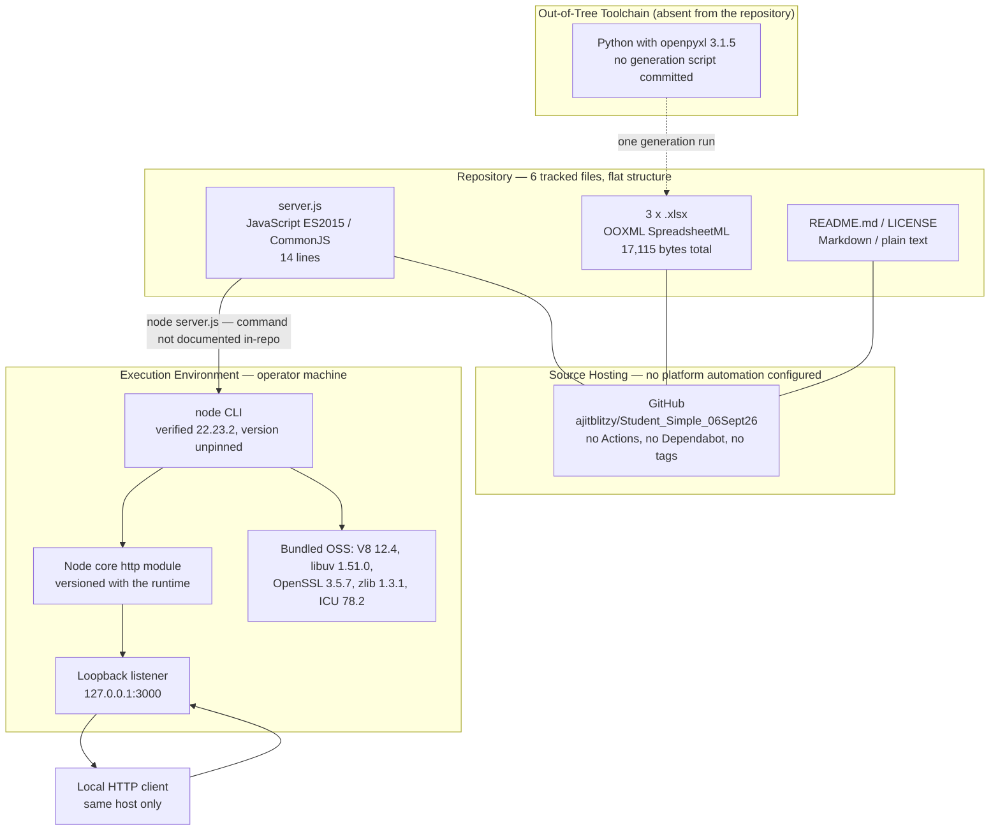
```mermaid
flowchart TB
    subgraph OutOfTree["Out-of-Tree Toolchain (absent from the repository)"]
        Py["Python with openpyxl 3.1.5<br/>no generation script committed"]
    end

    subgraph Repo["Repository — 6 tracked files, flat structure"]
        Src["server.js<br/>JavaScript ES2015 / CommonJS<br/>14 lines"]
        Data["3 x .xlsx<br/>OOXML SpreadsheetML<br/>17,115 bytes total"]
        Docs["README.md / LICENSE<br/>Markdown / plain text"]
    end

    subgraph Hosting["Source Hosting — no platform automation configured"]
        GH["GitHub<br/>ajitblitzy/Student_Simple_06Sept26<br/>no Actions, no Dependabot, no tags"]
    end

    subgraph Exec["Execution Environment — operator machine"]
        CLI["node CLI<br/>verified 22.23.2, version unpinned"]
        Core["Node core http module<br/>versioned with the runtime"]
        Bundled["Bundled OSS: V8 12.4, libuv 1.51.0,<br/>OpenSSL 3.5.7, zlib 1.3.1, ICU 78.2"]
        Sock["Loopback listener<br/>127.0.0.1:3000"]
        CLI --> Core
        CLI --> Bundled
        Core --> Sock
    end

    Client["Local HTTP client<br/>same host only"]

    Py -.->|"one generation run"| Data
    Src -->|"node server.js — command not documented in-repo"| CLI
    Src --- GH
    Data --- GH
    Docs --- GH
    Client --> Sock
    Sock --> Client
```

No arrow runs from `Data` into the execution environment, and that omission is deliberate and load-bearing: as § 3.5.5 establishes, no code path from the workbooks to the runtime exists. The dotted edge from the Python toolchain is likewise one-directional and historical — it produced the committed files once, at `2026-09-06T10:20:48Z`, and plays no part in running the system.

### 3.6.7 Additions Required to Reach a Deployable Baseline

The items below are the specific artifacts whose absence was verified above. They are recorded as gaps against ordinary deployment practice, not as a committed roadmap — the repository contains no roadmap, backlog, or `TODO` marker of any kind.

| Gap | Concrete Artifact | Effect |
| --- | --- | --- |
| Runtime floor undeclared | `package.json` with `engines.node` (and `type` omitted or `"commonjs"`, per § 3.2.3) | Records the supported, security-supported Node line |
| Launch procedure undocumented | A start script and a README run instruction | Makes the one operating command discoverable |
| No ignore policy | `.gitignore` | Prevents dependencies and secrets from being committed by default |
| No configuration surface | `process.env` reads for host and port | Prerequisite for any environment beyond a developer machine |
| No verification | A test asserting the response contract and the workbook join | Guards the two properties the system actually delivers |
| No automation | A CI workflow running that test | Makes the guard continuous rather than manual |
| No packaging | A `Dockerfile` with a pinned base image and a configurable bind address | Provides a reproducible, portable runtime unit |


## 3.7 References

Every factual claim in this section derives from the artifacts below. All were inspected directly in the repository checkout on branch `06-Sep-2026-Br1`.

### 3.7.1 Repository Files Examined

- `server.js` — the sole executable artifact; established the language (JavaScript), the ES2015 construct census (L1, L3, L4, L6, L12, L13), the CommonJS module system, the single `require('http')` import at L1, the five consumed runtime APIs, the loopback bind and fixed port at L3–L4, and the absence of `process.env`, `fs`, `https`, `JSON`, error handling, and any third-party reference
- `README.md` — 25 bytes, a single H1 heading; established that no run instruction, dependency declaration, or stack rationale is documented anywhere in the repository
- `LICENSE` — 201-line Apache License 2.0; established the licensing posture, the only two URLs in any tracked text file (L3, L195), and the unfilled copyright placeholder at L189
- `student_details.xlsx` — worksheet `Student Details`, range A1:J11, 6,018 bytes, 90 inline-string cells; contributed the OOXML packaging profile and generator provenance
- `student_academics.xlsx` — worksheet `Academics`, range A1:G11, 5,546 bytes, 27 inline-string cells; contributed the zero-custom-number-format finding behind the raw IEEE-754 storage
- `student_other_info.xlsx` — worksheet `Other Info`, range A1:F11, 5,551 bytes, 56 inline-string cells
- `.git/` — established Git 2.43.0 usage, the two-commit history (`fc1db66`, `778b97d`), the branch set, the absence of tags, and the GitHub host and repository slug

### 3.7.2 Workbook Package Parts Inspected

Inspected inside each of the three `.xlsx` archives:

- `docProps/app.xml` — declared `Microsoft Excel Compatible / Openpyxl 3.1.5` with `AppVersion` 3.1, identifying the generator and its exact version
- `docProps/core.xml` — `dc:creator` = `openpyxl` and identical `dcterms:created` / `dcterms:modified` values of `2026-09-06T10:20:48Z`, establishing a single programmatic generation run
- `[Content_Types].xml` — supplied the declared content types, including `application/vnd.openxmlformats-officedocument.spreadsheetml.sheet.main+xml`
- `xl/workbook.xml` — supplied the exact worksheet names and the empty `<workbookProtection/>` element
- `xl/worksheets/sheet1.xml` — supplied the populated ranges, inline-string cell counts, and the zero-formula verification
- `xl/styles.xml` — established zero custom `<numFmt>` definitions in all three workbooks
- `_rels/.rels`, `xl/_rels/workbook.xml.rels`, `xl/theme/theme1.xml` — completed the nine-part package inventory; the absence of `vbaProject`, `externalLink`, and `sharedStrings` parts established the inertness and inline-string findings

### 3.7.3 Verified-Absent Artifacts

The following were probed individually and found absent; their absence is itself the evidence for the no-framework, no-dependency, no-pipeline findings:

- Dependency manifests and lockfiles — `package.json`, `package-lock.json`, `yarn.lock`, `pnpm-lock.yaml`, `npm-shrinkwrap.json`, `bun.lockb`, `requirements.txt`, `pyproject.toml`, `Pipfile`, `poetry.lock`, `go.mod`, `Cargo.toml`, `pom.xml`, `build.gradle`, `Gemfile`, `composer.json`, `mix.exs`, `pubspec.yaml`, `Package.swift`
- Runtime and language configuration — `.nvmrc`, `.node-version`, `.npmrc`, `tsconfig.json`, `jsconfig.json`
- Build, quality, and editor tooling — `Makefile`, `babel.config.js`, `webpack.config.js`, `vite.config.js`, `rollup.config.js`, `jest.config.js`, `vitest.config.js`, `.mocharc.json`, `karma.conf.js`, `nodemon.json`, `.eslintrc`, `eslint.config.js`, `.prettierrc`, `.editorconfig`, `.vscode/`, `.idea/`
- Containerization, deployment, and IaC — `Dockerfile`, `.dockerignore`, `docker-compose.yml`, `Procfile`, `app.yaml`, `serverless.yml`, `vercel.json`, `netlify.toml`, `terraform/`, any `.tf` file, Kubernetes and Helm manifests
- CI/CD — `.github/`, `.gitlab-ci.yml`, `Jenkinsfile`, `azure-pipelines.yml`, `.circleci/`, `.travis.yml`, `appveyor.yml`
- Configuration, secrets, and governance — `.gitignore`, `.gitattributes`, `.env`, `.env.example`, `.env.local`, `SECURITY.md`, `CONTRIBUTING.md`, `CHANGELOG.md`, `NOTICE`, `AUTHORS`
- Directories — `src/`, `lib/`, `test/`, `tests/`, `__tests__/`, `spec/`, `node_modules/`, `dist/`, `build/`, `out/`, `public/`, `static/`, `config/`, `scripts/`, `docs/`, `data/`, `migrations/`, `db/`, `infra/`, `deploy/`

### 3.7.4 Verification Environment

- Node.js 22.23.2 (`/usr/bin/node`) — the only runtime against which `node --check` and the runtime component versions in § 3.1.4 were confirmed
- npm 11.18.0, Git 2.43.0, Python 3 — present in the environment; only Git is used by the repository, and npm and Python are not required by it

### 3.7.5 Cross-Referenced Specification Sections

- § 1.2 System Overview — supplied the "zero-dependency standard-library implementation" characterization, the empirical response contract, the Node-defaulted response headers, and the verified loopback boundary
- § 2.4 Implementation Considerations — supplied the undeclared-`engines` finding, the `openpyxl 3.1.5` generator citation, the per-request OOXML parsing-cost caveat, the unmonitored cross-workbook integrity risk, and the SPDX and license-field gaps

### 3.7.6 External Sources

- [web] Node.js release-policy guidance (Google Cloud, *Supported Node.js versions*) — confirmed that only even-numbered Node.js lines are LTS candidates, that odd-numbered lines reach end of life after roughly six months, and that an end-of-life runtime no longer receives critical security updates
- [web] Node.js 20.9.0 release announcement — confirmed the Node 20 "Iron" lifecycle: Active LTS from October 2023, Maintenance from October 2024, end of life April 2026
- [web] Google Cloud App Engine Node.js runtime documentation — confirmed that `engines` in `package.json` is the documented mechanism for declaring a Node.js version, and that Node.js 24 entered LTS in October 2025


# 4. Process Flowchart

## 4.1 System Workflows

This section documents the workflows that this repository actually executes. The repository contains one 14-line runtime module (`server.js`), three static OOXML workbooks, and two governance files; it contains no router, no middleware, no service layer, no worker, no scheduler, no queue, and no persistence layer. Probes for `routes/`, `router/`, `controllers/`, `workers/`, `jobs/`, `queue/`, `cron`, `tasks/`, `handlers/`, `middleware/`, `services/`, `migrations/`, `events/`, `pubsub/`, `batch/`, `etl/`, and `pipelines/` all returned absent, and the repository has zero subdirectories.

Consequently the workflow inventory is closed and small. Every flow below was executed and observed on Node v22.23.2 rather than inferred from the source.

| ID | Workflow | Trigger | Status |
| --- | --- | --- | --- |
| WF-01 | Service bootstrap and listener bind | Operator runs `node server.js` | Implemented — `server.js` L1–L4, L6, L12 |
| WF-02 | HTTP request–response cycle | Inbound loopback TCP connection | Implemented — `server.js` L6–L10 |
| WF-03 | Readiness signalling | Successful socket bind | Implemented — `server.js` L12–L13 |
| WF-04 | Process termination | External signal or unhandled `'error'` event | Implemented only by the runtime; no in-code handler |
| WF-05 | Data-asset provisioning | Human action, outside the repository | Out-of-band — evidenced only by file and commit metadata |
| WF-06 | Student data retrieval and join | — | **Not implemented** — no code path exists |

Two structural facts govern every diagram that follows. First, the process boundary is a hard one: `server.js` L3 binds `127.0.0.1`, and a request to the host's routable address `10.76.0.146:3000` was refused at the kernel (curl exit 7, `http_code 000`) while `127.0.0.1:3000` returned `200` — so all user touchpoints are same-host touchpoints (requirement `F-001-RQ-003`). Second, the runtime and the data assets never meet: the only `require` in the repository is `require('http')` at L1, and a case-sensitive sweep of `server.js` for `student_`, `xlsx`, `fs.`, `readFile`, and `csv` returns zero matches, which is why WF-06 appears in the inventory as an absence.

### 4.1.1 Core Business Processes

#### 4.1.1.1 High-Level System Workflow

The diagram below is the end-to-end view across all three actors. Swim lanes separate the human operator, the Node.js process, and the local HTTP client; the shaded lane boundaries are also the trust and reachability boundaries of the system.

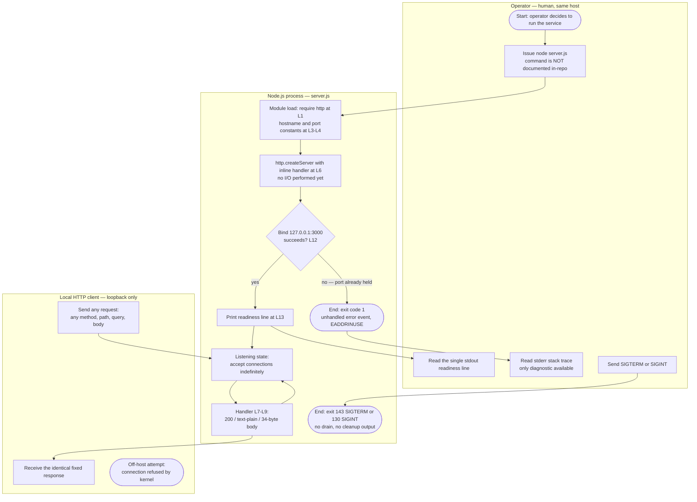
```mermaid
flowchart TB
    subgraph OperatorLane["Operator — human, same host"]
        OpStart(["Start: operator decides to run the service"])
        OpCmd["Issue node server.js<br/>command is NOT documented in-repo"]
        OpRead["Read the single stdout readiness line"]
        OpDiag["Read stderr stack trace<br/>only diagnostic available"]
        OpStop["Send SIGTERM or SIGINT"]
        OpStart --> OpCmd
    end

    subgraph ProcessLane["Node.js process — server.js"]
        Load["Module load: require http at L1<br/>hostname and port constants at L3-L4"]
        Create["http.createServer with inline handler at L6<br/>no I/O performed yet"]
        BindQ{"Bind 127.0.0.1:3000<br/>succeeds? L12"}
        Ready["Print readiness line at L13"]
        Listening["Listening state:<br/>accept connections indefinitely"]
        Serve["Handler L7-L9:<br/>200 / text-plain / 34-byte body"]
        Crash(["End: exit code 1<br/>unhandled error event, EADDRINUSE"])
        Gone(["End: exit 143 SIGTERM or 130 SIGINT<br/>no drain, no cleanup output"])
        Load --> Create --> BindQ
        BindQ -->|"yes"| Ready
        Ready --> Listening
        BindQ -->|"no — port already held"| Crash
        Listening --> Serve
        Serve --> Listening
    end

    subgraph ClientLane["Local HTTP client — loopback only"]
        Send["Send any request:<br/>any method, path, query, body"]
        Recv["Receive the identical fixed response"]
        OffHost(["Off-host attempt:<br/>connection refused by kernel"])
    end

    OpCmd --> Load
    Ready --> OpRead
    Crash --> OpDiag
    OpStop --> Gone
    Send --> Listening
    Serve --> Recv
```

The high-level flow has exactly one decision point of its own — whether the bind succeeds — and that decision is not made by application code but by the operating system, surfaced to the process as an `'error'` event that nothing listens for. Beyond that, the process is a two-state machine (listening or gone) and the request path is unconditional.

#### 4.1.1.2 WF-01 — Service Bootstrap and Listener Bind

Bootstrap is a straight-line sequence with a single failure branch. Its most consequential property is ordering: the readiness message lives inside the `listen` callback, so it is printed only after the socket is bound and can never be emitted by a process that failed to start.

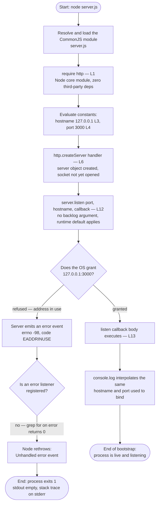
```mermaid
flowchart TD
    Begin(["Start: node server.js"])
    Resolve["Resolve and load the CommonJS module<br/>server.js"]
    Import["require http — L1<br/>Node core module, zero third-party deps"]
    Consts["Evaluate constants:<br/>hostname 127.0.0.1 L3, port 3000 L4"]
    Factory["http.createServer handler — L6<br/>server object created, socket not yet opened"]
    ListenCall["server.listen port, hostname, callback — L12<br/>no backlog argument, runtime default applies"]
    BindDec{"Does the OS grant<br/>127.0.0.1:3000?"}
    ErrEvt["Server emits an error event<br/>errno -98, code EADDRINUSE"]
    NoHandler{"Is an error listener<br/>registered?"}
    Throw["Node rethrows:<br/>Unhandled error event"]
    Die(["End: process exits 1<br/>stdout empty, stack trace on stderr"])
    CbFires["listen callback body executes — L13"]
    Log["console.log interpolates the same<br/>hostname and port used to bind"]
    Live(["End of bootstrap:<br/>process is live and listening"])

    Begin --> Resolve --> Import --> Consts --> Factory --> ListenCall --> BindDec
    BindDec -->|"granted"| CbFires --> Log --> Live
    BindDec -->|"refused — address in use"| ErrEvt --> NoHandler
    NoHandler -->|"no — grep for on error returns 0"| Throw --> Die
```

Observed evidence for each terminal state: a clean start prints exactly `Server running at http://127.0.0.1:3000/` on stdout with empty stderr; a second concurrent start exits with code `1`, prints nothing on stdout, and emits `Error: listen EADDRINUSE: address already in use 127.0.0.1:3000` preceded by `throw er; // Unhandled 'error' event`. The incumbent process is unaffected by the failed one. There is no retry, no backoff, and no alternate-port fallback — `retry`, `retries`, `backoff`, `fallback`, and `circuit` all return zero matches in `server.js`.

Two bootstrap-adjacent gaps belong to this workflow rather than to error handling. The launch command itself is nowhere in the repository (a search for `node ` across `server.js` and `README.md` returns no matches, as recorded in § 3.6.2), and there is no configuration surface to change the bind target, because `process.env` never appears — so the flow above is the only bootstrap the repository admits (`F-001-RQ-004`).

#### 4.1.1.3 WF-02 — HTTP Request–Response Cycle

This is the system's only user-facing process. Its defining characteristic is that all of its decision points sit *outside* the application handler: the kernel decides admissibility, Node's HTTP parser decides well-formedness, and only then does application code run — unconditionally, to completion, with no branch of any kind.

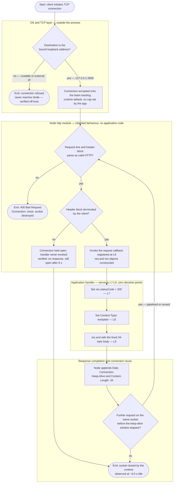
```mermaid
flowchart TD
    ReqStart(["Start: client initiates TCP connection"])

    subgraph KernelBoundary["OS and TCP layer — outside the process"]
        AddrDec{"Destination is the<br/>bound loopback address?"}
        Refuse(["End: connection refused<br/>never reaches Node — verified off-host"])
        Backlog["Connection accepted onto the listen backlog<br/>runtime default, no cap set by the app"]
        AddrDec -->|"no — routable or external IP"| Refuse
        AddrDec -->|"yes — 127.0.0.1:3000"| Backlog
    end

    subgraph RuntimeLayer["Node http module — inherited behaviour, no application code"]
        ParseDec{"Request line and header block<br/>parse as valid HTTP?"}
        BadReq(["End: 400 Bad Request<br/>Connection: close, socket destroyed"])
        CompleteDec{"Header block terminated<br/>by the client?"}
        Stall["Connection held open, handler never invoked<br/>verified: no response, still open after 8 s"]
        Dispatch["Invoke the request callback registered at L6<br/>req and res objects constructed"]
        ParseDec -->|"no"| BadReq
        ParseDec -->|"yes"| CompleteDec
        CompleteDec -->|"no"| Stall
        CompleteDec -->|"yes"| Dispatch
    end

    subgraph AppLayer["Application handler — server.js L7-L9, zero decision points"]
        SetStatus["Set res.statusCode = 200 — L7"]
        SetType["Set Content-Type: text/plain — L8"]
        EndBody["res.end with the fixed 34-byte body — L9"]
        SetStatus --> SetType --> EndBody
    end

    subgraph Completion["Response completion and connection reuse"]
        Framing["Node appends Date, Connection,<br/>Keep-Alive and Content-Length: 34"]
        ReuseDec{"Further request on the same socket<br/>before the keep-alive window elapses?"}
        Closed(["End: socket closed by the runtime<br/>observed at ~6.0 s idle"])
        Framing --> ReuseDec
        ReuseDec -->|"no"| Closed
    end

    ReqStart --> AddrDec
    Backlog --> ParseDec
    Dispatch --> SetStatus
    EndBody --> Framing
    ReuseDec -->|"yes — pipelined or reused"| ParseDec
    Stall --> Closed
```

The invariance of the response was established by probing eight request variants against the running server. `GET /`, `GET /students/S001/academics`, `GET /students?dept=Computer%20Science&gpa_min=8.5`, `POST /students` with body `{"studentId":"S001"}` and `Content-Type: application/json`, `PUT`, `DELETE`, `PATCH`, and `OPTIONS` all returned byte-identically `200 | text/plain | 34 bytes`; `HEAD /` returned the same headers with the entity body suppressed by the runtime. The handler is therefore method-, path-, query-, header- and payload-agnostic (`F-002-RQ-001` through `F-002-RQ-004`), and request data is accepted by the parser and discarded — `req` is never dereferenced anywhere in the file.

Header provenance matters when reading the flow, because only two response attributes are the application's: status `200` (L7) and `Content-Type: text/plain` (L8). `Date`, `Connection: keep-alive`, `Keep-Alive: timeout=5`, and `Content-Length: 34` are all produced by the runtime, since `res.writeHead` is never called. Likewise, the `400 Bad Request` branch is a runtime response, not an application one: sending `THIS-IS-NOT-HTTP\r\n\r\n` on a raw socket returned exactly `HTTP/1.1 400 Bad Request` with `Connection: close`, and the process survived with empty stderr. **That 400 is the only non-200 status this service can emit**, and it is emitted without application code ever running.

#### 4.1.1.4 WF-03 — Readiness Signalling and WF-04 — Termination

These two workflows bracket the service's life and are best read together, because each is a single step with no branch.

| Workflow | Steps | Observed result |
| --- | --- | --- |
| WF-03 readiness | `listen` callback fires → `console.log` at L13 | Exactly one stdout line, `Server running at http://127.0.0.1:3000/`; stderr empty (`F-003-RQ-001`) |
| WF-03 steady state | none | Still exactly one stdout line after 9 individual requests and a 100-request burst — no per-request logging exists (`F-003-RQ-003`) |
| WF-04 SIGTERM | signal delivered → default disposition | Exit status 143, no output, port refuses connections immediately afterwards |
| WF-04 SIGINT | signal delivered → default disposition | Exit status 130, no output |

Because `process.on` never appears in `server.js`, neither signal is intercepted: in-flight responses are not drained, sockets are not closed cooperatively, and no shutdown record is written. Termination is instantaneous and silent, which is acceptable for a stateless fixed-response service but means the flow offers no hook for connection draining if the handler ever becomes stateful.

#### 4.1.1.5 End-to-End User Journeys

The repository supports exactly one complete user journey, and it is a technical one rather than a business one. An operator on the host starts the process, reads the readiness line, issues any HTTP request from the same host, and receives the fixed greeting; nothing about the journey depends on who the user is or what they asked for.

The student-domain journeys a reader would expect from the repository's name and data — look up a student, view academic standing, check fee or hostel status, filter by department — are **not implemented as journeys at all**. The information exists (three joinable workbooks covering identity, academics, and ancillary administration for `S001`–`S010`), but the only way to traverse it is for a human to open the files in a spreadsheet application outside the system. There is no endpoint, query interface, export, or command that reaches the data, so these journeys have no decision points, no validation, and no error paths to document. § 2.3.5 records the same conclusion structurally: the working service entry point and the validated data model are, at present, strangers.

### 4.1.2 Integration Workflows

The system has two integration points and both are boundaries rather than couplings, as established in § 2.3.2: a loopback TCP socket whose request contract is empty, and three `.xlsx` files reachable only by file path. Everything below follows from that.

#### 4.1.2.1 Integration Workflow Inventory

| Integration Category | Status in this repository | Evidence |
| --- | --- | --- |
| Data flow between systems | Only the out-of-band provisioning flow (WF-05) | File and commit metadata; no in-repo transfer code |
| API interactions — inbound | One socket, empty request contract, fixed response | 8 probe variants returned identical responses |
| API interactions — outbound | None — the process never calls anything | No client-request construction; single `require` is `http` |
| Event processing | None | No `EventEmitter` use beyond the implicit `'error'` event no one listens for; no broker, no `pubsub/` |
| Batch processing | One historical, out-of-tree run (WF-05) | Identical `dcterms:created` across all three workbooks |
| Scheduled processing | None | No `cron`, `crontab`, `setInterval`, or `setTimeout` anywhere |

#### 4.1.2.2 WF-05 — Data-Asset Provisioning Pipeline

This is the only multi-system data flow the repository evidences, and it is entirely human-driven. It is reconstructed from artifact metadata, not from code, because no stage of it is implemented in-repo.

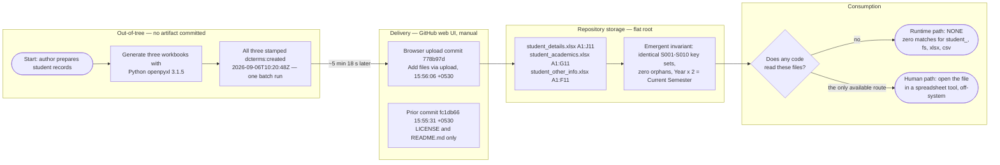
```mermaid
flowchart LR
    subgraph OutOfTree["Out-of-tree — no artifact committed"]
        GenStart(["Start: author prepares student records"])
        Gen["Generate three workbooks with<br/>Python openpyxl 3.1.5"]
        Stamp["All three stamped dcterms:created<br/>2026-09-06T10:20:48Z — one batch run"]
        GenStart --> Gen --> Stamp
    end

    subgraph Delivery["Delivery — GitHub web UI, manual"]
        Upload["Browser upload commit 778b97d<br/>Add files via upload, 15:56:06 +0530"]
        Prior["Prior commit fc1db66 15:55:31 +0530<br/>LICENSE and README.md only"]
    end

    subgraph Storage["Repository storage — flat root"]
        Files["student_details.xlsx A1:J11<br/>student_academics.xlsx A1:G11<br/>student_other_info.xlsx A1:F11"]
        Integrity["Emergent invariant: identical S001-S010 key sets,<br/>zero orphans, Year x 2 = Current Semester"]
        Files --> Integrity
    end

    subgraph Consumption["Consumption"]
        Missing{"Does any code<br/>read these files?"}
        NoPath(["Runtime path: NONE<br/>zero matches for student_, fs, xlsx, csv"])
        Manual(["Human path: open the file<br/>in a spreadsheet tool, off-system"])
        Missing -->|"no"| NoPath
        Missing -->|"the only available route"| Manual
    end

    Stamp -->|"~5 min 18 s later"| Upload
    Upload --> Files
    Integrity --> Missing
```

Three properties of this pipeline are worth recording as workflow risks. The generation stage is not reproducible from the repository, because no generation script is committed and no Python manifest exists — the `openpyxl 3.1.5` attribution survives only in `docProps/app.xml`. The delivery stage is a manual browser upload rather than a build or sync job, so there is no provenance, review, or validation gate between generation and storage; `778b97d` landed all three workbooks plus `server.js` in a single commit 35 seconds after the repository's initial commit. And the integrity invariant that makes the three files a data model — identical key sets and the `Year × 2 = Current Semester` rule (`F-007-RQ-002`, `F-007-RQ-004`) — is enforced by nothing: there is no test, no schema, no validation script, and no CI workflow observing it, and because the files are binary, an uncoordinated edit would also be invisible in code review (§ 3.6.4).

#### 4.1.2.3 Absent Integration Workflows

The following flows were each checked and do not exist; they are listed so that the section's coverage is unambiguous rather than merely silent.

- **Outbound API calls, webhooks, and third-party services.** The process constructs no client request of any kind, and no credential, connection string, endpoint URL, or webhook target appears in any tracked file. The only absolute URLs in the repository are the two Apache license references inside `LICENSE`.
- **Event processing flows.** No message broker, event bus, subscription, or emitter registration exists. The only event in the system is the `'error'` event that Node emits on a failed bind, and its "handler" is Node's default rethrow.
- **Batch and scheduled sequences inside the system.** No scheduler, no timer, no job runner, and no queue. WF-05 is a one-time historical batch performed by an external toolchain, not a recurring job the system runs.
- **Inter-service or inter-process data flow.** There is one process and no IPC, clustering, or worker threads; `cluster` and `worker` return zero matches.
- **Database and cache interactions.** No driver, no connection, no cache client — the request path performs no I/O at all beyond writing the response.


## 4.2 Flowchart Requirements and Validation Rules

This sub-section audits the workflows of § 4.1 against the structural elements a process flowchart is expected to carry — terminal points, process steps, decision diamonds, system boundaries, user touchpoints, error states with recovery paths, and timing constraints — and then documents the validation rules that apply at each step. Where an element is absent, that is recorded as a verified finding.

### 4.2.1 Workflow Element Coverage

Terminal points, steps, and decisions:

| Workflow | Start point | End point(s) | Decision diamonds |
| --- | --- | --- | --- |
| WF-01 bootstrap | Operator runs `node server.js` | Live and listening, **or** exit code 1 | One: does the OS grant `127.0.0.1:3000`? (OS-made, surfaced as an unhandled `'error'` event) |
| WF-02 request cycle | Client initiates a loopback TCP connection | Response written and socket reused or closed, **or** `400` + close, **or** kernel refusal | Three, all outside application code: destination admissibility (kernel), HTTP well-formedness (parser), header-block completeness (parser). **Zero inside the handler** |
| WF-03 readiness | `listen` callback fires | One stdout line written | None |
| WF-04 termination | Signal delivered, or unhandled `'error'` | Exit 143 (SIGTERM), 130 (SIGINT), or 1 (bind failure) | None — no signal is intercepted |
| WF-05 provisioning | Author prepares records off-system | Files stored in the repository; consumption is manual only | One: does any code read the files? (answer: no) |
| WF-06 data retrieval | — | — | Not implemented; no flow exists |

Boundaries, touchpoints, and failure handling:

| Workflow | System boundaries crossed | User touchpoints | Error states and recovery |
| --- | --- | --- | --- |
| WF-01 | Shell → Node process → OS socket layer | Command invocation; stdout readiness line; stderr stack trace on failure | `EADDRINUSE` → immediate exit 1. Recovery is manual: free port 3000 or edit L4, then re-run |
| WF-02 | Client → kernel/TCP → Node `http` module → application handler | The single loopback socket `127.0.0.1:3000`; response body is the only user-visible output | Kernel refusal (off-host), runtime `400` on malformed input, stalled half-open request. All handled by layers below the application; the process survives each |
| WF-03 | Process → stdout stream | The readiness line — the only success signal the system emits | None. If stdout is not captured, the signal is lost and unrecoverable |
| WF-04 | Signal sender → process | Operator's `kill` or Ctrl+C | No in-flight drain; abrupt termination is the designed-in behaviour. Recovery is a fresh WF-01 |
| WF-05 | Author's Python toolchain → GitHub web UI → repository → spreadsheet application | Browser upload; manual file open | No validation gate anywhere in the chain; a corrupt or inconsistent upload would be accepted silently |

The single most important structural observation is in row WF-02: the application handler contains no decision diamond at all. Every branch that appears in the request flow belongs to the kernel or to Node's `http` module. This is why the response is byte-identical across eight probed request variants and why the only non-`200` status the service can produce is the parser's `400`.

### 4.2.2 Timing and SLA Considerations

**No service-level objective is codified anywhere in this repository.** A combined sweep of `server.js` and `README.md` for `timeout`, `threshold`, `slo`, `sla`, `latency`, `p95`, `p99`, `metric`, `rate limit`, `budget`, `health`, `readiness`, `liveness`, and `quota` returned zero matches in each file. Every timing constraint that actually governs the flows is therefore an **inherited runtime default**, not a project commitment.

| Constraint | Effective value | Provenance |
| --- | --- | --- |
| Keep-alive idle window | 5,000 ms advertised (`Keep-Alive: timeout=5` on the live response); idle close observed at ~6.0 s | Node default; sweep cadence explains the overshoot |
| Header-phase limit | 60,000 ms (`headersTimeout`) | Node default — never set or read by the application |
| Whole-request limit | 300,000 ms (`requestTimeout`) | Node default |
| Socket inactivity timeout | 0 — disabled | Node default (`server.timeout`) |
| Requests per connection | 0 — unlimited (`maxRequestsPerSocket`) | Node default |
| Concurrent connection cap | none (`maxConnections` undefined); listen backlog is the runtime default because L12 passes no backlog argument | Node default |
| Expired-connection sweep | 30,000 ms (`connectionsCheckingInterval`) | Node default |

That `server.js` overrides none of these was proved by grep: `keepAliveTimeout`, `headersTimeout`, `requestTimeout`, `setTimeout`, `maxRequestsPerSocket`, `maxHeadersCount`, `maxConnections`, `backlog`, `clientError`, and `on(` together return zero occurrences in the file.

Measured behaviour, recorded as observation rather than as a target:

- **Time to ready (WF-01):** five runs measured 51–58 ms wall-clock, each including an extra supervising Node process, so the service's own bind-to-readiness time is below that band on this host.
- **Request latency (WF-02):** ten sequential loopback samples showed connect times of 56–66 µs, time-to-first-byte of 0.25–0.62 ms, and totals of 0.27–0.64 ms.
- **Concurrency (WF-02):** a burst of 100 requests at ten-way parallelism returned 100 × `200` with zero failures.
- **Absence of timing observability:** stdout still contained exactly one line after that burst, so duration, throughput, and error rate cannot be measured from the process at all. Any SLA introduced later would be unmeasurable until instrumentation is added.

One timing exposure follows directly from the defaults above. A half-open request — headers sent but never terminated — was verified to receive no response and to hold its connection open for the full 8-second observation window, with the application entirely unaware. Because `server.timeout` is disabled and the header-phase limit is 60 seconds, a stalled connection is retained far longer than any request legitimately needs, and the application has no admission control, no connection cap, and no visibility with which to react.

### 4.2.3 Validation Rules

#### 4.2.3.1 Request-Path Validation

The runtime code contains no validation construct whatsoever: `valid`, `schema`, `sanitize`, `escape`, `allowlist`, `whitelist`, `assert`, `authorize`, `permission`, `role`, `acl`, and `rbac` together return zero matches in `server.js`. All validation that occurs is performed by Node's HTTP parser before the handler is entered.

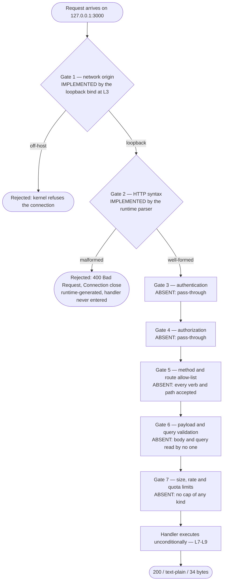
```mermaid
flowchart TD
    Arrive(["Request arrives on 127.0.0.1:3000"])
    G1{"Gate 1 — network origin<br/>IMPLEMENTED by the loopback bind at L3"}
    Rej1(["Rejected: kernel refuses the connection"])
    G2{"Gate 2 — HTTP syntax<br/>IMPLEMENTED by the runtime parser"}
    Rej2(["Rejected: 400 Bad Request, Connection close<br/>runtime-generated, handler never entered"])
    G3["Gate 3 — authentication<br/>ABSENT: pass-through"]
    G4["Gate 4 — authorization<br/>ABSENT: pass-through"]
    G5["Gate 5 — method and route allow-list<br/>ABSENT: every verb and path accepted"]
    G6["Gate 6 — payload and query validation<br/>ABSENT: body and query read by no one"]
    G7["Gate 7 — size, rate and quota limits<br/>ABSENT: no cap of any kind"]
    Handler["Handler executes unconditionally — L7-L9"]
    Out(["200 / text-plain / 34 bytes"])

    Arrive --> G1
    G1 -->|"off-host"| Rej1
    G1 -->|"loopback"| G2
    G2 -->|"malformed"| Rej2
    G2 -->|"well-formed"| G3
    G3 --> G4 --> G5 --> G6 --> G7 --> Handler --> Out
```

| Validation class | Status | Basis |
| --- | --- | --- |
| Transport-level origin restriction | **Enforced** | Loopback bind at L3; off-host connection to `10.76.0.146:3000` refused (`F-001-RQ-003`) |
| HTTP message well-formedness | **Enforced by the runtime** | Raw garbage on the socket answered `400 Bad Request` + `Connection: close` |
| Method allow-list | Absent | `GET`, `POST`, `PUT`, `DELETE`, `PATCH`, `OPTIONS`, `HEAD` all answered identically |
| Resource existence / routing | Absent | `GET /students/S001/academics` answered identically to `GET /` |
| Content negotiation | Absent | Response is always `text/plain` regardless of `Accept` |
| Request body / query validation | Absent | A JSON body and a query string were both accepted and discarded; `req` is never dereferenced |
| Size, rate, and concurrency limits | Absent | No cap set by the application; `maxRequestsPerSocket` 0 and `maxConnections` undefined |

#### 4.2.3.2 Authorization Checkpoints

There is **no authorization checkpoint in any workflow**. No authentication mechanism, session, token, cookie, or role model exists, so no flow step has an identity to authorize against. The single control that is actually in force is topological: because the listener is bound to `127.0.0.1`, only processes on the same host can reach it, which makes host-level access the de facto authorization boundary. Two consequences should be read together with § 3.6.3 — the control is effective today but is an artifact of the bind address rather than a policy decision, and it would silently disappear the moment the bind address were widened for containerization or remote access, since nothing downstream would then restrict anything.

#### 4.2.3.3 Data-Domain Business Rules

The workbooks obey a coherent set of rules, all re-verified directly from the sheet XML. None of them is enforced by code, a schema, a workbook data-validation part, a test, or a CI job — they are properties of the current file contents that a consumer must re-check for itself.

| Rule | Verified state | Enforcement |
| --- | --- | --- |
| `Student ID` unique within each workbook | Holds — no duplicates in any file (`F-007-RQ-001`) | None |
| Identical key sets across all three workbooks, zero orphans | Holds — `S001`–`S010`, symmetric difference empty in both comparisons (`F-007-RQ-002`) | None |
| `Year × 2 = Current Semester` | Holds for all 10 records (`F-007-RQ-004`) | None — a cross-file rule with no cross-file mechanism |
| `Date of Birth` is ISO `YYYY-MM-DD` text | Holds for all 10; stored as text, not an Excel date serial | None — consumers must parse strings |
| `Phone` is 10-character text | Holds for all 10; text storage preserves leading digits | None |
| Categorical domains: `Result Status`, `Fee Status`, `Scholarship Holder` | `{Pass}`, `{Paid, Pending}`, `{No, Yes}` respectively | None |
| `Attendance %` within 82–98; `Overall GPA` within 7.5–9.4 | Holds | None — no min/max constraint is declared |
| `Overall GPA` as a derived value | **Inconsistent** — differs from `Current GPA` in exactly 1 of 10 records | None; the derivation rule is undocumented |

Two of these rows carry direct consequences for any future flow built over this data. Because `Result Status` contains only `Pass`, there is **no negative fixture** in the repository — a validation or eligibility flow written against this data would have no failing case to exercise. And because the workbooks declare zero custom number formats, GPA values are stored as raw IEEE-754 doubles (`8.199999999999999` for `S001`'s current GPA), so rounding is unavoidably the consumer's responsibility at the presentation step of any flow.

#### 4.2.3.4 Regulatory and Compliance Checks

No compliance control is implemented in any workflow. The sweep in § 4.2.2 also covered `retention`, `audit`, `consent`, and `encrypt`, and returned zero matches, and § 2.3.4 independently records the absence of any logging, audit, or error-handling service. Concretely, the workflows contain no consent capture, no data-subject access or deletion path, no retention or deletion schedule, no audit trail (the process writes exactly one log line in its lifetime, at startup), and no transport encryption — traffic is plaintext HTTP, with `https` and `tls` absent from the code.

The compliance-relevant nuance is that the *schema* is personal-data-bearing while the *values* are not. `student_details.xlsx` carries `Name`, `Date of Birth`, `Email`, `Phone`, and `City`, but every email uses the reserved documentation domain `example.edu` and the ten phone numbers run sequentially `9822011001`–`9822011010`, so the committed data is synthetic and no real personal data is exposed today. That distinction is the whole compliance posture: the repository has no obligation to discharge because it holds no real records, and it has no mechanism to discharge one if real student records were ever loaded into the same schema and served over the same plaintext, unauthenticated socket.

On the licensing side, `LICENSE` carries the verbatim Apache License 2.0 text, which is a compliance artifact rather than a compliance check — no SPDX identifier, `package.json` `license` field, `NOTICE` file, or scanning step exists in any workflow, so attribution obligations are documented but unverified (`F-008-RQ-001`, `F-008-RQ-003`).


## 4.3 Technical Implementation

This sub-section documents how the workflows of § 4.1 are realised in terms of state and failure behaviour. Both topics are unusually short-lived in this system: the application holds no state between requests, and it handles no errors at all — every error is disposed of by a layer beneath it.

### 4.3.1 State Management

#### 4.3.1.1 Process and Listener State Transitions

The process has five reachable states and three terminal ones. All of them are in-memory and process-scoped; nothing about the state survives the process.

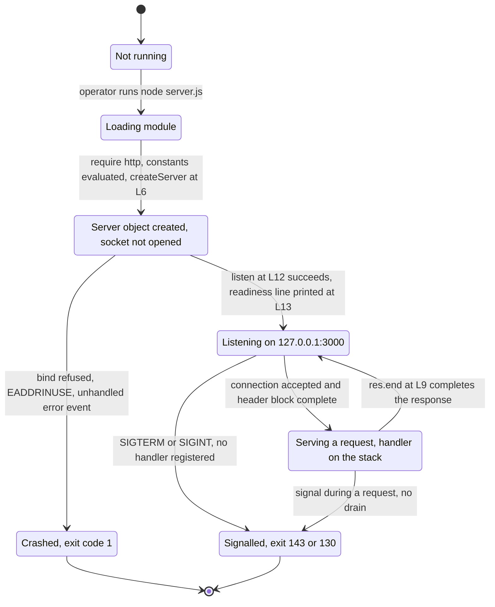
```mermaid
stateDiagram-v2
    [*] --> NotRunning
    state "Not running" as NotRunning
    state "Loading module" as Loading
    state "Server object created, socket not opened" as Created
    state "Listening on 127.0.0.1:3000" as Listening
    state "Serving a request, handler on the stack" as Serving
    state "Crashed, exit code 1" as Crashed
    state "Signalled, exit 143 or 130" as Signalled

    NotRunning --> Loading: operator runs node server.js
    Loading --> Created: require http, constants evaluated, createServer at L6
    Created --> Listening: listen at L12 succeeds, readiness line printed at L13
    Created --> Crashed: bind refused, EADDRINUSE, unhandled error event
    Listening --> Serving: connection accepted and header block complete
    Serving --> Listening: res.end at L9 completes the response
    Listening --> Signalled: SIGTERM or SIGINT, no handler registered
    Serving --> Signalled: signal during a request, no drain
    Crashed --> [*]
    Signalled --> [*]
```

Three properties of this machine are worth stating explicitly because they shape every operational procedure in § 4.3.2. There is **no graceful-shutdown state** — `process.on` never appears, so the transition to `Signalled` is immediate from either `Listening` or `Serving`, with in-flight work abandoned. There is **no self-recovery edge** — no transition returns from `Crashed` or `Signalled` to `Loading`, because the repository defines no supervisor, restart policy, or process manager. And the `Listening` state is absorbing under normal operation: the process holds an active handle and will never exit on its own, so it runs until a signal or a host event ends it.

#### 4.3.1.2 Connection and Request State Transitions

Per-connection state is owned entirely by Node's `http` module. The application participates in exactly one state — response generation — and leaves it unconditionally.

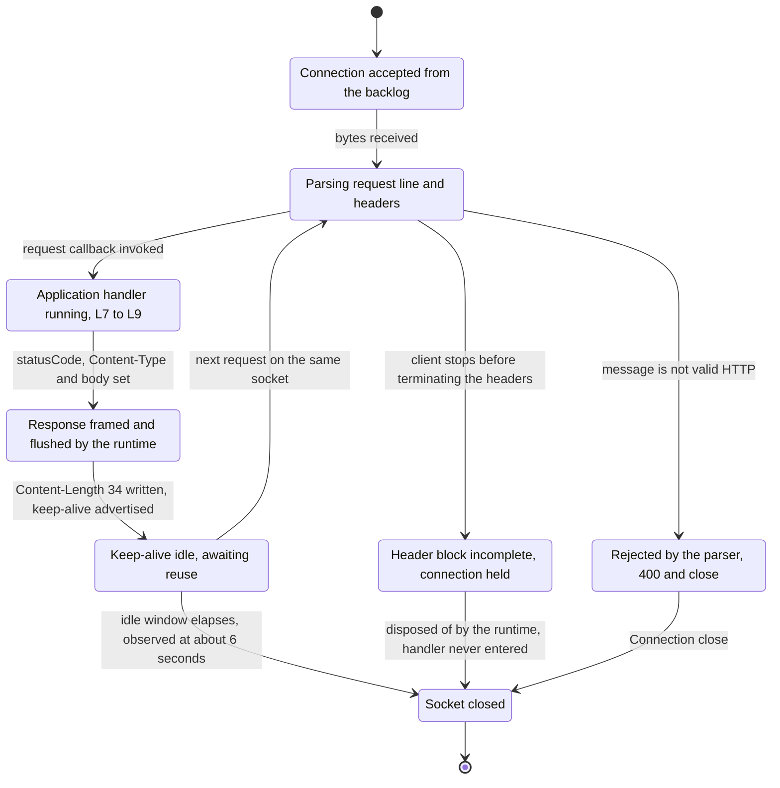
```mermaid
stateDiagram-v2
    [*] --> Accepted
    state "Connection accepted from the backlog" as Accepted
    state "Parsing request line and headers" as Parsing
    state "Header block incomplete, connection held" as Stalled
    state "Application handler running, L7 to L9" as Handling
    state "Response framed and flushed by the runtime" as Responding
    state "Keep-alive idle, awaiting reuse" as Idle
    state "Rejected by the parser, 400 and close" as Rejected
    state "Socket closed" as Closed

    Accepted --> Parsing: bytes received
    Parsing --> Rejected: message is not valid HTTP
    Parsing --> Stalled: client stops before terminating the headers
    Parsing --> Handling: request callback invoked
    Handling --> Responding: statusCode, Content-Type and body set
    Responding --> Idle: Content-Length 34 written, keep-alive advertised
    Idle --> Parsing: next request on the same socket
    Idle --> Closed: idle window elapses, observed at about 6 seconds
    Stalled --> Closed: disposed of by the runtime, handler never entered
    Rejected --> Closed: Connection close
    Closed --> [*]
```

The `Stalled` state was observed directly: a request whose header block was never terminated produced no response and kept its connection open for the full 8-second observation window while the application remained unaware of it. Because the application registers no `clientError` listener and sets no socket timeout, both `Rejected` and `Stalled` are resolved without any application involvement.

#### 4.3.1.3 Data Persistence, Caching, and Transaction Boundaries

| Concern | Implementation in this repository |
| --- | --- |
| Application state | **None.** No variable is mutated after module load; the three module-scoped bindings (`http`, `hostname`, `port`) are `const` and never reassigned. No counter, session store, or in-memory collection exists |
| Runtime persistence points | **None.** No `fs` usage, no write path, no database driver, no connection string — the request path performs no I/O beyond writing the response to the socket |
| Server-side caching | **None.** `cache`, `database`, `sql`, `mongo`, and `redis` are all absent; the response is regenerated from a literal on every request |
| Client-side cache directives | **None emitted.** The verified response carries only `Content-Type`, `Date`, `Connection`, `Keep-Alive`, and `Content-Length` — no `Cache-Control`, `ETag`, or `Last-Modified`, so caching behaviour is left entirely to client defaults |
| Durable data | The three `.xlsx` workbooks, written only by out-of-band commits. Git is the de facto persistence mechanism; the running process neither reads nor writes them |

**Transaction boundaries** exist in two very different senses, and neither involves a transactional resource manager.

At runtime, the atomic unit is the single `res.end(...)` call at L9. Because the whole body is supplied in one call, the runtime frames it with `Content-Length: 34` rather than chunked encoding, so a response is either delivered whole or the socket fails — there is no partial-write state the application can observe or compensate for, and no rollback is meaningful because nothing was mutated.

For the data assets, the effective transaction boundary is **the Git commit**. The three workbooks are only mutually consistent because commit `778b97d` introduced all of them together; the `Student ID` key sets and the `Year × 2 = Current Semester` rule span three independently editable binary files with no schema, constraint, or validation job connecting them (§ 3.6.4). Commit atomicity is therefore the only mechanism preserving cross-workbook integrity, and it protects that integrity only if every future edit continues to touch all affected files in one commit.

### 4.3.2 Error Handling

#### 4.3.2.1 Error Taxonomy and Disposition

Every failure mode below was reproduced against the running service. The pattern across the table is the point: the layer that detects an error is always the layer that disposes of it, and that layer is never the application.

| Error condition | Detected by | Disposition | Process survives |
| --- | --- | --- | --- |
| Port already bound (`EADDRINUSE`, errno -98) | OS, surfaced as a server `'error'` event | Node rethrows — `throw er; // Unhandled 'error' event`; stack trace to stderr; stdout stays empty so no readiness line is ever printed | No — exit code 1 |
| Malformed HTTP message | Node's HTTP parser | `HTTP/1.1 400 Bad Request` + `Connection: close`, socket destroyed; handler never entered | Yes — stderr stayed empty |
| Half-open request (headers never terminated) | Node's connection expiry machinery | Connection held, then disposed of by the runtime; no response, no log | Yes |
| Idle keep-alive connection | Node | Socket closed after the idle window (~6.0 s observed) | Yes |
| Off-host connection attempt | Kernel | Connection refused before Node sees it (curl exit 7) | Yes |
| `SIGTERM` | OS default disposition — no handler registered | Immediate termination, no drain, no output | No — exit 143 |
| `SIGINT` | OS default disposition | Immediate termination, no output | No — exit 130 |
| Exception inside the handler | Nothing | Would reach Node's uncaught-exception path; `try`, `catch`, `throw`, `uncaughtException`, and `unhandledRejection` are all absent. The current handler executes three unconditional statements with no throwing operation, so this path is unreachable as written |
| Data-asset inconsistency (broken join, edited workbook) | Nothing | Undetectable at runtime — no code reads the files; not covered by any test or CI job | N/A |

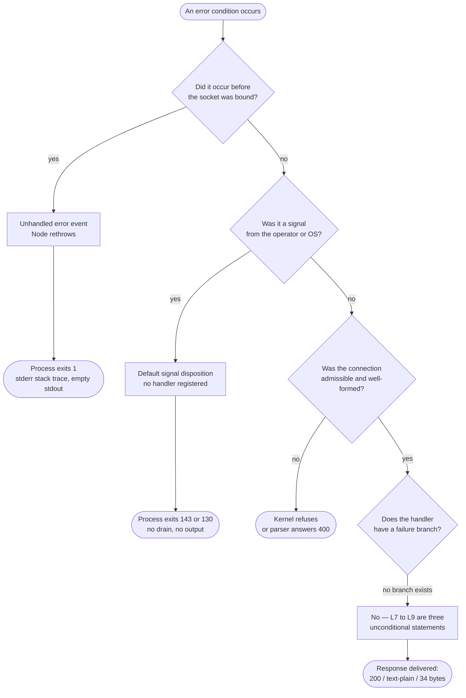
```mermaid
flowchart TD
    Err(["An error condition occurs"])
    L1{"Did it occur before<br/>the socket was bound?"}
    Bind["Unhandled error event<br/>Node rethrows"]
    Exit1(["Process exits 1<br/>stderr stack trace, empty stdout"])
    L2{"Was it a signal<br/>from the operator or OS?"}
    Sig["Default signal disposition<br/>no handler registered"]
    Exit2(["Process exits 143 or 130<br/>no drain, no output"])
    L3{"Was the connection<br/>admissible and well-formed?"}
    Kern(["Kernel refuses<br/>or parser answers 400"])
    L4{"Does the handler<br/>have a failure branch?"}
    NoBranch["No — L7 to L9 are three<br/>unconditional statements"]
    Ok(["Response delivered:<br/>200 / text-plain / 34 bytes"])

    Err --> L1
    L1 -->|"yes"| Bind --> Exit1
    L1 -->|"no"| L2
    L2 -->|"yes"| Sig --> Exit2
    L2 -->|"no"| L3
    L3 -->|"no"| Kern
    L3 -->|"yes"| L4
    L4 -->|"no branch exists"| NoBranch --> Ok
```

#### 4.3.2.2 Retry, Fallback, and Idempotency

No retry or fallback mechanism exists. A case-insensitive sweep of `server.js` for `retry`, `retries`, `backoff`, `fallback`, `circuit`, `setInterval`, `setTimeout`, `process.exit`, and `process.on` returns zero matches. Specifically: the bind is attempted once and never retried, no alternate port is tried, no degraded-mode response is served, and no circuit breaker exists — nor is one needed, since the process has no downstream dependency to protect (§ 2.3.2 records that no outbound call is ever constructed).

The one favourable property here is a by-product of the invariant response: because every request produces the identical result and mutates nothing, **all operations are idempotent and client-side retry is unconditionally safe**. A client that retries after a refused connection, a `400`, or a mid-request process death cannot cause duplicate effects, because there are no effects. This is what makes the total absence of server-side resilience machinery tolerable in the current design and is the property that would be lost first if the handler ever began reading or writing data.

#### 4.3.2.3 Error Notification Flow

There is exactly one notification channel — the standard error stream of a foreground process — and it has no persistence and no addressee.

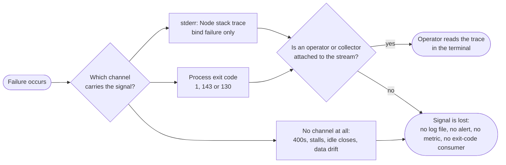
```mermaid
flowchart LR
    Fail(["Failure occurs"])
    Which{"Which channel<br/>carries the signal?"}
    Stderr["stderr: Node stack trace<br/>bind failure only"]
    Code["Process exit code<br/>1, 143 or 130"]
    Silent["No channel at all:<br/>400s, stalls, idle closes, data drift"]
    Attach{"Is an operator or collector<br/>attached to the stream?"}
    Seen(["Operator reads the trace<br/>in the terminal"])
    Lost(["Signal is lost:<br/>no log file, no alert, no metric, no exit-code consumer"])

    Fail --> Which
    Which --> Stderr
    Which --> Code
    Which --> Silent
    Stderr --> Attach
    Code --> Attach
    Attach -->|"yes"| Seen
    Attach -->|"no"| Lost
    Silent --> Lost
```

No alerting or notification integration exists — `alert`, `notify`, `email`, `webhook`, and `sentry` all return zero matches, and § 2.3.4 independently records the absence of any logging service. Three consequences are load-bearing for operations. Runtime request failures are entirely silent, because the `400` path, the stall path, and the idle-close path emit nothing at all. The exit code is a real signal but has no consumer, since no supervisor, unit file, or container restart policy is defined anywhere in the repository (§ 3.6.3). And a successful start is only observable if stdout is captured at the moment it happens — the single readiness line is never repeated, so an operator who attaches later has no way to confirm readiness other than issuing a request.

#### 4.3.2.4 Recovery Procedures

Recovery is manual in every case. The table below is grounded in the reproduced failure modes above, not in general practice.

| Symptom | Diagnosis | Recovery action |
| --- | --- | --- |
| Process exits immediately with code 1 and an `EADDRINUSE` trace | Another process holds `127.0.0.1:3000` — possibly a previous instance of this service | Identify and stop the holder of port 3000, or change the literal at `server.js` L4; then re-run WF-01. There is no configuration override, because `process.env` is absent |
| No readiness line appears | The bind never succeeded, since L13 executes only inside the `listen` callback | Inspect stderr for the bind error; the absence of the line is itself the diagnostic |
| Connection refused from another host or container network | Expected behaviour of the loopback bind at L3, not a fault | None available without a code change; widening the bind would also remove the only access control in force (§ 4.2.3.2) |
| Client receives `400 Bad Request` | Malformed request produced by the client; the server was never involved beyond parsing | Correct the client request. No server-side action exists or is needed |
| Service unresponsive but the process is alive | Connections may be stalled; the application has no admission control, cap, or visibility | Restart the process. No in-application remedy exists |
| Process gone with exit 143 or 130 | Terminated by `SIGTERM` or `SIGINT` | Re-run WF-01. Because the service is stateless, restart is a complete recovery with no reconciliation step |
| Workbook join or invariant appears broken | An uncoordinated edit to one of three independently editable binary files | Restore consistency in a single commit and re-verify the invariants of § 4.2.3.3 manually; no test or CI job will detect the breakage |

Two structural gaps bound how quickly any of this can happen. Recovery latency is governed entirely by human attention, since nothing watches the process and nothing restarts it. And recovery is undocumented in-repo: the launch command that every row above depends on appears nowhere in `server.js` or `README.md` (§ 3.6.2), so the recovery procedure relies on knowledge held outside the repository.


## 4.4 Required Diagram Set

This sub-section closes out the mandated diagram inventory. It indexes the diagrams already presented, then adds the two views that the preceding sub-sections do not cover: time-ordered sequence diagrams of the system's interactions, and a composite state view of the three independent lifecycles.

### 4.4.1 Diagram Index and Feature Coverage

| Required diagram | Provided as | Location |
| --- | --- | --- |
| High-level system workflow | Swim-lane flowchart across operator, process, and client | § 4.1.1.1 |
| Detailed process flow — bootstrap | WF-01 flowchart with the bind decision and crash terminal | § 4.1.1.2 |
| Detailed process flow — request handling | WF-02 layered flowchart with kernel, runtime, and application boundaries | § 4.1.1.3 |
| Detailed process flow — data provisioning | WF-05 pipeline flowchart with the absent consumer stage | § 4.1.2.2 |
| Validation-gate flow | Gate flowchart distinguishing enforced from pass-through gates | § 4.2.3.1 |
| Error handling flowchart | Error-disposition decision tree by detecting layer | § 4.3.2.1 |
| Error notification flow | Notification-channel flowchart ending in a lost-signal state | § 4.3.2.3 |
| State transition diagram — process | `stateDiagram-v2` for the process and listener | § 4.3.1.1 |
| State transition diagram — connection | `stateDiagram-v2` for connections and requests | § 4.3.1.2 |
| Integration sequence diagrams | Three `sequenceDiagram` views | § 4.4.2 |
| Composite state transition diagram | Three independent lifecycles in one view | § 4.4.3 |

Mapping the mandated "detailed process flow for each core feature" onto the feature catalogue of § 2.1 requires one honest qualification: only three of the eight features have a process flow, because only three of them do anything over time.

| Feature | Process flow that documents it | Note |
| --- | --- | --- |
| F-001 service bootstrap | WF-01, § 4.1.1.2 | Full flow with its single decision point and failure terminal |
| F-002 invariant response | WF-02, § 4.1.1.3 | Full flow; all decisions belong to layers below the application |
| F-003 readiness logging | WF-03, § 4.1.1.4 | Single unconditional step — documented as a table rather than a diagram, because a one-step flow with no branch would add nothing |
| F-004, F-005, F-006 data assets | WF-05, § 4.1.2.2 | Static files with no process; the only flow that touches them is out-of-band provisioning |
| F-007 key integrity | § 4.2.3.3 and § 4.3.1.3 | An emergent invariant, not a process; its only protective mechanism is Git commit atomicity |
| F-008 licensing and identification | — | No process flow exists; these artifacts are never read by any execution path (§ 2.3.5) |

### 4.4.2 Integration Sequence Diagrams

#### 4.4.2.1 Service Lifecycle Sequence

This is the full operator-facing sequence, including the failure alternative. Every message shown was observed during verification.

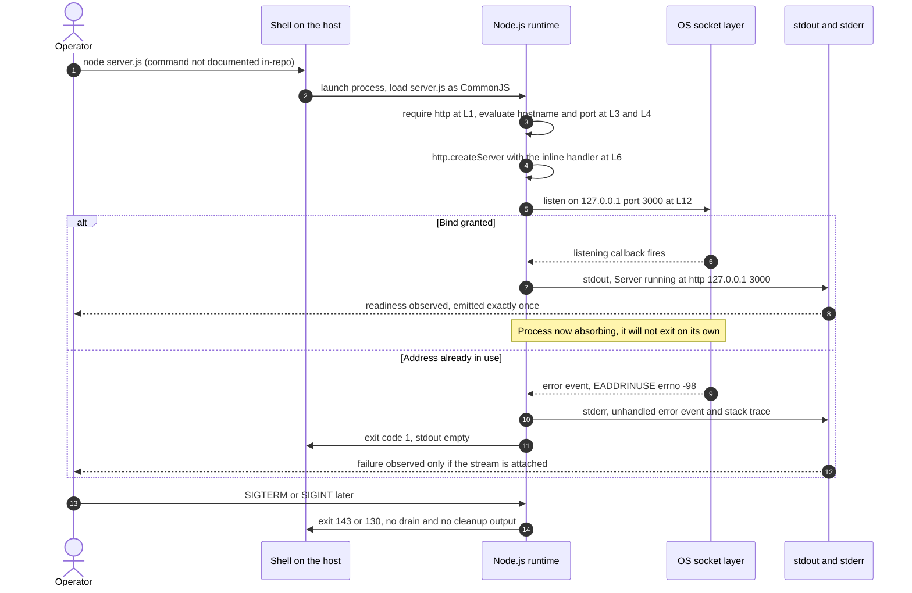
```mermaid
sequenceDiagram
    autonumber
    actor Operator
    participant Shell as Shell on the host
    participant Node as Node.js runtime
    participant OS as OS socket layer
    participant Out as stdout and stderr

    Operator->>Shell: node server.js (command not documented in-repo)
    Shell->>Node: launch process, load server.js as CommonJS
    Node->>Node: require http at L1, evaluate hostname and port at L3 and L4
    Node->>Node: http.createServer with the inline handler at L6
    Node->>OS: listen on 127.0.0.1 port 3000 at L12
    alt Bind granted
        OS-->>Node: listening callback fires
        Node->>Out: stdout, Server running at http 127.0.0.1 3000
        Out-->>Operator: readiness observed, emitted exactly once
        Note over Node,OS: Process now absorbing, it will not exit on its own
    else Address already in use
        OS-->>Node: error event, EADDRINUSE errno -98
        Node->>Out: stderr, unhandled error event and stack trace
        Node->>Shell: exit code 1, stdout empty
        Out-->>Operator: failure observed only if the stream is attached
    end
    Operator->>Node: SIGTERM or SIGINT later
    Node->>Shell: exit 143 or 130, no drain and no cleanup output
```

#### 4.4.2.2 Request Interaction Sequence

The three alternatives below are the complete set of outcomes a client can experience, and only the first reaches application code.

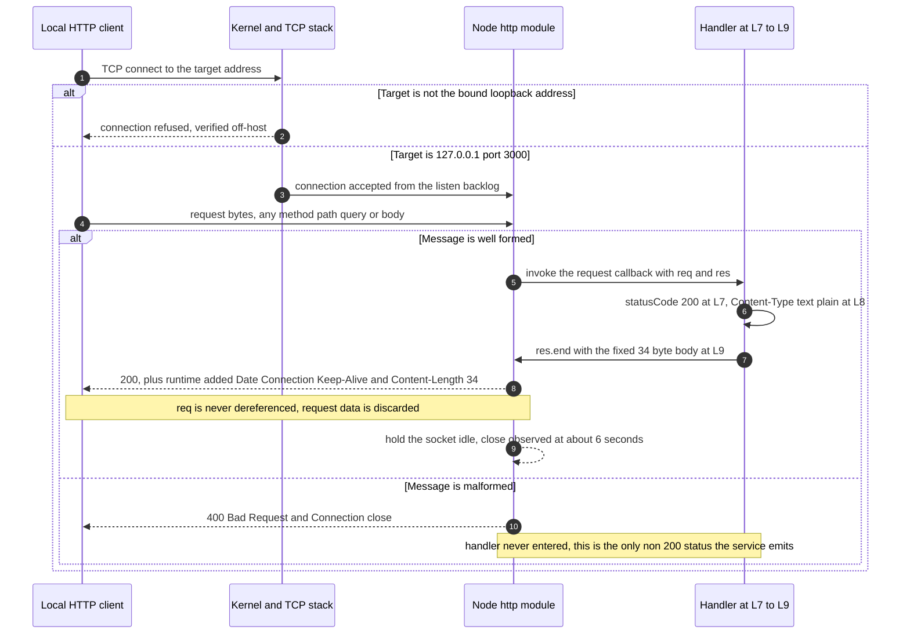
```mermaid
sequenceDiagram
    autonumber
    participant Client as Local HTTP client
    participant Kernel as Kernel and TCP stack
    participant Http as Node http module
    participant App as Handler at L7 to L9

    Client->>Kernel: TCP connect to the target address
    alt Target is not the bound loopback address
        Kernel-->>Client: connection refused, verified off-host
    else Target is 127.0.0.1 port 3000
        Kernel->>Http: connection accepted from the listen backlog
        Client->>Http: request bytes, any method path query or body
        alt Message is well formed
            Http->>App: invoke the request callback with req and res
            App->>App: statusCode 200 at L7, Content-Type text plain at L8
            App->>Http: res.end with the fixed 34 byte body at L9
            Http-->>Client: 200, plus runtime added Date Connection Keep-Alive and Content-Length 34
            Note over Http,Client: req is never dereferenced, request data is discarded
            Http-->>Http: hold the socket idle, close observed at about 6 seconds
        else Message is malformed
            Http-->>Client: 400 Bad Request and Connection close
            Note over Http,App: handler never entered, this is the only non 200 status the service emits
        end
    end
```

#### 4.4.2.3 Data-Asset Provisioning Sequence

This sequence is reconstructed from file and commit metadata; no participant in it is implemented inside the repository.

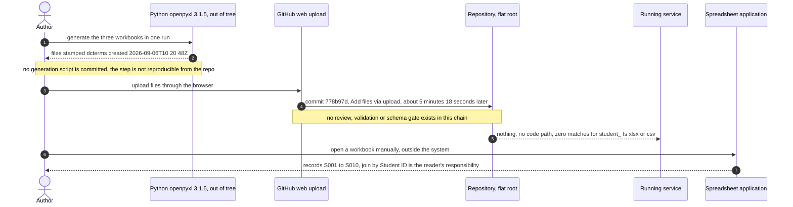
```mermaid
sequenceDiagram
    autonumber
    actor Author
    participant Py as Python openpyxl 3.1.5, out of tree
    participant GH as GitHub web upload
    participant Repo as Repository, flat root
    participant Runtime as Running service
    participant Sheet as Spreadsheet application

    Author->>Py: generate the three workbooks in one run
    Py-->>Author: files stamped dcterms created 2026-09-06T10 20 48Z
    Note over Py,Author: no generation script is committed, the step is not reproducible from the repo
    Author->>GH: upload files through the browser
    GH->>Repo: commit 778b97d, Add files via upload, about 5 minutes 18 seconds later
    Note over GH,Repo: no review, validation or schema gate exists in this chain
    Repo-->>Runtime: nothing, no code path, zero matches for student_ fs xlsx or csv
    Author->>Sheet: open a workbook manually, outside the system
    Sheet-->>Author: records S001 to S010, join by Student ID is the reader's responsibility
```

### 4.4.3 Composite State Transition View

The final diagram places the system's three lifecycles side by side. The absence of any transition between the three blocks is the substantive content: the process lifecycle and the socket lifecycle are nested (many sockets per process), while the data-asset lifecycle proceeds entirely without the runtime.

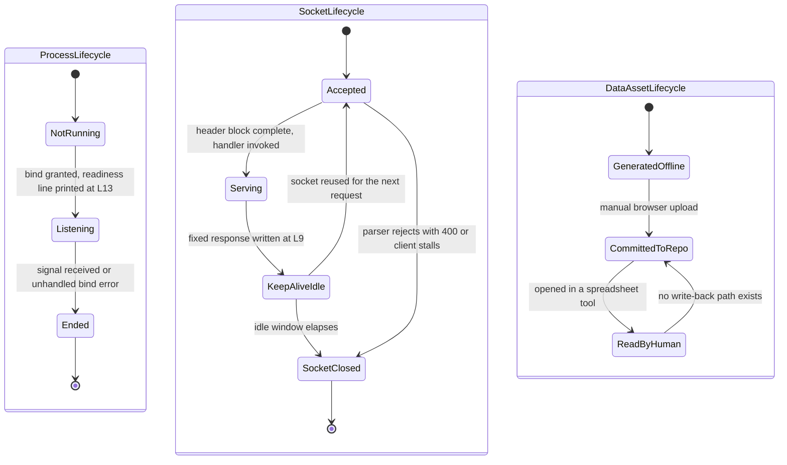
```mermaid
stateDiagram-v2
    state ProcessLifecycle {
        [*] --> NotRunning
        NotRunning --> Listening: bind granted, readiness line printed at L13
        Listening --> Ended: signal received or unhandled bind error
        Ended --> [*]
    }

    state SocketLifecycle {
        [*] --> Accepted
        Accepted --> Serving: header block complete, handler invoked
        Serving --> KeepAliveIdle: fixed response written at L9
        KeepAliveIdle --> Accepted: socket reused for the next request
        KeepAliveIdle --> SocketClosed: idle window elapses
        Accepted --> SocketClosed: parser rejects with 400 or client stalls
        SocketClosed --> [*]
    }

    state DataAssetLifecycle {
        [*] --> GeneratedOffline
        GeneratedOffline --> CommittedToRepo: manual browser upload
        CommittedToRepo --> ReadByHuman: opened in a spreadsheet tool
        ReadByHuman --> CommittedToRepo: no write-back path exists
    }
```

Read together with § 4.3.1, the view makes three operational facts visible at once. The whole of `SocketLifecycle` is destroyed the instant `ProcessLifecycle` reaches `Ended`, with no drain state to pass through. `DataAssetLifecycle` has no edge to either of the other blocks, which is the diagrammatic form of the finding recorded in § 2.3.5 — a working service and a validated data model that never meet. And no block contains a persistence or reconciliation state, because no workflow in the system mutates anything: restart returns the process to `NotRunning` and then to `Listening` with nothing to recover.


## 4.5 References

### 4.5.1 Repository Files and Folders Examined

- `server.js` — the sole runtime module; supplied every flow step cited by line number: `require('http')` (L1), the `hostname` and `port` constants (L3–L4), the `createServer` handler (L6), the unconditional `statusCode`/`Content-Type`/`res.end` sequence (L7–L9), and the `listen` call with its readiness log (L12–L13). Its verified-zero constructs (`req.`, `try`, `catch`, `throw`, `on('error'`, `process.on`, `process.env`, `retry`, `backoff`, `fallback`, `setTimeout`, `setInterval`, `keepAliveTimeout`, `headersTimeout`, `requestTimeout`, `writeHead`, `clientError`, `valid`, `schema`, `authorize`, `role`, `cache`, `fs.`, `student_`, `xlsx`, `csv`) established the absence of every decision point, validation gate, retry path, and data-access step documented as missing.
- `README.md` — 25 bytes, a single heading; confirmed that no workflow, launch procedure, or recovery procedure is documented in-repo.
- `LICENSE` — verbatim Apache License 2.0; the licensing compliance artifact referenced in § 4.2.3.4, and the only file in the repository containing absolute URLs.
- `student_details.xlsx` — worksheet range `A1:J11`; supplied the identity/demographic column set and the ISO-text `Date of Birth`, text `Phone`, `example.edu` email domain, and sequential phone-number findings used in the validation and compliance rules.
- `student_academics.xlsx` — worksheet range `A1:G11`; supplied the `{Pass}`-only `Result Status` domain, the 82–98 attendance range, the raw IEEE-754 GPA storage, and the single-record `Overall GPA` inconsistency.
- `student_other_info.xlsx` — worksheet range `A1:F11`; supplied the `{Paid, Pending}` and `{No, Yes}` categorical domains.
- Workbook OOXML internals (`docProps/app.xml`, `docProps/core.xml`, `xl/workbook.xml`, `xl/worksheets/sheet1.xml`, `xl/styles.xml` within each of the three packages) — established the `Openpyxl 3.1.5` generator, the identical `2026-09-06T10:20:48Z` creation stamp proving a single batch run, the nine-part packaging profile, and the zero-formula, zero-macro, zero-`externalLink`, zero-custom-number-format inertness underpinning WF-05.
- Repository root (flat, zero subdirectories) — the enumeration of exactly six tracked files, and the verified absence of `routes/`, `router/`, `controllers/`, `workers/`, `jobs/`, `queue/`, `cron`, `tasks/`, `handlers/`, `middleware/`, `services/`, `migrations/`, `events/`, `pubsub/`, `batch/`, `etl/`, `pipelines/`, `.github/`, and `.circleci/`, which closed the workflow inventory of § 4.1.
- `.git` history — commits `fc1db66` ("Initial commit", 2026-09-06 15:55:31 +0530, `LICENSE` and `README.md`) and `778b97d` ("Add files via upload", 15:56:06 +0530, `server.js` plus all three workbooks); established the manual browser-upload delivery step of WF-05 and the commit-atomicity transaction boundary of § 4.3.1.3.
- Confirmed absent (probed individually): `.blitzyignore` (none anywhere, so no path exclusions applied), `package.json`, `.env`, `Dockerfile`, `docker-compose.yml`, `Procfile`, `Makefile`, and every CI configuration — the basis for the statements that no supervisor, restart policy, configuration surface, or automated validation exists in any workflow.

### 4.5.2 Runtime Verification Performed

All behavioural claims in this section were reproduced against `server.js` executed on Node v22.23.2 on the documentation host:

- Startup and readiness — single stdout line with empty stderr; boot-to-ready measured across five runs.
- Response invariance — eight request variants across methods, paths, a query string, and a JSON body, plus a `HEAD` probe; full header and byte-length capture.
- Failure modes — concurrent second instance (`EADDRINUSE`, exit 1), `SIGTERM` (exit 143), `SIGINT` (exit 130), raw malformed request (runtime `400` + `Connection: close`), half-open request held open for 8 s, keep-alive idle close at ~6.0 s, and an off-host connection attempt to `10.76.0.146:3000` (refused, curl exit 7).
- Timing and limit constants — read from an `http.createServer()` instance on the same runtime after confirming by grep that `server.js` overrides none of them.
- Load and latency — ten sequential loopback latency samples and a 100-request burst at ten-way parallelism, with stdout line counts before and after to confirm the absence of per-request logging.
- Data invariants — `Student ID` uniqueness, cross-workbook key-set identity and orphan checks, and the `Year × 2 = Current Semester` rule, re-verified by parsing the sheet XML directly.

### 4.5.3 Technical Specification Sections Cross-Referenced

- `2.1 Feature Catalog` — feature identifiers F-001 through F-008 and the requirement identifiers cited inside flow steps.
- `2.3 Feature Relationships` — the Runtime/Data/Governance cluster terminology, the two integration points and their contracts, the verified-absent common services, and the verified-absent relationship "response varies with the request".
- `3.6 Development and Deployment` — the absence of a build step, the undocumented launch command, the loopback bind's incompatibility with container port publishing, and the absence of CI as the reason the workbook join is unmonitored.


# 5. System Architecture

## 5.1 High-Level Architecture

This section documents the architecture of the repository **as built**. That qualification is load-bearing: the repository contains no recorded architecture. `ARCHITECTURE.md`, `DESIGN.md`, an `adr/` or `decisions/` directory, and every published interface contract (`openapi.yaml`, `swagger.json`, `asyncapi.yaml`, `schema.sql`, `schema.graphql`) were probed individually and are all absent, as are all 55 architecture-bearing directory names probed (`src`, `services`, `domain`, `adapters`, `ports`, `controllers`, `middleware`, `infra`, `k8s`, `terraform`, and so on). The repository root is strictly flat — `git ls-files` returns six files and there is not a single subdirectory outside `.git`. Every architectural statement below was therefore reconstructed from direct inspection of those six artifacts and from empirical execution of the one that runs.

### 5.1.1 System Overview

#### 5.1.1.1 Architecture Style and Rationale

The system is a **single-process, single-file monolith with a co-located static data tier**. More precisely, it is a zero-dependency HTTP endpoint built directly on the Node.js standard library, sharing a repository with three inert spreadsheet artifacts that no code reads. The two tiers exist as artifacts; only one of them executes.

| Style Dimension | As Built | Evidence |
| --- | --- | --- |
| Deployment unit | One OS process, launched by direct interpreter invocation | `server.js` starts listening as a module-load side effect (L12); nothing is exported |
| Code organisation | One 14-line module, no layers, no packages | Flat root; zero subdirectories; `module.exports` absent |
| Communication style | Synchronous request/response over HTTP/1.1 | `http.createServer` (L6); no queue, broker, or event bus |
| Coupling to platform | Total — all cross-cutting behaviour is the runtime's | Only import is `require('http')` (L1) |
| Data tier | File-based, passive, unconnected to the runtime | Zero occurrences of `fs`, `xlsx`, `csv`, or `student_` in `server.js` |
| Distribution | None; confined to one host | Bind to `127.0.0.1` (L3), verified to refuse off-host connections |

The **rationale is inferred rather than documented**, and the inference is well supported. The runtime component is structurally the canonical Node.js "hello world" listener with one string substituted, and both commits that created the repository were made 35 seconds apart with the message `Add files via upload`. The style therefore reflects a starting scaffold: the cheapest possible service entry point placed alongside a modelled dataset, with no architectural investment in between. The genuine architectural advantages that follow — no dependency graph, no build step, no configuration surface, nothing to install — are real and worth preserving, and they are the reason § 5.3 treats "no framework" as a defensible decision rather than an omission.

#### 5.1.1.2 Architectural Principles in Force

The following principles are observable in the artifacts. Each is stated with the mechanism that enforces it, because in this system several principles are enforced by absence rather than by code.

- **Zero external dependency.** The repository declares no dependencies at all — there is no `package.json` or lockfile — and the only import is a Node built-in. Supply-chain surface is nil.
- **Statelessness.** Nothing is mutated after module load; the three module-scoped bindings (`http`, `hostname`, `port`) are `const` and never reassigned. Every response is produced from a literal.
- **Invariant response contract.** The handler never dereferences `req` (the count of `req.` in `server.js` is zero), so behaviour cannot vary with method, path, query, header, or body. Seven probes this session — `GET /`, `GET /students/S001`, `POST /students`, `DELETE /x`, `PUT /y`, `PATCH /z`, `OPTIONS /` — returned byte-identical `200 / text/plain / 34 bytes`.
- **Confinement as the sole access control.** The bind address is the only security boundary in force, and it is effective: a request to the host's routable address `10.76.0.148:3000`-class address (measured at `10.76.0.146:3000`) is refused at the kernel with `curl` exit 7, while `127.0.0.1:3000` succeeds.
- **Total delegation of cross-cutting concerns.** Parsing, framing, timeouts, connection lifecycle, protocol-error responses, and process termination are all owned by layers beneath the application. A fresh `http.createServer()` — exactly what L6 constructs — reports `listenerCount('error') === 0` and `listenerCount('clientError') === 0`, which is the direct proof that the application registers no policy of its own.
- **Data as artifact, schema by convention.** The data model exists only as header text and an observed key relationship. No workbook declares a key or a data-validation part, and no code validates anything; cross-file consistency is preserved solely by the atomicity of the commit that introduced all three files together.
- **Composition by side effect.** The module exports nothing, so the server cannot be imported, instantiated twice in one process, or driven by a test harness. Its only composition mechanism is process launch.

Patterns a reader might expect are demonstrably **not** present: there is no layering (no controller/service/repository separation), no ports-and-adapters seam, no middleware pipeline (`use(`, `next(` count zero), no dependency injection, and no dispatcher. The one pattern that is present is a degenerate front controller — a single entry point receiving every request — with the dispatch stage removed.

#### 5.1.1.3 System Boundaries and Major Interfaces

Four boundaries define the system, and the diagram below places them in one view. § 1.2.2 groups the same artifacts by component role; this view instead shows trust and reachability zones, which is what determines who can interact with what.

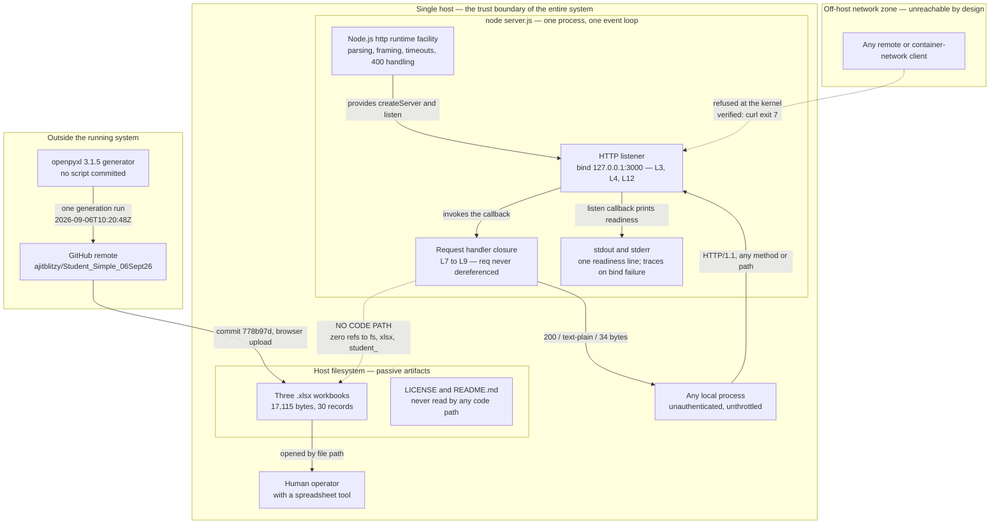
```mermaid
flowchart TB
    subgraph OffHost["Off-host network zone — unreachable by design"]
        Remote["Any remote or container-network client"]
    end

    subgraph HostZone["Single host — the trust boundary of the entire system"]
        LocalClient["Any local process<br/>unauthenticated, unthrottled"]
        Human["Human operator<br/>with a spreadsheet tool"]

        subgraph ProcessZone["node server.js — one process, one event loop"]
            Rt["Node.js http runtime facility<br/>parsing, framing, timeouts, 400 handling"]
            Listener["HTTP listener<br/>bind 127.0.0.1:3000 — L3, L4, L12"]
            Handler["Request handler closure<br/>L7 to L9 — req never dereferenced"]
            Streams["stdout and stderr<br/>one readiness line; traces on bind failure"]
            Rt -->|"provides createServer and listen"| Listener
            Listener -->|"invokes the callback"| Handler
            Listener -->|"listen callback prints readiness"| Streams
        end

        subgraph FileZone["Host filesystem — passive artifacts"]
            Books["Three .xlsx workbooks<br/>17,115 bytes, 30 records"]
            Gov["LICENSE and README.md<br/>never read by any code path"]
        end
    end

    subgraph OutOfTree["Outside the running system"]
        Gen["openpyxl 3.1.5 generator<br/>no script committed"]
        GitRemote["GitHub remote<br/>ajitblitzy/Student_Simple_06Sept26"]
    end

    Remote -. "refused at the kernel<br/>verified: curl exit 7" .-> Listener
    LocalClient -->|"HTTP/1.1, any method or path"| Listener
    Handler -->|"200 / text-plain / 34 bytes"| LocalClient
    Gen -->|"one generation run<br/>2026-09-06T10:20:48Z"| GitRemote
    GitRemote -->|"commit 778b97d, browser upload"| Books
    Books -->|"opened by file path"| Human
    Handler -. "NO CODE PATH<br/>zero refs to fs, xlsx, student_" .-> Books
```

| Boundary | What It Separates | Enforcement |
| --- | --- | --- |
| Network reachability | The single host from every other host | The literal `127.0.0.1` at `server.js` L3; not overridable, since `process.env` never appears |
| Process | Application code from everything durable | The process holds no handle to the filesystem; nothing survives termination |
| Filesystem | The data and governance artifacts from the runtime | Absence of any read path; access is by file path only |
| Repository / provenance | In-tree artifacts from out-of-tree production | The generator that produced the workbooks is not committed |

Four **major interfaces** cross those boundaries. Note that none of them is an outbound network interface — the system never constructs a client request.

| Interface | Direction | Contract |
| --- | --- | --- |
| Loopback TCP socket `127.0.0.1:3000` | Inbound | HTTP/1.1 plaintext. Request contract is empty: everything is accepted and discarded. Response contract is fixed: `200`, `Content-Type: text/plain`, 34-byte body |
| `stdout` / `stderr` and the process exit code | Outbound | One readiness line on success; a Node stack trace plus exit code 1 on bind failure; exit 143 or 130 on signal, silently |
| Workbook files on the filesystem | Outbound (read by others) | Single worksheet per file, `Student ID` as the join key; no API, query interface, or export endpoint exists |
| The Git remote | Bidirectional, out-of-band | The distribution and versioning channel for all six artifacts; the de facto copy-of-record for the data |

### 5.1.2 Core Components

Eight components exist in the repository, plus one external platform facility that owns most of the observable behaviour and must be named to make the architecture legible. Component identifiers `C-01` to `C-09` are introduced here for reference within § 5.2 and map onto the feature identifiers of § 2.1.

| Component | Primary Responsibility | Key Dependencies | Integration Points |
| --- | --- | --- | --- |
| **C-01** HTTP Listener (`server.js` L6, L12) | Own the socket; accept connections and route them to the single handler | C-03 constants; C-09 runtime | Loopback TCP `127.0.0.1:3000`; invokes C-02; triggers C-04 |
| **C-02** Request Handler Closure (`server.js` L6–L10) | Produce the invariant response: status, content type, body | C-09 `ServerResponse` interface | Invoked by C-01; writes to the client socket |
| **C-03** Configuration Constants (`server.js` L3–L4) | Hold the bind address and port as immutable literals | None | Consumed by C-01 (`listen` arguments) and C-04 (log interpolation) |
| **C-04** Startup Logger (`server.js` L12–L13) | Emit the single readiness signal after a successful bind | C-03 constants; `console` global | `stdout` of the launching shell |
| **C-05** Identity Data Asset (`student_details.xlsx`) | Hold 10 identity and demographic records, sheet `Student Details`, A1:J11 | None (inert package) | File path; `Student ID` join key |
| **C-06** Academic Data Asset (`student_academics.xlsx`) | Hold 10 academic-performance records, sheet `Academics`, A1:G11 | None (inert package) | File path; `Student ID` join key |
| **C-07** Ancillary Data Asset (`student_other_info.xlsx`) | Hold 10 hostel, activity, library, fee and scholarship records, sheet `Other Info`, A1:F11 | None (inert package) | File path; `Student ID` join key |
| **C-08** Governance Artifacts (`LICENSE`, `README.md`) | Grant Apache 2.0 terms; name the repository | None | Read by humans and licence scanners only |
| **C-09** Node.js `http` Runtime Facility (external) | Parse HTTP, frame responses, manage connection lifecycle and protocol errors | Node.js runtime (verified on v22.23.2) | Imported at L1; supplies `createServer`, `listen`, and the `res` interface |

The critical considerations for each component are carried in a companion table so that no table exceeds four columns:

| Component | Critical Considerations |
| --- | --- |
| C-01 | Fixed port and loopback address make the placement immutable and prevent a second instance on the same host (`EADDRINUSE`, exit 1). No backlog argument is passed at L12, so Node's default of 511 applies; `maxConnections` is `undefined`, so concurrent connections are unbounded |
| C-02 | Cannot differentiate callers; has no error vocabulary because no 4xx or 5xx status is ever assigned. The `L7 → L8 → L9` ordering is mandatory, not stylistic (see § 5.2.1.4) |
| C-03 | The single point of coupling between the bind and the advertised URL — a genuine strength, since the log cannot drift from reality. Equally, the single reason relocation requires a source edit |
| C-04 | Readiness is observable exactly once, at the moment it happens; there is no repeat, no shutdown log, and no per-request output, so the process is silent in steady state |
| C-05, C-06, C-07 | Inert and safe (zero formulas, no `vbaProject`, no `externalLink`), but binary and therefore not diffable in review; independently editable with nothing validating them against each other |
| C-08 | The Apache appendix placeholder at `LICENSE` L189 is unfilled, so no copyright owner or year is asserted anywhere; `README.md` is 25 bytes and documents nothing, including the launch command |
| C-09 | Owns every timeout, limit and protocol-error response in force. All of these are inherited defaults the repository neither sets nor pins — there is no `engines` field and no runtime version constraint anywhere |

### 5.1.3 Data Flow Description

Four flows describe the whole system. Three of them carry data; the fourth is the one the artifacts anticipate and do not implement.

**DF-1 — The request path (inbound, synchronous, in-process).** A local caller opens a TCP connection to `127.0.0.1:3000`. The kernel accepts it into the listen backlog and hands it to C-09, which parses the request line and headers and then invokes C-02 with `req` and `res`. C-02 executes three unconditional statements — status, content type, body — and returns. C-09 then frames the response, deriving `Content-Length: 34` from the single `res.end` buffer and adding `Date`, `Connection: keep-alive`, and `Keep-Alive: timeout=5`. The socket is retained for reuse and closed by the runtime when the idle window elapses. **No request data flows anywhere:** the request line, headers, query string, and body are parsed by C-09 and then discarded unread, because `req` is never dereferenced.

**DF-2 — The diagnostic path (outbound, once per lifetime).** On a successful bind, C-04 writes one line to `stdout`. On a failed bind, C-09 rethrows an unhandled `'error'` event and Node writes a stack trace to `stderr` before the process exits with code 1 — in which case `stdout` stays empty, so the absence of the readiness line is itself the diagnostic. No other information ever leaves the process; after 100 requests served at 10-way parallelism, `stdout` still contained exactly one line.

**DF-3 — The provisioning path (out-of-band, human-driven).** All three workbooks carry `<Application>Microsoft Excel Compatible / Openpyxl 3.1.5</Application>` and an identical `dcterms:created` of `2026-09-06T10:20:48Z`, which establishes that one programmatic generation run produced the entire data tier. The files then entered the repository through a browser upload (commit `778b97d`, `Add files via upload`) and reach a consumer only when a human opens them by file path. No generator script is committed, so this flow is not reproducible from the repository, and no validation or schema gate exists anywhere along it.

**DF-4 — The absent read path.** There is no flow from the data tier into the runtime. This is the architecture's defining characteristic and is verified negatively: `server.js` contains no occurrence of `student_`, `xlsx`, `fs`, `readFile`, or `csv`, and its only `require` is `http`. § 3.5.5 documents the three technology paths by which this gap could be closed and the integration requirements each implies; the architectural point here is simply that the seam does not exist yet, so there is no adapter, repository, or data-access interface to describe.

**Integration patterns and protocols.** Only two patterns are in use. Between a caller and the service, the pattern is synchronous request/response over HTTP/1.1 in plaintext, with `text/plain` as the sole representation — no JSON, no content negotiation, and no structured payload anywhere (`JSON` appears zero times). Between the data assets, the pattern is *shared-key convention*: the join across the three workbooks is an affordance of the schemas, honoured by whatever external tool a reader chooses, and enforced by nothing. There is no asynchronous pattern of any kind — no queue, broker, event stream, webhook, or scheduled batch job exists.

**Data transformation points.** There is exactly one, and it belongs to the runtime rather than the application: the transformation of a JavaScript string literal into a framed HTTP response, including header serialisation and `Content-Length` derivation. The application performs no parsing, deserialisation, mapping, validation, encoding, or aggregation. The workbooks contain no transformation logic either — zero formula elements across all three — so the only place a transformation could occur in this system today is inside whichever spreadsheet tool a human opens the files with.

**Data stores and caches.** At runtime there are none. The service holds no state between requests, consults no store, performs no I/O beyond writing to the socket, and caches nothing — there is nothing to invalidate, evict, or warm. It also emits no client-cache directives: the verified response carries no `Cache-Control`, `ETag`, or `Last-Modified`, so caching behaviour is left entirely to client defaults. The only durable data in the system is the 17,115 bytes held in the three workbooks, for which Git is the de facto persistence mechanism and the only copy-of-record.

### 5.1.4 External Integration Points

**No external system integration exists.** This is a verified finding, not an omission. A 70-term sweep across `server.js` and `README.md` for cloud, identity, monitoring, messaging, datastore, and HTTP-client terms returned exactly one match — the `http://` inside the startup log's template literal. The service constructs no client request, so it consumes no upstream API, identity provider, message broker, or datastore; no credential, connection string, endpoint URL, or webhook target appears in any tracked file; and the only two absolute URLs in the repository are the Apache licence references inside `LICENSE` (L3 and L195). The workbooks contain no `externalLink` part, so opening one triggers no outbound fetch.

What exists instead are boundary interfaces and out-of-band channels. The table below documents them in the requested form, with the honest classification that none of them is an integration with a running external system:

| System / Interface | Integration Type | Data Exchange Pattern | Protocol / Format |
| --- | --- | --- | --- |
| Local HTTP callers on the same host | Inbound boundary (not a named system) | Synchronous request/response; request discarded unread | HTTP/1.1 plaintext; `text/plain`, 34-byte body |
| Launching shell / operator terminal | Outbound diagnostic boundary | One-shot readiness line; stack trace on failure; exit code | Unstructured UTF-8 text on `stdout` / `stderr` |
| Spreadsheet tooling used by a human | Consumer-driven file read, out-of-band | Manual, full-file read; join by `Student ID` is the reader's responsibility | OOXML SpreadsheetML (ECMA-376 / ISO-IEC 29500) |
| GitHub remote `ajitblitzy/Student_Simple_06Sept26` | Source-control hosting, out-of-band | Manual browser upload; commit-scoped delivery | Git over HTTPS |
| `openpyxl 3.1.5` generator (out-of-tree) | Build-time producer, not committed | One-shot batch generation of all three workbooks | Python library writing `.xlsx` packages |
| Any external datastore, API, or identity provider | **None — verified absent** | Not applicable | Not applicable |

**SLA requirements.** The repository codifies none. Sweeps for `timeout`, `threshold`, `slo`, `sla`, `latency`, `p95`, `p99`, `metric`, `rate limit`, `budget`, `health`, `readiness`, and `liveness` return zero matches across all tracked text files, and § 1.2.3 records the same result independently. What is in force instead are inherited runtime defaults, which are not commitments and are not visible to the repository:

| Interface | Codified SLA | Effective Limit in Force (and its source) |
| --- | --- | --- |
| Loopback HTTP socket | None | `keepAliveTimeout` 5,000 ms, `headersTimeout` 60,000 ms, `requestTimeout` 300,000 ms, `maxRequestsPerSocket` 0 (unlimited), `maxConnections` `undefined` (unbounded), backlog 511, `maxHeaderSize` 16,384 bytes — all Node.js `http` defaults, measured on v22.23.2 |
| Diagnostic streams | None | No buffering, retention, or delivery guarantee; the signal is lost if the stream is not captured |
| Data-asset reads | None | Governed by the consumer's own tooling; the repository provides no reader |

Observed performance is recorded in § 5.4.5 as measurement, explicitly separated from commitment. Availability is likewise uncommitted: nothing watches the process, nothing restarts it, and no supervisor, unit file, or restart policy is defined anywhere in the repository.


## 5.2 Component Details

The components introduced in § 5.1.2 fall into three cohesive groups plus one architectural gap. Each group is documented below across the five required dimensions — purpose, technologies, interfaces, persistence, and scaling. The diagrams in this sub-section are deliberately structural and contract-oriented; the temporal views of the same system (workflow, process state, error disposition, and interaction sequences) are held in § 4.1, § 4.3, and § 4.4 and are not repeated here.

### 5.2.1 Runtime Component — HTTP Service (C-01 to C-04, on C-09)

#### 5.2.1.1 Purpose and Responsibilities

The runtime component is the only executing element in the repository. Its responsibilities are exactly four, and their narrowness is the point: acquire the loopback socket, accept connections, answer every one of them identically, and announce readiness once. It performs no dispatch, no validation, no authorisation, no persistence, and no outbound call. All 14 lines of `server.js` are devoted to those four responsibilities, and nothing else in the repository executes.

| Responsibility | Component | Source Anchor |
| --- | --- | --- |
| Acquire and own the listening socket | C-01 | `server.listen(port, hostname, …)` at L12 |
| Accept a connection and invoke the handler | C-01 | `http.createServer(callback)` at L6 |
| Produce the response representation | C-02 | L7 status, L8 content type, L9 body |
| Hold the bind address and port | C-03 | L3, L4 |
| Emit the readiness signal | C-04 | `console.log` at L13, inside the `listen` callback |

#### 5.2.1.2 Technologies and Frameworks

There is no framework. The component is built on the Node.js built-in `http` module, imported once at L1, and uses CommonJS module semantics — copying the file to a `.mjs` extension fails with `require is not defined in ES module scope`, so the file is CommonJS-only. The only language features beyond ES5 are `const`, two arrow functions, and one template literal, placing the minimum required standard at ECMAScript 2015. The runtime version is unpinned: there is no `package.json` `engines` field, no `.nvmrc`, no `.node-version`, no container base image, and no CI version matrix, so the executing Node major version is whatever the operator happens to have installed. All verification in this specification was performed on Node v22.23.2. § 3.1 and § 3.2 carry the full stack and version analysis.

#### 5.2.1.3 Key Interfaces and Internal Structure

The component's internal structure is a flat composition of four elements over one runtime facility. The diagram below shows what each element holds and what it delegates — the ownership split between application code and the runtime is the single most important architectural fact about this component.

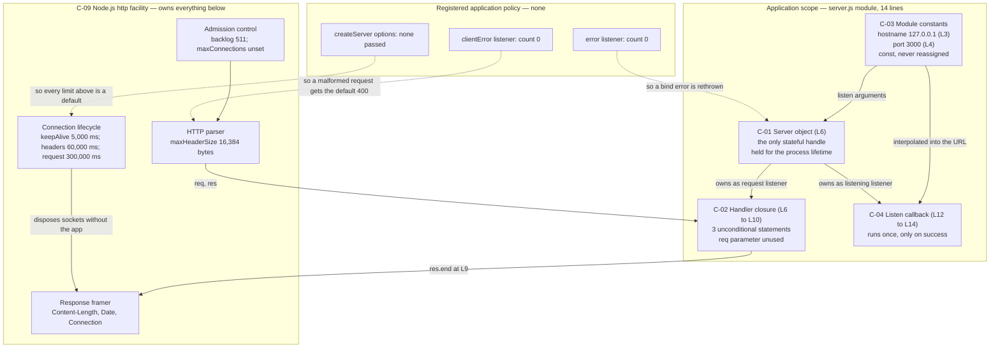
```mermaid
flowchart TB
    subgraph AppScope["Application scope — server.js module, 14 lines"]
        Consts["C-03 Module constants<br/>hostname 127.0.0.1 (L3)<br/>port 3000 (L4)<br/>const, never reassigned"]
        ServerObj["C-01 Server object (L6)<br/>the only stateful handle<br/>held for the process lifetime"]
        Closure["C-02 Handler closure (L6 to L10)<br/>3 unconditional statements<br/>req parameter unused"]
        LogCb["C-04 Listen callback (L12 to L14)<br/>runs once, only on success"]
        Consts -->|"listen arguments"| ServerObj
        Consts -->|"interpolated into the URL"| LogCb
        ServerObj -->|"owns as request listener"| Closure
        ServerObj -->|"owns as listening listener"| LogCb
    end

    subgraph RuntimeScope["C-09 Node.js http facility — owns everything below"]
        Parser["HTTP parser<br/>maxHeaderSize 16,384 bytes"]
        Framer["Response framer<br/>Content-Length, Date, Connection"]
        Lifecycle["Connection lifecycle<br/>keepAlive 5,000 ms; headers 60,000 ms; request 300,000 ms"]
        Admission["Admission control<br/>backlog 511; maxConnections unset"]
    end

    subgraph AbsentScope["Registered application policy — none"]
        NoErr["error listener: count 0"]
        NoClientErr["clientError listener: count 0"]
        NoOpts["createServer options: none passed"]
    end

    Admission --> Parser
    Parser -->|"req, res"| Closure
    Closure -->|"res.end at L9"| Framer
    Lifecycle -->|"disposes sockets without the app"| Framer
    NoErr -.->|"so a bind error is rethrown"| ServerObj
    NoClientErr -.->|"so a malformed request gets the default 400"| Parser
    NoOpts -.->|"so every limit above is a default"| Lifecycle
```

Three interfaces are worth stating explicitly. The **inbound network interface** is the loopback TCP socket carrying HTTP/1.1; its request contract is empty and its response contract is fixed. The **programmatic interface is empty**: `module.exports` and `exports` both count zero, so no other code can import, configure, or instantiate this component — the process boundary is the only way in. The **consumed platform interface** is narrow and precisely enumerable: `http.createServer()`, `server.listen(port, host, callback)`, the `res.statusCode` setter, `res.setHeader()`, `res.end()`, and the global `console.log()`. Nothing else in the Node API surface is touched — `fs`, `path`, `url`, `https`, `os`, `crypto`, and `cluster` are all absent.

#### 5.2.1.4 The Response Contract as a State Machine

The ordering of L7, L8, and L9 is a hard requirement of the `ServerResponse` contract, not a stylistic choice, and this was verified directly. Inside the handler before any write, `res.headersSent` and `res.writableEnded` are both `false`; after `res.end()` both are `true`; a subsequent `res.setHeader()` throws `ERR_HTTP_HEADERS_SENT`; and a post-`end` assignment to `statusCode` has no effect on the wire, with the client still observing `200 / text/plain`. The architectural consequence is that the response is **committed once and is thereafter immutable** — there is no post-commit stage in which a header could be added, a status corrected, or an error surfaced.

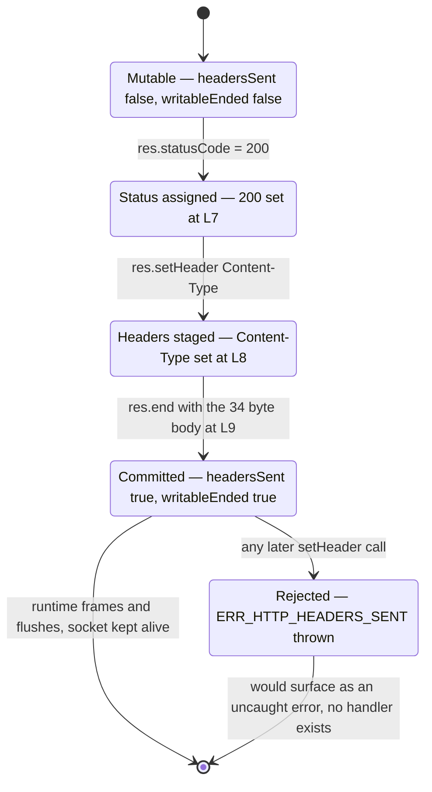
```mermaid
stateDiagram-v2
    [*] --> Mutable
    state "Mutable — headersSent false, writableEnded false" as Mutable
    state "Status assigned — 200 set at L7" as StatusSet
    state "Headers staged — Content-Type set at L8" as HeadersStaged
    state "Committed — headersSent true, writableEnded true" as Committed
    state "Rejected — ERR_HTTP_HEADERS_SENT thrown" as Rejected

    Mutable --> StatusSet: res.statusCode = 200
    StatusSet --> HeadersStaged: res.setHeader Content-Type
    HeadersStaged --> Committed: res.end with the 34 byte body at L9
    Committed --> Rejected: any later setHeader call
    Committed --> [*]: runtime frames and flushes, socket kept alive
    Rejected --> [*]: would surface as an uncaught error, no handler exists
```

The `Rejected` transition is reachable in principle but not in this code, because the handler contains no statement after L9. It is documented because it is the constraint any future change to this component must respect: introducing a data read means the read must complete *before* the first write, or the component loses the ability to report failure at all.

#### 5.2.1.5 Composition and Wiring Sequence

The component is wired entirely by module-load side effects. This view is the composition counterpart to the operator-facing lifecycle in § 4.4.2.1: it shows which architectural element comes into existence in what order and what each depends on.

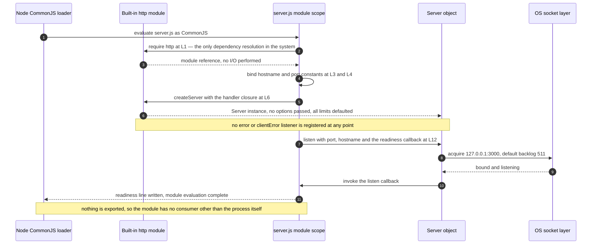
```mermaid
sequenceDiagram
    autonumber
    participant Loader as Node CommonJS loader
    participant Core as Built-in http module
    participant Mod as server.js module scope
    participant Srv as Server object
    participant OS as OS socket layer

    Loader->>Mod: evaluate server.js as CommonJS
    Mod->>Core: require http at L1 — the only dependency resolution in the system
    Core-->>Mod: module reference, no I/O performed
    Mod->>Mod: bind hostname and port constants at L3 and L4
    Mod->>Core: createServer with the handler closure at L6
    Core-->>Srv: Server instance, no options passed, all limits defaulted
    Note over Srv,Core: no error or clientError listener is registered at any point
    Mod->>Srv: listen with port, hostname and the readiness callback at L12
    Srv->>OS: acquire 127.0.0.1:3000, default backlog 511
    OS-->>Srv: bound and listening
    Srv->>Mod: invoke the listen callback
    Mod-->>Loader: readiness line written, module evaluation complete
    Note over Loader,Mod: nothing is exported, so the module has no consumer other than the process itself
```

#### 5.2.1.6 Data Persistence Requirements

None. The component reads and writes no durable storage: `fs` is never required, no database driver or connection string exists, and no temporary or working file is created. Its entire state is three `const` bindings and one `Server` handle, all in memory and all discarded at termination. Because nothing is mutated, restart is a complete recovery with no reconciliation step — there is no journal, no cache to warm, and no state to migrate.

#### 5.2.1.7 Scaling Considerations

Scaling is bounded in four independently verified ways, and three of the four are properties of the source rather than of the environment:

- **No horizontal scaling on the same host.** A second instance cannot start while the port is held: the attempt produced `EADDRINUSE` (errno −98), an unhandled `'error'` event, and exit code 1, with an empty `stdout`. The first instance was unaffected, so the failure is confined to the newcomer. No `SO_REUSEPORT` option is used, and the port is a literal with no override.
- **No placement behind a proxy or balancer on another host.** The loopback bind refuses off-host connections outright, which also means an orchestrator could not reach the container's published port.
- **No multi-core utilisation.** `cluster`, `worker_threads`, `fork`, and `child_process` all count zero. The process observed 7 OS threads — one JavaScript thread plus the default libuv pool of 4 and runtime helpers — but all application work executes on the single event loop, so any future CPU-bound or blocking statement inside the handler would stall every concurrent caller.
- **No admission control to scale against.** `maxConnections` is `undefined` and `maxRequestsPerSocket` is 0, so concurrent connections and requests per connection are both unbounded; the backlog of 511 is the only queue. A half-open request was observed to hold a connection open for the full 8-second observation window with the application entirely unaware of it, so there is no application-level mechanism by which load could be shed.

Two properties work in favour of future scaling: the handler is genuinely stateless, and the response is a constant 34 bytes, so bandwidth is negligible and independent of load. Observed capacity at current scale is adequate for the workload it serves — 100 of 100 requests answered `200` at 10-way parallelism with zero failures — and resident memory was approximately 56 MB, which is the runtime's baseline rather than a function of load. There is also no probe target for an autoscaler: no health or readiness endpoint exists, so the only readiness signal is a single `stdout` line emitted once.

### 5.2.2 Static Data Assets — Student Dataset (C-05 to C-07)

#### 5.2.2.1 Purpose and Responsibilities

The three workbooks constitute the system's data tier. Their sole responsibility is to hold a modelled student dataset in a form a human or an external tool can read; they perform no computation and expose no interface beyond their file paths. The decomposition into three files mirrors three administrative concerns over one entity — identity, academic performance, and ancillary administration — as § 1.2.1 describes in domain terms.

| Asset | Worksheet | Range | Columns × Records |
| --- | --- | --- | --- |
| `student_details.xlsx` | `Student Details` | A1:J11 | 10 × 10 |
| `student_academics.xlsx` | `Academics` | A1:G11 | 7 × 10 |
| `student_other_info.xlsx` | `Other Info` | A1:F11 | 6 × 10 |

#### 5.2.2.2 Technologies and Format

All three are Office Open XML SpreadsheetML packages (ECMA-376 / ISO-IEC 29500), each a ZIP/OPC container of exactly nine parts with an identical package profile — the same parts, a single declared `<sheet>`, eleven `<row>` elements, inline strings instead of a shared-string table, and zero custom number formats. § 3.5.3 documents the format in full. Two consequences follow for any consumer: a reader must handle the `inlineStr` cell type (90, 27, and 56 inline-string cells respectively), and because no number format is defined, raw values reach the consumer unrounded — `Current GPA` for S001 is literally `8.199999999999999`. Storage typing is mixed and must be respected: `Date of Birth` is text in ISO `YYYY-MM-DD` form rather than an Excel date serial, and `Phone` is text rather than numeric, while `Age`, `Year`, the GPA columns, `Attendance %`, and `Library Books Issued` are numeric.

Provenance is unambiguous: every workbook carries `<Application>Microsoft Excel Compatible / Openpyxl 3.1.5</Application>` and an identical creation timestamp of `2026-09-06T10:20:48Z`, so one out-of-tree Python generation run produced the whole tier. No generator script is committed.

#### 5.2.2.3 Logical Data Model

The three files form a normalised three-table star around a single `Student` entity, expressed as files rather than as database tables. The relationship is strict 1:1:1 on `Student ID`: the key sets are identical (`S001`–`S010`, n = 10) and orphans in all three pairwise directions are empty. A joined record yields 21 distinct columns from 23 column instances — one shared key plus twenty attributes.

```mermaid
erDiagram
    STUDENT_DETAILS ||--|| STUDENT_ACADEMICS : "Student ID"
    STUDENT_DETAILS ||--|| STUDENT_OTHER_INFO : "Student ID"
    STUDENT_ACADEMICS ||--|| STUDENT_OTHER_INFO : "Student ID"

    STUDENT_DETAILS {
        text Student_ID "S001 to S010, unique"
        text Name
        text Gender
        text Date_of_Birth "ISO text, not a date serial"
        number Age "snapshot, not derived"
        text Department
        number Year "Year x 2 equals Current Semester"
        text Email "example.edu domain"
        text Phone "text, preserves leading digits"
        text City
    }

    STUDENT_ACADEMICS {
        text Student_ID "identical key set"
        number Current_Semester
        number Previous_Sem_GPA
        number Current_GPA "raw IEEE-754"
        number Overall_GPA "differs from Current for S001 only"
        number Attendance_Percent "range 82 to 98"
        text Result_Status "Pass for all 10 records"
    }

    STUDENT_OTHER_INFO {
        text Student_ID "identical key set"
        text Hostel_Status
        text Extracurricular_Activity
        number Library_Books_Issued "range 0 to 5"
        text Fee_Status
        text Scholarship_Holder
    }
```

The cardinality shown is **observed, not declared**. No workbook contains a key declaration or a data-validation part, so the model is an emergent regularity of the current contents. § 4.3.1.3 identifies the only mechanism that protects it: the atomicity of the Git commit that touches all affected files together.

#### 5.2.2.4 Interfaces and Access

The access interface is a filesystem path and nothing else. There is no API, query interface, export endpoint, index, partition, or pagination affordance — a consumer must read an entire sheet to reach any row. No reader is supplied anywhere in the repository, so programmatic access requires a consumer to bring its own OOXML capability; § 3.5.5 sets out the three paths for doing so and their consequences.

#### 5.2.2.5 Data Persistence Requirements

Persistence is file-based, static, and read-only in practice. The three files total 17,115 bytes and are versioned in Git alongside the source, which makes Git the de facto persistence mechanism and the only copy-of-record. There is no write path in the system: no code creates, updates, or deletes these files, and OOXML packages are rewritten wholesale in any case, so no append, partial write, or transaction exists. Because the files are binary archives, a data change appears in review as an opaque blob — the durability guarantee is Git's, but the reviewability guarantee is absent.

#### 5.2.2.6 Scaling Considerations

Ten records per workbook is a demonstration volume and nothing observed about it extrapolates. Three specific scaling limits are visible in the artifacts themselves. The key scheme `S001`–`S010` is a fixed three-digit zero-padded format, so it accommodates at most 999 students before the key width must change, and a width change would break lexical ordering against existing keys. The single-sheet layout offers no natural partitioning and no incremental-update mechanism. And `Extracurricular Activity` already carries eight distinct values across ten records with no reference list, so as a free-text column its cardinality grows almost in step with the population. § 2.4.4 through § 2.4.8 carry the per-asset analysis.

### 5.2.3 Governance Artifacts (C-08)

**Purpose.** `LICENSE` grants Apache License 2.0 terms over all six tracked files; `README.md` names the repository. Neither participates in execution — § 2.3.5 records that no code path reads either file.

**Technologies.** Plain text and Markdown. `LICENSE` is 201 lines of the unmodified upstream Apache 2.0 text, including §§ 1–9 and the appendix; `README.md` is 25 bytes containing the single heading `# Student_Simple_06Sept26` with no trailing newline.

**Interfaces.** Human readers and licence scanners only. The licence is incorporated by copy rather than by reference, and it is not machine-consumable: with no SPDX identifier in any tracked file and no `package.json` `license` field, an automated scanner must fall back on full-text matching.

**Persistence and scaling.** Not applicable in a runtime sense; both are static files on disk. The architectural consideration is governance coverage rather than scale, and two gaps matter. The appendix placeholder `Copyright [yyyy] [name of copyright owner]` at L189 is unfilled and no `NOTICE`, `AUTHORS`, or `COPYRIGHT` file exists, so no copyright owner or year is asserted anywhere. And `README.md` documents nothing at all — including the launch command, which appears in no tracked file, so the operating knowledge required to run the system lives entirely outside the repository.

### 5.2.4 Architectural Gap — The Absent Data-Access Seam

This is not a component; it is the place where a component would have to exist, and it is documented because it is the system's defining architectural characteristic. The runtime component and the data tier share a repository and nothing else. The evidence is negative and complete: `server.js` contains zero occurrences of `student_`, `xlsx`, `fs`, `readFile`, and `csv`, and its only `require` is `http`.

Three architectural properties follow from the gap, all of them consequences of what has been verified rather than proposals:

- **There is no seam to extend.** Because the component exports nothing and the handler is an inline anonymous closure with no parameters read, there is no interface, port, or injection point at which a data source could be attached without editing L6–L10 directly.
- **The response contract has no room for failure.** As § 5.2.1.4 establishes, the response is committed at L9 and immutable thereafter, and no 4xx or 5xx status is ever assigned. A data read introduced before the commit would need a failure branch and an error vocabulary, neither of which exists anywhere in the file.
- **The handler is synchronous.** `async`, `await`, and `Promise` all count zero, so any file or network read would require converting the handler to asynchronous form — and with it the error handling that § 5.4.3 shows is entirely absent today.

§ 3.5.5 documents the three technology options for closing the gap and the four integration requirements each implies. What this section adds is the architectural cost: closing the gap converts a component with a near-zero attack surface and no failure modes of its own into one that owns input validation, authorisation, output encoding, caching, and error reporting simultaneously. That asymmetry — noted from the feature side in § 2.4.2 — is the single most important consideration for anyone planning work on this repository.


## 5.3 Technical Decisions

**Framing.** The repository records no decisions. There is no `adr/` or `decisions/` directory, no `ARCHITECTURE.md` or `DESIGN.md`, no `CHANGELOG.md`, and no `TODO`, `FIXME`, or roadmap marker in any tracked file. Every decision documented below was therefore **reconstructed from the artifacts** — the code shape, the absent manifests, the file formats, and the commit history. Each is presented with the evidence that establishes it and, where relevant, with the explicit note that the choice may be an unexamined default of a scaffold rather than a deliberate position. The distinction matters: a reader should treat these as an accurate account of what the system does, and as a starting point for decisions the project has yet to make consciously.

### 5.3.1 Architecture Style Decision and Tradeoffs

**Decision as built:** a single-process, single-file monolith with zero declared dependencies, running directly on the Node.js standard library.

The evidence for the "zero dependency" half of that statement is total: there is no `package.json`, no lockfile of any kind, and no `node_modules/`, so the project declares no dependency at all, and the only import in the repository is `require('http')`. The evidence for the "single file" half is that the repository root is flat and contains exactly one `.js` file of 14 lines.

| Dimension | Benefit as built | Cost as built |
| --- | --- | --- |
| Dependency management | No install step, no lockfile drift, no supply-chain surface, no audit or upgrade obligation | No framework services: routing, middleware, body parsing, and error handling must all be hand-written when first needed |
| Comprehensibility | The entire system can be read in under a minute; there is no indirection to trace | Nothing communicates intent — the absence of structure is indistinguishable from the absence of a decision |
| Deployability | Nothing to build; the file executes exactly as authored | Nothing describes deployment either — no image, manifest, service descriptor, or documented launch command |
| Testability | Not applicable — there is nothing to isolate | The module exports nothing, so adding unit tests requires refactoring to separate creation from listening |
| Evolvability | Any change is local; there is no architecture to fight | There is also no seam: the first real feature must introduce structure and its own conventions from scratch |

**Assessment.** For the system's current purpose the style is coherent, and the zero-dependency property is a genuine asset worth preserving deliberately rather than losing by accident. The tradeoff becomes unfavourable at a specific and identifiable point: the moment the handler must differentiate requests or read data, the framework services listed above stop being unnecessary and start being absent.

The alternatives the repository did *not* take are worth recording because their absence is verifiable rather than assumed: no web framework of any kind appears (`express`, `fastify`, `koa` all count zero), no TypeScript configuration exists, no build or bundling step is defined, and no containerisation or orchestration descriptor is present. § 3.2 and § 3.6 document the full negative inventory.

### 5.3.2 Communication Pattern Choice

**Decision as built:** synchronous HTTP/1.1 request/response over plaintext TCP on the loopback interface, with `text/plain` as the sole representation.

| Choice | Evidence | Architectural Consequence |
| --- | --- | --- |
| Synchronous request/response | `http.createServer` at L6; no `async`, `await`, or `Promise` | Every request is answered on the event loop with no I/O wait; a blocking statement would stall all callers |
| HTTP/1.1 with keep-alive | Verified response headers `Connection: keep-alive`, `Keep-Alive: timeout=5` | Connection reuse is provided by the runtime; the application neither configures nor observes it |
| Plaintext transport | Only `http` is imported; `https` and `tls` count zero | No confidentiality or integrity in transit — tolerable only because of the loopback confinement |
| `text/plain` representation | `res.setHeader('Content-Type', 'text/plain')` at L8; `JSON` counts zero | No structured payload, no content negotiation, and no machine-readable contract |
| No asynchronous patterns | No queue, broker, event bus, scheduler, or webhook anywhere in the repository | The system has no eventual-consistency, retry, or backpressure semantics to reason about |
| No outbound communication | No client request is ever constructed; no endpoint or credential exists in any tracked file | There is no downstream dependency to protect, which is why no timeout or circuit breaker is needed today |

One property of this pattern choice is unusually favourable and should be preserved consciously: because every request produces an identical result and mutates nothing, **all operations are idempotent and client-side retry is unconditionally safe**. § 4.3.2.2 identifies this as the property that makes the total absence of server-side resilience machinery tolerable — and the first property that would be lost if the handler began reading or writing data.

### 5.3.3 Data Storage Solution Rationale

**Decision as built:** three static OOXML spreadsheet files versioned in Git, with no database, no cache, and no storage service.

The absence is verified rather than inferred: no database driver, ORM, or query builder is present; no connection string, DSN, or credential exists; and there is no `migrations/`, `db/`, or `data/` directory and no schema definition file. § 3.5.1 carries the full probe results.

| Option | Status in repository | Assessment against the evidence |
| --- | --- | --- |
| Spreadsheet files in Git (**chosen**) | Three `.xlsx` packages, 17,115 bytes total | Appropriate for a 30-record demonstration dataset that humans are meant to open. Gives free versioning and requires no infrastructure |
| Relational or document database | Absent | Would add operational surface a 14-line service cannot justify, and there is no code to query it with |
| JSON or CSV in the repository | Absent | Would be diffable in review and readable with zero dependencies — the property the chosen format sacrifices |
| Object storage or a data service | Absent | No credential, endpoint, or SDK exists; would also break the zero-dependency and single-host properties |

**Rationale and its limits.** The chosen format is defensible for a human-facing sample dataset, and the choice of `.xlsx` over CSV buys typed cells and named worksheets. It costs three things that are visible in the artifacts. First, **reviewability**: binary archives are opaque in a diff, so a data change cannot be inspected in a pull request. Second, **accessibility from code**: the format requires an OOXML reader that the repository does not supply, which is precisely why the code-to-data gap is a technology decision and not merely a missing function. Third, **integrity enforcement**: files carry no key constraints or validation parts, so the 1:1:1 model documented in § 5.2.2.3 is protected only by commit atomicity.

### 5.3.4 Caching Strategy Justification

**Decision as built:** no caching of any kind, at any layer.

This is coherent today, and for a precise reason: there is nothing to cache. The handler returns a string literal, performs no I/O, and consults no store, so a cache would add a lookup in front of a constant. `cache`, `redis`, `memcached`, and `localStorage` all count zero, and no memoisation exists in the source.

Two aspects of the strategy are nonetheless architecturally significant. The service emits **no client-cache directives** — the verified response carries only `Content-Type`, `Date`, `Connection`, `Keep-Alive`, and `Content-Length`, with no `Cache-Control`, `ETag`, or `Last-Modified` — so caching behaviour at the client and at any future intermediary is left to defaults rather than declared. And the strategy has an identified breaking point: § 3.5.5 records that per-request parsing of three OOXML packages would dominate a response time currently measured in fractions of a millisecond, so an in-memory cache of parsed data is a stated integration requirement for closing the code-to-data gap. Caching is therefore correctly absent now and will be mandatory the moment the data tier is connected.

### 5.3.5 Security Mechanism Selection

**Decision as built:** network-level confinement is the only security control, and it is the only one implemented.

| Control | Status | Evidence |
| --- | --- | --- |
| Bind-address confinement | **In force — the sole control** | `127.0.0.1` at L3; off-host request to the routable address refused at the kernel (`curl` exit 7) while loopback succeeds |
| Transport encryption | Absent | `https` and `tls` count zero; traffic is plaintext |
| Authentication | Absent | `auth`, `token`, `jwt`, `session`, `cookie` all count zero |
| Authorisation | Absent | `authorize`, `permission`, `role`, `acl`, `rbac` all count zero |
| Input validation | Absent — and currently unnecessary | `req` is never dereferenced, so no input reaches application code |
| Security headers / CORS | Absent | `cors` and `helmet` count zero; no policy header is emitted |
| Rate limiting and connection caps | Absent | `maxConnections` `undefined`, `maxRequestsPerSocket` 0; no application limit configured |
| Data-at-rest protection | Absent | `xl/workbook.xml` holds only an empty `<workbookProtection/>`; no password or encryption is configured |
| Vulnerability-reporting policy | Absent | No `SECURITY.md` |

**Assessment.** The selection is internally consistent for a loopback-only demonstration and is genuinely effective at the boundary it defends — off-host reachability is zero, and the input-handling attack surface is zero because no input is read. It provides nothing *within* the host: any local process may connect unauthenticated and unthrottled. The security posture is therefore entirely a function of one string literal, and the two mitigating properties — no input parsing and no real personal data in the workbooks (contents are synthetic, evidenced by the reserved `example.edu` domain and the consecutive phone block) — are properties that a first real feature would remove simultaneously.

### 5.3.6 Decision Path Reconstruction

The diagram traces the decision path the artifacts imply, from the top-level style choice down to each observed outcome. Every terminal node is a verified property of the repository.

```mermaid
flowchart TD
    Start([Build an HTTP service in this repository])
    Q1{"Adopt a web framework<br/>or a dependency of any kind?"}
    NoDep["No — zero declared dependencies<br/>no package.json, no lockfile"]
    Q2{"Externalise configuration?"}
    Hard["No — hostname and port<br/>are literals at L3 and L4"]
    Q3{"Expose the service<br/>beyond the local host?"}
    Loop["No — bind 127.0.0.1<br/>off-host refused at the kernel"]
    Q4{"Differentiate requests<br/>by method or path?"}
    Invariant["No — req never dereferenced<br/>one fixed 34-byte response"]
    Q5{"Connect the handler<br/>to the student data?"}
    NoRead["No — zero refs to fs, xlsx, student_<br/>the code-to-data gap"]
    Q6{"Persist data in<br/>a database or a service?"}
    Files["No — three .xlsx files in Git<br/>17,115 bytes, no write path"]
    Q7{"Register any<br/>application-level policy?"}
    Delegate["No — 0 error and 0 clientError listeners<br/>all limits are runtime defaults"]

    Start --> Q1
    Q1 -->|"declined"| NoDep --> Q2
    Q2 -->|"declined"| Hard --> Q3
    Q3 -->|"declined"| Loop --> Q4
    Q4 -->|"declined"| Invariant --> Q5
    Q5 -->|"declined"| NoRead --> Q6
    Q6 -->|"declined"| Files --> Q7
    Q7 -->|"declined"| Delegate
```

The shape of this path is itself the finding: every branch was declined. That is consistent with a scaffold in which no architectural commitment has yet been made, and it is why the records below carry a status of *Reconstructed* rather than *Accepted* — none has been ratified by anyone, and several deserve to be examined explicitly before the repository grows.

### 5.3.7 Architecture Decision Records

Six records capture the decisions above in a reviewable form. All are reconstructed from artifacts; no record in the repository corroborates the intent behind any of them.

#### ADR-001 — Build on the Node.js standard library with zero dependencies

| Field | Content |
| --- | --- |
| Status | Reconstructed from artifacts; never recorded in the repository |
| Context | An HTTP entry point was needed. No manifest, lockfile, or `node_modules/` exists, so no dependency was ever introduced |
| Decision | Use the built-in `http` module directly; write the service as one CommonJS file that starts listening on module load |
| Consequences | No install, build, or audit obligation and no supply-chain exposure. In exchange there is no routing, middleware, body parsing, or error handling, and the module exports nothing, so it cannot be imported or unit-tested without refactoring |
| Revisit when | The handler must differentiate requests, read data, or report failure |

#### ADR-002 — Hard-code the bind address and port

| Field | Content |
| --- | --- |
| Status | Reconstructed; likely an unexamined scaffold default |
| Context | `hostname` and `port` are module constants at L3–L4; `process.env` appears nowhere, and no `.env`, `config/`, or CLI parsing exists |
| Decision | Treat the deployment target as fixed at `127.0.0.1:3000` |
| Consequences | The readiness line can never drift from the bound address, since both interpolate the same constants — a real if small benefit. Against that, relocation requires a source edit, only one instance can run per host, and no environment-specific deployment is possible |
| Revisit when | The service must run anywhere other than a developer's machine, or two instances must coexist |

#### ADR-003 — Confine reachability to the loopback interface

| Field | Content |
| --- | --- |
| Status | Reconstructed; consequential regardless of intent |
| Context | The literal `127.0.0.1` at L3 is the only access control in the system; no authentication, authorisation, or transport security exists |
| Decision | Accept connections only from the local host |
| Consequences | Off-host reachability is zero — verified by refusal at the routable address — which is what makes the absence of authentication and TLS tolerable. It also means the service cannot be placed behind a proxy or balancer, cannot be probed by an orchestrator, and offers no protection at all against other processes on the same host |
| Revisit when | Any caller outside the host must be served — at which point authentication, authorisation, and TLS all become prerequisites simultaneously |

#### ADR-004 — Serve one invariant plaintext response

| Field | Content |
| --- | --- |
| Status | Reconstructed; the response body appears to be unmodified scaffold text |
| Context | The handler never dereferences `req`; no 4xx or 5xx status is ever assigned; `JSON` appears nowhere |
| Decision | Answer every request with `200`, `Content-Type: text/plain`, and a fixed 34-byte body |
| Consequences | Attack surface is near zero and all operations are idempotent, so client retry is unconditionally safe. The service also has no error vocabulary and conveys nothing about the student data, and the body announces `Sharebot` while the repository is named `Student_Simple_06Sept26` — an identification defect flagged in § 2.4.9 |
| Revisit when | Any endpoint, representation, or error response is required |

#### ADR-005 — Store the dataset as spreadsheet files in version control

| Field | Content |
| --- | --- |
| Status | Reconstructed |
| Context | Three OOXML workbooks totalling 17,115 bytes hold 30 records; no database, cache, or storage service exists anywhere |
| Decision | Keep the dataset as `.xlsx` packages in the repository root, versioned by Git, readable by humans |
| Consequences | Zero infrastructure and free version history, with Git as the only copy-of-record. The costs are concrete: binary files are not diffable in review, no reader exists in the repository, and cross-file integrity is enforced only by commit atomicity |
| Revisit when | The data must be read by code, validated automatically, or updated by more than one person |

#### ADR-006 — Delegate every cross-cutting concern to the runtime

| Field | Content |
| --- | --- |
| Status | Reconstructed; the most consequential of the six for operations |
| Context | A fresh `http.createServer()` — exactly what L6 builds — has zero `error` and zero `clientError` listeners, and no options are passed, so every timeout and limit is a default |
| Decision | Register no application-level error handling, logging, timeout, admission control, or shutdown policy |
| Consequences | The application code stays trivially small and cannot itself fail. In exchange, a bind conflict crashes the process with a raw stack trace, malformed requests are answered by the parser's default `400`, stalled connections are disposed of invisibly, `SIGTERM` terminates without a drain, and no request is ever logged or measured |
| Revisit when | The service must run unattended, be diagnosable after the fact, or shed load |


## 5.4 Cross-Cutting Concerns

Cross-cutting concerns in this system follow one architectural rule, and stating it once makes the rest of this sub-section predictable: **the application implements none of them, and the layer that detects a condition is always the layer that disposes of it.** Each concern below is therefore documented as a three-way split — what the application provides, what the platform provides on its behalf, and what is genuinely absent — because conflating the second and third categories would misrepresent the system's operational reality.

### 5.4.1 Monitoring and Observability Approach

There is no monitoring. No metrics library, agent, or endpoint exists, and no APM or monitoring service is referenced anywhere: a 70-term sweep across `server.js` and `README.md` for `sentry`, `datadog`, `prometheus`, `newrelic`, `grafana`, `opentelemetry`, and related terms returned zero matches. Sweeps for `health`, `readiness`, `liveness`, `metric`, `slo`, `sla`, and `latency` across all tracked text files likewise return zero.

| Observability Signal | Availability | Source |
| --- | --- | --- |
| Service readiness | Once per process lifetime | One `stdout` line from the `listen` callback at L13 |
| Request volume, latency, status distribution | **Unavailable** | No per-request output — after 100 requests at 10-way parallelism, `stdout` still held exactly one line |
| Error rate | **Unavailable** | The `400`, stalled-connection, and idle-close paths emit nothing at all |
| Bind failure | Available if `stderr` is captured | Node's unhandled `'error'` rethrow, plus exit code 1 |
| Process liveness | Externally observable only | No health endpoint; liveness must be inferred by issuing a request or inspecting the process table |
| Saturation | **Unavailable** | `maxConnections` is unset and no counter exists; the half-open connection observed for a full 8-second window was invisible to the application |

The architectural consequences are worth stating plainly. The service is **silent in steady state**, so success and total failure are indistinguishable from the outside without probing. Readiness is observable **only at the instant it occurs** — the line is never repeated, so an operator who attaches later cannot confirm readiness except by issuing a request. And there is **no probe target** for an orchestrator or autoscaler, which compounds the scaling limits in § 5.2.1.7.

### 5.4.2 Logging and Tracing Strategy

The logging strategy consists of one call. `console.log` appears exactly once in the repository, at L13, writing an unstructured plaintext line to `stdout` with no severity level, timestamp, or structured field, and with no file or collector destination — the signal is lost unless the invoking shell captures the stream. There is no logging library (`winston`, `morgan`, `pino` all count zero), no log level configuration, and no log rotation or retention concern, because nothing is written after startup.

| Aspect | State as built |
| --- | --- |
| Startup logging | One line, interpolating the same `hostname` and `port` constants used for the bind, so the advertised URL cannot drift from reality |
| Request/access logging | None — no access log exists, so no audit trail is possible and no request-borne data can reach any log |
| Error logging | None from the application; a bind failure surfaces only as a raw Node stack trace on `stderr` |
| Shutdown logging | None — `SIGTERM` produces exit status 143 with no output at all |
| Structured format | None; the single line is not directly parseable by an aggregator without a bespoke pattern |
| Instance identity | None; the line carries no process, instance, or host identifier, so output from multiple instances would be indistinguishable once aggregated |

**Distributed tracing is absent and, at present, meaningless.** No trace context is created, propagated, or read; no correlation identifier exists; and the system has exactly one hop with no downstream dependency, so there is no span graph to build. This is the one cross-cutting gap that is genuinely a non-issue today — and it becomes an issue on the same day the data-access seam of § 5.2.4 is closed, because that is when a request first acquires internal stages worth measuring.

### 5.4.3 Error Handling Patterns

The pattern in force is **detect-and-dispose by the lowest capable layer**, with the application excluded from participation. This is architecture by delegation, not by oversight in the runtime: `try`, `catch`, `throw`, `process.on`, `uncaughtException`, and `unhandledRejection` all count zero in `server.js`, and a freshly constructed server carries zero `error` and zero `clientError` listeners — so there is no registration point through which the application could intervene.

```mermaid
flowchart TB
    Cond([An error condition arises])

    subgraph KernelLayer["Kernel layer — disposes without informing the process"]
        KEntry{"Is the target address<br/>the bound loopback socket?"}
        Refuse(["Connection refused<br/>verified: curl exit 7, no process involvement"])
        KEntry -->|"no"| Refuse
    end

    subgraph RuntimeLayer["Node.js http layer — disposes without entering the handler"]
        REntry{"Which runtime-owned<br/>condition applies?"}
        Malformed["Malformed HTTP message"]
        Stalled["Header block never terminated"]
        IdleSock["Keep-alive socket idle"]
        BindFail["Bind refused, EADDRINUSE"]
        R400(["400 Bad Request plus Connection close<br/>process survives, stderr empty"])
        RDispose(["Socket disposed by the expiry sweep<br/>no response, no log, app unaware"])
        RClose(["Socket closed after the idle window"])
        RCrash(["Unhandled error event rethrown<br/>stack trace on stderr, exit code 1"])
        REntry --> Malformed --> R400
        REntry --> Stalled --> RDispose
        REntry --> IdleSock --> RClose
        REntry --> BindFail --> RCrash
    end

    subgraph OSLayer["OS signal layer — default disposition, no handler registered"]
        SEntry{"SIGTERM or SIGINT?"}
        SExit(["Immediate termination, exit 143 or 130<br/>no drain, no cleanup output"])
        SEntry -->|"either"| SExit
    end

    subgraph AppLayer["Application layer — no failure branch exists"]
        AEntry{"Does the handler have<br/>an error path?"}
        ANone["No — L7 to L9 are three<br/>unconditional statements"]
        AOk(["200 / text-plain / 34 bytes"])
        AEntry -->|"no branch exists"| ANone --> AOk
    end

    Cond --> KEntry
    Cond --> REntry
    Cond --> SEntry
    Cond --> AEntry
```

Four architectural properties follow from this pattern, and each was verified by reproducing the condition:

- **Failure is confined.** A bind conflict kills only the process that failed to bind; the incumbent instance was verified alive and unaffected throughout.
- **The application cannot report an error.** No 4xx or 5xx status is ever assigned and `res.writeHead` is never used, so the service's only non-`200` status — the parser's `400` — is emitted by a layer the application cannot influence. Combined with the immutability of the committed response (§ 5.2.1.4), the component has no error vocabulary whatsoever.
- **Most failures are silent.** The malformed-request, stalled-connection, and idle-close paths produce no output on any channel. § 4.3.2.3 traces the resulting notification flow to a lost-signal terminal.
- **There is no recovery mechanism in the repository.** `retry`, `backoff`, `fallback`, and `circuit` all count zero, and no supervisor, unit file, or restart policy is defined anywhere, so recovery is a manual operator action. § 4.3.2.4 provides the symptom-to-action table.

The one property that makes this tolerable is the idempotence established in § 5.3.2: since nothing is mutated, a client may retry after any failure without risk of duplicate effects.

### 5.4.4 Authentication and Authorization Framework

**There is no authentication or authorization framework.** Sweeps of `server.js` return zero occurrences of `auth`, `token`, `jwt`, `session`, and `cookie`, and zero occurrences of `authorize`, `permission`, `role`, `acl`, and `rbac`. No identity provider is referenced, no credential appears in any tracked file, and no `SECURITY.md` declares a policy.

The only access control in force is the network-level confinement of ADR-003, and its coverage is asymmetric in a way that must be understood before the service is moved anywhere:

| Caller | Effective control | Verified behaviour |
| --- | --- | --- |
| Any host other than the local machine | Absolute denial | Connection to the routable address refused at the kernel; the request never reaches the process |
| Any process on the local machine, any user | **None** | Unauthenticated, unauthorised, unthrottled access to the full response |

There is correspondingly no authorization model to document — no roles, scopes, or permissions exist, and no resource is protected, because the single response is identical for every caller. For the data tier the position is the same in a different form: the workbooks carry only an empty `<workbookProtection/>` element with no password or encryption, so confidentiality of the data rests entirely on filesystem permissions. That is acceptable only because the contents are synthetic; § 2.4.5 records that the `student_details.xlsx` schema alone carries five direct or quasi-identifiers per row and would create immediate data-protection obligations if populated with real records.

### 5.4.5 Performance Requirements and Limits

**No performance requirement is codified anywhere in the repository.** This is the same verified result reported independently in § 1.2.3 and § 5.1.4: sweeps for `timeout`, `threshold`, `slo`, `sla`, `latency`, `p95`, `p99`, `metric`, `rate limit`, and `budget` return zero matches across all tracked text files. Consequently the figures below are of two distinct kinds, and conflating them would be a documentation error.

**Measurements** — observed during verification on Node v22.23.2, over the loopback interface, describing this host and this workload only:

| Measurement | Observed |
| --- | --- |
| Response latency, 5 samples | `time_total` 0.000198–0.000542 s; TCP connect 0.000056–0.000075 s |
| Burst behaviour | 100 requests at 10-way parallelism → 100 × `200`, zero failures |
| Response size | Constant 34 bytes, independent of load |
| Resident memory | ≈ 56 MB (VmRSS 57,192 kB), 7 OS threads — runtime baseline, not load-driven |
| Observability under load | Unchanged: one `stdout` line after the burst |

**Limits actually in force** — inherited Node.js `http` defaults, measured on a server constructed exactly as L6 constructs it. The repository sets none of these and cannot read them:

| Limit | Default in force | Architectural effect |
| --- | --- | --- |
| `keepAliveTimeout` | 5,000 ms | Advertised to clients as `Keep-Alive: timeout=5`; idle sockets are closed by the runtime |
| `headersTimeout` / `requestTimeout` | 60,000 ms / 300,000 ms | The only disposal mechanism for stalled requests; swept every 30,000 ms |
| `maxConnections` | unset | Concurrent connections are unbounded — no load shedding is possible |
| `maxRequestsPerSocket` | 0 | Unlimited requests per connection |
| `maxHeaderSize` | 16,384 bytes | The only request-size bound in the entire system |
| Listen backlog | 511 (no argument passed at L12) | The sole queueing mechanism ahead of the event loop |

The distinction matters for planning: the sub-millisecond latency reflects returning a string literal with no I/O and is **not predictive** of a data-serving implementation, as § 2.4.2 also notes. Because the process is single-threaded, the observed figures also carry an implicit condition — they hold only while no statement in the handler blocks.

### 5.4.6 Disaster Recovery Procedures

**The repository defines no disaster-recovery procedure.** Fifteen candidate documents were probed individually — including `RUNBOOK.md`, `OPERATIONS.md`, `DEPLOY.md`, `BACKUP.md`, `DR.md`, `SLA.md`, and `MONITORING.md` — and all are absent, as is `.github` and therefore any CI/CD pipeline. A keyword sweep of the tracked text files for `backup`, `restore`, `recover`, `failover`, `replica`, `snapshot`, `rto`, `rpo`, `runbook`, `on-call`, `escalate`, `incident`, `rollback`, `blue-green`, and `canary` returns zero matches in both `server.js` and `README.md`. There is no RTO, no RPO, no backup schedule, no failover target, no incident or escalation path, and no rollback strategy.

What the artifacts *do* permit is a de-facto recovery posture, and it is worth documenting because it is unusually simple:

| Asset at risk | Recovery basis available today | Limitation |
| --- | --- | --- |
| The running process | Re-launch. The service is stateless, so restart is a complete recovery with nothing to reconcile — no journal, no cache, no in-flight work to replay | Entirely manual: nothing watches the process and nothing restarts it. The launch command appears in no tracked file, so the procedure depends on knowledge held outside the repository |
| The three data workbooks | Git history is the sole copy-of-record; any commit can be restored | Single-remote dependency (GitHub, slug `ajitblitzy/Student_Simple_06Sept26`); only two commits exist and no tag marks a known-good state |
| Source and licence | Git history, identical basis | Same single-remote dependency |
| Cross-workbook integrity | Restore consistency in one commit and re-verify the invariants manually | No test, CI job, or validation script would detect a break, and the binary format hides it in review |

Two structural facts bound how fast any of this can happen, and both are properties of the repository rather than of the environment: **recovery latency is governed entirely by human attention**, because no supervisor, restart policy, or alert exists to shorten it; and **the recovery step itself is undocumented in-repo**, because `README.md` contains only a heading. Against that, the recovery objective is unusually forgiving — a stateless process that holds no data can be restored by re-running it, and the durable assets are 17,115 bytes of files whose only authoritative copy is the Git remote.


## 5.5 References

#### Repository Files Examined

- `server.js` — read in full (14 code lines); established the entire runtime architecture: the single `require('http')` at L1, the `hostname` and `port` constants at L3–L4, the `http.createServer` call and inline handler closure at L6–L10, the three response statements at L7–L9, and the `server.listen` call with its readiness callback at L12–L14. A 51-term construct census over this file established every architectural absence cited (no routing, middleware, exports, configuration, error handling, auth, persistence, cache, TLS, or scaling primitive).
- `student_details.xlsx` — worksheet `Student Details`, dimension A1:J11, 10 columns × 10 records, 90 inline-string cells; established the identity/demographics schema, the text storage of `Date of Birth` (ISO form) and `Phone`, and the `Student ID` key column.
- `student_academics.xlsx` — worksheet `Academics`, dimension A1:G11, 7 columns × 10 records, 27 inline-string cells; established the academic schema and the raw IEEE-754 storage of GPA values (`8.199999999999999` for S001).
- `student_other_info.xlsx` — worksheet `Other Info`, dimension A1:F11, 6 columns × 10 records, 56 inline-string cells; established the ancillary-administration schema.
- `README.md` — 25 bytes, single heading `# Student_Simple_06Sept26`; established that the repository documents nothing, including the launch command.
- `LICENSE` — 201 lines of Apache License 2.0; L1–L3 header, L189 unfilled copyright placeholder, L195 canonical URL; established the governance surface and the unasserted ownership.
- Repository root (flat, no subdirectories) — `git ls-files` returned exactly six files and the subdirectory count outside `.git` is zero; established that architectural decomposition is logical rather than physical. Git history (two commits, `fc1db66` and `778b97d` with the message `Add files via upload`, remote slug `ajitblitzy/Student_Simple_06Sept26`) established the out-of-band provisioning flow and commit atomicity as the only integrity mechanism.

#### OOXML Package Parts Inspected

- `docProps/app.xml` in all three workbooks — `<Application>Microsoft Excel Compatible / Openpyxl 3.1.5</Application>`; established the out-of-tree generator provenance.
- `docProps/core.xml` in all three workbooks — identical `dcterms:created` of `2026-09-06T10:20:48Z`; established that one generation run produced the whole data tier.
- `xl/workbook.xml` in all three workbooks — single `<sheet>` declaration per file and an empty `<workbookProtection/>` element; established the sheet names and the absence of any configured protection.
- `xl/worksheets/sheet1.xml` in all three workbooks — dimensions, 11 `<row>` elements each, zero `<f>` formula elements, cell storage types; established the logical model, the inertness of the data tier, and the mixed typing a reader must respect.
- `xl/styles.xml` in all three workbooks — zero custom `<numFmt>` definitions; established that raw numeric values reach consumers unrounded.
- Package part lists (9 parts per workbook, no `vbaProject`, no `externalLink`, no `sharedStrings`) — established the identical packaging profile and the absence of any macro or external-connection surface.

#### Verified-Absent Artifacts

- Architecture and contract documents probed and absent: `ARCHITECTURE.md`, `DESIGN.md`, `ADR.md`, `openapi.yaml`, `openapi.json`, `swagger.yaml`, `swagger.json`, `asyncapi.yaml`, `schema.sql`, `schema.graphql` — established that no recorded architecture or published interface contract exists.
- Architecture-bearing directories probed and absent (55 names, including `src/`, `services/`, `domain/`, `adapters/`, `ports/`, `controllers/`, `middleware/`, `infra/`, `k8s/`, `terraform/`, `adr/`, `docs/`) — established the absence of layered, hexagonal, service-decomposed, IaC, and orchestration scaffolding.
- Operations and governance documents probed and absent: `RUNBOOK.md`, `OPERATIONS.md`, `DEPLOY.md`, `DEPLOYMENT.md`, `INSTALL.md`, `SETUP.md`, `BACKUP.md`, `DR.md`, `disaster-recovery.md`, `SLA.md`, `MONITORING.md`, `SECURITY.md`, `NOTICE`, and `.github/` — established that no DR procedure, monitoring policy, deployment strategy, or CI/CD pipeline is defined.

#### Empirical Verification Performed

- Runtime execution on Node v22.23.2 — boot produced exactly one `stdout` line and empty `stderr`; the full wire response captured `200 / text/plain / Content-Length: 34` with `Date`, `Connection: keep-alive`, and `Keep-Alive: timeout=5` supplied by the runtime.
- Seven method/path probes (`GET /`, `GET /students/S001`, `POST /students`, `DELETE /x`, `PUT /y`, `PATCH /z`, `OPTIONS /`) — established the invariant response contract.
- Off-host reachability probe against the routable address `10.76.0.146:3000` — refused with `curl` exit 7 while loopback succeeded; established the network boundary.
- `ServerResponse` contract probe — `headersSent`/`writableEnded` transition from `false` to `true` across `res.end()`, and a subsequent `setHeader` throwing `ERR_HTTP_HEADERS_SENT`; established the mandatory L7 → L8 → L9 ordering and the immutability of the committed response.
- Default-limits measurement on a no-options `http.createServer()` — `keepAliveTimeout` 5,000 ms, `headersTimeout` 60,000 ms, `requestTimeout` 300,000 ms, `timeout` 0, `maxRequestsPerSocket` 0, `maxHeadersCount` `null`, `maxConnections` `undefined`, `connectionsCheckingInterval` 30,000 ms, `maxHeaderSize` 16,384 bytes, and `listenerCount('error')`/`listenerCount('clientError')` both 0; established that all limits in force are inherited defaults and that no application policy is registered.
- Failure-mode reproduction — `EADDRINUSE` (exit 1, unhandled `'error'` rethrow, incumbent instance unaffected), malformed request (runtime-emitted `400 Bad Request` with the handler never entered and the process surviving), and `SIGTERM` (immediate termination, no drain, port refusing immediately afterwards).
- Load and resource observation — 100 requests at 10-way parallelism all answered `200` with `stdout` unchanged; VmRSS 57,192 kB across 7 OS threads; five latency samples in the range 0.000198–0.000542 s total.
- Join-integrity verification — identical `S001`–`S010` key sets across all three workbooks with empty orphan sets in all pairwise directions, and 23 column instances yielding 21 distinct joined columns.

#### Technical Specification Sections Cross-Referenced

- `1.2 System Overview` — component grouping, core technical approach, and the verified success-criteria baseline.
- `1.2.3` (within § 1.2) — the finding that no KPI, SLO, or performance budget is codified.
- `2.3 Feature Relationships` — the three-cluster terminology, the two integration points, the "no common service layer" finding, and the unrealized integration point.
- `2.4 Implementation Considerations` — per-feature constraints, scalability bounds, security implications, and the assumptions and constraints tables.
- `3.1 Programming Languages` and `3.2 Frameworks and Libraries` — language level, CommonJS module semantics, and the absence of any framework.
- `3.5 Databases and Storage` — the OOXML format and standard, the persistence strategy, the no-cache finding, and the three documented paths for closing the code-to-data gap.
- `3.6 Development and Deployment` — the absence of a build step, container descriptor, CI/CD pipeline, and documented launch procedure.
- `4.1 System Workflows`, `4.3 Technical Implementation`, and `4.4 Required Diagram Set` — workflow identifiers, process and connection state machines, the error taxonomy and disposition tree, the notification flow, the recovery table, and the interaction sequences that this section deliberately does not repeat.

#### External Standards Referenced

- ECMA-376 / ISO-IEC 29500 (Office Open XML SpreadsheetML) — the standard to which all three `.xlsx` packages conform, established from the package internals and documented in full in § 3.5.3.
- Apache License, Version 2.0 (January 2004) — the licence text carried verbatim in `LICENSE`.


# 6. SYSTEM COMPONENTS DESIGN

## 6.1 Core Services Architecture

### 6.1.1 Applicability Assessment

**Core Services Architecture is not applicable for this system.**

The repository does not implement microservices, a distributed architecture, or distinct service components. It contains exactly one executable artifact — `server.js`, 14 lines — which starts a single Node.js process holding a single HTTP listener on `127.0.0.1:3000`. `git ls-files` returns six files in a strictly flat root with no subdirectory outside `.git`, and the only import anywhere in the repository is `require('http')` at `server.js` L1. There is therefore no second service to bound, no call to route between services, and no service topology to discover, balance, or protect. This finding is consistent with § 5.1.1.1, which characterises the architecture as a single-process, single-file monolith whose distribution dimension is "None; confined to one host".

#### 6.1.1.1 Disqualifying Evidence

Each row below was verified directly against the repository or by executing it; none is inferred from the absence of documentation alone.

| # | Precondition for a Services Architecture | Verified State |
| --- | --- | --- |
| D-1 | Two or more independently deployable units | **Absent.** One executable file, launched as one OS process; zero subdirectories; `module.exports` never used, so the unit cannot even be composed into another process |
| D-2 | A service client capable of calling a peer | **Absent.** A repository-wide sweep for `fetch`, `axios`, `grpc`, `amqp`, `kafka`, `redis`, `mongodb`, `pg`, and `socket.io` returned no match; the sole `require` is the Node built-in `http` |
| D-3 | Inter-service traffic to pattern | **Absent.** No outbound request is ever constructed. The only network I/O is answering an inbound loopback connection (§ 5.3.2) |
| D-4 | Discovery, balancing, breaker, or retry machinery | **Absent.** No `consul`/`etcd`/`eureka`/`zookeeper` client, no `nginx.conf`/`haproxy` config, no `opossum`/`cockatiel`, and no occurrence of `retry`, `circuit`, `breaker`, or `fallback` in any tracked file |
| D-5 | Orchestration or scaling substrate | **Absent.** No `Dockerfile`, `docker-compose.yml`, Kubernetes manifest, Helm chart, `terraform/`, `Procfile`, PM2 config, or CI workflow exists (corroborated by § 3.6.3 and § 3.6.4) |
| D-6 | Network reachability permitting distribution | **Structurally precluded.** The literal `127.0.0.1` at L3 refuses off-host connections — verified against this host's routable address — and the literal port `3000` at L4 with no `process.env` override means a second instance on the same host terminates with `EADDRINUSE` and exit code 1 |

D-6 deserves emphasis because it is the strongest of the six: the two properties that would have to hold for this process to *participate* in any services architecture — being reachable from another host and being runnable more than once — are both blocked by string and numeric literals in the source, with no configuration surface through which either could be changed. § 5.3.7 records the same constraint as ADR-002 and ADR-003.

#### 6.1.1.2 Verified Service Interaction Topology

**Diagram 6.1.1-A — Service interaction, as built.** The diagram is included because the *shape* of the interaction is the finding: one inbound edge, one in-process invocation, one response, and no edge of any kind leaving the process. Dotted edges are paths a reader might expect to exist and that were verified not to exist.

```mermaid
flowchart TB
    subgraph LocalHost["Single host — the entire system boundary"]
        Caller["Local HTTP client<br/>same host only, unauthenticated"]

        subgraph ServiceUnit["node server.js — the only deployable unit"]
            Sock["Loopback listener<br/>127.0.0.1:3000 — L3, L4, L12"]
            Handler["Request handler closure<br/>L6 to L10 — req never dereferenced"]
            Log["stdout — one readiness line<br/>L13, emitted once per lifetime"]
            Sock -->|"in-process callback invocation<br/>no network hop, no serialisation"| Handler
            Sock -->|"listen callback on successful bind"| Log
        end

        subgraph DataArtifacts["Co-located static artifacts — no service fronts them"]
            Books["3 x .xlsx workbooks<br/>17,115 bytes, 30 records"]
        end
    end

    subgraph OffHost["Off-host zone — no participant exists here"]
        Peer["Any peer service, broker,<br/>registry, or load balancer"]
    end

    Caller -->|"HTTP/1.1 any method or path"| Sock
    Handler -->|"200 / text-plain / 34 bytes"| Caller
    Peer -. "NO INBOUND PATH<br/>off-host connection refused at the kernel" .-> Sock
    Handler -. "NO OUTBOUND CALL<br/>zero HTTP, RPC, or broker clients" .-> Peer
    Handler -. "NO READ PATH<br/>zero refs to fs, xlsx, student_" .-> Books
```

#### 6.1.1.3 How the Remaining Sub-Sections Are Organised

A one-line dismissal would leave the operational questions the section prompt raises unanswered, so § 6.1.2 through § 6.1.4 walk each required area — service components, scalability, resilience — and record, per concern, a three-way split that this system makes unusually clean:

| Category | Meaning | Example in this system |
| --- | --- | --- |
| **In force** | A behaviour that genuinely governs the running system, supplied by the kernel, the Node.js runtime, or Git | Off-host refusal; the 511 listen backlog; `keepAliveTimeout` of 5,000 ms; Git as the data copy-of-record |
| **Verifiably absent** | Probed for and not found; its absence has an observable operational consequence | Health probe, autoscaling trigger, supervisor, retry, breaker, degradation ladder |
| **Not meaningful yet** | The concern presupposes a topology this system does not have | Service discovery, inter-service load balancing, distributed tracing across hops |

Conflating the first two categories would misrepresent the system as more instrumented than it is; conflating the second and third would report gaps that are not gaps. The distinction is the same one § 5.4 applies to cross-cutting concerns, and it is maintained throughout this section. § 6.1.5 then states, strictly as consequences of the verified gaps, what would have to change before any of the machinery in this section's title could exist here at all.


### 6.1.2 Service Component Analysis

This sub-section walks the six service-component concerns the section prompt enumerates. For each, the state is recorded as **in force**, **verifiably absent**, or **not meaningful yet**, using the definitions of § 6.1.1.3.

#### 6.1.2.1 Service Boundaries and Responsibilities

The system has **one** boundary of the kind a services architecture would recognise: the process boundary. Everything inside it is a lexical element of a single 14-line module, not an independently addressable service. The four internal elements identified as C-01 to C-04 in § 5.1.2 are worth listing here only to make explicit that none of them is separately deployable, addressable, versionable, or replaceable at runtime.

| Element | Responsibility | Why It Is Not a Service Boundary |
| --- | --- | --- |
| Listener (L6, L12) | Acquire `127.0.0.1:3000`; accept connections; invoke the handler | Shares the process, event loop, and address space with everything else; no interface of its own |
| Handler closure (L6–L10) | Emit status `200`, `Content-Type: text/plain`, and a 34-byte body | An anonymous inline closure — it has no name, no export, and no address; it can only be reached by the listener that owns it |
| Constants (L3–L4) | Hold the bind address and port | Compile-time literals, not a configuration service or discoverable endpoint |
| Startup logger (L13) | Write one readiness line to `stdout` | A `console.log` call, not a telemetry endpoint or sidecar |

Two boundary facts govern everything that follows. First, **the unit has no programmatic interface**: `module.exports` and `exports` are never used, so the process boundary is the only way in — a fact § 5.2.1.3 records from the component side. Second, **the request boundary carries no contract**: the handler never dereferences `req`, so it cannot distinguish one caller, path, method, or payload from another. A `POST /students/S001` and a `GET /` were verified to return byte-identical responses, which means there is no routable surface on which per-capability service boundaries could even be drawn.

The three `.xlsx` workbooks are sometimes mistaken for a data service. They are not: no code path reaches them (§ 5.2.4), they expose no API beyond a filesystem path, and they are read only when a human opens them. They are co-located artifacts of the same repository, not a tier that the runtime consumes.

#### 6.1.2.2 Inter-Service Communication Patterns

**Verifiably absent — there is no second party to communicate with.** Exactly two communication patterns exist, and only one of them crosses a boundary of any kind:

| Pattern | Where It Occurs | Mechanism and Verified Properties |
| --- | --- | --- |
| Inbound synchronous request/response | Client → listener | HTTP/1.1 plaintext on loopback TCP. Response headers observed: `Content-Type: text/plain`, `Content-Length: 34`, `Connection: keep-alive`, `Keep-Alive: timeout=5` — the last two supplied by the runtime, not by the application |
| In-process callback invocation | Listener → handler | A direct JavaScript function call on the same event loop. No serialisation, no network hop, no partial-failure mode, no latency worth measuring |
| Outbound service call | **Nowhere** | No client of any kind is constructed; no endpoint URL, credential, or connection string exists in any tracked file |
| Asynchronous messaging | **Nowhere** | No queue, broker, event bus, webhook, or scheduled job exists (§ 5.3.2) |

The architectural consequence is precise and worth stating because it is easy to mis-report: this system has **no partial-failure semantics**. In a services architecture, communication is where availability is lost — a peer times out, a broker backs up, a response arrives corrupt. Here the only cross-boundary interaction is a client calling in, and the handler's work between accept and response is three unconditional statements over in-memory literals. There is consequently no timeout to tune, no backpressure to propagate, no message ordering to guarantee, and no eventual-consistency window to reason about.

#### 6.1.2.3 Service Discovery

**Not meaningful yet — and structurally blocked.** No discovery mechanism exists, and no registry client of any kind appears in the repository.

| Discovery Concern | Verified State | Operational Consequence |
| --- | --- | --- |
| Registry or control plane | Absent — no `consul`, `etcd`, `eureka`, or `zookeeper` client | Nothing to register with; nothing resolves this service by name |
| DNS-based or environment-based resolution | Absent — `process.env` never appears; no `.env` or `config/` | The address cannot be injected; it is fixed at `127.0.0.1:3000` by literals |
| Self-registration on startup | Absent — the `listen` callback only writes one `stdout` line | Readiness is announced to a terminal, not to any system that could act on it |
| Health or readiness endpoint | Absent — no route exists, and every path returns the same `200` | A registry could not distinguish "healthy" from "responding with a placeholder" |

The last row is the operationally important one. Even a naïve discovery mechanism needs a probe target and a stable address; this service offers a fixed loopback address that no off-host resolver can reach and a response that is `200` unconditionally — so a probe against it would report health even if every intended capability were missing, which is in fact today's state.

#### 6.1.2.4 Load Balancing Strategy

**Verifiably absent, and currently unimplementable without a source change.** No balancer, proxy, or ingress configuration exists (no `nginx.conf`, no HAProxy config, no Kubernetes `Service` or `Ingress`), and the source forecloses the two placements a balancer would need:

| Balancing Approach | Blocking Evidence |
| --- | --- |
| External balancer or reverse proxy in front of the instance | The `127.0.0.1` bind at L3 refuses connections to the host's routable address, so a balancer on another host or in a sidecar namespace cannot reach the listener. § 3.6.3 records the same effect for container port publishing |
| Multiple local instances behind a local balancer | The literal port `3000` at L4 is held exclusively; a second `node server.js` on the same host was verified to die with `EADDRINUSE` and exit code 1. No `SO_REUSEPORT` option is passed |
| In-process distribution across cores (`cluster`) | `cluster`, `worker_threads`, `fork`, and `child_process` return no occurrence anywhere; all work runs on one event loop |
| DNS round-robin across hosts | Requires more than one reachable instance; neither of the two rows above permits one |

What *is* in force is the kernel's listen backlog — 511 entries, the Node default, since no backlog argument is passed at L12. That is a queue, not a balancer: it smooths arrival bursts ahead of a single event loop and distributes nothing.

#### 6.1.2.5 Circuit Breaker Patterns

**Not meaningful yet.** A circuit breaker protects a caller from a failing dependency by tripping open after a failure threshold. This service has **no dependency to protect**: it makes no outbound call, reads no file, and consults no store. There is no failure signal a breaker could count, and no fallback state it could route to.

The evidence is complete on both sides. No breaker implementation exists — `circuit`, `breaker`, `opossum`, and `cockatiel` return no occurrence — and no candidate dependency exists either, since the only `require` is a Node built-in resolved once at module load with no I/O. § 5.3.2 reaches the same conclusion from the decision side: with no downstream dependency, no timeout or circuit breaker is needed today.

This is the one absent pattern in this sub-section that is **not** a gap. It becomes one at a specific, identifiable moment — the moment the handler first performs I/O, whether reading a workbook or calling a peer — because at that point a request acquires a failure mode that the response contract of § 5.2.1.4 gives it no way to report.

#### 6.1.2.6 Retry and Fallback Mechanisms

**Verifiably absent on the server side; unconditionally safe on the client side.** No retry, backoff, or fallback logic exists in the repository: `retry`, `backoff`, and `fallback` return no occurrence, `setTimeout` and `setInterval` are never called, and there is no supervisor, unit file, or restart policy to retry the process itself.

| Retry / Fallback Concern | Verified State |
| --- | --- |
| Request-level retry inside the service | Absent — and unnecessary, since the handler performs no operation that can fail |
| Bind retry on startup | Absent — a bind failure raises an unhandled `'error'` event and the process exits 1, with no second attempt on the same or an alternate port |
| Fallback response or degraded payload | Absent — no alternative response path exists; the only status ever assigned is `200` (§ 5.2.1.4) |
| Client-side retry | **Safe without qualification** — every request mutates nothing and returns an identical result, so all operations are idempotent (§ 5.3.2) and a client may retry any number of times |
| Process-level restart | Absent from the repository — recovery is a manual re-launch (§ 6.1.4.2) |

The idempotence in the fourth row is the single resilience property this system genuinely possesses, and it is worth preserving deliberately: it is what makes the total absence of server-side retry machinery tolerable rather than dangerous. It is also the first property that a data-serving or state-mutating implementation would remove.


### 6.1.3 Scalability Design

**There is no scalability design in the repository.** No scaling artifact of any kind exists — no autoscaling policy, no replica count, no resource request or limit, no process manager, no orchestration manifest. What follows is therefore the scaling *posture* that the source and the runtime impose, all of it measured rather than assumed, plus the specific bounds that any future scaling work must confront.

#### 6.1.3.1 Horizontal and Vertical Scaling Approach

| Axis | Verified State | Governing Evidence |
| --- | --- | --- |
| Horizontal, same host | **Blocked.** A second instance cannot start | Port `3000` is a literal (L4) held exclusively; second launch produced `EADDRINUSE` and exit code 1 while the incumbent kept serving |
| Horizontal, across hosts | **Blocked.** No off-host instance is reachable | `127.0.0.1` bind (L3); connection to this host's routable address failed outright |
| Horizontal, across cores | **Blocked.** One event loop serves all requests | `cluster`, `worker_threads`, `fork`, `child_process` all absent; 7 OS threads observed (1 JavaScript thread plus the libuv pool and runtime helpers) |
| Vertical | **Unbounded but pointless today.** More CPU or RAM changes nothing measurable | Resident memory measured at 56,532 kB is the runtime baseline, not load-driven; the handler performs no work that consumes either resource |

The vertical row is the one most likely to be misread. Adding resources to this process does not increase its capacity in any observable way, because the response is a constant string produced with no I/O and no computation — the bottleneck is neither CPU nor memory. The single genuine vertical constraint is architectural rather than dimensional: because all application work runs on one event loop, **any future blocking statement in the handler would stall every concurrent caller**, and no amount of additional hardware would change that.

Two properties do work in favour of future scaling, and both were verified: the handler is genuinely stateless — nothing is mutated after module load, and all three module bindings are `const` — so no session affinity, sticky routing, or shared-state coordination would ever be required; and the response is a constant 34 bytes, so egress bandwidth is independent of load.

#### 6.1.3.2 Auto-Scaling Triggers and Rules

**Verifiably absent, and not merely unconfigured — the inputs an autoscaler needs do not exist.** This is the strongest scaling finding in the section, because it holds even if an orchestrator were introduced tomorrow.

| Autoscaler Input | Verified State | Consequence |
| --- | --- | --- |
| Readiness / health probe target | Absent. No route exists; every path returns `200` | A probe cannot distinguish healthy from placeholder; nothing marks an instance ready other than a single `stdout` line emitted once |
| Utilisation or saturation metric | Absent. `maxConnections` is `undefined` and no counter exists | Concurrent connections are unbounded and uncounted, so no saturation signal can be computed by or about the application |
| Request-rate or latency metric | Absent. No per-request output of any kind | After a verified burst of 100 requests at 10-way parallelism, `stdout` still contained exactly one line |
| Scaling target definition | Absent. No manifest, replica count, or HPA-equivalent policy exists anywhere | There is no declared desired state to converge on |

Because all four inputs are missing, there are no triggers and no rules to document — no CPU threshold, no queue-depth watermark, no request-per-second target, no cool-down window. § 5.4.1 reaches the same result from the observability side: the service is silent in steady state, so success and total failure are externally indistinguishable without probing.

#### 6.1.3.3 Resource Allocation Strategy

No allocation strategy is declared: there is no container image, no cgroup or `ulimit` declaration, no `--max-old-space-size` flag, and no manifest in which requests or limits could be expressed. Allocation is therefore whatever the operator's shell grants the process. What *is* in force are the Node.js defaults the repository neither sets nor reads, measured on a server constructed exactly as L6 constructs it:

| Resource Control | Default in Force | Effect on Scaling |
| --- | --- | --- |
| Listen backlog | 511 (no argument passed at L12) | The only queue ahead of the event loop; the sole buffer against arrival bursts |
| `maxConnections` | `undefined` — unbounded | No admission control, so load cannot be shed; connection count can grow until the OS refuses descriptors |
| `maxRequestsPerSocket` | `0` — unlimited | A single client may issue unlimited requests on one connection |
| `keepAliveTimeout` / `headersTimeout` / `requestTimeout` | 5,000 ms / 60,000 ms / 300,000 ms | The only reclamation mechanism for idle and stalled connections; a half-open request otherwise occupies a slot invisibly |
| `maxHeaderSize` | 16,384 bytes | The only request-size bound anywhere in the system |
| Memory footprint | ≈ 56 MB resident, 7 threads | Baseline cost per instance — the figure to use if instance density is ever planned |

The operationally significant row is `maxConnections`. With no cap and no counter, the service has neither a way to protect itself under load nor a way to report that it is under load — the two capabilities a scaling system depends on most.

#### 6.1.3.4 Performance Optimization Techniques

The repository applies no optimisation technique deliberately; its performance is a by-product of doing almost nothing. Recording that honestly matters more than listing techniques, because the measured figures are frequently over-generalised.

| Property | Contribution to Performance | Status |
| --- | --- | --- |
| Constant literal response, no I/O | Removes every source of latency variance | Inherent to L7–L9, not an optimisation choice |
| Statelessness | No lock, cache coherence, or session lookup | Inherent — nothing is mutated |
| HTTP keep-alive | Avoids per-request TCP setup | Supplied by the runtime (`Keep-Alive: timeout=5`), never configured |
| Caching, compression, pooling, CDN | Would each add a layer in front of a constant | Absent at every layer (§ 5.3.4); the response carries no `Cache-Control`, `ETag`, or `Last-Modified` |

**Measurements, not commitments.** Observed on this host over loopback: response `time_total` between 0.000198 s and 0.000542 s across five samples; a burst of 100 requests at 10-way parallelism returned 100 × `200` with zero failures; response size constant at 34 bytes regardless of load. The repository codifies no performance requirement at all — sweeps for `slo`, `sla`, `latency`, `p95`, `p99`, `threshold`, and `rate limit` return nothing — so none of these figures is a target, and § 5.4.5 records the same separation. Critically, **sub-millisecond latency measured on a string literal is not predictive of a data-serving implementation**: parsing three OOXML packages per request would dominate a response time currently measured in fractions of a millisecond.

#### 6.1.3.5 Capacity Planning Guidelines

Only guidelines that follow from measured bounds are given below; the repository contains no capacity plan, no forecast, and no growth assumption.

| Planning Question | What the Evidence Supports |
| --- | --- |
| How much traffic can one instance take? | Unknown beyond the verified 100 requests at 10-way parallelism with zero failures. The meaningful ceiling is the 511-entry backlog plus an uncounted, uncapped connection pool — so the failure mode under real load would be descriptor exhaustion or backlog overflow, neither of which the application would report |
| How many instances can be run? | **Exactly one per host, and only the local host** (§ 6.1.3.1). Instance count is not a planning variable until the bind address and port become configurable |
| What does an instance cost? | ≈ 56 MB resident and 7 OS threads at idle, plus negligible egress at 34 bytes per response |
| How does the data tier scale? | Not at all in its current form: 30 records across three single-sheet workbooks, no partitioning or incremental-update mechanism, and a fixed three-digit key scheme (`S001`–`S010`) that caps at 999 students before the key width — and with it lexical ordering — must change (§ 5.2.2.6) |

The honest summary is that capacity planning is premature for a service that returns a fixed literal, and that the first real planning input the project needs is not a forecast but a metric: with no request counter, no latency measurement, and no saturation signal, any capacity decision today would be unfalsifiable.

#### 6.1.3.6 Scalability Architecture

**Diagram 6.1.3-A — Scalability architecture, as built and as blocked.** The single instance and its inherited limits are shown at the top; the three scale-out paths a reader would expect are shown below with the verified evidence that blocks each.

```mermaid
flowchart TB
    Clients["Local HTTP clients<br/>same host only, count uncapped"]

    subgraph InForce["In force — inherited runtime and kernel controls"]
        Backlog["Listen backlog: 511 entries<br/>the only queue, Node default"]
        Conns["Connection pool: maxConnections undefined<br/>unbounded and uncounted"]
        Loop["Single event loop<br/>1 JS thread of 7 OS threads"]
        Handler["Handler: 3 unconditional statements<br/>zero I/O, constant 34-byte response"]
        Reclaim["Timeout sweep<br/>keepAlive 5s, headers 60s, request 300s"]
        Backlog --> Conns --> Loop --> Handler
        Reclaim -->|"reclaims idle and stalled sockets"| Conns
    end

    subgraph Blocked["Scale-out paths — each blocked by verified evidence"]
        SameHost["Second instance on this host"]
        OffHost["Instance on another host<br/>behind a proxy or balancer"]
        MultiCore["Additional cores via cluster<br/>or worker_threads"]
        FailA(["EADDRINUSE, exit 1<br/>port 3000 is a literal, no SO_REUSEPORT"])
        FailB(["Unreachable — 127.0.0.1 bind refuses<br/>off-host and published container ports"])
        FailC(["No such code — cluster, worker_threads,<br/>fork, child_process all absent"])
        SameHost --> FailA
        OffHost --> FailB
        MultiCore --> FailC
    end

    subgraph NoSignal["Autoscaling inputs — none exist"]
        Probe["Health or readiness endpoint: absent"]
        Metric["Request, latency, saturation metric: absent"]
        Policy["Replica count or scaling policy: absent"]
    end

    Clients --> Backlog
    Handler -->|"200 / text-plain / 34 bytes"| Clients
    Probe -. "nothing to probe" .-> Loop
    Metric -. "nothing to measure" .-> Loop
    Policy -. "no desired state to converge on" .-> Blocked
```


### 6.1.4 Resilience Patterns

The repository implements **no resilience pattern**. Every mechanism described below belongs to a layer beneath the application — the kernel, the Node.js runtime, the operator, or Git — which is the direct consequence of the delegation recorded as ADR-006 in § 5.3.7. The system's resilience is nonetheless not zero, and distinguishing what genuinely protects it from what is simply missing is the purpose of this sub-section.

#### 6.1.4.1 Fault Tolerance Mechanisms

The pattern in force is **detect-and-dispose by the lowest capable layer**, with the application excluded from participation. The exclusion is structural, not accidental: a server constructed exactly as L6 constructs it was measured to carry **0 `error` listeners and 0 `clientError` listeners**, and `try`, `catch`, `throw`, `process.on`, `uncaughtException`, and `unhandledRejection` appear nowhere in `server.js` — so there is no registration point through which the application could intervene.

| Fault Condition | Disposing Layer | Verified Outcome |
| --- | --- | --- |
| Connection attempt from another host | Kernel | Refused before the process is involved; the application never learns of it |
| Malformed HTTP message | Node.js parser | Default `400 Bad Request` plus connection close; the process survives; nothing is logged |
| Header block never terminated | Node.js timeout sweep | Socket disposed at the `headersTimeout` boundary; no response, no log, application unaware |
| Idle keep-alive socket | Node.js runtime | Closed after the 5,000 ms window advertised as `Keep-Alive: timeout=5` |
| Bind refused (`EADDRINUSE`) | Node.js — rethrown, unhandled | Stack trace on `stderr`, exit code 1, empty `stdout`; the incumbent instance verified unaffected |
| `SIGTERM` | OS default disposition | Immediate termination with exit status 143, no drain and no output |
| Failure inside the handler | **No layer — no such failure exists** | The three statements at L7–L9 are unconditional operations over literals; there is no branch that can fail |

Two properties of this arrangement are genuine strengths and should be recorded as such. **Failure is confined**: a bind conflict kills only the newcomer, leaving a running instance untouched — verified directly. And **the application cannot itself fail**, because it performs no operation capable of failing. The corresponding weakness is equally concrete: the application also **cannot report a fault**. No `4xx` or `5xx` status is ever assigned and `res.writeHead` is never used, so the component has no error vocabulary at all (§ 5.2.1.4), and three of the seven conditions above are disposed of with no signal on any channel.

#### 6.1.4.2 Disaster Recovery Procedures

**No disaster-recovery procedure is defined in the repository.** `RUNBOOK.md`, `OPERATIONS.md`, `DEPLOY.md`, `BACKUP.md`, `DR.md`, `SLA.md`, and `MONITORING.md` are all absent, as is any CI/CD pipeline, and sweeps of the tracked text files for `backup`, `restore`, `failover`, `snapshot`, `rto`, `rpo`, `runbook`, `incident`, `rollback`, `blue-green`, and `canary` return nothing. There is no RTO, no RPO, no backup schedule, no escalation path, and no rollback strategy (§ 5.4.6).

What exists is a de-facto posture, and it is unusually simple because there is so little to recover:

| Asset | Recovery Basis Available Today | Limiting Factor |
| --- | --- | --- |
| The running process | Re-launch. The service is stateless — no journal, cache, or in-flight work — so restart is a complete recovery with nothing to reconcile | Entirely manual: nothing watches the process and nothing restarts it. The launch command appears in no tracked file, so the procedure lives outside the repository |
| The three workbooks | Git history is the sole copy-of-record; any commit can be restored | One remote, two commits, and no tags — so no commit is marked as a known-good state |
| Source and licence | Git history, same basis | Same single-remote dependency |
| Cross-workbook integrity | Restore all three files from one commit and re-verify the join manually | No test, CI job, validation script, or pre-commit hook observes it, and the binary format hides a break in review |

The recovery *objective* is therefore forgiving — a stateless process is restored by re-running it, and the durable assets total 17,115 bytes — while the recovery *latency* is unbounded, because it is governed entirely by human attention. No alert, supervisor, or restart policy exists to shorten it.

#### 6.1.4.3 Data Redundancy Approach

Runtime data redundancy is not applicable: the service holds no state, consults no store, and writes nothing durable, so there is nothing to replicate, journal, or snapshot (§ 5.2.1.6). For the static data tier the position is different and worth stating precisely, because "in Git" is easy to mistake for "backed up":

| Redundancy Concern | Verified State |
| --- | --- |
| Copies of record | One — the Git object store, replicated to a single GitHub remote. No second remote, mirror, archive, or export exists |
| Replication or sharding | None. Three single-sheet workbooks, no partitioning, no replica |
| Point-in-time recovery granularity | Two commits only; the data arrived in one of them (`Add files via upload`). No tag identifies a validated state |
| Integrity protection across the three files | Commit atomicity alone. The 1:1:1 `Student ID` relationship documented in § 5.2.2.3 is an observed regularity, not a declared or enforced constraint |
| Corruption detection | None available in-repo. The files are binary OOXML packages, so a corrupted or de-synchronised workbook is invisible in a diff and no validation runs anywhere |

#### 6.1.4.4 Failover Configuration

**No failover configuration exists, and no failover target could exist today.** Failover requires a standby that can take traffic; both preconditions fail on verified evidence: a standby cannot be started on the same host (`EADDRINUSE`, exit 1) and cannot be reached on any other host (loopback bind). There is additionally no supervisor, systemd unit, PM2 configuration, or container restart policy anywhere in the repository, so not even in-place restart is automated.

| Failover Capability | Verified State |
| --- | --- |
| Active-passive standby | Impossible today — the second instance cannot bind the port |
| Active-active pair | Impossible today — no off-host instance is reachable, and no balancer exists to distribute across a pair |
| Automatic in-place restart | Absent — no supervisor, unit file, or restart policy of any kind |
| Graceful drain before termination | Absent — `SIGTERM` produced exit status 143 immediately, with no drain and no shutdown log |
| Failure detection to trigger any of the above | Absent — no health endpoint, no heartbeat, no watchdog; liveness must be inferred by issuing a request |

#### 6.1.4.5 Service Degradation Policies

**No degradation policy exists, and the service has no degraded mode to enter.** Degradation presupposes a response quality ladder — full, reduced, cached, static, error — and this service has exactly one rung: `200` with a fixed 34-byte body. There is no feature flag, no `Retry-After`, no `503` path, no shed-load threshold, and no rate limit; `maxConnections` is unset, so the service cannot decline work even in principle.

The consequence is a binary availability model with no middle: the service is either serving its single response or the process is gone. This is benign today precisely because the single response carries no business value to degrade — and it is the pattern most immediately in need of attention if the handler is ever connected to the data tier, since a failed workbook read would have no representable outcome other than an unhandled exception.

#### 6.1.4.6 Resilience Pattern Implementation Map

**Diagram 6.1.4-A — Resilience patterns: what is in force, what is absent, and the actual recovery loop.** The left branch shows the mechanisms that genuinely protect the system and the layer each belongs to; the centre shows the patterns probed for and not found; the right shows the only recovery path that exists today, which is entirely manual.

```mermaid
flowchart TB
    Fault([A fault or disaster condition occurs])

    subgraph InForce["In force — supplied by layers beneath the application"]
        KernelGuard["Kernel: refuses every off-host connection<br/>the sole access control"]
        RuntimeGuard["Node.js runtime: default 400, timeout sweep,<br/>idle-socket close, bind-error rethrow"]
        Confinement["Blast radius: a bind conflict kills only the newcomer<br/>incumbent verified unaffected"]
        Idempotence["Idempotence: nothing is mutated, so client retry<br/>is unconditionally safe"]
        GitStore["Git: sole copy-of-record for 17,115 bytes of data"]
    end

    subgraph Absent["Verifiably absent — probed and not found"]
        NoSup["Supervisor, restart policy, unit file"]
        NoStandby["Standby, replica, failover target"]
        NoBreaker["Circuit breaker, retry, backoff, fallback"]
        NoDegrade["Degradation ladder, load shedding, Retry-After"]
        NoPlan["RTO, RPO, runbook, backup schedule, rollback"]
        NoDetect["Health probe, heartbeat, watchdog, alert"]
    end

    subgraph RecoveryLoop["The only recovery path that exists — manual"]
        Notice{"Does a human notice?<br/>no alert exists"}
        Probe["Operator issues a request<br/>or inspects the process table"]
        Relaunch["Re-run node server.js<br/>command not documented in-repo"]
        Restore["Restore workbooks from a Git commit<br/>then re-verify the join by hand"]
        Served(["Service restored — stateless,<br/>so nothing to reconcile"])
        Notice -->|"yes"| Probe --> Relaunch --> Served
        Notice -->|"data loss instead"| Restore --> Served
        Notice -->|"no"| Outage(["Outage persists indefinitely<br/>recovery latency bounded only by attention"])
    end

    Fault --> KernelGuard
    Fault --> RuntimeGuard
    Fault --> Notice
    RuntimeGuard -->|"bind failure: stack trace, exit 1"| Notice
    NoDetect -. "so detection depends on a human" .-> Notice
    NoSup -. "so restart is not automated" .-> Relaunch
    GitStore --> Restore
```


### 6.1.5 Preconditions for a Core Services Architecture

The repository contains no roadmap, backlog, issue reference, feature flag, or `TODO` marker of any kind, so nothing below is a plan or a commitment on the project owner's behalf. Each item is recorded because it is the **direct blocking consequence of a gap verified in § 6.1.1 through § 6.1.4** — that is, the specific reason a given concern in this section's title cannot be documented as implemented today.

#### 6.1.5.1 Ordered Precondition Set

The ordering is not stylistic: each row is blocked by the rows above it, which is why the first two are disproportionately consequential.

| # | Precondition | Blocking Gap It Removes |
| --- | --- | --- |
| P-1 | A configuration surface for the bind address and port | `process.env` appears nowhere; `127.0.0.1` (L3) and `3000` (L4) are literals. Until this changes, no second instance can start (`EADDRINUSE`) and no off-host caller, balancer, or orchestrator can reach the listener — so P-2 through P-6 are all unreachable |
| P-2 | A composition seam — creation separated from listening, and something exported | `module.exports` is never used and the handler is an inline anonymous closure, so the unit cannot be imported, instantiated twice in one process, or driven by a test harness (§ 5.2.1.3). Without a seam there is no place to attach a second component, a client, or an instrumentation wrapper |
| P-3 | An asynchronous handler with an error vocabulary | `async`, `await`, and `Promise` count zero, no `4xx`/`5xx` status is ever assigned, and the response is committed and immutable at L9 (§ 5.2.1.4). Any inter-service call or data read introduces a failure the current contract has no way to express — which is also the precondition for retry, fallback, and circuit-breaker patterns to have anything to act on |
| P-4 | A probe target that reflects real state | Every path returns `200` unconditionally, so a health check cannot distinguish a working service from a placeholder. This blocks service discovery, load-balancer membership, failover detection, and autoscaling simultaneously (§ 6.1.2.3, § 6.1.3.2, § 6.1.4.4) |
| P-5 | Per-request telemetry — count, latency, status, saturation | The only output is one `stdout` line per process lifetime; `maxConnections` is unset and uncounted. Without these, no scaling trigger, capacity plan, or degradation threshold can be defined or falsified (§ 6.1.3.3) |
| P-6 | A supervised, packaged runtime unit | No supervisor, restart policy, container image, or manifest exists, and the runtime version is unpinned (no `engines`, `.nvmrc`, or base image). This is what converts manual re-launch into automated failover (§ 6.1.4.2) |

#### 6.1.5.2 The Asymmetry Worth Recording

The system's present resilience posture rests on three properties that exist only because the service does nothing: it cannot fail because it performs no fallible operation; every request is idempotent because nothing is mutated; and its attack surface is near zero because no input is read and no host but the local one can connect. **All three are lost simultaneously** the moment the handler performs its first I/O — whether reading a workbook or calling a peer. At that point the concerns catalogued in this section stop being "not meaningful yet" and become genuine requirements in one step: error handling, timeouts, retry policy, caching, admission control, and a health signal all arrive together.

That asymmetry — near-zero cost today, a step change on the first real feature — is the single most useful planning input this section can offer, and it is consistent with what § 5.2.4 records about the absent data-access seam and § 2.4.2 about the feature-side cost of closing it.


### 6.1.6 References

#### 6.1.6.1 Repository Files and Folders Examined

- `server.js` — the only executable artifact; established the single deployable unit, the loopback bind and literal port (L3–L4), the invariant handler (L6–L10), the single readiness log (L13), and the absence of routing, configuration, error handling, clustering, and outbound clients
- `README.md` — established that no deployment, scaling, resilience, or topology intent is documented anywhere (single 25-byte heading line)
- `LICENSE` — established the Apache 2.0 grant covering all tracked artifacts; contains no operational content
- `student_details.xlsx` — established the identity data asset (sheet `Student Details`, A1:J11) and, by static package inspection, the absence of macros, external links, and data connections
- `student_academics.xlsx` — established the academic data asset (sheet `Academics`, A1:G11) with the same inert package profile
- `student_other_info.xlsx` — established the ancillary data asset (sheet `Other Info`, A1:F11) with the same inert package profile
- Repository root (flat; no subdirectories outside `.git`) — established via `git ls-files` that the repository comprises exactly six tracked files, and that no `src/`, `services/`, `k8s/`, `helm/`, `charts/`, `terraform/`, or `.github/` folder exists
- `.git/` metadata (branches, log, remote) — established two commits (`fc1db66`, `778b97d`), branches `main` and `06-Sep-2026-Br1`, one remote, and no tags, which bounds the point-in-time recovery granularity of § 6.1.4.3

#### 6.1.6.2 Verified Absent Artifacts

Probed individually and confirmed absent; their absence underpins the applicability verdict of § 6.1.1 and the findings of § 6.1.2 through § 6.1.4:

- `package.json`, `package-lock.json`, `yarn.lock`, `pnpm-lock.yaml`, `node_modules/` — no dependency declaration, so no retry, breaker, discovery, or metrics library can be in use
- `Dockerfile`, `.dockerignore`, `docker-compose.yml`, `docker-compose.yaml` — no container packaging
- `k8s/`, `kubernetes/`, `helm/`, `chart/`, `charts/`, `terraform/`, `serverless.yml`, `vercel.json`, `netlify.toml`, `app.yaml` — no orchestration, scaling policy, or infrastructure as code
- `nginx.conf`, HAProxy configuration, ingress or service descriptors — no load balancer or reverse proxy
- `Procfile`, `ecosystem.config.js`, `pm2.json`, systemd unit — no process supervision or restart policy
- `.github/`, `.gitlab-ci.yml`, `Jenkinsfile`, `azure-pipelines.yml`, `.circleci/`, `.travis.yml`, `appveyor.yml` — no automation that could deploy, verify, or scale the service
- `.env`, `.env.example`, `config/`, `.nvmrc`, `.node-version`, `Makefile`, `tsconfig.json`, `.npmrc`, `.gitignore` — no configuration surface and no pinned runtime
- `RUNBOOK.md`, `OPERATIONS.md`, `DEPLOY.md`, `BACKUP.md`, `DR.md`, `SLA.md`, `MONITORING.md`, `SECURITY.md` — no disaster-recovery, capacity, or availability documentation

#### 6.1.6.3 Direct Verification Performed

- Execution of `server.js` followed by loopback requests — established the response contract (`200`, `text/plain`, `Content-Length: 34`, `Connection: keep-alive`, `Keep-Alive: timeout=5`) and, via a `POST` to an arbitrary path, the absence of any routable surface
- Connection attempt to this host's routable address on port 3000 — established that the loopback bind refuses off-host traffic, the basis for D-6 (§ 6.1.1.1), the load-balancing block (§ 6.1.2.4), and the failover block (§ 6.1.4.4)
- Second-instance launch on the same host — established `EADDRINUSE`, an unhandled `'error'` event, exit code 1, and that the incumbent instance is unaffected
- Runtime-limit probe on a server constructed as `server.js` L6 constructs it — established 0 `error` listeners, 0 `clientError` listeners, `maxConnections` `undefined`, `maxRequestsPerSocket` 0, `keepAliveTimeout` 5,000 ms, `headersTimeout` 60,000 ms, `requestTimeout` 300,000 ms, `maxHeaderSize` 16,384 bytes
- Concurrency burst of 100 requests at 10-way parallelism — established 100 × `200` with zero failures and `stdout` still holding exactly one line
- Process inspection under load — established resident memory of 56,532 kB and 7 OS threads
- `SIGTERM` delivery — established exit status 143 with no drain and no shutdown output
- Static inspection of all three `.xlsx` packages — established nine parts each, no `vbaProject`, no `externalLink`, and no `connections.xml`
- Repository-wide sweep for service-architecture primitives (HTTP/RPC/broker/datastore clients, discovery clients, `cluster`/`worker_threads`, `process.env`, `retry`/`backoff`/`circuit`/`breaker`/`fallback`, health-probe terms, proxy and balancer terms) — returned exactly one match in the entire repository: `require('http')` at `server.js` L1

#### 6.1.6.4 Technical Specification Sections Cross-Referenced

- § 1.3 Scope — corroborated that concurrency scaling across cores, runtime configuration, containerization, CI/CD, error handling, graceful shutdown, and observability beyond startup logging are all out of scope as built, and that unattended or production operation is an unsupported use case
- § 3.6 Development and Deployment — corroborated the absence of build, packaging, CI/CD, and IaC, and the finding that the loopback bind would defeat container port publishing
- § 5.1 High-Level Architecture — supplied the "single-process, single-file monolith" characterisation, the distribution dimension "None; confined to one host", the C-01 to C-09 component identifiers, and the uncodified-SLA finding
- § 5.2 Component Details — supplied the component responsibilities, the response-commit state machine of § 5.2.1.4, the four scaling bounds of § 5.2.1.7, the data-asset persistence basis, and the absent data-access seam of § 5.2.4
- § 5.3 Technical Decisions — supplied ADR-002 (hard-coded bind and port), ADR-003 (loopback confinement), ADR-004 (invariant response and its idempotence consequence), ADR-005 (spreadsheets in Git), and ADR-006 (delegation of every cross-cutting concern)
- § 5.4 Cross-Cutting Concerns — supplied the detect-and-dispose error model, the observability signal inventory, the measured latency range, and the § 5.4.6 disaster-recovery posture

No external or web sources were required for this section; every statement is grounded in the repository or in direct execution of it.


## 6.2 Database Design

### 6.2.1 Schema Design

#### 6.2.1.1 Applicability Determination

**Database Design is not applicable to this system.**

The repository contains no database, no database engine, no schema definition, and no code that performs a read or a write against any store. The determination rests on positive verification of absence rather than on missing documentation: `git ls-files` returns exactly six tracked files in a flat root, the only `require` anywhere in the repository is `require('http')` at `server.js` L1, and a keyword sweep across every tracked text file for `database`, `mongo`, `mysql`, `postgres`, `sqlite`, `redis`, `sequelize`, `prisma`, `mongoose`, `knex`, `typeorm`, `fs.`, `readFile`, `xlsx`, `connect`, and `pool` returns **zero matches**. § 3.5 reaches the same conclusion from the technology-stack side and § 5.2.1.6 from the component side.

What the repository does contain is a **data tier without a database**: three Office Open XML workbooks holding a modelled student dataset, versioned in Git, which no code path opens. That tier has a real — if entirely undeclared — schema, and documenting it is the useful content of this section. Everything below is therefore reported in one of three states, using the vocabulary established in § 6.1.1.3:

| State | Meaning in this section |
| --- | --- |
| **In force** | A schema property that genuinely governs the data as stored, supplied by the OOXML format, the file layout, or Git |
| **Verifiably absent** | Probed for and not found; its absence has an observable consequence for any consumer |
| **Not meaningful** | The concern presupposes a database engine that does not exist here |

##### 6.2.1.1.1 Disqualifying Evidence

Each row was verified directly against the repository; none is inferred from silence in the documentation.

| # | Precondition for a Database Design | Verified State |
| --- | --- | --- |
| D-1 | A database engine, embedded or remote | **Absent.** No driver, no server process, no embedded file format — zero `.sql`, `.db`, or `.sqlite*` files exist anywhere |
| D-2 | A connection surface — DSN, URI, or credential | **Absent.** `process.env` never appears; no `.env`, `.env.example`, or `config/` exists, so no connection string could even be supplied |
| D-3 | A schema artifact — DDL, ORM model, or migration | **Absent.** No `migrations/`, `db/`, `models/`, or `prisma/` directory; no seed script; a semantic search for schema, migration, and ORM artifacts returned an empty result set |
| D-4 | A query or persistence call in the source | **Absent.** `server.js` contains no `fs`, `readFile`, `student_`, `xlsx`, or `csv` reference; its three executable statements operate on string literals (§ 5.2.4) |
| D-5 | A dependency manifest that could declare a data library | **Absent.** No `package.json`, `package-lock.json`, `yarn.lock`, or `node_modules/` — the runtime has zero third-party dependencies |
| D-6 | A schema declaration inside the data files themselves | **Absent.** All three workbooks carry an empty `<definedNames/>`, no `dataValidation` element, no Excel table part, and no `xl/calcChain.xml`; column semantics exist only as header text |

D-6 is the most consequential row for anyone planning work here. The dataset *looks* relational and joins cleanly, but nothing in the artifacts declares or enforces that structure — a point developed in § 6.2.1.5.

#### 6.2.1.2 The De Facto Data Model

The data tier is three single-sheet workbooks in the repository root, each holding a header row plus ten records. § 5.2.2 documents them as architectural components; this sub-section documents them as a schema.

| Physical File | Worksheet | Populated Range | Cells (text / numeric) |
| --- | --- | --- | --- |
| `student_details.xlsx` | `Student Details` | A1:J11 | 90 / 20 |
| `student_academics.xlsx` | `Academics` | A1:G11 | 27 / 50 |
| `student_other_info.xlsx` | `Other Info` | A1:F11 | 56 / 10 |

Across the tier: 33 `<row>` elements, 253 populated cells, and 17,115 bytes. Every string is stored as an inline string — there is no `xl/sharedStrings.xml` part in any workbook — so the `t="inlineStr"` cell type must be handled by any reader (§ 3.5.3).

The mapping from this physical layout to relational concepts is exact enough to be stated as a table, and stating it is what makes the rest of this section interpretable:

| Relational Concept | Realisation Here | Enforcement |
| --- | --- | --- |
| Database / schema namespace | The repository root directory | Filesystem only |
| Table | One `.xlsx` file, one worksheet | Naming convention only |
| Column | A header cell in row 1 | Position and text; no type declaration |
| Row | A `<row>` element, rows 2–11 | Sheet ordering only |
| Primary key | The `Student ID` column, position A | Convention only — no declaration |
| Foreign key | `Student ID` repeated in each file | Convention only — no declaration |
| Data type | The OOXML cell type per cell (`inlineStr` or `n`) | Per cell, not per column |

The final row is the subtle one. OOXML types cells, not columns, so "column type" here is an emergent property of ten consistent cells rather than a schema-level guarantee — a single edited cell could change a column's storage type without any error surfacing anywhere.

#### 6.2.1.3 Entity Relationships

One logical entity — `Student` — is decomposed across three files by administrative concern. The relationship is strict **1:1:1** on `Student ID`, measured rather than assumed: each file contains exactly ten unique keys, the three key sets are set-equal (`S001`–`S010`), and orphan sets in all three pairwise directions are empty.

**Diagram 6.2.1-A — Entity-relationship model of the data tier, annotated with de facto constraints.** Every relationship shown is an observed regularity, not a declared one; the `PK`/`FK` markers denote the role a column plays in practice, not a constraint that any layer enforces.

```mermaid
erDiagram
    STUDENT_DETAILS ||--|| STUDENT_ACADEMICS : "Student ID (undeclared)"
    STUDENT_DETAILS ||--|| STUDENT_OTHER_INFO : "Student ID (undeclared)"
    STUDENT_ACADEMICS ||--|| STUDENT_OTHER_INFO : "Student ID (undeclared)"

    STUDENT_DETAILS {
        string Student_ID PK "inlineStr, S001-S010, 10 unique"
        string Name "inlineStr, 10 distinct"
        string Gender "inlineStr, domain of 2"
        string Date_of_Birth "inlineStr, ISO YYYY-MM-DD text"
        number Age "n, 19 to 22, snapshot not derived"
        string Department "inlineStr, domain of 4"
        number Year "n, 1 to 4"
        string Email "inlineStr, first.last at example.edu"
        string Phone "inlineStr, 10 digits, text preserves form"
        string City "inlineStr, domain of 6"
    }

    STUDENT_ACADEMICS {
        string Student_ID FK "inlineStr, identical key set"
        number Current_Semester "n, domain 2 4 6 8"
        number Previous_Sem_GPA "n, 7.1 to 9.2"
        number Current_GPA "n, 7.5 to 9.4, raw IEEE-754"
        number Overall_GPA "n, equals Current for 9 of 10 rows"
        number Attendance_Percent "n, 82 to 98, unit in header text"
        string Result_Status "inlineStr, single value Pass"
    }

    STUDENT_OTHER_INFO {
        string Student_ID FK "inlineStr, identical key set"
        string Hostel_Status "inlineStr, domain of 2"
        string Extracurricular_Activity "inlineStr, free text, 8 of 10 distinct"
        number Library_Books_Issued "n, 0 to 5"
        string Fee_Status "inlineStr, domain of 2"
        string Scholarship_Holder "inlineStr, Yes or No, not boolean"
    }
```

A fully joined record yields **21 distinct columns from 23 column instances** — one shared key plus twenty attributes. Two structural observations follow that a database design would normally have resolved at modelling time:

- **A derivable attribute is stored twice over.** `Current Semester` equals `Year × 2` for all ten records (Y1→2, Y2→4, Y3→6, Y4→8), yet `Year` lives in `student_details.xlsx` and `Current Semester` in `student_academics.xlsx`. The two can drift with nothing to detect it, because the relationship is neither computed nor validated anywhere.
- **`Age` is a snapshot, not a derivation.** It is stored as a number alongside `Date of Birth` as ISO text, so it becomes stale by construction; no code recomputes it and no formula element exists in any workbook.

#### 6.2.1.4 Data Models and Structures

The three schemas are documented below column by column. **Storage type** is the OOXML cell type actually observed in rows 2–11; **observed domain** is the measured set or range across those ten records, which constitutes the only available specification of intent.

##### 6.2.1.4.1 student_details.xlsx — Worksheet `Student Details` (A1:J11)

| Column (position) | Storage Type | Observed Domain |
| --- | --- | --- |
| `Student ID` (A) | `inlineStr` | `S001`–`S010`; 10 unique; fixed 4-char `S` + 3 digits |
| `Name` (B) | `inlineStr` | 10 distinct full names, single free-text field |
| `Gender` (C) | `inlineStr` | `Male`, `Female` |
| `Date of Birth` (D) | `inlineStr` | ISO `YYYY-MM-DD` text, 2004-08-08 to 2007-02-27 |
| `Age` (E) | `n` | 19, 20, 21, 22 |
| `Department` (F) | `inlineStr` | `Civil`, `Computer Science`, `Electronics`, `Mechanical` |
| `Year` (G) | `n` | 1, 2, 3, 4 |
| `Email` (H) | `inlineStr` | 10 distinct, all `first.last@example.edu` |
| `Phone` (I) | `inlineStr` | `9822011001`–`9822011010`, 10-digit text |
| `City` (J) | `inlineStr` | `Pune`, `Mumbai`, `Nagpur`, `Nashik`, `Aurangabad`, `Kolhapur` |

Two typing decisions in this sheet are deliberate and correct, and a consumer must respect both: `Date of Birth` is **text in ISO form rather than an Excel date serial**, so it requires string parsing and carries no locale ambiguity; and `Phone` is **text rather than numeric**, which preserves digit sequences that numeric storage would mangle. Neither is enforced by a number format — `xl/styles.xml` defines zero custom formats in all three workbooks — so both properties hold only as long as every cell is written consistently.

##### 6.2.1.4.2 student_academics.xlsx — Worksheet `Academics` (A1:G11)

| Column (position) | Storage Type | Observed Domain |
| --- | --- | --- |
| `Student ID` (A) | `inlineStr` | `S001`–`S010`; set-equal to the other two files |
| `Current Semester` (B) | `n` | 2, 4, 6, 8 — even values only |
| `Previous Sem GPA` (C) | `n` | 7.1 – 9.2 |
| `Current GPA` (D) | `n` | 7.5 – 9.4 |
| `Overall GPA` (E) | `n` | 7.5 – 9.4; differs from `Current GPA` for `S001` only |
| `Attendance %` (F) | `n` | 82 – 98; integer, unit expressed only in the header |
| `Result Status` (G) | `inlineStr` | `Pass` for all ten records — a single-valued column |

Three data-quality findings in this sheet matter more than the ranges. **Stored GPA values carry raw IEEE-754 artifacts**: `S001`'s `Current GPA` is stored literally as `8.199999999999999` and its `Overall GPA` as `8.699999999999999`, with `8.300000000000001`, `8.800000000000001`, and `9.199999999999999` also present in the sheet XML. Because no number format is defined, these unrounded values are exactly what a consumer reads, and any display or comparison logic must round explicitly (§ 3.5.3). **`Result Status` has no negative fixture** — with `Pass` in every row, no consumer can be tested against a failure path. And **`Overall GPA` is functionally redundant in nine of ten rows**, which means the column's intended semantics (cumulative versus current) cannot be inferred from the data alone.

##### 6.2.1.4.3 student_other_info.xlsx — Worksheet `Other Info` (A1:F11)

| Column (position) | Storage Type | Observed Domain |
| --- | --- | --- |
| `Student ID` (A) | `inlineStr` | `S001`–`S010`; set-equal to the other two files |
| `Hostel Status` (B) | `inlineStr` | `Hostel`, `Day Scholar` |
| `Extracurricular Activity` (C) | `inlineStr` | 8 distinct across 10 rows; free text, no reference list |
| `Library Books Issued` (D) | `n` | 0 – 5 |
| `Fee Status` (E) | `inlineStr` | `Paid`, `Pending` |
| `Scholarship Holder` (F) | `inlineStr` | `Yes`, `No` |

`Scholarship Holder` and `Fee Status` are boolean and two-state respectively but are stored as English text, so any consumer must map strings rather than read a typed flag. `Extracurricular Activity` is the one column whose cardinality grows almost in step with the population — 8 distinct values across 10 records with no lookup table — and is the natural candidate for normalisation into a reference entity if the model is ever formalised (§ 5.2.2.6).

#### 6.2.1.5 Constraint and Index Inventory

This is the completeness statement the section prompt requires: every constraint and index class was probed individually in all three workbooks, and **none is present**. The inventory is recorded in full because "no constraints" is a stronger and more useful finding when the reader can see what was checked.

| Constraint Class | Present? | Evidence and Consequence |
| --- | --- | --- |
| Primary key | **No** | `Student ID` is unique in fact (10/10 distinct per file) but nothing declares or enforces it; a duplicate key would be accepted silently |
| Foreign key / referential integrity | **No** | The 1:1:1 join holds by construction; an orphan row in any file would go undetected |
| Unique constraint | **No** | `Email` and `Phone` are unique in fact but unconstrained; duplicates would be accepted |
| `NOT NULL` | **No** | All 253 cells happen to be populated; an empty cell is structurally legal and would read as absent |
| Check constraint / domain | **No** | `dataValidation` is absent from all three sheet XML parts, so a GPA of 99 or a `Gender` of `Purple` would be accepted |
| Enumeration / reference list | **No** | Every categorical column is free text with no lookup table or defined name (`<definedNames/>` is empty) |
| Default value | **No** | No default is expressible in the format as used |
| Type constraint per column | **No** | OOXML types cells, not columns; `xl/styles.xml` declares zero custom number formats |
| Computed / derived column | **No** | `xl/calcChain.xml` is absent and zero `<f>` formula elements exist, so `Age` and `Current Semester` are stored snapshots |
| Excel table (structured range) | **No** | The table collection is empty in all three workbooks — the ranges are plain cells, not named tables |
| Sheet / workbook protection | **No** | `<workbookProtection/>` is empty and no `sheetProtection` element exists — see § 6.2.3.5 |

| Index Class | Present? | Evidence and Consequence |
| --- | --- | --- |
| Primary / clustered index | **No** | Row order is physical sheet order; there is no key-ordered access structure |
| Secondary index | **No** | No index part exists in the OOXML package; the format offers none |
| Autofilter or persisted sort | **No** | The autofilter reference is unset in all three sheets |
| Full-text index | **No** | No search structure; `Name` and `Extracurricular Activity` are scan-only |
| Frozen header pane | **Yes — presentation only** | `<pane ySplit="1" state="frozen"/>` in all three sheets keeps row 1 visible for a human reader; it is not an access path |

**The retrieval consequence is a full scan, always.** With no index and no pagination affordance, reaching any single row requires reading the whole sheet — and reaching a joined record requires reading all three. At ten records this is inconsequential, as § 2.4.4 notes, and it is explicitly not a property that extrapolates: the cost of a lookup grows linearly with the population and multiplies by three for a joined read.

One accidental ordering property is worth recording because it is fragile: the fixed-width `S` + three-digit key means lexical order and numeric order currently coincide, so sheet order is also key order. That coincidence breaks the moment the key width changes past `S999` (§ 5.2.2.6).

#### 6.2.1.6 Partitioning Approach

**Not meaningful — and no partitioning affordance exists.** The only division of the data is **vertical, by administrative concern**: twenty attributes split across three files around a shared key. That split is a modelling choice, not a partitioning strategy, and it was verified to be the only one present.

| Partitioning Dimension | State | Evidence |
| --- | --- | --- |
| Vertical (by attribute group) | **In force, by file** | Three files: identity, academics, ancillary administration |
| Horizontal / range (e.g. by year or department) | **Absent** | Each entity occupies exactly one sheet in one file; all 10 records are co-located |
| Sharding by key | **Absent** | No key-space division; `S001`–`S010` are contiguous in one sheet |
| Sheet-level partitioning within a workbook | **Absent** | Each workbook declares exactly one `<sheet>` |
| Time-based partitioning | **Absent** | No temporal column exists other than `Date of Birth`; no `created`, `updated`, or `as-of` column in any file |

The last row has a consequence beyond partitioning: with no temporal column anywhere, the dataset carries **no notion of validity period or version**, so it cannot express history even if a partitioning scheme were introduced. The vertical split that does exist also imposes a cost — a full record requires opening three OOXML packages and performing the join in the consumer, because no layer performs it (§ 6.2.4.2).

#### 6.2.1.7 Replication Configuration

**No database replication exists, because there is no database.** What exists is **file-level replication through Git**, which provides durability but none of the properties a replication configuration is normally chosen for. Detail on the topology, consistency semantics, and failure modes is in § 6.2.4.6, which carries the replication-architecture diagram; the schema-level summary is:

| Replication Property | State |
| --- | --- |
| Replica count | One copy of record (the Git object store) plus one remote and the working tree |
| Replication mode | Manual, operator-triggered `git push` / `git pull` — never automatic |
| Consistency model | Snapshot per commit; strongly consistent within a commit, arbitrarily stale between them |
| Read replicas / write master split | **Absent** — the concept has no counterpart here (§ 6.2.4.4) |
| Conflict resolution | Git merge on binary blobs, which cannot be merged — a conflict forces a whole-file choice |

The final row is the operationally significant one. Because `.xlsx` files are binary ZIP archives, Git cannot three-way-merge them: two divergent edits to the same workbook can only be resolved by discarding one side entirely, and no tooling in the repository would flag the loss.

#### 6.2.1.8 Backup Architecture

**No backup architecture is defined.** No backup schedule, snapshot mechanism, export job, dump script, or retention configuration exists anywhere in the repository, and no `BACKUP.md` or `DR.md` document is present (§ 5.4.6). What is in force is incidental rather than designed:

| Backup Concern | State as Built |
| --- | --- |
| Copy of record | The Git object store, replicated to a single remote (`origin`, GitHub slug `ajitblitzy/Student_Simple_06Sept26`) |
| Recovery granularity | Two commits; all three workbooks arrived together in `778b97d` "Add files via upload" |
| Known-good marker | **None** — the repository carries no tags, so no commit is identified as validated |
| Backup verification | **None** — no test, CI job, or validation script reads the workbooks |
| Corruption detection | Git object checksums detect a corrupted *blob*; nothing detects a semantically broken *workbook* |
| Independent copy | **None** — no second remote, mirror, archive, or export exists |

The distinction in the last two rows is the one most easily misread. Git guarantees that the bytes committed are the bytes returned; it guarantees nothing about whether those bytes still constitute three mutually consistent workbooks. Because the files are binary, a de-synchronised key set is invisible in a pull-request diff, and § 6.1.4.3 records the same finding from the resilience side: integrity protection across the three files is **commit atomicity alone**.


### 6.2.2 Data Management

Data management in this system is **entirely manual and entirely out-of-band**. No tooling in the repository creates, reads, updates, deletes, migrates, validates, archives, or caches the data tier. Each concern the section prompt raises is documented below with the mechanism that actually applies — which in most cases is Git or a human with a spreadsheet application.

#### 6.2.2.1 Migration Procedures

**No migration mechanism exists, and no schema version is recorded anywhere.** Every candidate artifact was probed individually:

| Migration Artifact | State |
| --- | --- |
| `migrations/`, `db/migrate/`, or equivalent directory | Absent — the repository has no subdirectories at all outside `.git` |
| Migration tool or runner (Flyway, Liquibase, Alembic, Knex, Prisma Migrate) | Absent — no dependency manifest exists to declare one |
| Forward or rollback script, in any language | Absent — the only executable file is `server.js` |
| Seed or fixture loader | Absent — the ten records are the committed content, not a loaded fixture |
| Schema-version marker in the data | Absent — no version column, no metadata sheet, no manifest |

The practical consequence is that a schema change here is a **file replacement, not a migration**. Adding a column means opening a workbook, inserting a header cell and ten values, and committing the resulting binary. There is no forward script to review, no rollback path other than `git revert`, and no record of what the schema was before — the only history is the commit graph, which for a binary file shows that something changed but not what.

A second consequence is worth stating because it constrains any future move to a real database: because there is no declared schema, a migration *into* a database would have to begin by inferring types and constraints from the ten records — exactly the inference performed in § 6.2.1.4 — and would inherit that inference's limitations. `Result Status` illustrates the risk precisely: its only observed value is `Pass`, so any type or enumeration derived from the data alone would be wrong.

#### 6.2.2.2 Versioning Strategy

**Git is the entire versioning strategy for both code and data.** The three workbooks are tracked alongside `server.js`, so a data change and a code change are recorded by the same mechanism, at the same granularity, in the same history.

| Versioning Property | State as Built |
| --- | --- |
| Version-control system | Git; all six files tracked, no `.gitignore` exists |
| History depth | Two commits — `fc1db66` "Initial commit" (`LICENSE`, `README.md`), `778b97d` "Add files via upload" (`server.js` + all three workbooks) |
| Branches | `main` and `06-Sep-2026-Br1`, both present locally and on the remote |
| Release tagging | None — no tags exist, so no version label is attached to any data state |
| Data-level versioning | None beyond the commit; no version column, no effective-dated rows, no change log |
| Reviewability of a data change | **None in practice** — the workbooks are binary ZIP archives, so a diff shows an opaque blob |

Two properties of this strategy deserve emphasis because they pull in opposite directions. In its favour, **atomicity is free**: a single commit touching all three workbooks changes the dataset from one consistent state to another, and § 6.1.4.3 identifies this as the only integrity protection the tier has. Against it, **the binary format defeats review**: a reviewer cannot see that a `Student ID` was renamed, a GPA altered, or a row deleted, so the atomicity that protects consistency does nothing to protect correctness. § 3.5.2 records the same trade-off as "version-controlled but not diffable".

The unusual property here is that data versioning and code versioning are *coupled by construction*. A dataset correction and a server change land in the same history with the same reviewers and the same rollback semantics — acceptable for ten synthetic records, and the first thing that would need to separate if the data ever changed on a different cadence from the code.

#### 6.2.2.3 Archival Policies

**No archival policy exists, and no archival mechanism is present.** There is no archive directory, no cold-storage tier, no export job, no scheduled task, and no `.gitattributes` or Git LFS configuration that would treat the data differently from the source. Sweeps of the tracked text files for `archive`, `retention`, `purge`, and `expire` return nothing.

Nor is there anything in the data that archival could act on: no `created`, `updated`, `deleted`, `archived_at`, or status-lifecycle column exists in any of the three workbooks, so a record cannot be marked inactive, superseded, or soft-deleted. `Result Status` is the only lifecycle-adjacent column and it carries a single value (`Pass`) across all ten records.

The de facto position is therefore that **nothing is ever archived and nothing is ever deleted**: all data written to the repository remains in the Git object store indefinitely, reachable from the commit that introduced it. That is durable, but it is the opposite of an archival policy — it is the absence of one, and § 6.2.3.1 develops the compliance consequence.

#### 6.2.2.4 Data Storage and Retrieval Mechanisms

The storage mechanism is the filesystem; the retrieval mechanism is a human opening a file. There is no intermediate layer of any kind.

| Operation | Mechanism Available Today | Performed By |
| --- | --- | --- |
| Create a record | Insert a row in a workbook, save, commit | A person with a spreadsheet application |
| Read a record | Open the workbook and read the row | A person, or an external tool brought by the reader |
| Update a record | Edit cells, save, commit — the whole package is rewritten | A person |
| Delete a record | Delete the row, save, commit | A person |
| Join across the three files | Match `Student ID` by eye or by formula in a separate tool | A person (§ 1.3.1, Workflow B) |
| Any of the above programmatically | **No mechanism exists** | Nothing — no reader is supplied |

Four properties of this mechanism are architecturally significant, and all four were verified:

- **There is no write path in the running system.** `fs` is never required, so the service can neither read nor modify the workbooks; create, update, and delete capability is absent from the repository entirely (§ 3.5.2).
- **Writes are whole-file rewrites.** An OOXML package is a ZIP archive; changing one cell rewrites the container. There is no append, no partial write, no transaction, and no journal — so a write interrupted mid-save risks the whole workbook rather than one row.
- **Reads are whole-sheet scans.** With no index, no pagination, and no query interface, a consumer must read an entire sheet to reach any row (§ 5.2.2.4).
- **Reads require OOXML capability the repository does not provide.** A consumer must bring its own parser and handle the `inlineStr` cell type, because no shared-string table exists. § 3.5.5 sets out the three options for supplying that capability and their consequences.

##### 6.2.2.4.1 Data Flow

**Diagram 6.2.2-A — Data flow across the tier, as built.** The two solid flows are the only ones that exist: an out-of-tree generation run that produced the files, and a human reading them. Dotted edges are flows a reader would expect in a data-serving system and that were verified not to exist.

```mermaid
flowchart TB
    subgraph Origin["Data origination — outside the repository"]
        Gen["Out-of-tree openpyxl 3.1.5 run<br/>single batch, 2026-09-06T10:20:48Z"]
        NoScript["Generator script: NOT COMMITTED<br/>lineage undocumented, no refresh mechanism"]
    end

    subgraph Store["Storage tier — repository root, 17,115 bytes"]
        Details["student_details.xlsx<br/>Student Details, A1:J11"]
        Acad["student_academics.xlsx<br/>Academics, A1:G11"]
        Other["student_other_info.xlsx<br/>Other Info, A1:F11"]
    end

    subgraph Durability["Durability and versioning — the only copy of record"]
        Git["Git object store<br/>2 commits, no tags"]
        Remote["Single remote: origin<br/>manual push and pull"]
        Git --> Remote
    end

    subgraph Consumers["Consumption — human only"]
        Human["Person with a spreadsheet application<br/>reads rows, joins by Student ID manually"]
    end

    subgraph AbsentPaths["Verifiably absent flows"]
        Runtime["server.js request handler<br/>zero refs to fs, xlsx, student_"]
        Cache["In-memory cache or parsed projection"]
        Export["Export, ETL, report, or API response"]
    end

    Gen --> Details
    Gen --> Acad
    Gen --> Other
    NoScript -. "no reproducible regeneration path" .-> Gen
    Details --> Git
    Acad --> Git
    Other --> Git
    Details --> Human
    Acad --> Human
    Other --> Human
    Git -. "restore a prior state on operator action" .-> Details
    Runtime -. "NO READ PATH — the code-to-data gap" .-> Details
    Runtime -. "NO WRITE PATH — fs never required" .-> Store
    Cache -. "nothing to cache: no read occurs" .-> Runtime
    Export -. "no query, aggregation, or export capability" .-> Consumers
```

Two flow-level findings are worth pulling out of the diagram. First, **the data has no documented lineage and no refresh mechanism**: provenance metadata identifies the generator (`openpyxl 3.1.5`, identical creation timestamp across all three files, so one batch produced the tier) but the generating script is not committed, so the dataset cannot be reproduced or regenerated from anything in the repository — § 1.3.2 records the same finding as "standalone snapshots". Second, **the only cycle in the diagram is a restore**: data flows out of Git back into the working tree when an operator asks for it, and never in any other automated direction.

#### 6.2.2.5 Caching Policies

**No caching policy exists at any layer, and there is currently nothing to cache.** The finding is verified on both sides:

| Cache Layer | State | Evidence |
| --- | --- | --- |
| Application / in-memory | Absent | No memoization, no module-level data structure — the handler returns a string literal (§ 3.5.4) |
| Distributed cache | Absent | No Redis, Memcached, or equivalent client; no dependency manifest to declare one |
| Database query cache | Not meaningful | No database and no query layer exist |
| HTTP response cache | Absent | The response carries no `Cache-Control`, `ETag`, or `Last-Modified` header (§ 5.3.4) |
| Filesystem / OS page cache | **In force, incidentally** | The OS caches file pages when a person opens a workbook; nothing in the system manages or relies on this |

The parenthetical in the first row is the important one: the service caches nothing because it *reads* nothing. Caching becomes a first-order requirement the moment the data-access seam is closed, and § 3.5.5 states why in specific terms — parsing three OOXML packages per request would dominate a response time currently measured in fractions of a millisecond, so an in-memory parsed projection would be required rather than optional. That projection would then need an invalidation policy, and the data tier offers no natural trigger for one: there is no modification timestamp column, no change feed, and no notification mechanism, so invalidation would have to rest on file `mtime` or on process restart.


### 6.2.3 Compliance Considerations

The repository codifies **no compliance control of any kind** over its data tier: no retention rule, no privacy control, no audit trail, and no access control beyond filesystem permissions. Recording that precisely matters here more than in most systems, because the schema is PII-bearing while the current contents are synthetic — so the compliance posture is adequate today for a reason that would evaporate on the first real record.

#### 6.2.3.1 Data Retention Rules

**No retention rule is defined, and no mechanism could apply one.** Sweeps of the tracked text files for `retention`, `expire`, `purge`, `ttl`, and `archive` return nothing, and no configuration surface exists in which a rule could be expressed (§ 6.2.1.1.1, D-2).

| Retention Concern | State as Built |
| --- | --- |
| Declared retention period | None — no policy document, no configuration, no header comment |
| Expiry or purge mechanism | None — no scheduled task, no lifecycle rule, no cron entry |
| Lifecycle columns to act on | None — no `created`, `updated`, `deleted`, or `archived_at` column in any workbook |
| Effective retention in practice | **Indefinite.** Data persists in the Git object store forever, reachable from the commit that introduced it |
| Right-to-erasure capability | **None.** Deleting a row from the working tree leaves the prior value in Git history |

The final row is the one with real consequence. Because the data tier is version-controlled, deletion is not deletion: removing a record and committing the change leaves the original bytes recoverable from `778b97d` indefinitely. Satisfying an erasure request would require history rewriting and a force-push to the single remote — a repository-level operation, not a data operation. That is a structural property of storing personal data in Git, and it is the single most important compliance observation in this section.

#### 16.2.3.2 Privacy Controls

**No privacy control is implemented.** No encryption, masking, tokenisation, pseudonymisation, redaction, consent record, or data-subject register exists anywhere in the repository. The workbooks are unencrypted ZIP/XML packages whose contents can be read with any archive tool.

The exposure is best expressed as a classification of the schema itself. `student_details.xlsx` carries five direct or quasi-identifiers per row:

| Column | Identifier Class | Privacy Note |
| --- | --- | --- |
| `Name` | Direct identifier | Full name in a single free-text field, stored in clear |
| `Date of Birth` | Direct identifier | Full date, not a year or age band — ISO text, trivially parsed |
| `Email` | Direct identifier | Also a contact channel; pattern is derivable from `Name` |
| `Phone` | Direct identifier | Also a contact channel; 10-digit mobile form |
| `City` | Quasi-identifier | Combines with `Department` and `Year` to narrow a cohort sharply |
| `Gender` | Quasi-identifier | Combines with the above for re-identification |

The other two workbooks carry data that would be sensitive in a real deployment even without direct identifiers: `student_academics.xlsx` holds academic performance (three GPA measures, attendance, result), and `student_other_info.xlsx` holds financial and residential status (`Fee Status`, `Scholarship Holder`, `Hostel Status`). All of it is keyed to the same `Student ID`, so a single join reconstitutes a complete profile.

**Why the current posture is nonetheless acceptable.** The contents are demonstrably synthetic: every address uses the reserved `example.edu` domain, phone numbers are sequential `9822011001`–`9822011010`, and the ten records were generated in one out-of-tree batch. § 1.3.2 records the same caution, and it bears repeating in the database-design context because it defines the boundary condition: **populating these same files with genuine records would immediately create data-protection obligations that the system implements nothing to satisfy** — no consent capture, no purpose limitation, no minimisation (the model stores `Age` *and* `Date of Birth`), no encryption at rest, and no erasure capability.

#### 6.2.3.3 Backup and Fault Tolerance Policies

**No policy is defined.** § 6.2.1.8 records the backup architecture as built and § 5.4.6 records the absence of RTO, RPO, backup schedule, and rollback strategy. What follows is the fault-tolerance behaviour of the data tier specifically — the failure modes that a database engine would normally absorb and that here have no absorber:

| Data-Tier Failure Mode | Detection Available | Recovery Available |
| --- | --- | --- |
| A workbook file is deleted from the working tree | Only by a person noticing, or `git status` | `git checkout` of the file — complete |
| A workbook is corrupted in the working tree | None automated — no validation reads the files | `git checkout` — complete, if the corruption is noticed |
| A cell value is altered incorrectly | **None.** Binary diff hides it; no test or constraint would fail | `git checkout`, but only if the error is discovered |
| Key sets de-synchronise across the three files | **None.** No validation script, CI job, or hook checks the join | Restore all three from one commit and re-verify by hand |
| A write is interrupted mid-save | Only by the file failing to open afterwards | `git checkout` — the whole workbook, since writes are whole-file |
| The single Git remote becomes unavailable | Immediate, on the next `push` or `clone` | **None** — no second remote, mirror, or archive exists |

Two properties in this table are genuine strengths and should be recorded as such: every recoverable case is recovered by the *same* one-step operation, because the tier is small, static, and fully version-controlled; and restore is atomic across all three files when taken from a single commit. The weakness is symmetrical and concentrated in the third and fourth rows — **the failure modes with no detection are precisely the ones that damage data rather than files**, and no layer in this system would report them.

#### 6.2.3.4 Audit Mechanisms

**No audit mechanism exists for data access, and none is possible in the current architecture.** § 5.4.2 states the runtime side of this directly: `console.log` appears exactly once, at startup, so no access log exists and no audit trail is possible.

| Audit Requirement | State | Reason |
| --- | --- | --- |
| Who read a record | **Unavailable** | The data is read by opening a file; the application is not involved and logs nothing |
| Who changed a record, and when | **Partially available** | Git records the commit author and timestamp — but at file granularity, not cell granularity |
| What changed | **Unavailable in practice** | The binary format means the diff carries no readable field-level change |
| Why it changed | **Unavailable** | Commit messages are `Initial commit` and `Add files via upload`; no change rationale is recorded |
| Failed or unauthorised access attempts | **Unavailable** | There is no authorisation layer to deny an attempt, and no logging to record one |
| Tamper evidence | **Partially available** | Git object hashing detects retroactive modification of committed bytes; nothing protects the working tree |

The row worth dwelling on is the second. Git *is* an audit log — it is simply an audit log of files, not of data. It answers "which commit last touched `student_academics.xlsx`, by whom, at what time" and cannot answer "who changed `S005`'s GPA and from what". For a demonstration dataset this is immaterial; § 1.3.2 lists regulated-data processing as an unsupported use case for exactly this reason, alongside the absent retention policy and consent handling.

#### 6.2.3.5 Access Controls

**The only access control over the data tier is the filesystem, and it is permissive.** Verified state:

| Control Layer | State | Verified Detail |
| --- | --- | --- |
| Filesystem permissions | **In force, permissive** | All three workbooks are mode `-rw-r--r--` (0644) — world-readable, owner-writable |
| Workbook password / encryption | **Absent** | `<workbookProtection/>` is empty; no OOXML encryption is applied |
| Worksheet protection | **Absent** | No `sheetProtection` element exists in any of the three sheet parts |
| Application-level authorisation | **Absent** | No code reads the data, so no authorisation decision is ever made |
| Row- or column-level security | **Not meaningful** | No engine exists to enforce it; the file is all-or-nothing |
| Encryption at rest | **Absent** | Contents are plaintext XML inside an unencrypted ZIP container |
| Credential or key material | **None present** | No credential exists in any tracked file — a positive finding |

The composite consequence is that **any user or process able to read the repository directory can read every field of every record**, and any user able to write it can alter any value silently. § 5.4.4 records the identical asymmetry for the service — absolute denial to off-host callers, no control whatsoever for local ones — and notes that confidentiality of the workbooks rests entirely on filesystem permissions. That is a coherent posture for synthetic data in a developer's checkout and provides no basis at all for handling real records.

One further access-control observation, distinct from the file permissions: the data is also **published**. The repository is hosted on a GitHub remote, so read access to the dataset is governed by that repository's visibility setting — a control that lives outside the repository entirely and is not recorded in any tracked file.


### 6.2.4 Performance Optimization

No performance optimization is applied to the data tier, and most of the optimization concepts the section prompt raises have no counterpart in a system with no query engine and no runtime data access. Each is nonetheless documented, because the *reason* a technique is absent differs from case to case — and because two of them (retrieval cost and caching) become first-order requirements the moment the code-to-data gap is closed.

#### 6.2.4.1 Query Optimization Patterns

**No query layer exists, so there are no query patterns to optimise.** There is no SQL, no query builder, no ORM, no aggregation pipeline, and no filter or projection mechanism of any kind. The workbooks contain zero formula elements and no `xl/calcChain.xml` part, so not even spreadsheet-level computation is present.

What the format offers instead is a single, unavoidable access pattern:

| Access Pattern | Availability | Cost Characteristic |
| --- | --- | --- |
| Full sheet scan | The only pattern available | Read and parse the entire OOXML package |
| Key lookup by `Student ID` | Only as a scan with a predicate applied by the consumer | Linear in record count; no index to short-circuit |
| Projection (subset of columns) | Only after the whole row is parsed | No column-store benefit; all cells in a row are parsed together |
| Range or predicate filter | Consumer-side only | Linear; no statistics, no plan, no pushdown |
| Sort | Consumer-side only | No persisted sort or autofilter state exists |
| Aggregation | Consumer-side only | No stored aggregate, no materialised view, no formula |

Two format-level properties would affect any future optimisation work and are worth recording now. **Inline strings inflate parse cost**: with no shared-string table, the 173 text cells across the tier are each parsed in place rather than dereferenced from a pool, which is why § 3.5.3 flags `inlineStr` handling as a consumer requirement. And **the absence of number formats shifts work outward**: because `xl/styles.xml` declares zero custom formats, rounding and presentation must be computed by every consumer on every read rather than once at storage time.

#### 6.2.4.2 Retrieval Cost Model and the Cross-Workbook Join

The vertical split documented in § 6.2.1.6 has a direct performance consequence: **a complete student record requires three package reads and a consumer-side join**, because no layer performs the join. The cost model is therefore multiplicative in files and linear in records:

| Retrieval Goal | Work Required Today |
| --- | --- |
| One attribute from one file | Open and parse one ZIP package; scan the sheet to the row |
| One complete student record | Open and parse three ZIP packages; scan all three sheets; match on `Student ID` |
| All records, joined | Same three package reads; build a keyed map from one file and probe it from the others |
| A single field, repeatedly | Same full cost every time — nothing is cached (§ 6.2.4.3) |

At ten records the absolute cost is negligible and § 2.4.4 says so plainly. The value of stating the model is that it makes the scaling shape explicit: package-open overhead is fixed per read, so it dominates at small record counts, while scan cost grows linearly and would dominate later. Neither is amortised anywhere today, because no read happens at all.

One property does work in favour of a future implementation: the join is a **hash-join over a ten-key domain with guaranteed 1:1:1 cardinality** (§ 6.2.1.3), so it needs no sort, no nested loop, and no duplicate handling — a single pass building one map and probing it twice is optimal. That optimality depends on the undeclared uniqueness of `Student ID` holding, which nothing enforces (§ 6.2.1.5), so a correct implementation must validate rather than assume it.

#### 6.2.4.3 Caching Strategy

**There is no caching strategy, and today there is nothing to cache** — § 6.2.2.5 records the layer-by-layer verification: no in-memory cache, no distributed cache, no HTTP caching headers, no memoization anywhere in the source.

This is the one performance concern in this sub-section that is **not merely absent but latent**. § 3.5.5 identifies an in-memory parsed projection as one of four integration requirements that follow from closing the code-to-data gap, and the reason is quantitative: parsing three OOXML packages per request would dominate a response time that § 5.4.5 measures at 0.000198–0.000542 s for a string literal. The workload also happens to be ideal for caching — the data is static, tiny (17,115 bytes on disk, three parsed tables in memory), and read-only in practice — so a load-once-at-startup projection would eliminate per-request I/O entirely.

The obstacle is not the cache but the invalidation trigger, and the data tier supplies none:

| Invalidation Approach | Feasibility Against This Data Tier |
| --- | --- |
| Time-to-live | Works, but arbitrary — nothing in the data indicates a natural staleness window |
| Change-data-capture or change feed | Unavailable — no engine, no log, no notification mechanism |
| Modification-timestamp column | Unavailable — no temporal column of any kind exists (§ 6.2.1.6) |
| File `mtime` polling | Feasible — the only signal the tier actually offers |
| Restart-only (load once, never invalidate) | Feasible and consistent with the static, read-only nature of the files |

#### 6.2.4.4 Read/Write Splitting

**Not meaningful — the concept has no counterpart in this system.** Read/write splitting presupposes a primary that accepts writes and one or more replicas that serve reads. Here there is neither a write path nor a read path in the running system, and the storage substrate is a file rather than an engine.

| Splitting Concern | State |
| --- | --- |
| Write endpoint | None — no code writes; edits are made by a person in a spreadsheet application |
| Read endpoint | None — no code reads; the access interface is a filesystem path |
| Primary / replica designation | Not applicable — the working-tree file is simultaneously the only writable and only readable copy |
| Replication lag to reason about | Not applicable — the Git remote is a durability copy, not a read replica (§ 6.2.4.6) |
| Consistency model | Read-your-writes trivially holds: a person who saves a file reads the same file |

The one adjacent property that *does* hold is a natural read/write asymmetry in the data itself: the tier is written approximately never (all three files arrived in a single commit) and read by humans on demand. That asymmetry is what would make a read-optimised in-memory projection so effective (§ 6.2.4.3), and it is the closest thing to read/write splitting that this architecture could usefully adopt.

#### 6.2.4.5 Connection Pooling

**Not applicable — there is no connection to pool.** No database connection, socket, or file handle is ever opened by the application: `fs` is never required and no driver exists (§ 6.2.1.1.1, D-1 and D-4). Consequently there is no pool size, no acquire timeout, no idle-eviction policy, and no leak to guard against.

For completeness, the only pooling-adjacent limits in force anywhere in the system belong to the **inbound HTTP layer, not to data access** — `maxConnections` unset, backlog 511, `keepAliveTimeout` 5,000 ms — and § 5.4.5 documents them as inherited Node.js defaults that the repository neither sets nor reads. They govern callers, not stores, and are recorded here only to forestall the misreading that the system has a pool of any kind.

#### 6.2.4.6 Replication Architecture

The data tier has exactly one replication mechanism: **Git, driven manually**. It is a durability mechanism rather than a performance one — no read is ever served from a replica, so replication contributes nothing to latency or throughput.

| Topology Element | Verified State |
| --- | --- |
| Copies that exist | Working tree, local Git object store, one remote object store |
| Remote count | One — `origin`, GitHub slug `ajitblitzy/Student_Simple_06Sept26` |
| Branch heads | `main` and `06-Sep-2026-Br1`, both present locally and remotely |
| Trigger | Manual operator action (`push`, `pull`, `clone`) — never scheduled or automatic |
| Direction | Bidirectional but never concurrent; no multi-primary write path exists |
| Lag | Unbounded — a working-tree edit is unreplicated until someone commits and pushes |

**Diagram 6.2.4-A — Replication architecture of the data tier.** Solid edges are operator-triggered operations that exist; the dotted region collects the replication capabilities probed for and verified absent. Note that the only copy that can be *edited* is the working tree, and the only copy that survives loss of the host is the remote.

```mermaid
flowchart LR
    subgraph Host["Developer or operator host"]
        WT["Working tree<br/>3 xlsx files, 17,115 bytes<br/>mode 0644, world-readable"]
        Editor["Spreadsheet application<br/>the only writer in the system"]
        LocalGit["Local Git object store<br/>2 commits, no tags"]
        Editor -->|"whole-package rewrite on save"| WT
        WT -->|"git add + git commit<br/>atomic across all 3 files"| LocalGit
        LocalGit -->|"git checkout — the only restore path"| WT
    end

    subgraph RemoteZone["Remote — the sole off-host copy of record"]
        Origin["origin: GitHub repository<br/>branches main and 06-Sep-2026-Br1"]
        Vis["Access governed by repository visibility<br/>a control held outside the repository"]
        Origin --- Vis
    end

    subgraph AbsentRep["Replication capabilities verified absent"]
        NoReplica["Read replica or standby copy"]
        NoMirror["Second remote, mirror, or archive"]
        NoAuto["Scheduled or continuous replication"]
        NoMerge["Three-way merge of workbook content"]
        NoVerify["Post-replication integrity validation"]
    end

    LocalGit -->|"git push — manual, operator-triggered"| Origin
    Origin -->|"git pull or clone — manual"| LocalGit
    NoReplica -. "no copy serves reads" .-> WT
    NoMirror -. "single point of loss for the tier" .-> Origin
    NoAuto -. "lag is unbounded until a human acts" .-> Origin
    NoMerge -. "binary blobs: a conflict forces discarding one side" .-> LocalGit
    NoVerify -. "no test or CI job reads the workbooks" .-> Origin
```

Three consequences follow from this topology, and all three are properties of using Git as a data replication mechanism rather than of Git itself. **Replication is atomic but coarse**: a push carries a whole commit, so the three workbooks always replicate as a consistent set — the property § 6.1.4.3 identifies as the tier's only integrity protection. **Conflicts are destructive**: divergent edits to one workbook on two branches cannot be merged, because the format is binary, so resolution discards one side's work with nothing to flag the loss. And **the remote is a single point of loss for the dataset**: with no second remote, mirror, or export, the 17,115 bytes have exactly one off-host copy (§ 5.4.6).

#### 6.2.4.7 Batch Processing Approach

**No batch processing exists in the repository.** There is no scheduled job, cron entry, worker, queue consumer, ETL pipeline, or bulk-load routine; `setTimeout` and `setInterval` are never called and no CI workflow exists that could run a job (§ 6.1.1.1, D-5).

One batch operation is nonetheless visible in the artifacts — it simply happened outside the repository. All three workbooks carry `<Application>Microsoft Excel Compatible / Openpyxl 3.1.5</Application>` and an **identical creation timestamp of `2026-09-06T10:20:48Z`**, which means a single out-of-tree Python run generated the entire tier in one batch. That is the only bulk data operation the system has ever undergone, and it is not reproducible from the repository: the generator script is not committed (§ 6.2.2.4.1).

| Batch Concern | State as Built |
| --- | --- |
| Bulk load / import | None in-repo; the one historical load was an out-of-tree openpyxl run |
| Bulk export | None — no export endpoint, script, or report generator (§ 1.3.2) |
| Scheduled refresh | None — the workbooks are standalone snapshots with no refresh mechanism |
| Incremental / delta processing | Structurally impossible — OOXML packages are rewritten wholesale (§ 3.5.2) |
| Batch validation of the tier | None — no script checks key uniqueness, the 1:1:1 join, or value domains |

The final row is the most actionable observation in this sub-section. The cheapest meaningful improvement available to this data tier is not an optimisation but a **validation batch**: a script that asserts key uniqueness, set-equality of the three key sets, and the observed value domains of § 6.2.1.4 would convert the entire constraint inventory of § 6.2.1.5 from "unenforced convention" into "checked invariant", and it would run in milliseconds against 253 cells. Nothing in the repository does this today.


### 6.2.5 References

#### 6.2.5.1 Repository Files and Folders Examined

- `student_details.xlsx` — established the identity schema: worksheet `Student Details`, range A1:J11, 10 columns × 10 records, 90 inline-string and 20 numeric cells; the `inlineStr`/`n` storage typing of every column; `Date of Birth` as ISO text rather than a date serial and `Phone` as text; the measured value domains of § 6.2.1.4.1; and the five direct or quasi-identifiers underpinning § 6.2.3.2
- `student_academics.xlsx` — established the academic schema: worksheet `Academics`, range A1:G11, 7 columns × 10 records, 27 inline-string and 50 numeric cells; the raw IEEE-754 stored literals (`8.199999999999999`, `8.699999999999999`, `8.300000000000001`, `8.800000000000001`, `9.199999999999999`); the single-valued `Result Status`; and the `Current GPA` / `Overall GPA` divergence at `S001` only
- `student_other_info.xlsx` — established the ancillary schema: worksheet `Other Info`, range A1:F11, 6 columns × 10 records, 56 inline-string and 10 numeric cells; the two-state text columns (`Fee Status`, `Scholarship Holder`, `Hostel Status`); and the free-text `Extracurricular Activity` at 8 distinct values across 10 rows
- `server.js` — established the absence of any data-access code: 15 lines, `require('http')` as the only import, and no reference to `fs`, `readFile`, `student_`, `xlsx`, or `csv`; the basis for D-4 in § 6.2.1.1.1 and for the "no read path / no write path" edges in Diagram 6.2.2-A
- `README.md` — established that no schema, data dictionary, retention rule, lineage note, or data-handling procedure is documented anywhere (single heading line)
- `LICENSE` — established the Apache License 2.0 grant covering the data files as tracked artifacts; contains no data-governance or retention content
- Repository root (flat; no subdirectories outside `.git`) — established via `find` and `git ls-files` that no `migrations/`, `db/`, `models/`, `prisma/`, `schema/`, `data/`, or `config/` directory exists, and that the tier is exactly three files totalling 17,115 bytes
- `.git/` metadata (log, branches, remotes, tags) — established the two-commit history (`fc1db66` "Initial commit", `778b97d` "Add files via upload"), branches `main` and `06-Sep-2026-Br1`, a single remote `origin` (GitHub slug `ajitblitzy/Student_Simple_06Sept26`), and zero tags — the basis for § 6.2.2.2, § 6.2.1.8, and Diagram 6.2.4-A

#### 6.2.5.2 Workbook Package Internals Inspected

Inspected part by part inside each of the three OOXML packages; these are the source of the schema, constraint, and index findings:

- `xl/worksheets/sheet1.xml` (all three) — established the `<dimension>` ranges, the eleven `<row>` elements per sheet, the per-cell `t="inlineStr"` / `t="n"` types, the raw stored numeric literals, the frozen header pane `<pane ySplit="1" state="frozen"/>`, and the absence of `dataValidation`, `sheetProtection`, and autofilter
- `xl/workbook.xml` (all three) — established a single `<sheet>` declaration per workbook, an empty `<definedNames/>`, and an empty `<workbookProtection/>` (no password or encryption)
- `xl/styles.xml` (all three) — established zero custom number formats, which is why unrounded GPA values reach any consumer
- `docProps/app.xml` and `docProps/core.xml` (all three) — established provenance: `Microsoft Excel Compatible / Openpyxl 3.1.5`, creator `openpyxl`, and an identical `dcterms:created` of `2026-09-06T10:20:48Z` across all three files — the basis for the single-batch generation finding in § 6.2.4.7
- Package part listing (all three) — established the absence of `xl/sharedStrings.xml` (inline strings), `xl/calcChain.xml` (no formulas), and any `xl/tables/` part (no structured tables)

#### 6.2.5.3 Verified-Absent Artifacts

Probed individually and confirmed absent; their absence underpins the applicability verdict of § 6.2.1.1 and the findings throughout § 6.2.2 to § 6.2.4:

- `package.json`, `package-lock.json`, `yarn.lock`, `node_modules/` — no dependency manifest, so no driver, ORM, spreadsheet reader, or cache client can be in use
- `migrations/`, `db/`, `models/`, `prisma/`, `schema/`, `data/`, `seeds/` — no schema artifact, migration runner, or seed loader
- Any `.sql`, `.db`, `.sqlite*`, `.csv`, `.json`, `.yaml`, or `.yml` file — zero matches repository-wide, so no DDL, dump, or structured-data export exists
- `.env`, `.env.example`, `config/` — no configuration surface in which a connection string, credential, pool size, or retention rule could be expressed
- `Dockerfile`, `docker-compose.yml`, `requirements.txt`, `pyproject.toml` — no database service definition and no committed generator environment
- `.gitignore`, `.gitattributes`, Git LFS configuration — no path exclusion and no special handling for the binary data files
- `BACKUP.md`, `DR.md`, `RUNBOOK.md`, `SECURITY.md` — no backup schedule, retention policy, recovery procedure, or data-handling policy (corroborated by § 5.4.6)
- Git tags — none, so no commit is marked as a validated data state

#### 6.2.5.4 Direct Verification Performed

- Key and integrity measurement across all three workbooks — established 10 unique `Student ID` values per file, set-equality of the three key sets (`S001`–`S010`), and empty orphan sets in all three pairwise directions, the basis for the strict 1:1:1 cardinality in § 6.2.1.3
- Per-column domain profiling over rows 2–11 — established every enumeration and range in § 6.2.1.4, including the single-valued `Result Status` and the `Current Semester = Year × 2` regularity holding for all ten records
- Constraint and index probing — established empty data-validation collections, empty table collections, empty defined-name collections, unset autofilter references, and no formula cells in any workbook
- Filesystem permission inspection — established mode `-rw-r--r--` (0644) on all three workbooks, the sole confidentiality control recorded in § 6.2.3.5
- Repository-wide keyword sweep for persistence primitives (`database`, `mongo`, `mysql`, `postgres`, `sqlite`, `redis`, `sequelize`, `prisma`, `mongoose`, `knex`, `typeorm`, `fs.`, `readFile`, `xlsx`, `connect`, `pool`) — returned zero matches across all tracked text files
- Semantic repository searches for schema/migration/ORM artifacts and for a data-access or caching layer — both returned empty result sets; a search for persistent tabular data assets returned only the three workbooks

#### 6.2.5.5 Technical Specification Sections Cross-Referenced

- § 1.3 Scope — corroborated the data-domain inventory, the exclusion of persistence, caching, and database access, the "regulated-data processing" unsupported use case (no audit trail, retention policy, or consent handling), and the PII-schema-versus-synthetic-content caution used in § 6.2.3.2
- § 2.4 Implementation Considerations — supplied the finding that full-scan retrieval is inconsequential at ten records and does not extrapolate, and the per-request parsing cost argument reused in § 6.2.4.3
- § 3.5 Databases and Storage — supplied the "no database, no cache, no storage service" determination, the OOXML format and package profile, the zero-custom-number-format finding, the empty `<workbookProtection/>`, and the § 3.5.5 code-to-data gap options and integration requirements
- § 5.2 Component Details — supplied the three-table star characterisation, the observed-not-declared cardinality, the storage-typing notes, the filesystem-path-only access interface, the key-width ceiling at `S999`, and the § 5.2.4 absent data-access seam
- § 5.3 Technical Decisions — supplied ADR-005 (spreadsheets in Git) and the absence of caching and response-cache headers referenced in § 6.2.2.5
- § 5.4 Cross-Cutting Concerns — supplied "no access log exists, so no audit trail is possible", the asymmetric access-control finding, the measured latency range reused in § 6.2.4.3, and the § 5.4.6 disaster-recovery posture (Git sole copy-of-record, single remote, no tags)
- § 6.1 Core Services Architecture — supplied the In force / Verifiably absent / Not meaningful vocabulary, the § 6.1.4.3 data-redundancy findings (one copy of record, two-commit recovery granularity, commit atomicity as the only integrity protection, no corruption detection), and the absence of scheduled jobs and CI referenced in § 6.2.4.7

No external or web sources were required for this section; every statement is grounded in the repository, in its Git metadata, or in direct inspection of the workbook package internals.


## 6.3 Integration Architecture

### 6.3.1 Integration Landscape and Applicability Determination

**Integration Architecture is not applicable for this system.**

The repository integrates with nothing. It contains one executable artifact — `server.js`, 14 lines, 362 bytes — whose only import is `require('http')` at L1. That process opens exactly one network surface, an HTTP listener bound to the IPv4 loopback address `127.0.0.1` at L3, and it constructs no outbound connection of any kind. There is no second party on either side of the boundary: nothing external can reach the listener, and the listener never reaches out.

The determination rests on positive verification rather than on absent documentation. Three findings are individually sufficient:

1. **No egress exists.** A sweep of `server.js` for `fetch`, `axios`, `got`, `node-fetch`, `http.request`, `http.get`, `https.request`, `net.`, `dns.`, `socket`, `websocket`, `grpc`, `soap`, and `xmlrpc` returns zero matches. The process never initiates a connection, so it has no upstream dependency to integrate with.
2. **Ingress is confined to the local host.** With the listener running, a request to this host's routable address (`10.76.0.146:3000`) failed to connect — `curl` exit 7, no HTTP status — while the identical request to `127.0.0.1:3000` succeeded. No external caller, gateway, load balancer, or partner system can reach the endpoint without a source change.
3. **No dependency surface exists through which an integration could arrive.** There is no `package.json`, lockfile, or `node_modules/`, so no SDK, broker client, or gateway library can be in use; and there is no `.env`, `.env.example`, or `config/`, and `process.env` appears nowhere, so no endpoint or credential could even be supplied.

What the repository does contain, and what the rest of this section documents precisely, is a **local HTTP surface with no contract**, an **offline data-exchange artifact** in the form of three unconsumed spreadsheets, and exactly one external service — GitHub — which touches the repository at development time and plays no part in the running system.

#### 6.3.1.1 Disqualifying Evidence

Each row was verified directly against the repository or by executing it. None is inferred from silence in the documentation.

| # | Precondition for an Integration Architecture | Verified State |
| --- | --- | --- |
| D-1 | A remote party the system calls | **Absent.** No HTTP, RPC, broker, or datastore client is constructed anywhere; the sole `require` is the Node built-in `http` (L1) |
| D-2 | A remote party that can call the system | **Structurally precluded.** The `127.0.0.1` literal at L3 refuses off-host connections — verified against this host's routable address — and there is no configuration surface through which the bind address could be changed |
| D-3 | An endpoint, webhook, or callback address | **Absent.** Exactly three URLs exist in the entire repository: the self-referential loopback template at `server.js` L13, and two Apache-2.0 license references in `LICENSE` (L3, L195). None is an integration target |
| D-4 | Credentials or a secret-handling mechanism | **Absent — and a positive finding.** No key, token, or credential exists in any tracked file, and there is no `.env` mechanism in which one could be placed (§ 3.4.2) |
| D-5 | A contract artifact — schema, IDL, or spec | **Absent.** No `openapi.yaml`, `openapi.json`, `swagger.*`, `.proto`, `.graphql`, `.wsdl`, `.avsc`, or JSON Schema file exists; `README.md` is a single heading line |
| D-6 | An asynchronous transport — queue, topic, or event bus | **Absent.** A repository-wide sweep for `kafka`, `rabbit`, `amqp`, `sqs`, `sns`, `pubsub`, `nats`, `mqtt`, `celery`, `bull`, `kinesis`, `queue`, `broker`, `topic`, `consumer`, and `producer` returned no match in any tracked text file |
| D-7 | A mediation layer — gateway, proxy, or mesh | **Absent.** No `nginx.conf`, HAProxy configuration, Kubernetes `Ingress`, `Dockerfile`, or `docker-compose.yml` exists; and the process cannot itself mediate, since it registers 0 `connect` listeners (no CONNECT tunnelling) |
| D-8 | Integration code in the project's history | **Never present.** The repository has two commits — `fc1db66` "Initial commit" (`LICENSE`, `README.md`) and `778b97d` "Add files via upload" (`server.js` plus the three workbooks). No connector, client, or broker was ever added and later removed |

D-2 deserves emphasis because it is the strongest of the eight and it is not a configuration oversight that could be corrected at deploy time. The two properties an integration endpoint must have — being *reachable* by a counterparty and being *addressable* through configuration — are both foreclosed by a string literal in the source. § 5.3.7 records the same constraint as ADR-002 and ADR-003, and § 3.4.4 notes its direct consequence: the service could not be placed behind a cloud load balancer, gateway, or service mesh as written.

#### 6.3.1.2 Integration Landscape Diagram

**Diagram 6.3.1-A — Integration flow and system boundary, as built.** Solid edges are interactions verified to occur. Dotted edges are integration paths a reader would reasonably expect and that were probed and verified not to exist; each is annotated with the evidence that rules it out. The shape of the diagram is itself the finding: the runtime boundary has exactly one inbound edge and no outbound edge whatsoever.

```mermaid
flowchart TB
    subgraph HostBoundary["Single host — the complete runtime boundary"]
        LocalClient["Local HTTP client<br/>same host only, unauthenticated"]
        Listener["Loopback listener 127.0.0.1:3000<br/>server.js L3, L4, L12"]
        Handler["Request handler closure L6 to L10<br/>req never dereferenced"]
        Stdout["stdout — one readiness line, L13"]
        Books["3 static .xlsx workbooks, 17,115 bytes<br/>9 OOXML parts each, no connections.xml"]
        LocalClient -->|"HTTP/1.1 — any method, any path"| Listener
        Listener -->|"in-process callback invocation"| Handler
        Listener -->|"listening event, once per lifetime"| Stdout
        Handler -->|"200 / text-plain / 34 bytes"| LocalClient
    end

    subgraph DevTime["Development-time surface — outside the running system"]
        GitHubSvc["GitHub source hosting<br/>slug ajitblitzy/Student_Simple_06Sept26"]
        Operator["Operator with git and a spreadsheet application"]
        GitHubSvc <-->|"manual push, pull, clone — never automated"| Operator
    end

    subgraph AbsentClasses["Integration classes probed and verified absent"]
        Upstream["Upstream API, SDK, or partner service"]
        Broker["Message broker, queue, or stream platform"]
        Gateway["API gateway, reverse proxy, or service mesh"]
        IdP["Identity provider or token issuer"]
        Store["External datastore, cache, or object store"]
    end

    Operator -. "edits workbooks out-of-band — no runtime path" .-> Books
    Upstream -. "no outbound client is ever constructed" .-> Handler
    Broker -. "no broker client, topic, or consumer exists" .-> Handler
    Gateway -. "off-host connection refused — verified curl exit 7" .-> Listener
    IdP -. "no auth, token, or session construct anywhere" .-> Listener
    Store -. "fs never required; no driver declared" .-> Books
```

#### 6.3.1.3 How the Remaining Sub-Sections Are Organised

A one-line dismissal would leave every question the section prompt raises unanswered, so § 6.3.2 through § 6.3.4 walk each required area — API design, message processing, external systems — and record, per concern, the same three-way split that § 6.1.1.3 establishes for this specification:

| Category | Meaning in this section | Example here |
| --- | --- | --- |
| **In force** | A behaviour that genuinely governs the boundary, supplied by the kernel or the Node.js runtime | Off-host refusal; `Content-Length` and `Keep-Alive` header generation; the parser's default `400`; the 16,384-byte header cap |
| **Verifiably absent** | Probed for and not found; its absence has an observable consequence at the boundary | Authentication, authorization, rate limiting, versioning, published contract, retry, error response |
| **Not meaningful** | The concern presupposes a counterparty or transport that does not exist here | Message-queue topology, stream partitioning, gateway routing rules, service-contract negotiation |

Maintaining the distinction matters because collapsing the first two categories would misrepresent the endpoint as governed when it is merely constrained, and collapsing the second two would report gaps that are not gaps. § 6.3.5 then consolidates the complete external-dependency inventory and states, strictly as consequences of the verified gaps, what would have to exist before any integration could be documented here at all.


### 6.3.2 API Design

The system exposes an HTTP surface but has **no API design**. There is no route table, no request contract, no response schema, no credential handling, no quota, no version identifier, and no published specification. The entire application layer is three unconditional statements over string literals, and every property a consumer could rely on — status code, content type, body length — is a constant rather than a negotiated outcome.

The complete surface is one endpoint, and it is worth stating in specification form precisely because the specification is so nearly empty:

| Endpoint Attribute | Verified Value | Basis |
| --- | --- | --- |
| Address | `http://127.0.0.1:3000` — loopback only | `server.js` L3, L4, L12; off-host `curl` exit 7 |
| Path pattern | `/*` — every path, including query strings | `req.url` is never read; `POST /api/v1/students` and `GET /` returned identical bodies |
| Methods accepted | Every method the parser recognises | `GET`, `POST`, `PUT`, `PATCH`, `DELETE`, `HEAD` all returned `200`; a custom `FOOBAR` method returned `400` from the parser |
| Request headers honoured | None by the application | `Accept`, `Authorization`, `Origin`, `X-API-Key`, `X-API-Version` sent together produced a byte-identical response |
| Request body | Accepted and discarded | A chunked ~900-byte `POST` body returned `200`; `req` is never dereferenced at L6 |
| Response status | `200`, unconditionally | `res.statusCode = 200` at L7 is the only status ever assigned |
| Response body | `Hello, World Welcome to Sharebot!` + newline, 34 bytes | `res.end(...)` at L9; identical SHA-256 across all methods and paths |
| Error responses | **None from the application** | No `4xx` or `5xx` is ever assigned; 0 `error` and 0 `clientError` listeners |

#### 6.3.2.1 Protocol Specifications

**In force: HTTP/1.1 over plaintext TCP, supplied entirely by the Node.js runtime.** The status line observed is `HTTP/1.1 200 OK`. The application contributes exactly one header, `Content-Type: text/plain` at L8; every other header on the wire is generated by Node's response serializer.

| Response Header | Value Observed | Origin |
| --- | --- | --- |
| `Content-Type` | `text/plain` | **Application** — `res.setHeader` at L8 |
| `Date` | RFC 7231 timestamp | Runtime |
| `Content-Length` | `34` | Runtime, computed from the `res.end` argument |
| `Connection` | `keep-alive` | Runtime |
| `Keep-Alive` | `timeout=5` | Runtime, mirroring `keepAliveTimeout` |

Four protocol capabilities were probed against the running listener and none is available. Each result is a first-hand observation, not an inference from the source:

| Protocol Capability | Verified Result |
| --- | --- |
| TLS / HTTPS | **Absent.** A TLS handshake to port 3000 failed (`curl` exit 35). Neither `https` nor `tls` is imported, so the endpoint is plaintext-only and no `Strict-Transport-Security` header exists |
| HTTP/2 (h2c, prior knowledge) | **Absent.** The attempt returned no HTTP status (`curl` exit 56); the `http2` module is never loaded |
| WebSocket / protocol upgrade | **Absent.** A complete `Upgrade: websocket` handshake was answered with the same `200` text/plain body and no `101 Switching Protocols`; the server registers 0 `upgrade` listeners |
| `100 Continue` and CONNECT tunnelling | **Absent.** 0 `checkContinue` and 0 `connect` listeners, so `Expect` is unhandled and the process cannot tunnel for another party |

The only request-side controls that exist anywhere at the boundary are inherited Node.js defaults that the repository neither sets nor reads. They are recorded here because they constitute the *complete* protocol governance of the endpoint:

| Inherited Control | Default in Force | Boundary Consequence |
| --- | --- | --- |
| `maxHeaderSize` | 16,384 bytes | The only request-size bound in the system; the body is unbounded because it is never read |
| `headersTimeout` | 60,000 ms | An unterminated header block is disposed of silently |
| `requestTimeout` | 300,000 ms | The outer bound on a stalled request |
| `keepAliveTimeout` | 5,000 ms | Idle connection reclamation, advertised to callers |
| `maxRequestsPerSocket` | `0` — unlimited | One connection may issue unlimited requests |
| `maxConnections` | `undefined` — unbounded | Concurrency is neither capped nor counted |
| Accept backlog | 511 entries | The only queue ahead of the single event loop |

**Malformed input is disposed of below the application.** Three malformed requests — a non-HTTP line, `GET / HTTP/9.9`, and `GET /` with no version — each caused the socket to close with **zero response bytes**, while a well-formed request bearing an unrecognised method returned `400`. In every case the disposition came from Node's parser and nothing was written to either output stream. The consequence for any future integrator is precise: **the endpoint has no error vocabulary at all**, so a counterparty cannot distinguish a rejected request from a network fault, and the operator has no record that either occurred.

#### 6.3.2.2 Authentication Methods

**Verifiably absent. No authentication mechanism of any kind exists, and the endpoint issues no challenge.**

A sweep of `server.js` for `auth`, `jwt`, `token`, `oauth`, `session`, `cookie`, `passport`, `bearer`, `api_key`, `apikey`, `secret`, `password`, `credential`, `crypto`, and `bcrypt` returns zero matches, corroborating the identity-provider findings of § 3.4.2. Behaviourally, a request carrying `Authorization: Bearer fake.token.value` and `X-API-Key: 12345` received a response byte-identical to an anonymous request, and a header sweep of the response for `WWW-Authenticate` and `Set-Cookie` returned zero matches. The endpoint therefore neither accepts nor demands nor rejects credentials — it does not participate in authentication at any level.

**The only access control in force is the network bind.** The `127.0.0.1` literal at L3 is a binary, host-level control: every off-host caller is refused by the kernel before the process is involved, and every on-host caller is served without any check whatsoever. § 2.4.1 and § 5.4.4 record the same asymmetry. Two consequences follow that matter for integration planning:

- Because the control is the bind address rather than an application check, it **cannot be selectively relaxed**. Making the endpoint reachable by a legitimate external counterparty would simultaneously make it reachable by every other caller on the network, with nothing behind it.
- Because no service is integrated, the repository holds **no credential material at all** — a genuine strength noted in § 3.4.2. There is no key to rotate or leak. It is also, however, an unguarded position: with no `.gitignore` in the repository, a configuration file added today would be committed by default.

#### 6.3.2.3 Authorization Framework

**Not meaningful — there is no identity to authorize and no resource to protect.** Authorization presupposes a principal, a resource, and an action. The endpoint resolves none of the three: `req` is never dereferenced, so the method (action) and path (resource) are never examined, and no authentication step establishes a principal.

| Authorization Element | Verified State |
| --- | --- |
| Principal / subject | Absent — no identity is extracted, asserted, or defaulted |
| Roles, scopes, or claims | Absent — no role list, permission set, scope string, or claim parsing exists |
| Policy decision point | Absent — the handler contains no `if` or `switch`; there is no conditional branch of any kind |
| Protected resource | Absent — every path maps to the same closure and the same 34-byte response |
| Deny path | Absent — `403` and `401` are never assigned; the only status ever set is `200` |
| Audit of decisions | Absent — no access log exists, so a decision could not be recorded even if one were made (§ 5.4.2) |

The composite effect is that **every caller able to open a TCP connection to the loopback port is fully and equally authorized**, and the system has no mechanism through which that could be narrowed. This is coherent for a placeholder response that carries no business value; it provides no basis for exposing the three PII-bearing workbooks documented in § 6.2.3.2.

#### 6.3.2.4 Rate Limiting Strategy

**Verifiably absent. No rate limit, quota, throttle, or admission control exists at any layer.** A sweep for `rate`, `limit`, `throttl`, and `quota` in `server.js` returns zero matches, and a response-header sweep for `X-RateLimit-*` and `Retry-After` returned zero matches. No reverse proxy or gateway exists in front of the process that could impose one (§ 6.3.4.3).

What governs load instead is the inherited stack, and the distinction between a queue and a limit matters here:

| Mechanism | State | Why It Is Not a Rate Limit |
| --- | --- | --- |
| Accept backlog (511) | **In force** | Smooths arrival bursts ahead of one event loop; it delays connections, it does not reject excess |
| `maxConnections` | **Unset** | Concurrency is unbounded *and* uncounted, so load can neither be shed nor measured |
| `maxRequestsPerSocket` (`0`) | **Unlimited** | A single keep-alive connection may issue unlimited requests |
| Timeout sweep | **In force** | Reclaims idle and stalled sockets; unrelated to request volume |
| Per-client accounting | **Absent** | No counter, timer, or client-identity key exists on which a limit could be keyed |

The final row is the operationally significant one: rate limiting requires both a client identifier and a counter, and the endpoint has neither. It also has no way to *express* a limit if one existed, because `429` — like every other non-`200` status — is never assigned. A verified burst of 100 requests at ten-way parallelism returned 100 × `200` with zero failures and left `stdout` holding exactly one line, which illustrates the position exactly: the endpoint absorbs load silently and reports nothing about it.

#### 6.3.2.5 Versioning Approach

**Verifiably absent for the API; Git alone versions the artifact.** No version identifier exists anywhere at the boundary — not in the path, not in a header, not in a media type, and not in the response body.

| Versioning Mechanism | Verified State |
| --- | --- |
| Path prefix (`/v1`, `/v2`) | **Not implemented.** `GET /` and `POST /api/v1/students` and `PATCH /v2/anything` returned identical bodies — a versioned path is ignored, not routed |
| Header-based (`X-API-Version`, custom) | **Not implemented.** `X-API-Version: 2` produced an unchanged response |
| Media-type versioning | **Not implemented.** The response media type is the constant `text/plain`; `Accept: application/json` was ignored and no `Vary` header is emitted |
| Query-parameter versioning | **Not implemented.** `?year=2` on a `PUT` was ignored along with the rest of the URL |
| Deprecation signalling | **Absent.** No `Deprecation`, `Sunset`, or `Warning` header; no changelog file |
| Artifact versioning | **In force, coarse.** Git tracks `server.js`; there are two commits and **no tags**, so no release is labelled (§ 6.2.2.2) |

The architectural consequence is that **any change to the response becomes a silent breaking change**. Because the endpoint publishes no version and negotiates nothing, a consumer has no way to pin behaviour and no way to detect that behaviour changed other than by observing the bytes. The absence of both a `package.json` `version` field and any Git tag means there is not even an out-of-band identifier a consumer could be told to expect.

#### 6.3.2.6 Documentation Standards

**Verifiably absent. The endpoint is undocumented in every form the section prompt contemplates.**

| Documentation Artifact | Verified State |
| --- | --- |
| Machine-readable contract | Absent — no `openapi.yaml`, `openapi.json`, `swagger.*`, `.proto`, `.graphql`, `.wsdl`, or JSON Schema file exists anywhere |
| Human-readable API reference | Absent — `README.md` contains exactly one line, the heading `# Student_Simple_06Sept26`; no endpoint, method, example, or curl invocation is documented |
| In-source documentation | Absent — `server.js` contains no comment of any kind across its 14 lines, and no JSDoc block |
| Interactive documentation | Absent — no Swagger UI, Redoc, or docs route; every path returns the same plain-text body |
| Contract testing | Absent — no test file, test runner, or CI workflow exists that could assert the response shape |
| Change log or release notes | Absent — no `CHANGELOG.md`; commit messages are `Initial commit` and `Add files via upload` |

The practical consequence for a consumer is that **the running process is the only specification**. Every fact in this sub-section had to be established by executing the server and observing it, because nothing in the repository states the endpoint's address, methods, status code, media type, or body. That is also why the endpoint attribute table at the head of § 6.3.2 is expressed as observations with their basis rather than as a published contract — no published contract exists to cite.

#### 6.3.2.7 API Architecture

**Diagram 6.3.2-A — API architecture, layer by layer.** The left-to-right depth of the request path is the finding: the kernel and the Node.js runtime supply every protocol behaviour, the application contributes three statements, and the layers a reader would expect between them were each probed and verified absent.

```mermaid
flowchart TB
    subgraph ClientSide["Caller — must be on the same host"]
        Curl["Any HTTP/1.1 client<br/>no credential required or accepted"]
    end

    subgraph KernelLayer["Kernel — the only access control in force"]
        Bind["Loopback socket 127.0.0.1:3000<br/>off-host SYN never reaches the process"]
        Backlog["Accept backlog — 511 entries, Node default"]
        Bind --> Backlog
    end

    subgraph RuntimeLayer["Node.js v22 http module — supplies the entire protocol layer"]
        Parser["HTTP/1.1 parser — maxHeaderSize 16,384 B<br/>unrecognised method rejected with 400"]
        Timeouts["Timeout sweep — headers 60 s,<br/>request 300 s, keep-alive 5 s"]
        Emit["'request' event — exactly 1 listener, registered at L6"]
        Serializer["Response serializer — adds Date, Content-Length,<br/>Connection, Keep-Alive"]
        Parser --> Timeouts --> Emit
    end

    subgraph AppLayer["Application — 3 statements, no middleware chain"]
        Status["res.statusCode = 200 — L7"]
        CT["res.setHeader Content-Type text/plain — L8"]
        Body["res.end fixed 34-byte body — L9"]
        Status --> CT --> Body
    end

    subgraph AbsentLayers["API layers probed and verified absent"]
        NoTLS["TLS termination — https and tls never imported"]
        NoAuthN["Authentication and credential challenge"]
        NoAuthZ["Authorization and policy evaluation"]
        NoLimit["Rate limiter, quota, admission control"]
        NoRouter["Router — path or method dispatch"]
        NoVersion["Version negotiation"]
        NoValid["Request validation and payload parsing"]
        NoErr["Error handler — 0 error, 0 clientError listeners"]
    end

    Curl --> Bind
    Backlog --> Parser
    Emit --> Status
    Body --> Serializer
    Serializer -->|"HTTP/1.1 200 OK — 34 bytes"| Curl
    NoTLS -. "plaintext only — TLS handshake fails, curl exit 35" .-> Bind
    NoAuthN -. "no WWW-Authenticate is ever sent" .-> Parser
    NoAuthZ -. "no principal, resource, or action is resolved" .-> Emit
    NoLimit -. "maxConnections undefined and uncounted" .-> Backlog
    NoRouter -. "every path resolves to the one closure" .-> Emit
    NoVersion -. "/api/v1 and /v2 ignored, not routed" .-> Emit
    NoValid -. "chunked body accepted, then discarded" .-> Status
    NoErr -. "no 4xx or 5xx path in application code" .-> Body
```

**Diagram 6.3.2-B — Request sequence for a fully decorated call.** The call carries a credential, a version hint, and a payload; the diagram traces what each layer does with them. Every step was observed against the running listener.

```mermaid
sequenceDiagram
    participant C as Local client on 127.0.0.1
    participant K as Kernel TCP stack
    participant P as Node http parser
    participant S as http.Server EventEmitter
    participant H as Handler closure L6-L10

    Note over C,K: Off-host callers never reach this point (verified curl exit 7)
    C->>K: TCP SYN to 127.0.0.1 port 3000
    K->>P: accepted socket, queued behind a 511-entry backlog
    C->>P: POST /api/v1/students with Bearer credential, X-API-Version 2, chunked body
    Note over P: Credential and version hints are parsed as ordinary headers - no challenge, no dispatch
    P->>S: emit 'request' with req and res
    S->>H: invoke the single registered listener
    Note over H: req is never dereferenced - method, path, headers and body are all ignored
    H->>H: res.statusCode = 200 at L7
    H->>H: res.setHeader Content-Type text/plain at L8
    H->>P: res.end with the fixed 34-byte body at L9
    P->>C: HTTP/1.1 200 OK plus Date, Content-Length 34, Connection keep-alive, Keep-Alive timeout=5
    Note over C,H: Nothing is logged - stdout still holds exactly one line
```


### 6.3.3 Message Processing

**No message processing exists in this system.** There is no broker, no queue, no topic, no stream processor, no scheduled job, and no background worker. A repository-wide sweep of every tracked text file for `kafka`, `rabbit`, `amqp`, `sqs`, `sns`, `pubsub`, `nats`, `mqtt`, `zeromq`, `activemq`, `servicebus`, `eventbridge`, `kinesis`, `flink`, `spark`, `celery`, `bull`, `bee-queue`, `queue`, `broker`, `topic`, `consumer`, `producer`, `cron`, `schedule`, `setInterval`, `setTimeout`, `EventEmitter`, `worker_threads`, `child_process`, `cluster`, and `stream` returned **no match**. § 3.4.1 reaches the same conclusion from the technology-stack side.

What does exist is a small amount of eventing and streaming *inside* the Node.js runtime, created implicitly by the two calls the application actually makes. Because the section prompt asks about event and stream patterns, those runtime mechanics are documented below — but they are framework internals of `createServer` and `listen`, not an application-level messaging design, and the distinction is maintained throughout.

#### 6.3.3.1 Event Processing Patterns

**In force, but entirely runtime-internal.** `http.Server` is an `EventEmitter` — verified directly, `server instanceof EventEmitter === true` — so the two calls in `server.js` register listeners as a side effect. A probe of a server constructed exactly as L6 constructs it found the following listener population:

| Server Event | Listeners Registered | Origin and Effect |
| --- | --- | --- |
| `request` | **1** | Registered by the callback argument to `createServer` at L6; fired once per request, invoked synchronously on the event loop |
| `listening` | **1** | Registered by the callback argument to `listen` at L12; fires once per process lifetime and writes the single `stdout` line at L13 |
| `connection` | 1 (Node internal) | The runtime's own socket handler; not application code |
| `upgrade` | **0** | No protocol-upgrade path — the verified consequence is that a WebSocket handshake is answered as an ordinary request (§ 6.3.2.1) |
| `checkContinue` | **0** | `Expect: 100-continue` is unhandled |
| `connect` | **0** | No CONNECT tunnelling, so the process cannot mediate for another party |
| `error` / `clientError` | **0** / **0** | No application error path exists at all (§ 6.3.3.5) |

Two properties of this arrangement matter architecturally. First, **there is no event bus and no publish/subscribe relationship anywhere in the application**: no custom emitter is created, no event name is defined, no handler registry exists, and no `EventEmitter` is imported. The only "events" are the runtime's own request and listening notifications, each with exactly one subscriber that is a literal callback argument. Second, **event processing is fully synchronous and non-deferred**: `async`, `await`, and `Promise` are absent from the source, so the handler completes within a single event-loop turn and no work is ever queued for later. There is consequently no ordering guarantee to reason about, no consumer lag, no at-least-once versus exactly-once semantics, and no idempotency key — the concerns a message-processing design normally exists to resolve simply have no subject here.

#### 6.3.3.2 Message Queue Architecture

**Verifiably absent — not merely unconfigured, but structurally impossible today.** No broker client can be present because there is no dependency manifest through which one could be installed: no `package.json`, no lockfile, and no `node_modules/` (§ 6.3.1.1, D-6 and § 3.3). Every element a queue architecture would specify is therefore vacant:

| Queue Architecture Element | Verified State |
| --- | --- |
| Broker or messaging service | Absent — no client library, no connection string, no `docker-compose.yml` service definition |
| Queues, topics, exchanges, partitions | Absent — no name, binding, or routing key appears in any tracked file |
| Producer / consumer roles | Absent — the process neither publishes nor subscribes; it has no egress at all (§ 6.3.1) |
| Consumer groups and offsets | Not meaningful — no consumer exists to group or to track |
| Delivery guarantee and acknowledgement | Not meaningful — no message is ever produced or acknowledged |
| Dead-letter queue and poison-message handling | Absent — there is no failure channel of any kind |
| Backpressure signalling | Absent — the only queue in the system is the 511-entry kernel accept backlog, which buffers TCP connections rather than messages and propagates nothing |

The last row is the one most easily misread. A listen backlog is a connection queue, not a message queue: it has no durability, no ordering contract beyond FIFO acceptance, no consumer addressing, and no visibility to the application, which cannot inspect its depth. Treating it as a messaging tier would misrepresent the system.

#### 6.3.3.3 Stream Processing Design

**No stream processing design exists.** There is no windowing, aggregation, join, or transformation of a data stream, and no streaming transport — no WebSocket (0 `upgrade` listeners, no `101` response), no Server-Sent Events (the response media type is the constant `text/plain` and the body is closed in one call), and no long polling.

The runtime does place two stream objects in the handler's hands, and what the application does with them is the finding:

| Stream Object | Verified Behaviour |
| --- | --- |
| `req` — the inbound `IncomingMessage` | It *is* a Readable stream (`req instanceof stream.Readable === true`), but at handler entry it carries **0 `data` listeners and 0 `end` listeners**, and `req.readableEnded` is `false`. The body is never consumed |
| `res` — the outbound `ServerResponse` | An `OutgoingMessage` exposing a write-side stream interface. It is used for exactly one write, `res.end(...)` at L9, which sets the body and closes the response in a single call — so the response is never streamed incrementally |

This explains the behaviour observed at the boundary: a chunked `POST` carrying roughly 900 bytes returned `200`, and `req.socket.bytesRead` was greater than zero at handler entry — **the payload arrives and is then discarded unread**. For an integrator the consequence is sharp: the endpoint will accept any request body without error and without effect, so a counterparty receives a success response as positive confirmation that data was ignored. Nothing in the response distinguishes that outcome from processing.

#### 6.3.3.4 Batch Processing Flows

**No batch processing exists in the repository.** There is no scheduler, cron entry, worker process, queue consumer, ETL pipeline, or bulk-load routine; `setTimeout` and `setInterval` are never called, `child_process` and `worker_threads` are absent, and there is no CI workflow that could run a job (§ 6.2.4.7 records the identical finding from the data side).

Exactly one batch operation is visible in the artifacts, and it happened **outside the repository**. All three workbooks carry `Openpyxl 3.1.5` provenance and an identical `dcterms:created` timestamp of `2026-09-06T10:20:48Z`, which means a single out-of-tree Python run generated the entire data tier in one batch. That run is not reproducible from anything in the repository, because the generating script was never committed.

| Batch Concern | State as Built |
| --- | --- |
| Scheduled or recurring job | Absent — no scheduler, timer, cron entry, or CI trigger |
| Bulk import | None in-repo; the one historical load was the out-of-tree `openpyxl` batch described above |
| Bulk export or report generation | Absent — no export path, no query capability, no aggregation |
| Incremental or delta processing | Structurally impossible — OOXML packages are rewritten wholesale, so there is no delta to process |
| Batch validation of the data tier | Absent — nothing checks key uniqueness, the cross-workbook join, or value domains |
| Failure and restart semantics for a batch | Not meaningful — no batch runs, so there is no checkpoint, no partial-completion state, and no retry |

#### 6.3.3.5 Error Handling Strategy

**The application has no error handling strategy, and no registration point through which it could intervene.** `try`, `catch`, `throw`, `process.on`, `uncaughtException`, and `unhandledRejection` appear nowhere in `server.js`, and a server built as L6 builds it carries **0 `error` listeners and 0 `clientError` listeners**. The pattern actually in force is *detect-and-dispose by the lowest capable layer*, with the application excluded — the delegation § 5.3.7 records as ADR-006.

Every disposition below was observed directly against the running listener or the running process:

| Fault at the Boundary | Disposing Layer | Observed Outcome |
| --- | --- | --- |
| Off-host connection attempt | Kernel | Refused before the process is involved (`curl` exit 7); the application never learns of it |
| Unrecognised HTTP method | Node parser | `400` returned, handler never invoked, nothing logged |
| Malformed request line (three variants tested) | Node parser | Socket closed with **zero response bytes**; nothing logged |
| Unterminated header block | Node timeout sweep | Socket disposed at the 60,000 ms boundary; no response, no log |
| Idle keep-alive connection | Node runtime | Closed after the advertised 5,000 ms window |
| Bind refused (`EADDRINUSE`) | Node — rethrown, unhandled | Stack trace on `stderr`, exit code 1; a running incumbent is unaffected |
| `SIGTERM` | OS default | Immediate termination, exit status 143, no drain and no output |
| Failure inside the handler | **No layer — no such failure is possible** | The three statements at L7–L9 are unconditional operations over literals; there is no branch that can fail |

Three consequences follow, and stating them together is the useful content of this sub-section:

- **The endpoint cannot report an error.** No `4xx` or `5xx` status is ever assigned by the application and `res.writeHead` is never used, so the component has no error vocabulary (§ 5.2.1.4). A counterparty cannot distinguish rejection from a network fault.
- **Errors are invisible to the operator.** After roughly a dozen requests including three malformed ones, `stdout` still held exactly one line and `stderr` was empty. Three of the eight dispositions above produce no signal on any channel, so there is no dead-letter record, no error counter, and no alert.
- **The absence is currently benign for one specific reason, which will not persist.** The handler performs no fallible operation, so there is nothing for an error strategy to catch. That property is lost at the first I/O the handler performs — reading a workbook or calling a peer — and at that moment error handling, timeouts, and a failure-reporting contract all become requirements simultaneously (§ 6.1.5.2).

#### 6.3.3.6 Message and Event Flow

**Diagram 6.3.3-A — Message and event flow, as built.** The two solid flows are the only ones that occur: the runtime's `request` event delivering a call to the single handler, and the `listening` event delivering one readiness line. Everything a message-processing design would add is shown as a verified absence, annotated with the evidence.

```mermaid
flowchart TB
    Arrival(["Inbound HTTP/1.1 connection — loopback only"])

    subgraph RuntimeEvents["Node.js runtime eventing — the only eventing present"]
        ParseStage["HTTP parser decodes the message<br/>malformed input disposed of here, silently"]
        ReqEvent["'request' event emitted — 1 listener, registered at L6"]
        ReadableIn["req — Readable stream<br/>0 data listeners, 0 end listeners, never drained"]
        WriteOut["res — ServerResponse write-side interface<br/>single res.end call at L9"]
        ListenEvent["'listening' event — 1 listener, registered at L12"]
        ParseStage --> ReqEvent
        ReqEvent --> ReadableIn
        ReqEvent --> WriteOut
    end

    subgraph AppHandling["Application handling — synchronous, one event-loop turn"]
        Invoke["Handler closure invoked L6 to L10"]
        Emit200["Status 200, Content-Type text/plain, 34-byte body"]
        LogLine["console.log readiness line — once per process lifetime, L13"]
        Invoke --> Emit200
    end

    subgraph AbsentMessaging["Message-processing classes verified absent"]
        NoBroker["Broker, queue, topic, exchange"]
        NoBus["Application event bus or custom emitter"]
        NoWorker["Background worker, consumer, or child process"]
        NoSched["Scheduler, cron, timer, batch job"]
        NoDLQ["Dead-letter queue or retry channel"]
        NoStreamProc["Stream processor, windowing, aggregation"]
        NoAsync["Deferred work — async, await, Promise all absent"]
    end

    Arrival --> ParseStage
    ReqEvent --> Invoke
    ListenEvent --> LogLine
    WriteOut -->|"200 / text-plain / 34 bytes"| Response(["Response returned to the local caller"])
    ReadableIn -. "payload arrives, is never read, and is discarded" .-> Discard(["Request body dropped — caller still receives 200"])
    NoBroker -. "no client library, no connection string" .-> ReqEvent
    NoBus -. "no event name, handler registry, or emitter" .-> Invoke
    NoWorker -. "child_process and worker_threads absent" .-> Invoke
    NoSched -. "setTimeout and setInterval never called" .-> Invoke
    NoDLQ -. "malformed input yields zero bytes and zero log lines" .-> ParseStage
    NoStreamProc -. "no windowing, join, or aggregation" .-> ReadableIn
    NoAsync -. "handler completes in one event-loop turn" .-> Emit200
```


### 6.3.4 External Systems

**The running system integrates with no external system.** Exactly one external service touches the repository at all — GitHub, as source-code hosting — and it operates entirely outside the runtime. Beyond that, the repository's relationship to "external" data is a set of three spreadsheets that no code opens and that a human moves by hand.

It is worth separating the two surfaces explicitly, because conflating them is the most likely misreading of this system:

| Surface | Participants | Nature |
| --- | --- | --- |
| **Runtime** | One Node.js process, local HTTP callers on the same host | Closed — one inbound edge, zero outbound edges |
| **Development-time** | GitHub, an operator with `git`, a spreadsheet application | Manual, out-of-band, never exercised by the running process |

#### 6.3.4.1 Third-Party Integration Patterns

**Verifiably absent. No integration pattern of any kind is implemented, because no third party is contacted.** § 3.4 establishes this from the technology-stack side with a seventy-term vendor sweep that produced exactly one match — the `http://` substring inside the startup log's template literal at `server.js` L13, which is a loopback address rather than an endpoint. Inspection of `server.js` corroborates it from the code side: the only `require` is the Node built-in `http`, and no HTTP client, SDK, or transport constructor appears anywhere.

Every integration pattern the section prompt contemplates is therefore unimplemented, and the reasons differ enough to be worth distinguishing:

| Integration Pattern | Verified State |
| --- | --- |
| Synchronous request/reply to a remote service | **Absent** — no client is constructed; `fetch`, `axios`, `http.request`, and `https` are all unused |
| Webhook or callback delivery | **Absent** — no `webhook`, callback URL, or signing secret exists in any tracked file |
| Polling or scheduled pull | **Absent** — no timer or scheduler exists (§ 6.3.3.4) |
| Asynchronous messaging via a broker | **Absent** — no broker client (§ 6.3.3.2) |
| File or batch exchange with a partner | **Manual only** — the three workbooks are moved by a human, never by code (§ 6.3.4.2) |
| Shared database or data-level integration | **Absent** — no driver, connection surface, or store (§ 6.2.1.1) |
| Anti-corruption layer, adapter, or facade | **Not meaningful** — there is no foreign model to translate |
| Circuit breaker, retry, bulkhead, timeout policy | **Not meaningful** — with no remote dependency there is no failure signal to act on (§ 6.1.2.5) |

The single most consequential property here is a positive one: because nothing is integrated, **the repository contains no credential, key, or token of any kind**, and there is no `.env` file in which one could hide. § 3.4.2 records the same finding. The zero-integration posture is also a zero-secret posture — there is no secret material to rotate, leak, or scan for.

#### 6.3.4.2 Legacy System Interfaces

**There is no legacy system and no interface to one.** What the repository holds instead is the artifact a legacy exchange typically produces: **three Office Open XML workbooks that serve as an offline, human-mediated data-exchange format**, versioned in Git and consumed by no code.

Their inertness was verified at the OOXML package level. Each of `student_details.xlsx`, `student_academics.xlsx`, and `student_other_info.xlsx` contains exactly nine parts, and every part that could create an external linkage is absent:

| Workbook Part That Would Imply an Interface | Present? | Consequence |
| --- | --- | --- |
| `xl/connections.xml` | **No** | No external data connection; the workbook cannot query a database or web service |
| `xl/externalLinks/` | **No** | No reference to another workbook or remote source |
| Query tables / pivot caches | **No** | No refreshable result set bound to an external query |
| OLE objects / embeddings | **No** | No embedded foreign document or automation object |
| `vbaProject.bin` (macros) | **No** | No executable code inside the workbooks; no macro-driven import or export |
| Formula cells (`<f>` elements) | **No — zero in all three** | Values are stored snapshots; nothing recalculates or pulls |

Combined with the absence of any reader in the source — `fs`, `readFile`, `xlsx`, `csv`, and `student_` return no match in `server.js` — the position is unambiguous: **the workbooks are inbound-only, human-driven data assets with no interface in either direction**. They neither pull from an upstream system nor feed a downstream one. Their provenance is a single out-of-tree `openpyxl` 3.1.5 batch (identical creation timestamp across all three files) whose generating script was never committed, so there is not even a documented producer to describe as an upstream party (§ 6.2.2.4.1).

Two characteristics of this arrangement are worth recording for anyone who mistakes the files for an integration:

- **The exchange is not automated at any point.** A person edits a workbook in a spreadsheet application, saves it — which rewrites the whole ZIP package — and commits it. There is no import step, no validation step, and no notification.
- **The latent join is realised nowhere.** All three workbooks are keyed on `Student ID` (`S001`–`S010`) and are structurally joinable, but the join exists only in the reader's head or in a separate tool; no component performs it (§ 6.2.4.2).

#### 6.3.4.3 API Gateway Configuration

**No API gateway, ingress, reverse proxy, or service mesh exists — and the process could neither sit behind one nor act as one.** The finding has two independent halves, and both were verified.

*Nothing is configured.* There is no `nginx.conf`, no HAProxy configuration, no Kubernetes `Ingress` or `Service` descriptor, no Helm chart, no `Dockerfile`, no `docker-compose.yml`, and no platform deployment descriptor (`Procfile`, `app.yaml`, `serverless.yml`, `vercel.json`, `netlify.toml` are all absent). Consequently there is no route table, no upstream pool, no TLS-termination policy, no request-transformation rule, no gateway-level authentication, and no gateway-level rate limit.

*Nothing could be configured without a source change.* The two placements a gateway needs are each foreclosed by verified evidence:

| Gateway Placement | Blocking Evidence |
| --- | --- |
| Gateway in front of the service | The `127.0.0.1` bind at L3 refuses connections to this host's routable address — verified, `curl` exit 7 — so a gateway on another host or in a separate network namespace cannot reach the listener. § 3.6.3 records the same effect defeating container port publishing |
| Gateway alongside, on the same host | Technically reachable over loopback, but the service offers a gateway nothing to work with: one wildcard route, one media type, no health endpoint to check membership, and no version to route on (§ 6.3.2) |
| The process itself acting as a gateway or proxy | The server registers **0 `connect` listeners**, so CONNECT tunnelling is unsupported, and it constructs no outbound client, so it cannot forward a request to any upstream |

The middle row is the subtler point and the one worth carrying forward. Even granting reachability, a gateway's value is in discriminating between routes, versions, clients, and healthy upstreams — and this endpoint is uniform along every one of those axes. Placing a gateway in front of it today would add a hop and no capability.

#### 6.3.4.4 External Service Contracts

**No external service contract exists, in either direction.** The system publishes no contract for its own endpoint (§ 6.3.2.6) and consumes no contract from anyone else. No `openapi.*`, `swagger.*`, `.proto`, `.graphql`, `.wsdl`, `.avsc`, or JSON Schema file exists anywhere in the repository, and there is no vendor SDK, client stub, or generated model.

One external service does touch the repository, and it is a development-time dependency rather than an integration:

| Attribute | Observed Value |
| --- | --- |
| Service | GitHub, over HTTPS — source-code hosting |
| Repository slug | `ajitblitzy/Student_Simple_06Sept26` |
| Interaction model | Manual `git push` / `pull` / `clone` by an operator; never scheduled, never automated |
| Role in the running system | **None.** The process never contacts it; the service runs identically with no network access |
| Contract governing the relationship | Git's wire protocol plus GitHub's terms — neither declared nor referenced in any tracked file |
| GitHub platform features in use | **None** — no `.github/` directory, no workflow, no Dependabot configuration, no issue or PR template |
| Tags or releases | None — so no artifact version is published to any consumer |

Two observations complete the picture. GitHub functions purely as a **storage and transfer surface**: the second commit message, `Add files via upload`, is GitHub's default for a browser upload, which indicates the code and workbooks were added through the web interface rather than by a local commit workflow, and none of the platform's automation or supply-chain features is configured (§ 3.4.5). Separately, and as an operational caution for anyone reproducing this analysis: **the on-disk Git remote URL embeds an access credential**. Only the host and repository slug are recorded in this specification; the credential-bearing URL must not be copied into documentation, tickets, or logs.

#### 6.3.4.5 External Systems Interaction

**Diagram 6.3.4-A — External systems interaction, runtime versus development-time.** The upper region is the closed runtime boundary; the lower region is the manual, out-of-band surface on which all real movement of code and data occurs. No edge crosses between them at run time, which is the finding.

```mermaid
flowchart TB
    subgraph RuntimeZone["Runtime — closed boundary, one inbound edge"]
        LocalCaller["Local HTTP client on 127.0.0.1"]
        Svc["node server.js — one process, one listener<br/>zero outbound clients constructed"]
        LocalCaller -->|"HTTP/1.1 request, any method or path"| Svc
        Svc -->|"200 / text-plain / 34 bytes"| LocalCaller
    end

    subgraph OfflineZone["Development-time and offline — no runtime participation"]
        Person["Operator — git plus a spreadsheet application"]
        GH["GitHub source hosting<br/>slug ajitblitzy/Student_Simple_06Sept26<br/>no workflows, no Dependabot, no releases"]
        Sheets["3 x .xlsx workbooks<br/>9 parts each, no connections.xml,<br/>no externalLinks, no macros, zero formulas"]
        Person -->|"manual push, pull, clone"| GH
        GH -->|"clone or pull restores files"| Person
        Person -->|"open, edit, save — whole-package rewrite"| Sheets
        Sheets -->|"read by eye; join on Student ID by hand"| Person
    end

    subgraph AbsentExternals["External-system classes verified absent"]
        Vendor["Vendor API or SDK — 70-term sweep, zero matches"]
        Hook["Webhook, callback, or event delivery endpoint"]
        Legacy["Legacy host, file drop, SFTP, or EDI feed"]
        GWay["API gateway, ingress, reverse proxy, mesh"]
        Contract["Contract artifact — OpenAPI, proto, WSDL, schema"]
    end

    Svc -. "NO READ PATH — fs never required, no xlsx reader" .-> Sheets
    Svc -. "NO EGRESS — no client, endpoint, or credential" .-> Vendor
    Hook -. "no callback URL or signing secret exists" .-> Svc
    Legacy -. "no transfer mechanism; exchange is manual only" .-> Sheets
    GWay -. "off-host refused, curl exit 7; 0 connect listeners" .-> Svc
    Contract -. "nothing published and nothing consumed" .-> Svc
```


### 6.3.5 External Dependency Inventory and Integration Preconditions

This sub-section closes the section with two things the prompt requires explicitly: a complete inventory of external dependencies, and a consolidated statement of the applicability determination reached concern by concern.

#### 6.3.5.1 Complete External Dependency Inventory

The inventory is short and its brevity is the point. Dependencies are grouped by when they apply, because the running system and the repository have different dependency profiles.

| Dependency | Kind | Applies |
| --- | --- | --- |
| Node.js `http` (core module) | Built-in runtime module, imported at `server.js` L1 | **Run time** — the only import in the repository; provides the server, parser, and response serializer |
| Node.js runtime | Execution platform; **v22.23.2** observed on this host | **Run time** — unpinned: no `engines` field, `.nvmrc`, `.node-version`, or base image declares a version |
| Operating-system TCP/IP stack | Loopback socket, accept backlog, connection refusal | **Run time** — supplies the system's only access control |
| GitHub (`ajitblitzy/Student_Simple_06Sept26`) | Source-code hosting over HTTPS | **Development time only** — manual `git` operations; the process never contacts it |
| Git | Version control; sole copy-of-record for code and data | **Development time only** — two commits, no tags |
| A spreadsheet application | Reader/writer for the three workbooks | **Offline only** — the only mechanism by which the data tier is read or changed |
| `openpyxl` 3.1.5 | Generator of the three workbooks, run out-of-tree | **Historical only** — produced the data in one batch; the script was never committed |

Three properties of this inventory are worth stating plainly:

- **Third-party packages: none.** There is no `package.json`, lockfile, or `node_modules/`, so the third-party dependency count is zero and there is no supply chain to audit, pin, or patch (§ 3.3).
- **Network dependencies at run time: none.** The process requires no DNS resolution, no outbound connectivity, and no credential. It runs identically on a host with no network route beyond loopback.
- **Runtime version risk is undeclared.** The runtime is the one external dependency the system genuinely cannot function without, and nothing in the repository states which version is required.

#### 6.3.5.2 Consolidated Applicability Determination

Every topic the section prompt enumerates, with the verified state and the evidence that establishes it. The three-state vocabulary is the one defined in § 6.3.1.3.

| Integration Concern | Verified State | Decisive Evidence |
| --- | --- | --- |
| Protocol specifications | **In force** (runtime-supplied) | HTTP/1.1 plaintext; TLS, h2c, and WebSocket upgrade each verified unavailable |
| Authentication methods | **Verifiably absent** | Credential headers ignored; no `WWW-Authenticate` ever sent; loopback bind is the only control |
| Authorization framework | **Not meaningful** | No principal, resource, or action is resolved; `req` never dereferenced |
| Rate limiting strategy | **Verifiably absent** | No limiter, no counter, no client identity; `maxConnections` unset; `429` never assigned |
| Versioning approach | **Verifiably absent** | `/api/v1` and `/v2` ignored rather than routed; no tags; no version header or media type |
| Documentation standards | **Verifiably absent** | No OpenAPI/proto/WSDL/schema; `README.md` is one line; `server.js` has no comments |
| Event processing patterns | **In force** (runtime-internal) | 1 `request` and 1 `listening` listener; no application event bus; no async work |
| Message queue architecture | **Verifiably absent** | 30-term broker sweep, zero matches; no manifest through which a client could arrive |
| Stream processing design | **Verifiably absent** | Inbound Readable never drained; response closed in one write; no WebSocket or SSE |
| Batch processing flows | **Verifiably absent** | No scheduler, timer, worker, or CI job; the one batch ran out-of-tree |
| Error handling strategy | **Verifiably absent** | 0 `error` and 0 `clientError` listeners; malformed input yields zero bytes and zero log lines |
| Third-party integration patterns | **Verifiably absent** | 70-term vendor sweep matched only the loopback log template; no egress |
| Legacy system interfaces | **Manual only** | Three inert workbooks: no connections, external links, macros, or formulas; no reader in code |
| API gateway configuration | **Verifiably absent** | No gateway artifact; off-host refused (`curl` exit 7); 0 `connect` listeners |
| External service contracts | **Verifiably absent** | Nothing published, nothing consumed; GitHub relationship is development-time only |

#### 6.3.5.3 Preconditions for Any First Integration

The repository contains no roadmap, backlog, issue reference, feature flag, or `TODO` marker, so nothing below is a plan. Each item is recorded because it is the direct blocking consequence of a gap verified above — the specific reason a given integration concern cannot be documented as implemented today. § 3.4.6 states the same prerequisites from the technology-stack side and § 6.1.5.1 from the services side; the ordering below is the integration-specific one, and each row is blocked by the rows above it.

| # | Precondition | Blocking Gap at the Integration Boundary |
| --- | --- | --- |
| I-1 | A reachable bind address, supplied by configuration | `127.0.0.1` (L3) and `3000` (L4) are literals and `process.env` appears nowhere. Until this changes, no external counterparty, gateway, or mesh can reach the endpoint, so every row below is unreachable |
| I-2 | A request-aware handler — routing on method and path | `req` is never dereferenced, so all callers, paths, methods, and payloads are indistinguishable. Without this there is no surface on which authentication, authorization, versioning, or a contract could be attached |
| I-3 | An error vocabulary beyond `200` | No `4xx` or `5xx` is ever assigned and `res.writeHead` is never used, so a counterparty cannot be told that a request was rejected, throttled, or failed |
| I-4 | An asynchronous handler and a failure policy | `async`, `await`, `Promise`, `try`, `catch`, and `throw` are all absent, and there are 0 `error` listeners. A remote call or file read introduces failures the current handler cannot make or survive |
| I-5 | A published contract and a version identifier | No OpenAPI/proto/schema artifact and no version marker exist, so no counterparty could be onboarded against a stable interface, and any change would be a silent breaking change |
| I-6 | Boundary observability — request, error, and latency signal | Steady-state output is one `stdout` line per process lifetime. Integration faults would be undiagnosable, and there is no probe target for a gateway or orchestrator to check |
| I-7 | Secret handling, before the first credential exists | There is no `.env` mechanism and **no `.gitignore` at all**, so a configuration file added today would be committed by default — the one item on this list that creates risk through inaction rather than omission (§ 3.4.6) |
| I-8 | Transport security for anything leaving the host | Neither `https` nor `tls` is imported and no certificate material exists; a TLS handshake against the endpoint fails outright |

The asymmetry worth carrying away is the same one § 6.1.5.2 records from the services side, and it is sharper at the integration boundary. The system's present safety at that boundary comes entirely from doing nothing: it cannot leak a credential because it holds none, cannot be abused remotely because it refuses off-host callers, cannot mishandle a payload because it never reads one, and cannot fail an integration because it has none. **All four properties are lost at the same moment** — the moment the bind address becomes configurable and the handler performs its first I/O. At that point authentication, authorization, rate limiting, versioning, error reporting, contract publication, and boundary observability stop being "not meaningful" and become simultaneous requirements.


### 6.3.6 References

#### 6.3.6.1 Repository Files and Folders Examined

- `server.js` — the only executable artifact and the entire integration surface. Established: `require('http')` at L1 as the sole import in the repository; the loopback bind literal `127.0.0.1` (L3) and port literal `3000` (L4); the invariant handler at L6–L10 (`statusCode = 200`, `Content-Type: text/plain`, fixed 34-byte body); the single readiness log at L12–L13; and — by exhaustive keyword sweep — the absence of authentication, authorization, rate limiting, routing, versioning, outbound clients, brokers, timers, error handling, and any comment
- `README.md` — established that no API reference, endpoint catalog, integration instruction, or setup procedure is documented anywhere; the file contains exactly one line, the heading `# Student_Simple_06Sept26`
- `LICENSE` — established the Apache License 2.0 grant, and that the only two URLs it contains (L3 and L195) are license-text references rather than integration endpoints; contributes the second and third of the repository's three total URLs
- `student_details.xlsx` — established the identity data asset (worksheet `Student Details`, range A1:J11) and, by package inspection, its inertness as an exchange artifact
- `student_academics.xlsx` — established the academic data asset (worksheet `Academics`, range A1:G11) with the same inert package profile
- `student_other_info.xlsx` — established the ancillary data asset (worksheet `Other Info`, range A1:F11) with the same inert package profile; together the three files form the offline, human-mediated exchange documented in § 6.3.4.2
- Repository root (flat — **zero subdirectories** outside `.git`) — established that no `api/`, `routes/`, `controllers/`, `handlers/`, `middleware/`, `services/`, `clients/`, `integrations/`, `config/`, or `infra/` folder exists in which integration code could reside; the repository comprises exactly six files
- `.git/` metadata (log, branches, remote) — established the two-commit history (`fc1db66` "Initial commit"; `778b97d` "Add files via upload"), branches `main` and `06-Sep-2026-Br1` with `origin` counterparts, no tags, and a single GitHub remote whose slug is `ajitblitzy/Student_Simple_06Sept26`. The remote URL embeds an access credential and was deliberately not reproduced

#### 6.3.6.2 Workbook Package Internals Inspected

- OOXML part listing for all three workbooks — established exactly nine parts each (`[Content_Types].xml`, `_rels/.rels`, `docProps/app.xml`, `docProps/core.xml`, `xl/workbook.xml`, `xl/_rels/workbook.xml.rels`, `xl/worksheets/sheet1.xml`, `xl/styles.xml`, `xl/theme/theme1.xml`) and the **absence** of `xl/connections.xml`, `xl/externalLinks/`, query tables, pivot caches, OLE objects, `vbaProject.bin`, web extensions, and custom XML — the basis for the "no external linkage" table in § 6.3.4.2
- `xl/worksheets/sheet1.xml` (all three) — established zero `<f>` formula elements in every workbook, so all values are stored snapshots with nothing that recalculates or pulls from an external source

#### 6.3.6.3 Verified-Absent Artifacts

Probed individually and confirmed absent; their absence underpins the applicability verdict of § 6.3.1 and the findings throughout § 6.3.2 to § 6.3.5:

- `package.json`, `package-lock.json`, `yarn.lock`, `pnpm-lock.yaml`, `node_modules/` — no dependency manifest, so no SDK, broker client, gateway library, HTTP client, or auth middleware can be in use
- `openapi.yaml`, `openapi.json`, `swagger.yaml`, `swagger.json`, and any `.proto`, `.graphql`, `.wsdl`, `.avsc`, or JSON Schema file — no contract artifact published or consumed
- `.env`, `.env.example`, `config/`, and any occurrence of `process.env` — no configuration surface through which an endpoint, credential, or bind address could be supplied
- `Dockerfile`, `.dockerignore`, `docker-compose.yml`, `docker-compose.yaml` — no container packaging, and therefore no service definition for a broker or gateway
- `nginx.conf`, HAProxy configuration, Kubernetes `Ingress`/`Service` descriptors, Helm charts, `Procfile`, `app.yaml`, `serverless.yml`, `vercel.json`, `netlify.toml` — no gateway, ingress, reverse proxy, mesh, or platform deployment descriptor
- `.github/` and any CI configuration — no automation that could run a scheduled job, batch, or contract test
- `.gitignore` — absent, which is itself the finding recorded as precondition I-7: a configuration or secrets file added today would be committed by default
- `Makefile`, `tsconfig.json`, `.nvmrc`, `.node-version`, `engines` declaration — no pinned runtime for the one dependency the system cannot function without
- `CHANGELOG.md` and Git tags — no version identifier by which a consumer could pin the endpoint's behaviour

#### 6.3.6.4 Direct Verification Performed

All values reported in this section were observed first-hand; the listener was executed from the checkout on Node.js **v22.23.2** and the process was terminated cleanly afterward.

- Startup execution — established that `stdout` receives exactly one line, `Server running at http://127.0.0.1:3000/`, and that `stderr` remains empty
- Full response capture (`curl -i`) — established the status line `HTTP/1.1 200 OK` and the complete header set, separating the single application-set header (`Content-Type`) from the four runtime-supplied ones (`Date`, `Content-Length: 34`, `Connection: keep-alive`, `Keep-Alive: timeout=5`)
- Method and path matrix — `GET /`, `POST /api/v1/students`, `PUT /students/S001?year=2`, `DELETE /admin`, `PATCH /v2/anything` returned byte-identical bodies (identical SHA-256), `HEAD /` returned zero bytes, and a custom `FOOBAR` method returned `400` from the parser before the handler ran; this established the single wildcard endpoint and the non-routing of versioned paths
- Decorated-request test — `Accept: application/json`, `Authorization: Bearer …`, `Origin: …`, `X-API-Key`, and `X-API-Version` sent together produced a byte-identical response, and a response-header sweep for `X-RateLimit-*`, `Retry-After`, `Access-Control-*`, `Vary`, `ETag`, `Cache-Control`, `WWW-Authenticate`, `Set-Cookie`, and `Strict-Transport-Security` returned zero matches
- Malformed-input tests (non-HTTP line; `GET / HTTP/9.9`; `GET /` with no version) — each closed the socket with zero response bytes and produced no log output
- Off-host reachability test — a request to this host's routable address (`10.76.0.146:3000`) failed to connect (`curl` exit 7) while the identical loopback request succeeded; the decisive evidence for D-2 and for the gateway block in § 6.3.4.3
- Protocol-negotiation tests — TLS handshake to port 3000 failed (`curl` exit 35); HTTP/2 prior-knowledge returned no status (`curl` exit 56) and the `http2` module was confirmed never loaded; a complete WebSocket `Upgrade` handshake was answered with the ordinary `200` response and no `101 Switching Protocols`
- Chunked-payload test — a `Transfer-Encoding: chunked` `POST` of roughly 900 bytes returned `200`, establishing that request bodies are accepted and discarded
- Server-object probe (server constructed exactly as L6 constructs it) — established listener counts (1 `request`, 1 internal `connection`, **0** `upgrade`, `checkContinue`, `connect`, `error`, and `clientError`), `server instanceof EventEmitter === true`, and the inherited limits `keepAliveTimeout` 5,000 ms, `headersTimeout` 60,000 ms, `requestTimeout` 300,000 ms, `maxRequestsPerSocket` 0, `maxConnections` `undefined`, and `http.maxHeaderSize` 16,384 bytes
- Stream-semantics probe — established `req instanceof stream.Readable === true` with 0 `data` and 0 `end` listeners and `readableEnded === false` while `req.socket.bytesRead > 0`, confirming that the inbound stream is never drained; and that `res` is an `OutgoingMessage` rather than a `stream.Writable` instance, which is why § 6.3.3.3 describes it as a write-side interface
- Repository-wide sweeps — for broker, queue, stream, scheduler, and worker primitives (30 terms); for URLs, endpoints, webhooks, callbacks, and credentials; and for filesystem, spreadsheet, and database access. The broker sweep returned no match in any tracked text file; the URL sweep returned exactly three URLs repository-wide, none of them an integration target
- Git inspection — `git log --stat`, `git branch -a`, and `git remote -v` (output credential-redacted) established the two-commit provenance and confirmed that no connector, client, or broker was ever added and later removed

#### 6.3.6.5 Technical Specification Sections Cross-Referenced

Retrieved and read in full:

- § 6.1 Core Services Architecture — supplied the **In force / Verifiably absent / Not meaningful** reporting vocabulary reused throughout this section, the measured response contract and inherited runtime limits, the fault-disposition model, the 511-entry backlog figure, the § 6.1.2.5 circuit-breaker reasoning, and the § 6.1.5 precondition set and asymmetry argument that § 6.3.5.3 mirrors at the integration boundary
- § 6.2 Database Design — supplied the "data tier without a database" framing, the whole-package rewrite semantics, the absence of any read or write path, the cross-workbook join that no layer performs (§ 6.2.4.2), the workbook provenance and single out-of-tree generation batch (§ 6.2.4.7, § 6.2.2.4.1), the Git-only versioning finding (§ 6.2.2.2), and the PII-schema-with-synthetic-content classification (§ 6.2.3.2)
- § 3.4 Third-Party Services — supplied the seventy-term vendor sweep and its single loopback-template match, the zero-integration/zero-secret corollary, the GitHub-as-development-time-service profile and browser-upload provenance (§ 3.4.5), the credential-redaction caution, the cloud-placement consequence of the loopback bind (§ 3.4.4), and the § 3.4.6 integration prerequisites that § 6.3.5.3 restates in boundary-specific order

Referenced indirectly, as cited within the three sections above rather than retrieved separately: § 2.4.1 (the loopback bind as the only access control), § 3.3 (no dependency manifest), § 3.6.3 (loopback bind defeating container port publishing), § 5.2.1.4 (the response-commit state machine and absent error vocabulary), § 5.3.7 (ADR-002, ADR-003, ADR-006), § 5.4.2 (no access log, so no audit trail), and § 5.4.4 (the asymmetric access-control posture).

No external or web sources were required for this section; every statement is grounded in the repository, in its Git metadata, or in direct execution and inspection of it.


## 6.4 Security Architecture

### 6.4.1 Applicability Assessment and Standard Practices in Force

**Detailed Security Architecture is not applicable for this system.**

The repository implements no security mechanism of any kind. It contains one executable artifact — `server.js`, 15 lines, 362 bytes — whose only import is `require('http')` at L1, and three static Office Open XML workbooks that no code opens. There is no identity, no credential, no session, no token, no permission model, no encryption, and no security log anywhere in the tracked tree. A case-insensitive sweep of every tracked text file for `auth`, `token`, `jwt`, `session`, `cookie`, `passw`, `bcrypt`, `argon`, `crypto`, `tls`, `ssl`, `https`, `cors`, `csrf`, `secret`, `api[_-]?key`, `credential`, `role`, `permission`, `audit`, `encrypt`, `hash`, `sanitiz`, `validat`, `helmet`, and `rate.?limit` returns **zero matches**.

What the system *does* have is a security posture, and it is worth documenting precisely because it is unusual: the posture is entirely inherited. Every control that governs the running process belongs to the operating-system network stack, the Node.js runtime, or the filesystem — not to the application. This sub-section records the applicability determination and the standard practices that consequently apply; § 6.4.2 through § 6.4.4 then walk each area the section prompt enumerates, and § 6.4.5 and § 6.4.6 give the zone model and the control matrices.

#### 6.4.1.1 Disqualifying Evidence

Each row was verified directly against the repository or by executing it. None is inferred from silence in the documentation.

| # | Precondition for a Security Architecture | Verified State |
| --- | --- | --- |
| S-1 | A principal — some notion of identity | **Absent.** No user, account, subject, or client-identity construct exists; `req` is never dereferenced at `server.js` L6, so callers are indistinguishable |
| S-2 | A credential, key, or secret to protect | **Absent — and a positive finding.** No credential exists in any tracked file, and there is no `.env`, `.env.example`, or `config/` in which one could be placed |
| S-3 | A protected resource with a deny path | **Absent.** `res.statusCode = 200` at L7 is the only status the application ever assigns; `401`, `403`, and `429` are never produced |
| S-4 | A cryptographic capability | **Absent.** Neither `crypto`, `https`, nor `tls` is imported; a TLS handshake against the listener fails outright (`curl` exit 35) |
| S-5 | A security log or audit trail | **Absent.** `console.log` appears exactly once, at L13, and fires once per process lifetime; after probing including one `400` and one `431` rejection, `stdout` still held exactly one line and `stderr` zero bytes |
| S-6 | A dependency surface where a security library could reside | **Absent.** No `package.json`, lockfile, or `node_modules/` — so no `helmet`, `passport`, `jsonwebtoken`, `bcrypt`, or middleware of any kind can be in use |
| S-7 | A declared security policy or governance artifact | **Absent.** `SECURITY.md`, `.github/` (and therefore `dependabot.yml`), `CODE_OF_CONDUCT.md`, `PRIVACY.md`, `THREATMODEL.md`, and `.well-known/` were each probed and are absent; `README.md` is a single heading line |
| S-8 | A deployment or hardening descriptor | **Absent.** No `Dockerfile`, systemd unit, AppArmor profile, or seccomp profile exists, so no privilege drop, capability restriction, or filesystem confinement is defined |

S-2 and S-6 are the two rows that work in the system's favour, and they are the reason the determination above is a genuine "not applicable" rather than a euphemism for "insecure". A system with no secret cannot leak one, and a system with no third-party package has no supply chain to compromise. S-7 is the row that cuts the other way, and § 6.4.6.4 develops it: the *same* absence of tooling that removes the supply-chain risk also removes every gate that would catch a security regression.

#### 6.4.1.2 Standard Practices That Apply Instead

Because no bespoke security architecture exists, the practices below are the complete set that governs the system. They are grouped by whether they are genuinely in force today or are the baseline that would apply to any change, and each is tied to the evidence that establishes it.

##### 6.4.1.2.1 Practices In Force

| Standard Practice | How It Is Realised Here |
| --- | --- |
| Network isolation by default (bind to loopback) | `hostname = '127.0.0.1'` at `server.js` L3. Off-host connections are refused by the kernel before the process is involved — verified in § 6.3.1.1 (D-2) against this host's routable address, `curl` exit 7 |
| Least privilege in port selection | Port `3000` at L4 is above 1024, so binding requires no elevated privilege. Nothing in the repository requests or needs root |
| Minimal attack surface / no unnecessary dependencies | Exactly one import, and it is a Node built-in. Zero third-party packages means zero transitive code executes |
| No secrets in source control | No credential, key, token, or certificate exists in any tracked file |
| No untrusted-input processing | `req` is never read at L6 — no URL, header, query, or body is parsed, so there is no injection, deserialization, or path-traversal sink |
| No information disclosure in responses | The response carries no `Server` and no `X-Powered-By` header, and both rejection paths (`400`, `431`) return headers only with **zero body bytes** — no stack trace, framework name, or version is ever disclosed |
| Non-executable, non-reflective response body | `Content-Type: text/plain` at L8 with a constant body; a request for `/?x=<script>alert(1)</script>` produced a byte-identical response (identical SHA-256) to a plain `GET /` |
| Statelessness | Nothing is stored, cached, or mutated per request, so there is no session to hijack and no state to poison |
| Version control as tamper evidence | Git object hashing detects retroactive modification of committed bytes; commit authorship records who introduced each change |
| Permissive open-source licensing with liability disclaimers | Apache License 2.0, with clause 7 "Disclaimer of Warranty" (L143) and clause 8 "Limitation of Liability" (L153) — the only risk-allocation language in the repository |

##### 6.4.1.2.2 Baseline Practices Not Yet Evidenced

These are standard practices that a reader would expect to see and that the repository does not exhibit. They are listed here rather than in the gap analysis of § 6.4.6.4 because each is a *baseline* hygiene practice rather than an architectural control, and each was probed individually.

| Baseline Practice | Verified State |
| --- | --- |
| A declared vulnerability-disclosure policy | Absent — no `SECURITY.md` anywhere |
| Dependency and vulnerability scanning | Absent — no `.github/`, no Dependabot configuration, and no manifest to scan |
| Secret-scanning or pre-commit protection | Absent — `.git/hooks` contains only the default `.sample` files, and there is **no `.gitignore` at all**, so a configuration or secrets file added today would be committed by default (§ 6.3.5.3, precondition I-7) |
| A pinned runtime version | Absent — no `engines` field, `.nvmrc`, `.node-version`, or base image. The runtime is the one dependency the system cannot function without, and its version is undeclared |
| Restrictive file permissions on data assets | Not applied — all six tracked files are mode `-rw-r--r--` (0644), i.e. world-readable |
| Automated verification of any kind | Absent — no test, linter, or CI job exists that could assert a security property |

#### 6.4.1.3 Reporting Vocabulary Used in This Section

This section reuses the three-state vocabulary established in § 6.1.1.3 and applied throughout § 6.2 and § 6.3, because the distinction it draws is the whole substance of the security assessment: conflating an inherited control with an implemented one would overstate the posture, and conflating a meaningful gap with an inapplicable concern would report gaps that are not gaps.

| State | Meaning in this section |
| --- | --- |
| **In force** | A control that genuinely governs the system, supplied by the kernel, the Node.js runtime, the filesystem, or Git — never by application code |
| **Verifiably absent** | Probed for and not found, where the absence has an observable security consequence today |
| **Not meaningful** | The concern presupposes a principal, a credential, a resource, or a store that does not exist here |


### 6.4.2 Authentication Framework

**There is no authentication framework.** The system never establishes, asserts, challenges, or verifies an identity. The endpoint does not accept credentials, does not reject them, and does not ask for them — it simply does not participate in authentication at any layer.

The finding is behavioural as well as structural. § 6.3.2.2 records that a request carrying `Authorization: Bearer fake.token.value` together with `X-API-Key: 12345` received a response byte-identical to an anonymous request, and that a sweep of the response headers for `WWW-Authenticate` and `Set-Cookie` returned zero matches. Independent verification for this section confirms the same on the wire: the complete response header set is `Content-Type`, `Date`, `Connection`, `Keep-Alive`, and `Content-Length`, and a sweep across all of `WWW-Authenticate`, `Set-Cookie`, `Server`, and `X-Powered-By` returns a count of **zero**.

The one control that produces an authentication-*like* outcome is not authentication at all. The `127.0.0.1` literal at `server.js` L3 causes the kernel to refuse every off-host connection, so admission is decided by *where the caller is*, never by *who the caller is*. § 5.4.4 records the resulting asymmetry, and it is worth restating in authentication terms because it defines the whole framework:

| Caller | Effective Authentication | Outcome |
| --- | --- | --- |
| Any host other than the local machine | None needed — admission is denied first | Connection refused at the kernel; the process is never involved |
| Any process, run by any user, on the local machine | **None performed** | Full, anonymous, undifferentiated access to the response |

#### 6.4.2.1 Identity Management

**Verifiably absent.** No identity store, directory, user record, or account concept exists anywhere in the system, and none could be reached: § 1.3.2 confirms there is no SSO, LDAP, OAuth, or directory integration, and § 6.3.1.1 (D-4) confirms there is no configuration surface through which an identity provider's endpoint or client secret could even be supplied.

| Identity Concern | Verified State |
| --- | --- |
| User or account store | Absent — no database, no user file, no in-memory registry (§ 6.2.1.1) |
| External identity provider | Absent — no SSO, LDAP, OAuth, OIDC, or SAML integration of any kind |
| Service or machine identity | Absent — the process presents no client certificate, SPIFFE identity, or workload credential, because it makes no outbound call |
| Identity extraction from the request | Absent — `req` is never dereferenced at L6, so no header, cookie, or path segment is examined |
| Anonymous / default principal | Not even implicitly defined — the handler has no principal variable, so there is nothing to default |
| Provisioning, de-provisioning, lifecycle | Not meaningful — there is no identity to create or revoke |

The `student_details.xlsx` workbook is the only artifact that carries anything resembling an identity roster — `Student ID` values `S001`–`S010` with `Name`, `Email`, and `Phone` — but it is a **data record, not an identity store**. No code opens it (`fs` is never required, and `server.js` contains no reference to `student_`, `xlsx`, or `readFile`), no field in it is a credential, and nothing authenticates against it.

The only identity recorded anywhere in the system is **Git commit authorship** — an author name and email are present on both commits, dated 2026-09-06. That is development-time provenance, not a runtime principal: it identifies who introduced a file, never who invoked the service. § 6.2.3.4 makes the same point from the audit side.

#### 6.4.2.2 Multi-Factor Authentication

**Not meaningful — there is no first factor.** Multi-factor authentication presupposes a primary authentication step to strengthen, and none exists. No factor of any category is requested, accepted, or verified:

| Factor Category | Verified State |
| --- | --- |
| Knowledge (password, PIN, passphrase) | Absent — no credential field, prompt, or comparison anywhere |
| Possession (TOTP, HOTP, push, hardware key, WebAuthn) | Absent — no `crypto` import, so no HMAC or signature primitive is even available |
| Inherence (biometric) | Absent — and structurally inapplicable to a plaintext HTTP endpoint with no client software |
| Out-of-band channel (email, SMS) | Absent — § 1.3.2 confirms no email or SMS capability exists, despite the dataset carrying `Email` and `Phone` columns |
| Step-up or risk-based challenge | Absent — the handler contains no conditional branch of any kind |

The `Email` and `Phone` columns in `student_details.xlsx` are the only contact channels the artifacts contain, and they are inert data with no delivery mechanism behind them. They could not serve as an out-of-band factor without both a notification integration and a code path that reads the workbook — neither of which exists.

#### 6.4.2.3 Session Management

**Verifiably absent, and currently unnecessary.** The service is stateless in the strict sense: the handler performs no I/O, consults no store, and mutates nothing, so there is no per-caller state that a session could hold.

| Session Concern | Verified State |
| --- | --- |
| Session creation | Absent — no `Set-Cookie` header is ever emitted (verified: zero matches in the response header sweep) |
| Session store | Absent — no in-memory map, file, database, or distributed cache (§ 6.2.2.5) |
| Session identifier generation | Absent — no `crypto.randomUUID`, no random source, no identifier of any kind is produced |
| Cookie attributes (`Secure`, `HttpOnly`, `SameSite`, `Domain`, `Path`) | Not meaningful — no cookie exists to carry them |
| Idle and absolute timeout | Absent at the session layer. The only timeouts in force are transport-level Node defaults: `keepAliveTimeout` 5,000 ms, `headersTimeout` 60,000 ms, `requestTimeout` 300,000 ms (§ 5.4.5) |
| Session invalidation / logout | Not meaningful — nothing is established, so nothing can be revoked |
| Fixation, hijacking, and replay exposure | **Nil today** — with no session identifier and a response identical for every caller, there is nothing to fix, steal, or replay |

The distinction in the fifth row matters and is easily misread. `keepAliveTimeout` governs how long an *idle TCP socket* is retained; it says nothing about a caller's authorisation lifetime, because no such lifetime exists. Treating a keep-alive window as a session timeout would misrepresent a transport optimisation as a security control.

#### 6.4.2.4 Token Handling

**Verifiably absent — the system has no cryptographic capability with which to handle a token.** Neither `crypto`, `https`, nor `tls` is imported anywhere, and there is no dependency manifest through which `jsonwebtoken`, `jose`, `passport`, or an equivalent could arrive (§ 6.4.1.1, S-6).

| Token Concern | Verified State |
| --- | --- |
| Token format (JWT, PASETO, opaque reference) | Absent — no token is ever created, parsed, or transmitted |
| Issuance and signing | Not meaningful — no signing key, no key material, no HMAC or asymmetric primitive available |
| Validation (signature, `exp`, `nbf`, `aud`, `iss`) | Absent — an inbound `Authorization: Bearer` header is parsed as ordinary header text and then discarded unread |
| Refresh, rotation, and revocation | Not meaningful — nothing is issued, so nothing can be refreshed or revoked |
| Transport of the token | **Would be unprotected** — the endpoint is plaintext-only (TLS handshake fails, `curl` exit 35), so any bearer credential sent to it today travels in clear over the loopback interface |
| Token storage on the server | Absent — the process holds no state (§ 6.4.2.3) |

One handling rule does apply to this system, and it concerns a credential that is **not** part of the tracked repository. § 6.3.4.4 records that the on-disk Git remote URL embeds an environment-supplied access credential; that credential belongs to the checkout tooling rather than to the application, appears in none of the six tracked files, and must never be copied into documentation, tickets, or logs. Only the host and repository slug (`ajitblitzy/Student_Simple_06Sept26`) are recorded anywhere in this specification.

#### 6.4.2.5 Password Policies

**Not meaningful — no password exists anywhere in the system.** There is no password field, no credential prompt, no hash, no comparison, and therefore no policy to express. Every element a password policy would specify is vacant:

| Password Policy Element | Verified State |
| --- | --- |
| Complexity, length, and composition rules | Not meaningful — no password input exists |
| Hashing algorithm and work factor | Absent — `bcrypt`, `argon`, `scrypt`, `pbkdf2`, and `crypto` all return zero matches |
| Rotation, expiry, and history | Not meaningful — no credential lifecycle exists |
| Lockout after failed attempts | Absent — no attempt counter exists, and no request is ever rejected on identity grounds |
| Credential recovery / reset flow | Absent — no email or SMS capability with which to run one (§ 1.3.2) |
| Password storage in the data tier | **None** — the three workbooks carry 22 distinct columns between them and not one is a credential field (§ 6.2.1.4) |

The nearest thing to a password anywhere in the artifacts is the OOXML workbook-protection element, and it is empty. `xl/workbook.xml` in all three workbooks contains `<workbookProtection/>` with no attributes — no `lockStructure`, no `workbookPassword` hash — which is the default emission of the generating library rather than an enabled protection. § 6.4.4 develops the data-protection consequence.

#### 6.4.2.6 Authentication Flow

**Diagram 6.4.2-A — Authentication flow, as built.** Solid edges are transitions that actually occur; dotted edges are authentication stages a reader would expect and that were probed and verified absent, each annotated with the evidence. The shape is the finding: the only gate on the path is a kernel-level origin check, and once a connection is admitted there is no identity decision anywhere downstream.

```mermaid
flowchart TB
    Caller([HTTP client attempts a request])

    subgraph KernelGate["Kernel network stack — the only gate on the path"]
        OriginCheck{"Is the source on<br/>the same host?"}
        Refuse(["Connection refused at the kernel<br/>verified curl exit 7 — process never involved"])
        Admit["Socket accepted onto the 511-entry backlog"]
        OriginCheck -->|"no — off-host"| Refuse
        OriginCheck -->|"yes — loopback"| Admit
    end

    subgraph RuntimeGate["Node.js http parser — well-formedness only, never identity"]
        Parse{"Is the message well-formed<br/>and within inherited limits?"}
        Reject400(["400 Bad Request — zero body bytes"])
        Reject431(["431 Header Fields Too Large<br/>header block exceeded 16,384 bytes"])
        Deliver["'request' event emitted to the single listener"]
        Parse -->|"malformed or unknown method"| Reject400
        Parse -->|"headers oversized"| Reject431
        Parse -->|"well-formed"| Deliver
    end

    subgraph AppLayer["Application — no authentication decision point exists"]
        Handler["Handler closure L6 to L10<br/>req is never dereferenced"]
        Grant(["200 / text-plain / 34 bytes<br/>identical for anonymous and credentialed callers"])
        Handler --> Grant
    end

    subgraph AbsentAuthN["Authentication stages verified absent"]
        NoCred["Credential extraction"]
        NoIdP["Identity provider or directory lookup"]
        NoMFA["Second-factor challenge"]
        NoSession["Session establishment"]
        NoToken["Token issuance or validation"]
        NoChallenge["401 challenge"]
    end

    Caller --> OriginCheck
    Admit --> Parse
    Deliver --> Handler
    NoCred -. "Authorization and X-API-Key parsed as text, then discarded" .-> Handler
    NoIdP -. "no SSO, LDAP, OAuth, or directory integration exists" .-> Handler
    NoMFA -. "no factor of any category is requested" .-> Handler
    NoSession -. "stateless — no Set-Cookie is ever emitted" .-> Handler
    NoToken -. "crypto never imported — no signing or verification key" .-> Handler
    NoChallenge -. "WWW-Authenticate never sent; 200 is the only status assigned" .-> Grant
```

Three properties of this flow are worth carrying forward. **The gate is binary and host-scoped**, so it cannot be relaxed for one legitimate caller without being relaxed for every caller on the network — the constraint § 6.3.2.2 records as inseparable from the bind address. **The two rejection paths are well-formedness checks, not authentication checks**: `400` and `431` are emitted by the Node parser before the handler runs and are keyed to message syntax and size, never to caller identity. And **no rejection is ever recorded**: after probing that produced one `400` and one `431`, `stdout` still held exactly one line and `stderr` zero bytes, so even the gate that does exist leaves no evidence of having acted.


### 6.4.3 Authorization System

**There is no authorization system, and the concept is largely not meaningful here.** Authorization requires three things — a principal, a resource, and an action — and the system resolves none of them. § 6.3.2.3 records the same determination from the integration side: `req` is never dereferenced, so the method (action) and path (resource) are never examined, and no authentication step establishes a principal (§ 6.4.2).

The effective policy is therefore a single implicit rule: **every caller able to open a TCP connection to the loopback port is fully and equally authorized.** No mechanism exists through which that could be narrowed, because narrowing requires a decision point and the handler contains no conditional branch of any kind.

#### 6.4.3.1 Role-Based Access Control

**Verifiably absent.** No role, group, scope, claim, tenant, or privilege tier exists anywhere in the repository. A sweep for `role`, `permission`, `acl`, and `rbac` returns zero matches, and § 1.3.1 records the consequence at scope level: the system has exactly **one effective user class — any process on the local host — and it is unauthenticated and undifferentiated.**

| RBAC Element | Verified State |
| --- | --- |
| Role definitions | Absent — no role list, enum, constant, or configuration file |
| Role assignment to principals | Not meaningful — no principal exists to assign a role to (§ 6.4.2.1) |
| Role hierarchy or inheritance | Absent — nothing to inherit from |
| Role-to-permission mapping | Absent — neither side of the mapping exists |
| Administrative vs. end-user separation | Absent — there is no admin surface, admin port, or privileged operation; every path returns the same 34-byte body |
| Multi-tenancy or tenant isolation | Absent — no tenant identifier, and only one dataset exists |

An alternative access-control model would fare no better, and the reason is the same in each case: ABAC has no attributes to evaluate because no request attribute is ever read; ACLs have no subjects to list; and capability-based control has no token to present (§ 6.4.2.4). The gap is not the *choice* of model but the absence of the inputs every model requires.

#### 6.4.3.2 Permission Management

**Verifiably absent at the application layer; the only permissions that exist anywhere in the system are POSIX file modes.**

| Permission Concern | Verified State |
| --- | --- |
| Permission or privilege definitions | Absent — no permission constant, scope string, or capability name exists |
| Grant and revoke mechanism | Absent — there is no configuration surface in which a grant could be expressed (§ 6.3.1.1, D-4) |
| Default-deny posture | **Inverted.** The effective default is allow: the handler's three unconditional statements at L7–L9 execute for every admitted request |
| Privilege separation in the process | Absent — `process.setuid` and `setgid` are never called, and no `Dockerfile` `USER` directive, systemd unit, AppArmor profile, or seccomp profile exists, so the process simply inherits the invoker's privilege level |
| Filesystem permissions on the data tier | **In force, permissive** — all three workbooks are mode `-rw-r--r--` (0644), i.e. world-readable and owner-writable (§ 6.2.3.5) |
| Repository-level access | **In force, but external** — read access to the code and data is governed by the GitHub repository's visibility setting, a control held entirely outside the repository and recorded in no tracked file |

The last two rows are the only real permission controls in the system, and both sit below or outside the application. Their combined effect is that **any user or process able to read the working directory can read every field of every record**, and any user able to write it can alter any value silently.

#### 6.4.3.3 Resource Authorization

**Not meaningful — no resource is ever identified, so none can be protected.** The endpoint exposes one wildcard surface: `req.url` and `req.method` are never read, so `GET /`, `POST /api/v1/students`, and `DELETE /admin` are indistinguishable to the application and all return the identical 34-byte body (§ 6.3.2).

| Resource Authorization Concern | Verified State |
| --- | --- |
| Resource identification | Absent — every path resolves to the same closure; no resource identifier is parsed |
| Ownership or relationship checks | Not meaningful — no record is ever fetched, so there is no owner to compare against |
| Row- or field-level authorization on student data | Not meaningful — the workbooks are all-or-nothing files with no engine to enforce granular access (§ 6.2.3.5) |
| Operation-level authorization (read vs. write) | Absent — no write path exists in the running system at all; `fs` is never required |
| Deny responses | Absent — `401` and `403` are never assigned; the only application-set status is `200` |
| Rate-based admission control | Absent — no client identity key and no counter exist on which a limit could be keyed; `429` is never assigned (§ 6.3.2.4) |

The sensitive data in this system is, paradoxically, protected by the absence of a feature rather than by a control: **the three PII-bearing workbooks are unreachable from code**, so no authorization decision about them is ever required at runtime. That protection is a side effect of the unclosed data-access seam and disappears the moment a read path is added.

#### 6.4.3.4 Policy Enforcement Points

**No policy enforcement point exists at any layer.** Five candidate locations were each probed, and the reason each is unavailable differs — which matters, because two of them are blocked by architecture rather than by omission.

| Candidate Enforcement Point | Verified State |
| --- | --- |
| Network perimeter (gateway, reverse proxy, service mesh) | **Structurally precluded.** No gateway artifact exists, and the loopback bind refuses off-host connections, so a gateway on another host or namespace could not reach the listener (§ 6.3.4.3) |
| Middleware chain | **Impossible as built.** There is no dependency manifest through which middleware could be installed, and `createServer` receives one inline callback with no chain (§ 6.4.1.1, S-6) |
| Route or controller guard | **Absent.** No router exists; a single listener handles every request |
| Handler-level check | **Absent.** L7–L9 are three unconditional statements over literals; the handler contains no `if` or `switch` |
| Data-access layer | **Not meaningful.** No read path to the workbooks exists, so there is no data operation to intercept |

The only enforcement that genuinely occurs anywhere on the request path is the **kernel's origin check**, and it is not a policy enforcement point in the usual sense: it evaluates the packet's source address, not a policy about a principal, and it acts before any application context exists.

#### 6.4.3.5 Audit Logging

**No audit logging exists, and none is possible in the current architecture.** `console.log` appears exactly once in the repository, at L13, and fires once per process lifetime; § 5.4.2 records that the resulting line is unstructured, carries no timestamp, severity, or instance identifier, and is lost unless the invoking shell captures `stdout`.

Direct verification for this section makes the consequence unambiguous. After exercising the listener with normal requests, an injected query string, a spoofed `Host` header, a CORS preflight, an unrecognised HTTP method that produced a `400`, and an oversized header block that produced a `431`, **`stdout` still held exactly one line and `stderr` held zero bytes.**

| Audit Requirement | Availability |
| --- | --- |
| Who accessed the service, and when | **Unavailable** — no access log exists; no request is ever recorded |
| Authorization decisions (grant or deny) | **Unavailable** — no decision is made, and no channel exists to record one |
| Rejected or malformed requests | **Unavailable** — the `400` and `431` paths write nothing to any stream |
| Security-relevant configuration changes | **Partially available** — Git records the commit author and timestamp, at file granularity only |
| Data record access | **Unavailable** — the workbooks are read by opening a file; the application is not involved |
| Data record modification | **Partially available** — Git answers "which file changed, by whom, when"; because the files are binary it cannot answer "which cell changed, and from what" (§ 6.2.3.4) |
| Tamper evidence | **Partially available** — Git object hashing detects retroactive modification of committed bytes; nothing protects the working tree |
| Log integrity, retention, and forwarding | **Not meaningful** — there is no log file, no collector, and no retention configuration |

The architectural conclusion is sharper than "logging is missing". Audit logging here is not merely unimplemented but **unachievable without a structural change**, because the two prerequisites are both absent: there is no request-scoped output channel, and there is no principal to attribute an entry to. Git supplies a genuine audit trail *of files*, which is why the middle rows read "partially available" — it is an accurate record of who changed which artifact, and it is silent about everything that happens at runtime.

#### 6.4.3.6 Authorization Flow

**Diagram 6.4.3-A — Authorization flow, as built.** The diagram traces an already-admitted request through the decision path. Solid edges occur; dotted edges are the five candidate enforcement points of § 6.4.3.4, each annotated with the evidence that rules it out. There is no policy decision point on the path, so the outcome is an implicit allow that is never recorded.

```mermaid
flowchart TB
    Req([Admitted request reaches the runtime])

    subgraph DecisionPath["Decision path as built"]
        Entry{"Does any layer evaluate<br/>a policy for this request?"}
        NoPDP["No policy decision point exists —<br/>handler has no if or switch"]
        Allow(["Implicit ALLOW — full access<br/>200 / text-plain / 34 bytes"])
        Entry -->|"no layer does"| NoPDP
        NoPDP --> Allow
    end

    subgraph AuditPath["Decision recording"]
        AEntry{"Is the decision recorded<br/>anywhere?"}
        NoLog(["No — stdout holds one startup line<br/>for the entire process lifetime"])
        AEntry -->|"no logging exists"| NoLog
    end

    subgraph PEPCandidates["Policy enforcement points — each probed and verified absent"]
        PEP1["Network perimeter: gateway, proxy, mesh"]
        PEP2["Middleware chain"]
        PEP3["Route or controller guard"]
        PEP4["Handler-level check"]
        PEP5["Data-access layer"]
    end

    Req --> Entry
    Allow --> AEntry
    PEP1 -. "off-host refused — nothing can sit in front of the listener" .-> Entry
    PEP2 -. "no dependency manifest — middleware cannot be installed" .-> Entry
    PEP3 -. "req.url and req.method are never read" .-> Entry
    PEP4 -. "L7 to L9 are unconditional statements over literals" .-> Entry
    PEP5 -. "fs never required — workbooks unreachable from code" .-> Entry
```

**Diagram 6.4.3-B — Authorization decision sequence for a privileged-looking request.** The call names an administrative resource and carries a bearer credential; the diagram traces what each layer does with them. Every step was observed against the running listener.

```mermaid
sequenceDiagram
    participant C as Local caller
    participant K as Kernel TCP stack
    participant P as Node http parser
    participant H as Handler closure L6-L10
    participant L as stdout

    Note over C,K: Off-host callers are refused here and never reach the process
    C->>K: TCP SYN to 127.0.0.1 port 3000
    K->>P: socket accepted — decision based on source address only
    C->>P: DELETE /admin/students/S001 with Authorization Bearer
    Note over P: Credential and resource path are parsed as ordinary message text
    P->>H: emit 'request' — the single registered listener is invoked
    Note over H: No principal is resolved, no resource identified, no policy consulted
    H->>H: res.statusCode = 200 at L7 — no 401, 403, or 429 exists
    H->>P: res.end with the fixed 34-byte body at L9
    P->>C: HTTP/1.1 200 OK — identical to an anonymous GET of the root path
    Note over H,L: Nothing is written — stdout still holds exactly one line
```

Two consequences of this flow deserve emphasis. First, **the implicit allow is uniform across operations**: a request that names a destructive action on a specific student record receives exactly the same response as a plain root-path read, so the endpoint cannot distinguish — let alone refuse — a privileged request. Second, **the absence of a deny path and the absence of a log compound each other**: even if a policy were introduced, there is currently no status code vocabulary with which to express a denial (§ 5.2.1.4) and no channel on which to record it, so authorization and audit logging would have to be introduced together to be meaningful.


### 6.4.4 Data Protection

Data protection is the one area of this section where the findings are not purely negative. The runtime handles no data at all — the response is a string literal and no request payload is ever read — but the repository *stores* a modelled student dataset whose schema is personal-data-bearing, and it stores it in clear, world-readable, version-controlled files. That combination is the system's only genuine data-protection concern, and this sub-section documents it precisely.

#### 6.4.4.1 Encryption Standards

**No encryption is applied anywhere, in any state.** No cryptographic primitive is available to the application: `crypto`, `https`, and `tls` are all absent from `server.js`, whose only import is the built-in `http` module.

| Data State | Protection In Force | Evidence |
| --- | --- | --- |
| At rest — the three workbooks | **None.** Plain, unencrypted OOXML ZIP packages | No OLE/agile-encryption container and no `EncryptedPackage` part; `<workbookProtection/>` is empty with no password hash; no `sheetProtection` in any sheet part |
| At rest — Git object store | **None beyond integrity hashing.** Objects are compressed, not encrypted | Git provides SHA-based tamper evidence, not confidentiality |
| In transit — the HTTP endpoint | **None.** Plaintext HTTP/1.1 only | A TLS handshake against port 3000 fails outright (`curl` exit 35); no `Strict-Transport-Security` header is ever emitted |
| In transit — Git push and pull | **In force, but externally supplied.** HTTPS to the remote | A property of the Git remote configuration, not of anything in the repository |
| In use — the running process | **Not meaningful.** No sensitive value is ever loaded into memory | The handler operates on a single string literal; the workbooks are never opened |
| Field-level or column-level encryption | **Absent.** No encrypted column, envelope, or ciphertext field exists | All 253 populated cells across the three sheets are cleartext |

Cleartext readability at rest was verified directly rather than inferred: parsing `xl/worksheets/sheet1.xml` inside `student_details.xlsx` recovers **ten email-shaped values and ten ten-digit phone-shaped values as plaintext**, with no shared-string table and no encryption in the way. Anyone with read access to the file — or to the repository — can extract every field with a standard archive tool.

#### 6.4.4.2 Key Management

**Not meaningful — no key material exists.** There is no key, certificate, keystore, passphrase, or salt anywhere in the repository, and no mechanism through which one could be supplied: `process.env` never appears, and there is no `.env`, `.env.example`, or `config/` (§ 6.3.1.1, D-4).

| Key Management Concern | Verified State |
| --- | --- |
| Symmetric or asymmetric keys | Absent — none exists, and no primitive could consume one (`crypto` never imported) |
| TLS certificate and private key | Absent — no `.pem`, `.crt`, `.key`, or `.pfx` file in the tracked tree |
| Key storage (KMS, HSM, vault, secrets manager) | Absent — no provider SDK, no vault client, no dependency manifest through which one could arrive |
| Key rotation, versioning, and escrow | Not meaningful — there is nothing to rotate |
| Key access control and separation of duties | Not meaningful — no key custodian role exists (§ 6.4.3.1) |

This is a genuine strength in the current state and should be recorded as one: **a system with no key has no key-compromise exposure, no rotation debt, and no escrow obligation.** The corresponding weakness is a matter of readiness rather than exposure — the first key the system ever needs will arrive into a repository with no secrets mechanism and **no `.gitignore` at all**, meaning a key file added carelessly would be committed by default (§ 6.3.5.3, precondition I-7).

#### 6.4.4.3 Data Masking Rules

**No masking, redaction, tokenisation, or pseudonymisation rule exists.** Every field is stored and would be served exactly as authored. The relevant question is therefore which fields *would* require a rule, and the schema answers it — this is the classification that governs the rest of the sub-section.

| Data Category | Fields (source workbook) | Sensitivity Class |
| --- | --- | --- |
| Direct identifiers | `Name`, `Date of Birth`, `Email`, `Phone` — `student_details.xlsx` | Personal data; each identifies an individual on its own |
| Quasi-identifiers | `Gender`, `City`, `Department`, `Year`, `Age` — `student_details.xlsx` | Re-identifying in combination; narrows a cohort sharply |
| Education records | `Current Semester`, three GPA measures, `Attendance %`, `Result Status` — `student_academics.xlsx` | Academic performance, joined to identity by `Student ID` |
| Financial and residential status | `Fee Status`, `Scholarship Holder`, `Hostel Status` — `student_other_info.xlsx` | Financial standing and place of residence |

Four masking-relevant properties of this schema were verified and each would defeat a naive masking approach:

- **The three files join on `Student ID` (`S001`–`S010`) with strict 1:1:1 cardinality** (§ 6.2.1.3), so masking identifiers in one workbook while leaving the key intact would not protect anything — a single join reconstitutes the complete profile.
- **`Email` is derivable from `Name`.** Every address follows the `first.last@example.edu` pattern, so pseudonymising the name column while retaining the email column would leak the original identity.
- **Data minimisation is not observed.** `Age` is stored as a number *alongside* `Date of Birth` as ISO text, so the model retains a full birth date where an age band would suffice (§ 6.2.3.2). `Date of Birth` is a full date, not a year or band.
- **No format-preserving structure exists to mask into.** `xl/styles.xml` declares zero custom number formats in all three workbooks, so there is no display layer at which a mask could be applied without altering the stored value.

The one mitigating fact is that **the current contents are demonstrably synthetic**: every address uses the reserved `example.edu` domain, phone numbers are the sequential run `9822011001`–`9822011010`, and all three workbooks carry `openpyxl` provenance with an identical `dcterms:created` timestamp, indicating a single out-of-tree generation batch. The *schema* is production-shaped; the *data* is fixture data. § 1.3.2 records the same caution and the boundary condition it implies.

#### 6.4.4.4 Secure Communication

**Verifiably absent at the application layer; confidentiality in transit rests entirely on the loopback interface never leaving the host.**

| Communication Control | Verified State |
| --- | --- |
| TLS / HTTPS termination | **Absent.** `https` and `tls` are never imported; a TLS handshake to port 3000 fails (`curl` exit 35) |
| HSTS and transport downgrade protection | **Absent.** No `Strict-Transport-Security` header; there is no HTTPS listener to redirect to |
| Certificate validation on egress | **Not meaningful.** The process constructs no outbound client and makes no outbound call (§ 6.3.1) |
| Mutual TLS | **Absent.** No client- or server-certificate material exists |
| Browser security headers | **Absent — zero of them.** A sweep of the live response for `Content-Security-Policy`, `X-Content-Type-Options`, `X-Frame-Options`, `Referrer-Policy`, `Permissions-Policy`, `X-XSS-Protection`, and `Cross-Origin-*` returned a count of zero |
| CORS policy | **Absent.** An `OPTIONS` request carrying `Origin` and `Access-Control-Request-Method` was answered as an ordinary `200` with the standard 34-byte body and **no `Access-Control-Allow-Origin`** — so no cross-origin grant exists, and equally none can be expressed |
| Response information disclosure | **None — a positive finding.** No `Server` and no `X-Powered-By` header is emitted, so the response fingerprints neither the runtime nor its version |
| Host-header and redirect handling | **No exposure.** A spoofed `Host: attacker.example` produced a `200` with no `Location` header and no reflection of the value; the application generates no URLs in responses, so there is no open-redirect or host-header-injection surface |

Two nuances are worth stating so the row above are not over-read. The absent CORS grant is *protective* in a browser context — a cross-origin script cannot read the response — but it is protective by accident rather than by policy, and the same absence means a legitimate browser client could not be granted access without a source change. And the absent security headers matter less than they would elsewhere, because the response is `text/plain` with a constant body and **zero reflection**: a request for `/?x=<script>alert(1)</script>` returned a body byte-identical to a plain `GET /` (identical SHA-256), so there is no content the headers would be defending.

#### 6.4.4.5 Compliance Controls

**The repository declares no compliance requirement and implements no compliance control.** No `PRIVACY.md`, `SECURITY.md`, data-processing agreement, consent record, data-subject register, retention schedule, or purpose-limitation statement exists in any tracked file, and `README.md` is a single heading line. Nothing in the repository names a regulatory framework, so no framework can be attributed to this system from its own evidence.

What the artifacts do establish is the *shape* of the obligations that the stored data categories would attract, and the controls that would have to satisfy them. The table below is a consequence analysis, not a commitment: each row pairs a control class that data of the observed categories normally requires with the verified state of that control here.

| Compliance Control Class | Verified State in the Repository |
| --- | --- |
| Lawful-basis and consent capture | **Absent** — no consent field, timestamp, or record anywhere in the three workbooks |
| Purpose limitation and documented processing purpose | **Absent** — no purpose is stated in any tracked file |
| Data minimisation | **Not observed** — `Age` and full `Date of Birth` are both stored |
| Encryption at rest and in transit | **Absent** — cleartext OOXML packages; plaintext HTTP (§ 6.4.4.1) |
| Access control over personal data | **Filesystem only, and permissive** — mode 0644 world-readable; repository visibility is the only other control and it is external |
| Retention limitation and scheduled deletion | **Absent** — no retention rule, no lifecycle column, no purge mechanism (§ 6.2.3.1) |
| Right to erasure | **No capability** — see the analysis below |
| Access and modification audit trail | **File granularity only** — Git records who changed which file and when, never which cell (§ 6.4.3.5) |
| Breach detection and notification capability | **Absent** — no access log, no alerting, and no monitoring exist, so unauthorised reading of the workbooks would leave no trace |
| Cross-border transfer controls | **Not addressed** — the dataset is regionally specific (Maharashtra cities, a ten-digit Indian mobile pattern prefixed `9822`, commit timestamps carrying the `+0530` offset per § 1.3.1), while the copy of record is a GitHub-hosted remote; no transfer assessment exists in any tracked file |

**The erasure finding is the most consequential compliance observation in this specification, and it is structural rather than incidental.** Because the personal-data-bearing workbooks are version-controlled, deletion is not deletion: removing a row and committing the change leaves the original bytes recoverable from commit `778b97d` indefinitely. Satisfying an erasure request would require rewriting history and force-pushing to the single remote — a repository-level operation with no data-level equivalent. § 6.2.3.1 reaches the identical conclusion from the data-management side.

**Diagram 6.4.4-A — Personal-data exposure surface.** Solid edges are paths by which the stored dataset can be read today; the annotations name the control (or absence of one) that governs each. The runtime is shown deliberately disconnected, because the service cannot reach the data at all.

```mermaid
flowchart LR
    subgraph HostZone["Host filesystem — where the data actually lives"]
        Files["3 x .xlsx workbooks, 17,115 bytes<br/>cleartext OOXML, mode 0644 world-readable"]
        AnyUser(["Any local user or process<br/>reads every field with an archive tool"])
        Files --> AnyUser
    end

    subgraph VersionZone["Version control — indefinite retention"]
        LocalGit["Local Git object store<br/>2 commits, no tags"]
        Historic(["Prior values remain recoverable<br/>from commit 778b97d forever"])
        LocalGit --> Historic
    end

    subgraph PublishZone["Remote — the published copy"]
        Origin["GitHub remote: ajitblitzy/Student_Simple_06Sept26"]
        VisGate{"Read access governed by<br/>repository visibility"}
        Origin --> VisGate
    end

    subgraph RuntimeZone["Runtime — no data path exists"]
        Proc["node server.js — handler returns a string literal"]
    end

    Files -->|"git commit — atomic across all 3 files"| LocalGit
    LocalGit -->|"git push — manual, operator-triggered"| Origin
    VisGate -->|"clone or pull restores every historical value"| Files
    Proc -. "NO READ PATH — fs never required, no xlsx reader" .-> Files
    Historic -. "erasure would require history rewrite plus force-push" .-> Origin
```

Three properties of this exposure surface follow directly from the diagram. **Confidentiality rests on two controls, neither of which is in the repository**: host filesystem permissions and the GitHub repository's visibility setting. **The exposure is repository-scoped, not network-scoped** — the loopback bind protects the *service*, and protects the data not at all, because the data was never behind the service. And **the posture is adequate today for exactly one reason**: the contents are synthetic fixtures. Populating these same files with genuine records would immediately create obligations that every row of the table above records as unmet.


### 6.4.5 Security Zones and Trust Boundaries

The system has exactly one enforced trust boundary, and it is not in the application. Everything the repository contains sits inside a **single flat trust zone — the local host** — surrounded by a kernel-enforced network boundary and connected by manual operator action to a published copy whose access control lives outside the repository entirely.

#### 6.4.5.1 Zone Definitions

Four zones are observable in the artifacts. Zone 1 is the one that matters, and its defining property is that it has **no internal segmentation**: within the host, the service, the operator, any local process, and the data files are all mutually reachable with no control between them.

| Zone | Contents | Trust Characteristic |
| --- | --- | --- |
| **Zone 0 — Off-host network** | Any remote client, gateway, proxy, or scanner | **Untrusted and unreachable.** Every connection attempt is refused at the kernel before the process is involved |
| **Zone 1 — Local host** | The Node.js process and its loopback listener, the working tree (`server.js` + three workbooks), and every local process and user | **Implicitly and uniformly trusted.** No authentication, no authorization, no privilege separation, and no filesystem restriction distinguishes anything inside it |
| **Zone 2 — Published copy** | The single GitHub remote holding the full commit history | **Trust delegated externally.** Access is governed by the repository's visibility setting — a control recorded in no tracked file |
| **Zone 3 — Development-time operator** | A person with `git` and a spreadsheet application | **Fully trusted by construction.** The only writer in the system; edits workbooks directly and commits binary results that no review or check can inspect |

Two observations about this zoning are more important than the zones themselves. **The service and the sensitive data are in the same zone but on different paths**: the loopback bind protects the *listener*, while the workbooks are reached by opening a file with the application entirely uninvolved — so the network control gives the data no protection at all. And **Zone 1 is the whole system**: there is no DMZ, no application tier, no data tier, and no management plane, because there is no artifact that could create one (no `Dockerfile`, no network policy, no orchestration descriptor).

#### 6.4.5.2 Trust Boundary Inventory

Five candidate boundaries exist on the paths into and out of Zone 1. Only two enforce anything, and neither is application code.

| # | Boundary | Enforcement and Verified Behaviour |
| --- | --- | --- |
| **B1** | Off-host network → loopback listener | **Enforced, binary, kernel-level.** The `127.0.0.1` literal at `server.js` L3 causes every off-host connection to be refused — verified in § 6.3.1.1 (D-2) against this host's routable address, `curl` exit 7. Cannot be selectively relaxed: it is an address, not a policy |
| **B2** | Socket → HTTP parser | **Enforced, but syntactic only.** Well-formedness and a 16,384-byte header cap. An unrecognised method yields exactly `HTTP/1.1 400 Bad Request` + `Connection: close`; a 20,000-byte header value yields `431 Request Header Fields Too Large`. Both responses carry **zero body bytes**, and neither is logged |
| **B3** | Parser → application handler | **No boundary exists.** `req` is never dereferenced at L6, so nothing is inspected, validated, filtered, or authorised. The handler's three statements execute unconditionally for every admitted request |
| **B4** | Filesystem → readers of the data tier | **Present but permissive.** All tracked files are mode `-rw-r--r--` (0644), so any local user reads every field of every record; no workbook password, sheet protection, or at-rest encryption adds a second layer (§ 6.4.4.1) |
| **B5** | Local repository → published remote | **Transport secured, access delegated.** Git operations run over HTTPS to a single remote, but who may read the result is decided by the repository's visibility setting, outside the repository |

The asymmetry between B1 and B3 is the defining feature of the system's security posture. B1 is absolute — nothing off-host gets through — while B3 does not exist, so **once past B1 and B2 there is no further check of any kind.** The consequence is that the system's entire defence is a single, unconditional, host-scoped gate that cannot be tuned, cannot be granted per-caller, and leaves no record of the requests it turns away.

#### 6.4.5.3 Security Zone Diagram

**Diagram 6.4.5-A — Security zones and trust boundaries, as built.** Solid edges are interactions that occur; the dotted edge is the one enforced denial. Boundary labels are the B-numbers of § 6.4.5.2. Note that Zone 1 contains two independent access paths to its assets — one through the listener, one straight to the filesystem — and only the first passes any gate at all.

```mermaid
flowchart TB
    subgraph ZoneExt["Zone 0 — Off-host network: untrusted, unreachable"]
        RemoteClient(["Remote client, gateway, or scanner"])
    end

    subgraph ZoneHost["Zone 1 — Local host: one flat trust zone, no internal segmentation"]
        LocalProc(["Any local process, any user — fully authorized"])
        Listener["Loopback listener 127.0.0.1:3000<br/>server.js L3, L4, L12"]
        ParserGate{"B2 — parser boundary: well-formedness<br/>and a 16,384-byte header cap"}
        AppProc["Handler L6 to L10 — no B3 boundary:<br/>req is never dereferenced"]
        FSData["Working tree: 3 workbooks + server.js<br/>all mode 0644, world-readable"]
        LocalProc -->|"unauthenticated, unthrottled HTTP"| Listener
        Listener --> ParserGate
        ParserGate -->|"400 or 431 — zero body bytes, no log entry"| LocalProc
        ParserGate -->|"admitted — no further check"| AppProc
        AppProc -->|"200 / text-plain / 34 bytes"| LocalProc
        LocalProc -->|"B4 — direct file read, application uninvolved"| FSData
    end

    subgraph ZoneVCS["Zone 2 — Published copy: control held outside the repository"]
        Origin["GitHub remote — slug ajitblitzy/Student_Simple_06Sept26"]
        VisGate{"Repository visibility —<br/>the only access control in this zone"}
        Origin --> VisGate
    end

    subgraph ZoneOps["Zone 3 — Development-time operator: fully trusted"]
        Operator(["Operator with git and a spreadsheet application"])
    end

    RemoteClient -. "B1 kernel boundary — ENFORCED: refused, curl exit 7" .-> Listener
    FSData -->|"open, edit, save — whole-package rewrite"| Operator
    Operator -->|"B5 — git push over HTTPS, manual"| Origin
    VisGate -->|"clone or pull — full history, every historical value"| Operator
```

#### 6.4.5.4 Threat Exposure by Zone

Exposure is recorded per zone, with the control that bounds it. Nothing in this table is hypothetical: each entry follows from a verified property of the system.

| Zone | Principal Exposure | Bounding Control |
| --- | --- | --- |
| Zone 0 | **Nil for the service.** No remote reconnaissance, exploitation, or credential attack is possible — the listener cannot be reached, and no outbound call exists to be intercepted | B1, absolutely |
| Zone 1 — service path | **Unauthenticated, unthrottled access** by any local process or user. Also **resource exhaustion**: `maxConnections` is unset and uncounted, so concurrency is unbounded and no load shedding is possible (§ 5.4.5) | Only B2, which bounds message size and syntax — never volume or identity |
| Zone 1 — data path | **Full disclosure and silent modification** of every student record by any local user, with no detection: no validation, test, or CI job reads the workbooks, and a binary diff hides an altered cell from review (§ 6.2.3.3) | B4 only, and it is world-readable |
| Zone 2 | **Publication of the complete dataset and its full history**, including any value ever committed | Repository visibility, external to the repository |
| Zone 3 | **Unreviewable change introduction.** The operator can alter code or data with no gate: `.git/hooks` holds only default samples, there is no CI, and no test would fail | Commit authorship in Git — attribution after the fact, not prevention |

Two exposures in this table are commonly under-weighted for a system of this size and are worth naming explicitly. First, **the injection and payload classes that dominate web-application risk are absent by construction, not by control**: nothing is parsed, nothing is reflected (an injected `<script>` query string produced a byte-identical response), nothing is deserialized, nothing is written, and nothing is executed — so there is no sink for an attacker to reach. Second, **the exposures that do exist are all invisible**: an unbounded connection flood, an unauthorised read of the workbooks, and a silent edit to a GPA value would each leave the system's single startup log line entirely unchanged.


### 6.4.6 Security Control Matrix and Compliance Requirements

This sub-section consolidates the section: a control matrix covering every area the prompt enumerates, the inherited controls that constitute the system's actual defences, the compliance requirement register, and the hardening preconditions that follow from the verified gaps.

#### 6.4.6.1 Security Control Matrix

Every row was verified directly against the repository or by executing it. The state vocabulary is the one defined in § 6.4.1.3.

| Control Area | Control | State | Decisive Evidence |
| --- | --- | --- | --- |
| Authentication | Credential acceptance or challenge | Verifiably absent | Bearer and API-key headers produce a byte-identical response; `WWW-Authenticate` never sent |
| Authentication | Identity provider / directory | Verifiably absent | No SSO, LDAP, OAuth, OIDC, or SAML integration; no config surface to hold one |
| Authentication | Multi-factor authentication | Not meaningful | No first factor exists to strengthen |
| Authentication | Session management | Verifiably absent | `Set-Cookie` never emitted; no session store; process is stateless |
| Authentication | Token issuance and validation | Verifiably absent | `crypto` never imported — no signing or verification primitive available |
| Authentication | Password policy and hashing | Not meaningful | No password field, prompt, or hash anywhere; no credential column in the data tier |
| Authorization | Role-based access control | Verifiably absent | Zero matches for `role`, `permission`, `acl`, `rbac`; one undifferentiated user class |
| Authorization | Policy decision point | Verifiably absent | Handler contains no `if` or `switch`; L7–L9 are unconditional |
| Authorization | Policy enforcement point | Verifiably absent | All five candidate locations probed; two are structurally precluded (§ 6.4.3.4) |
| Authorization | Resource-level authorization | Not meaningful | `req.url` and `req.method` never read; every path is the same closure |
| Authorization | Deny vocabulary (`401`/`403`/`429`) | Verifiably absent | `200` is the only status the application ever assigns |
| Authorization | Privilege separation in the process | Verifiably absent | No `setuid`/`setgid`, no `USER` directive, no unit file, no seccomp or AppArmor profile |
| Data protection | Encryption at rest | Verifiably absent | Cleartext OOXML; no `EncryptedPackage`; `<workbookProtection/>` empty |
| Data protection | Encryption in transit | Verifiably absent | `https`/`tls` never imported; TLS handshake fails (`curl` exit 35) |
| Data protection | Key management | Not meaningful | No key, certificate, keystore, or vault client exists |
| Data protection | Masking / tokenisation / pseudonymisation | Verifiably absent | All 253 populated cells are cleartext; no display layer to mask at |
| Data protection | Data minimisation | Not observed | `Age` stored alongside full `Date of Birth` |
| Data protection | Secure deletion / right to erasure | No capability | Prior values remain recoverable from commit `778b97d` indefinitely |
| Network / transport | Network isolation | **In force** | Loopback bind at L3; off-host refused at the kernel (`curl` exit 7) |
| Network / transport | Browser security headers | Verifiably absent | Live sweep of CSP, HSTS, X-Content-Type-Options, X-Frame-Options, Referrer-Policy, Permissions-Policy, X-XSS-Protection, Cross-Origin-*: count zero |
| Network / transport | CORS policy | Verifiably absent | `OPTIONS` with `Origin` answered as an ordinary `200`; no `Access-Control-Allow-Origin` |
| Network / transport | Rate limiting / admission control | Verifiably absent | No client-identity key and no counter; `maxConnections` unset; `429` never assigned |
| Network / transport | Request-size limit | **In force (inherited)** | 16,384-byte header cap enforced with `431`; request body is unbounded because it is never read |
| Input handling | Validation and sanitisation | Not meaningful | No request data is read, so there is nothing to validate |
| Input handling | Output encoding / reflection defence | **In force by construction** | Constant `text/plain` body; injected `<script>` query string yielded an identical SHA-256 |
| Input handling | Open-redirect and host-header defence | **In force by construction** | Spoofed `Host` produced no `Location` header and no reflection; the app generates no URLs |
| Logging / audit | Access logging | Verifiably absent | One `stdout` line per process lifetime; probes producing `400` and `431` added nothing |
| Logging / audit | Security event and decision logging | Verifiably absent | No decision is made and no channel exists to record one |
| Logging / audit | Change audit trail | **In force, coarse** | Git records author, timestamp, and file — never the changed cell |
| Logging / audit | Error-response information disclosure | **In force (positive)** | `400` and `431` return zero body bytes; no `Server` or `X-Powered-By` header |
| Supply chain | Third-party dependency exposure | **Nil** | No manifest, lockfile, or `node_modules/` — zero transitive code executes |
| Supply chain | Dependency / vulnerability scanning | Verifiably absent | No `.github/`, no Dependabot configuration, and nothing to scan |
| Supply chain | Secret scanning and commit gating | Verifiably absent | Only default `.git/hooks` samples; **no `.gitignore` at all** |
| Supply chain | Runtime version pinning | Verifiably absent | No `engines` field, `.nvmrc`, `.node-version`, or base image |

#### 6.4.6.2 Inherited Control Inventory

These are the system's actual defences. Every one is supplied by a layer beneath the application, and the repository neither sets nor reads any of them — a property worth recording because it means none of these values can be tuned without introducing configuration that does not currently exist.

| Inherited Control | Value in Force | Security Effect |
| --- | --- | --- |
| Loopback bind address | `127.0.0.1` (L3) | The only access control in the system; absolute denial to Zone 0 |
| Unprivileged port | `3000` (L4) | Binding needs no elevated privilege; nothing in the repository requires root |
| `maxHeaderSize` | 16,384 bytes | The only request-size bound anywhere; enforced with `431` and an empty body |
| `headersTimeout` / `requestTimeout` | 60,000 ms / 300,000 ms | The only disposal mechanism for a stalled or slow-header request |
| `keepAliveTimeout` | 5,000 ms | Idle socket reclamation — a transport optimisation, **not** a session timeout |
| `maxConnections` | Unset | **Negative control:** concurrency is unbounded *and* uncounted, so no load shedding is possible |
| `maxRequestsPerSocket` | `0` (unlimited) | A single keep-alive connection may issue unlimited requests |
| Accept backlog | 511 entries | Queues connection bursts; delays rather than rejects, so it is not a rate limit |
| Response header set | 5 headers, none security-related | No fingerprinting (`Server`, `X-Powered-By` absent) and no hardening either |
| Filesystem mode | `0644` on all six tracked files | World-readable; the sole confidentiality control over the personal-data schema |
| Git object hashing | SHA-based content addressing | Tamper evidence for committed bytes; no protection for the working tree |

#### 6.4.6.3 Compliance Requirements

**No compliance requirement is declared anywhere in the repository.** No framework, standard, control catalogue, certification, or audit scope is named in any tracked file; there is no `PRIVACY.md`, `SECURITY.md`, data-processing agreement, or consent record; and `README.md` contains a single heading line. The only formal instrument present is the Apache License 2.0, whose clause 7 "Disclaimer of Warranty" (L143) and clause 8 "Limitation of Liability" (L153) allocate legal risk but impose no security or privacy control.

The requirements below are therefore recorded as **conditional obligations**: each is triggered by a specific change of circumstance, and each is paired with the capability the system has today. Nothing here is a commitment made by the project — no roadmap, backlog, issue reference, or `TODO` marker exists from which one could be inferred.

| Conditional Requirement | Trigger Condition | Current Capability |
| --- | --- | --- |
| Lawful basis, consent record, and purpose statement | The workbooks are populated with genuine student records | **None** — no consent field or purpose statement exists |
| Encryption of personal data at rest | Genuine records, or storage outside a developer's checkout | **None** — cleartext OOXML in a world-readable file |
| Access control and least privilege over personal data | Genuine records, or more than one person with host access | **Filesystem only, permissive** — mode 0644 |
| Retention schedule and deletion capability | Genuine records | **None, and structurally blocked** — Git retains every prior value indefinitely |
| Access and modification audit trail at record granularity | Genuine records, or any regulated processing | **File granularity only** via Git commits |
| Breach detection and notification | Genuine records | **None** — no access log, monitoring, or alerting, so an unauthorised read leaves no trace |
| Transport encryption and integrity | The listener is made reachable beyond the loopback interface | **None** — plaintext only; no certificate material exists |
| Authentication and authorization of callers | The listener is made reachable, or the data-access seam is closed | **None** — no principal, policy, or deny vocabulary |
| Cross-border transfer assessment | Genuine records held in the GitHub-hosted copy of record | **Not addressed** — no assessment exists in any tracked file |
| Vulnerability management and disclosure process | The project accepts external contributions or is distributed | **None** — no `SECURITY.md`, no scanning, no runtime version pin |

The trigger column is what makes this register useful. Two conditions dominate it: **populating the workbooks with real records**, which activates every data-protection row at once, and **making the listener reachable off-host**, which activates every transport and access-control row at once. Neither has occurred, and § 1.3.2 lists both "Handling real student PII" and "Regulated-data processing" as unsupported use cases for precisely these reasons.

#### 6.4.6.4 Security Preconditions and Hardening Requirements

The repository contains no roadmap, backlog, issue reference, feature flag, or `TODO` marker, so nothing below is a plan. Each item is recorded because it is the direct blocking consequence of a gap verified in this section — the specific reason a given control cannot be documented as implemented today. The ordering is dependency-driven: each row is blocked by the rows above it.

| # | Precondition | Blocking Gap |
| --- | --- | --- |
| P-1 | A `.gitignore`, before any configuration or key material exists | There is none at all, so a secrets file added today would be committed by default. **The only item on this list that creates risk through inaction rather than omission** (§ 6.3.5.3, I-7) |
| P-2 | A configurable bind address and port | `127.0.0.1` (L3) and `3000` (L4) are literals and `process.env` appears nowhere, so the loopback control cannot be relaxed for a legitimate caller without a source change — and relaxing it exposes the endpoint to every caller at once |
| P-3 | A request-aware handler | `req` is never dereferenced, so all callers, paths, methods, and payloads are indistinguishable. Without this there is no surface on which authentication, authorization, validation, or rate limiting could be attached |
| P-4 | A status-code vocabulary beyond `200` | `res.writeHead` is never used and no `4xx`/`5xx` is ever assigned, so a denial, a throttle, or a challenge cannot be expressed even if a decision were made |
| P-5 | A request-scoped output channel | `console.log` fires once per process lifetime, so no access log, security event, or authorization decision could be recorded — audit logging is currently unachievable rather than merely unimplemented |
| P-6 | Transport security for anything leaving the host | Neither `https` nor `tls` is imported and no certificate material exists; a TLS handshake against the endpoint fails outright |
| P-7 | At-rest protection and access control for the data tier | Cleartext OOXML at mode 0644, with `<workbookProtection/>` empty; confidentiality rests solely on filesystem permissions and GitHub repository visibility |
| P-8 | A retention and erasure capability | Version control retains every prior value; erasure requires a history rewrite and force-push, with no data-level equivalent |
| P-9 | Admission control and connection bounds | `maxConnections` is unset *and* uncounted, so load can neither be shed nor measured; no client-identity key exists on which a limit could be keyed |
| P-10 | Verification that a security property holds | No test, linter, or CI job exists, and only default `.git/hooks` samples are present, so no gate would catch a security regression — including the accidental commit of a secret |

**The asymmetry worth carrying away** is the one § 6.3.5.3 records at the integration boundary, and it is sharpest in security terms. The system's present safety comes almost entirely from doing nothing: it cannot leak a credential because it holds none, cannot be attacked remotely because it refuses off-host callers, cannot be injected because it reads no input, cannot expose personal data through the service because the service cannot reach it, and has no dependency to compromise. **Every one of those properties is lost at the same moment** — when the bind address becomes configurable and the handler performs its first read. At that point authentication, authorization, transport security, input validation, at-rest protection, admission control, and audit logging stop being "not meaningful" and become simultaneous requirements. P-1 is the exception and the reason it is listed first: it is the only precondition whose cost of neglect accrues today, before any of the others is attempted.


### 6.4.7 References

#### 6.4.7.1 Repository Files and Folders Examined

- `server.js` — the entire security-relevant implementation surface. Established: `require('http')` at L1 as the only import (so `https`, `tls`, and `crypto` are unavailable); the loopback bind literal `127.0.0.1` at L3 (the system's only access control); the unprivileged port `3000` at L4; the handler at L6–L10 in which `req` is never dereferenced (no input parsing, no principal, no policy branch); `res.statusCode = 200` at L7 as the only status ever assigned; `Content-Type: text/plain` at L8 as the only header set; the constant body at L9; and the single `console.log` at L13 that is the whole of the system's logging
- `student_details.xlsx` — established the identity data asset (worksheet `Student Details`, header row `Student ID, Name, Gender, Date of Birth, Age, Department, Year, Email, Phone, City`, range A1:J11) and the direct/quasi-identifier classification of § 6.4.4.3; cleartext readability was verified by recovering ten email-shaped and ten phone-shaped values directly from the sheet XML
- `student_academics.xlsx` — established the education-record category (worksheet `Academics`, header row `Student ID, Current Semester, Previous Sem GPA, Current GPA, Overall GPA, Attendance %, Result Status`, range A1:G11)
- `student_other_info.xlsx` — established the financial and residential category (worksheet `Other Info`, header row `Student ID, Hostel Status, Extracurricular Activity, Library Books Issued, Fee Status, Scholarship Holder`, range A1:F11)
- `README.md` — established that no security policy, threat model, data-handling procedure, or compliance statement is documented anywhere; the file contains one line, the heading `# Student_Simple_06Sept26`
- `LICENSE` — established the Apache License 2.0 as the only formal instrument in the repository, with clause 7 "Disclaimer of Warranty" at L143 and clause 8 "Limitation of Liability" at L153 — the only risk-allocation language present, and not a security control
- Repository root (flat — **no subdirectories outside `.git`**) — established via `git ls-files` and a filesystem walk that the tracked tree is exactly six files, that no `auth/`, `middleware/`, `security/`, `config/`, or `infra/` folder exists in which a control could reside, and that all six files carry mode `-rw-r--r--` (0644)
- `.git/` metadata (log, hooks, config, remote) — established the two-commit history (`fc1db66` "Initial commit", `778b97d` "Add files via upload", both dated 2026-09-06), the presence of commit authorship metadata as the only identity recorded anywhere in the system, that `.git/hooks` contains **only** default `.sample` files (no secret-scanning or pre-commit gate), and the single GitHub remote whose slug is `ajitblitzy/Student_Simple_06Sept26`. The remote URL embeds an environment-supplied access credential and was deliberately not reproduced, consistent with § 6.3.4.4

#### 6.4.7.2 Workbook Package Internals Inspected

- Package part listing (all three workbooks) — established exactly nine OOXML parts each and the **absence** of any encryption container or `EncryptedPackage` part, of `vbaProject.bin` (no macros, hence no macro-execution vector), of `xl/externalLinks/` and `xl/connections.xml` (no outbound data channel), and of `xl/sharedStrings.xml` (values stored as inline strings)
- `xl/workbook.xml` (all three) — established `<workbookProtection/>` as an **empty element with no attributes** (no `lockStructure`, no `workbookPassword` hash), i.e. protection is not enabled; and an empty `<definedNames/>`
- `xl/worksheets/sheet1.xml` (all three) — established the `<dimension>` ranges, the plaintext recoverability of cell values, and the absence of `sheetProtection`, `dataValidation`, and `hyperlink` elements
- `xl/styles.xml` (all three) — established zero custom number formats, which is why no display layer exists at which a mask could be applied
- `docProps/core.xml` (all three) — established `dc:creator` of `openpyxl` on all three files, corroborating machine-generated fixture provenance rather than authored records

#### 6.4.7.3 Verified-Absent Artifacts

Probed individually and confirmed absent; their absence underpins the applicability determination of § 6.4.1 and the findings throughout § 6.4.2 to § 6.4.6:

- `SECURITY.md`, `.github/SECURITY.md`, `PRIVACY.md`, `THREATMODEL.md`, `CODE_OF_CONDUCT.md`, `.well-known/` — no security policy, privacy notice, threat model, or vulnerability-disclosure channel
- `.github/` in its entirety, and therefore `dependabot.yml` and every CI workflow — no dependency scanning, no SAST/DAST gate, no automated security check
- **`.gitignore` — absent, which is itself the finding** recorded as precondition P-1: a configuration or key file added today would be committed by default
- `package.json`, `package-lock.json`, `yarn.lock`, `node_modules/` — no dependency manifest, so no `helmet`, `passport`, `jsonwebtoken`, `bcrypt`, or security middleware can be in use, and there is no supply chain to audit
- `.env`, `.env.example`, `config/`, and any occurrence of `process.env` — no configuration surface in which a credential, key, bind address, or policy could be expressed
- Any `.pem`, `.crt`, `.key`, or `.pfx` file — no certificate or private-key material anywhere
- `Dockerfile`, `docker-compose.yml`, systemd unit, AppArmor profile, `seccomp.json` — no hardening descriptor, so no privilege drop, capability restriction, user directive, or filesystem confinement is defined
- `.nvmrc`, `.node-version`, `engines` declaration — no pinned runtime for the one dependency the system cannot function without
- Any test file, test runner, or linter configuration — no gate that could assert or regression-test a security property

#### 6.4.7.4 Direct Verification Performed

The listener was executed from the checkout on Node.js v22.23.2 and terminated cleanly afterward. All values reported in this section were observed first-hand.

- Repository-wide keyword sweep across all tracked text files for 26 security constructs (`auth`, `token`, `jwt`, `session`, `cookie`, `passw`, `bcrypt`, `argon`, `crypto`, `tls`, `ssl`, `https`, `cors`, `csrf`, `secret`, `api[_-]?key`, `credential`, `role`, `permission`, `audit`, `encrypt`, `hash`, `sanitiz`, `validat`, `helmet`, `rate.?limit`) — **zero matches**
- Full response capture — established the complete on-the-wire header set (`Content-Type`, `Date`, `Connection`, `Keep-Alive`, `Content-Length`) and the 34-byte body
- Security and disclosure header sweep — a **count of zero** across `Strict-Transport-Security`, `Content-Security-Policy`, `X-Content-Type-Options`, `X-Frame-Options`, `Referrer-Policy`, `Permissions-Policy`, `X-XSS-Protection`, `Cross-Origin-*`, `Access-Control-*`, `WWW-Authenticate`, `Set-Cookie`, `Server`, and `X-Powered-By`; the last two constitute the positive no-fingerprinting finding
- Error-disclosure probes — an unrecognised method returned exactly `HTTP/1.1 400 Bad Request` + `Connection: close` with **zero body bytes**, and a 20,000-byte header value returned `431 Request Header Fields Too Large` with an empty body; established that the 16,384-byte header cap is the only request-rejection control in the system and that no stack trace or version string is ever disclosed
- Reflection probe — `GET /?x=<script>alert(1)</script>` and `GET /` produced byte-identical bodies (identical SHA-256), establishing zero reflection and therefore no XSS or injection sink
- CORS probe — `OPTIONS /` with `Origin` and `Access-Control-Request-Method` was answered as an ordinary `200` with the standard body and **no `Access-Control-Allow-Origin`**
- Host-header probe — `Host: attacker.example` returned `200` with no `Location` header and no reflection of the value, establishing no open-redirect or host-header-injection surface
- TLS probe — a TLS handshake against port 3000 failed (`curl` exit 35, HTTP code `000`), independently confirming plaintext-only transport
- Logging verification — after all of the probes above, including one `400` and one `431` rejection, `stdout` held **exactly one line** and `stderr` held **zero bytes**; the decisive evidence that no security event is ever recorded
- Privilege inspection — confirmed no `setuid`/`setgid` call, no container or unit descriptor, and therefore that the process inherits the invoker's privilege level; port `3000` requires none
- Filesystem permission inspection — mode `-rw-r--r--` (0644) on all six tracked files
- Workbook package inspection via OOXML part enumeration and XML parsing — the encryption, macro, protection, and plaintext-readability findings of § 6.4.4.1 and § 6.4.7.2
- Git inspection — `git ls-files`, `git log`, `git remote -v` (credential-redacted), and a `.git/hooks` listing

**One result was not independently reproduced.** Off-host refusal could not be re-verified in this environment because the container exposes no global-scope IPv4 address. The finding is therefore cited from § 6.3.1.1 (D-2) and § 6.3.6.4, where a request to this host's routable address `10.76.0.146:3000` failed to connect (`curl` exit 7) while the identical loopback request succeeded.

#### 6.4.7.5 Technical Specification Sections Cross-Referenced

Retrieved and read in full:

- § 5.4 Cross-Cutting Concerns — supplied the § 5.4.4 determination that no authentication or authorization framework exists and the asymmetric access table reused in § 6.4.2; the § 5.4.2 finding that a single `console.log` means no audit trail is possible; the § 5.4.5 inventory of inherited Node.js limits reused in § 6.4.6.2 (`keepAliveTimeout`, `headersTimeout`, `requestTimeout`, `maxConnections`, `maxRequestsPerSocket`, `maxHeaderSize`, backlog 511); and the § 5.4.6 disaster-recovery posture
- § 6.2 Database Design — supplied § 6.2.3.2 (privacy controls and the direct/quasi-identifier classification, plus the synthetic-content evidence), § 6.2.3.1 (indefinite retention and the absent erasure capability, including the commit `778b97d` recoverability finding), § 6.2.3.4 (Git as a file-granularity audit trail only), § 6.2.3.5 (mode-0644 workbooks, empty `<workbookProtection/>`, and GitHub visibility as an external control), § 6.2.1.3 (the strict 1:1:1 join on `Student ID`), and § 6.2.3.3 (no detection for a silently altered cell)
- § 6.3 Integration Architecture — supplied the **In force / Verifiably absent / Not meaningful** vocabulary (originating in § 6.1.1.3), the D-2 off-host refusal evidence, the § 6.3.2.2 decorated-credential test, the § 6.3.2.3 authorization determination, the § 6.3.2.4 rate-limiting analysis, the § 6.3.4.3 gateway-placement blocks, the § 6.3.4.4 credential-redaction rule, and the § 6.3.5.3 precondition set (notably I-7 and I-8) that § 6.4.6.4 restates in security-specific order
- § 1.3 Scope — supplied the explicit exclusion of authentication, authorization, transport encryption, CORS and security headers, and input validation; the single undifferentiated local user class; the identity-provider exclusion; the unsupported use cases "Handling real student PII" and "Regulated-data processing"; and the regional characteristics of the dataset (Maharashtra cities, `9822`-prefixed mobile pattern, `+0530` commit offsets) used in the cross-border row of § 6.4.6.3

Referenced indirectly, as cited within the sections above rather than retrieved separately: § 2.4.5 (the identifier count in the `student_details.xlsx` schema), § 3.4 (the seventy-term vendor sweep, the zero-integration/zero-secret corollary, and GitHub as a development-time-only service), § 5.2.1.4 (the committed-response state machine and the absent error vocabulary), and § 5.3.7 (ADR-002 and ADR-003 on the hard-coded loopback bind, ADR-005 on spreadsheets in Git, ADR-006 on error-handling delegation).

No external or web sources were required for this section; every statement is grounded in the repository, in its Git metadata, or in direct execution and inspection of it.


## 6.5 Monitoring and Observability

### 6.5.1 Applicability Assessment and Monitoring Posture

**Detailed Monitoring Architecture is not applicable for this system.**

That verdict is not a judgement about what this system deserves; it is a report of what it contains. The repository holds six tracked files — `server.js`, three `.xlsx` workbooks, `README.md`, and `LICENSE` — with zero subdirectories, and the whole of its executable surface is fifteen lines. Within those lines there is exactly one instrumentation statement: the `console.log` at `server.js` L13. Everything else that an operator can learn about this service is supplied by the operating system or by the Node.js runtime, not by the application.

The remainder of § 6.5 therefore documents three things rather than an architecture: the monitoring facilities that are genuinely **in force** and how far they reach, the facilities that are **verifiably absent** together with the specific operational consequence of each absence, and the basic practices that follow from what is actually available (§ 6.5.5). Sub-sections § 6.5.2 through § 6.5.4 still address every area the section prompt enumerates — infrastructure, patterns, and incident response — because the useful documentation for an uninstrumented service is a precise account of what cannot be seen and why.

#### 6.5.1.1 Evidence Basis for the Verdict

Two sweeps establish the verdict. The first is a static sweep of every tracked text file for one hundred observability terms, case-insensitive, with the sweep mechanism validated against control terms known to be present (`console.log`, `createServer`, `listen`, `statusCode` each returned one match). Every observability term returned **zero** matches.

| Sweep category | Representative terms (all zero matches) |
| --- | --- |
| Log frameworks | `winston`, `pino`, `bunyan`, `morgan`, `debug`, `log4js`, `loglevel` |
| Metrics clients | `prom-client`, `prometheus`, `statsd`, `dogstatsd`, `histogram`, `counter`, `gauge` |
| Tracing SDKs and headers | `opentelemetry`, `jaeger`, `zipkin`, `traceparent`, `x-request-id`, `traceId`, `spanId` |
| APM and error trackers | `sentry`, `rollbar`, `bugsnag`, `newrelic`, `datadog`, `elastic-apm`, `dynatrace` |
| Probe routes | `/health`, `/healthz`, `/livez`, `/readyz`, `/ready`, `/metrics`, `/status`, `/ping` |
| Node diagnostics APIs | `perf_hooks`, `diagnostics_channel`, `memoryUsage`, `hrtime`, `cpuUsage`, `process.report`, `inspector` |
| Log shaping and configuration | `console.error`, `console.warn`, `JSON.stringify`, `logLevel`, `LOG_LEVEL`, `process.env` |
| Alerting and incident process | `alert`, `pagerduty`, `opsgenie`, `slack`, `webhook`, `runbook`, `oncall`, `postmortem`, `escalat` |
| SLO/SLI vocabulary | `sla`, `slo`, `sli`, `threshold`, `percentile`, `p95`, `p99`, `latency` |
| Aggregation and dashboards | `dashboard`, `grafana`, `kibana`, `loki`, `fluentd`, `logstash`, `splunk`, `cloudwatch` |

The extensionless `LICENSE` was checked separately, since an extension-filtered sweep would miss it: it returns zero occurrences of `log`, `monitor`, `metric`, `trace`, `alert`, `runbook`, `health`, `telemetry`, and `dashboard`. Its single `incident` hit is at L158 — "incidental, or consequential damages" — Apache-2.0 limitation-of-liability boilerplate, not an incident-management reference. All three workbooks were decoded part by part and contain no observability-related text; their header rows carry only domain columns (`Student ID`, `Name`, `Current GPA`, `Fee Status`, and so on), so the data tier holds no operational or telemetry column, and no code reads it in any case.

The second sweep is an existence probe of the artifacts that would carry monitoring configuration. Forty-three files and twenty-four directories were tested individually and **all are absent**, including `package.json` (so no agent, exporter, or log library could be installed without first introducing a dependency manifest), `Dockerfile` and `docker-compose.yml` (so no container `HEALTHCHECK` and no sidecar), `.github/` and `.circleci/` (so no pipeline emits build or deploy telemetry), `prometheus.yml`, `alertmanager.yml`, `alerts.yml`, `slo.yaml`, `grafana.json`, `otel-collector.yaml`, `logger.js`, `metrics.js`, `tracing.js`, `healthcheck.js`, and every candidate operations document — `RUNBOOK.md`, `ONCALL.md`, `INCIDENT.md`, `POSTMORTEM.md`, `SLO.md`, `SLA.md`, `MONITORING.md`, `OBSERVABILITY.md`, `OPERATIONS.md`. There is also no `k8s/`, `helm/`, `monitoring/`, `observability/`, or `dashboards/` directory, and `.git/hooks` contains only `*.sample` files.

#### 6.5.1.2 The Complete Signal Inventory

Every signal this system can produce was measured by running `node server.js` from the checkout on Node.js v22.23.2 with `stdout` and `stderr` redirected to separate files. The result is a one-to-five split: the application contributes one signal, the platform contributes five.

| Signal | Producer | What it establishes |
| --- | --- | --- |
| Startup readiness line on `stdout` | Application, `server.js` L13 | The socket is bound and already accepting connections |
| Unhandled-`'error'` stack trace on `stderr` | Node.js runtime | A bind failure occurred; the process is exiting |
| TCP listener entry in `/proc/net/tcp` | Kernel | The process holds `127.0.0.1:3000` in `LISTEN` state |
| Process-table entry and `/proc/<pid>/status` | Kernel | Liveness, resident memory, thread count, open descriptors |
| Process exit code | Kernel/runtime | How the process ended — 0/1/130/137/143 |
| HTTP response to a probe | Application response path, L7–L9 | Liveness only; the response is invariant and carries no state |

Two of these six deserve emphasis because they are routinely mistaken for more than they are. The startup line is emitted from inside the `listen` callback, which makes it a *genuine* readiness signal — verified by probing at process spawn, which is refused (`curl` exit 7, status `000`), and again after the line appears, which returns `200`; a server constructed exactly as L6 and L12 construct it reports `server.listening === true` and accepts a TCP connection at the moment of logging. But it is emitted **once per process lifetime** and never repeated, so it answers "did this instance become ready?" and never "is this instance ready now?". The HTTP response, meanwhile, is set unconditionally at L7, so `/`, `/health`, `/healthz`, `/metrics`, and `/ready` all return an identical `200` — the probe is a pure liveness check that cannot express readiness, dependency health, or degradation of any kind.

#### 6.5.1.3 Reporting Vocabulary

To remain consistent with the not-applicable verdicts already issued in § 6.1, § 6.2, and § 6.3, this sub-section classifies every monitoring mechanism into one of three states, and the distinction is load-bearing throughout:

| State | Meaning |
| --- | --- |
| **In force** | The mechanism genuinely governs behaviour today, supplied by the kernel, the Node.js runtime, or Git rather than by application code |
| **Verifiably absent** | Probed for and not found, with a specific observable operational consequence |
| **Not meaningful** | Presupposes a component the system does not have, so its absence carries no consequence in the current design |

Distributed tracing is the clearest example of the third category and is treated as such in § 6.5.2.3: with one process, one synchronous handler, and zero outbound calls, there is no span graph to build, so its absence costs nothing today. Log aggregation is the clearest example of the second: the absence of a durable sink means that request volume, status distribution, and error counts are not merely unaggregated but **unrecoverable after the fact**.


### 6.5.2 Monitoring Infrastructure

There is no monitoring infrastructure in the sense the term normally carries — no agent, no exporter, no collector, no store, no dashboard, and no alert engine. What exists instead is a set of channels the kernel and the Node.js runtime open on the process's behalf, plus one line the application writes into one of them. The diagram below is therefore the honest monitoring architecture: signal producers on the left, the channels actually in force in the middle, the observation tier as built, and the collection tier that is verifiably absent.

```mermaid
flowchart LR
    subgraph SP["Signal producers in node server.js"]
        Bind["server.listen L12<br/>binds 127.0.0.1:3000"]
        LogOnce["console.log L13<br/>one 41-byte line, once per process lifetime"]
        Resp["Handler L6 to L10<br/>invariant 200, text/plain, 34 bytes"]
        Exit["Process termination<br/>no shutdown hook, no closing log"]
        Bind --> LogOnce
    end

    subgraph CH["Channels in force, none application-managed"]
        Out["stdout: pipe or TTY<br/>no file sink, no rotation, no retention"]
        Err["stderr: written on exactly one path,<br/>an unhandled bind error"]
        Proc["procfs: LISTEN state, VmRSS,<br/>Threads, descriptor count"]
        Code["Exit code: 0, 1, 130, 137, 143"]
        Wire["HTTP response on the wire<br/>liveness only, carries no state"]
    end

    subgraph OB["Observation tier as built"]
        Term["Operator terminal<br/>ephemeral, lost once detached"]
        ManualProbe["Manual probe: curl, ps,<br/>read procfs"]
    end

    subgraph AB["Collection tier: verifiably absent"]
        NoM["No metrics client,<br/>no /metrics endpoint"]
        NoL["No log shipper,<br/>no aggregation target"]
        NoT["No trace exporter,<br/>no collector"]
        NoS["No time-series store,<br/>no log store"]
        NoD["No dashboard,<br/>no alert rule, no notifier"]
        NoM -.-> NoS
        NoL -.-> NoS
        NoT -.-> NoS
        NoS -.-> NoD
    end

    LogOnce --> Out
    Resp --> Wire
    Bind --> Proc
    Exit --> Code
    Out --> Term
    Err --> Term
    Wire --> ManualProbe
    Proc --> ManualProbe
    Code --> ManualProbe
    Out -.->|"no shipper reads this"| NoL
    Resp -.->|"no client records this"| NoM
```

#### 6.5.2.1 Metrics Collection

**Verifiably absent.** No metric of any kind is produced by the application. There is no metrics client library — and none could be added without first introducing a dependency manifest, since `package.json` does not exist — no counter, gauge, or histogram is declared anywhere, and no `/metrics` endpoint exists to scrape. The measurement that settles it is byte accounting rather than inference: after five `GET` requests, three `POST` requests, one malformed request, one oversized-header request, and a further burst of two hundred requests at twenty-way parallelism, `stdout` still held exactly 41 bytes on one line and `stderr` still held zero bytes.

One nuance is worth recording because it is easy to miss. The runtime *does* maintain live counters the application simply never reads. `server.getConnections()` is available on the server object created at L6 and returns the current connection count — it reported `0` at idle during verification — and `server.maxConnections` is `undefined`, meaning concurrent connections are both unbounded and uncounted from the application's point of view. A concurrency gauge therefore exists inside the process and is discarded.

| Metric family | Producer in force | Consequence of absence |
| --- | --- | --- |
| Request counters (total, by status, by method) | None | Traffic volume and status distribution are unrecoverable after the fact |
| Latency histogram or summary | None | No percentile can be computed; § 6.5.3.2 baselines were obtained by external timing |
| Concurrency / connection gauge | Runtime only, via `getConnections()`, never read | Saturation is invisible to the application; no load shedding is possible |
| Process resource gauges (memory, CPU, threads) | Kernel only, via procfs | Requires an external sampler; nothing samples on a schedule today |
| Business or domain metrics | None — see § 6.5.3.3 | Not meaningful; no business logic executes |

#### 6.5.2.2 Log Aggregation

**Verifiably absent, and this is the most consequential gap.** The application's entire logging strategy is the single `console.log` at L13. Its output was captured and audited character by character: 40 characters plus a newline, 41 bytes, reading `Server running at http://127.0.0.1:3000/`. The field audit returned zero matches for a date or `HH:MM:SS` timestamp, zero matches for a severity token (`info`, `warn`, `error`, `debug`, `trace`), no process identifier, and no JSON envelope — the line does not begin with `{`. The only data it conveys beyond its literal text is the scheme, host, and port, all three interpolated from the compile-time constants at L3–L4.

Every property required for aggregation is missing, and each has a distinct effect:

| Aggregation property | State | Effect |
| --- | --- | --- |
| Durable sink | Absent — no file, no syslog, no collector | `stdout` is a pipe when redirected (`isTTY === false`); the line is lost with its capturing terminal |
| Structured format | Absent — plain text, no JSON | An aggregator would need a bespoke pattern to parse one line that is emitted once |
| Timestamp | Absent | Events cannot be ordered or correlated across restarts |
| Severity level | Absent | No filtering or routing by importance is possible |
| Instance identity | Absent | Output from two instances would be indistinguishable once merged |
| Correlation identifier | Absent | No record can be tied to a request, because no request is ever recorded |
| Retention and rotation | Not meaningful | Nothing is written after startup, so there is nothing to rotate |
| Level configuration | Absent — `process.env`, `LOG_LEVEL`, and `NODE_ENV` all return zero matches | Verbosity cannot be changed without editing the source |

There is one further, easily overlooked consequence: the repository has no `.gitignore`. If an operator were to redirect output into the working tree, or capture a CPU profile or heap snapshot there, the resulting file would be staged and committed by default. Any log-capture practice adopted for this service must therefore write outside the checkout.

`stderr` is written on exactly one path. Launching a second instance while port 3000 is held produced zero bytes on `stdout`, exit code 1, and Node's unhandled-`'error'` stack trace on `stderr` carrying `Error: listen EADDRINUSE: address already in use 127.0.0.1:3000`, `code: 'EADDRINUSE'`, and `errno: -98`; the incumbent process was unaffected and answered `200` immediately afterwards. That trace is a crash artifact, not instrumentation — it is the only diagnostic text the system ever produces, and it appears only when the process fails to start.

#### 6.5.2.3 Distributed Tracing

**Not meaningful in the current design, and verifiably absent as code.** No tracing SDK is present, no trace context is created or propagated, and no `traceparent`, `tracestate`, or `x-request-id` header is read or written — the handler at L6 never dereferences `req` at all, so no inbound header can influence anything. With one process, one synchronous handler, and zero outbound calls, there is no span graph to construct; the absence costs nothing today.

The verification did, however, surface the single most useful enablement fact in this sub-section. Node's own `http` and `net` modules already publish per-request lifecycle events on `diagnostics_channel`, and the runtime pre-loads the relevant internals — `process.moduleLoadList` for a server built exactly as L6 builds it includes `NativeModule diagnostics_channel`, `NativeModule async_hooks`, `Internal Binding trace_events`, and `Internal Binding inspector` among its 158 loaded modules. Measured against that server, the subscriber counts are:

| Diagnostics channel | `hasSubscribers` | What a subscriber would yield |
| --- | --- | --- |
| `http.server.request.start` | `false` | Per-request entry event: method, URL, headers |
| `http.server.response.finish` | `false` | Per-request completion: status code, timing anchor |
| `net.server.socket` | `false` | Connection-level events for concurrency accounting |

The events are being published and nothing is listening. This matters because it is the only path to per-request telemetry that requires **no new dependency** — relevant precisely because the missing `package.json` makes any third-party instrumentation a larger change than it first appears. The same is true of the runtime's other diagnostic facilities, all confirmed loadable in this environment: `inspector`, `perf_hooks`, and `process.report`. None is engaged, and because the repository pins no runtime flags (no `package.json` start script, no `.nvmrc`, and `NODE_OPTIONS` unset), `--inspect`, `--cpu-prof`, `--heap-prof`, and the `--trace-*` family are reachable only by an operator typing them on the command line for a single ad-hoc run.

#### 6.5.2.4 Alert Management

**Verifiably absent — nothing in this system can fire an alert.** There is no rule file (`alerts.yml`, `alertmanager.yml`, and `slo.yaml` are all absent), no notifier or destination (`pagerduty`, `opsgenie`, `victorops`, `slack`, and `webhook` all return zero matches), and no evaluation engine, because there is no metric or structured log to evaluate. § 4.3.2.3 traces the resulting notification flow to a terminal state in which the signal is simply lost.

The matrix below is the alert threshold matrix for this system. It states, for each condition an operator would plausibly want alerted, the signal that would carry it, a threshold consistent with the measured baseline of § 6.5.3.2, and — the operative column — whether the condition is detectable at all today. No threshold in this table is configured anywhere in the repository; the values are proposals derived from measurement, not commitments, and § 6.5.3.4 explains why that distinction is not negotiable.

| Condition | Signal that would carry it | Proposed threshold | Detectable today |
| --- | --- | --- | --- |
| Service down | Absence of the procfs `LISTEN` entry, or a refused probe | 2 consecutive failed probes | **Yes** — only by an external prober; nothing probes on a schedule |
| Failed start (port conflict) | `stderr` trace plus exit code 1 | Any occurrence | **Yes** — only if `stderr` is being captured at that moment |
| Unexpected termination | Exit code 137 or 143 with no operator action | Any occurrence | **Yes** — only if a supervisor consumes exit codes; none exists (§ 4.3.2.3) |
| Elevated error rate | Response status distribution | Any 5xx; 4xx above 1% of requests | **No** — no status is ever recorded, and the runtime's own `400`/`431` rejections are unlogged |
| Latency regression | Per-request duration | p95 above 5 ms (baseline p95 is 0.000555 s) | **No** — no timing is captured in-process |
| Memory growth | procfs `VmRSS` sampled over time | Sustained RSS above 150 MB, or no plateau after load | **No** — requires an external sampler; none is scheduled |
| Connection saturation | `getConnections()` gauge | Above 400 concurrent, against a listen backlog of 511 | **No** — the gauge exists but is never read; `maxConnections` is unset |
| Data-asset drift in the workbooks | None | Not expressible | **No** — no code reads the workbooks; § 4.3.2.1 records this as undetectable at runtime |

The pattern is stark and worth stating once: the three conditions that *are* detectable are all detectable only through platform channels, and each carries a qualifier — "if something is watching". Nothing is.

#### 6.5.2.5 Dashboard Design

**Verifiably absent, and currently unbuildable.** No dashboard artifact exists (`grafana.json` and the `dashboards/` directory are both absent), and more fundamentally there is no data source to bind a dashboard to: no time-series store, no log store, and no metrics endpoint. The only operator surface that exists is the terminal that received the startup line.

The layout below documents what a single-pane operator view could contain given the signals actually available, with each panel marked by the state of its data source. It is a design constraint diagram, not a mock-up of something that exists.

```mermaid
flowchart TB
    subgraph Row1["Row 1 — Liveness: populated from platform signals"]
        P1["Listener state<br/>source: procfs LISTEN entry for 127.0.0.1:3000<br/>POPULATED"]
        P2["Probe result<br/>source: HTTP status from an external prober<br/>POPULATED, liveness only"]
    end

    subgraph Row2["Row 2 — Process resources: needs an external sampler"]
        P3["Resident memory<br/>source: procfs VmRSS<br/>POPULATED only while sampled"]
        P4["Threads and descriptors<br/>source: procfs Threads and fd count<br/>POPULATED only while sampled"]
    end

    subgraph Row3["Row 3 — Traffic, errors, latency: no data source exists"]
        P5["Request rate<br/>EMPTY: no counter in the process"]
        P6["Error rate<br/>EMPTY: 400 and 431 rejections are unlogged"]
        P7["Latency percentiles<br/>EMPTY: no in-process timing"]
    end

    subgraph Row4["Row 4 — Business and SLA: not meaningful today"]
        P8["Domain KPIs<br/>EMPTY: no business logic executes"]
        P9["SLA compliance<br/>EMPTY: no objective is codified"]
    end
```

Reading the four rows top to bottom gives the shape of the gap precisely: the top half can be populated today by an external observer sampling the kernel, and the bottom half cannot be populated at all without changing `server.js`.


### 6.5.3 Observability Patterns

Only one observability pattern is realised in this system, and it is realised accidentally: the startup line at L13 happens to be a correct readiness announcement. Everything else in this sub-section is either supplied by the platform or absent. The figures below are all **measurements** taken on Node.js v22.23.2 over the loopback interface on this host; none of them is a requirement, a target, or a commitment, and § 6.5.3.4 explains why that distinction cannot be blurred.

#### 6.5.3.1 Health Checks

There is no health-check endpoint. The handler at L6 never inspects `req`, and L7 assigns `res.statusCode = 200` unconditionally, so path-based probing is meaningless — verified directly:

| Probe path | Status | Interpretation |
| --- | --- | --- |
| `/` | `200` | Process is alive and responding |
| `/health` | `200` | Identical response; not a health endpoint |
| `/healthz` | `200` | Identical response; not a health endpoint |
| `/metrics` | `200` | Identical response; no exposition format |
| `/ready` | `200` | Identical response; not a readiness endpoint |

The consequence is a hard ceiling on what any probe can establish. A `200` proves that the kernel accepted the connection, the event loop was free enough to run the handler, and the runtime framed a response — nothing more. It cannot distinguish healthy from degraded, because the response carries no state; there is no state in the process to report (§ 4.3.1.3 records that no variable is mutated after module load).

Three distinct liveness mechanisms are nevertheless **in force**, and it is worth being precise about what each one actually proves:

| Mechanism | What it proves | Limitation |
| --- | --- | --- |
| Startup line on `stdout` (L13) | The socket was bound and accepting at that instant | Emitted once per process lifetime and never repeated |
| procfs `LISTEN` entry (`0100007F:0BB8`, state `0A`) | The process currently holds `127.0.0.1:3000` | Requires local filesystem access; zero entries after termination |
| HTTP probe returning `200` | End-to-end path works: accept, dispatch, respond | Liveness only; cannot express readiness or degradation |

The readiness semantics of the startup line were verified rather than assumed. Probing immediately at process spawn is refused — `curl` exit 7, status `000` — while probing after the line appears returns `200`; a server constructed exactly as L6 and L12 construct it reports `server.listening === true` and accepts a TCP connection from inside the `listen` callback, the precise point at which L13 executes. Time from process spawn to the first log byte was 30, 30, 30, 30, 33, 30, and 33 ms across seven clean cold starts. So the line is trustworthy as a readiness gate for a launch script; it is simply useless as a continuous health signal.

One structural gap follows from all of this and is worth flagging for deployment planning: because there is no probe target that can distinguish liveness from readiness, and because the bind at L3 is loopback-only, an orchestrator or load balancer on another host cannot health-check this service at all — its probe would be refused at the kernel before reaching the process (`curl` exit 7 against the routable address, per § 6.3.6.4).

#### 6.5.3.2 Performance Metrics

**No performance metric is produced in-process.** The figures below were obtained by external observation and are recorded so that any future instrumentation has a baseline to compare against. They describe a handler that returns a string literal with no I/O, and they are **not predictive** of a data-serving implementation.

| Measurement | Method | Observed |
| --- | --- | --- |
| Response latency, n=20 sequential | `curl` `time_total` | min 0.000217 s, p50 0.000239 s, p95 0.000555 s, max 0.000789 s |
| First-request latency | `curl` `time_total`, cold connection | 0.003913 s (includes connection setup) |
| Burst behaviour | 200 requests at 20-way parallelism | 200 of 200 returned `200`; zero failures |
| Response size | `curl` `size_download` | Constant 34 bytes, independent of load |
| Time to readiness | Spawn to first `stdout` byte, 7 cold starts | 30–33 ms |
| Observability under load | Byte count of `stdout` after the burst | Unchanged: 41 bytes, one line |

Two properties of the measurement method matter more than the numbers. First, every figure here required an external tool — nothing inside the process timed anything, so these values are irreproducible from the system's own output. Second, because the process is single-threaded (7 OS threads, all runtime-owned, with no `cluster` or `worker` usage), the latency figures hold only while no statement in the handler blocks; the current three statements cannot block, which is why the p95 sits in the hundreds of microseconds.

The request-side limits that actually govern behaviour are inherited Node.js defaults which the repository neither sets nor reads — `keepAliveTimeout` 5,000 ms, `headersTimeout` 60,000 ms, `requestTimeout` 300,000 ms, `maxHeaderSize` 16,384 bytes, `maxRequestsPerSocket` 0, `maxConnections` unset, listen backlog 511. § 5.4.5 tabulates them with their architectural effects. From a monitoring standpoint the relevant fact is that none of them is instrumented: when `maxHeaderSize` was exceeded during verification with a 20,000-byte header value, the runtime answered `431 Request Header Fields Too Large` and **wrote nothing to either stream** — a rejection that no counter, log, or alert would ever surface.

#### 6.5.3.3 Business Metrics

**Not meaningful.** No business metric exists because no business logic executes. The handler returns a fixed 34-byte string; it reads no data, applies no rule, and records no event. The three workbooks — which do contain domain data with columns such as `Current GPA`, `Attendance %`, `Result Status`, and `Fee Status` — are never opened by the running process: the only `require` in the repository is `require('http')` at L1, and no code references any workbook filename.

The distinction that matters for planning is between a metric that is absent and a metric that has no producer:

| Candidate business metric | Data present in repository | Producer exists |
| --- | --- | --- |
| Students served / records retrieved | Yes — 10 records per workbook | **No** — no read path; nothing serves records |
| Query or lookup volume by department | Yes — 4 departments in `student_details.xlsx` | **No** — no query interface; every request returns the same string |
| Data-refresh recency or row counts | Yes — 33 rows total across three workbooks | **No** — no loader, no job, no schedule |
| Fee or scholarship status distribution | Yes — `Fee Status`, `Scholarship Holder` columns | **No** — no aggregation code |

Every row has data and no producer. Business observability is therefore not blocked by a missing metrics library; it is blocked by the absence of the feature the metric would measure.

#### 6.5.3.4 SLA Monitoring

**No SLA, SLO, or SLI is defined anywhere in this repository, and none is monitored.** The sweep is unambiguous: `sla`, `slo`, `sli`, `threshold`, `percentile`, `p95`, `p99`, and `latency` all return zero matches across every tracked text file, and no `SLA.md`, `SLO.md`, or `slo.yaml` exists. § 5.4.5 and § 1.2.3 report the same result independently. There is consequently no availability target, no latency objective, no error budget, and no reporting period.

This is a documentation hazard as much as an operational one, so the position is stated explicitly: **the measurements in § 6.5.3.2 must not be read as an SLA.** They were taken on one host, over loopback, against a handler that performs no I/O, with no sustained-load or long-duration component. Treating a p95 of 0.000555 s as a service objective would set a target that any real data-serving implementation would immediately miss.

If objectives were to be adopted, the table below records what would have to exist first — every row is a prerequisite that is absent today, and the middle column is the reason the objective cannot merely be declared:

| Objective type | Blocking prerequisite | Why it is blocking |
| --- | --- | --- |
| Availability (uptime %) | A scheduled external prober and a place to record results | Liveness is observable only when someone probes; nothing probes, and nothing records |
| Latency (p95/p99) | In-process timing, or a `diagnostics_channel` subscriber | No request duration is captured anywhere (§ 6.5.2.3) |
| Error rate | A status-code counter | Status is never recorded; runtime-issued `400`/`431` rejections are invisible |
| Error budget / burn rate | All three of the above, plus retention | No historical series exists to compute a burn rate against |
| Reporting and review | A durable store and an owner | No log or metric survives the process (§ 6.5.2.2) |

Until those are in place, the only defensible service commitment this system can make is a **best-effort, unmonitored, single-host local service** — which is consistent with the loopback confinement recorded as ADR-003 and with the scope boundary in § 1.3.

#### 6.5.3.5 Capacity Tracking

**Partially in force, entirely external.** No capacity metric is produced by the application, but the kernel exposes enough through procfs for an external observer to track the process — and the measurements below show both a baseline and a real load-driven trend that no in-system mechanism would have revealed.

| Capacity signal | Idle | After 200 requests at 20-way parallelism |
| --- | --- | --- |
| Resident memory (`VmRSS`) | 47,828 kB | 57,624 kB |
| OS threads (`Threads`) | 7 | 7 |
| Open file descriptors | 22 | 22 |
| Log lines emitted | 1 | 1 |

Resident memory grew by roughly 9.8 MB under a 200-request burst while thread and descriptor counts stayed flat, and virtual size sat at approximately 750,276 kB throughout. This is exactly the kind of trend capacity tracking exists to catch — and the last row is the point: the process reported none of it. The growth is visible only to an external sampler reading procfs over time, and nothing in the repository schedules such a sampler.

Three limits bound capacity, and none is monitored or enforceable from within the application:

| Limit | Value in force | Monitoring status |
| --- | --- | --- |
| Concurrent connections | Unbounded — `maxConnections` is `undefined` | Uncounted by the application; `getConnections()` exists but is never read |
| Accept queue depth | 511 (default backlog; no argument passed at L12) | No visibility into queue depth or drops |
| Horizontal scale | One process; `cluster` and `worker` are absent | A second instance on the same host fails at bind with `EADDRINUSE` (exit 1), since the port is a hard-coded literal at L4 |

The last row deserves emphasis for capacity planning: the hard-coded port means the standard remedy for a capacity ceiling — running more instances — is blocked by the configuration surface, not by the monitoring gap. § 6.1.5 records the externalised-configuration precondition (P-1) that would have to be met first.


### 6.5.4 Incident Response

No incident-response capability is implemented. `ONCALL.md`, `INCIDENT.md`, `POSTMORTEM.md`, `RUNBOOK.md`, and `OPERATIONS.md` are all absent, `.github/` does not exist (so there is no issue template and no automation), and a sweep for `runbook`, `oncall`, `on-call`, `postmortem`, `post-mortem`, `incident`, and `escalat` returns zero matches across every tracked text file — the sole `incident` hit anywhere in the repository being the Apache-2.0 phrase "incidental, or consequential damages" at `LICENSE` L158. § 5.4.6 reports the same result from the disaster-recovery angle.

What follows therefore documents the detection-to-response path that *actually* exists. It is short, and its defining property is that every step is human.

#### 6.5.4.1 Alert Routing

**Verifiably absent.** There is no rule engine, no notifier, no destination, and no routing policy. Nothing in this system can raise an alert, so "routing" reduces to the question of whether a human happens to be attached to a stream at the moment a signal is emitted.

```mermaid
flowchart TD
    Fail(["Failure occurs: failed start, termination,<br/>or a rejected or stalled request"])
    Ch{"Does any channel<br/>carry the signal?"}
    Std["stderr stack trace plus exit code 1<br/>bind failure only"]
    ProcGone["procfs LISTEN entry disappears;<br/>exit code 130, 137 or 143"]
    NoCh["No channel at all: 400 and 431 rejections,<br/>stalled sockets, idle closes, workbook drift"]

    Att{"Is a human or collector<br/>attached at that instant?"}
    Seen(["Signal observed in the terminal"])
    Lost(["Signal lost: no log file, no metric,<br/>no exit-code consumer, no alert"])

    subgraph MissingTier["Automated routing tier: verifiably absent"]
        Rule["No rule engine — nothing to evaluate,<br/>since no metric or structured log exists"]
        Notif["No notifier — PagerDuty, Opsgenie,<br/>Slack, webhook, email all absent"]
        Route["No routing policy, no on-call schedule,<br/>no acknowledgement, no escalation timer"]
        Rule -.-> Notif
        Notif -.-> Route
    end

    Discover{"How is the incident<br/>actually discovered?"}
    UserRep["A local caller sees<br/>connection refused"]
    OpProbe["An operator probes with curl<br/>or inspects the process table"]
    Act(["Manual remediation: re-run node server.js<br/>per the recovery table in 4.3.2.4"])

    Fail --> Ch
    Ch --> Std
    Ch --> ProcGone
    Ch --> NoCh
    Std --> Att
    ProcGone --> Att
    NoCh --> Lost
    Att -->|"yes"| Seen
    Att -->|"no"| Lost
    Seen --> Act
    Lost --> Discover
    Discover --> UserRep
    Discover --> OpProbe
    UserRep --> Act
    OpProbe --> Act
    Std -.->|"no automated consumer exists"| Rule
```

The matrix below records, for each failure mode reproduced during verification, what reaches an observer. The rightmost column is the one that governs incident response in practice.

| Failure mode | Observable evidence produced | Reaches an observer |
| --- | --- | --- |
| Failed start, `EADDRINUSE` | `stderr` trace with `errno: -98`; exit 1; **no** startup line on `stdout` | Only if `stderr` is captured at that moment |
| `SIGTERM` | Exit 143; no output on either stream | Only via an exit-code consumer; none exists |
| `SIGINT` | Exit 130; no output | Same |
| `SIGKILL` | Exit 137; the already-flushed startup line survives | Same |
| Malformed request | Runtime-issued `400` plus socket close | **No** — nothing is written to either stream |
| Oversized header | Runtime-issued `431` | **No** — verified: `stdout` unchanged at 41 bytes, `stderr` at 0 |
| Off-host connection attempt | Kernel refusal before the process is involved | **No** — the process never learns of it |
| Workbook data drift | None | **No** — no code reads the workbooks (§ 4.3.2.1) |

The absence of the startup line is itself the most reliable failure indicator the system offers: because L13 executes only inside the `listen` callback, "no readiness line" is unambiguous evidence that the bind never succeeded.

#### 6.5.4.2 Escalation Procedures

**Verifiably absent, and structurally impossible as built.** Escalation requires three things this system does not have: an alert to escalate, a schedule identifying who receives it, and a timer that fires when it is not acknowledged. None exists. There is no on-call rotation, no severity taxonomy, no acknowledgement mechanism, and no time-bound.

Two structural facts bound response time regardless of any procedure that might be written down. First, **detection latency is unbounded**: nothing watches the process, so a crash at any hour remains undetected until a caller or an operator happens to interact with the service. Second, **there is no automated first responder** — no supervisor, no unit file, no container restart policy, and no process manager is defined anywhere in the repository (§ 3.6.3), so the exit code is a genuine signal with no consumer. The practical severity model that results has exactly two levels, and both resolve to the same action:

| Effective severity | Condition | Response available |
| --- | --- | --- |
| Service unavailable | Process absent, or probe refused | Manual re-launch; a stateless restart is a complete recovery |
| Everything else | Rejections, stalls, resource growth, data drift | None — the condition is not detectable, so no response can be triggered |

#### 6.5.4.3 Runbooks

**No runbook exists in the repository.** `README.md` contains a single line — the heading `# Student_Simple_06Sept26` — and records no launch command, no operational procedure, and no verification step. The recovery procedures for this service exist only in this specification, in the symptom-to-diagnosis-to-action table at § 4.3.2.4, which should be treated as the authoritative recovery runbook.

What § 6.5 contributes is the complementary *observation* runbook: the specific commands that yield each signal the system can produce. Every command below was executed during verification and produced the stated result, and each targets a signal established in § 6.5.1.2.

| Question an operator needs answered | Signal to read | Result observed during verification |
| --- | --- | --- |
| Did this instance become ready? | The single `stdout` line | `Server running at http://127.0.0.1:3000/` — 41 bytes, once only |
| Is the listener up right now? | procfs TCP table entry for the bound socket | Entry `0100007F:0BB8` in state `0A` while up; zero entries after exit |
| Is the process alive, and how large? | Process table and `/proc/<pid>/status` | `node server.js`, `VmRSS` 47,828 kB idle, `Threads` 7, 22 descriptors |
| Does the end-to-end path work? | HTTP probe status code | `200`, 34 bytes, `time_total` ≈ 0.0002 s |
| Why did the process not start? | `stderr` | Node unhandled-`'error'` trace naming `EADDRINUSE` and `127.0.0.1:3000` |
| How did the process end? | Shell exit status | 1 (bind failure), 130 (`SIGINT`), 137 (`SIGKILL`), 143 (`SIGTERM`) |

Three cautions belong with that table, all of them verified rather than assumed. Probing `/health` or `/metrics` tells an operator nothing more than probing `/` does, since all paths return an identical `200`. Any output captured into the working tree would be committed, because there is no `.gitignore` — capture outside the checkout. And a restart discards the previous instance's only log line, so the `stdout` capture must be preserved *before* remediation if it is to be of any use afterwards.

#### 6.5.4.4 Post-Mortem Processes

**Verifiably absent, and the underlying obstacle is evidentiary rather than procedural.** No post-mortem template, document, or process exists. More importantly, the evidence a post-mortem would depend on is not merely unaggregated — it is never created.

| Post-mortem input | Availability | Reason |
| --- | --- | --- |
| Incident timeline | **Unavailable** | The only log line carries no timestamp; nothing else is written at all |
| Request context at time of failure | **Unavailable** | No access log; `req` is never inspected, so no request detail exists anywhere |
| Error detail | Bind failures only | The `stderr` trace, and only if it was captured before the terminal was lost |
| Impact quantification | **Unavailable** | No request counter and no status distribution, so affected volume cannot be established |
| Change correlation | Available at file granularity | Git history — but only two commits exist and no tag marks a known-good state |
| Configuration at time of failure | Available by inspection | Host and port are literals at L3–L4; there is no environment overlay to reconstruct |

The one genuinely favourable property here is that configuration cannot drift: with no `process.env` usage and no config file, the running configuration is always exactly what the source says it is, so "what was it configured as?" is answerable from the commit alone. Everything else about a past incident is unrecoverable, which means any post-mortem for this service would necessarily be a reconstruction from operator memory.

#### 6.5.4.5 Improvement Tracking

**Verifiably absent.** There is no issue tracker integration, no `CHANGELOG.md`, no `.github/` directory (hence no issue or pull-request template and no Dependabot), no CI pipeline to record regressions, and no test suite whose failure could signal a regression. The repository carries two commits — `fc1db66` "Initial commit" and `778b97d` "Add files via upload" — and no tags, so there is no release boundary against which an improvement could be tracked. `.git/hooks` contains only `*.sample` files, so no local gate records anything either.

The only improvement-tracking mechanism in force is Git history itself, and its resolution is limited: it records which file changed, by whom, and when — never why, and never at cell granularity for the three binary workbooks. § 6.2 records the related consequence that a workbook edit is unmergeable and invisible in review.

Consequently, the improvement backlog for observability lives in this specification rather than in the repository. The items below are ordered by the ratio of operational value to change footprint, and each is grounded in a measurement reported earlier in § 6.5:

| Improvement | Evidence motivating it | Footprint |
| --- | --- | --- |
| Capture `stdout` and `stderr` to a durable sink outside the checkout | The single line is lost with its terminal; no `.gitignore` protects the tree | Operator practice only — no code change |
| Schedule an external liveness prober and record results | Liveness is observable only when probed; nothing probes | External to the repository |
| Subscribe to `diagnostics_channel` for per-request events | `http.server.request.start` and `http.server.response.finish` are published with `hasSubscribers === false` | Small code addition, **zero new dependencies** |
| Add a distinguishable probe route and a shutdown log | All paths return an identical `200`; `SIGTERM` produces exit 143 with no output | Small code addition plus a signal handler |
| Externalise host and port, then supervise the process | Port is a literal at L4, so a second instance fails at bind; no exit-code consumer exists | Config surface plus a runtime unit — preconditions P-1 and P-6 of § 6.1.5 |


### 6.5.5 Basic Monitoring Practices in Force and Enablement Path

Because detailed monitoring architecture is not applicable (§ 6.5.1), this sub-section states what is followed instead. Everything below is either already available without changing a line of code, or is a named precondition for something that is not.

#### 6.5.5.1 Basic Practices Followed Today

Four practices constitute the whole of the monitoring discipline this system supports. Each rests on a signal verified in § 6.5.1.2, and none requires a tool that is not already present on the host.

**Readiness confirmation at launch.** The service is considered started only when the single `stdout` line appears. This is a trustworthy gate rather than a convention: the line is emitted from inside the `listen` callback, and a probe issued before it appears is refused while a probe issued after it returns `200`. Practically, the launch command should capture `stdout` and `stderr` to a durable location outside the repository checkout — outside because there is no `.gitignore`, so any file written into the tree would be committed by default.

**Liveness by explicit probe.** Since the service emits nothing in steady state, liveness must be pulled rather than pushed. Two independent probes are available: an HTTP request to `127.0.0.1:3000` (any path — they are equivalent), and inspection of the kernel TCP table for the listener entry in `LISTEN` state. The second is the stronger of the two because it distinguishes "the process is not listening" from "the request itself failed", and it does not perturb the service.

**Failure diagnosis from the absence of a signal.** Two negative signals carry real information. If the readiness line never appears, the bind failed — L13 cannot execute otherwise — and `stderr` will name the reason. If the listener entry is gone while the process is expected to be running, the process died, and the shell exit status distinguishes how: 1 for a bind failure, 130 for `SIGINT`, 137 for `SIGKILL`, 143 for `SIGTERM`.

**Manual restart as the recovery action.** Recovery is re-running the process. This is a complete recovery rather than a partial one, because the service is stateless — § 4.3.1.3 establishes that no variable is mutated after module load, so there is no journal, cache, or in-flight work to reconcile. The one discipline that must accompany it is preserving the previous instance's captured output before restarting, since a restart discards the only log line that instance produced.

Alongside these, three practices are followed at the repository level rather than at runtime: Git history is the sole copy-of-record for the code and the three workbooks; the response contract is verifiable by hand against `server.js` L7–L9; and the running configuration cannot drift from the source, because host and port are literals at L3–L4 with no environment overlay (`process.env` is absent).

#### 6.5.5.2 State Summary Across the Monitoring Areas

The single table below consolidates the verdict for every area the section prompt enumerates, using the vocabulary of § 6.5.1.3. It is intended as the quick reference for the whole of § 6.5.

| Area | State | Basis |
| --- | --- | --- |
| Metrics collection | Verifiably absent | No client, no counter, no `/metrics`; `stdout` unchanged after 200 requests |
| Log aggregation | Verifiably absent | One 41-byte line, unstructured, un-timestamped, no sink |
| Distributed tracing | Not meaningful | One process, one synchronous handler, zero outbound calls |
| Alert management | Verifiably absent | No rule engine, no notifier, nothing to evaluate |
| Dashboard design | Verifiably absent | No data source exists to bind panels to |
| Health checks | Partially in force | Liveness only — all paths return an identical `200` |
| Performance metrics | Externally measurable only | No in-process timing; baselines in § 6.5.3.2 required external tools |
| Business metrics | Not meaningful | No business logic executes; workbooks are never read |
| SLA monitoring | Verifiably absent | No SLA, SLO, SLI, or error budget is defined anywhere |
| Capacity tracking | Partially in force, external | procfs exposes RSS, threads, descriptors; nothing samples them |
| Alert routing | Verifiably absent | Detection depends on a human being attached to a stream |
| Escalation | Verifiably absent | No alert, no schedule, no acknowledgement, no timer |
| Runbooks | Absent in-repo | `README.md` is one heading; procedures exist only in § 4.3.2.4 and § 6.5.4.3 |
| Post-mortems | Verifiably absent | Timeline, request context, and impact are never recorded |
| Improvement tracking | Git history only | Two commits, no tags, no CI, no issue templates |

#### 6.5.5.3 Preconditions for Real Monitoring

Every gap above traces back to a small number of missing structural elements rather than to a missing tool. These are consistent with, and deliberately narrower than, the general precondition set P-1 to P-6 recorded in § 6.1.5 — the entries here are the observability-specific subset.

| Precondition | Why monitoring depends on it | Currently |
| --- | --- | --- |
| A dependency manifest | No agent, exporter, or log library can be installed without one | `package.json` absent |
| A durable output sink | Signals must survive the terminal, and must not land in the tracked tree | No sink; no `.gitignore` |
| Structured, levelled log records | Aggregation, filtering, and correlation all require fields | One plain line; no `LOG_LEVEL` |
| A per-request instrumentation seam | Counters and latency need an event boundary | Available free via `diagnostics_channel` (§ 6.5.2.3) |
| A distinguishable probe target | Readiness and health need a status that can vary | `res.statusCode = 200` is unconditional at L7 |
| An error vocabulary | Error-rate monitoring needs the ability to emit non-`200` | No `4xx`/`5xx` is ever assigned by the application |
| An exit-code consumer | Termination is signalled but never received | No supervisor, unit file, or restart policy |
| Externalised host and port | Multi-instance monitoring and off-host probing both require it | Literals at L3–L4; loopback bind blocks remote probes |

The ordering is deliberate. The fourth row is the cheapest meaningful step, because Node already publishes `http.server.request.start` and `http.server.response.finish` with no subscriber attached, so request counts and durations are reachable without adding a single dependency. The last row is the one that gates everything an external monitoring system would need: while the bind remains loopback-only, no prober, orchestrator, or scraper on another host can reach this service at all, and no amount of in-process instrumentation changes that.


### 6.5.6 References

#### 6.5.6.1 Repository Files and Folders Examined

- `server.js` — read in full (15 lines). Established the complete signal-producing surface: the sole `console.log` at L13 inside the `listen` callback, the unconditional `res.statusCode = 200` at L7, the single explicit header at L8, the fixed 34-byte body at L9, and the loopback host and port literals at L3–L4. Also established what is absent: no routing, no `req` inspection, no `try`/`catch`, no `'error'` or `clientError` listener, no `process.on` handler, no `process.env` usage, and no console level other than `log`.
- `README.md` — read in full. One heading line; confirmed no launch command, no operational procedure, and no runbook content anywhere in the repository.
- `LICENSE` — checked separately because it is extensionless. Confirmed zero occurrences of `log`, `monitor`, `metric`, `trace`, `alert`, `runbook`, `health`, `telemetry`, and `dashboard`; its single `incident` match at L158 is Apache-2.0 limitation-of-liability boilerplate.
- `student_details.xlsx`, `student_academics.xlsx`, `student_other_info.xlsx` — every ZIP part decoded and scanned. Confirmed no observability-related text and no operational or telemetry column; header rows carry only domain fields, supporting the "not meaningful" verdict for business metrics in § 6.5.3.3.
- Repository root (path `""`) — enumerated. Confirmed six tracked files and zero subdirectories, which bounds the search space for monitoring configuration to nothing.
- `.git/hooks/` — inspected. Contains only `*.sample` files; no local gate emits or verifies telemetry.

#### 6.5.6.2 Verified Absences

Individually probed and confirmed absent; each supports a specific claim in § 6.5.1.1, § 6.5.2, or § 6.5.4:

- `package.json`, `package-lock.json`, `.nvmrc` — no dependency manifest, so no agent, exporter, or log library can be installed without introducing one.
- `Dockerfile`, `docker-compose.yml`, `Procfile`, `ecosystem.config.js`, `pm2.json`, `app.yaml`, `fly.toml`, `render.yaml`, `vercel.json` — no container `HEALTHCHECK`, no sidecar, no restart policy, and no exit-code consumer.
- `.github/`, `.circleci/`, `.gitlab/` — no pipeline emitting build or deploy telemetry, and no issue or pull-request template for improvement tracking.
- `prometheus.yml`, `alertmanager.yml`, `alerts.yml`, `slo.yaml`, `grafana.json`, `otel-collector.yaml`, `otel-config.yaml`, `datadog.yaml`, `newrelic.js` — no scrape target, alert rule, objective, dashboard, or vendor configuration.
- `logger.js`, `metrics.js`, `tracing.js`, `instrumentation.js`, `opentelemetry.js`, `healthcheck.js` — no in-repo instrumentation module.
- `RUNBOOK.md`, `RUNBOOKS.md`, `ONCALL.md`, `INCIDENT.md`, `POSTMORTEM.md`, `SLO.md`, `SLA.md`, `MONITORING.md`, `OBSERVABILITY.md`, `OPERATIONS.md` — no operations documentation of any kind.
- `monitoring/`, `observability/`, `dashboards/`, `grafana/`, `prometheus/`, `k8s/`, `kubernetes/`, `helm/`, `charts/`, `infra/`, `terraform/`, `ops/`, `deploy/`, `docs/`, `test/`, `tests/`, `config/`, `scripts/` — no monitoring, deployment, or test subtree.
- `.gitignore`, `.env`, `.env.example` — no ignore policy (so captured output written into the tree would be committed) and no externalised configuration surface.
- `.blitzyignore` — confirmed absent from the repository and from a depth-6 filesystem sweep; no documentation exclusions applied to this section.

#### 6.5.6.3 Runtime Verification Performed

All measurements in § 6.5 were produced by executing `node server.js` from the repository checkout on Node.js v22.23.2, with `stdout` and `stderr` redirected to separate files. The working tree was confirmed unmodified afterwards and no server process was left running.

- Startup signal — byte and field audit of the single `stdout` line (41 bytes; zero timestamp, severity, PID, or JSON fields) and confirmation of an empty `stderr`.
- Readiness ordering — probe at spawn refused (`curl` exit 7, status `000`) versus `200` after the line appeared; `server.listening === true` and a successful TCP connect from inside the `listen` callback; seven clean cold starts measured at 30–33 ms.
- Zero-logging proof — byte accounting of both streams after mixed `GET`/`POST` traffic, a malformed request, an oversized-header request, and a 200-request burst at 20-way parallelism.
- Probe equivalence — identical `200` responses from `/`, `/health`, `/healthz`, `/metrics`, and `/ready`.
- Failure dispositions — `EADDRINUSE` (exit 1, `errno: -98`, `stderr` trace, incumbent unaffected), `SIGTERM` (143, including with a request in flight), `SIGINT` (130), `SIGKILL` (137); no shutdown log in any case.
- Platform signals — kernel TCP table entry `0100007F:0BB8` in state `0A` while listening and absent afterwards; process-table entry; `/proc/<pid>/status` counters (`VmRSS`, `Threads`, `VmSize`, `FDSize`) and descriptor count.
- Capacity baseline — idle `VmRSS` 47,828 kB / 7 threads / 22 descriptors versus 57,624 kB / 7 / 22 after the burst; 200 of 200 requests returned `200`.
- Latency baseline — 20 sequential probes: min 0.000217 s, p50 0.000239 s, p95 0.000555 s, max 0.000789 s; first-request 0.003913 s.
- Runtime limits and listener audit — `maxConnections` `undefined`, `getConnections()` returning `0` at idle, zero `'error'` and `clientError` listeners, zero `uncaughtException`/`unhandledRejection`/`SIGTERM`/`SIGINT` process listeners; `431 Request Header Fields Too Large` for a 20,000-byte header value, unlogged.
- Diagnostics facilities — `hasSubscribers` `false` for `http.server.request.start`, `http.server.response.finish`, and `net.server.socket`; `process.moduleLoadList` showing the runtime's diagnostic internals pre-loaded among 158 modules; `inspector`, `perf_hooks`, and `process.report` confirmed available and unused; `NODE_OPTIONS` unset.
- Log durability — `process.stdout.isTTY === false` when redirected, confirming a pipe with no file sink, rotation, or retention.
- Static sweeps — 100 observability terms across all tracked text files with the sweep mechanism validated against control terms; workbook parts decoded with Python `zipfile`.

#### 6.5.6.4 Cross-Referenced Specification Sections

- § 5.4.1 Monitoring and Observability Approach — corroborates the absence of monitoring and supplies the signal-availability framing that § 6.5.1.2 extends with measured detail.
- § 5.4.2 Logging and Tracing Strategy — corroborates the single unstructured log line and the "tracing is absent and presently meaningless" position.
- § 5.4.5 Performance Requirements and Limits — source for the inherited Node.js limits cited in § 6.5.3.2, and independent confirmation that no performance requirement is codified.
- § 5.4.6 Disaster Recovery Procedures — corroborates the absence of runbooks, RTO/RPO, and any escalation path.
- § 4.3.1.1 and § 4.3.1.3 — process state machine (no graceful-shutdown state, no self-recovery edge) and the statelessness that makes restart a complete recovery.
- § 4.3.2.1 Error Taxonomy and Disposition — the reproduced failure modes that § 6.5.4.1 re-reads from a detectability standpoint.
- § 4.3.2.3 Error Notification Flow — the lost-signal terminal state referenced in § 6.5.2.4.
- § 4.3.2.4 Recovery Procedures — the authoritative recovery runbook that § 6.5.4.3 complements with an observation runbook.
- § 6.1.1.3 — origin of the In force / Verifiably absent / Not meaningful vocabulary reused in § 6.5.1.3.
- § 6.1.5 — precondition set P-1 to P-6, of which § 6.5.5.3 documents the observability-specific subset.
- § 6.2 — workbook provenance and the file-granularity limits of Git as an audit and change-correlation record.
- § 6.3.6.4 — verified off-host connection refusal, which bounds remote health-checking in § 6.5.3.1.
- § 1.2.3 and § 1.3 — independent confirmation that no KPI, SLA, or threshold is codified, and the scope boundary consistent with the best-effort local-service position in § 6.5.3.4.


## 6.6 Testing Strategy

### 6.6.1 Applicability Assessment and Testing Posture

**Detailed Testing Strategy is not applicable for this system.**

The reason is not that the system is unimportant but that it is a single library-scale artifact with no test infrastructure and, critically, no testable seam. The repository holds six tracked files in a strictly flat root — `server.js`, three `.xlsx` workbooks, `README.md`, and `LICENSE` — and its entire executable surface is 14 lines (362 bytes, 11 non-blank). Within those lines the request handler contains no conditional of any kind, so its cyclomatic complexity is 1 and its behaviour is a single path. There is no test file, no test directory, no test runner configuration, no coverage tooling, no linter, and no CI pipeline anywhere in the repository, and Git history confirms that none has ever existed.

What follows therefore documents four things rather than a strategy: the evidence for the verdict (§ 6.6.1.1), the testability surface that constrains any approach adopted (§ 6.6.1.2), the vocabulary used to report each area (§ 6.6.1.3), and then — as the section prompt requires for a system in this position — **the basic unit-testing approach that would be used**, worked out concretely and verified by execution in § 6.6.2. Sub-sections § 6.6.3 through § 6.6.6 still address every area the prompt enumerates, because for an untested system the useful documentation is a precise account of which test tiers have a target, which do not, and what each would cost.

#### 6.6.1.1 Evidence Basis for the Verdict

Two sweeps establish the verdict. The first is an existence probe of every artifact that would declare, configure, or contain a test. One hundred and fifteen files and directories were probed individually across seven categories, and **all are absent**.

| Category | Representative Artifacts Probed (all absent) | Count |
| --- | --- | --- |
| Test runners and frameworks | `package.json`, `jest.config.{js,json,mjs,ts}`, `vitest.config.{js,ts}`, `.mocharc.{json,yml,js}`, `mocha.opts`, `ava.config.js`, `karma.conf.js`, `jasmine.json`, `cypress.{config.js,json}`, `playwright.config.{js,ts}`, `wdio.conf.js`, `nightwatch.conf.js`, `testem.json`, `protractor.conf.js`, `pytest.ini`, `tox.ini`, `conftest.py`, `pom.xml`, `go.mod`, `phpunit.xml` | 35 |
| Test directories | `test/`, `tests/`, `__tests__/`, `spec/`, `e2e/`, `integration/`, `cypress/`, `playwright/`, `fixtures/`, `factories/`, `mocks/`, `__mocks__/`, `stubs/`, `testdata/`, `node_modules/`, `coverage/`, `.nyc_output/`, `test-results/`, `allure-results/` | 22 |
| Coverage, lint, and gate configuration | `.coveragerc`, `codecov.{yml,yaml}`, `.nycrc`, `.c8rc.json`, `sonar-project.properties`, `.eslintrc*`, `eslint.config.js`, `.prettierrc*`, `tsconfig.json`, `jsconfig.json`, `.editorconfig`, `.pre-commit-config.yaml`, `.husky/`, `lint-staged.config.js` | 21 |
| CI/CD descriptors | `.github/` (the directory itself), `.github/workflows/`, `.gitlab-ci.yml`, `.circleci/`, `Jenkinsfile`, `azure-pipelines.yml`, `.travis.yml`, `bitbucket-pipelines.yml`, `Makefile`, `.drone.yml`, `appveyor.yml`, `.buildkite/` | 12 |
| Security and dependency scanning | `.github/dependabot.yml`, `.github/workflows/codeql.yml`, `renovate.json`, `.snyk`, `trivy.yaml`, `.semgrep.yml`, `.bandit`, `.safety-policy.yml`, `SECURITY.md` | 9 |
| Test environment descriptors | `Dockerfile`, `Dockerfile.test`, `docker-compose{.yml,.yaml,.test.yml}`, `.devcontainer/`, `.env`, `.env.example`, `.env.test`, `Procfile`, `k8s/`, `helm/`, `.nvmrc`, `.node-version` | 16 |

A recursive filesystem walk for the conventional test-file patterns — `*.test.js`, `*.spec.js`, `*_test.js`, `*.test.ts`, `*.spec.ts`, `test_*.py`, `*Test.java`, `*_test.go`, `*.feature` — returns **zero matches**, and the repository contains **zero subdirectories** outside `.git`, so there is no unexplored branch in which a test could reside.

The second sweep is historical, and it rules out the possibility that a suite once existed and was removed. Across **all** branches (`06-Sep-2026-Br1`, `main`, and their `origin/*` counterparts):

- `git log --all --diff-filter=A --name-only` lists exactly the same six files — **no test asset was ever added**.
- `git log --all --diff-filter=D --name-only` is empty — **nothing was ever deleted**, so no suite was dropped.
- A `git grep` for `jest|mocha|supertest|chai|sinon|vitest|node:test|describe\(|assert` over every revision matches only `LICENSE`, and the single match is the ordinary English word "assert" in Apache-2.0 legal text.
- A keyword sweep over `server.js` and `README.md` for `test`, `assert`, `expect(`, `describe(`, `it(`, `mock`, `stub`, `spy`, `coverage`, `ci`, `lint`, `npm test`, `node:test`, and `supertest` returns **0 occurrences of each**.
- Semantic searches of the repository index for test suites, CI pipeline configuration, and fixture/QA folders each return an **empty result set**.

This is consistent with what § 3.6.1 records from the tooling side — the test-runner row of its development-tooling table reads "None — and no test file or test directory exists" — and with its blunter summary that every change to this codebase is unguarded: nothing formats it, lints it, type-checks it, or tests it, and the 34-byte response body is the system's de facto public contract with no test asserting it.

#### 6.6.1.2 Testability of the System Under Test

The verdict above concerns what is missing. This sub-section concerns something more consequential for anyone who sets out to add tests: **the module as written cannot be unit tested in the conventional sense**, and that is a property of the source, not of the missing tooling. Each row below was measured directly.

| Property (with source location) | Measured Behaviour | Testing Consequence |
| --- | --- | --- |
| No exported API — `module.exports` never assigned | `require()` of the module yields an object whose `Object.keys()` is `[]` | Nothing can be imported and invoked in isolation; there is no unit smaller than the process |
| Listener started at import time — `server.listen` at L12, module top level | The same `require()` printed `Server running at http://127.0.0.1:3000/` | Loading the module for testing **binds TCP 127.0.0.1:3000** as an unavoidable side effect, and pollutes the test output stream |
| Handler is an inline anonymous closure — L6–L10 | No named function exists to reference | No seam for a spy, stub, or wrapper; the handler is reachable only through the listener that owns it |
| Bind address and port are literals — L3 (`127.0.0.1`), L4 (`3000`) | `process.env` appears nowhere in the repository | Tests cannot parameterise the address or port; two concurrent test processes collide on one port |
| `req` is never dereferenced — L6 | `GET /`, `GET /students/S001`, `POST /anything`, `DELETE /x`, `PUT /students`, and `PATCH /?q=1` all returned `200`, `text/plain`, 34 bytes | There is no input space to partition and no branch to cover; equivalence-class and boundary-value techniques have nothing to act on |
| No `try`/`catch`/`throw` and no `'error'` listener | A second instance exits 1 with an unhandled `EADDRINUSE` `'error'` event | The only reachable failure path is a startup bind conflict, which is also what makes parallel test execution unsafe |
| Loopback-only bind — L3 | A request to this host's routable address (`10.76.0.146:3000`) returned status `000`; the identical loopback request returned `200` | The test runner must execute on the same host as the process under test; split-agent or remote test topologies are impossible |

§ 6.1.5 records this same constraint from the architecture side as precondition **P-2**, "a composition seam — creation separated from listening, and something exported", noting explicitly that the unit "cannot be imported, instantiated twice in one process, or driven by a test harness". P-2 is therefore the single most important entry on the testing roadmap: without it, every test written against this system is necessarily a process-level test.

What *is* assertable is narrow but genuinely valuable, because it is exactly the contract the system delivers. The inventory below is the complete set of properties a suite could verify today, each tied to the requirement it satisfies in § 2.2.

| Assertable Property | Observation Channel | Requirement |
| --- | --- | --- |
| Listener binds `127.0.0.1:3000` | Successful TCP connect; kernel `LISTEN` entry | F-001-RQ-002 |
| Off-host address is refused | Connect attempt to the routable address fails | F-001-RQ-003 |
| Status is `200` | HTTP response status line | F-002-RQ-001 |
| `Content-Type` is `text/plain` | HTTP response header | F-002-RQ-002 |
| Body is the fixed 34-byte string | Response body bytes | F-002-RQ-003 |
| Response is invariant across method and path | Byte-comparison of two responses | F-002-RQ-004 |
| Readiness line appears exactly once, after bind | Captured `stdout` | F-003-RQ-001 … RQ-003 |
| Bind conflict exits 1 with `EADDRINUSE` | Child-process exit code and `stderr` | F-001 (failure disposition) |
| Each workbook's sheet name, dimension, and headers | OOXML part inspection | F-004/005/006-RQ-001 |
| Three-way `Student ID` key identity, no orphans | Set comparison across the three workbooks | F-007-RQ-001, RQ-002 |
| Join yields 10 rows and 21 distinct columns | Join executed over the three key sets | F-007-RQ-003 |
| `Year × 2 = Current Semester` for all 10 records | Cross-workbook value comparison | F-007-RQ-004 |

#### 6.6.1.3 Reporting Vocabulary

This section reuses the three-state reporting discipline established in § 6.1.1.3 and applied throughout § 6.2 to § 6.5, adapted to testing. The distinction matters because conflating "no test exists for a real target" with "no target exists" would either overstate the gap or excuse it.

| State | Meaning in this section |
| --- | --- |
| **Performed manually** | The verification genuinely happens today, executed by a person — the four methods § 2.2.1 records (source inspection, process execution, HTTP probe, OOXML inspection) — with no automation and no record |
| **Absent — target exists** | A real, assertable target exists and no test covers it; the gap is actionable and its cost is stated |
| **Not meaningful — no target** | The tier presupposes a component the system does not have (a database, an external service, a UI, a second endpoint), so its absence carries no consequence in the current design |

The table below applies the vocabulary across every area the section prompt enumerates, and serves as the quick reference for the whole of § 6.6.

| Area | State | Basis |
| --- | --- | --- |
| Unit testing | Absent — target exists | The response contract is assertable; no test asserts it, and P-2 blocks true unit isolation |
| Integration testing (internal) | Not meaningful — no target | One process, one in-process callback invocation; no second component to integrate |
| API contract testing | Absent — target exists | One invariant response is a contract, verifiable today; no schema or second endpoint exists |
| Database integration testing | Not meaningful — no target | No datastore, driver, or connection string exists anywhere |
| External service mocking | Not meaningful — no target | Zero outbound calls; no client of any kind is constructed |
| Data-asset validation | Absent — target exists | The three-workbook join is assertable and is the highest-value untested property (§ 3.6.4) |
| End-to-end testing | Absent — narrow target | "End to end" here is a two-participant path: a local client and one process |
| UI and cross-browser testing | Not meaningful — no target | No HTML, CSS, template, or client-side asset exists in the repository |
| Performance testing | Measured manually, no target codified | Baselines exist in § 6.1.3.4 and § 6.5.3.2; the repository codifies no threshold |
| Security testing | Absent — target exists | Several security properties are in force and assertable (§ 6.6.6) |
| Test automation / CI | Verifiably absent | No `.github/` directory and no pipeline descriptor of any kind |
| Coverage measurement | Verifiably absent | No coverage tool, configuration, or threshold; `coverage/` absent |
| Quality gates | Verifiably absent | No gate exists at commit, review, or merge time; `.git/hooks` holds only `*.sample` files |


### 6.6.2 Testing Approach

No testing approach is implemented today. This sub-section documents the **basic approach that would be used**, chosen to fit the two constraints the repository actually imposes: the project has zero third-party dependencies and no dependency manifest (§ 3.3, § 3.6.1), and the module under test has no composition seam (§ 6.6.1.2). Every mechanism described below was **executed against a copy of `server.js` on Node.js v22.23.2** to confirm it works and to obtain the figures quoted; the repository working tree was left unmodified, verified by an empty `git status --porcelain`.

The approach that follows is deliberately the smallest thing that guards the two properties the system delivers — the response contract and the cross-workbook join — which is precisely the gap § 3.6.7 records as "No verification | A test asserting the response contract and the workbook join".

#### 6.6.2.1 Unit Testing

##### 6.6.2.1.1 Testing Frameworks and Tools

The recommended runner is the Node.js **built-in** test runner, `node:test`, with `node:assert` for assertions. This is a consequence of repository facts rather than a preference:

| Consideration | Evidence | Effect on the Choice |
| --- | --- | --- |
| No dependency manifest exists | `package.json`, all lockfiles, and `node_modules/` are absent | Jest, Mocha, Vitest, or Supertest would each require introducing the project's first manifest and dependency tree |
| No `.gitignore` exists | Verified absent; recorded as precondition P-1 in § 6.4.6.4 | An installed `node_modules/` would be **committed by default** — a real cost of any third-party runner |
| The runtime already ships a runner | `require('node:test')` and `require('node:assert')` both resolve on the verified Node v22.23.2 | A complete suite can be added as **plain files with no install step**, preserving the zero-dependency posture |
| Runtime version is unpinned | No `engines`, `.nvmrc`, or `.node-version` (§ 3.6.1) | The one genuine risk of this choice: `node:test` requires a modern Node line, so adopting it makes pinning the runtime (precondition P-6) a prerequisite rather than a nicety |

The built-in toolchain confirmed available on the verified runtime covers every capability this section needs, with no package installed:

| Capability | Mechanism (verified present) |
| --- | --- |
| Test declaration and execution | `node --test`, `node:test` (`test`, `before`, `after`) |
| Assertions | `node:assert` (`strictEqual`, `deepStrictEqual`, `ok`) |
| Coverage instrumentation and thresholds | `--experimental-test-coverage`, `--test-coverage-lines=`, `--test-coverage-branches=`, `--test-coverage-functions=`, `--test-coverage-include=`, `--test-coverage-exclude=` |
| Reporters for CI consumption | `--test-reporter=spec` / `tap` / `dot` / `junit` / `lcov`, with `--test-reporter-destination=` |
| Execution control | `--test-concurrency=`, `--test-shard=`, `--test-timeout=`, `--test-force-exit`, `--test-name-pattern=`, `--test-only`, `--experimental-test-isolation=` |
| Module mocking (if a seam is ever added) | `--experimental-test-module-mocks` |
| Data-asset reading with no parser package | `node:zlib` (`inflateRawSync`) over the OOXML ZIP parts, plus `node:fs` |

The last row is the significant one for this repository. § 2.2 notes that programmatic workbook access needs an OOXML reader that the repository does not supply; for *validation-scale* reads that blocker does not apply. Walking the ZIP local file headers and inflating `xl/worksheets/sheet1.xml` with the built-in `zlib` module read all three workbooks directly from the checkout and reported `A1:J11` / `A1:G11` / `A1:F11` with ten keys each and three-way key identity `true` — so the highest-value untested property in the repository can be guarded **without adding a single dependency**.

##### 6.6.2.1.2 Test Organization Structure

The repository is strictly flat, so a test tree is a new structure rather than an extension of an existing one. The minimal layout below matches the runner's conventions and keeps the three concerns separable, since they have different execution constraints:

| Path | Contents | Execution Constraint |
| --- | --- | --- |
| `test/contract.test.js` | Response-contract assertions loaded in-process | Requires `--test-force-exit`; must not run concurrently with other server-loading files |
| `test/lifecycle.test.js` | Startup readiness, exit codes, and the `EADDRINUSE` disposition, driven as child processes | Must run serially — it deliberately occupies port 3000 |
| `test/workbooks.test.js` | Schema, key-integrity, and join assertions over the three `.xlsx` files | Pure file reads; no port, safely parallel |

Two organisational notes follow from measured behaviour. Test files must be passed to the runner explicitly or discovered from a directory that the runner accepts — invoking `node --test test/contract.test.js` worked, and the runner should be given file paths in CI so that the serial-execution constraint below can be applied selectively. And `test/workbooks.test.js` is the only file with no port dependency, so it is the only one that can safely exploit parallelism.

##### 6.6ateixa.2.1.3 Mocking Strategy

**Mocking is not meaningful for this system today, and the reason is structural rather than stylistic.** A mock replaces a collaborator; this module has exactly one collaborator — the Node.js built-in `http` module — and no seam through which a substitute could be injected. The handler is an inline anonymous closure (L6), nothing is exported, and `process.env` is never read, so there is no constructor argument, factory parameter, or environment override to intercept.

| Candidate Mock Target | Verified State | Consequence |
| --- | --- | --- |
| Injected `http` module or server factory | No export, no factory; `http.createServer` called directly at L6 | Cannot be substituted without a source change (P-2) |
| Fake `req`/`res` doubles passed to the handler | Handler is anonymous and unexported | Unreachable; and `req` is never read, so a `req` double would be inert |
| Stubbed data-access layer | No `fs` usage and no workbook reference anywhere | Nothing to stub — the data tier is unreachable from code |
| Stubbed outbound HTTP/RPC client | Zero outbound calls exist (§ 6.1.2.2, § 6.3) | No boundary to fake |
| Clock, randomness, or UUID source | No `Date`, `Math.random`, or `crypto` usage in `server.js` | The response is deterministic; no non-determinism to freeze |
| Environment and configuration | `process.env` absent; host and port are literals | Nothing to override |

The practical strategy is therefore **substitute nothing; assert over the real boundary**. The system's single true boundary is the TCP socket, and both approaches available today exercise it for real: loading the module in-process and issuing loopback requests, or spawning `node server.js` as a child and issuing loopback requests. The only genuinely mock-worthy resource is the fixed port itself, and it cannot be mocked — it can only be serialised around (§ 6.6.3).

If precondition P-2 were ever satisfied, `--experimental-test-module-mocks` is available on the verified runtime, so a module-level mock would become possible with no dependency added.

##### 6.6.2.1.4 Code Coverage Requirements

The repository codifies **no coverage requirement**: there is no `.coveragerc`, `codecov.yml`, `.nycrc`, `.c8rc.json`, or `coverageThreshold`, and no `coverage/` directory has ever existed. The recommended targets below are unusual in being genuinely attainable at 100%, because the handler has a single path — and they were **measured, not estimated**.

| Metric | Target | Measured Result |
| --- | --- | --- |
| Line coverage of `server.js` | 100% | **100.00%** achieved by three in-process tests |
| Branch coverage of `server.js` | 100% | **100.00%** — there is no branch to miss |
| Function coverage of `server.js` | 100% | **100.00%** (the handler and the `listen` callback) |
| Coverage of the three workbooks | Not applicable | Data files contain no executable code |

Two caveats must accompany any coverage gate here, both established by measurement rather than by reasoning:

- **Coverage cannot be attributed to a child process.** Running the black-box suite, which spawns `node server.js`, produced a coverage report listing only the test file — `server.js` was absent from the table entirely. In-process loading is the only way to obtain coverage figures for the file under test.
- **A coverage threshold silently passes on a file that was never loaded.** Running the black-box suite with `--test-coverage-include='server.js' --test-coverage-lines=100` exited `0` while printing an **empty file table** and an "all files 100.00%" summary line. Any gate adopted here must therefore assert that `server.js` **appears as a row** in the report, not merely that the percentage clears the threshold — otherwise a suite that tests nothing in-process reports perfect coverage.

Coverage is also a weak quality signal for this particular codebase and should be reported as such: 100% coverage of 11 non-blank lines with one execution path says only that the file was loaded and one request was served. The join-integrity assertions of § 6.6.2.2 protect more real value than any coverage percentage.

##### 6.6.2.1.5 Test Naming Conventions

No convention exists to document, so one is recommended, anchored to artifacts that already exist: the 29 requirement identifiers of § 2.2. Naming each test after the requirement it verifies makes the suite a traceability instrument rather than a loose collection, and makes `--test-name-pattern` a useful selector.

| Element | Convention | Example |
| --- | --- | --- |
| File name | `<concern>.test.js`, lower-case, one concern per file | `contract.test.js` |
| Test name | Requirement ID, then the behaviour in the present tense | `F-002-RQ-003 returns the fixed 34-byte body` |
| Failure-path test | Requirement ID plus the observable disposition | `F-001 exits 1 with EADDRINUSE when the port is held` |
| Data-asset test | Requirement ID plus the invariant asserted | `F-007-RQ-002 key sets are identical across all three workbooks` |

The names used in the verified suite followed the behavioural half of this convention — `responds 200 with text/plain`, `returns the fixed 34-byte body`, `response is invariant across method and path` — and read correctly in the `spec` reporter output. Prefixing the requirement ID is the recommended addition.

##### 6.6.2.1.6 Test Data Management

Test data divides cleanly into two kinds, and only one of them exists in the repository.

**Response-contract data is a literal.** The expected body is the 34-byte string at `server.js` L9, and the expected headers are `200` and `text/plain`. No fixture file, factory, or builder is warranted: the expected values belong inline in the assertion, where they are visible in review. Two values must be excluded from any golden-response comparison because the Node runtime supplies them and the application does not — the `Date` header, which is non-deterministic, and `Connection`/`Keep-Alive`/`Content-Length`, which are transport artefacts (§ 6.5.1.2).

**Data-asset fixtures already exist — they are the three workbooks themselves.** They are unusually well suited to serve as fixtures, and their limits are equally concrete:

| Fixture Property | Verified Value | Testing Implication |
| --- | --- | --- |
| Size and shape | 3 single-sheet workbooks, 10 records each, 21 distinct columns after the join | Small enough to assert exhaustively; no sampling needed |
| Referential integrity | Key sets identical (`S001`–`S010`), zero orphans in any direction | A join assertion is deterministic and can be exact |
| Executable content | No `<f>` formulas, no `vbaProject`, no `externalLink`, no `sharedStrings` part | Safe to read in an automated job; no macro-security concern |
| Personal data | Synthetic — all emails on the reserved `example.edu` domain; phones the sequential run `9822011001`–`9822011010` | Usable as fixtures with no live-PII exposure |
| Negative-path data | **Absent** — `Result Status` is the single value `Pass` for all 10 records | No failing-student case exists; any future validation logic has no negative fixture |
| Numeric precision | `Current GPA` for S001 is stored as `8.199999999999999`; `xl/styles.xml` declares zero number formats | GPA assertions must use tolerance or rounding, never strict equality |
| Known inconsistency | `Current GPA` differs from `Overall GPA` for S001 only, and matches for the other nine (§ 2.2, F-005) | A test asserting "overall is a computed aggregate" would fail; the invariant to assert is the verified `Year × 2 = Current Semester` relation |

Two management rules follow, and both are grounded in findings from other sections. First, **fixture data must remain synthetic**: § 6.4.6.3 records that committed workbook bytes stay recoverable from commit `778b97d` indefinitely, so a real student record introduced as test data could not be erased without rewriting history. Second, **fixture edits must be treated as contract changes**: the workbooks are binary OOXML packages, so an altered cell is invisible in review (§ 6.1.4.3), which is exactly why the join assertion belongs in an automated job rather than in a reviewer's judgement.

A representative in-process contract test, from the suite that was executed:

```javascript
test('F-002-RQ-003 returns the fixed 34-byte body', async () => {
  const r = await get('/');
  assert.strictEqual(r.body, 'Hello, World Welcome to Sharebot!\n');
});
```

#### 6.6.2.2 Integration Testing

Integration testing is where the "not applicable" verdict is most literal: **there is no second component to integrate with.** § 6.1.2.2 records exactly two communication patterns in the system — an inbound synchronous HTTP request and an in-process callback invocation on the same event loop — and no outbound client of any kind. The tier is not skipped for cost reasons; most of its concerns have no target.

| Integration Concern | State | Basis |
| --- | --- | --- |
| Service-to-service integration | Not meaningful — no target | One deployable unit; no peer, broker, or registry (§ 6.1.1.1) |
| Component wiring within the process | Not meaningful — no target | Listener-to-handler is a direct function call with no serialisation and no partial-failure mode |
| API contract verification | Absent — target exists | The invariant `200` / `text/plain` / 34-byte response is a contract and is fully assertable today |
| Database integration | Not meaningful — no target | No datastore, driver, ORM, migration, or connection string exists (§ 6.2) |
| External service mocking | Not meaningful — no target | Zero outbound calls; no endpoint URL or credential exists anywhere (§ 6.3) |
| Data-asset integration | Absent — target exists | The three workbooks are joinable but unreachable from code; the join itself is assertable |
| Test environment provisioning | Absent — target exists | No container, compose file, or environment descriptor exists (§ 6.6.5) |

##### 6.6.2.2.1 Service Integration and API Testing Strategy

With one endpoint and no routing, API testing reduces to **invariance verification**, which is a stronger and simpler property than a schema check: rather than validating a response against a shape, the suite asserts that responses to structurally different requests are byte-identical. That was verified across six method and path combinations — `GET /`, `GET /students/S001`, `POST /anything`, `DELETE /x`, `PUT /students`, and `PATCH /?q=1` — each returning `200`, `text/plain`, and 34 bytes.

| Test Case | Assertion | Requirement |
| --- | --- | --- |
| Root request | `200`, `text/plain`, exact 34-byte body | F-002-RQ-001/002/003 |
| Path variation | Response to `/students/S001` is byte-identical to `/` | F-002-RQ-004 |
| Method variation | `POST`, `PUT`, `DELETE`, `PATCH` responses byte-identical to `GET` | F-002-RQ-004 |
| Query-string variation | `/?q=1` response byte-identical to `/` | F-002-RQ-004 |
| Header set | Exactly one application-set header (`Content-Type`); no `Server`, no `X-Powered-By` | § 6.4.4.4 |
| Absent status codes | No probe produces a `4xx` or `5xx` from the application | F-002-RQ-001 |

Contract-testing tools such as Pact or schema validators are **not warranted**: there is no consumer-provider pair, no JSON schema (`JSON` never appears in the source), and no versioned interface. A four-line assertion over the response triple provides complete contract coverage.

The one API-adjacent behaviour worth a dedicated test is one the application does not produce: the runtime's own rejections. § 6.4 records that an unrecognised method yields `400 Bad Request` with zero body bytes and that a header block above 16,384 bytes yields `431`. A suite may assert these to pin the inherited limits, but they must be labelled as **runtime behaviour, not application behaviour** — they would change with a Node upgrade, which matters because the runtime version is unpinned.

##### 6.6.2.2.2 Database Integration Testing

**Not meaningful — no database exists.** There is no datastore of any kind, no driver, no connection string, no migration, no seed script, and no schema definition; § 6.2 reaches the same conclusion, and the only persistence in the system is Git plus three static files on disk.

What replaces it is **data-asset validation**, and it is the highest-value test in this repository. § 3.6.4 identifies the cross-workbook `Student ID` integrity as the widest gap in the repository — three independently editable binary files whose coordinated state nothing observes, with no visibility in code review — and estimates that a single CI job running a join check would close it at close to zero cost. § 2.2 independently flags F-007 as "the one most likely to regress silently".

| Validation Test | Assertion | Requirement |
| --- | --- | --- |
| Sheet identity | Sheet names `Student Details` / `Academics` / `Other Info`; dimensions `A1:J11` / `A1:G11` / `A1:F11` | F-004/005/006-RQ-001 |
| Header contract | Header row matches the documented column list, in order | F-004/005/006-RQ-001 |
| Key uniqueness | Distinct key count equals record count (10 = 10) in each workbook | F-007-RQ-001 |
| Key identity | All three key sets equal `S001`–`S010`; set difference empty in all three directions | F-007-RQ-002 |
| Join cardinality | Join yields exactly 10 rows and 21 distinct columns | F-007-RQ-003 |
| Cross-file invariant | `Year × 2 = Current Semester` for all 10 records | F-007-RQ-004 |
| Inert-package check | No `vbaProject`, `externalLink`, or formula part in any workbook | § 6.4.4 |

This suite needs no database harness, no container, and no dependency — only `node:fs` and `node:zlib`, as verified. Its shape, from the executed script:

```javascript
const keys = new Set(readKeys('student_details.xlsx'));
assert.deepStrictEqual(keys, new Set(readKeys('student_academics.xlsx')));
```

##### 6.6.2.2.3 External Service Mocking and Test Environment Management

**External service mocking is not meaningful**: the process constructs no outbound client, so there is no boundary at which `nock`, `msw`, WireMock, or a stub server would sit. § 6.1.1.1 records a repository-wide sweep for `fetch`, `axios`, `grpc`, `amqp`, `kafka`, `redis`, `mongodb`, `pg`, and `socket.io` returning no match; the only `require` in the repository is `require('http')`.

Test environment management reduces to a single question — is port 3000 free on this host — because the environment *is* the host. Its full requirements are documented in § 6.6.5; the constraints that bear on integration testing are these three:

| Constraint | Source | Test-Time Handling |
| --- | --- | --- |
| Port 3000 must be free | Literal at `server.js` L4; no override | Check and fail fast with a clear message; never assume availability |
| Runner must be co-located with the process | Loopback bind at L3 | Run tests on the same host or in the same container as the service |
| No environment isolation exists | No `.env`, container, or compose file | The only isolation available is temporal: run port-using suites serially |

#### 6.6.2.3 End-to-End Testing

For this system, "end to end" spans two participants: a local HTTP client and one Node.js process. There is no browser, no queue, no downstream service, and no database, so an E2E test is a process-lifecycle test plus a contract assertion. This is the tier where the black-box approach is the right one, and it is the approach that most faithfully represents how the system is actually used.

##### 6.6.2.3.1 End-to-End Scenarios

The five scenarios below are the complete set the system supports. All five were executed during the preparation of this section.

| Scenario | Steps and Assertion | Requirement |
| --- | --- | --- |
| Cold start to first response | Spawn `node server.js`; wait for the readiness line on `stdout`; assert `200` and the 34-byte body | F-001, F-003, F-002 |
| Readiness gating | Assert a probe before the readiness line fails and a probe after it succeeds | F-003-RQ-001 |
| Steady-state silence | Serve several requests; assert `stdout` still holds exactly one line | F-003-RQ-003 |
| Port conflict | With the port held, spawn a second instance; assert exit code 1, an `EADDRINUSE` trace on `stderr`, empty `stdout`, and that the incumbent still answers `200` | F-001 (failure disposition) |
| Off-host refusal | Attempt a connection to the host's routable address; assert it is refused while loopback succeeds | F-001-RQ-003 |

The readiness line is a genuinely reliable synchronisation point rather than a convenience: it is emitted from inside the `listen` callback (L12–L13), and § 6.5.3.1 verified that a probe at spawn is refused while a probe after the line returns `200`. Waiting on the first `stdout` chunk is therefore the correct start gate, and it removes the need for arbitrary sleeps:

```javascript
child = spawn(process.execPath, [serverPath]);
await new Promise((r) => child.stdout.once('data', r)); // readiness gate, not a sleep
```

##### 6.6.2.3.2 UI Automation and Cross-Browser Strategy

**Not meaningful — there is no user interface to automate.** The repository contains no HTML, CSS, template, or client-side JavaScript asset; its six files are one `.js`, one `.md`, one licence, and three `.xlsx` workbooks. The single response is `Content-Type: text/plain` with a constant body, so a browser would render an unstyled 33-character line identically everywhere, and § 6.4 verified there is no reflection to test (an injected `<script>` query string produced a byte-identical response, matching SHA-256).

Consequently **cross-browser testing is not applicable**: there is no browser-specific behaviour, no JavaScript execution in the client, no cookie, no CORS grant (an `OPTIONS` request with `Origin` received no `Access-Control-Allow-Origin`), and no responsive layout. Selenium, Playwright, Cypress, and a browser matrix would each add substantial infrastructure to assert a constant string — the poorest cost-to-value ratio available. If a browser-facing UI were ever added, this determination would need revisiting in full; nothing in the repository indicates such a plan, since no roadmap, backlog, or `TODO` marker exists anywhere.

##### 6.6.2.3.3 Test Data Setup and Teardown

Setup and teardown are unusually simple, and each step is grounded in verified behaviour:

| Phase | Action | Why It Suffices |
| --- | --- | --- |
| Setup — process | Spawn `node server.js`; await the first `stdout` chunk | The readiness line proves the socket is bound and accepting |
| Setup — data | None required | The service reads no data; the workbooks are read-only inputs to their own suite |
| Teardown — process | Kill the child process | Verified: a post-kill probe returns status `000`, so the port is released with no cleanup hook |
| Teardown — state | None required | The service is stateless: nothing is written, cached, or mutated, so no reset, truncation, or rollback is possible or needed |
| Teardown — in-process suites | Pass `--test-force-exit` | Measured: without it the runner **never exits** (20-second cap hit, shell exit 124), because the imported listener holds the event loop open and exposes no `close()` handle |
| Isolation between runs | Ensure port 3000 is free before starting | The port is the only shared resource, and it is not parameterisable |

The absence of database seeding, fixture loading, transaction rollback, and state reset is a direct consequence of statelessness, which § 6.1.4.2 records as making restart a complete recovery with nothing to reconcile. The same property makes every test independent by construction: no test can leave residue that affects another, except by holding the port.

##### 6.6.2.3.4 Performance Testing Requirements

**The repository codifies no performance requirement.** Sweeps for `slo`, `sla`, `latency`, `p95`, `p99`, `timeout`, `threshold`, and `budget` return zero matches across all tracked files, so there is no target to test against and no threshold a performance test could fail. § 6.5.3.4 states the resulting hazard explicitly, and it is restated here because it applies directly to test design: **the measured baselines must not be treated as an SLA.**

The measurements available as a regression baseline, all taken over loopback against a handler that performs no I/O:

| Measurement | Observed Value | Source |
| --- | --- | --- |
| Single-request total time | 0.000188 s (connect 0.000059 s) | Measured for this section |
| Sequential latency distribution, n = 20 | min 0.000217 s, p50 0.000239 s, p95 0.000555 s | § 6.5.3.2 |
| Burst behaviour | 200 requests at 20-way parallelism: 200 × `200`, zero failures | § 6.5.3.2 |
| Sequential throughput | 200 requests in 791 ms wall (≈4 ms each, dominated by client process spawn) | Measured for this section |
| Time to readiness | 30–33 ms across 7 cold starts | § 6.5.3.1 |
| Resident memory while listening | ≈ 55 MiB (`VmRSS` 56,152 kB) | Measured for this section |

If performance testing were adopted, three constraints would shape it. The service is single-threaded with no `cluster` or `worker_threads`, so throughput is bounded by one event loop. Load cannot be shed or even counted — `maxConnections` is unset and uncounted (§ 6.1.3.3) — so a saturation test would have to infer failure from client-side errors and descriptor exhaustion rather than from any server signal. And a load generator must run on the same host, since the loopback bind refuses off-host traffic, which means the generator competes with the process under test for CPU and distorts its own measurements.

Most importantly, these figures are **not predictive of any future implementation**: they measure returning a string literal. § 6.1.3.4 makes the same point — parsing three OOXML packages per request would dominate a response time currently measured in fractions of a millisecond — so the baselines above are useful only as a regression tripwire for the current code, not as a capacity model.


### 6.6.3 Test Automation

**No test automation exists.** There is no `.github/` directory at all — so no GitHub Actions workflow, despite GitHub being the source host — and no `.gitlab-ci.yml`, `Jenkinsfile`, `azure-pipelines.yml`, `.circleci/`, `.travis.yml`, `appveyor.yml`, `.drone.yml`, or `Makefile`. `.git/hooks` contains fourteen entries and **all fourteen are `*.sample` files**, so no commit-time or push-time gate is installed either. Because there is no `package.json`, there is also no `npm test` entry point that automation could call (§ 3.6.2).

The consequence is that **nothing is triggered by anything**: no build, no test, no lint, no vulnerability scan, and no deployment. § 3.6.4 records the same finding and its most important corollary — the repository's highest-risk regression surface, the coordinated state of three independently editable binary workbooks, is observed by no test, workflow, validation script, or pre-commit hook, and is invisible in code review because the files are binary.

The remainder of this sub-section documents the automation mechanics that would apply, with every capability verified on the runtime rather than assumed.

#### 6.6.3.1 CI/CD Integration

A pipeline for this repository is unusually cheap because there is nothing to install and nothing to build: `server.js` is executed exactly as authored, with no transpilation, bundling, or dependency resolution (§ 3.6.2). A minimal job is therefore *checkout, then run the runner*.

| Pipeline Stage | Command Shape | Cost |
| --- | --- | --- |
| Checkout | Repository clone (six files, ~256 KB) | Negligible |
| Dependency install | **None required** — zero dependencies, no manifest | Zero |
| Build | **None required** — no build system exists | Zero |
| Data-asset validation | Runner over `test/workbooks.test.js` (uses only `node:fs`, `node:zlib`) | Sub-second; no port needed |
| Contract and lifecycle tests | Runner over the port-using files, serially | Sub-second per file plus ≈30 ms process start |
| Report publication | JUnit XML artifact from the built-in reporter | One small file |

Two integration constraints are specific to this system and would otherwise cause confusing pipeline behaviour:

- **The runtime must be pinned in the pipeline, because the repository pins nothing.** There is no `engines` field, `.nvmrc`, `.node-version`, or base image (§ 3.6.1), yet the recommended runner (`node:test`) and the coverage flags exist only on modern Node lines. The workflow's runtime declaration would become the project's *de facto* version pin — which is precisely precondition P-6 of § 6.1.5.
- **A single runner invocation is not safe.** Test files that load or spawn the server contend for the fixed port 3000, so the job must either invoke the runner once with `--test-concurrency=1` or invoke it separately for the port-free and port-using suites (§ 6.6.3.3).

#### 6.6.3.2 Automated Test Triggers

No trigger exists today. The trigger matrix below is stated as what each event *could* usefully run, sized against the measured cost of the suite, and prioritised by the risk each event carries in this repository.

| Event | Suite That Should Run | Rationale |
| --- | --- | --- |
| Push to any branch | Full suite — workbooks, contract, lifecycle | Total runtime is well under a second of test execution; there is no reason to subset it |
| Pull request | Full suite, as a required check | The only mechanism that can inspect a binary workbook change, which review cannot |
| Change touching any `.xlsx` file | Workbook validation, unconditionally | The highest-value guard in the repository (§ 3.6.4); a de-synchronised key set is otherwise undetectable |
| Change touching `server.js` | Contract and lifecycle suites | The 34-byte body is the system's public contract and nothing else asserts it |
| Scheduled run | Full suite on the current Node LTS line | The only way to detect drift in the *inherited* behaviour the system depends on (default `400`/`431`, keep-alive, timeouts), given the unpinned runtime |
| Manual dispatch | Full suite | Needed while no pipeline exists, so the suite can be run on demand |
| Pre-commit hook | Workbook validation | Cheap, port-free, and catches the binary-file regression before it is committed; `.git/hooks` currently holds only samples |

#### 6.6.3.3 Parallel Test Execution

**Parallel execution is unsafe for this system, and the constraint was measured rather than inferred.** Two test files that each load `server.js`, run at the runner's default concurrency, produced:

- `Error: listen EADDRINUSE: address already in use 127.0.0.1:3000`
- `not ok 2 - test/second.test.js`, with a summary of 3 passed and 1 failed
- shell exit code **1**

The identical pair of files run with `--test-concurrency=1` produced **exit code 0**, zero `EADDRINUSE` occurrences, and all tests passing. The cause is the port literal at `server.js` L4 with no `process.env` override: the port is a single, unsharable, unparameterisable resource, and the runner executes test files in separate processes.

| Suite | Parallel-Safe | Reason |
| --- | --- | --- |
| `test/workbooks.test.js` | **Yes** | Pure file reads; touches no port and mutates nothing |
| `test/contract.test.js` | No | Loads the module in-process, binding port 3000 |
| `test/lifecycle.test.js` | No | Deliberately spawns and kills processes that hold port 3000 |

The practical policy is therefore: **run port-free suites in parallel, port-using suites serially**, and never rely on the runner's default concurrency. `--test-shard=` exists on the verified runtime but is of no benefit here — sharding distributes files across workers, which is exactly what causes the collision, and the suite is too small to need it. Recovering real parallelism requires precondition **P-1** of § 6.1.5, a configurable bind address and port; until then, serialisation is the only correct setting.

#### 6.6.3.4 Test Reporting Requirements

Reporting needs no additional tooling. Five reporters were confirmed to exist and produce output on the verified runtime, and writing a machine-readable artifact alongside human-readable console output works in a single invocation:

| Reporter | Output Verified | Intended Consumer |
| --- | --- | --- |
| `spec` | Per-test lines with timings and a pass/fail summary | Developer console |
| `tap` | `TAP version 13` stream with `ok`/`not ok` lines | Generic CI TAP consumers |
| `dot` | Compact progress output | Large suites; of little value at this scale |
| `junit` | `<?xml version="1.0" encoding="utf-8"?>` with one `<testcase name= time= classname=>` per test | CI test-result UIs |
| `lcov` | Coverage-format output (requires coverage to be enabled) | Coverage services |

A dual-reporter invocation — `--test-reporter=spec --test-reporter-destination=stdout --test-reporter=junit --test-reporter-destination=<file>` — exited `0` and wrote a valid JUnit file while printing the spec output, so the reporting requirement below is satisfiable with zero dependencies:

| Requirement | Mechanism |
| --- | --- |
| Human-readable result in the job log | `spec` reporter to `stdout` |
| Machine-readable results for the CI UI | `junit` reporter to a file, published as a job artifact |
| Coverage figures per file | `--experimental-test-coverage`, which prints a per-file table |
| Coverage artifact for trend tracking | `lcov` reporter with coverage enabled |
| Evidence retention | Publish the JUnit and coverage files as artifacts — nothing else in this system retains any record (§ 6.5.2.2) |

The retention row matters more here than in a typical project: the service itself produces exactly one log line per process lifetime and no durable sink exists, so **CI artifacts would be the only historical record of the system's behaviour that anything keeps**. One further caution applies to where those files are written — the repository has no `.gitignore`, so any report written into the working tree would be committed by default (§ 3.6.5). Reports must be written outside the checkout or the ignore-policy gap closed first.

#### 6.6.3.5 Failed Test Handling

Exit-code semantics work out of the box and require no wrapper: an all-passing run exited `0`, and a run containing a failing file exited `1` with `not ok 2 - test/second.test.js` in the TAP stream. Three failure modes need explicit handling, and the first is the one that would bite hardest in CI.

| Failure Mode | Observed Behaviour | Required Handling |
| --- | --- | --- |
| In-process suite without `--test-force-exit` | **No exit at all** — the 20-second cap was hit (shell exit 124) and the summary was never printed, because the imported listener holds the event loop open with no `close()` handle | Always pass `--test-force-exit`; set a job timeout so a hang fails fast instead of consuming the runner's budget |
| Port already in use | `EADDRINUSE`, unhandled `'error'` event, exit code 1 | Pre-flight check that port 3000 is free and fail with an explanatory message; never retry blindly |
| Genuine assertion failure | `not ok` line, non-zero exit, and the diff printed by `node:assert` | Fail the job; the JUnit artifact carries the failing test name |

Because the suite is tiny and deterministic, **no automatic retry policy is warranted** — a retry would mask the two environmental failures above rather than tolerate genuine flakiness. Any failure of the contract suite is a real change to the system's only public contract, and any failure of the workbook suite means the three data files have diverged, which is the regression this automation exists to catch.

#### 6.6.3.6 Flaky Test Management

No flaky test history exists, because no test has ever run. What can be documented precisely are the **specific sources of non-determinism** in this system, so that a suite is written to avoid them from the outset. Every one is verified.

| Source of Flakiness | Mechanism | Avoidance |
| --- | --- | --- |
| Port contention | Fixed port 3000 with no override; concurrent files collide (`EADDRINUSE`) | `--test-concurrency=1` for port-using files; pre-flight port check |
| Sleep-based startup waits | Readiness takes 30–33 ms across seven cold starts (§ 6.5.3.1) — fast, but variable | Gate on the first `stdout` chunk, which is emitted from inside the `listen` callback; never sleep |
| Asserting the `Date` header | Node supplies `Date` on every response; its value changes each second | Assert only the application-set values: status, `Content-Type`, and the body bytes |
| Asserting transport headers | `Connection: keep-alive`, `Keep-Alive: timeout=5`, and `Content-Length` are runtime-supplied | Treat as runtime behaviour; assert separately and label as such |
| Floating-point equality on GPA | `Current GPA` for S001 is stored as `8.199999999999999`, with zero number formats declared | Compare with a tolerance or after rounding, never with strict equality |
| Runtime version drift | The runtime is unpinned; inherited `400`/`431` behaviour and default limits could change | Pin the Node version in the workflow; label inherited-behaviour tests explicitly |
| Leftover processes | A killed child releases the port immediately (post-kill probe returned status `000`), but a crashed run may leave one | Kill children in `after()` hooks; pre-flight port check as a backstop |

The policy that follows is short: **quarantining is not appropriate here.** With three deterministic suites and a single-path handler, an intermittent failure would indicate an environmental problem — a held port, a stray process, or an assertion on runtime-supplied data — not an unreliable test. The correct response is to fix the cause, not to mark the test flaky.

#### 6.6.3.7 Test Execution Flow

The diagram below is the execution flow of the suite described in § 6.6.2, as verified by running it. The two decision points that dominate it are the concurrency setting and the `--test-force-exit` flag, because each has a measured failure mode attached.

```mermaid
flowchart TB
    Trigger([Trigger: push, pull request, schedule, or manual dispatch])

    subgraph Prep["Preparation — no install, no build"]
        Checkout["Checkout: 6 files, no dependency resolution"]
        Runtime["Select and pin a Node runtime<br/>repository pins none"]
        PortCheck{"Is TCP 127.0.0.1:3000 free?"}
        FailFast(["Fail fast: port held<br/>EADDRINUSE would be misread as a code failure"])
        Checkout --> Runtime --> PortCheck
        PortCheck -->|"no"| FailFast
    end

    subgraph PortFree["Stage 1 — port-free suite, parallel-safe"]
        Workbooks["test/workbooks.test.js<br/>node:fs + node:zlib, no port"]
        WbAsserts["Assert sheet names, dimensions, headers,<br/>key identity S001-S010, join = 10 rows / 21 columns,<br/>Year x 2 = Current Semester"]
        Workbooks --> WbAsserts
    end

    subgraph PortUsing["Stage 2 — port-using suites, --test-concurrency=1 required"]
        Contract["test/contract.test.js<br/>in-process require: binds the port, enables coverage"]
        Lifecycle["test/lifecycle.test.js<br/>child process: readiness line, exit codes, EADDRINUSE"]
        Serial{"Concurrency set to 1?"}
        Collide(["Measured failure: EADDRINUSE,<br/>not ok, exit 1"])
        Contract --> Serial
        Lifecycle --> Serial
        Serial -->|"no — default concurrency"| Collide
    end

    subgraph Exit["Termination and coverage"]
        ForceExit{"--test-force-exit passed?"}
        Hang(["Measured failure: runner never exits<br/>listener holds the event loop, summary never printed"])
        Cov["Coverage report: server.js must appear as a row<br/>measured 100 percent line, branch, and function"]
        ForceExit -->|"no"| Hang
        ForceExit -->|"yes"| Cov
    end

    subgraph Report["Reporting and disposition"]
        Reporters["spec to stdout plus junit to a file<br/>written outside the checkout: no .gitignore exists"]
        Verdict{"Exit code"}
        Pass([Exit 0 — merge permitted])
        Fail([Exit 1 — contract or join regression; block])
        Reporters --> Verdict
        Verdict -->|"0"| Pass
        Verdict -->|"non-zero"| Fail
    end

    Trigger --> Checkout
    PortCheck -->|"yes"| Workbooks
    WbAsserts --> Contract
    WbAsserts --> Lifecycle
    Serial -->|"yes — serial"| ForceExit
    Cov --> Reporters
```


### 6.6.4 Quality Metrics

**The repository codifies no quality metric of any kind.** There is no coverage threshold, no success-rate requirement, no performance budget, no lint rule, no type check, and no gate at commit, review, or merge time. Sweeps for `coverage`, `threshold`, `budget`, `slo`, `sla`, `p95`, and `p99` return zero matches across every tracked text file, and § 2.2.1 reaches the same conclusion for performance specifically: *"No figure in this section should be read as a commitment."*

Everything below is therefore either a **measured value** or a **recommended target derived from a measured value**, and the two are labelled distinctly throughout. Nothing here is a commitment made by the project.

#### 6.6.4.1 Code Coverage Targets

Coverage is the one metric where a demanding target is trivially attainable, because the implementation has one execution path. The figures in the "measured" column were obtained by executing a three-test in-process suite against a copy of `server.js` on Node.js v22.23.2.

| Metric | Measured Today | Recommended Target |
| --- | --- | --- |
| `server.js` line coverage | 100.00% | 100% — 11 non-blank lines, no excuse for less |
| `server.js` branch coverage | 100.00% | 100% — there is no branch to miss |
| `server.js` function coverage | 100.00% | 100% — the handler and the `listen` callback |
| Repository coverage | 100.00% of the only executable file | 100%, since `server.js` is the whole executable surface |
| Workbook coverage | Not applicable | Replaced by the assertion count of § 6.6.2.2.2 — data files contain no executable code |

Three qualifications must travel with any coverage target adopted here, all established by measurement:

- **The file must appear in the report, not merely clear the threshold.** A black-box suite run with `--test-coverage-include='server.js' --test-coverage-lines=100` exited `0` while printing an **empty file table** and an "all files 100.00%" summary. A gate that checks only the percentage would pass a suite that executed none of the file.
- **Coverage requires in-process loading.** The child-process suite produced a report listing only the test file; `server.js` was absent. Coverage and true black-box fidelity cannot be obtained from the same run.
- **Coverage is a weak signal at this scale.** 100% here means "the file was loaded and one request was served". It says nothing about the workbook join, the readiness contract, or the failure disposition — the properties that actually carry risk.

#### 6.6.4.2 Test Success Rate Requirements

No success-rate requirement exists, and for a suite of this size the only defensible one is absolute.

| Metric | Recommended Requirement | Rationale |
| --- | --- | --- |
| Suite pass rate | **100%** — any failure blocks | Every test asserts an invariant of a system with no variability; there is no legitimate intermittent failure |
| Retry allowance | **Zero automatic retries** | The two environmental failure modes (held port, stray process) must be surfaced, not masked |
| Flake budget | **Zero tolerated flakes** | Non-determinism here indicates a badly written test or a dirty environment (§ 6.6.3.6), never an unreliable system |
| Known-failing tests | Only one candidate — see below | A test for `F-008-RQ-003` would fail today |

The `F-008-RQ-003` case is worth stating explicitly because it is the only requirement § 2.2 records as **not satisfied**: the Apache-2.0 appendix at `LICENSE` L189 still carries the unfilled placeholder `Copyright [yyyy] [name of copyright owner]`, and no `NOTICE`, `AUTHORS`, or SPDX identifier exists anywhere. A test asserting copyright ownership would fail against the repository as it stands. The correct handling is to fix the artifact rather than to introduce a permanently failing or skipped test — otherwise the suite starts its life with a red result that trains reviewers to ignore it.

#### 6.6.4.3 Performance Test Thresholds

**No performance threshold is codified anywhere in the repository**, so there is nothing for a performance test to fail against. § 6.5.3.4 states the hazard in terms that apply directly here: the measurements below were taken on one host, over loopback, against a handler that performs no I/O, with no sustained-load component — and treating a p95 of 0.000555 s as an objective would set a target that any real data-serving implementation would immediately miss.

| Measurement | Observed Value | Suitable Use in Testing |
| --- | --- | --- |
| Single-request total time | 0.000188 s | Regression tripwire only, with a generous multiplier |
| Latency distribution, n = 20 | min 0.000217 s, p50 0.000239 s, p95 0.000555 s (§ 6.5.3.2) | Baseline for detecting an order-of-magnitude change |
| Burst result | 200 requests at 20-way parallelism: 200 × `200`, zero failures | Smoke-level concurrency assertion |
| Time to readiness | 30–33 ms across 7 cold starts (§ 6.5.3.1) | Upper bound for a start-gate timeout, with headroom |
| Resident memory while listening | ≈ 55 MiB (`VmRSS` 56,152 kB) | Instance-cost figure; not a limit, since none is declared |
| Response size | Constant 34 bytes under all load | Assertable as an invariant, not as a performance metric |

If a threshold were ever adopted, the honest form is a **relative** one — "no order-of-magnitude regression against the recorded baseline on the same host" — rather than an absolute latency number, because the absolute figures are properties of the measuring host and of a handler that does nothing. Two structural limits would also have to be respected: load must be generated on the same host, since the loopback bind refuses off-host traffic, so the generator competes with the process under test; and saturation cannot be observed from the server at all, because `maxConnections` is unset and uncounted (§ 6.1.3.3).

#### 6.6.4.4 Quality Gates

**No quality gate exists at any point in the lifecycle.** The table below lists each gate location, the state verified, and what the absence permits today.

| Gate Location | Verified State | What It Currently Permits |
| --- | --- | --- |
| Editor / pre-commit | No `.pre-commit-config.yaml`, no `.husky/`; `.git/hooks` holds only `*.sample` files | A syntactically broken `server.js` or a de-synchronised workbook can be committed |
| Commit message | No convention, no template, no `CONTRIBUTING.md` | Both existing commits are host-generated defaults ("Initial commit", "Add files via upload") |
| Code review | No `CODEOWNERS`, no PR template, no required reviewer | A binary workbook change is unreviewable by construction (§ 6.1.4.3) |
| CI check | No pipeline of any kind | Nothing verifies the response contract or the join before merge |
| Merge protection | No required status check can exist without a pipeline | Any change reaches `main` unverified |
| Release | No tags, no `CHANGELOG.md`, no version identifier | No commit is marked as a known-good state (§ 6.1.4.3) |

The minimal gate set below is ordered by value per unit of effort, and each row's value claim is drawn from a finding elsewhere in this specification rather than from general practice:

| Recommended Gate | Assertion | Why This One First |
| --- | --- | --- |
| Workbook join check | Key identity across all three files; join yields 10 rows and 21 distinct columns | § 3.6.4 calls this "the widest gap in the repository", closable "at close to zero cost" |
| Response-contract check | `200`, `text/plain`, exact 34-byte body, invariance across method and path | The body is the system's de facto public contract and nothing asserts it (§ 3.6.1) |
| Syntax check | `node --check server.js` | One command, no dependency, catches the cheapest class of breakage |
| Coverage presence check | `server.js` appears as a row in the coverage report at 100% | Prevents the measured silent-pass described in § 6.6.4.1 |
| Runtime pin check | The workflow declares an explicit Node version | The repository pins none, so inherited behaviour can drift silently (P-6) |
| Security-property check | The assertions of § 6.6.6 | § 6.4.6.4 records P-10: no gate exists that would catch a security regression |

#### 6.6.4.5 Documentation Requirements

Test documentation does not exist because tests do not exist, and the surrounding documentation state makes that gap wider than it looks. `README.md` is 25 bytes containing a single heading; there is no `CONTRIBUTING.md`, no `CHANGELOG.md`, and — as § 3.6.2 records — **not even the launch command is written down anywhere**, since a search for `node ` across `server.js` and `README.md` returns zero matches.

| Documentation Artifact | State | Requirement If Tests Are Added |
| --- | --- | --- |
| How to run the tests | Absent, along with how to run the service | A `README.md` section giving the exact runner invocation, including `--test-force-exit` and `--test-concurrency=1` |
| What the tests assert | Absent | Requirement IDs in test names (§ 6.6.2.1.5), making the suite self-documenting |
| Test data provenance | Absent from the repository | Record that the workbooks were generated out-of-tree by openpyxl 3.1.5 and are synthetic fixtures (§ 3.6.6) |
| Known data limitations | Documented only in this specification | Note in-repo that `Result Status` has no negative case and that `Overall GPA` is not a reliable aggregate |
| Environment prerequisites | Absent | State the Node line required and that port 3000 must be free |
| Result history | Absent — nothing retains any record | Publish JUnit and coverage artifacts; they would be the only durable evidence (§ 6.6.3.4) |

Until those exist, **this specification is the documentation of record** for the system's verifiable properties: § 2.2 holds the 29 requirements with their acceptance criteria, § 6.6.1.2 holds the assertable-property inventory, and § 6.6.5 holds the environment and data requirements.

#### 6.6.4.6 Requirement-to-Verification Traceability Matrix

The matrix maps every feature in § 2.2 to the suite that would verify it and the state of that verification today. It is the traceability instrument the section prompt asks for, and it doubles as the work list for adopting the approach in § 6.6.2.

| Feature (Requirements) | Verifying Suite | Verification State |
| --- | --- | --- |
| F-001 — Bootstrap and port binding (RQ-001…004) | `lifecycle.test.js` — spawn, readiness, exit codes, off-host refusal | Absent; manually executed in § 2.2 and § 6.6.1.2 |
| F-002 — Invariant plaintext response (RQ-001…004) | `contract.test.js` — status, header, body bytes, invariance | Absent; verified manually across 6 method/path combinations |
| F-003 — Startup readiness logging (RQ-001…003) | `lifecycle.test.js` — captured `stdout`, one line only | Absent; verified manually |
| F-004 — Identity data asset (RQ-001…004) | `workbooks.test.js` — sheet, dimension, headers, cell types | Absent; verified manually by OOXML inspection |
| F-005 — Academic data asset (RQ-001…004) | `workbooks.test.js` — headers, numeric ranges, `Result Status` | Absent; note the S001 `Overall GPA` inconsistency |
| F-006 — Ancillary data asset (RQ-001…003) | `workbooks.test.js` — headers, closed vocabularies, counts | Absent; verified manually |
| F-007 — Cross-workbook key integrity (RQ-001…004) | `workbooks.test.js` — uniqueness, identity, join, `Year × 2` | Absent, and the **highest-priority gap** (§ 3.6.4) |
| F-008 — Licensing and identification (RQ-001…003) | A static assertion over `LICENSE` and `README.md` | Absent; **RQ-003 would fail today** (§ 6.6.4.2) |


### 6.6.5 Test Environment and Test Data Architecture

**No test environment is defined in the repository**, and none of the artifacts that would define one exists: no `Dockerfile`, `Dockerfile.test`, `docker-compose*.yml`, `.devcontainer/`, `.env`, `.env.test`, `Procfile`, Kubernetes manifest, Helm chart, `.nvmrc`, or `.node-version`. The environment is therefore whatever host an operator happens to run on — which is workable here only because the system's requirements are unusually thin, and constrained in one respect that cannot be worked around without a source change.

#### 6.6.5.1 Test Environment Requirements

The complete requirement set is three items long, and the third is a hard constraint rather than a preference.

| Requirement | Value | Source |
| --- | --- | --- |
| Node.js runtime | A line that provides `node:test`, `node:assert`, and the coverage flags; verified on v22.23.2 | Repository pins nothing (§ 3.6.1), so the test job must declare it |
| Free TCP port | `127.0.0.1:3000` must be unoccupied | Literal at `server.js` L4; no `process.env` override exists |
| Co-location | The runner must execute on the same host as the process under test | Loopback bind at L3; a request to the host's routable address returned status `000` |
| Third-party packages | **None** | Zero dependencies; the recommended toolchain is entirely built in (§ 6.6.2.1.1) |
| Database, broker, or external service | **None** | No datastore or outbound client exists anywhere (§ 6.2, § 6.3) |
| Browser or display server | **None** | No UI asset exists in the repository (§ 6.6.2.3.2) |
| Filesystem access | Read access to the three `.xlsx` files in the checkout | The workbook suite reads them directly; nothing writes to them |

The co-location requirement is the one with architectural consequences. Because off-host connections are refused at the kernel, a split topology — runner on one machine, service on another — is impossible, and a container-published port would not reach the listener either (§ 3.6.3). Every test tier must run inside the same host or container as the service.

#### 6.6.5.2 Resource Requirements for Test Execution

All figures below were measured, so capacity for a test runner can be sized rather than guessed.

| Resource | Measured Requirement | Note |
| --- | --- | --- |
| Memory — service process | `VmRSS` 56,152 kB (≈ 55 MiB) while listening; `VmSize` 1,013,288 kB | Baseline runtime cost, not load-driven (§ 6.1.3.1) |
| Memory — under load | 47,828 kB idle rising to 57,624 kB after 200 requests at 20-way parallelism (§ 6.5.3.5) | ≈ 10 MB growth; thread and descriptor counts stayed flat |
| Processes | One service process plus one runner process; two while a black-box child is alive | The lifecycle suite briefly runs a second, deliberately failing instance |
| CPU | One core is sufficient | Single-threaded; 7 OS threads, all runtime-owned |
| Disk | ~256 KB checkout; a JUnit artifact of ~500 bytes | No `node_modules/`, no build output, no database volume |
| Wall time | 79 ms for the three-test in-process suite; ≈30 ms per child-process cold start | Excludes runtime startup |
| Network | Loopback only | No egress required; no package download, since nothing is installed |

The practical conclusion is that the entire suite fits comfortably in the smallest CI runner available, and that **no service containers, no database images, and no network egress** are needed. The only scarce resource is port 3000, and its scarcity is temporal rather than dimensional — it must be serialised, not scaled.

#### 6.6.5.3 Test Environment Architecture

The diagram shows the environment as it would exist for the suite of § 6.6.2, with the port as the single shared resource and the absent tiers marked so the topology is not mistaken for a conventional one.

```mermaid
flowchart TB
    subgraph Host["Single host or container — the entire test environment"]
        subgraph Runner["Test runner process — node --test"]
            RT["node:test + node:assert<br/>zero third-party packages"]
            Cov["Coverage instrumentation<br/>applies to this process only"]
            Rep["Reporters: spec to stdout,<br/>junit to a file outside the checkout"]
            RT --> Cov
            RT --> Rep
        end

        subgraph InProc["In-process mode — contract suite"]
            Req["require('server.js')<br/>binds the port as an import side effect"]
            NoClose["No exported close handle<br/>--test-force-exit is mandatory"]
            Req --> NoClose
        end

        subgraph ChildProc["Child-process mode — lifecycle suite"]
            Spawn["spawn node server.js"]
            Gate["Readiness gate: first stdout chunk"]
            Kill["Teardown: kill the child<br/>port released immediately"]
            Spawn --> Gate --> Kill
        end

        Port["Shared resource: TCP 127.0.0.1:3000<br/>fixed literal, not parameterisable"]
        Files["Read-only fixtures in the checkout<br/>3 x .xlsx, 17,115 bytes"]

        RT --> Req
        RT --> Spawn
        Req --> Port
        Spawn --> Port
        RT --> Files
    end

    subgraph Absent["Tiers a conventional environment would have — none exists here"]
        NoDB["No database or migration harness"]
        NoStub["No stub or mock server<br/>zero outbound calls to intercept"]
        NoBrowser["No browser or display server<br/>no UI asset exists"]
        NoCompose["No container, compose file,<br/>or environment descriptor"]
    end

    OffHost["Off-host runner or agent"]
    OffHost -. "IMPOSSIBLE: loopback bind refuses off-host traffic" .-> Port
    NoDB -. "no target" .-> Files
    NoStub -. "no target" .-> Port
    NoBrowser -. "no target" .-> Rep
    NoCompose -. "environment is the bare host" .-> Host
```

#### 6.6.5.4 Test Data Flow

Test data moves in one direction only, and nothing in the flow writes: the workbooks are read-only inputs, the response contract is a literal in the assertion, and the service holds no state to seed or reset. That is why the setup/teardown table in § 6.6.2.3.3 has no data rows.

```mermaid
flowchart LR
    subgraph Sources["Test data sources — both read-only"]
        Literal["Expected response triple<br/>200 / text-plain / 34-byte body<br/>literal from server.js L7-L9"]
        Books["3 x .xlsx workbooks in the checkout<br/>10 records each, keys S001-S010"]
    end

    subgraph Readers["Readers — built-in modules only"]
        HttpClient["node:http client<br/>issues loopback requests"]
        Zip["node:fs + node:zlib<br/>inflates xl/worksheets/sheet1.xml"]
    end

    subgraph Assertions["Assertions — node:assert"]
        A1["Status, Content-Type, exact body bytes"]
        A2["Invariance across method, path, query"]
        A3["Sheet names, dimensions, header rows"]
        A4["Key identity, no orphans, join 10 rows / 21 columns"]
        A5["Year x 2 = Current Semester for all 10 records"]
    end

    subgraph Excluded["Deliberately excluded from assertions"]
        E1["Date header — non-deterministic"]
        E2["Connection, Keep-Alive, Content-Length<br/>runtime-supplied, not application behaviour"]
        E3["Strict equality on GPA<br/>stored as 8.199999999999999"]
        E4["Overall GPA as a computed aggregate<br/>inconsistent for S001"]
    end

    subgraph Outputs["Outputs — the only durable record"]
        Junit["JUnit XML artifact"]
        CovRep["Coverage table: server.js row required"]
    end

    Literal --> A1
    HttpClient --> A1
    HttpClient --> A2
    Books --> Zip
    Zip --> A3
    Zip --> A4
    Zip --> A5
    A1 --> Junit
    A2 --> Junit
    A3 --> Junit
    A4 --> Junit
    A5 --> Junit
    A1 --> CovRep
    E1 -. "excluded" .-> A1
    E2 -. "excluded" .-> A1
    E3 -. "excluded" .-> A5
    E4 -. "excluded" .-> A5
```

Three properties of this flow are worth stating because they are unusual and each removes a class of test infrastructure that would otherwise be required:

- **No seeding, no migration, no reset.** The service reads nothing and writes nothing, so there is no database to populate, no transaction to roll back, and no state to truncate between tests. Test isolation is a property of the system, not of the harness.
- **Fixtures are version-controlled inputs, not generated artifacts.** The three workbooks are committed binary files produced out-of-tree by openpyxl 3.1.5 (§ 3.6.6); no generation script exists in the repository, so a fixture change is a manual binary edit — which is exactly why the join assertion must be automated (§ 6.1.4.3).
- **Fixtures must stay synthetic.** Every email uses the reserved `example.edu` domain and the phone numbers are the sequential run `9822011001`–`9822011010`. § 6.4.6.3 records that committed values remain recoverable from commit `778b97d` indefinitely, so introducing a real student record as test data would create an obligation that cannot be discharged without rewriting history.

#### 6.6.5.5 Environment Isolation Options

Isolation is currently temporal — run one port-using suite at a time — and that is the only mechanism available. The alternatives below are recorded with the specific blocker each faces, since all three are commonly assumed to be available.

| Isolation Approach | Feasibility Today | Blocker |
| --- | --- | --- |
| Serial execution on one host | **Available and required** | None; verified working with `--test-concurrency=1` |
| Per-test-file port assignment | Not available | Port is a literal at L4 with no override — precondition P-1 (§ 6.1.5) |
| One container per suite | Not available as built | No container definition exists, and the loopback bind would defeat a published port (§ 3.6.3) |
| Ephemeral CI runner per job | Available | Requires only that the runner declare a Node version; nothing to install |
| Network namespace separation | Available in principle | Each namespace has its own loopback, so instances would not collide — but nothing in the repository configures one |

The last row is the one genuinely usable escape hatch without touching the source: because the constraint is a fixed loopback port rather than a shared external address, separate network namespaces (or separate containers, each running its own instance internally) would isolate concurrent runs. That is an infrastructure workaround for a source-level limitation, and it should be recorded as such rather than as a design feature.


### 6.6.6 Security Testing Requirements

**No security testing of any kind exists.** § 6.4.1.2.2 records the state plainly — "Automated verification of any kind | Absent — no test, linter, or CI job exists that could assert a security property" — and § 6.4.6.4 records the same finding as precondition **P-10**: no gate exists that would catch a security regression, *including the accidental commit of a secret*.

This is a sharper gap than it first appears, and the reason is the asymmetry § 6.4.6.4 identifies. The system's present safety comes almost entirely from doing nothing: it holds no credential, refuses off-host callers, reads no input, cannot reach its own personal-data files, and has no dependency to compromise. **Those properties are what a security test suite here would protect** — not a set of controls, but a set of absences that a single careless change would convert into exposures. A suite that pins them is therefore unusually valuable relative to its size.

#### 6.6.6.1 Security Properties That Are Assertable Today

Every property below is **in force** and was verified first-hand during the preparation of this section, independently of § 6.4. Each is expressible as a plain assertion using only built-in modules.

| Security Property | Verified Observation | Requirement Anchor |
| --- | --- | --- |
| Loopback-only reachability | Request to the host's routable address `10.76.0.146:3000` returned status `000`; loopback returned `200` | F-001-RQ-003 |
| Plaintext-only transport (no TLS listener) | `curl https://127.0.0.1:3000/` failed the handshake with exit code 35 | § 6.4.4.1 |
| Zero reflection of request content | Body SHA-256 for `GET /` and for `GET /?x=<script>alert(1)</script>` were **identical** | § 6.4.1.2.1 |
| No runtime fingerprinting | Live response headers contain **no** `Server` and **no** `X-Powered-By` (count 0) | § 6.4.4.4 |
| No cross-origin grant | `OPTIONS /` with `Origin` answered as an ordinary `200` with no `Access-Control-Allow-Origin` | § 6.4.4.4 |
| No host-header reflection or redirect | `Host: attacker.example` returned `200` with no `Location` header and no echo of the value | § 6.4.4.4 |
| Zero-body rejection responses | An unrecognised method yields `400` with zero body bytes; a header block over 16,384 bytes yields `431` | § 6.4.6.2 |
| Credentials are ignored, not honoured | `Authorization: Bearer` plus `X-API-Key` produced a byte-identical response to an anonymous request | § 6.4.2 |
| No secret in tracked source | Pattern scan of `server.js` and `README.md` for key, secret, password, token, and PEM markers: **0 matches** | § 6.4.1.1 (S-2) |
| Workbooks are inert | No `vbaProject`, no `externalLink`, no `connections.xml`, no formula part; `<workbookProtection/>` empty | § 6.4.7.2 |
| Fixture data is synthetic | All emails on the reserved `example.edu` domain; phones the sequential run `9822011001`–`9822011010` | § 6.4.4.3 |
| File permissions are 0644 | `stat` reports mode `644` on all six tracked files — world-readable | § 6.4.3.2 |

The last row is included deliberately as a **negative** finding to assert: a test that pins mode 0644 is not asserting a control, it is documenting that the only confidentiality mechanism over the personal-data schema is a permissive filesystem mode. If that ever tightens, the test should be updated to the stricter value — not deleted.

#### 6.6.6.2 Security Test Matrix

The matrix pairs each test with the regression it prevents. The right-hand column is what makes the suite worth writing: in every row, the failure it catches is a change that silently converts an absence into an exposure.

| Security Test | Assertion | Regression It Prevents |
| --- | --- | --- |
| Bind confinement | The listener answers on `127.0.0.1` and a connect to the routable address fails | The bind address widened to `0.0.0.0`, exposing an unauthenticated endpoint to the network |
| No credential in the tree | No key, secret, password, token, or PEM marker in any tracked text file | A credential committed into a repository that has **no `.gitignore`** (precondition P-1) |
| No fingerprinting headers | `Server` and `X-Powered-By` absent from the response | A framework or middleware introduced that advertises its version |
| Reflection safety | Response bytes identical for a plain and an injected request | A handler that begins echoing `req.url` or a header into the body |
| Error-body emptiness | `400` and `431` responses carry zero body bytes | An error path that starts disclosing stack traces or paths |
| Status-vocabulary invariant | Only `200` is ever assigned by the application | Silent introduction of an auth path without the accompanying audit channel (§ 6.4.3.6) |
| Workbook inertness | No macro, external-link, or formula part in any workbook | A replacement workbook carrying a macro or an external data connection |
| Fixture synthesis | Every email is on `example.edu`; phones match the documented synthetic run | **Real student PII committed as test data** — irreversible, per § 6.4.6.3 |
| Dependency-surface emptiness | No `package.json`, lockfile, or `node_modules/` present | A dependency introduced without a manifest review, creating a supply chain where none existed |
| Data-tier unreachability | `server.js` contains no `fs` usage and no workbook reference | The data-access seam closed without the authorization and audit controls that § 6.4.6.3 shows would become mandatory |

A representative assertion, in the same zero-dependency style as the rest of the suite:

```javascript
test('security: no runtime fingerprinting headers', async () => {
  const h = await headers('/');
  assert.ok(!('server' in h) && !('x-powered-by' in h));
});
```

#### 6.6.6.3 Security Test Areas That Are Not Meaningful

The tiers below have no target in this system, and each is listed with the reason so that their absence is not read as an omission. § 6.4 reaches the identical determinations from the architecture side.

| Security Test Area | Basis for "Not Meaningful" |
| --- | --- |
| Authentication testing | No credential is accepted, challenged, or verified; no `WWW-Authenticate` is ever sent |
| Authorization / RBAC testing | No principal, role, permission, or deny vocabulary exists; `200` is the only status assigned |
| Session and token testing | No `Set-Cookie`, no session store, no token; `crypto` is never imported |
| Password-policy testing | No password field, prompt, hash, or credential column anywhere |
| Injection testing (SQL, NoSQL, command, path) | No input is read and no sink exists — no query, no `fs`, no `child_process` in `server.js` |
| Deserialization testing | No payload is parsed; `JSON` never appears in the source |
| CSRF testing | No state-changing operation and no cookie-based session exist |
| Dependency / SCA scanning | Zero third-party packages; there is no manifest or lockfile to scan |
| Container image scanning | No container image is built |
| TLS configuration testing | No TLS listener and no certificate material exist |
| Rate-limit / DoS-control testing | No admission control exists to test; `maxConnections` is unset and uncounted |

Two of these deserve a caveat rather than a flat dismissal. **Dependency scanning** is not meaningful only for as long as the dependency surface stays empty; the "dependency-surface emptiness" test in § 6.6.6.2 exists precisely to detect the moment that changes. And **rate-limit testing** is not meaningful as a *control* test, but the underlying exposure is real and unbounded: § 6.4.5.4 records resource exhaustion as a live Zone 1 exposure, since concurrency is unlimited and invisible. A load test can demonstrate that exposure; it cannot verify a control, because none exists.

#### 6.6.6.4 Repository-Hygiene Checks

Three checks belong in the same automated job but assert properties of the repository rather than of the running service. All three address gaps § 6.4 records as active.

| Check | Assertion | Why It Belongs in the Gate |
| --- | --- | --- |
| Ignore policy present | A `.gitignore` exists and covers `node_modules/`, `.env*`, and report output | P-1 is "the only item that creates risk through inaction rather than omission"; today a secrets file added would be committed by default |
| No credential material | No `.pem`, `.crt`, `.key`, or `.pfx` file is tracked, and no secret pattern appears in tracked text | Nothing else scans; `.git/hooks` holds only `*.sample` files |
| Report output stays outside the tree | Coverage and JUnit artifacts are written outside the checkout | With no ignore policy, an in-tree report would be committed (§ 6.6.3.4) |

One handling rule constrains any automation added here and is stated because it concerns a credential that is **not** part of the tracked repository: § 6.4.2.4 records that the on-disk Git remote URL embeds an environment-supplied access credential. Test logs, CI output, and published artifacts must never capture the remote URL. Only the repository slug — `ajitblitzy/Student_Simple_06Sept26` — may appear in any test output or report.


### 6.6.7 References

#### 6.6.7.1 Repository Files and Folders Examined

- `server.js` — read in full (14 lines, 362 bytes, 11 non-blank). Established the entire system under test: `require('http')` at L1 as the only import; the bind literals `127.0.0.1` (L3) and `3000` (L4) that make the port unparameterisable; the inline anonymous handler at L6–L10 with `req` never dereferenced (single execution path, no branch to cover); `res.statusCode = 200` (L7), `Content-Type: text/plain` (L8), and the fixed 34-byte body (L9) that constitute the assertable contract; `server.listen` at L12 executing at module top level; and the readiness `console.log` at L13 that serves as the E2E start gate. Also established the absences that block unit testing: no `module.exports`, no named handler, no `process.env`, no `try`/`catch`, and no `'error'` listener.
- `README.md` — read in full. One 25-byte heading line; established that no test instructions, runner invocation, environment prerequisite, or launch command is documented anywhere in the repository.
- `LICENSE` — inspected. Established that the only `assert`-family match in the entire Git history is the English word "assert" in Apache-2.0 legal text, and that the unfilled copyright placeholder at L189 is why a test for `F-008-RQ-003` would fail today.
- `student_details.xlsx` — inspected as a fixture. Sheet `Student Details`, dimension `A1:J11`, 10 records, keys `S001`–`S010`; all ten emails on the reserved `example.edu` domain.
- `student_academics.xlsx` — inspected as a fixture. Sheet `Academics`, dimension `A1:G11`, 10 records; `Result Status` is the single value `Pass` for all ten (no negative-path fixture); `Attendance %` range 82–98; `Current GPA` for S001 stored as `8.199999999999999` (the float-precision hazard for assertions).
- `student_other_info.xlsx` — inspected as a fixture. Sheet `Other Info`, dimension `A1:F11`, 10 records; `Fee Status` 7 Paid / 3 Pending and `Scholarship Holder` 7 No / 3 Yes (the only two-valued branches the data covers).
- Repository root (path `""`) — enumerated. Established six tracked files and **zero subdirectories** outside `.git`, which bounds the search space for test assets to nothing and explains why no branch could be explored to greater depth.
- `.git/` metadata — `git ls-files`, `git log --all --diff-filter=A/D --name-only`, `git grep` over all revisions, `git branch -a`, `git tag`, and `git status --porcelain`. Established that no test asset was ever added on any branch, nothing was ever deleted, no revision of `server.js` or `README.md` references any test tooling, there are no tags marking a known-good state, and the working tree was left unmodified by this section's verification.
- `.git/hooks/` — listed. Fourteen entries, **all `*.sample`** (non-sample count 0), establishing that no commit-time or push-time quality gate is installed.
- `.blitzyignore` — confirmed absent from the repository and from a depth-5 filesystem sweep; no documentation exclusions applied to this section.

#### 6.6.7.2 Verified-Absent Artifacts

One hundred and fifteen files and directories were probed individually across seven categories, and all are absent. They are enumerated by category in § 6.6.1.1 and underpin every "verifiably absent" finding in this section. The absences with the greatest bearing on testing are:

- `package.json` and all lockfiles — no `npm test` entry point can exist, no devDependency can be declared, and any third-party runner would introduce the project's first manifest.
- `.gitignore` — reports or an installed `node_modules/` written into the tree would be committed by default.
- Every test runner configuration (`jest.config.*`, `vitest.config.*`, `.mocharc.*`, `karma.conf.js`, `cypress.config.js`, `playwright.config.*`, `pytest.ini`, and others) — no runner is declared anywhere.
- Every test directory and file pattern (`test/`, `tests/`, `__tests__/`, `spec/`, `e2e/`, `fixtures/`, `__mocks__/`, `*.test.js`, `*.spec.js`, `*.feature`) — zero matches recursively.
- Every coverage and gate configuration (`.coveragerc`, `codecov.yml`, `.nycrc`, `.c8rc.json`, `sonar-project.properties`, `.eslintrc*`, `tsconfig.json`, `.pre-commit-config.yaml`, `.husky/`) — no threshold, lint rule, or type check exists.
- `.github/` in its entirety and every other CI descriptor — no automated trigger, no parallelism policy, no test reporting, and no required merge check.
- Every test environment descriptor (`Dockerfile`, `docker-compose*.yml`, `.devcontainer/`, `.env*`, `.nvmrc`, `.node-version`, `k8s/`, `helm/`) — no reproducible or pinned test environment, and no runtime version pin.
- Every security-scanning configuration (`dependabot.yml`, CodeQL workflow, `.snyk`, `trivy.yaml`, `.semgrep.yml`, `SECURITY.md`) — no gate could catch a security regression.

#### 6.6.7.3 Direct Verification Performed

All work below was executed on Node.js v22.23.2 (npm 11.18.0 present but unused). Experiments that required writing files were performed in a scratch directory on a copy of `server.js`; the repository working tree was confirmed unmodified afterwards, and no listener was left running.

- **Module surface** — `node --check server.js` passed; `require()` of the module returned an object whose `Object.keys()` is `[]` while simultaneously printing the readiness line, proving the no-export / bind-on-import constraint that blocks conventional unit testing.
- **Response contract** — six method and path combinations (`GET /`, `GET /students/S001`, `POST /anything`, `DELETE /x`, `PUT /students`, `PATCH /?q=1`) each returned `200`, `text/plain`, and 34 bytes; the full header set and an independent 34-byte body count were captured, distinguishing application-set values from runtime-supplied ones.
- **Network boundary** — a request to the container's routable address `10.76.0.146:3000` returned status `000` while loopback returned `200`, establishing the co-location requirement for any test runner.
- **Failure disposition** — a second instance launched against a held port exited `1` with an unhandled `EADDRINUSE` `'error'` event at `node:events:497`; a post-kill probe returned status `000`, confirming immediate port release at teardown.
- **Built-in runner inventory** — `node --help` confirmed `--test`, `--test-concurrency`, `--test-shard`, `--test-timeout`, `--test-force-exit`, `--test-reporter`, `--test-reporter-destination`, `--test-name-pattern`, `--experimental-test-coverage`, `--test-coverage-lines/branches/functions/include/exclude`, `--experimental-test-isolation`, and `--experimental-test-module-mocks`; `require('node:test')` and `require('node:assert')` both resolved.
- **Working in-process suite** — three tests written and executed against a copy of the module: 3 passed, 0 failed, 78.9 ms; coverage reported `server.js` at **100.00% line, 100.00% branch, 100.00% function**.
- **Force-exit requirement** — the same suite without `--test-force-exit` never exited (20-second cap, shell exit 124) and never printed its summary, because the imported listener holds the event loop open with no exported `close()` handle.
- **Parallel-execution collision** — two files each loading the module at default concurrency produced `EADDRINUSE`, `not ok 2`, and shell exit `1`; the identical pair with `--test-concurrency=1` produced exit `0` and zero collisions.
- **Working black-box suite** — a child-process suite using the first `stdout` chunk as the readiness gate passed, and its coverage report **omitted `server.js` entirely**, establishing that coverage cannot be attributed to a spawned child.
- **Coverage-gate behaviour** — thresholds of 100 for lines, branches, and functions passed on the in-process suite (exit 0); the black-box suite with `--test-coverage-include='server.js' --test-coverage-lines=100` also exited `0` while printing an **empty file table**, establishing the silent-pass trap documented in § 6.6.4.1.
- **Reporter verification** — `spec`, `tap` (`TAP version 13`), `dot`, `junit` (valid XML with one `<testcase>` per test), and `lcov` all produced output; a dual invocation wrote `spec` to `stdout` and a 492-byte JUnit file simultaneously, with exit `0`.
- **Zero-dependency workbook validation** — a script using only `node:fs` and `node:zlib` (`inflateRawSync` over the ZIP local file headers) read all three workbooks from the checkout, reporting dimensions `A1:J11` / `A1:G11` / `A1:F11`, ten keys each, and three-way key identity `true`, proving the F-007 join check needs no parser package.
- **Fixture characterisation** — OOXML part parsing confirmed no `<f>` formula elements, no `vbaProject`, no `externalLink`, and no `sharedStrings` part in any workbook; value-distribution checks established `Result Status = {Pass: 10}`, `Fee Status = {Paid: 7, Pending: 3}`, `Scholarship Holder = {No: 7, Yes: 3}`, `Attendance %` 82–98, and the single `example.edu` email domain.
- **Performance and resource baselines** — single-request `time_total` 0.000188 s (connect 0.000059 s); 200 sequential requests in 791 ms wall; `VmRSS` 56,152 kB and `VmSize` 1,013,288 kB while listening.
- **Security properties** — body SHA-256 identical for `GET /` and `GET /?x=<script>alert(1)</script>`; zero `Server` and `X-Powered-By` headers in the live response; `curl https://127.0.0.1:3000/` failed with exit 35; `stat` reported mode `644` on all six tracked files; a secret-pattern scan of tracked text files returned 0 matches.
- **Semantic index corroboration** — searches for test suites, CI pipeline configuration, and fixture/QA folders each returned an empty result set.

#### 6.6.7.4 Technical Specification Sections Cross-Referenced

Retrieved and read in full:

- **§ 2.2 Functional Requirements** — supplied the 29 requirement identifiers (`F-001-RQ-001` … `F-008-RQ-003`) used throughout the traceability matrix of § 6.6.4.6 and the assertable-property inventory of § 6.6.1.2; the four manual verification methods that constitute today's "performed manually" state; the 21-distinct-column join contract; the `{Pass}`-only `Result Status` finding; the S001 `Overall GPA` inconsistency; the note that F-007 is the requirement most likely to regress silently; the single unsatisfied requirement `F-008-RQ-003`; and the position that no performance figure is a commitment.
- **§ 3.6 Development and Deployment** — supplied the development-tooling table whose test-runner row reads "None — and no test file or test directory exists"; the finding that no `npm test` entry point can exist without a manifest; the CI/CD absence; the identification of the unwatched cross-workbook join as the widest gap in the repository, closable at close to zero cost; the missing `.gitignore` and `.gitattributes` consequences; the openpyxl 3.1.5 out-of-tree fixture provenance; and the two verification-related rows of its gap table.
- **§ 6.1 Core Services Architecture** — supplied the three-state reporting vocabulary reused in § 6.6.1.3; precondition **P-2**, which states explicitly that the unit "cannot be … driven by a test harness"; preconditions P-1 (configurable bind and port) and P-6 (supervised, packaged, version-pinned runtime) that gate parallelism and environment reproducibility; the corruption-detection finding that a de-synchronised workbook is invisible in a diff; the statelessness that makes restart a complete recovery and every test independent; and the caution that sub-millisecond latency on a string literal is not predictive of a data-serving implementation.
- **§ 6.4 Security Architecture** — supplied precondition **P-10** (no gate would catch a security regression, including a committed secret) and the P-1 ignore-policy risk; the inventory of security properties in force that § 6.6.6 turns into assertions; the inherited runtime limits (`maxHeaderSize` 16,384 bytes, the timeout family, unset `maxConnections`); the personal-data classification and the synthetic-fixture evidence; the irreversibility of committed data (`778b97d`) that makes "fixtures must stay synthetic" a hard rule; the resource-exhaustion exposure that a load test can demonstrate but not verify; and the credential-redaction rule for the Git remote URL.
- **§ 6.5 Monitoring and Observability** — supplied the signal inventory a test may assert against; the verified readiness semantics of the `stdout` line that justify using it as a start gate (probe at spawn refused, probe after the line returns `200`; 30–33 ms across seven cold starts); the probe-equivalence result showing that `/health` and `/metrics` prove nothing beyond liveness; the latency and memory baselines reused in § 6.6.4.3 and § 6.6.5.2; the absence of a durable sink, which makes CI artifacts the only historical record; and the explicit prohibition on presenting measurements as an SLA.

No external or web sources were required for this section; every statement is grounded in the repository, in its Git metadata, in direct execution of the code, or in the cross-referenced specification sections named above.


# 7. User Interface Design

## 7.1 User Interface Assessment

**No user interface required.**

The repository defines no user interface of any kind. This is a verified finding rather than an undocumented gap: every artifact class in which a UI could exist was probed individually and found absent, and no UI artifact has ever existed in the repository's Git history. The remainder of this section records the evidence for that determination, characterises the one client-facing surface that does exist, and states — dimension by dimension — why each element the section would otherwise document is not applicable.

This determination is consistent with the rest of the specification, which reached it independently: § 1.3.2 lists "user interface of any kind" among explicitly excluded capabilities, and § 3.2.5 records the web-frontend, CSS-framework, and mobile/native layers of the nominated baseline stack as "not present".

### 7.1.1 Basis for the Determination

The repository consists of exactly six tracked files in a strictly flat root — `git ls-files` returns `LICENSE`, `README.md`, `server.js`, `student_academics.xlsx`, `student_details.xlsx`, and `student_other_info.xlsx`, and `find . -type d -not -path "./.git*"` returns only `.`, meaning there is not one subdirectory outside `.git`. There is therefore no location in which UI source, screens, templates, or static assets could reside, and no file whose type could carry them.

#### 7.1.1.1 File-Type and Asset Sweep

Forty-two markup, stylesheet, component, template, and native-UI descriptor extensions were swept case-insensitively across the whole working tree. Every one returned zero files.

| Artifact Class | Extensions Probed | Result |
| --- | --- | --- |
| Markup and documents | `.html`, `.htm`, `.xhtml` | Zero files |
| Stylesheets | `.css`, `.scss`, `.sass`, `.less`, `.styl` | Zero files |
| Component / SPA sources | `.jsx`, `.tsx`, `.ts`, `.vue`, `.svelte`, `.astro` | Zero files |
| Server-side templates | `.ejs`, `.pug`, `.jade`, `.hbs`, `.handlebars`, `.mustache`, `.njk`, `.liquid`, `.twig`, `.erb`, `.haml`, `.slim`, `.cshtml`, `.razor`, `.jsp` | Zero files |
| Native / desktop / mobile UI | `.xaml`, `.storyboard`, `.xib`, `.qml`, `.ui`, `.dart`, `.swift`, `.kt`, `.java` | Zero files |

A parallel sweep of twenty-two static-asset, media, and font extensions — `.png`, `.jpg`, `.jpeg`, `.gif`, `.svg`, `.ico`, `.webp`, `.avif`, `.bmp`, `.woff`, `.woff2`, `.ttf`, `.eot`, `.otf`, `.mp4`, `.webm`, `.json`, `.yml`, `.yaml`, `.xml`, `.txt`, and `.map` — also returned zero files. There is consequently no favicon, no logo or image asset, no web font, no client-side JSON, and no source map anywhere in the repository.

#### 7.1.1.2 Directory and Build-Tooling Sweep

Thirty-seven conventional frontend directory names were probed and none exists: `public`, `static`, `assets`, `www`, `web`, `client`, `frontend`, `front-end`, `ui`, `views`, `templates`, `layouts`, `pages`, `screens`, `components`, `src`, `app`, `dist`, `build`, `.next`, `.nuxt`, `out`, `styles`, `css`, `scss`, `img`, `images`, `fonts`, `media`, `locales`, `i18n`, `theme`, `themes`, `storybook`, `.storybook`, `cypress`, and `e2e`.

Twenty-five frontend manifests and build configurations were probed and none exists: `package.json`, `package-lock.json`, `yarn.lock`, `pnpm-lock.yaml`, `bower.json`, `vite.config.js`, `vite.config.ts`, `webpack.config.js`, `rollup.config.js`, `parcel.config.json`, `next.config.js`, `nuxt.config.js`, `angular.json`, `vue.config.js`, `svelte.config.js`, `tailwind.config.js`, `postcss.config.js`, `.babelrc`, `babel.config.js`, `tsconfig.json`, `jsconfig.json`, `index.html`, `gulpfile.js`, `Gruntfile.js`, and `.browserslistrc`.

Two consequences follow. First, no client bundle can be produced, because no bundler, transpiler, or CSS pipeline is configured. Second, because there is no `package.json`, the project declares no dependency on any UI framework or design system — a point § 3.2.1 establishes independently, its seventy-term sweep returning zero matches for `react` and `tailwind`.

#### 7.1.1.3 In-Code Construct Sweep

Forty-four UI-enabling constructs were counted across all JavaScript in the repository. Every count was zero, which establishes that the one executable file cannot render, serve, route to, or bootstrap a user interface.

| Capability a UI Would Need | Constructs Probed | Occurrences |
| --- | --- | --- |
| Emit an HTML document | `text/html`, `<html`, `<!DOCTYPE`, `<body`, `<div` | 0 |
| Render a view | `render`, `res.render`, `template`, `view`, `engine`, `ejs`, `pug`, `handlebars`, `mustache` | 0 |
| Serve a static asset | `res.sendFile`, `sendFile`, `static`, `readFile`, `readFileSync`, `require('fs')`, `path.join`, `favicon`, `text/css`, `text/javascript` | 0 |
| Distinguish a screen route | `req.url`, `req.method`, `app.get`, `app.use`, `express`, `res.writeHead`, `redirect`, `Location`, `301`, `302` | 0 |
| Exchange data with a client app | `res.json`, `application/json`, `websocket`, `socket.io`, `Server-Sent`, `EventSource`, `Access-Control`, `charset`, `Content-Disposition`, `res.write(` | 0 |

The only `require` in the repository is `server.js` line 1, `const http = require('http')`, and the only response metadata the application sets is the status at line 7 and a single header at line 8.

#### 7.1.1.4 Data Artifacts and Repository History

The three `.xlsx` workbooks are not a UI surface either. Each is an OOXML package of exactly nine parts — `[Content_Types].xml`, `_rels/.rels`, `docProps/app.xml`, `docProps/core.xml`, `xl/workbook.xml`, `xl/_rels/workbook.xml.rels`, `xl/worksheets/sheet1.xml`, `xl/styles.xml`, and `xl/theme/theme1.xml`. Probes for `vbaProject`, `drawing`, `chart`, `ctrlProp`, `activeX`, `customUI`, `ribbon`, `dialogsheet`, `macrosheet`, `media`, and `image` parts found none in any of the three files, so there are no macros, form controls, ActiveX controls, charts, dialog sheets, or custom ribbon interfaces. Whatever presentation a reader experiences comes from third-party spreadsheet software that is not part of this repository.

Repository history closes the question retrospectively. Across all refs there are two commits — `fc1db66` "Initial commit" and `778b97d` "Add files via upload" — and the set of paths ever tracked is exactly the same six files. No UI artifact has ever been added and later removed.

Two independent semantic searches of the indexed corpus corroborate the file-level sweeps: a file search for frontend screens, templates, and stylesheets and a folder search for a web-client, views, or static-asset directory both returned empty result sets.

### 7.1.2 The Only Client-Facing Surface

One surface faces a client, and it is not a user interface. `server.js` binds a loopback listener and answers every request with the same plain-text string. The three statements that constitute the entire response contract are lines 7 to 9:

```javascript
res.statusCode = 200;
res.setHeader('Content-Type', 'text/plain');
res.end('Hello, World Welcome to Sharebot!\n');
```

A request issued with a browser user-agent and a browser `Accept` header receives the following. Only the status and `Content-Type` originate in application code; `Date`, `Connection`, `Keep-Alive`, and `Content-Length` are supplied by the Node.js `http` module, as § 3.2.2 records.

| Response Element | Value | Origin |
| --- | --- | --- |
| Status | `200 OK` | `server.js` L7 |
| `Content-Type` | `text/plain` — no `charset` parameter | `server.js` L8 |
| Body | `Hello, World Welcome to Sharebot!` plus one `LF`, 34 bytes, ASCII | `server.js` L9 |
| `Content-Length` | `34` | Derived by the runtime from the single `res.end` buffer |
| `Date`, `Connection: keep-alive`, `Keep-Alive: timeout=5` | Node.js defaults | Runtime, not configured |

Three measured properties confirm that no interface can be reached through this surface:

- **No document root and no screen route.** Twelve conventional UI and asset paths were requested — `/`, `/index.html`, `/favicon.ico`, `/style.css`, `/app.js`, `/login`, `/dashboard`, `/students`, `/students/S001`, `/assets/logo.png`, `/manifest.json`, and `/robots.txt`. All twelve returned an identical `200`, `text/plain`, 34-byte greeting. Asking for a stylesheet, a client script, a favicon, or a web-app manifest yields the greeting, not the asset.
- **No method semantics.** `GET`, `HEAD`, `POST`, `PUT`, `DELETE`, `OPTIONS`, and `PATCH` all return the same response. There is no form-submission endpoint, and `OPTIONS` emits no `Access-Control-*` headers, so a browser-based client on any other origin would additionally be blocked by the absence of a CORS policy.
- **No HTML under any condition.** A request sent with `Accept: text/html` still receives `Content-Type: text/plain`. The service never performs content negotiation and never serves markup, so a browser pointed at it displays a raw 34-byte string with no DOM document, no stylesheet, and no scripting context.

The reachability boundary reinforces this: the listener binds the literal `127.0.0.1` at `server.js` line 3, and § 5.1.1.2 records that off-host requests are refused at the kernel. No browser on any other machine can reach the endpoint at all.

### 7.1.3 Non-Applicability by UI Design Dimension

Each dimension this section would normally document is mapped below to the specific verified absence that makes it not applicable. No dimension is deferred for lack of investigation.

| UI Design Dimension | Status | Governing Evidence |
| --- | --- | --- |
| Core UI technologies | Not applicable | No frontend framework, styling, or build dependency exists; no `package.json` declares one, and no `.html`, `.css`, `.jsx`, `.tsx`, `.vue`, or `.svelte` file is tracked |
| UI use cases | Not applicable | The only two workflows recorded in § 1.3.1 are a terminal launch-and-verify loop and manual spreadsheet inspection; neither is mediated by an interface this project defines |
| UI / backend interaction boundary | Not applicable as a *UI* boundary | The single inbound interface is the loopback socket `127.0.0.1:3000` with an empty request contract and a fixed response (§ 5.1.1.3); there is no client application on the other side of it and no JSON, WebSocket, or SSE channel |
| UI schemas | Not applicable | No view model, form model, DTO, validation schema, or client state store exists; `JSON` appears zero times in code, and the workbook schemas are consumed by external tools, not by a UI |
| Screens required | Not applicable — **none found** | The instruction to reference actual UI screens returned nothing to reference: zero markup, template, or component files exist, and all twelve probed screen-style routes return the same plain-text body |
| User interactions | Not applicable | No event handler, form, control, navigation construct, or modal exists; the request object is never dereferenced, so nothing a user could submit is ever read |
| Visual design considerations | Not applicable | No stylesheet, theme, design token, image, icon, font, or responsive breakpoint exists; the sole output is unstyled ASCII text with no `charset` declared |

Two of these entries deserve a word of precision. The interaction boundary does exist as a network boundary — it is simply not a UI-to-backend boundary, because nothing on the client side of it is a user interface artifact belonging to this project. And the screens entry is a genuine null result: the search was performed against every plausible artifact type, directory name, and route path, not inferred from the absence of a framework.

Because there is no interface, the concerns that normally accompany one are equally absent and should not be assumed to be handled elsewhere: there is no accessibility markup or semantics, no responsive layout strategy, no internationalisation or localisation (§ 1.3.1 records no locale, translation, or message-catalog file, and the single response body is English-only ASCII), no browser-support matrix, no design system, and no client-side error, empty, or loading state.

### 7.1.4 How Users Reach the System Without an Interface

Three human-facing paths exist today, and none of them passes through a presentation layer defined by this repository. Documenting them is what makes the "no user interface" finding actionable rather than merely negative.

```mermaid
flowchart TB
    subgraph HostBoundary["Single host — loopback only, per server.js L3"]
        Operator["Operator at a terminal<br/>launches and observes the process"]
        LocalClient["Local HTTP client<br/>curl, script, or browser address bar"]
        Analyst["Human reader<br/>external spreadsheet software"]

        subgraph Runtime["node server.js — one process"]
            Listener["HTTP listener<br/>server.js L3, L4, L12"]
            Handler["Fixed-response handler<br/>server.js L7 to L9"]
            Out["stdout readiness line<br/>server.js L13"]
            Listener --> Handler
            Listener --> Out
        end

        subgraph DataFiles["Filesystem artifacts"]
            Books["Three .xlsx workbooks<br/>no macros, controls, or charts"]
        end
    end

    subgraph AbsentTier["Presentation tier — verified absent"]
        NoAssets["No markup, stylesheet, template, component,<br/>image, font, or bundler artifact exists"]
    end

    Operator -->|"launches with node server.js"| Listener
    Out -->|"one readiness line, printed once"| Operator
    LocalClient -->|"any method, any path"| Listener
    Handler -->|"200 / text-plain / 34 bytes"| LocalClient
    Analyst -->|"opens by file path; joins on Student ID manually"| Books
    NoAssets -. "nothing to serve — no document root, no route" .-> Handler
```

| Path | Human-Facing Medium | What the User Perceives |
| --- | --- | --- |
| Operate the service | Shell / terminal | One readiness line on a successful bind; a Node stack trace and exit on a failed bind, observed here as `EADDRINUSE` when port 3000 was already held |
| Query the service | Any HTTP client, including a browser address bar | The same unstyled 34-byte plain-text greeting for every path and method |
| Read the student data | Third-party spreadsheet software, out of band | Three single-sheet workbooks opened by file path; the join across them on `Student ID` is performed manually by the reader, since no code performs it |

The third path is the one most easily mistaken for an interface. § 5.1.1.3 places the human operator with a spreadsheet tool outside the process boundary, and § 5.1.3 records that no code path reaches the workbooks. The rendering, sorting, and filtering a reader enjoys are functions of their spreadsheet application, and the repository contributes no view, layout, chart, or control to that experience.

### 7.1.5 Constraints a Future Interface Would Inherit

Nothing in the repository proposes a user interface: § 1.3.2 records zero `TODO`, `FIXME`, or roadmap markers and no feature flag or commented-out code. The items below are therefore not a plan and carry no priority or owner — they are the consequences of verified current state that would bind any interface added later, recorded so that the finding above is not mistaken for "nothing to consider".

| Inherited Constraint | Verified Current State |
| --- | --- |
| Nothing can be served to a browser today | `server.js` has no filesystem read, no routing, and no `text/html` path; a document root, static-asset handling, and content-type mapping would all be new code |
| No browser off the host can connect | The bind literal is `127.0.0.1` (L3) and `process.env` never appears, so relocation requires a source edit |
| Cross-origin calls would be blocked | No `Access-Control-*` header is emitted and `cors` is absent; `OPTIONS` currently returns the same 200 plain-text body as every other method |
| Adding a manifest is not neutral | § 3.2.3 records that a `package.json` with `"type": "module"` would break `require('http')` at line 1; a frontend toolchain introduced through such a manifest must keep CommonJS resolution |
| Text encoding is undeclared | `Content-Type` is set without a `charset` parameter (L8); any non-ASCII content later returned would rely on client defaults |
| Displayed data would need formatting | § 1.3.1 records GPA values stored as raw IEEE-754 doubles such as `8.199999999999999` with zero custom number formats defined, and `Date of Birth` and `Phone` stored as text — all display formatting falls to the consumer |
| There is no test or quality path for a UI | No test directory, lint configuration, or CI workflow exists, so any interface would arrive with no rendering, accessibility, or regression gate |
| PII-shaped fields would become visible | The workbook schemas carry `Name`, `Date of Birth`, `Email`, `Phone`, and `City`; § 1.3.2 notes the current contents are synthetic, but an interface displaying real records would need the access controls and transport encryption the system does not implement |

## 7.2 References

All evidence for § 7.1 came from direct inspection and execution of the repository. No external source was needed, because the determination rests entirely on what the repository does and does not contain.

### 7.2.1 Files Examined

- `server.js` — read in full (14 lines). Established the complete client-facing contract: the sole `require('http')` at L1, the loopback bind literal at L3 and port at L4, the invariant `200` status at L7, the single `Content-Type: text/plain` header at L8, the fixed 34-byte body at L9, `server.listen` at L12, and the one readiness log line at L13. Established negatively that no HTML emission, template rendering, static-file serving, routing, redirect, JSON, CORS, or charset construct exists anywhere in the executable code.
- `README.md` — retrieved and summarised. Contains only the level-one heading `# Student_Simple_06Sept26`; documents no interface, screen, or usage flow, confirming there is no documented UI intent.
- `student_details.xlsx` — OOXML package inspected part by part (9 parts, sheet `Student Details`). Established that the data tier carries no macro, form-control, ActiveX, chart, drawing, dialog-sheet, ribbon, or media part, and that its PII-shaped columns (`Name`, `Date of Birth`, `Email`, `Phone`, `City`) exist only as spreadsheet data with no view layer.
- `student_academics.xlsx` — OOXML package inspected (9 parts, sheet `Academics`). Same negative result for all UI-bearing part types.
- `student_other_info.xlsx` — OOXML package inspected (9 parts, sheet `Other Info`). Same negative result for all UI-bearing part types.
- `LICENSE` — noted as a governance artifact read by humans and licence scanners only; contributes no interface.

### 7.2.2 Folders and Repository Structure

- `` (repository root) — retrieved via the source-folder listing and verified on disk. Established that the root is strictly flat: `git ls-files` returns exactly six files and `find . -type d -not -path "./.git*"` returns only `.`, so no subdirectory exists in which UI source or assets could reside.
- Thirty-seven probed frontend directory names — `public/`, `static/`, `assets/`, `www/`, `web/`, `client/`, `frontend/`, `front-end/`, `ui/`, `views/`, `templates/`, `layouts/`, `pages/`, `screens/`, `components/`, `src/`, `app/`, `dist/`, `build/`, `.next/`, `.nuxt/`, `out/`, `styles/`, `css/`, `scss/`, `img/`, `images/`, `fonts/`, `media/`, `locales/`, `i18n/`, `theme/`, `themes/`, `storybook/`, `.storybook/`, `cypress/`, `e2e/` — all confirmed absent, establishing that no UI directory convention is in use.
- `.git/` (metadata only, no working-tree content) — established that only two commits exist (`fc1db66`, `778b97d`) and that the set of paths ever tracked across all refs is the same six files, so no UI artifact has ever existed in project history.
- Ignore rules — no `.blitzyignore` file exists in the repository or anywhere on the filesystem, so no path was excluded from this investigation.

### 7.2.3 Absence Probes and Runtime Verification

- File-type sweep across 42 markup, stylesheet, component, template, and native-UI extensions — zero files, establishing that no screen, view, or style artifact exists to document.
- Asset sweep across 22 image, icon, font, media, and data-file extensions — zero files, establishing the absence of any favicon, image, or web font.
- Manifest and build-config probe across 25 frontend toolchain files, including `package.json`, all lockfiles, `index.html`, `tsconfig.json`, and the Vite, Webpack, Rollup, Parcel, Next, Nuxt, Angular, Vue, Svelte, Tailwind, PostCSS, and Babel configurations — all absent, establishing that no client bundle can be built and no UI dependency is declared.
- In-code construct sweep across 44 UI-enabling identifiers and media types — all zero occurrences, establishing that `server.js` cannot render, serve, route to, or bootstrap an interface.
- Live HTTP probes against the running listener on `127.0.0.1:3000` — a browser-like request (Chrome user-agent, HTML-preferring `Accept` header) returning `200` with `Content-Type: text/plain` and a 34-byte body; twelve UI and asset paths (`/`, `/index.html`, `/favicon.ico`, `/style.css`, `/app.js`, `/login`, `/dashboard`, `/students`, `/students/S001`, `/assets/logo.png`, `/manifest.json`, `/robots.txt`) all returning the identical response; seven HTTP methods all returning the identical response with no `Access-Control-*` headers; and an `Accept: text/html` request still returning `text/plain`. Together these established that no document root, screen route, form endpoint, or HTML representation exists.
- Node.js v22.23.2 runtime observation — a second launch attempt emitted an unhandled `'error'` event (`EADDRINUSE` on `127.0.0.1:3000`), corroborating the absence of listener error handling noted in § 7.1.4.
- Semantic corpus searches — a file search for frontend screens, templates, and stylesheets and a folder search for a web-client, views, or static-asset directory both returned empty result sets, independently corroborating the file-level sweeps.

### 7.2.4 Specification Sections Cross-Referenced

- § 1.3.1 In-Scope — supplied the two verified user workflows (terminal launch-and-verify; manual spreadsheet inspection), the absence of any locale or translation file, and the workbook storage details relevant to display formatting.
- § 1.3.2 Out-of-Scope — independently records "user interface of any kind" as an excluded capability and confirms zero roadmap, `TODO`, or `FIXME` markers, plus the synthetic nature of the current data contents.
- § 3.2.1 through § 3.2.5 Frameworks and Libraries — confirmed the seventy-term dependency sweep returning zero matches for `react` and `tailwind`, the Node-supplied response headers, the CommonJS resolution hazard of adding a `package.json` with `"type": "module"`, and the "not present" status of the web-frontend, CSS-framework, and mobile/native stack layers.
- § 5.1.1.2, § 5.1.1.3, § 5.1.3 High-Level Architecture — confirmed loopback enforcement against off-host callers, the four-interface boundary inventory in which the loopback socket is the only inbound interface, the component inventory containing no presentation component, and the absence of any code path from the runtime to the workbooks.

# 8. Infrastructure

## 8.1 Deployment Environment

**Detailed Infrastructure Architecture is not applicable for this system.**

This is a finding, not an omission from the documentation. The repository consists of exactly six tracked files and zero subdirectories — `server.js`, three `.xlsx` workbooks, `README.md`, and `LICENSE` — and its entire executable surface is the 15-line `server.js`. Nothing in it describes, provisions, packages, or targets an environment. A probe of forty-one infrastructure artifact classes returned **absent** for every one: no `package.json` or lockfile, no `Dockerfile` or `docker-compose.yml`, no `.github/` or any other CI configuration, no Terraform/CloudFormation/Pulumi/Helm/Kubernetes descriptor, no `Procfile`, `app.yaml`, `serverless.yml`, `vercel.json`, `netlify.toml`, or `fly.toml`, no `.env`, no `Makefile` or `scripts/`, and no `.nvmrc`. A sweep of the union of file paths across **all** git refs (both branches and both commits) returns the same six files, so no infrastructure artifact has ever existed in this repository's history.

Three properties of the code itself make the verdict structural rather than merely a matter of missing files:

- **The deployment target is a source literal.** `server.js` L3–L4 hard-code `hostname = '127.0.0.1'` and `port = 3000`, and `process.env` appears nowhere in the repository. There is no configuration surface through which an environment could be selected.
- **The service is unreachable from off-host.** A request to the host's routable address on port 3000 is refused (observed HTTP status `000`) while the identical request to `127.0.0.1:3000` returns `200`. A load balancer, ingress, service mesh, or orchestrator probe cannot reach this listener at all.
- **One instance per host is the hard ceiling.** Launching a second instance while the port is held produces `Error: listen EADDRINUSE: address already in use 127.0.0.1:3000` (`errno: -98`) as an unhandled `'error'` event, and the process exits. There is no `'error'` listener and no supervisor.

What § 8 documents instead is the **minimal build and distribution requirement set** that the artifacts do establish, followed by a precise account of each infrastructure area the section prompt enumerates — what is genuinely in force, what is verifiably absent together with its operational consequence, and what is not meaningful for a single-process local service. This reporting vocabulary is the one introduced in § 6.1.1.3 and reused in § 6.5.1.3.

### 8.1.1 Minimal Build and Distribution Requirements

Everything required to obtain, prepare, and run this system is in the table below. There are no other steps, and no step is automated.

| Requirement | Detail as built | Evidence |
| --- | --- | --- |
| Runtime | A Node.js interpreter providing the core `http` module; verified on v22.23.2 | `server.js` L1; no version is pinned anywhere |
| Build step | **None.** The file executes exactly as authored | No manifest, `Makefile`, or `dist/`, `build/`, `out/` directory |
| Dependency installation | **None.** Zero declared dependencies | No `package.json`, lockfile, or `node_modules/` |
| Distribution unit | The Git clone itself — 73,608 bytes total | No tag, release, archive, or registry package exists |
| Launch command | `node server.js` from the checkout root | Not documented in-repo; `README.md` is a single heading |
| Host prerequisites | TCP port 3000 free on loopback; ≈200 MiB disk including the runtime | `server.js` L3–L4; measured footprints (§ 8.1.2.3) |
| Redistribution terms | Apache-2.0 conditions apply; software provided "as is" | `LICENSE` L89 (§ 4 Redistribution), L143 (§ 7 Warranty) |

Two consequences of this table deserve to be stated plainly. First, the absence of a build step is a genuine asset: the bytes that run are the bytes that were reviewed, so there is no build-reproducibility question and no artifact-provenance question. Second, the single most impactful gap in the whole of § 8 is also the cheapest to close — **the one command that operates this system is written down nowhere in the repository**. A search for `node ` across `server.js` and `README.md` returns zero matches, so `node server.js` is knowledge external to the artifacts (§ 3.6.2 records the same finding).

The `LICENSE` clause set is the only commitment-like language anywhere in the repository, and it points the other way from an SLA: § 7 disclaims warranties and § 8 (L153) limits liability. There is no availability, latency, or support commitment in any tracked file (§ 6.5.3.4 reaches the same conclusion from the monitoring side).

### 8.1.2 Target Environment Assessment

#### 8.1.2.1 Environment Type

The repository selects **none** of the environment types the prompt enumerates. It names no cloud provider, no on-premises host, no operating system, no hypervisor, and no platform. The only environment the artifacts describe is the machine an operator happens to run the process on, reached exclusively over that machine's loopback interface.

| Assessment question | Answer as built | Evidence |
| --- | --- | --- |
| On-premises, cloud, hybrid, or multi-cloud? | **None selected** — single unspecified host | No cloud SDK, region literal, credential, or IaC file (§ 3.4.4) |
| Managed platform or PaaS target? | None | `Procfile`, `app.yaml`, `serverless.yml`, `vercel.json`, `netlify.toml`, `fly.toml` all absent |
| Operating system or base image? | Unspecified | No container definition and no OS-level dependency declaration |
| Effective classification | Single-host local execution on a developer or operator workstation | Loopback bind at L3; one hard-coded port at L4 |

The diagram below is the infrastructure architecture as verified. It has three tiers: the one external service actually in play, the single compute host, and the deployment infrastructure that is verifiably absent — shown explicitly, because the absence is the architecture.

```mermaid
flowchart TB
    subgraph SourceTier["Source Tier - GitHub, the only external dependency"]
        Remote["github.com/ajitblitzy/Student_Simple_06Sept26<br/>2 commits, 2 branches, 0 tags<br/>no Actions, no Dependabot, no Packages"]
    end

    subgraph HostTier["Compute Tier - one operator machine, unspecified by the repository"]
        Clone["Working checkout<br/>73,608 bytes total<br/>28,859 B tree + 44,749 B .git"]
        Runtime["Node.js interpreter<br/>verified 22.23.2, version unpinned"]
        Proc["Single node server.js process<br/>7 OS threads, no cluster or worker<br/>RSS 46.7 MiB idle, 56.2 MiB after load"]
        Sock["Kernel TCP listener<br/>127.0.0.1:3000, backlog 511"]
        Files["3 .xlsx workbooks, 17,115 B<br/>on disk, never opened by the process"]
        Clone --> Runtime
        Runtime --> Proc
        Proc --> Sock
        Clone -.-> Files
    end

    subgraph AbsentTier["Deployment infrastructure - verifiably absent"]
        NoImg["No container image, no registry"]
        NoOrch["No orchestrator, no scheduler, no supervisor"]
        NoIaC["No IaC, no cloud account,<br/>no DNS, no TLS, no load balancer"]
        NoCICD["No CI runner, no artifact store, no release"]
        NoEnv["No staging and no production environment"]
    end

    LocalClient["HTTP client on the same host only"]

    Remote -->|"git clone or pull, entirely manual"| Clone
    LocalClient --> Sock
    Sock --> LocalClient
    Remote -.->|"no pipeline consumes this repository"| NoCICD
```

#### 8.1.2.2 Geographic Distribution Requirements

**None exist, and none could be satisfied without a source change.** There is no multi-region, multi-zone, replication, failover, CDN, or DNS artifact of any kind, and the loopback bind confines the service to the single machine executing it — the process boundary, the host boundary, and the network boundary are the same boundary (§ 1.3.1 records the same four-axis bounding).

Two regional facts appear in the repository and should not be mistaken for distribution requirements. The sample data is regionally specific — all six cities in `student_details.xlsx` are in Maharashtra, India, and the phone numbers follow a ten-digit Indian mobile pattern — and both commit timestamps carry the `+0530` India Standard Time offset. These are properties of the illustrative dataset and of the author's timezone, not of a deployment topology; no code reads the workbooks, and no hosting location is chosen anywhere. The only geographically located copy of the system is the GitHub repository, whose region is determined by GitHub and is not selected or recorded by this project.

The network architecture below documents the perimeter exactly as measured, including the two paths that do not exist.

```mermaid
flowchart TB
    subgraph OffHost["Off-host network - unreachable by construction"]
        Peer["Remote client<br/>probe to routable address port 3000<br/>observed: refused, status 000"]
        NoLB["No load balancer, reverse proxy, ingress,<br/>DNS record, or TLS terminator"]
    end

    subgraph HostBoundary["Host boundary - the entire network perimeter"]
        NIC["Routable interface<br/>no listener is bound to it"]
        Lo["Loopback interface<br/>127.0.0.1:3000, procfs 0100007F:0BB8 state 0A"]
        Kern["Kernel accept queue<br/>backlog 511, maxConnections unset"]
        App["node server.js<br/>plaintext HTTP/1.1, keep-alive 5 s"]
        Lo --> Kern
        Kern --> App
    end

    subgraph LocalProcs["Same-host callers - unauthenticated and unthrottled"]
        AnyProc["Any local process or user<br/>no auth, no TLS, no rate limit"]
    end

    Peer -->|"refused at the kernel"| NIC
    NIC -.->|"no listener, no forwarding path"| Lo
    NoLB -.->|"cannot front a loopback-only bind"| NIC
    AnyProc --> Lo
    App --> AnyProc
```

#### 8.1.2.3 Resource Requirements and Sizing Guidelines

The repository declares no resource requirement — there is no manifest, no container resource block, and no platform descriptor in which one could be expressed. The figures below were therefore **measured** by executing the application on Node.js v22.23.2, and they agree with the independently taken measurements in § 6.5.3.5 within sampling noise. They describe a handler that returns a string literal and performs no I/O; they are not predictive of any implementation that reads the workbooks.

| Resource | Measured value | Sizing guideline |
| --- | --- | --- |
| Memory (resident) | 46.7 MiB idle; 56.2 MiB after 200 requests | Allocate ≥ 256 MiB; treat sustained RSS above 150 MB as anomalous |
| Memory (virtual) | ≈ 732 MiB `VmSize` | Address-space reservation, not a provisioning input |
| CPU | 1 JavaScript thread; 7 OS threads, all runtime-owned | 1 vCPU — additional cores idle without `cluster`/`worker` |
| Disk | 73,608 B checkout (incl. 17,115 B of workbooks) | ≈ 200 MiB with a Node.js installation (120 MB measured) |
| Network | 34-byte body per response; loopback only | Zero egress; one TCP port (3000) must be free |
| File descriptors | 22 at idle, unchanged under load | Default host limits are ample |
| Startup | 30–33 ms from spawn to the readiness line | A readiness delay of ≥ 1 s is generous |

Four request-side limits govern behaviour under load, and the repository sets **none** of them — every value is an inherited Node.js default that no line of `server.js` reads or configures (§ 6.5.3.2 tabulates the full set with their architectural effects): `keepAliveTimeout` 5,000 ms, `requestTimeout` 300,000 ms, `maxHeaderSize` 16,384 bytes, and a listen backlog of 511 with `maxConnections` unset. The practical consequence for capacity planning is that concurrent connections are **unbounded and uncounted**: the runtime maintains the count internally via `server.getConnections()` and the application never reads it, so there is no admission control and no load-shedding path.

The scalability position follows directly from the port literal rather than from any resource ceiling. Vertical scaling beyond one core yields nothing, because the process is single-threaded with no `cluster` or `worker` usage. Horizontal scaling on one host is blocked outright, because a second instance dies at bind with `EADDRINUSE`. Horizontal scaling across hosts is blocked twice over, because the loopback bind means no traffic could be distributed to those instances. Externalising host and port — precondition P-1 in § 6.1.5 — is therefore a prerequisite for **any** scaling story, and it is a source change, not an infrastructure change.

#### 8.1.2.4 Infrastructure Cost Estimates

The total recurring infrastructure cost attributable to this repository as built is **zero**, and each line of that total has a specific basis in the artifacts rather than in an assumption.

| Cost line | Basis in the repository | Recurring cost |
| --- | --- | --- |
| Compute | No instance, container, or function is provisioned; the process runs on an existing machine | None |
| Source hosting (GitHub) | 73,608 B repository; no workflow ⇒ zero runner minutes; no LFS; no Packages | None beyond the account |
| Container registry | No image is built, so nothing is stored or pulled | None |
| CI/CD execution | No pipeline exists on any provider | None |
| Managed cloud and data services | No SDK, endpoint, region, or credential is referenced | None |
| Networking (DNS, TLS, LB, egress) | Loopback-only bind; no DNS or certificate artifact; zero egress | None |
| Monitoring, APM, log ingest | No agent or vendor configuration; 41 bytes of output per process lifetime | None |
| Dependency licensing | Zero declared dependencies; the only license present is Apache-2.0 | None |

No priced projection for a future deployment is offered here, and that is deliberate: no provider, plan, region, or instance class is named anywhere in the repository, so any currency figure would be an invention rather than a documented estimate. What the measurements *do* support is the sizing input that would drive such a cost, recorded below so that a real estimate can be produced once a target is chosen.

| Cost driver | Sizing input from measurement | Note |
| --- | --- | --- |
| Instance class | Peak RSS 56.2 MiB, 1 useful vCPU | Smallest available class with ≥ 256 MiB satisfies it |
| Instance count | 1 per host until host/port are externalised | The port literal, not load, sets this ceiling |
| Image or artifact storage | 73,608 B of source | Image size would be dominated by the base image |
| Data egress | 34-byte body plus headers per request | Currently zero — no off-host traffic is possible |
| CI execution minutes | Nothing to build, install, or test today | Near-zero until a test suite exists |
| Telemetry ingest | One 41-byte line per process lifetime | Negligible until per-request logging is added |

#### 8.1.2.5 Compliance and Regulatory Requirements

**No compliance or regulatory requirement is stated anywhere in the repository.** A case-insensitive sweep of every tracked text file (`server.js`, `README.md`, `LICENSE`) for `gdpr`, `ferpa`, `hipaa`, `pci`, `soc2`, `iso27001`, `regulat`, `retention`, `consent`, `data protection`, `audit`, `dpa`, `privacy`, `residency`, and `sovereignt` returns zero files for every term. The single `compliance` match in the repository is at `LICENSE` L192 — "you may not use this file except in compliance with the License" — which is Apache-2.0 appendix boilerplate, not a regulatory statement. There is no `SECURITY.md` and no vulnerability-reporting channel (§ 3.6.5).

The infrastructure-relevant compliance posture therefore reduces to four verified facts:

| Compliance dimension | State as built | Consequence |
| --- | --- | --- |
| Regulatory scope | Undeclared; no framework is named | No control can be traced to a requirement |
| Data residency | No hosting region is selected | The only hosted copy is the GitHub repository |
| Secret handling | Zero secrets exist to protect | No `.env` of any form; nothing to rotate or scan (§ 3.4.2) |
| Audit trail | None at runtime | Git history is the only record, at file granularity |

One caution belongs here because it is an infrastructure decision waiting to happen rather than a current exposure. The workbook *schemas* are PII-bearing — `Name`, `Date of Birth`, `Email`, `Phone`, and `City` — while their *contents* are synthetic, evidenced by the reserved `example.edu` email domain and the consecutive `9822011001`–`9822011010` phone block. Populating those same files with genuine student records would immediately attach data-protection obligations that this system's infrastructure satisfies nothing of: there is no encryption in transit (plaintext HTTP only), no encryption at rest (`xl/workbook.xml` carries only an empty `<workbookProtection/>`), no access control beyond the loopback bind, no audit log, and no retention mechanism. § 1.3.2 records regulated-data processing as an explicitly unsupported use case for exactly these reasons.

### 8.1.3 Environment Management

#### 8.1.3.1 Infrastructure as Code Approach

**Verifiably absent.** There is no `.tf` file and no `terraform/`, `infra/`, `infrastructure/`, or `deploy/` directory; no CloudFormation, Pulumi, CDK, Ansible, or Helm artifact; and no container or platform descriptor from which an environment could be reconstructed. § 3.6.4 reports the same negative inventory.

The consequence is narrower than it would be for most systems, and worth stating accurately in both directions. Because the environment consists of one process launched by hand, there is very little state for IaC to capture — a single command and a free port. But nothing records even that much: the host requirements in § 8.1.1 exist only in this specification, so reproducing the environment depends on tribal knowledge rather than on an executable definition. The favourable counterpart is that **the running configuration cannot drift from the source**: with no `process.env` usage, no config file, and no environment overlay, "what was it configured as?" is answerable from the commit alone (§ 6.5.4.4 records the same property from a post-mortem standpoint).

#### 8.1.3.2 Configuration Management Strategy

There is no configuration management strategy, because there is no configuration surface. The entire configurable state of the system is two source literals.

| Parameter | Value | Change mechanism |
| --- | --- | --- |
| Bind host | `127.0.0.1` (`server.js` L3) | Edit the source, commit, restart |
| TCP port | `3000` (`server.js` L4) | Edit the source, commit, restart |
| Everything else | Inherited Node.js defaults | Not settable — no options are passed to `createServer` or `listen` |

`process.env`, `NODE_ENV`, and `LOG_LEVEL` all return zero matches; there is no `.env`, `.env.example`, `config/`, or CLI-argument parsing. Two operational implications follow. First, an environment-specific deployment is impossible without a code change, which is precisely what ADR-002 records as the revisit trigger for the hard-coded bind. Second, because the readiness log line at L13 interpolates the same two constants it binds, the announced address can never disagree with the bound address — a small but real benefit of the literal approach.

One repository-hygiene item interacts directly with configuration management: **there is no `.gitignore`**. The default outcome of adding a local `.env` file, an installed dependency tree, or a captured log into the working tree is that it gets committed. Any configuration or log-capture practice adopted for this service must therefore write outside the checkout (§ 3.4.6 and § 6.5.2.2 flag the same hazard).

#### 8.1.3.3 Environment Promotion Strategy

**There is one environment, and it is the operator's machine.** No `dev`, `staging`, `test`, `qa`, `uat`, or `prod` environment is defined, named, or configured anywhere; there is no environment-specific configuration to promote between, and no promotion gate of any kind. The only promotion mechanism in force is Git itself: two branches (`06-Sep-2026-Br1` and `main`, with their `origin/*` counterparts), no tags, and no observed branch-protection rule.

```mermaid
flowchart LR
    subgraph VCS["Version control - the only promotion mechanism in force"]
        Work["Working tree edit<br/>no .gitignore, no pre-commit hook"]
        Branch["Branch 06-Sep-2026-Br1"]
        Main["Branch main - origin/HEAD"]
        Work --> Branch
        Branch -->|"merge and push"| Main
    end

    subgraph Gates["Promotion gates - none exist in the repository"]
        G1["No test suite to pass"]
        G2["No lint, format, or type check"]
        G3["No CI workflow and no approval step"]
        G4["No tag, release, or versioned artifact"]
    end

    subgraph Envs["Environments - one, and it is the operator machine"]
        Dev["Operator host<br/>node server.js on 127.0.0.1:3000"]
        Stg["Staging - does not exist"]
        Prod["Production - does not exist"]
    end

    Main -->|"manual git pull, then manual restart"| Dev
    Main -.->|"no promotion path defined"| Stg
    Stg -.->|"no promotion path defined"| Prod
    Branch -.->|"nothing to bypass"| G3
```

Because `.git/hooks` contains only `*.sample` files, not even a local gate observes a change on its way to the single environment. § 8.5.2 documents the manual deployment and rollback procedures that this promotion path implies.

#### 8.1.3.4 Backup and Disaster Recovery

No backup or disaster-recovery mechanism is implemented, and no objective is stated: `RTO`, `RPO`, and any recovery, snapshot, or restore artifact are absent, consistent with § 5.4.6. What is genuinely in force is Git, and it is in force for both the code and the data.

| Recovery dimension | State as built | Basis |
| --- | --- | --- |
| Copy-of-record | The Git repository plus its GitHub remote | ADR-005; no other durable copy exists |
| Recovery point (RPO) | The last commit pushed to the remote | No snapshot or replication of any kind |
| Recovery time (RTO) | Clone or download time plus ≈ 30 ms process start | No build or install step to repeat |
| Recovery procedure | `git checkout` of a prior commit, then re-run | Stateless process — restart is a complete recovery |

Restart being a *complete* recovery is the strongest resilience property this system has, and it is a direct consequence of statelessness: the handler performs no I/O, mutates nothing after module load, and holds no journal, cache, or in-flight work to reconcile. Four limitations bound that property, each verified:

- **No known-good marker exists.** With two commits and zero tags, there is no release boundary to roll back *to* other than a raw commit hash.
- **Workbook recovery is coarse.** The three `.xlsx` files are binary archives with no `.gitattributes` or LFS configuration, so a bad data edit is unmergeable, invisible in review, and recoverable only by restoring the whole file.
- **Detection is unbounded.** Nothing watches the process — no supervisor, unit file, or restart policy consumes its exit code (1 for bind failure, 130 `SIGINT`, 137 `SIGKILL`, 143 `SIGTERM`) — so an outage persists until a human notices (§ 6.5.4.2).
- **The remote is a single point of failure.** GitHub holds the only off-machine copy. A note for anyone scripting a recovery: the on-disk Git remote URL embeds an access credential, so only the host and repository slug may be recorded in tickets, logs, or documentation.


## 8.2 Cloud Services

**This system does not use cloud services, so cloud provider selection, core service inventory, high-availability design, cost optimization, and cloud security controls are not applicable.** The reason is not a preference recorded anywhere — it is that no cloud consumption path exists in the code or the configuration.

The evidence is exhaustive rather than indicative, and § 3.4.4 reaches the same conclusion independently:

| Cloud dimension | Probe result | Implication |
| --- | --- | --- |
| Provider SDKs | `aws`, `s3`, `dynamodb`, `gcp`, `azure`, `firebase`, `supabase` — zero matches | No managed service can be called |
| Credentials and endpoints | No credential file, region literal, or endpoint string | Nothing to authenticate with |
| Provisioning definitions | No `.tf`, `terraform/`, CloudFormation, CDK, or Pulumi artifact | No resource is described |
| Platform descriptors | `Procfile`, `app.yaml`, `serverless.yml`, `vercel.json`, `netlify.toml`, `fly.toml` — all absent | No PaaS target is declared |
| Outbound network path | `fetch(`, `axios`, `https` — all absent | The process never initiates a request |

The only URLs in any tracked file are the two Apache license references inside `LICENSE` (L3 and L195); neither is an integration target.

Two structural facts explain why this is a design boundary rather than a gap that a deployment decision alone could close. First, `server.js` binds `127.0.0.1` (L3), and off-host requests are refused at the kernel, so the service **cannot** be placed behind a cloud load balancer, API gateway, or service mesh without a source change — ADR-003 records this as the revisit trigger. Second, adopting the first cloud SDK would require introducing a dependency manifest, which does not exist, and doing so safely would require the six other prerequisites tabulated in § 3.4.6 (externalized configuration, secret management, an asynchronous handler, failure handling, outbound TLS, and failure observability) — none of which is present today.

There is a compensating property worth recording explicitly, because it is unusual and easy to lose: the zero-integration posture is also a **zero-secret posture**. No cloud credential, key, or token exists in any tracked file, and there is no `.env`, `.env.example`, or `.env.local` in which one could hide, so there is no cloud secret material to rotate, scope, leak, or scan for. Correspondingly, no cloud spend is attributable to the repository (§ 8.1.2.4), and no cloud compliance obligation attaches to it (§ 8.1.2.5).

The one hosted service that touches this project — GitHub, used purely as source storage and transfer, with none of its platform automation configured — is documented as an external dependency in § 8.5.1.1 and § 3.4.5 rather than as a cloud service of the running system. It hosts the repository; it does not host or execute the application.


## 8.3 Containerization

**This system is not containerized, so container platform selection, base image strategy, image versioning, build optimization, and image security scanning are not applicable.** No container artifact exists and none has ever existed in the repository's history.

| Artifact class | State | Consequence |
| --- | --- | --- |
| `Dockerfile`, `Containerfile` | Absent | No image definition; no base image is nominated |
| `docker-compose.yml` / `.yaml` | Absent | No local multi-service composition |
| `.dockerignore` | Absent | No build-context policy (and no context to shape) |
| Image registry reference | Absent | No tag scheme, no digest pinning, no published image |
| Container `HEALTHCHECK` | Absent | No in-image liveness definition (§ 6.5.6.2) |

Containerization is also unnecessary for the two problems it usually solves here. There is no dependency tree to freeze — the project declares zero dependencies, so `node server.js` runs identically from a bare checkout with no install step — and there is no build output to package, since the file executes exactly as authored (§ 3.6.2).

More importantly, **containerizing this service today would not work**, and the blocker is in the code rather than in the missing Dockerfile. `server.js` L3 binds `127.0.0.1`, and a verified probe of the host's routable address is refused. Inside a container, a published port maps host traffic to the container's external interface, so a loopback-only listener would accept nothing from outside the container namespace. Making the bind address configurable is therefore a hard precondition, and it is currently blocked by the absence of any configuration surface (`process.env` appears nowhere) — precondition P-1 in § 6.1.5, and the same conclusion § 3.6.3 records.

If containerization were pursued, the artifacts establish exactly three things it would need to supply, and one favourable side effect it would deliver:

| Requirement | Why it is required here | Currently |
| --- | --- | --- |
| Configurable bind address | A loopback bind cannot receive published-port traffic | Literal at `server.js` L3 |
| Configurable port | One instance per host today; `EADDRINUSE` on collision | Literal at `server.js` L4 |
| A distinguishable probe target | All paths return an identical `200`, so a `HEALTHCHECK` proves liveness only | `res.statusCode = 200` is unconditional at L7 |
| *Side effect:* runtime pinning | A pinned base image would, for the first time, record the expected Node.js version | No `engines`, `.nvmrc`, or `.node-version` exists |

That last row is the genuine argument for an image in this repository: the runtime is **required but unpinned**, and a base image tag is the cheapest artifact that would state which Node.js line the service is expected to run on. Any such choice should target an Active LTS line — Node.js 22 is the current Active LTS as of 2026, and the runtime verified in this analysis (v22.23.2) is on that line — because only LTS lines continue to receive security and bug fixes.

Image size and build-optimization considerations are not meaningful at present: the entire application is 362 bytes and the whole repository is 73,608 bytes, so any image's size, layer count, and build time would be determined almost entirely by the base image rather than by this project's content. Likewise, image vulnerability scanning would report exclusively on base-image packages, since the application contributes no third-party code to scan (§ 3.3 records zero declared dependencies).


## 8.4 Orchestration

**This system does not require and does not use orchestration, so platform selection, cluster architecture, service deployment strategy, auto-scaling configuration, and resource allocation policies are not applicable.** There is nothing to orchestrate: one process, one host, one hard-coded port, and no replicable unit.

No orchestration artifact exists — no `k8s/`, `kubernetes/`, `helm/`, `charts/`, or `manifests/` directory, no Deployment, Service, Ingress, StatefulSet, HPA, or ConfigMap manifest, no Nomad, ECS, or Swarm descriptor, and no service-mesh configuration. Nor does any lighter-weight supervision exist: `ecosystem.config.js` (PM2), `Procfile`, and any systemd unit file are all absent, and `.git/hooks` contains only `*.sample` files. § 3.6.3 and § 6.5.6.2 record the same negative inventory.

Four verified properties make orchestration structurally inapplicable rather than merely unconfigured, and each names the change that would be required first:

| Blocking property | Verified evidence | What orchestration would need |
| --- | --- | --- |
| Replicas cannot coexist | Second instance exits with `EADDRINUSE`, `errno: -98` | A configurable port (P-1) |
| Scheduled pods are unreachable | Loopback bind; off-host probe refused, status `000` | A configurable bind address (P-1) |
| Health probes cannot discriminate | `/`, `/health`, `/healthz`, `/ready`, `/metrics` all return an identical `200` | A probe target whose status can vary |
| No scaling signal is produced | No metric of any kind; `getConnections()` exists but is never read | In-process instrumentation (§ 6.5.5.3) |

Auto-scaling deserves one specific note because its blocker is unusual. Even with a metric source attached, an autoscaler would have nothing to act on: the process is single-threaded with no `cluster` or `worker` usage, so vertical scaling past one core yields nothing, and horizontal scaling is prevented by the port literal rather than by any resource ceiling. The scaling limit in this system is a **configuration limit**, not a capacity limit (§ 8.1.2.3).

Resource-allocation policy is equally undefined: there is no request/limit specification anywhere, and the process inherits the host's limits unmodified. Concurrent connections are unbounded (`maxConnections` is unset) against a default accept backlog of 511, so no admission control, quota, or priority class governs the service today. The measured footprint in § 8.1.2.3 (46.7–56.2 MiB RSS, 1 useful vCPU) is what a resource block would have to encode if one were introduced.

What stands in for orchestration today is a human. The process runs in the foreground of an operator's shell, termination is by interrupt, and recovery is a manual re-launch — which is nonetheless a *complete* recovery, because the service is stateless (§ 8.1.3.4). The single most valuable orchestration-adjacent improvement available is also the smallest: nothing currently consumes the process exit code, so adding any supervisor that does — precondition P-6 in § 6.1.5 — would convert a silent, indefinitely undetected outage into an automatic restart.


## 8.5 CI/CD Pipeline

**No CI/CD pipeline exists.** There is no `.github/` directory — and therefore no GitHub Actions workflow, despite GitHub being the source host — and no `.gitlab-ci.yml`, `Jenkinsfile`, `azure-pipelines.yml`, `.circleci/`, `.travis.yml`, `bitbucket-pipelines.yml`, or `appveyor.yml`. `.git/hooks` contains only `*.sample` files, so not even a local gate runs. Nothing in this system is automated: no build, no test, no lint, no vulnerability or secret scan, no artifact publication, and no deployment (§ 3.6.4 reports the same inventory).

What follows documents the pipeline that exists **in practice** — an entirely manual sequence of steps performed by an operator — because that is the process any future automation would have to replace, and its steps are precisely known.

### 8.5.1 Build Pipeline

#### 8.5.1.1 Source Control, Triggers, and External Dependencies

Git is the only development-process technology actually in use, and **no trigger of any kind is configured**: no push, pull-request, tag, schedule, or manual-dispatch trigger exists, because there is no workflow file for a trigger to activate. GitHub's own platform features are equally unconfigured — no Dependabot, no code scanning, no issue or pull-request template, no observed branch-protection rule.

The complete external dependency inventory for the build and distribution path is three entries long, and only the first is a service:

| External dependency | Role | Version / state observed |
| --- | --- | --- |
| GitHub | Source hosting and transfer only — `ajitblitzy/Student_Simple_06Sept26` | 2 commits, 2 branches, **0 tags**, no platform features in use |
| Git | Local version control; the only promotion and rollback mechanism | 2.43.0 available in the verification environment |
| Node.js runtime | Execution; provides the sole imported module (`http`) | Verified v22.23.2; **required but unpinned** by the repository |

There are no build-time third-party dependencies at all — no registry is contacted, because there is no manifest to resolve. The second commit message, `Add files via upload`, is GitHub's default for a browser upload, which indicates the source was added through the web interface rather than by a local commit workflow; this is consistent with the total absence of pipeline configuration.

One operational caution carries over from § 3.4.5: the on-disk Git remote URL embeds an access credential. Only the host and repository slug may be reproduced in documentation, tickets, or logs.

#### 8.5.1.2 Build Environment Requirements

The build environment requirement is that **there is no build**. A hypothetical CI runner would need nothing beyond a Node.js interpreter to execute the program, and nothing at all to "build" it:

| Pipeline stage | Requirement | Basis |
| --- | --- | --- |
| Checkout | Git; 73,608 bytes transferred | Repository size measured |
| Toolchain setup | A Node.js interpreter; version unconstrained by the repository | No `engines`, `.nvmrc`, or `.node-version` |
| Dependency install | **Not applicable** — nothing to install | No `package.json`, lockfile, or `node_modules/` |
| Compile / transpile / bundle | **Not applicable** — no build step exists | No `Makefile`, `tsconfig.json`, or bundler config |
| Package | **Not applicable** — no artifact is produced | No `dist/`, `build/`, or `out/` directory |

The favourable consequence is worth naming because it removes an entire class of risk: the code that runs is byte-for-byte the code that was reviewed, so there is no build-reproducibility question, no lockfile-drift question, and no artifact-provenance question. The unfavourable consequence is that the toolchain is unpinned — a runner (or an operator) is free to use any Node.js version, and nothing in the repository states which line is supported. Targeting an Active LTS line is the appropriate default; Node.js 22 is the current Active LTS as of 2026, and only LTS lines continue to receive security and bug fixes.

#### 8.5.1.3 Dependency Management

There is nothing to manage, and this is verified rather than assumed: the only `require` in the repository is `require('http')` at `server.js` L1, and no manifest, lockfile, or installed tree exists. Consequently there is no supply-chain surface, no audit obligation, no upgrade cadence, and no license-compatibility question beyond the project's own Apache-2.0 grant (ADR-001 records the zero-dependency decision and its costs).

Two second-order effects matter for pipeline design. First, any future dependency — including any log library, metrics client, or spreadsheet reader — requires introducing a dependency manifest first, which makes the "add one small library" change larger than it appears (§ 6.5.5.3 records this as a monitoring precondition too). Second, because there is **no `.gitignore`**, an `npm install` performed in the working tree would stage `node_modules/` for commit by default; a manifest and an ignore policy should therefore be introduced together.

#### 8.5.1.4 Artifact Generation and Storage

**No artifact is generated, versioned, or stored.** The distribution unit is the Git clone itself, and the repository publishes nothing: there is no tag, no GitHub Release, no npm package, no archive, and no container image.

| Artifact concern | State | Consequence |
| --- | --- | --- |
| Build output | None produced | Nothing to sign, scan, or promote |
| Version identifier | None — 0 tags, no `package.json` version | No build, release, or commit is marked known-good |
| Storage location | The Git repository and its clones | Git is the only copy-of-record (§ 8.1.3.4) |
| Retention | Full git history — two commits | Every historical state is recoverable |

The missing version identifier is the item with real operational cost: without a tag or version field, a rollback target can only be expressed as a raw commit hash, and no deployed instance can report what it is running.

#### 8.5.1.5 Quality Gates

**There are zero quality gates, automated or manual.** Every gate class a pipeline would normally enforce is absent, and the table below records what each absence leaves unguarded:

| Gate | State | What is left unguarded |
| --- | --- | --- |
| Unit / integration tests | No test file, directory, or runner exists | The 34-byte response body is the de facto public contract and nothing asserts it |
| Lint / format / type check | No ESLint, Prettier, or TypeScript configuration | Style and correctness regressions pass silently |
| Dependency vulnerability scan | No manifest to audit | Nothing to scan today; the gate becomes necessary with the first dependency |
| Secret scanning | No scanner; no secret exists to detect | Combined with the missing `.gitignore`, a future secret would be committed unguarded |
| Data integrity check | No validation script or hook | Cross-workbook `Student ID` integrity is unverified (§ 2.4.8) |
| Review enforcement | No observed branch protection or CODEOWNERS | Changes can reach `main` unreviewed |

The highest-value gate is not the conventional one. A single CI job that asserted the response contract and verified the three-way workbook join would close the repository's widest verification gap at close to zero cost — the workbooks are independently editable binary files whose integrity is currently protected only by commit atomicity, and because they are binary, a bad edit is invisible in code review as well as unverified by any test.

### 8.5.2 Deployment Pipeline

#### 8.5.2.1 Deployment Strategy

There is no blue-green, canary, or rolling deployment strategy, and none is achievable as built. All three require at least two instances to exist simultaneously, and a second instance on the same host dies at bind with `EADDRINUSE` while an instance on a different host would be unreachable behind any traffic-shifting device because of the loopback bind. The strategy in force is therefore **stop-and-restart on a single host**, with a brief outage between the two.

| Strategy | Achievable as built | Blocking property |
| --- | --- | --- |
| Stop-and-restart (in force) | **Yes** | Requires an outage of the operator-observed restart duration |
| Rolling | No | One instance per host; no second port |
| Blue-green | No | Requires two live instances and a traffic switch |
| Canary | No | Requires traffic splitting and a success metric; neither exists |

The outage window is small but not zero: process start to readiness measured 30–33 ms across repeated cold starts, so the restart itself is dominated by however long the operator takes. Because the service is stateless there is no drain requirement in the sense of preserving work — although there is also no graceful shutdown, so `SIGTERM` terminates the process (exit 143) without completing in-flight requests, per ADR-006.

The diagram below is the deployment workflow exactly as it exists, including the failure branch that the `EADDRINUSE` measurement established.

```mermaid
flowchart TD
    Start(["Operator needs the service running"])
    Prereq{"Node.js runtime<br/>present on the host?"}
    Install["Install a Node.js runtime<br/>no version pinned by the repository"]
    Get["Obtain source: git clone or browser download<br/>no tag, release, or published artifact exists"]
    NoBuild["No build and no install step<br/>no package.json, no dependency to resolve"]
    Run["Run node server.js from the checkout root<br/>command is not documented in the repository"]
    Bind{"Bind to 127.0.0.1:3000<br/>succeeded?"}
    Fail["stderr: unhandled error event,<br/>EADDRINUSE errno -98, exit code 1<br/>no readiness line is printed"]
    Free["Free port 3000, or edit the<br/>port literal at server.js L4"]
    Ready["stdout: Server running at http://127.0.0.1:3000/<br/>41 bytes, emitted once per process lifetime"]
    Verify["Verify from the same host<br/>expect 200, text/plain, 34-byte body"]
    Running(["Foreground process<br/>no supervisor, no restart policy,<br/>termination by interrupt only"])

    Start --> Prereq
    Prereq -->|"no"| Install
    Install --> Get
    Prereq -->|"yes"| Get
    Get --> NoBuild
    NoBuild --> Run
    Run --> Bind
    Bind -->|"no"| Fail
    Fail --> Free
    Free --> Run
    Bind -->|"yes"| Ready
    Ready --> Verify
    Verify --> Running
```

#### 8.5.2.2 Environment Promotion Workflow

The promotion workflow is documented with its diagram in § 8.1.3.3, because promotion in this repository is a version-control activity rather than a pipeline activity: an edit is committed to `06-Sep-2026-Br1`, merged and pushed to `main`, and reaches the single environment only when an operator manually runs `git pull` and restarts the process. No gate, approval, or automated step sits anywhere on that path, and no staging or production environment exists to promote into.

#### 8.5.2.3 Rollback Procedures

Rollback is a Git operation followed by a manual restart, and it is unusually reliable for a specific reason — the deployed state is exactly the source state, with no build output, no migration, and no persisted data to reconcile.

| Step | Action | Note |
| --- | --- | --- |
| 1 | Stop the running process | Interrupt in the foreground; exit 130 on `SIGINT` |
| 2 | `git checkout` the previous commit | No tag exists, so a commit hash is the only reference |
| 3 | Re-run `node server.js` | No rebuild or reinstall is required |
| 4 | Confirm the readiness line, then probe | Absence of the line means the bind failed |

Three constraints bound this procedure. There is **no known-good marker** to roll back to, only commit hashes — a consequence of zero tags. There is **no automated rollback trigger**, because nothing evaluates deployment success. And a **data rollback is all-or-nothing**: restoring a workbook restores the entire binary file, since the `.xlsx` archives are not diffable or mergeable and no `.gitattributes`/LFS configuration exists.

#### 8.5.2.4 Post-Deployment Validation

No automated validation exists — there is no smoke test, no health gate, and no deployment verification job. Manual validation is nonetheless well defined, because the system's observable contract is fully specified and was measured:

| Check | Expected observation | Source of the expectation |
| --- | --- | --- |
| Readiness | `Server running at http://127.0.0.1:3000/` on stdout | `server.js` L13, inside the `listen` callback |
| Reachability | HTTP `200` from `127.0.0.1:3000` | `server.js` L7; verified for every path and method |
| Response contract | `Content-Type: text/plain`; 34-byte body | `server.js` L8–L9; `Content-Length: 34` observed |
| Confinement | Off-host probe refused | Loopback bind at L3; observed status `000` |

The readiness line is a trustworthy gate rather than a convention: it is emitted from inside the `listen` callback, and a probe issued before it appears is refused while one issued afterwards returns `200` (§ 6.5.3.1 verifies the ordering). Its converse is equally informative — **if the line never appears, the bind failed**, and `stderr` will name the reason. Probing `/health` or `/metrics` adds nothing, since every path returns the identical response.

#### 8.5.2.5 Release Management Process

**There is no release management process.** The repository has no tags or releases, no `CHANGELOG.md`, no version field of any kind (no `package.json`), no `CONTRIBUTING.md` stating review expectations, and no `SECURITY.md`. Its entire history is two commits made 35 seconds apart by a single author (`fc1db66` "Initial commit"; `778b97d` "Add files via upload").

The practical effect is that the project has no identity in the sense release management provides: a running instance cannot report which version it is, an operator cannot name the deployed revision except by commit hash, and no artifact records what changed between two states. Git history remains the only change record, and its resolution is limited — it captures which file changed, by whom, and when, but never why, and never at cell granularity for the three binary workbooks.


## 8.6 Infrastructure Monitoring

**No infrastructure monitoring is implemented.** There is no agent, exporter, collector, time-series store, dashboard, or alert rule anywhere in the repository, and no configuration file for any of them (`prometheus.yml`, `alertmanager.yml`, `grafana.json`, `otel-collector.yaml`, `datadog.yaml`, `newrelic.js` were probed individually and are all absent). § 6.5 documents the application-level observability posture in full; this sub-section covers the **infrastructure** dimensions the section prompt enumerates and does not repeat that analysis.

The distinction that governs everything below is between signals a host *can* expose about this process and mechanisms that *collect* them. The former exist; the latter do not.

### 8.6.1 Resource Monitoring Approach

Resource monitoring is **partially in force and entirely external**: the kernel exposes enough through the process table and procfs for an operator to observe the process, and nothing in the repository samples any of it on a schedule.

| Resource signal | Available from | Collection status |
| --- | --- | --- |
| Liveness | Process-table entry; procfs listener in `LISTEN` state | Manual inspection only |
| Resident memory | `/proc/<pid>/status` (`VmRSS`) | No sampler is scheduled |
| Thread and descriptor counts | procfs (`Threads`, descriptor list) | No sampler is scheduled |
| Port occupancy | Kernel TCP table entry for `127.0.0.1:3000` | Manual inspection only |
| Process termination | Shell exit status — 1, 130, 137, 143 | **No consumer exists** |

The last row is the most consequential for infrastructure operations: the exit code is a genuine, well-differentiated signal (1 for a bind failure, 130 `SIGINT`, 137 `SIGKILL`, 143 `SIGTERM`) and nothing receives it, because no supervisor, unit file, or restart policy is defined anywhere. Detection latency for a crash is therefore unbounded — an outage persists until a person interacts with the service.

Because there is no `.gitignore`, any sampling output, log capture, CPU profile, or heap snapshot written into the working tree would be staged for commit by default. **All monitoring output must be written outside the checkout.**

### 8.6.2 Performance Metrics Collection

**No performance metric is produced in-process**, and no infrastructure-side collection exists to compensate. The application emits exactly one line — the 41-byte readiness message at `server.js` L13 — once per process lifetime; byte accounting confirmed that stdout remains unchanged after mixed traffic and a 200-request burst.

The figures below were obtained by external observation and are recorded strictly as a **baseline for future instrumentation**, not as targets. They describe a handler that returns a string literal with no I/O, and they are not predictive of any implementation that reads the workbooks.

| Measurement | Observed | Collection status |
| --- | --- | --- |
| Idle resident memory | 46.7 MiB | External sampler required |
| Resident memory after 200 requests | 56.2 MiB (≈ 9.5 MiB growth) | External sampler required |
| Process cold start to readiness | 30–33 ms | Measurable at launch only |
| Response latency (loopback, sequential) | p50 ≈ 0.24 ms, p95 ≈ 0.56 ms | No in-process timing exists |
| Response size | Constant 34 bytes | Not counted anywhere |

No SLA, SLO, SLI, error budget, or threshold is defined anywhere in the repository, and these measurements must not be read as one — § 6.5.3.4 states that position and lists the prerequisites that would have to exist before any objective could be declared. The only zero-dependency path to real per-request metrics is Node's own `diagnostics_channel`, which already publishes `http.server.request.start` and `http.server.response.finish` with no subscriber attached.

### 8.6.3 Cost Monitoring and Optimization

**Cost monitoring is not meaningful for this system, because no billable infrastructure is consumed.** § 8.1.2.4 itemizes the eight cost lines and their zero-cost basis: no compute is provisioned, no image is stored, no pipeline executes, no managed service is called, no egress leaves the host, and no telemetry is ingested. There is consequently no billing account, budget, tag, or showback dimension to monitor, and no cost anomaly that could occur.

Two optimization observations follow from the artifacts rather than from a cost tool:

- **The zero-dependency, no-build posture is itself the optimization.** It eliminates registry storage, CI execution minutes, and dependency-audit effort entirely (ADR-001), and it is worth preserving deliberately rather than losing by accident.
- **The first cost driver will be introduced by a source change, not by growth.** The measured footprint (56.2 MiB peak RSS, one useful vCPU) fits the smallest instance class of any platform, so the cost inflection point is the decision to externalize the bind address and run the service off-host — not any capacity ceiling this code can reach.

### 8.6.4 Security Monitoring

**No security monitoring exists**, at the application layer or the infrastructure layer. There is no intrusion detection, no access log, no audit log, no vulnerability scanner, no secret scanner, and no `SECURITY.md` vulnerability-reporting channel. What is in force is a single preventive control and a set of consequences.

| Security monitoring dimension | State | Basis |
| --- | --- | --- |
| Access logging | **Absent** — no request is ever recorded | The handler never dereferences `req` |
| Rejected-request visibility | **Absent** — runtime `400`/`431` rejections are unlogged | Verified: neither stream is written |
| Off-host attempt visibility | **Absent** — refusal happens in the kernel | The process never learns of the attempt |
| Local access control | **Not implemented** — any local process may connect | No auth, TLS, or rate limit (§ 5.3.5) |
| Credential exposure risk | **None in-repo** — no secret exists | No `.env` of any form (§ 3.4.2) |
| Dependency CVE exposure | **None** — zero declared dependencies | Only the Node.js runtime itself must be patched |

The infrastructure-relevant reading of this table is that the system's security posture rests entirely on one preventive control — the `127.0.0.1` literal at `server.js` L3, recorded as ADR-003 — with **no detective control whatsoever behind it**. That is coherent for a loopback-only demonstration, and it fails in a specific way if the bind address is ever changed: the moment the service becomes reachable off-host, it would be exposed without authentication, without transport encryption, without rate limiting, and without any record that a connection occurred. Authentication, authorization, TLS, and access logging therefore become prerequisites simultaneously, not incrementally.

The one supply-chain surface that does require attention is the runtime itself. Node.js is required but unpinned — no `engines`, `.nvmrc`, or `.node-version` exists — so patch currency is entirely an operator decision with nothing in the repository to check it against. Staying on an Active LTS line (Node.js 22 as of 2026) is the applicable practice, since only LTS lines continue to receive security fixes.

### 8.6.5 Compliance Auditing

**No compliance auditing capability exists, and no compliance requirement is declared** (§ 8.1.2.5 records the term sweep). The audit-relevant facts are these:

| Audit dimension | State as built | Limitation |
| --- | --- | --- |
| Runtime audit trail | None — no request, access, or change is logged | A past interaction is unreconstructable |
| Change audit trail | Git history — 2 commits, 0 tags | File granularity only; never records why |
| Data-change auditability | Effectively none for the workbooks | Binary archives are opaque in a diff; no LFS or `.gitattributes` |
| Configuration attestation | Strong, by inspection | Host and port are literals; no environment overlay can drift |
| Retention and deletion | No policy or mechanism | Nothing to enforce today; blocking for real records |

The one genuinely favourable audit property is the last-but-one: because the running configuration cannot drift from the committed source, the question "what was this instance configured as?" is answerable from the commit alone. Everything else about a past event is unrecoverable, so any audit or post-mortem for this service would be a reconstruction from operator memory (§ 6.5.4.4).

### 8.6.6 Maintenance Procedures

These are the maintenance procedures the artifacts support. Each is manual, and each was validated against observed behaviour.

| Procedure | Steps | Verified property relied upon |
| --- | --- | --- |
| Start | Run `node server.js`; wait for the readiness line | The line is emitted only after the socket accepts |
| Verify | Probe `127.0.0.1:3000`; expect `200`, 34 bytes | Response is invariant across paths and methods |
| Stop | Interrupt the foreground process | No graceful drain; exit 130 on `SIGINT` |
| Restart / recover | Stop, then start again | Stateless — restart is a **complete** recovery |
| Update code | `git pull`, then restart | No build or install step to repeat |
| Update data | Edit a workbook, commit the whole file | Binary; unmergeable and invisible in review |
| Patch the runtime | Operator-chosen Node.js upgrade | No version is pinned or asserted anywhere |
| Capture diagnostics | Redirect stdout/stderr outside the checkout | No `.gitignore` — in-tree output would be committed |

Three cautions accompany the table, all grounded in measurement rather than practice. A restart **discards the previous instance's only log line**, so any captured output must be preserved before remediation if it is to be useful afterwards. Port 3000 must be free before a start attempt, or the process exits immediately with `EADDRINUSE` and prints no readiness line. And because nothing supervises the process, a maintenance window is bounded only by the operator's attention — there is no automatic restart, no health gate, and no notification if the service does not come back.


## 8.7 References

### 8.7.1 Repository Files and Folders Examined

- `server.js` — read in full (15 lines). Established every deployment-relevant fact in § 8: the `require('http')` at L1 as the sole import, the hard-coded `hostname = '127.0.0.1'` (L3) and `port = 3000` (L4) that constitute the entire configuration surface, the unconditional `200` / `text/plain` / 34-byte response at L7–L9, and the readiness log at L13 inside the `listen` callback. Also established the absences that bound §§ 8.2–8.4: no `process.env`, no `'error'` listener, no options passed to `createServer` or `listen`, no `cluster`/`worker`, and no signal handler.
- `README.md` — read in full (25 bytes, one heading). Confirmed that no launch command, build instruction, deployment procedure, or host requirement is documented in the repository.
- `LICENSE` — inspected by clause. Established the redistribution terms cited in § 8.1.1 (§ 4 Redistribution at L89, § 7 Disclaimer of Warranty at L143, § 8 Limitation of Liability at L153) and the fact that its L192 "in compliance with the License" is the only `compliance` match in the repository (§ 8.1.2.5).
- `student_details.xlsx`, `student_academics.xlsx`, `student_other_info.xlsx` — inspected for size, worksheet structure, and code references. Established the 17,115-byte data footprint, the PII-bearing-but-synthetic schema caution in § 8.1.2.5, and the coarse-grained recovery limitation in § 8.1.3.4; confirmed by grep that `server.js` references none of them.
- Repository root (path `""`) — enumerated. Confirmed exactly six tracked files and zero subdirectories, which bounds the entire search space for infrastructure configuration.
- `.git/` — inspected for history, refs, tags, and hooks. Established 2 commits (`fc1db66` "Initial commit", `778b97d` "Add files via upload"), branches `06-Sep-2026-Br1` and `main` with their `origin/*` counterparts, **0 tags**, only `*.sample` hooks, a clean working tree, and the 44,749-byte `.git` component of the 73,608-byte clone. Also the source of the credential-bearing remote URL caution in § 8.5.1.1.

### 8.7.2 Verified Absences

Each item below was probed individually and confirmed absent; each supports a specific not-applicable verdict or gap statement in § 8. A sweep of the union of file paths across all git refs confirmed that none of them has ever existed in this repository's history.

- `package.json`, `package-lock.json`, `yarn.lock`, `pnpm-lock.yaml`, `node_modules/` — no dependency manifest or installed tree (§ 8.5.1.3).
- `.nvmrc`, `.node-version` — no runtime pin, the gap cited in § 8.1.1, § 8.3, and § 8.6.4.
- `Dockerfile`, `Containerfile`, `docker-compose.yml`, `docker-compose.yaml`, `.dockerignore` — no container definition (§ 8.3).
- `.github/`, `.gitlab-ci.yml`, `Jenkinsfile`, `.circleci/`, `azure-pipelines.yml`, `.travis.yml`, `bitbucket-pipelines.yml` — no CI/CD configuration (§ 8.5).
- `terraform/`, `infra/`, `infrastructure/`, `deploy/`, `helm/`, `charts/`, `k8s/`, `kubernetes/`, `manifests/` — no IaC or orchestration descriptor (§ 8.1.3.1, § 8.4).
- `Procfile`, `app.yaml`, `serverless.yml`, `vercel.json`, `netlify.toml`, `fly.toml`, `ecosystem.config.js` — no platform or process-manager descriptor (§ 8.1.2.1, § 8.4).
- `.env`, `.env.example` — no externalized configuration and no secret material (§ 8.1.3.2, § 8.2).
- `Makefile`, `scripts/`, `tsconfig.json` — no build, task, or type-checking definition (§ 8.5.1.2).
- `.gitignore`, `.editorconfig` — no ignore policy, the hazard flagged in § 8.1.3.2, § 8.5.1.3, and § 8.6.1.

### 8.7.3 Runtime Verification Performed

All measurements in § 8 were produced by executing the application on Node.js v22.23.2 with npm 11.18.0 present, using an unmodified copy of `server.js` whose only difference was the port constant (diff-confirmed) so that a live listener on port 3000 was not disturbed. The repository working tree was confirmed unmodified afterwards and no process was left running.

- Zero-install execution — `node server.js` started and served traffic with no dependency-resolution step, confirming the § 8.1.1 and § 8.5.1.2 findings.
- Footprint — idle RSS 47,776 kB (46.7 MiB), `VmSize` 750,244 kB (≈ 732 MiB), 7 OS threads via `/proc/<pid>/task`; RSS 57,568 kB (56.2 MiB) after 200 sequential loopback requests. Source of the § 8.1.2.3 sizing table.
- Cold start — 30 ms, 31 ms, 33 ms across three runs of a listener-creating Node process, supporting the § 8.5.2.1 restart-window and § 8.6.2 baseline statements.
- Response contract — `HTTP/1.1 200 OK`, `Content-Type: text/plain`, `Content-Length: 34`, `Connection: keep-alive`, `Keep-Alive: timeout=5`; `POST /anything` and `GET /students` returned the identical body, confirming the path- and method-agnostic behaviour cited in § 8.4 and § 8.5.2.4.
- Loopback confinement — probe of the host's routable interface on port 3000 returned status `000` / connection refused while the loopback probe returned `200`. Basis for § 8.1.2.2, § 8.2, and § 8.3.
- Single-instance ceiling — a second launch against the held port produced an unhandled `'error'` event, `Error: listen EADDRINUSE: address already in use 127.0.0.1:3000`, `code: 'EADDRINUSE'`, `errno: -98`, and process exit. Basis for § 8.1.2.3, § 8.4, and § 8.5.2.1.
- Size accounting — working tree 28,859 bytes, `.git` 44,749 bytes, clone 73,608 bytes; per-file sizes; resolved `node` binary footprint 120 MB. Basis for § 8.1.2.3 and § 8.1.2.4.
- Compliance sweep — case-insensitive search of `server.js`, `README.md`, and `LICENSE` for fifteen regulatory terms, all returning zero files except the Apache-2.0 boilerplate match at `LICENSE` L192 (§ 8.1.2.5).
- Diagram validation — all four Mermaid diagrams in § 8 were rendered successfully with the local `mmdc` CLI before inclusion.

### 8.7.4 Cross-Referenced Specification Sections

- § 3.6 Development and Deployment — independent confirmation that no build system, containerization, CI/CD pipeline, or IaC definition exists; source of the undocumented-launch finding and the loopback-defeats-port-publishing constraint reused in § 8.3.
- § 3.4 Third-Party Services — establishes GitHub as the only external service, the zero-integration/zero-secret posture, and the integration prerequisites cited in § 8.2.
- § 3.3 Open Source Dependencies — zero declared dependencies, underpinning § 8.5.1.3 and the § 8.6.3 optimization note.
- § 1.3 Scope — the four verified system boundaries (process, host, port, state) and the explicit designation of unattended/production operation and regulated-data processing as unsupported.
- § 5.3 Technical Decisions — ADR-001 (zero dependencies), ADR-002 (hard-coded bind and port), ADR-003 (loopback confinement), ADR-005 (spreadsheets in version control), and ADR-006 (runtime delegation), each cited where § 8 relies on it.
- § 6.1.5 — the precondition set P-1 to P-6, of which § 8 references externalized configuration (P-1) and process supervision (P-6).
- § 6.5 Monitoring and Observability — the application-layer observability analysis that § 8.6 deliberately does not repeat; source of the inherited runtime limits, exit-code taxonomy, `diagnostics_channel` seam, and the position that no SLA/SLO/SLI is defined.
- § 2.4 Implementation Considerations — the unguarded-change and cross-workbook integrity findings referenced by the § 8.5.1.5 quality-gate discussion.

### 8.7.5 External Sources

- [web] Node.js release-schedule guidance (nodejsdesignpatterns.com "5 Ways to install Node.js"; Google Cloud "Supported Node.js versions") — confirmed that Node.js 22 is the current Active LTS line in 2026 and that production deployments should target an LTS line for continued security and bug fixes. Used only for the runtime-currency guidance in § 8.3, § 8.5.1.2, and § 8.6.4; no repository behaviour was inferred from it.


# 9. Appendices

## 9.1 Additional Technical Information

This appendix records reference-grade detail that the preceding sections rely on but do not enumerate: byte-level integrity data for every tracked artifact, the encoding and container-level physical layout of the files, the canonical joined view of the dataset, a verified command reference for operating and inspecting the system, the licensing artifact map, and a reconciliation register for the one numeric discrepancy between sections. Nothing here supersedes § 1 to § 8 — where a topic is already documented (the response contract in § 7.1.2, the per-column data dictionary in § 6.2.1.4, the toolchain inventory in § 3.6.1), this appendix adds only the detail those sections omit.

All figures below were verified directly against the checkout on the `06-Sep-2026-Br1` branch. `git status --porcelain` was empty before and after the verification, so no measurement altered the working tree.

### 9.1.1 Artifact Integrity Manifest

The repository tracks exactly six files in a flat root, totalling **28,859 bytes** of working-tree payload. No section of this specification previously recorded content digests; they are given here so that any future copy of these artifacts can be checked byte-for-byte against the state this specification describes. SHA-256 values are truncated to their leading 16 hexadecimal characters for legibility, and Git blob object identifiers to twelve — both are regenerable with the commands in § 9.1.7.

| Tracked File | Bytes | SHA-256 (leading 16) | Git Blob OID |
| --- | --- | --- | --- |
| `LICENSE` | 11,357 | `c71d239df91726fc` | `261eeb9e9f8b` |
| `README.md` | 25 | `e69e0fc26ced71be` | `9f332ce9d4b2` |
| `server.js` | 362 | `5d93354cfa4d5df1` | `d3b6476cb04f` |
| `student_academics.xlsx` | 5,546 | `d37bbe402609edbb` | `bae35a99fd06` |
| `student_details.xlsx` | 6,018 | `3923e3d75215b4f1` | `1e2f6ec776ee` |
| `student_other_info.xlsx` | 5,551 | `b61f46c0f6b6350c` | `ccb04c6172ad` |

All six files carry filesystem mode `0644` (`-rw-r--r--`), the permissive posture § 6.2.3.5 identifies as the only confidentiality control over the data tier. The repository has no subdirectory outside `.git`, so these six paths are the complete addressable surface.

The commit and tree objects that contain them are recorded here in full, because peer sections cite only the abbreviated forms:

| Git Object | Full Object Identifier | Role |
| --- | --- | --- |
| Commit `fc1db66` | `fc1db667a88c4f25b3f35f689725a36593da7190` | "Initial commit" — added `LICENSE`, `README.md` |
| Tree of `fc1db66` | `35cdb97f8942d49596f1d8b2f610d35201279a64` | Two-file root tree |
| Commit `778b97d` | `778b97d699959473c780fe6368a09fac04434483` | "Add files via upload" — added `server.js` and all three workbooks |
| Tree of `778b97d` | `d835a32b3130bff2853c06e103a3dea3bbe4c010` | Current six-file root tree, identical on `main` |

Both commits are authored by the same person 35 seconds apart (`2026-09-06 15:55:31 +0530` and `15:56:06 +0530`), and `git tag` returns nothing, so `778b97d` is simultaneously the head of the branch, the baseline of every requirement in § 2.5.3, and the only state of the repository that has ever existed with code in it. The single remote is the GitHub repository `ajitblitzy/Student_Simple_06Sept26`; the on-disk remote URL embeds an access credential and is therefore deliberately not reproduced anywhere in this specification.

### 9.1.2 Text Artifact Encoding and Line-Ending Audit

Every tracked text file was audited for encoding, byte-order mark, line-ending convention, indentation character, and final-newline presence. The result is uniform and clean, with one exception worth recording.

| Text Artifact | Encoding / Line Endings | Final Byte | Longest Line |
| --- | --- | --- | --- |
| `server.js` | 7-bit ASCII, LF only, no BOM, no tab characters | `0x0A` — newline present | 63 characters |
| `README.md` | 7-bit ASCII, no line terminator at all, no BOM | `0x36` (`6`) — **no final newline** | 25 characters |
| `LICENSE` | 7-bit ASCII, LF only, no BOM, no tab characters | `0x0A` — newline present | 77 characters |

Three consequences follow. First, `README.md` consists of a single **unterminated** line, `# Student_Simple_06Sept26`, which is a POSIX-incomplete text file: line-oriented tools count zero lines in it, and appending content without first inserting a newline would concatenate onto the heading. Second, the absence of CRLF anywhere combined with the absence of `.gitattributes` (§ 3.6.5) means line-ending normalisation is currently a non-issue but is also unprotected — a commit made from a Windows checkout with default settings would introduce CRLF into `server.js` with nothing to detect or reject it. Third, every byte in the repository's text files is within the ASCII range, which is consistent with the `Content-Type: text/plain` response being emitted without a `charset` parameter (§ 7.1.2): no character in the codebase requires a declared encoding today, and any that did would immediately expose that omission.

### 9.1.3 Source Metrics and Runtime API Surface

`server.js` is the entire implementation. Its measured composition is recorded here as the quantitative complement to the behavioural description in § 5.2.4.

| Source Metric | Measured Value |
| --- | --- |
| Newline-terminated lines / non-blank / blank | 14 / 11 / 3 |
| `const` declarations | 4 — `http`, `hostname`, `port`, `server` |
| `require()` calls | 1 — `require('http')` at L1 |
| Semicolon-terminated statements | 9 |
| Comment lines | **0** — the only `//` in the file is inside the URL in the L13 template literal |
| Indentation | Exactly two spaces, on L7, L8, L9 and L13 |
| Syntax validation | `node --check server.js` passes on Node.js v22.23.2 |

The zero-comment count is not a stylistic footnote: with no comments, no README instructions (§ 3.6.2), and no tests (§ 2.5.2), the file's intent is conveyed entirely by four identifier names and one string literal. That literal is also the repository's only naming inconsistency — the body it returns announces `Sharebot`, while every other identifier in the project refers to `Student_Simple_06Sept26`; nothing in the repository explains the term (see § 9.2).

The file touches exactly six distinct runtime API members, each once. This is the complete dependency surface of the system:

| Runtime API Member | Line | Purpose in the Implementation |
| --- | --- | --- |
| `http.createServer` | L6 | Creates the server and registers the sole request callback |
| `res.statusCode` | L7 | Sets the invariant `200` status |
| `res.setHeader` | L8 | Sets the one application-supplied header, `Content-Type` |
| `res.end` | L9 | Writes the fixed 34-byte body and closes the response |
| `server.listen` | L12 | Binds `127.0.0.1:3000` as a module-load side effect |
| `console.log` | L13 | Emits the single readiness line to stdout |

Two observations complete the surface. The callback's first parameter `req` is declared but never dereferenced, which is the mechanical reason for the method- and path-invariance measured in § 7.1.2; and because the two response-shaping calls set only a status and one header, every other header on the wire — `Date`, `Connection`, `Keep-Alive`, `Content-Length` — originates in the runtime rather than in this file.

### 9.1.4 Workbook Package Physical Layout

§ 7.1.1.4 records the nine OOXML part *names* and § 6.2 documents the *schema* they carry. Neither records the physical layout of the containers, which is where a non-obvious property of the data tier lives: **most of each workbook is not data**.

Each `.xlsx` is a ZIP container of nine parts, every one stored with compression method 8 (deflate). No part has the encryption flag set, and the ZIP archive comment is empty in all three files.

| Part | Uncompressed B | Compressed B | Identical in All Three |
| --- | --- | --- | --- |
| `xl/theme/theme1.xml` | 10,140 | 1,552 | Yes |
| `xl/styles.xml` | 3,002 | 693 | Yes |
| `[Content_Types].xml` | 975 | 281 | Yes |
| `docProps/core.xml` | 555 | 239 | Yes |
| `_rels/.rels` | 531 | 192 | Yes |
| `xl/_rels/workbook.xml.rels` | 504 | 173 | Yes |
| `docProps/app.xml` | 205 | 149 | Yes |
| `xl/worksheets/sheet1.xml` | 7,322 / 4,521 / 4,619 | 1,400 / 931 / 935 | No — the cell data |
| `xl/workbook.xml` | 556 / 550 / 551 | 313 / 310 / 311 | No — the sheet name |

Where three values are given they are `student_details.xlsx`, `student_academics.xlsx`, `student_other_info.xlsx` in that order. The identity column was established by hashing each part's decompressed bytes with SHA-256 and comparing across the three packages: **seven of the nine parts are byte-identical in all three workbooks**, and only the worksheet and workbook parts differ.

| Workbook | On Disk | Uncompressed Total | Boilerplate Share |
| --- | --- | --- | --- |
| `student_details.xlsx` | 6,018 B | 23,790 B | 15,912 B — 66.9% |
| `student_academics.xlsx` | 5,546 B | 20,983 B | 15,912 B — 75.8% |
| `student_other_info.xlsx` | 5,551 B | 21,082 B | 15,912 B — 75.5% |

Across the tier, the 17,115 bytes on disk decompose into 14,037 bytes of compressed part streams plus 3,078 bytes of ZIP local-header and central-directory overhead, and expand to 65,855 bytes uncompressed. Of that expanded total, the three identical copies of `theme1.xml` account for 30,420 bytes — **46.2% of the data tier carries no data at all** — while the three worksheet parts that hold every one of the 253 populated cells account for just 16,462 bytes, or 25.0%. The identical `styles.xml` in each package is the part that declares zero custom number formats, which is the format-level cause of the unrounded values catalogued in § 9.1.6.

**Diagram 9.1.4-A — Physical composition of one workbook package.** The nested grouping distinguishes the parts that are byte-identical across the tier from the two that actually vary; edges show the two consumer obligations that follow from this layout.

```mermaid
flowchart TB
    subgraph Pkg["One .xlsx = one ZIP container, 9 deflated parts, no encryption"]
        subgraph Shared["Byte-identical across all three workbooks - 15,912 B uncompressed"]
            Theme["xl/theme/theme1.xml<br/>10,140 B - carries no data"]
            Styles["xl/styles.xml<br/>3,002 B - zero custom number formats"]
            CT["Content_Types.xml<br/>975 B - 2 defaults, 6 overrides"]
            Rels["_rels/.rels 531 B<br/>xl/_rels/workbook.xml.rels 504 B"]
            Props["docProps/core.xml 555 B<br/>docProps/app.xml 205 B - openpyxl 3.1.5"]
        end
        subgraph Unique["Workbook-specific - the only parts that differ"]
            Sheet["xl/worksheets/sheet1.xml<br/>7,322 / 4,521 / 4,619 B - all 253 cells"]
            WB["xl/workbook.xml<br/>556 / 550 / 551 B - one sheet, empty definedNames"]
        end
    end

    Reader["Any consumer of this tier<br/>must bring its own OOXML parser"]

    Sheet -->|"strings are inline: no xl/sharedStrings.xml part exists"| Reader
    WB -->|"one sheet per package: three opens for a joined record"| Reader
    Styles -. "no number format: rounding falls to the consumer" .-> Reader
    Theme -. "46.2% of tier bytes, never read for data" .-> Reader
```

The package properties are also uniform, which is itself evidence: `docProps/core.xml` is byte-identical across the three files, so all three declare `dc:creator` of `openpyxl` and the same `dcterms:created` **and** `dcterms:modified` value of `2026-09-06T10:20:48Z`, while `docProps/app.xml` declares `Microsoft Excel Compatible / Openpyxl 3.1.5` with `AppVersion` `3.1`. That corroborates the single-batch generation finding of § 6.2.4.7 at the byte level and adds a metadata-hygiene note: no `dc:title`, `dc:subject`, `dc:description`, or `cp:lastModifiedBy` element is present in any workbook, so the packages carry no descriptive metadata beyond the generator's name. `[Content_Types].xml` declares defaults for the `rels` and `xml` extensions plus six explicit part overrides.

### 9.1.5 Canonical Joined-Record Reference View

§ 6.2.1.4 documents the three schemas file by file. Because the dataset's practical form is a single joined record — the shape any consumer would materialise — the joined view is enumerated once here, in position order, as the authoritative column reference.

| # | Column | Contributing Workbook |
| --- | --- | --- |
| 1 | `Student ID` | All three — shared key, counted once |
| 2 | `Name` | `student_details.xlsx` |
| 3 | `Gender` | `student_details.xlsx` |
| 4 | `Date of Birth` | `student_details.xlsx` |
| 5 | `Age` | `student_details.xlsx` |
| 6 | `Department` | `student_details.xlsx` |
| 7 | `Year` | `student_details.xlsx` |
| 8 | `Email` | `student_details.xlsx` |
| 9 | `Phone` | `student_details.xlsx` |
| 10 | `City` | `student_details.xlsx` |
| 11 | `Current Semester` | `student_academics.xlsx` |
| 12 | `Previous Sem GPA` | `student_academics.xlsx` |
| 13 | `Current GPA` | `student_academics.xlsx` |
| 14 | `Overall GPA` | `student_academics.xlsx` |
| 15 | `Attendance %` | `student_academics.xlsx` |
| 16 | `Result Status` | `student_academics.xlsx` |
| 17 | `Hostel Status` | `student_other_info.xlsx` |
| 18 | `Extracurricular Activity` | `student_other_info.xlsx` |
| 19 | `Library Books Issued` | `student_other_info.xlsx` |
| 20 | `Fee Status` | `student_other_info.xlsx` |
| 21 | `Scholarship Holder` | `student_other_info.xlsx` |

The arithmetic was re-verified for this appendix: the three header rows contribute 10 + 7 + 6 = **23 column instances**, `Student ID` appears three times, so the joined record has **21 distinct columns** — one key plus twenty attributes. See § 9.1.9 for the reconciliation of this figure against § 1.

Two integrity properties of the join were re-measured and both hold: the three `Student ID` sets are set-equal at ten keys each (`S001`–`S010`, no orphan in any direction), and `Current Semester = Year × 2` for all ten records. Neither property is declared or enforced anywhere in the artifacts (§ 6.2.1.5), so both are regularities that a consumer must validate rather than assume.

### 9.1.6 Numeric Storage Artifacts by Cell Address

§ 6.2.1.4.2 records that GPA values carry raw IEEE-754 artifacts and lists the five distinct literals involved. The precise locations are catalogued here, because a consumer writing comparison or display logic needs to know which cells are affected and how many.

| Cell | Column and Record | Stored Literal | Value at 2 dp |
| --- | --- | --- | --- |
| `D2` | `Current GPA`, `S001` | `8.199999999999999` | 8.20 |
| `E2` | `Overall GPA`, `S001` | `8.699999999999999` | 8.70 |
| `C3` | `Previous Sem GPA`, `S002` | `8.800000000000001` | 8.80 |
| `D5` | `Current GPA`, `S004` | `8.300000000000001` | 8.30 |
| `E5` | `Overall GPA`, `S004` | `8.300000000000001` | 8.30 |
| `C6` | `Previous Sem GPA`, `S005` | `9.199999999999999` | 9.20 |
| `D10` | `Current GPA`, `S009` | `8.199999999999999` | 8.20 |
| `E10` | `Overall GPA`, `S009` | `8.199999999999999` | 8.20 |
| `C11` | `Previous Sem GPA`, `S010` | `8.699999999999999` | 8.70 |

All nine cells are in `student_academics.xlsx`, worksheet `Academics`. The three GPA columns span thirty cells in total, so **nine of thirty — 30% — are stored inexactly**; the remaining twenty-one hold exactly representable decimals. `student_details.xlsx` and `student_other_info.xlsx` contain no inexact numeric cell. Because `xl/styles.xml` defines no number format (§ 9.1.4), these literals are exactly what a parser returns, and an equality test such as `gpa === 8.2` fails on `D2` while succeeding on the majority of rows — the most easily missed correctness hazard in the dataset.

### 9.1.7 Operator and Verification Command Reference

The repository documents no command anywhere: § 3.6.2 established that the string `node ` does not appear in `server.js` or `README.md`, so the launch procedure is knowledge external to the repository. The commands below were each executed against this checkout during the preparation of this appendix and are recorded so that every measurement in this specification is reproducible.

| Purpose | Verified Command |
| --- | --- |
| Validate syntax without executing | `node --check server.js` |
| Launch the service (foreground, loopback only) | `node server.js` |
| Read the full response including headers | `curl -i http://127.0.0.1:3000/` |
| Inspect the response body byte by byte | `curl -sS http://127.0.0.1:3000/ \| od -An -c` |
| Confirm method and path invariance | `curl -o /dev/null -w '%{http_code}' -X POST http://127.0.0.1:3000/anything` |
| Regenerate the content digests of § 9.1.1 | `sha256sum LICENSE README.md server.js student_*.xlsx` |
| Regenerate a Git blob object identifier | `git hash-object server.js` |
| List a workbook's OOXML parts | `python3 -c "import zipfile;print(zipfile.ZipFile('student_details.xlsx').namelist())"` |
| Confirm the working tree is unmodified | `git status --porcelain` |

The launch and probe pair is the whole operating procedure:

```bash
node server.js &            # prints: Server running at http://127.0.0.1:3000/
curl -i http://127.0.0.1:3000/   # 200, Content-Type: text/plain, Content-Length: 34
```

Two operational notes attach to this reference. If TCP port 3000 on the loopback interface is already held — which occurred during this appendix's preparation, because an earlier verification session still owned it — the process does not start: it emits an unhandled `error` event, prints a **626-byte** stack trace naming `EADDRINUSE` with `errno -98` and `syscall 'listen'`, and exits, exactly as § 6.1 and § 8 record. And because `hostname` is the literal `127.0.0.1` (L3) with no `process.env` read anywhere, no command-line flag or environment variable can relocate the listener; a request to this host's routable address returns curl exit code 7 with no HTTP status at all.

### 9.1.8 Licensing Artifact Map

`LICENSE` is the verbatim Apache License 2.0 text, 201 lines and 11,357 bytes. Its clause structure is mapped to line numbers here so that the redistribution obligations referenced in § 3.3 and § 8 can be located precisely.

| Clause or Landmark | Line | Subject |
| --- | --- | --- |
| Title and version | L1–L2 | Apache License, Version 2.0, January 2004 |
| Canonical URL | L3 | `http://www.apache.org/licenses/` |
| Terms heading | L5 | Terms and conditions for use, reproduction, and distribution |
| § 1 | L7 | Definitions |
| § 2 | L66 | Grant of Copyright License |
| § 3 | L73 | Grant of Patent License |
| § 4 | L89 | Redistribution — the conditions that bind any redistributor |
| § 5 | L130 | Submission of Contributions |
| § 6 | L138 | Trademarks |
| § 7 | L143 | Disclaimer of Warranty |
| § 8 | L153 | Limitation of Liability |
| § 9 | L165 | Accepting Warranty or Additional Liability |
| End of terms | L176 | Close of the licence text proper |
| Appendix | L178 | "How to apply the Apache License to your work" |
| Copyright placeholder | **L189** | `Copyright [yyyy] [name of copyright owner]` — **unfilled** |
| Licence-reference URL | L195 | `http://www.apache.org/licenses/LICENSE-2.0` |

Those two URLs at L3 and L195 are the only URLs in the entire repository outside the loopback address in `server.js`. Three completion facts follow from this map, all of which are gaps rather than defects in the licence itself. The placeholder at L189 has never been substituted, so the repository asserts no copyright owner and no year — the unsatisfied requirement `F-008-RQ-003` in § 2.5.1. No `SPDX-License-Identifier` appears in any tracked file, so automated licence scanners must classify the project by matching the full text rather than by reading a declaration; the correct identifier for this text is `Apache-2.0`. And no `NOTICE` file exists, which is permissible — Apache-2.0 § 4(d) at L89 conditions the notice obligation on a `NOTICE` file being present in the distributed work — but it does mean attribution rests entirely on the `LICENSE` file itself.

### 9.1.9 Documentation Reconciliation Register

Two items require reconciliation across this specification. Both are recorded here with the authoritative value so that a reader encountering either variant knows which to trust.

| Item | Variants in the Document | Authoritative Resolution |
| --- | --- | --- |
| Distinct columns in a joined student record | § 1.2.3 and § 1.3.1 state 22; § 2.5.1 (`F-007-RQ-003`) and § 2.5.4 state 21 | **21.** Re-verified in § 9.1.5: 23 column instances less 2 duplicate occurrences of `Student ID` |
| Sub-heading number of the privacy-controls topic | Rendered as `16.2.3.2 Privacy Controls` within § 6.2 | **§ 6.2.3.2** — a typographical artifact in the heading only; the content and its position in the hierarchy are correct |

No other conflict was found. Independently measured values that appear in more than one section — the 34-byte response body, the 41-byte readiness line, the 17,115-byte data tier, the two-commit history, the absence of `package.json`, tests, CI, and configuration — agree wherever they recur, and the runtime measurements taken for this appendix (Node.js v22.23.2, `EADDRINUSE` with `errno -98`, curl exit 7 off-host) reproduce those reported in § 6.5 and § 8.


## 9.2 Glossary

The terms below are those this specification uses in a specific, repository-grounded sense. Widely understood general computing terms are omitted; what is defined here is either project-specific vocabulary (`Sharebot`, the code-to-data gap), format-specific detail that governs how the data tier must be read (inline string, cell storage type), or assessment vocabulary this document adopted to report verified state precisely (In force, Verifiably absent, Not meaningful). Definitions describe how each term applies to *this* system, not its general meaning in the abstract.

### 9.2.1 Runtime and Request-Handling Terms

| Term | Definition as used in this specification |
| --- | --- |
| Catch-all handler | The single inline request callback at `server.js` L6–L10. It never dereferences the request object, so it cannot distinguish one caller from another and answers all of them identically. |
| Invariant response | The fixed reply this system returns to every request: status `200`, `Content-Type: text/plain`, and a 34-byte body. "Invariant" means measured to be unchanged across every method, path, and `Accept` header probed (§ 7.1.2). |
| Readiness line | The single 41-byte line `Server running at http://127.0.0.1:3000/` written to stdout once per process from the `listen` callback at L13. It is the system's only positive signal of availability and its entire observability surface. |
| Module-load side effect | The property that `server.listen` executes when the file is run rather than when a function is called. `server.js` exports nothing, so loading the file *is* starting the service; it cannot be imported for testing without also binding the port. |
| Loopback confinement | The consequence of binding the literal `127.0.0.1` at L3: the listener is reachable only from the same host. Verified by an off-host probe returning curl exit 7 with no HTTP status. Treated throughout as both a scope boundary and the system's sole security control. |
| Zero-dependency | The property that the implementation imports no third-party package. Verified structurally — there is no `package.json` or `node_modules/` — and in code: the only `require` in the repository is `require('http')`. |
| CommonJS | The Node.js module system `server.js` uses, characterised by `require()`. Relevant because introducing a `package.json` with `"type": "module"` would break the L1 `require('http')` call (§ 3.2.3). |
| Cold start | The elapsed time from process launch to the listener accepting connections, measured at 30–33 ms across repeated runs. There is no warm-up phase because nothing is loaded, parsed, or connected at startup. |
| Keep-alive | Connection reuse governed entirely by Node.js defaults (`Connection: keep-alive`, `Keep-Alive: timeout=5`). The repository sets no timeout, so every such value in this document is an inherited default rather than a design choice. |
| Listen backlog | The kernel queue of pending connections, left at the Node.js default of 511. Cited in this document as an effective limit that exists without having been chosen. |
| Content negotiation | Selecting a representation from the client's `Accept` header. Absent here: a request for `text/html` still receives `text/plain`, because the header is never read. |
| `EADDRINUSE` | The bind-failure condition raised when TCP port 3000 on the loopback interface is already held. Because no `error` listener is registered, it surfaces as an unhandled `error` event, prints a 626-byte stack trace with `errno -98`, and terminates the process. |
| Graceful shutdown | Draining in-flight connections on a termination signal. Absent: no `SIGTERM` or `SIGINT` handler exists, so termination is immediate and unco-ordinated. |
| `diagnostics_channel` | A Node.js built-in publish/subscribe seam for runtime events such as `http.server.request.start`. Cited in § 6.5 as the zero-dependency instrumentation path available to this system; it currently has no subscribers. |
| `Sharebot` | The literal token inside the response body `Hello, World Welcome to Sharebot!`. It is the only occurrence of the name anywhere in the repository, is unexplained by any file, and is inconsistent with the project identifier `Student_Simple_06Sept26`. This document treats it as an unexplained artifact of the response contract, not as a system name. |

### 9.2.2 Data-Tier and Spreadsheet-Format Terms

| Term | Definition as used in this specification |
| --- | --- |
| OOXML package | The Office Open XML container format of the three `.xlsx` files: a ZIP archive whose members are XML documents. Each workbook here holds exactly nine such members (§ 9.1.4). |
| Part | An individual member of an OOXML package, addressed by its path inside the archive — for example `xl/worksheets/sheet1.xml`, which holds all of a workbook's cell data. |
| Inline string | A text cell whose characters are stored directly in the worksheet part, marked `t="inlineStr"`. Every string in this dataset is stored this way, which is why a consumer must handle the inline form explicitly. |
| Shared-string table | The optional `xl/sharedStrings.xml` part that normally pools repeated text. Absent from all three workbooks, which is precisely why inline strings are used. |
| `calcChain` | The OOXML part recording formula evaluation order. Absent from all three workbooks, corroborating that no cell contains a formula and every value is stored rather than computed. |
| Defined name | A named range or constant declared at workbook level. All three files carry an empty `<definedNames/>`, so no column, range, or key is named or documented inside the data. |
| Frozen pane | The `<pane ySplit="1" state="frozen"/>` setting present in all three sheets, which keeps the header row visible for a human reader. It is a presentation setting only and is never an access path. |
| `dataValidation` | The OOXML element that constrains permitted cell values. Absent everywhere, which is why every value domain in § 6.2.1.4 is an *observed* domain rather than an enforced one. |
| `workbookProtection` | The element that would carry a workbook password or protection flags. Present but empty in all three files, meaning no protection is applied. |
| Number format (`numFmt`) | A display format applied to numeric cells. All three `xl/styles.xml` parts define zero custom formats, so stored values reach consumers unrounded (§ 9.1.6). |
| Cell storage type | The OOXML type recorded per cell (`inlineStr` or `n`). Because typing is per cell rather than per column, a "column type" in this dataset is an emergent property of ten consistent cells, not a schema guarantee. |
| Excel date serial | The numeric encoding Excel normally uses for dates. Deliberately *not* used here: `Date of Birth` is stored as ISO `YYYY-MM-DD` text, so it is locale-unambiguous but requires string parsing. |
| IEEE-754 artifact | A stored double whose decimal form is inexact, such as `8.199999999999999` for 8.2. Nine of the thirty GPA cells carry one (§ 9.1.6); with no number format defined, these are the exact values a parser returns. |
| De facto schema | Structure that exists in practice but is declared nowhere — the sense in which these three workbooks "have a schema": consistent headers, a consistent key, and consistent per-column typing, with no artifact asserting any of it. |
| 1:1:1 join | The measured relationship between the three workbooks: each `Student ID` appears exactly once in each file, and the three key sets are set-equal at ten keys with no orphan in any direction. |
| Orphan set | The set of keys present in one workbook but absent from another. Empty in all three pairwise directions, which is the evidence for the 1:1:1 cardinality. |
| Full scan | The only retrieval pattern the format supports: reading an entire worksheet to reach any row, because no index, query interface, or pagination affordance exists. |
| Fixture data | Sample data supplied for illustration rather than production use. Established here by the reserved `example.edu` email domain, the sequential phone range `9822011001`–`9822011010`, and the single generation batch. |
| Quasi-identifier | A field that does not identify a person alone but does in combination — `City`, `Gender`, `Department`, and `Year` in this schema. Used in § 6.2.3.2 to classify exposure if real records ever replaced the fixtures. |
| Code-to-data gap | This document's term for the repository's defining structural fact: the runtime and the data tier are co-located but unconnected. `server.js` contains no `fs`, `readFile`, `xlsx`, or `student_` reference, so no code path reaches the workbooks. |
| Boilerplate share | Introduced in § 9.1.4 for the portion of each workbook occupied by the seven parts that are byte-identical across the tier — 15,912 uncompressed bytes per package, two-thirds to three-quarters of each file, carrying no record data. |

### 9.2.3 Repository, Provenance and Governance Terms

| Term | Definition as used in this specification |
| --- | --- |
| Flat repository | The structural finding that the checkout contains zero subdirectories outside `.git`. It is cited repeatedly as decisive negative evidence: there is no location in which source, tests, configuration, or assets could reside. |
| Tracked file | A path under Git's control, as returned by `git ls-files`. Exactly six exist. Every inventory in this document counts tracked files, not filesystem entries, so `.git` internals are excluded. |
| Blob OID | The SHA-1 object identifier Git assigns to a file's content. Recorded in § 9.1.1 alongside SHA-256 digests so that artifact identity can be checked either through Git or independently of it. |
| Copy of record | The authoritative stored copy of the data. Here it is the Git object store plus its single GitHub remote — there is no database, backup, export, or mirror, so the repository *is* the data store. |
| Commit atomicity | The property that one commit changes all three workbooks together, so the dataset moves from one consistent state to another. Identified as the only integrity protection the data tier has, and the reason a restore from a single commit is safe. |
| Baseline | The repository state against which every requirement in § 2.5 is stated: commit `778b97d`, the only state that has ever contained code. |
| Binary blob replacement | How a change to any workbook appears in history — an opaque before/after pair with no readable field-level diff. The reason data changes here are unreviewable in practice. |
| Out-of-tree generator | A tool that produced committed artifacts but is not itself committed. The three workbooks were generated by `openpyxl` 3.1.5 in a single batch at `2026-09-06T10:20:48Z`; no generation script exists in the repository, so the dataset cannot be regenerated from it. |
| "Add files via upload" | GitHub's default commit message for files added through the web interface. Cited as provenance evidence that `server.js` and the workbooks were uploaded rather than developed through a local workflow. |
| SPDX identifier | A standardised short licence code, `Apache-2.0` for this repository's licence text. No `SPDX-License-Identifier` declaration exists in any tracked file, so scanners must match the full text instead (§ 9.1.8). |
| `NOTICE` file | The optional attribution file whose presence triggers the notice-propagation condition in Apache-2.0 § 4(d). Absent here, which is permissible and means attribution rests on `LICENSE` alone. |
| Copyright placeholder | The unsubstituted line `Copyright [yyyy] [name of copyright owner]` at `LICENSE` L189. Its persistence is why the repository asserts no copyright owner — the one unsatisfied requirement in § 2.5.1. |
| Git LFS | Large File Storage, the Git extension for binary assets. Not configured, and no `.gitattributes` exists, so the three binary workbooks are stored and diffed as ordinary blobs. |

### 9.2.4 Assessment Vocabulary Adopted by This Specification

| Term | Definition as used in this specification |
| --- | --- |
| In force | A property that genuinely governs the system as built — whether chosen deliberately or inherited from the runtime, the file format, or Git. Introduced in § 6.1.1.3 and reused wherever verified state is classified. |
| Verifiably absent | A capability that was probed for individually and not found, and whose absence has an observable consequence. Distinguished throughout from "undocumented": the claim is a measurement, not an inference from silence. |
| Not meaningful | A concern that presupposes a component this system does not have — connection pooling without a database, read/write splitting without a store. Recorded rather than omitted so a reader can see the concern was considered. |
| Negative evidence | The result of a probe that found nothing, cited as a finding in its own right. This document reports the probe inventory (which extensions, directories, manifests, and constructs were checked) so that absence claims are auditable. |
| Reconstructed (ADR status) | The status attached to every architecture decision record in § 5.3, marking a decision inferred from the code as built rather than transcribed from a document. No design record exists in the repository. |
| Inherited constraint | A consequence of current verified state that would bind future work without being a plan or a commitment — used in § 7.1.5 and elsewhere to separate observation from roadmap. |
| Latent concern | A concern that is absent today only because a precondition is unmet, and becomes first-order the moment it is met — caching being the example: nothing is cached because nothing is read. |
| Feature ID / requirement ID | The identifiers `F-001` to `F-008` and `F-XXX-RQ-YYY` assigned in § 2.1 and § 2.2 to observed capabilities. They are documentation-local: no identifier appears in the repository, which contains no requirement, issue, or backlog reference. |
| Reconciliation item | A discrepancy between sections of this specification, recorded with its authoritative value rather than silently corrected. The register is § 9.1.9. |


## 9.3 Acronyms

Every acronym used across this specification is expanded below, grouped by domain, with the context in which it arises. Many appear in this document only as the name of something **verified absent** — the compliance regimes, the orchestration and pipeline technologies, the frontend and security acronyms — and the context column says so, because knowing that a term was probed for and not found is part of the finding.

### 9.3.1 Protocols, Formats and Standards

| Acronym | Expanded Form | Context in This Specification |
| --- | --- | --- |
| HTTP | Hypertext Transfer Protocol | The only protocol the system speaks; `server.js` uses the Node.js `http` module and answers `HTTP/1.1` requests |
| TCP | Transmission Control Protocol | The transport of the single loopback listener on port 3000 |
| IP | Internet Protocol | The addressing layer of the `127.0.0.1` bind literal and of the off-host reachability probe |
| URL | Uniform Resource Locator | The readiness line the process prints; also the two Apache licence URLs at `LICENSE` L3 and L195 |
| URI | Uniform Resource Identifier | Used when discussing the connection surface a database would require and that this system has no way to supply |
| DNS | Domain Name System | Named in the infrastructure cost analysis as a networking service the system does not use — traffic never leaves the loopback interface |
| REST | Representational State Transfer | Cited as an architectural style the service does **not** implement: no resources, no methods with distinct semantics, no routing |
| JSON | JavaScript Object Notation | Verified absent — `JSON` appears zero times in the source; `text/plain` is the only representation ever returned |
| XML | Extensible Markup Language | The document format of every part inside the three OOXML workbook packages |
| OOXML | Office Open XML | The standard defining the `.xlsx` package structure that the data tier uses |
| XLSX | Excel Open XML Spreadsheet (file extension) | The three data files; each is an OOXML package of nine parts |
| HTML | Hypertext Markup Language | Verified absent — no markup file exists and no response ever carries `text/html` |
| XHTML | Extensible Hypertext Markup Language | One of the markup extensions probed for in the user-interface sweep; zero files found |
| CSS | Cascading Style Sheets | Verified absent — no stylesheet, preprocessor source, or CSS pipeline exists |
| DOM | Document Object Model | Referenced when explaining that a browser pointed at this service receives a raw string with no document to construct |
| SPA | Single-Page Application | A frontend class probed for and not found; no component or SPA source file is tracked |
| DTO | Data Transfer Object | Named among the schema artifacts (view models, form models, validation schemas) verified not to exist |
| SSE | Server-Sent Events | Probed for alongside WebSocket and `EventSource`; no streaming or push channel exists |
| CORS | Cross-Origin Resource Sharing | Verified absent — no `Access-Control-*` header is emitted, so a browser client on another origin would be blocked |
| TLS | Transport Layer Security | Verified absent — the service is plaintext HTTP only; there is no HTTPS listener and no certificate material |
| JWT | JSON Web Token | Probed for in the authentication sweep; no token, session, or credential handling exists |
| ASCII | American Standard Code for Information Interchange | Every byte of every tracked text file, and the entire 34-byte response body, lies within the 7-bit ASCII range |
| LF | Line Feed (`0x0A`) | The sole line terminator in the repository; no CRLF sequence exists in any file |
| BOM | Byte Order Mark | Absent from all three text files, confirmed by inspecting their leading bytes |
| ISO 8601 | International Organization for Standardization standard 8601 | The date form in which `Date of Birth` is stored as text, making it locale-unambiguous |
| IEEE 754 | Institute of Electrical and Electronics Engineers standard 754 | The floating-point representation behind the nine inexact GPA cells catalogued in § 9.1.6 |
| RFC 1123 | Request for Comments 1123 | The timestamp format of the `Date` header the Node.js runtime adds to every response |
| UTC | Coordinated Universal Time | The zone of the workbooks' `dcterms:created` value `2026-09-06T10:20:48Z` |
| IST | India Standard Time (UTC+05:30) | The `+0530` offset carried by both Git commit timestamps |
| SPDX | Software Package Data Exchange | The licence-identifier standard; no `SPDX-License-Identifier` declaration exists, though `Apache-2.0` would be the correct value |
| SHA | Secure Hash Algorithm | SHA-256 for the content digests in § 9.1.1; SHA-1 for Git's own object identifiers |
| OID | Object Identifier | A Git object's hash — used for the blob, tree, and commit identifiers recorded in § 9.1.1 |

### 9.3.2 Platform, Runtime and Tooling

| Acronym | Expanded Form | Context in This Specification |
| --- | --- | --- |
| API | Application Programming Interface | Used for the six Node.js `http` and `console` members the implementation exercises, and for the HTTP interface it exposes |
| CLI | Command-Line Interface | The `node` command that launches the service and the `curl` client used to verify it; the only human-facing surfaces are CLI and spreadsheet software |
| UI | User Interface | § 7.1 establishes that none exists; the acronym appears throughout that section as the subject of a verified negative finding |
| IDE | Integrated Development Environment | Editor and IDE settings (`.vscode/`, `.idea/`) were probed for in the development-tooling inventory and are absent |
| npm | The Node.js package manager | Available in the verification environment at version 11.18.0 but never invoked, because no `package.json` exists for it to act on |
| ESM | ECMAScript Modules | The alternative module system to CommonJS; adopting it via `"type": "module"` would break the `require('http')` call at `server.js` L1 |
| SDK | Software Development Kit | No cloud or vendor SDK is referenced anywhere in the repository |
| LTS | Long-Term Support | The Node.js release line the runtime falls on (22.x); the repository pins no version, so this is an environment observation rather than a declaration |
| OSS | Open Source Software | Used for the components bundled inside the Node.js runtime (V8, libuv, OpenSSL, zlib, ICU), which are the system's only transitive open-source surface |
| ICU | International Components for Unicode | One of those bundled runtime components, versioned with the interpreter rather than by the repository |
| OS | Operating System | The layer providing the loopback interface, filesystem permissions, and the page cache that incidentally caches an opened workbook |
| CPU | Central Processing Unit | Resource sizing: the process is single-threaded, so only one vCPU is useful without cluster or worker code |
| vCPU | Virtual Central Processing Unit | The unit in which the sizing guidance is expressed for any hypothetical hosted deployment |
| RAM | Random-Access Memory | The measured memory footprint of the running process |
| RSS | Resident Set Size | The measured physical memory of the process: approximately 46.7 MiB idle, 56.2 MiB after a request burst |
| VSZ | Virtual Memory Size | The process's virtual reservation, approximately 732 MiB — reserved, not resident |
| fd | File Descriptor | Twenty-two open descriptors at idle, well inside default limits |
| APM | Application Performance Monitoring | No agent, exporter, or vendor configuration exists; the `diagnostics_channel` seam has no subscribers |

### 9.3.3 Data, Storage and Integration

| Acronym | Expanded Form | Context in This Specification |
| --- | --- | --- |
| SQL | Structured Query Language | Verified absent — no `.sql` file, driver, or query of any kind exists |
| DDL | Data Definition Language | No schema definition artifact exists; the data tier's schema is undeclared and inferred from the cells |
| DSN | Data Source Name | Named as a connection surface a database would need and that this repository has no configuration mechanism to express |
| ORM | Object-Relational Mapper | Probed for by name (Sequelize, Prisma, Mongoose, Knex, TypeORM); none is present, and no manifest could declare one |
| ER | Entity-Relationship | The modelling notation of the data-tier diagram in § 6.2.1.3, whose `PK`/`FK` markers denote observed roles rather than declared constraints |
| PK | Primary Key | The role `Student ID` plays in practice; unique in fact across all ten records per file, declared and enforced nowhere |
| FK | Foreign Key | The role `Student ID` plays in the two dependent workbooks; referential integrity holds by construction, not by enforcement |
| ETL | Extract, Transform, Load | No pipeline, job, or bulk-processing routine exists; the one historical bulk load was an out-of-tree `openpyxl` run |
| CDC | Change Data Capture | Assessed as a cache-invalidation trigger and found unavailable — there is no engine, log, or change feed to capture from |
| TTL | Time To Live | The only cache-invalidation approach the data tier could technically support, and arbitrary if adopted, since nothing indicates a natural staleness window |
| CSV | Comma-Separated Values | Probed for as an alternative data format and absent; also absent from the source as a parsing target |
| GPA | Grade Point Average | Three columns of `student_academics.xlsx` (`Previous Sem GPA`, `Current GPA`, `Overall GPA`), thirty cells in total |
| PII | Personally Identifiable Information | The classification of five columns in `student_details.xlsx`; the schema is PII-bearing while the committed contents are synthetic |

### 9.3.4 Engineering Practice, Delivery and Governance

| Acronym | Expanded Form | Context in This Specification |
| --- | --- | --- |
| CI | Continuous Integration | Verified absent — no `.github/`, `.gitlab-ci.yml`, `Jenkinsfile`, `.circleci/`, or equivalent exists, so nothing builds, tests, lints, or scans automatically |
| CD | Continuous Delivery / Continuous Deployment | Verified absent — no deployment pipeline, artifact publication, or release process of any kind |
| CI/CD | The combined build-and-release automation discipline | Used throughout § 3.6 and § 8 to record that no automation exists at any stage |
| IaC | Infrastructure as Code | Verified absent — no Terraform, CloudFormation, Pulumi, CDK, Helm, or Kubernetes manifest is tracked |
| LFS | Large File Storage (Git extension) | Not configured; with no `.gitattributes` either, the binary workbooks are handled as ordinary Git blobs |
| ADR | Architecture Decision Record | The format of § 5.3, where every record carries the status "Reconstructed" because the repository contains no design documentation |
| SLA | Service-Level Agreement | None is codified anywhere; the only warranty-like statement in the repository is the Apache-2.0 "AS IS" disclaimer at `LICENSE` L143 |
| SLO | Service-Level Objective | No objective, threshold, or performance budget is expressed in any tracked file |
| KPI | Key Performance Indicator | No metric target exists; success criteria in § 1.2.3 are therefore derived from verifiable properties rather than numeric goals |
| HA | High Availability | Not applicable as built — one single-threaded process on one host, with a hard-coded port that prevents a second instance from binding |
| DR | Disaster Recovery | No plan, runbook, or restore procedure exists; recovery is a `git checkout` and a process restart |
| RPO | Recovery Point Objective | Undefined in the repository; effectively the last push to the single remote |
| RTO | Recovery Time Objective | Undefined in the repository; effectively clone time plus the measured 30–33 ms process start |

### 9.3.5 Security and Compliance Regimes

Each regime below appears in this specification solely as a term that was searched for. The case-insensitive sweep across all tracked text files returned no occurrence of any of them; the only hit for the word "compliance" is the Apache-2.0 boilerplate phrase at `LICENSE` L192.

| Acronym | Expanded Form | Context in This Specification |
| --- | --- | --- |
| GDPR | General Data Protection Regulation | Probed for in the compliance sweep; no occurrence, and no consent, minimisation, or erasure capability exists |
| FERPA | Family Educational Rights and Privacy Act | Probed for as the regime most plausibly relevant to student records; no occurrence |
| HIPAA | Health Insurance Portability and Accountability Act | Probed for in the compliance sweep; no occurrence |
| PCI DSS | Payment Card Industry Data Security Standard | Probed for; no occurrence, and the repository handles no payment data — `Fee Status` is a two-state text label |
| SOC 2 | Service Organization Control 2 | Probed for; no attestation, control statement, or audit artifact exists |
| ISO 27001 | International Organization for Standardization standard 27001 | Probed for; no information-security management artifact exists |


## 9.4 References

### 9.4.1 Repository Files and Folders Examined

- `server.js` — established the complete source metrics of § 9.1.3 (14 lines, 11 non-blank, 4 `const` declarations, 9 statements, two-space indentation, zero comment lines, longest line 63 characters), the six-member runtime API surface with its line positions, the `Sharebot` literal defined in § 9.2.1, and the encoding profile in § 9.1.2
- `README.md` — established the 25-byte single-line content `# Student_Simple_06Sept26` and the absence of a final newline (terminal byte `0x36`), the one exception in the encoding audit of § 9.1.2
- `LICENSE` — established the complete clause-to-line map of § 9.1.8 (§ 1 at L7 through § 9 at L165, END OF TERMS at L176, APPENDIX at L178), the unfilled `Copyright [yyyy] [name of copyright owner]` placeholder at L189, the only two URLs in the repository at L3 and L195, and the 201-line / 11,357-byte / 77-column-wrap profile
- `student_details.xlsx` — established the largest worksheet part (7,322 bytes uncompressed), ten of the twenty-one joined columns in § 9.1.5, and the absence of any inexact numeric cell
- `student_academics.xlsx` — established every entry in the numeric-artifact catalogue of § 9.1.6 (cells `D2`, `E2`, `C3`, `D5`, `E5`, `C6`, `D10`, `E10`, `C11`) and the `Current Semester` values used to re-verify the `Year × 2` invariant
- `student_other_info.xlsx` — established the final five joined columns of § 9.1.5 and, with the other two workbooks, the identical 15,912-byte boilerplate share reported in § 9.1.4
- Repository root (flat; zero subdirectories outside `.git`) — established via `git ls-files` and `find` that the six tracked paths are the complete addressable surface, and that all six carry filesystem mode `0644`
- `.git/` metadata (log, refs, tags, remotes) — established the full commit and tree object identifiers in § 9.1.1, the 35-second authoring interval, the absence of tags, the five refs, and the GitHub slug `ajitblitzy/Student_Simple_06Sept26` (the on-disk remote URL embeds an access credential and is deliberately not reproduced)
- Confirmed absent by direct probe, and relied upon in § 9.1.2 and § 9.1.8: `.blitzyignore` (none anywhere, so no path was excluded from this appendix), `.gitattributes`, `NOTICE`, and any file containing an `SPDX-License-Identifier` declaration

### 9.4.2 Workbook Package Internals Inspected

Inspected member by member inside each of the three OOXML packages; these are the source of every figure in § 9.1.4:

- ZIP central directory of all three workbooks — established the nine-part structure, compression method 8 (deflate) for every part, the empty archive comment, the unset encryption flag, and the per-part uncompressed and compressed byte sizes
- `xl/theme/theme1.xml`, `xl/styles.xml`, `[Content_Types].xml`, `_rels/.rels`, `xl/_rels/workbook.xml.rels`, `docProps/core.xml`, `docProps/app.xml` — established, by SHA-256 comparison of each decompressed part across the three packages, that these seven parts are byte-identical everywhere, and hence the 15,912-byte-per-package boilerplate share and the 46.2% tier-wide theme figure
- `xl/worksheets/sheet1.xml` (all three) — established the differing sizes (7,322 / 4,521 / 4,619 bytes), the cell-level values behind the joined view and the numeric-artifact catalogue, and the header rows used for the column arithmetic
- `xl/workbook.xml` (all three) — established the remaining size differences (556 / 550 / 551 bytes) and the single-sheet declaration per package
- `docProps/core.xml` and `docProps/app.xml` — established `dc:creator` `openpyxl`, identical `dcterms:created` and `dcterms:modified` values of `2026-09-06T10:20:48Z`, `Microsoft Excel Compatible / Openpyxl 3.1.5` with `AppVersion` 3.1, and the absence of `dc:title`, `dc:subject`, `dc:description`, and `cp:lastModifiedBy`
- `[Content_Types].xml` — established the two default extension mappings (`rels`, `xml`) and the six explicit part overrides

### 9.4.3 Direct Verification Performed

Every command in the § 9.1.7 reference was executed against this checkout; the results below are what the appendix reports:

- Content digesting (`sha256sum`) and Git object hashing (`git hash-object`) over all six tracked files — produced the integrity manifest of § 9.1.1
- Byte-level encoding inspection (leading-byte, terminal-byte, CRLF, non-ASCII, and tab probes plus longest-line measurement) over the three text files — produced § 9.1.2
- `node --check server.js` on Node.js v22.23.2 — confirmed the file parses with no syntax error
- Live launch and `curl -i` against `127.0.0.1:3000` — confirmed the `200` / `text/plain` / `Content-Length: 34` response and the runtime-supplied `Date`, `Connection: keep-alive`, and `Keep-Alive: timeout=5` headers; `od -c` of the body confirmed 33 printable ASCII characters plus one `0x0A`
- Method and path probes (`GET /students/S001`, `POST /anything`, `HEAD /`) — reconfirmed invariance, with `HEAD` returning headers and zero body bytes
- Off-host probe to this host's routable address on port 3000 — returned curl exit 7 with HTTP code `000`, reconfirming loopback confinement
- Port-collision observation — launching while port 3000 was already held produced the 626-byte unhandled-`error` trace with `code: 'EADDRINUSE'`, `errno: -98`, `syscall: 'listen'` and process exit
- Programmatic key, invariant, and column analysis across all three workbooks — confirmed set-equality of the three ten-key `Student ID` sets, `Current Semester = Year × 2` for all ten records, and the 23-instance / 21-distinct column arithmetic of § 9.1.5
- Cell-level scan of `xl/worksheets/sheet1.xml` in `student_academics.xlsx` — located the nine inexact IEEE-754 cells by address (nine of thirty GPA cells)
- `git status --porcelain` before and after all of the above — returned no output, confirming that no verification step modified the working tree

### 9.4.4 Technical Specification Sections Cross-Referenced

- § 1.2.3 and § 1.3.1 — supplied the joined-column figure of 22 that § 9.1.9 reconciles to 21, and the scope framing (English-only ASCII response, synthetic data, no codified SLA) that the glossary entries reflect
- § 2.1, § 2.2 and § 2.5 — supplied the `F-XXX` / `F-XXX-RQ-YYY` identifier scheme defined in § 9.2.4, the authoritative 21-column value in `F-007-RQ-003`, the unsatisfied `F-008-RQ-003` (unfilled copyright placeholder) developed in § 9.1.8, the `778b97d` baseline, and the zero-automated-coverage finding
- § 3.2, § 3.3, § 3.4 and § 3.5 — supplied the CommonJS-versus-ESM constraint, the zero-dependency determination, the GitHub-as-sole-external-service finding with its credential-handling caution, and the `inlineStr` and number-format consumer requirements restated in § 9.2.2
- § 3.6 — supplied the toolchain inventory (Node.js 22.23.2, npm 11.18.0, Git 2.43.0, and the bundled V8, libuv, OpenSSL, zlib, and ICU components), the finding that the launch procedure is documented nowhere in the repository — the gap § 9.1.7 fills — and the absence of build, container, CI/CD, and configuration-management artifacts
- § 5.2, § 5.3 and § 5.4 — supplied the component-level description of the runtime and data tier, the Reconstructed ADR status defined in § 9.2.4, and the cross-cutting findings (no access log, no response-cache headers, sole security control) that the glossary entries summarise
- § 6.1, § 6.2 and § 6.5 — supplied the In force / Verifiably absent / Not meaningful vocabulary, the per-column data dictionary and constraint inventory that § 9.1.5 joins rather than repeats, the five inexact GPA literals that § 9.1.6 localises to cells, the `openpyxl` single-batch provenance corroborated byte-for-byte in § 9.1.4, and the measured runtime figures (41-byte readiness line, latency percentiles, inherited Node.js timeouts, exit codes) reused in § 9.2 and § 9.3
- § 7.1 — supplied the nine OOXML part names that § 9.1.4 extends with sizes and byte-identity, the response-element table that § 9.1.3 attributes call by call, and the exhaustive UI-absence sweeps behind the "verified absent" contexts in § 9.3
- § 8.1 to § 8.6 — supplied the sizing measurements (RSS, VSZ, descriptor count, cold-start range), the all-zero cost analysis, the DR/RPO/RTO posture, and the compliance sweep whose null results are recorded in § 9.3.5

No external or web source was required for this appendix. Every figure, digest, byte count, cell address, and line number above was produced by direct inspection of the repository or of the Git metadata in this checkout.


